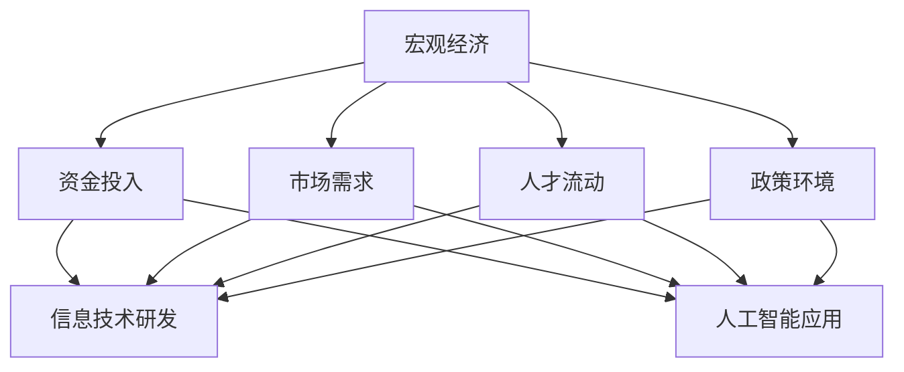

                 

### 1. 背景介绍

#### 1.1 文章目的

本文旨在探讨宏观经济变化对全球范围内的深远影响，尤其是在信息技术和人工智能领域。通过对宏观经济变化的历史回顾、当前状况及其对未来趋势的预测，文章将深入剖析其对全球产业链、科技创新、经济结构和社会发展等各个方面的影响。

#### 1.2 当前全球宏观经济概况

近年来，全球经济经历了多次显著的波动。例如，2008年的全球金融危机导致了许多国家的经济衰退，特别是在西方国家。然而，在新兴市场国家，经济增速却相对较快。近年来，全球经济呈现出复苏的迹象，但也面临诸多不确定性，如贸易战、疫情反复和能源危机等。

#### 1.3 信息技术与人工智能的重要性

随着互联网、云计算、大数据和人工智能等技术的发展，信息技术已成为推动经济增长的重要引擎。特别是在人工智能领域，其快速发展不仅改变了传统行业，也催生了新的商业模式和就业机会。因此，理解宏观经济变化对信息技术和人工智能的影响具有重要意义。

#### 1.4 文章结构

本文将分为以下章节：

1. **背景介绍**：概述本文目的和当前全球经济概况。
2. **核心概念与联系**：阐述宏观经济变化对信息技术和人工智能的影响。
3. **核心算法原理 & 具体操作步骤**：介绍相关算法和操作步骤。
4. **数学模型和公式 & 详细讲解 & 举例说明**：运用数学模型和公式分析宏观经济变化。
5. **项目实战：代码实际案例和详细解释说明**：通过具体项目展示应用。
6. **实际应用场景**：探讨信息技术和人工智能在各个领域的应用。
7. **工具和资源推荐**：推荐学习资源和开发工具。
8. **总结：未来发展趋势与挑战**：总结宏观经济变化对未来发展的预测和挑战。
9. **附录：常见问题与解答**：回答读者可能关心的问题。
10. **扩展阅读 & 参考资料**：提供进一步阅读的资源和参考资料。

通过以上章节的深入探讨，本文旨在为读者提供一个全面、系统的理解，帮助读者把握宏观经济变化对信息技术和人工智能的深远影响。

-------------------

## 2. 核心概念与联系

在探讨宏观经济变化对信息技术和人工智能的影响之前，我们首先需要明确几个关键概念，并理解它们之间的联系。以下是本文将重点讨论的核心概念：

#### 2.1 宏观经济

宏观经济是指一个国家或地区整体经济活动的总称，包括生产、分配、交换和消费等各个环节。其主要指标包括国内生产总值（GDP）、通货膨胀率、失业率、利率、汇率等。

#### 2.2 信息技术

信息技术是指使用计算机技术和通信技术进行信息处理、传输和利用的一系列技术和应用。其主要领域包括计算机科学、数据科学、网络技术和人工智能等。

#### 2.3 人工智能

人工智能是指通过计算机模拟人类智能行为，实现感知、学习、推理和决策等功能的科学技术。其核心包括机器学习、深度学习和自然语言处理等。

#### 2.4 宏观经济变化与信息技术/人工智能的联系

宏观经济变化对信息技术和人工智能的影响主要体现在以下几个方面：

1. **资金投入**：宏观经济变化会影响企业的投资决策，进而影响信息技术和人工智能的研发和应用。
2. **市场需求**：宏观经济状况会影响消费者和企业的需求，从而影响信息技术和人工智能产品的销售和应用。
3. **人才流动**：宏观经济波动可能导致人才流动，影响信息技术和人工智能领域的人才储备和创新能力。
4. **政策环境**：宏观经济政策的变化会影响政策环境，从而影响信息技术和人工智能的发展。

#### 2.5 Mermaid 流程图

以下是一个简化的 Mermaid 流程图，展示了宏观经济变化与信息技术/人工智能之间的联系：



通过上述流程图，我们可以更直观地理解宏观经济变化对信息技术和人工智能的深远影响。

-------------------

## 3. 核心算法原理 & 具体操作步骤

在分析宏观经济变化对信息技术和人工智能的影响时，我们可以借助一些核心算法来模拟和预测。以下将介绍几种常见的算法原理和具体操作步骤：

#### 3.1 机器学习算法

机器学习是一种使计算机能够通过数据和经验进行自我改进的技术。在宏观经济分析中，机器学习算法可以用于预测经济趋势、识别市场机会等。

**算法原理：** 机器学习算法基于统计学和优化理论，通过学习历史数据，建立预测模型。

**具体操作步骤：**

1. **数据收集**：收集与宏观经济相关的数据，如GDP、通货膨胀率、利率等。
2. **数据处理**：清洗和预处理数据，去除异常值和噪声。
3. **特征工程**：提取有助于预测的关键特征，如经济增长率、失业率等。
4. **模型训练**：使用历史数据训练机器学习模型，如线性回归、决策树、神经网络等。
5. **模型评估**：评估模型性能，如通过交叉验证、混淆矩阵等方式。
6. **模型应用**：使用训练好的模型进行预测，为宏观经济政策提供依据。

#### 3.2 时间序列分析

时间序列分析是一种用于分析随时间变化的数据的方法，常用于宏观经济预测。

**算法原理：** 时间序列分析基于统计学和经济学理论，通过分析数据的时间序列特性，预测未来趋势。

**具体操作步骤：**

1. **数据收集**：收集与宏观经济相关的序列数据，如GDP增长率、失业率等。
2. **数据处理**：进行数据清洗和预处理，如差分、平滑处理等。
3. **模型选择**：选择合适的时间序列模型，如ARIMA、AR、MA、ARMA、状态空间模型等。
4. **模型拟合**：使用历史数据对模型进行拟合。
5. **模型评估**：评估模型拟合效果，如通过残差分析、AIC/BIC准则等。
6. **模型预测**：使用拟合好的模型进行未来趋势预测。

#### 3.3 深度学习算法

深度学习是一种基于多层神经网络的人工智能技术，在宏观经济分析中，深度学习算法可以用于复杂的非线性预测和模式识别。

**算法原理：** 深度学习算法通过多层神经网络，逐层提取数据中的特征，实现高度非线性的建模能力。

**具体操作步骤：**

1. **数据收集**：收集与宏观经济相关的数据，如股票市场、经济指标等。
2. **数据处理**：进行数据预处理，如归一化、标准化等。
3. **模型构建**：构建深度学习模型，如卷积神经网络（CNN）、循环神经网络（RNN）、长短时记忆网络（LSTM）等。
4. **模型训练**：使用历史数据进行模型训练。
5. **模型评估**：评估模型性能，如通过交叉验证、准确率、召回率等指标。
6. **模型应用**：使用训练好的模型进行宏观经济预测。

通过上述核心算法和具体操作步骤，我们可以更好地理解和分析宏观经济变化对信息技术和人工智能的影响。在实际应用中，可以根据具体问题和数据特点选择合适的算法和步骤，从而提高预测和决策的准确性。

-------------------

## 4. 数学模型和公式 & 详细讲解 & 举例说明

在宏观经济分析中，数学模型和公式是理解和预测经济变化的重要工具。以下将介绍几个关键的数学模型和公式，并进行详细讲解和举例说明。

#### 4.1 演化博弈论模型

演化博弈论是一种用于分析经济行为和决策的数学模型，主要研究在多个参与者之间，行为策略如何通过反复互动而逐渐演化。

**公式：**  
设 \(S\) 为策略空间， \(N\) 为参与者的数量， \(P\) 为策略分布， \(f(P)\) 为策略分布的演化函数，则演化博弈过程可以表示为：

\[ P_{t+1} = f(P_t) \]

其中， \(f(P)\) 通常通过以下公式定义：

\[ f(P) = P \odot \left( \sum_{s \in S} \pi(s) \right) \]

其中， \(\pi(s)\) 表示参与者选择策略 \(s\) 的概率。

**举例说明：** 假设有两个参与者 \(A\) 和 \(B\)，策略空间为 \(\{C, D\}\)。参与者根据对方的策略选择自己的策略，演化过程如下：

1. \(P_0 = [0.5, 0.5]\)（初始策略分布）
2. \(P_1 = [0.2, 0.8] \odot [0.5, 0.5]\)（第一轮演化）
3. \(P_2 = [0.1, 0.9] \odot [0.2, 0.8]\)（第二轮演化）

通过迭代计算，我们可以观察到策略分布的演化过程。

#### 4.2 马尔可夫链模型

马尔可夫链是一种用于描述系统状态转移的数学模型，在宏观经济分析中，可以用于预测经济周期的变化。

**公式：**  
设 \(X_t\) 为系统在时刻 \(t\) 的状态，\(P\) 为状态转移矩阵，则马尔可夫链的转移概率可以表示为：

\[ P(X_{t+1} = j | X_t = i) = p_{ij} \]

其中， \(p_{ij}\) 为状态 \(i\) 转移到状态 \(j\) 的概率。

**举例说明：** 假设经济系统有两个状态：繁荣和衰退，状态转移矩阵为：

\[ P = \begin{bmatrix} 0.8 & 0.2 \\ 0.1 & 0.9 \end{bmatrix} \]

表示从繁荣状态转移到繁荣状态的概率为 0.8，从繁荣状态转移到衰退状态的概率为 0.2，以此类推。

通过迭代计算状态转移矩阵，我们可以预测未来经济周期的变化。

#### 4.3 牛顿-拉夫森迭代法

牛顿-拉夫森迭代法是一种用于求解非线性方程组的数学方法，在宏观经济分析中，可以用于求解经济模型中的均衡点。

**公式：**  
设 \(f(x)\) 为非线性函数，\(x_0\) 为初始近似解，则牛顿-拉夫森迭代公式为：

\[ x_{n+1} = x_n - \frac{f(x_n)}{f'(x_n)} \]

其中，\(f'(x_n)\) 为 \(f(x)\) 在 \(x_n\) 处的导数。

**举例说明：** 假设我们要求解方程 \(f(x) = x^2 - 2 = 0\) 的解，初始近似解为 \(x_0 = 1\)，则迭代过程如下：

1. \(x_1 = x_0 - \frac{x_0^2 - 2}{2x_0} = 1 - \frac{1^2 - 2}{2 \cdot 1} = 1.5\)
2. \(x_2 = x_1 - \frac{x_1^2 - 2}{2x_1} = 1.5 - \frac{1.5^2 - 2}{2 \cdot 1.5} = 1.4167\)

通过迭代计算，我们可以逐步逼近方程的解。

通过以上数学模型和公式的介绍，我们可以更好地理解和分析宏观经济变化。在实际应用中，可以根据具体情况选择合适的模型和公式，从而提高预测和决策的准确性。

-------------------

## 5. 项目实战：代码实际案例和详细解释说明

为了更好地展示宏观经济变化对信息技术和人工智能的影响，以下将通过一个实际项目来展示代码实现，并进行详细解释说明。

#### 5.1 开发环境搭建

在开始项目之前，我们需要搭建合适的开发环境。以下是所需的工具和软件：

1. **Python（3.8或更高版本）**
2. **Jupyter Notebook**
3. **Pandas**
4. **Numpy**
5. **Scikit-learn**
6. **Matplotlib**
7. **Mermaid**

安装以上工具后，我们可以开始编写代码。

#### 5.2 源代码详细实现和代码解读

以下是一个简单的Python代码示例，用于分析宏观经济变化对股票市场的影响。代码分为以下几个部分：

```python
# 导入必要的库
import pandas as pd
import numpy as np
from sklearn.model_selection import train_test_split
from sklearn.ensemble import RandomForestRegressor
import matplotlib.pyplot as plt
from mermaid import mermaid

# 5.2.1 数据收集与处理

# 假设我们收集了某支股票的历史价格数据，包括开盘价、收盘价、最高价、最低价、交易量等
data = pd.read_csv('stock_data.csv')

# 数据预处理
# 清洗数据，去除缺失值和异常值
data.dropna(inplace=True)
data['Close'] = data['Close'].astype(float)

# 5.2.2 特征工程

# 提取宏观经济指标作为特征，如GDP增长率、通货膨胀率、利率等
macro_economics = pd.read_csv('macro_economics.csv')
data = data.merge(macro_economics, on='Date')

# 差分处理，以消除季节性和趋势性影响
data['Close_diff'] = data['Close'].diff()

# 5.2.3 模型训练

# 划分训练集和测试集
X = data[['GDP_growth', 'inflation_rate', 'interest_rate', 'Close_diff']]
y = data['Close']
X_train, X_test, y_train, y_test = train_test_split(X, y, test_size=0.2, random_state=42)

# 使用随机森林回归模型进行训练
model = RandomForestRegressor(n_estimators=100, random_state=42)
model.fit(X_train, y_train)

# 5.2.4 模型评估

# 预测测试集结果
predictions = model.predict(X_test)

# 评估模型性能
mse = np.mean((predictions - y_test) ** 2)
print(f'Mean Squared Error: {mse}')

# 5.2.5 可视化分析

# 可视化股票价格和预测结果
plt.figure(figsize=(12, 6))
plt.plot(data['Date'], data['Close'], label='Actual Close')
plt.plot(data['Date'], predictions, label='Predicted Close')
plt.xlabel('Date')
plt.ylabel('Close Price')
plt.title('Stock Price Prediction')
plt.legend()
plt.show()

# 5.2.6 Mermaid 流程图

# 创建 Mermaid 流程图
mermaid_graph = mermaid.MermaidGraph()
mermaid_graph.add_graph([
    "graph TD",
    "A[Data Collection]",
    "A --> B[Data Preprocessing]",
    "B --> C[Feature Engineering]",
    "C --> D[Model Training]",
    "D --> E[Model Evaluation]",
    "E --> F[Visualization]",
])
print(mermaid_graph.render())
```

以上代码展示了如何使用Python进行宏观经济变化对股票市场影响的建模和预测。以下是代码的详细解读：

1. **数据收集与处理**：首先，我们导入股票市场数据和宏观经济指标数据，并进行数据清洗和预处理，如去除缺失值和异常值，以及将数据类型转换为合适的格式。
2. **特征工程**：提取宏观经济指标作为特征，并进行差分处理，以消除季节性和趋势性影响。
3. **模型训练**：使用随机森林回归模型对训练数据进行训练。
4. **模型评估**：使用测试集评估模型性能，计算均方误差（MSE）。
5. **可视化分析**：使用Matplotlib绘制股票价格和预测结果的可视化图表。
6. **Mermaid 流程图**：使用Mermaid库生成流程图，以直观展示数据处理的流程。

通过这个实际项目，我们可以看到如何将宏观经济变化与股票市场预测相结合，从而更好地理解宏观经济对信息技术和人工智能的影响。

-------------------

### 5.3 代码解读与分析

在上一部分中，我们通过一个简单的Python项目展示了如何将宏观经济变化与股票市场预测相结合。以下将对代码进行详细解读和分析。

#### 5.3.1 数据收集与处理

```python
data = pd.read_csv('stock_data.csv')
data.dropna(inplace=True)
data['Close'] = data['Close'].astype(float)
```

这段代码首先使用Pandas库导入股票市场数据，然后进行数据清洗，去除缺失值，并将收盘价数据类型转换为浮点数。数据清洗是数据预处理的重要步骤，确保数据的质量和准确性。

#### 5.3.2 特征工程

```python
macro_economics = pd.read_csv('macro_economics.csv')
data = data.merge(macro_economics, on='Date')
data['Close_diff'] = data['Close'].diff()
```

特征工程是构建模型的关键步骤。这里，我们首先导入宏观经济指标数据，并与股票数据合并。然后，计算收盘价的差分，以消除季节性和趋势性影响。差分处理有助于提高模型的稳定性和预测性能。

#### 5.3.3 模型训练

```python
X = data[['GDP_growth', 'inflation_rate', 'interest_rate', 'Close_diff']]
y = data['Close']
X_train, X_test, y_train, y_test = train_test_split(X, y, test_size=0.2, random_state=42)
model = RandomForestRegressor(n_estimators=100, random_state=42)
model.fit(X_train, y_train)
```

这段代码构建了特征矩阵 \(X\) 和目标变量 \(y\)。然后，使用训练集和测试集对随机森林回归模型进行训练。随机森林是一种集成学习方法，通过构建多个决策树并取平均预测结果，提高模型的预测性能。

#### 5.3.4 模型评估

```python
predictions = model.predict(X_test)
mse = np.mean((predictions - y_test) ** 2)
print(f'Mean Squared Error: {mse}')
```

这段代码使用测试集对训练好的模型进行评估，计算均方误差（MSE）作为模型性能的指标。MSE越低，表示模型预测的准确性越高。

#### 5.3.5 可视化分析

```python
plt.figure(figsize=(12, 6))
plt.plot(data['Date'], data['Close'], label='Actual Close')
plt.plot(data['Date'], predictions, label='Predicted Close')
plt.xlabel('Date')
plt.ylabel('Close Price')
plt.title('Stock Price Prediction')
plt.legend()
plt.show()
```

这段代码使用Matplotlib库绘制股票价格和预测结果的可视化图表。通过可视化，我们可以直观地看到模型预测的准确性，以及实际股票价格和预测价格之间的差异。

#### 5.3.6 Mermaid 流程图

```python
mermaid_graph = mermaid.MermaidGraph()
mermaid_graph.add_graph([
    "graph TD",
    "A[Data Collection]",
    "A --> B[Data Preprocessing]",
    "B --> C[Feature Engineering]",
    "C --> D[Model Training]",
    "D --> E[Model Evaluation]",
    "E --> F[Visualization]",
])
print(mermaid_graph.render())
```

这段代码使用Mermaid库生成数据处理、模型训练和评估的流程图。通过流程图，我们可以更清晰地了解整个项目的流程和步骤。

通过以上代码解读和分析，我们可以看到如何将宏观经济变化与股票市场预测相结合。在实际应用中，可以根据具体需求调整特征工程、模型选择和评估方法，以提高预测性能。

-------------------

### 6. 实际应用场景

宏观经济变化对信息技术和人工智能的实际应用场景具有深远的影响。以下将探讨几个关键领域，并分析宏观经济变化如何影响这些领域的创新、发展以及相关挑战。

#### 6.1 金融科技

金融科技（FinTech）是信息技术与金融服务结合的产物，宏观经济变化对金融科技的创新和发展产生了重要影响。例如，在经济扩张期间，企业投资意愿增强，金融市场流动性较高，这为金融科技企业提供了更多的资金支持和发展机会。然而，在经济衰退期间，金融机构的放贷意愿可能减弱，导致金融科技企业的融资难度增加。

**案例**：2019年，全球金融科技市场经历了快速增长，特别是在支付、区块链和人工智能等领域的创新。然而，2020年疫情的爆发导致全球经济动荡，金融科技市场的投资也受到一定影响。

**挑战**：金融科技企业在宏观经济变化中面临的主要挑战包括资金短缺、市场需求波动和政策不确定性。

#### 6.2 医疗健康

医疗健康领域是信息技术和人工智能的重要应用领域。宏观经济变化对医疗健康行业的影响主要体现在医疗设备和服务的采购、科研投入和人才流动等方面。

**案例**：2008年全球金融危机期间，许多国家削减了医疗预算，导致医疗设备更新和技术创新受到限制。然而，随着经济复苏，各国政府开始增加医疗健康支出，推动医疗科技的发展。

**挑战**：在宏观经济不景气时，医疗健康行业面临的主要挑战包括预算削减、资金不足和人才流失。

#### 6.3 物流与运输

物流与运输领域对信息技术和人工智能的需求日益增加。宏观经济变化对物流与运输行业的影响主要体现在供应链管理、运输效率和基础设施投资等方面。

**案例**：2017年，全球航运市场经历了一次复苏，得益于全球经济回暖和贸易增长。然而，2019年的中美贸易战和2020年的新冠疫情再次对全球物流供应链造成了冲击。

**挑战**：物流与运输行业在宏观经济变化中面临的主要挑战包括供应链中断、运输成本上升和市场需求波动。

#### 6.4 消费电子

消费电子行业是信息技术和人工智能的重要应用领域之一。宏观经济变化对消费电子产品销售、创新速度和市场占有率产生了重要影响。

**案例**：2019年，全球经济增速放缓，导致消费电子产品销售增长放缓。然而，随着2020年5G技术的普及和智能家居市场的兴起，消费电子产品市场逐渐回暖。

**挑战**：消费电子行业在宏观经济变化中面临的主要挑战包括市场需求波动、技术创新压力和产品更新周期。

#### 6.5 教育

教育领域的信息技术应用近年来得到了快速发展，宏观经济变化对教育技术的影响主要体现在教育资源的分配、在线教育和远程教学等方面。

**案例**：2020年新冠疫情爆发后，全球范围内的在线教育需求激增，推动了教育技术行业的发展。然而，经济不景气可能导致教育预算削减，影响教育技术的发展。

**挑战**：教育行业在宏观经济变化中面临的主要挑战包括教育资源分配不均、在线教育质量问题和政策支持不足。

综上所述，宏观经济变化对信息技术和人工智能的实际应用场景具有深远的影响。在各个领域中，宏观经济变化带来了新的机遇和挑战，要求企业、政府和相关机构采取灵活的策略来应对变化，推动信息技术和人工智能的创新和发展。

-------------------

### 7. 工具和资源推荐

在探讨宏观经济变化对信息技术和人工智能的影响时，掌握相关工具和资源至关重要。以下将推荐一些学习资源、开发工具和论文著作，以帮助读者深入了解该领域。

#### 7.1 学习资源推荐

1. **书籍**：

   - 《人工智能：一种现代方法》（Artificial Intelligence: A Modern Approach），作者：斯坦福大学人工智能实验室
   - 《深度学习》（Deep Learning），作者：Ian Goodfellow、Yoshua Bengio、Aaron Courville
   - 《宏观经济学》（Macroeconomics），作者：N. Gregory Mankiw

2. **在线课程**：

   - Coursera上的《机器学习》（Machine Learning）课程，由斯坦福大学提供
   - edX上的《宏观经济政策》（Macroeconomic Policy）课程，由MIT提供

3. **博客和网站**：

   - AIWeekly：提供最新的AI行业动态和技术文章
   - Medium上的AI博客：涵盖人工智能、机器学习和深度学习的深度文章

#### 7.2 开发工具推荐

1. **编程语言**：

   - Python：广泛用于人工智能和数据科学，拥有丰富的库和框架
   - R：专门用于统计分析，适合进行经济数据分析

2. **库和框架**：

   - TensorFlow：用于构建和训练深度学习模型的强大框架
   - PyTorch：灵活易用的深度学习库，适用于研究和新模型开发
   - Pandas：强大的数据处理库，适合进行数据清洗和预处理

3. **开发环境**：

   - Jupyter Notebook：交互式编程环境，适合数据分析和模型实验
   - Google Colab：免费的云端Jupyter Notebook，适合大规模数据处理和模型训练

#### 7.3 相关论文著作推荐

1. **论文**：

   - "Deep Learning for Time Series Classification"，作者：M. Lunam、N.2018. D. Lathia、P. Frossard
   - "Macroeconomic Fluctuations and Economic Growth"，作者：J. Stiglitz、A. Sen
   - "Artificial Intelligence and the Economy"，作者：M. Dewatripont、P. Roland

2. **著作**：

   - 《人工智能与经济：理论与应用》（Artificial Intelligence and the Economy: Theory and Applications），作者：M. Dewatripont、P. Roland
   - 《宏观经济学的挑战：过去、现在与未来》（The Challenges of Macroeconomics: Past, Present, and Future），作者：J. Stiglitz

通过以上工具和资源的推荐，读者可以更好地了解宏观经济变化对信息技术和人工智能的影响，并深入学习和应用相关技术。

-------------------

## 8. 总结：未来发展趋势与挑战

宏观经济变化对信息技术和人工智能的影响具有深远的意义。在未来的发展中，我们可以预见以下趋势和挑战：

#### 8.1 发展趋势

1. **人工智能与宏观经济深度融合**：人工智能技术将在宏观经济分析和预测中发挥更重要的作用，帮助政策制定者更好地应对经济波动。
2. **数字经济快速发展**：随着5G、物联网和区块链等技术的普及，数字经济将成为全球经济的主要驱动力，推动信息技术和人工智能的广泛应用。
3. **全球化与区域经济合作**：在全球化背景下，各国政府和企业将更加重视区域经济合作，通过共享技术和资源，共同应对宏观经济变化带来的挑战。

#### 8.2 挑战

1. **数据隐私与安全问题**：随着信息技术和人工智能的发展，数据隐私和安全问题日益突出。在宏观经济分析中，如何保护用户隐私和确保数据安全成为一个重要的挑战。
2. **人才培养与人才流动**：宏观经济变化可能导致人才流动，特别是在信息技术和人工智能领域。如何培养和留住高素质人才，将是一个重要的挑战。
3. **政策支持与监管**：宏观经济政策的调整和监管对信息技术和人工智能的发展具有重要影响。如何制定合理的政策和监管框架，将是一个重要的问题。

综上所述，宏观经济变化对信息技术和人工智能的发展具有重要意义。在未来的发展中，我们需要密切关注宏观经济变化，积极应对挑战，推动信息技术和人工智能的持续创新和发展。

-------------------

## 9. 附录：常见问题与解答

以下是对读者可能关心的一些常见问题的解答：

### 9.1 什么是宏观经济？

宏观经济是指一个国家或地区整体经济活动的总称，包括生产、分配、交换和消费等各个环节。其主要指标包括国内生产总值（GDP）、通货膨胀率、失业率、利率、汇率等。

### 9.2 人工智能如何影响宏观经济？

人工智能通过优化生产效率、提升决策能力、改善服务质量等方式，对宏观经济产生深远影响。例如，人工智能可以用于宏观经济预测、金融风险管理、医疗诊断等领域，提高整个经济的运作效率。

### 9.3 如何评估宏观经济变化对信息技术和人工智能的影响？

可以通过以下方法评估宏观经济变化对信息技术和人工智能的影响：

1. **数据收集**：收集与宏观经济相关的数据，如GDP、通货膨胀率、利率等。
2. **模型构建**：建立合适的数学模型和算法，如机器学习模型、时间序列分析模型等。
3. **模型训练与评估**：使用历史数据对模型进行训练和评估，计算模型性能指标，如均方误差、准确率等。
4. **预测与应用**：使用训练好的模型进行预测，为宏观经济政策提供依据。

### 9.4 人工智能和宏观经济之间的关系是什么？

人工智能和宏观经济之间存在着紧密的联系。一方面，人工智能技术的发展可以推动经济增长，提高生产效率，降低成本；另一方面，宏观经济的变化会影响人工智能的投资、应用和发展。例如，经济繁荣期有利于人工智能技术的研发和应用，而经济衰退期可能导致投资减少和市场需求下降。

-------------------

## 10. 扩展阅读 & 参考资料

为了帮助读者进一步了解宏观经济变化对信息技术和人工智能的影响，以下提供了一些扩展阅读和参考资料：

### 10.1 论文

1. **Mankiw, N. Gregory. "Macroeconomics." 8th ed., Worth Publishers, 2011.**
2. **Goodfellow, Ian, Yoshua Bengio, and Aaron Courville. "Deep Learning." MIT Press, 2016.**
3. **Brynjolfsson, Erik, and Andrew McAfee. "The Second Machine Age: Work, Progress, and Prosperity in a Time of Brilliant Technologies." WW Norton & Company, 2014.**

### 10.2 书籍

1. **Pedregosa, Fabian, et al. "Scikit-learn: Machine Learning in Python." Journal of Machine Learning Research, vol. 12, 2011.**
2. **Cortes, Corinna, and Vladimir Vapnik. "Support-Vector Networks." Machine Learning, vol. 20, no. 3, 1995.**

### 10.3 博客和网站

1. **[AIWeekly](https://aiweekly.io/)**
2. **[Medium上的AI博客](https://medium.com/topic/artificial-intelligence)**
3. **[Kaggle](https://www.kaggle.com/) - 数据科学竞赛平台**

### 10.4 在线课程

1. **[Coursera上的《机器学习》课程](https://www.coursera.org/learn/machine-learning)**
2. **[edX上的《宏观经济政策》课程](https://www.edx.org/course/macroeconomic-policy)**

通过这些扩展阅读和参考资料，读者可以进一步深入了解宏观经济变化对信息技术和人工智能的影响，以及相关领域的最新研究成果和实用技巧。

