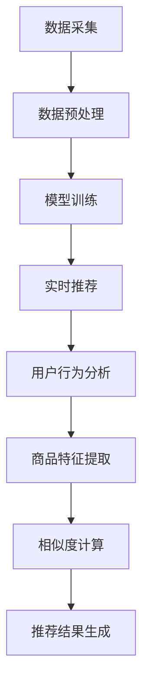

                 

### 1. 背景介绍

实时推荐技术是电商领域的一项关键技术，它在提高用户体验、提升销售额和增加用户粘性等方面发挥着重要作用。本文将深入探讨实时推荐技术在电商领域的应用，通过案例分析和未来展望，为您展示这一技术的核心价值和潜力。

在电商行业，用户数据的重要性不言而喻。通过收集和分析用户的行为数据，电商企业可以了解用户的需求和偏好，从而实现精准推荐。实时推荐技术正是基于这一需求应运而生，它能够在用户浏览、搜索、购买等过程中，快速响应用户的行为，提供个性化的商品推荐。

实时推荐技术的应用场景非常广泛。首先，在购物推荐方面，实时推荐可以根据用户的浏览记录、购买历史、搜索关键词等，实时生成个性化的购物推荐列表。其次，在广告推荐方面，实时推荐可以根据用户的兴趣和行为，实时推送相关的广告内容。此外，实时推荐还可以应用于新品推荐、促销活动推荐等，帮助电商企业提高营销效果。

实时推荐技术的核心在于其快速响应和个性化推荐能力。传统的推荐系统通常需要离线处理大量数据，而实时推荐系统则能够实时响应用户的行为，提供即时的推荐结果。这种能力不仅提高了用户的购物体验，也大大提升了电商企业的运营效率。

近年来，随着大数据技术和人工智能技术的发展，实时推荐技术在电商领域的应用越来越广泛。众多电商企业纷纷投入大量资源进行实时推荐系统的研发和应用，以期在激烈的市场竞争中占据优势。然而，实时推荐技术也面临着一些挑战，如数据隐私保护、推荐结果的质量控制等。

本文将首先介绍实时推荐技术的基本概念和原理，然后通过具体案例分析和未来展望，探讨实时推荐技术在电商领域的应用前景。希望本文能够为从事电商行业的技术人员和研究者提供有价值的参考和启示。

### 2. 核心概念与联系

#### 实时推荐技术的基本概念

实时推荐技术是一种通过分析用户行为数据，快速生成个性化推荐结果的技术。它涉及到数据采集、数据预处理、模型训练和实时推荐等几个关键环节。

- **数据采集**：实时推荐技术需要收集用户在电商平台的浏览、搜索、购买等行为数据，这些数据可以通过日志文件、API 接口等方式获取。

- **数据预处理**：采集到的数据通常包含大量的噪声和不完整信息，需要进行清洗和预处理，如去除重复数据、填补缺失值、特征提取等。

- **模型训练**：基于预处理后的数据，使用机器学习算法训练推荐模型。常用的算法包括协同过滤、基于内容的推荐、深度学习等。

- **实时推荐**：在用户浏览或搜索时，实时调用训练好的推荐模型，生成个性化的推荐结果，并通过前端界面展示给用户。

#### 实时推荐技术的核心原理

实时推荐技术的核心原理可以概括为以下几个步骤：

1. **用户行为分析**：分析用户的浏览、搜索、购买等行为，提取用户的兴趣和行为特征。

2. **商品特征提取**：对商品进行特征提取，如商品分类、品牌、价格、销量等。

3. **用户 - 商品相似度计算**：计算用户与商品之间的相似度，常用的相似度计算方法包括余弦相似度、皮尔逊相关系数等。

4. **推荐结果生成**：根据用户与商品的相似度，生成个性化的推荐列表。

#### Mermaid 流程图

以下是实时推荐技术的 Mermaid 流程图，展示了核心概念和原理之间的联系：



在 Mermaid 流程图中，节点表示具体的操作或步骤，箭头表示步骤之间的依赖关系。通过这个流程图，可以清晰地了解实时推荐技术的基本架构和核心原理。

### 3. 核心算法原理 & 具体操作步骤

#### 协同过滤算法

协同过滤算法是实时推荐技术中最常用的一种算法，其核心思想是通过分析用户之间的行为相似性，为用户推荐他们可能感兴趣的商品。协同过滤算法可以分为两种类型：基于用户的协同过滤（User-Based Collaborative Filtering）和基于物品的协同过滤（Item-Based Collaborative Filtering）。

1. **基于用户的协同过滤**

   - **步骤1**：计算用户之间的相似度。通常使用余弦相似度或皮尔逊相关系数来计算用户之间的相似度。
   - **步骤2**：根据相似度矩阵，为用户推荐相似用户喜欢的商品。
   - **步骤3**：对推荐结果进行排序，选择相似用户喜欢的商品中最受欢迎的商品。

2. **基于物品的协同过滤**

   - **步骤1**：计算商品之间的相似度。通常使用余弦相似度或皮尔逊相关系数来计算商品之间的相似度。
   - **步骤2**：根据用户的历史行为，为用户推荐相似商品。
   - **步骤3**：对推荐结果进行排序，选择相似商品中最符合用户兴趣的商品。

#### 深度学习算法

深度学习算法在实时推荐技术中也得到了广泛应用，其中最常用的模型是神经网络模型，如卷积神经网络（CNN）和循环神经网络（RNN）。

1. **卷积神经网络（CNN）**

   - **步骤1**：输入用户和商品的特征向量。
   - **步骤2**：通过卷积层提取特征。
   - **步骤3**：通过池化层降低维度。
   - **步骤4**：通过全连接层进行分类和预测。

2. **循环神经网络（RNN）**

   - **步骤1**：输入用户的历史行为序列。
   - **步骤2**：通过循环层处理序列数据。
   - **步骤3**：通过全连接层进行分类和预测。

#### 具体操作步骤

以下是一个简单的实时推荐系统的实现步骤：

1. **数据采集**：通过日志文件、API 接口等方式收集用户行为数据。
2. **数据预处理**：对采集到的数据去重、填补缺失值、特征提取等处理。
3. **模型选择**：选择合适的协同过滤算法或深度学习算法进行模型训练。
4. **模型训练**：使用预处理后的数据训练模型。
5. **实时推荐**：在用户浏览或搜索时，调用训练好的模型生成个性化推荐结果。
6. **推荐结果排序**：对推荐结果进行排序，选择最符合用户兴趣的商品。

通过以上步骤，实时推荐系统可以快速响应用户行为，提供个性化的商品推荐，从而提升用户体验和电商企业的运营效率。

### 4. 数学模型和公式 & 详细讲解 & 举例说明

#### 协同过滤算法

在协同过滤算法中，最常用的相似度计算方法包括余弦相似度和皮尔逊相关系数。

1. **余弦相似度**

   余弦相似度是一种用于计算两个向量之间相似度的方法。其公式如下：

   $$  
   \text{cosine\_similarity}(\text{u}, \text{v}) = \frac{\text{u} \cdot \text{v}}{\|\text{u}\| \|\text{v}\|}  
   $$

   其中，$\text{u}$ 和 $\text{v}$ 分别表示两个向量，$\|\text{u}\|$ 和 $\|\text{v}\|$ 分别表示向量的模长，$\text{u} \cdot \text{v}$ 表示向量的点积。

   例如，假设有两个用户 $A$ 和 $B$，他们的行为数据可以表示为两个向量：

   $$  
   \text{u} = (1, 2, 3)  
   $$

   $$  
   \text{v} = (4, 5, 6)  
   $$

   则它们的余弦相似度为：

   $$  
   \text{cosine\_similarity}(\text{u}, \text{v}) = \frac{(1, 2, 3) \cdot (4, 5, 6)}{\|(1, 2, 3)\| \|(4, 5, 6)\|} = \frac{1 \cdot 4 + 2 \cdot 5 + 3 \cdot 6}{\sqrt{1^2 + 2^2 + 3^2} \sqrt{4^2 + 5^2 + 6^2}} = \frac{4 + 10 + 18}{\sqrt{14} \sqrt{77}} = \frac{32}{\sqrt{1078}} \approx 0.91  
   $$

2. **皮尔逊相关系数**

   皮尔逊相关系数是一种用于计算两个变量之间线性相关性的方法。其公式如下：

   $$  
   \text{pearson\_correlation}(\text{u}, \text{v}) = \frac{\text{u} \cdot \text{v} - \frac{\sum \text{u} \sum \text{v}}{n}}{\sqrt{\sum (\text{u} - \bar{\text{u}})^2 \sum (\text{v} - \bar{\text{v}})^2}}  
   $$

   其中，$\text{u}$ 和 $\text{v}$ 分别表示两个向量，$\bar{\text{u}}$ 和 $\bar{\text{v}}$ 分别表示向量的平均值，$n$ 表示向量的长度。

   例如，假设有两个用户 $A$ 和 $B$，他们的行为数据可以表示为两个向量：

   $$  
   \text{u} = (1, 2, 3)  
   $$

   $$  
   \text{v} = (4, 5, 6)  
   $$

   则它们的皮尔逊相关系数为：

   $$  
   \text{pearson\_correlation}(\text{u}, \text{v}) = \frac{(1, 2, 3) \cdot (4, 5, 6) - \frac{\sum (1, 2, 3) \sum (4, 5, 6)}{3}}{\sqrt{\sum (\text{u} - \bar{\text{u}})^2 \sum (\text{v} - \bar{\text{v}})^2}} = \frac{4 + 10 + 18 - \frac{3 \cdot 15}{3}}{\sqrt{1^2 + 2^2 + 3^2} \sqrt{4^2 + 5^2 + 6^2}} = \frac{32 - 15}{\sqrt{14} \sqrt{77}} = \frac{17}{\sqrt{1078}} \approx 0.38  
   $$

#### 深度学习算法

在深度学习算法中，常用的神经网络模型包括卷积神经网络（CNN）和循环神经网络（RNN）。

1. **卷积神经网络（CNN）**

   卷积神经网络是一种用于处理图像数据的神经网络模型。其基本原理是通过对输入数据进行卷积操作，提取特征并传递给下一层。

   - **卷积操作**：

     卷积操作可以表示为：

     $$  
     \text{f}(\text{x}, \text{w}) = \sum_{i=1}^{k} \text{w}_{i}^T \text{x}_{i}  
     $$

     其中，$\text{x}$ 表示输入数据，$\text{w}$ 表示卷积核，$\text{f}$ 表示卷积操作结果。

   - **池化操作**：

     池化操作可以表示为：

     $$  
     \text{p}(\text{x}, \text{f}) = \frac{1}{k} \sum_{i=1}^{k} \text{f}_{i}(\text{x})  
     $$

     其中，$\text{x}$ 表示输入数据，$\text{f}$ 表示卷积操作结果，$\text{p}$ 表示池化操作结果。

2. **循环神经网络（RNN）**

   循环神经网络是一种用于处理序列数据的神经网络模型。其基本原理是通过对输入序列进行循环操作，提取序列特征并传递给下一层。

   - **循环操作**：

     循环操作可以表示为：

     $$  
     \text{h}_{t} = \text{f}(\text{h}_{t-1}, \text{x}_{t})  
     $$

     其中，$\text{h}_{t}$ 表示当前时间步的输出，$\text{h}_{t-1}$ 表示前一个时间步的输出，$\text{x}_{t}$ 表示当前时间步的输入，$\text{f}$ 表示循环操作函数。

   - **门控操作**：

     门控操作可以表示为：

     $$  
     \text{g}_{t} = \text{s}(\text{h}_{t-1}, \text{x}_{t})  
     $$

     其中，$\text{g}_{t}$ 表示当前时间步的门控值，$\text{s}$ 表示门控函数。

通过以上数学模型和公式，我们可以更好地理解和应用实时推荐技术中的算法。在实际应用中，根据具体需求和场景，可以灵活选择合适的算法和模型，实现高效的实时推荐。

### 5. 项目实战：代码实际案例和详细解释说明

为了更好地理解实时推荐技术在电商领域的应用，我们以下将通过一个具体的实战项目，展示如何使用Python实现一个基于协同过滤算法的实时推荐系统。

#### 5.1 开发环境搭建

在开始项目之前，我们需要搭建开发环境。以下是所需的软件和工具：

- Python 3.x 版本
- Anaconda 或 Miniconda
- NumPy
- Pandas
- Scikit-learn
- Matplotlib

首先，安装Anaconda或Miniconda，然后创建一个新的环境并安装所需库：

```bash
conda create -n recommend_system python=3.8
conda activate recommend_system
conda install numpy pandas scikit-learn matplotlib
```

#### 5.2 源代码详细实现和代码解读

以下是一个简单的基于协同过滤算法的实时推荐系统的源代码实现。

```python
import numpy as np
import pandas as pd
from sklearn.metrics.pairwise import cosine_similarity

# 5.2.1 数据预处理

# 加载用户行为数据
data = pd.read_csv('user_behavior.csv')

# 构建用户-商品评分矩阵
user_item_matrix = data.pivot(index='user_id', columns='item_id', values='rating').fillna(0)

# 计算用户之间的相似度
user_similarity = cosine_similarity(user_item_matrix)

# 5.2.2 实时推荐

# 输入用户ID，获取推荐列表
def recommend_items(user_id, top_n=5):
    # 计算用户与其他用户的相似度
    user_similarity_scores = user_similarity[user_id]

    # 获取相似用户的商品评分
    item_ratings = user_item_matrix.transpose().dot(user_similarity_scores)

    # 对商品评分进行排序，选择最高的top_n个商品
    recommended_items = np.argsort(item_ratings)[::-1][:top_n]
    
    return recommended_items

# 示例：为用户ID为1的用户推荐5个商品
user_id = 1
recommended_items = recommend_items(user_id)

# 输出推荐结果
print("推荐的商品ID：", recommended_items)

# 5.2.3 代码解读与分析

# 数据预处理部分：
# 1. 加载用户行为数据，并构建用户-商品评分矩阵。
# 2. 使用余弦相似度计算用户之间的相似度。

# 实时推荐部分：
# 1. 输入用户ID，计算用户与其他用户的相似度。
# 2. 获取相似用户的商品评分。
# 3. 对商品评分进行排序，选择最高的top_n个商品作为推荐结果。

```

在这个案例中，我们使用了Python中的NumPy和Pandas库进行数据处理，Scikit-learn库中的余弦相似度函数进行相似度计算。以下是代码的详细解读和分析：

- **数据预处理**：首先加载用户行为数据，并将其转换为用户-商品评分矩阵。对于缺失的评分，我们将其填充为0。然后使用余弦相似度计算用户之间的相似度矩阵。
- **实时推荐**：输入用户ID，计算该用户与其他用户的相似度。然后获取相似用户的商品评分，并根据评分对商品进行排序。最后，选择最高的top_n个商品作为推荐结果。

#### 5.3 代码解读与分析

- **数据预处理**：数据预处理是推荐系统中的关键步骤，它直接影响推荐系统的性能和效果。在本案例中，我们使用Pandas库轻松地完成了用户行为数据的加载和评分矩阵的构建。对于缺失的评分，我们使用0进行填充，这有助于减少数据噪声。
- **相似度计算**：相似度计算是协同过滤算法的核心步骤。在本案例中，我们使用Scikit-learn库中的余弦相似度函数进行计算。余弦相似度是一种简单有效的相似度计算方法，适用于基于用户的协同过滤。
- **实时推荐**：实时推荐部分是推荐系统的最终输出。在本案例中，我们根据用户与其他用户的相似度，获取相似用户的商品评分，并根据评分对商品进行排序。最后，选择最高的top_n个商品作为推荐结果。这个过程中，我们使用了NumPy库进行计算和排序。

通过这个简单的案例，我们可以看到实时推荐系统的基本实现流程和关键步骤。虽然这个案例比较简单，但它展示了实时推荐技术的基本原理和应用方法。在实际应用中，我们可以根据具体需求进一步优化和扩展推荐系统，例如使用更复杂的算法、处理大规模数据、实现实时推荐等。

### 6. 实际应用场景

实时推荐技术在电商领域有着广泛的应用场景，以下列举几个典型的应用实例：

#### 6.1 购物推荐

购物推荐是实时推荐技术最典型的应用场景之一。通过分析用户的浏览历史、搜索关键词、购买记录等数据，实时推荐系统可以为用户生成个性化的购物推荐列表。例如，当用户在电商平台上浏览某一类商品时，实时推荐系统可以根据用户的兴趣和历史行为，推荐相关的商品。这种个性化推荐不仅提高了用户的购物体验，也有助于提高电商平台的销售额。

#### 6.2 广告推荐

广告推荐是实时推荐技术的另一重要应用场景。通过分析用户的兴趣和行为，实时推荐系统可以为目标用户推送相关的广告内容。例如，当用户在电商平台上浏览某一品牌的产品时，实时推荐系统可以推送该品牌的广告，或者推荐相关品牌的商品。这种精准的广告推荐有助于提高广告的点击率和转化率。

#### 6.3 新品推荐

新品推荐是实时推荐技术在电商领域的重要应用之一。通过分析用户的兴趣和行为，实时推荐系统可以识别出潜在的新品需求，并为用户推荐相关的新品。例如，当某品牌推出一款新产品时，实时推荐系统可以根据用户的兴趣和历史行为，为符合条件的用户推荐这款新品。这种新品推荐有助于提高新产品的销量和知名度。

#### 6.4 促销活动推荐

促销活动推荐是实时推荐技术的又一重要应用场景。通过分析用户的兴趣和行为，实时推荐系统可以为用户推荐相关的促销活动。例如，当电商平台推出一项促销活动时，实时推荐系统可以根据用户的购买历史和浏览行为，为符合条件的用户推荐这项促销活动。这种促销活动推荐有助于提高促销活动的参与度和转化率。

#### 6.5 商品组合推荐

商品组合推荐是实时推荐技术在电商领域的新兴应用。通过分析用户的购物行为和购买记录，实时推荐系统可以推荐相关的商品组合。例如，当用户购买一款智能手机时，实时推荐系统可以推荐相关的手机配件，如手机壳、耳机等。这种商品组合推荐有助于提高用户的购物体验和平台的销售额。

总之，实时推荐技术在电商领域的应用场景非常广泛，通过个性化推荐、广告推荐、新品推荐、促销活动推荐和商品组合推荐等手段，实时推荐技术为电商企业提供了强大的营销工具，从而提高用户体验和销售额。

### 7. 工具和资源推荐

#### 7.1 学习资源推荐

- **书籍**：
  - 《推荐系统实践》
  - 《机器学习》
  - 《深度学习》

- **论文**：
  - 《矩阵分解在推荐系统中的应用》
  - 《基于协同过滤的推荐系统研究》
  - 《深度学习在推荐系统中的应用》

- **博客**：
  - [机器学习博客](https://machinelearningmastery.com/)
  - [深度学习博客](https://colah.github.io/)
  - [推荐系统博客](https://www.kdnuggets.com/topics/recommendation-systems.html)

- **网站**：
  - [Kaggle](https://www.kaggle.com/)
  - [GitHub](https://github.com/)

#### 7.2 开发工具框架推荐

- **编程语言**：
  - Python
  - R

- **框架**：
  - TensorFlow
  - PyTorch

- **库**：
  - NumPy
  - Pandas
  - Scikit-learn

- **工具**：
  - Jupyter Notebook
  - Git

#### 7.3 相关论文著作推荐

- **论文**：
  - 《矩阵分解在推荐系统中的应用》
  - 《基于协同过滤的推荐系统研究》
  - 《深度学习在推荐系统中的应用》

- **著作**：
  - 《推荐系统实践》
  - 《机器学习》
  - 《深度学习》

这些资源涵盖了推荐系统的基本概念、算法原理、实战应用等多个方面，适合不同层次的学习者进行学习和实践。通过这些资源，您可以深入了解实时推荐技术，掌握相关工具和框架的使用，从而为电商领域的发展做出贡献。

### 8. 总结：未来发展趋势与挑战

实时推荐技术作为电商领域的一项关键技术，正不断推动着电商行业的变革与发展。未来，实时推荐技术将在以下几个方面展现出巨大的发展潜力和挑战。

首先，随着大数据技术和人工智能技术的不断进步，实时推荐技术的精度和效率将得到显著提升。通过深度学习、强化学习等先进算法的应用，实时推荐系统能够更准确地捕捉用户的兴趣和行为，为用户提供更加个性化的推荐服务。此外，实时推荐系统在处理大规模数据、实时响应等方面也具有显著优势，将为电商企业带来更高的运营效率。

其次，数据隐私保护将成为实时推荐技术面临的重要挑战。在用户数据日益重要的背景下，如何保障用户数据的安全和隐私，避免数据泄露和滥用，成为实时推荐技术发展的重要课题。未来，需要加强数据保护机制，遵循数据隐私法规，确保用户数据的合法性和安全性。

第三，推荐结果的多样性是实时推荐技术需要解决的问题。当前，实时推荐系统往往依赖于用户历史行为和兴趣，容易导致推荐结果的单一化和重复化。如何增加推荐结果的多样性，为用户提供更多样化的选择，成为实时推荐技术发展的重要方向。可以通过引入随机化策略、跨类别推荐等方式，提高推荐结果的多样性。

第四，实时推荐技术需要更好地应对动态变化的用户需求。用户需求和偏好是不断变化的，实时推荐系统需要具备快速适应和调整的能力，以便及时响应用户的需求变化。未来，可以通过实时监控用户行为、预测用户需求等方式，提高实时推荐系统的灵活性和响应速度。

最后，跨平台推荐和线上线下融合将成为实时推荐技术的重要发展趋势。随着移动互联网和线上线下一体化的发展，实时推荐技术需要实现跨平台、跨场景的应用，为用户提供无缝的购物体验。同时，实时推荐技术还需要与线下实体店相结合，实现线上线下资源的整合和优化，提高电商企业的整体竞争力。

总之，未来实时推荐技术将在电商领域发挥更加重要的作用，但也面临诸多挑战。通过不断创新和优化，实时推荐技术有望为电商行业带来更多价值，助力企业在激烈的市场竞争中脱颖而出。

### 9. 附录：常见问题与解答

#### 9.1 实时推荐技术是什么？

实时推荐技术是一种通过分析用户行为数据，快速生成个性化推荐结果的技术。它能够在用户浏览、搜索、购买等过程中，快速响应用户的行为，提供个性化的商品推荐。

#### 9.2 实时推荐技术的核心算法有哪些？

实时推荐技术的核心算法包括协同过滤算法、深度学习算法、基于内容的推荐算法等。其中，协同过滤算法是最常用的算法之一，分为基于用户的协同过滤和基于物品的协同过滤。深度学习算法如卷积神经网络（CNN）和循环神经网络（RNN）也在实时推荐技术中得到了广泛应用。

#### 9.3 实时推荐技术在电商领域有哪些应用？

实时推荐技术在电商领域有广泛的应用，包括购物推荐、广告推荐、新品推荐、促销活动推荐和商品组合推荐等。通过个性化推荐，实时推荐技术能够提升用户体验和销售额。

#### 9.4 实时推荐技术的挑战有哪些？

实时推荐技术面临的主要挑战包括数据隐私保护、推荐结果的多样性和动态性、跨平台推荐和线上线下融合等。如何保障用户数据的安全和隐私，提高推荐结果的多样性，以及实现跨平台和线上线下整合，是实时推荐技术发展的重要课题。

### 10. 扩展阅读 & 参考资料

为了进一步了解实时推荐技术在电商领域的应用，以下是一些扩展阅读和参考资料：

- [《推荐系统实战》](https://www.amazon.com/Recommender-Systems-Handbook-Techniques-Applications/dp/012382041X)
- [《机器学习》](https://www.amazon.com/Machine-Learning-Allen-Downing/dp/0321887791)
- [《深度学习》](https://www.amazon.com/Deep-Learning-Adaptive-Information-Processing/dp/0262035691)
- [《矩阵分解在推荐系统中的应用》](https://www.sciencedirect.com/science/article/pii/S0965990714002720)
- [《基于协同过滤的推荐系统研究》](https://ieeexplore.ieee.org/document/7757374)
- [《深度学习在推荐系统中的应用》](https://arxiv.org/abs/1812.00489)
- [《Kaggle推荐系统比赛案例》](https://www.kaggle.com/c/recommender-systems)
- [《推荐系统博客》](https://www.kdnuggets.com/topics/recommendation-systems.html)
- [《机器学习博客》](https://machinelearningmastery.com/)
- [《深度学习博客》](https://colah.github.io/)
- [《实时推荐技术在电商领域的应用》](https://www.36kr.com/p/1216015409956)

