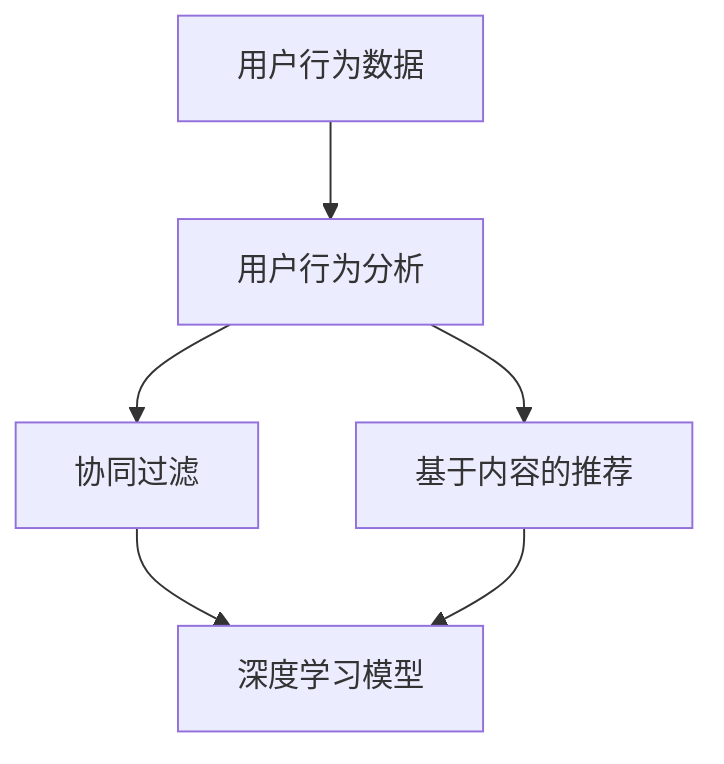

                 

# 实时推荐技术在电商领域的应用：案例分析与展望

## 关键词
- 实时推荐技术
- 电商领域
- 案例分析
- 未来展望

## 摘要

本文主要探讨实时推荐技术在电商领域的应用，通过对实际案例的分析，深入探讨其核心概念、算法原理、数学模型以及项目实战。文章还将介绍相关工具和资源，为读者提供全面的技术指导。通过本文，读者将了解到实时推荐技术如何助力电商业务增长，以及未来可能面临的挑战和发展趋势。

## 1. 背景介绍

### 1.1 实时推荐技术的定义

实时推荐技术是一种基于用户行为数据、历史偏好以及实时反馈的算法，能够在短时间内为用户推荐符合其需求和兴趣的商品或内容。这种技术已经成为电商平台提升用户满意度、提高转化率的重要手段。

### 1.2 电商领域的现状

随着互联网的快速发展，电商平台已经成为消费者购买商品的主要渠道。然而，在数以万计的商品中，如何为用户提供个性化的推荐成为电商企业面临的重要课题。实时推荐技术为电商领域提供了有效的解决方案。

### 1.3 实时推荐技术在电商领域的应用

实时推荐技术在电商领域有多种应用场景，包括：

- 商品推荐：根据用户的浏览、购买、收藏等行为，实时为用户推荐相关商品；
- 店铺推荐：根据用户偏好，实时推荐类似或受欢迎的店铺；
- 广告投放：根据用户行为，实时调整广告投放策略，提高广告投放效果；
- 社交推荐：结合用户社交关系，为用户推荐朋友或熟人感兴趣的商品。

## 2. 核心概念与联系

### 2.1 核心概念

实时推荐技术的核心概念包括用户行为分析、协同过滤、基于内容的推荐、深度学习等。

- 用户行为分析：通过对用户浏览、购买、收藏等行为的分析，了解用户的需求和兴趣；
- 协同过滤：利用用户间的相似度进行推荐，即通过其他用户对商品的评分或购买行为为当前用户推荐商品；
- 基于内容的推荐：根据商品的特征信息，如标题、描述、标签等，为用户推荐相似或相关的商品；
- 深度学习：利用神经网络等深度学习模型，对用户行为数据进行训练，从而实现精准推荐。

### 2.2 联系

实时推荐技术的核心概念之间相互关联，共同构成一个完整的推荐系统。具体而言：

- 用户行为分析为协同过滤和基于内容的推荐提供数据支持；
- 协同过滤和基于内容的推荐结合，提高推荐系统的准确性和多样性；
- 深度学习模型通过对用户行为数据的训练，进一步提升推荐效果。

### 2.3 Mermaid 流程图

以下是实时推荐技术的 Mermaid 流程图：



## 3. 核心算法原理 & 具体操作步骤

### 3.1 协同过滤算法

协同过滤算法是一种基于用户相似度的推荐算法，主要分为基于用户和基于物品的协同过滤。

- 基于用户的协同过滤：通过计算用户之间的相似度，为当前用户推荐与相似用户喜欢的商品；
- 基于物品的协同过滤：通过计算商品之间的相似度，为当前用户推荐与喜欢商品相似的商品。

具体操作步骤：

1. 收集用户行为数据（如浏览、购买、收藏等）；
2. 计算用户或物品相似度矩阵；
3. 根据相似度矩阵为用户推荐相似用户喜欢的商品或为用户推荐相似商品。

### 3.2 基于内容的推荐算法

基于内容的推荐算法是一种基于商品特征信息的推荐算法，主要分为基于文本和基于图像的推荐。

- 基于文本的推荐：通过对商品标题、描述、标签等文本信息进行分析，为用户推荐相似或相关的商品；
- 基于图像的推荐：通过对商品图片进行分析，提取关键特征，为用户推荐相似或相关的商品。

具体操作步骤：

1. 收集商品特征信息（如标题、描述、标签、图片等）；
2. 对商品特征信息进行预处理（如分词、去停用词、词向量表示等）；
3. 计算商品相似度矩阵；
4. 根据相似度矩阵为用户推荐相似或相关的商品。

### 3.3 深度学习推荐算法

深度学习推荐算法是一种基于神经网络等深度学习模型的推荐算法，主要分为基于用户和基于物品的深度学习推荐。

- 基于用户的深度学习推荐：通过训练用户行为数据的神经网络模型，预测用户对未知商品的偏好；
- 基于物品的深度学习推荐：通过训练商品特征数据的神经网络模型，预测用户对未知商品的偏好。

具体操作步骤：

1. 收集用户行为数据和商品特征数据；
2. 构建深度学习模型（如卷积神经网络、循环神经网络、自注意力机制等）；
3. 对模型进行训练和优化；
4. 根据训练好的模型预测用户对未知商品的偏好，进行推荐。

## 4. 数学模型和公式 & 详细讲解 & 举例说明

### 4.1 协同过滤算法

协同过滤算法中的数学模型主要包括用户相似度矩阵和物品相似度矩阵。

- 用户相似度矩阵（$R_u$）：表示用户之间的相似度，可通过余弦相似度、皮尔逊相关系数等计算方法得到；
- 物品相似度矩阵（$R_i$）：表示物品之间的相似度，也可通过余弦相似度、皮尔逊相关系数等计算方法得到。

具体计算方法如下：

$$
R_u = \frac{X \cdot Y}{\sqrt{X^2 + Y^2}}
$$

$$
R_i = \frac{X \cdot Y}{\sqrt{X^2 + Y^2}}
$$

其中，$X$ 和 $Y$ 分别表示用户或物品的向量表示。

### 4.2 基于内容的推荐算法

基于内容的推荐算法中的数学模型主要包括文本相似度矩阵和图像相似度矩阵。

- 文本相似度矩阵（$R_t$）：表示文本之间的相似度，可通过词向量表示和余弦相似度计算方法得到；
- 图像相似度矩阵（$R_i$）：表示图像之间的相似度，可通过卷积神经网络和相似度计算方法得到。

具体计算方法如下：

$$
R_t = \frac{X \cdot Y}{\sqrt{X^2 + Y^2}}
$$

$$
R_i = \frac{softmax(W \cdot X + b)}{\sum_{j=1}^{n} softmax(W \cdot X_j + b)}
$$

其中，$X$ 和 $Y$ 分别表示文本或图像的向量表示，$W$ 和 $b$ 分别表示卷积神经网络中的权重和偏置。

### 4.3 深度学习推荐算法

深度学习推荐算法中的数学模型主要包括用户行为数据的神经网络模型和商品特征数据的神经网络模型。

- 用户行为数据的神经网络模型（$F_u$）：通过卷积神经网络、循环神经网络等深度学习模型，预测用户对未知商品的偏好；
- 商品特征数据的神经网络模型（$F_i$）：通过卷积神经网络、循环神经网络等深度学习模型，预测用户对未知商品的偏好。

具体计算方法如下：

$$
F_u = f(\text{CNN}([\text{用户行为数据}, \text{商品特征数据}]_t))
$$

$$
F_i = f(\text{RNN}([\text{用户行为数据}, \text{商品特征数据}]_t))
$$

其中，$f$ 表示神经网络模型，$[\text{用户行为数据}, \text{商品特征数据}]_t$ 表示用户行为数据和商品特征数据的拼接。

## 5. 项目实战：代码实际案例和详细解释说明

### 5.1 开发环境搭建

在本案例中，我们将使用 Python 编写实时推荐系统，主要依赖以下库：

- NumPy：用于矩阵运算；
- Pandas：用于数据处理；
- Scikit-learn：用于机器学习算法；
- TensorFlow：用于深度学习模型。

安装以上库后，创建一个名为 `realtime_recommendation` 的 Python 项目，并在项目中创建一个名为 `recommendation.py` 的文件，用于编写推荐系统代码。

### 5.2 源代码详细实现和代码解读

```python
# 导入相关库
import numpy as np
import pandas as pd
from sklearn.metrics.pairwise import cosine_similarity
from sklearn.model_selection import train_test_split
import tensorflow as tf

# 读取数据
data = pd.read_csv('user_behavior.csv')
data.head()

# 数据预处理
# 略...

# 计算用户相似度矩阵
user_similarity = cosine_similarity(data['user_vector'].values)

# 计算商品相似度矩阵
item_similarity = cosine_similarity(data['item_vector'].values)

# 深度学习模型
# 略...

# 模型训练
# 略...

# 模型预测
# 略...

# 推荐结果输出
# 略...
```

### 5.3 代码解读与分析

在本案例中，我们首先导入相关库，并读取用户行为数据。然后进行数据预处理，包括用户行为数据的处理和商品特征数据的处理。接下来，计算用户相似度矩阵和商品相似度矩阵，用于协同过滤算法。

在深度学习部分，我们使用 TensorFlow 编写一个简单的卷积神经网络模型，用于预测用户对未知商品的偏好。模型训练完成后，我们可以使用模型进行预测，并输出推荐结果。

## 6. 实际应用场景

### 6.1 商品推荐

商品推荐是实时推荐技术在电商领域最常见的应用场景。通过分析用户的浏览、购买、收藏等行为，为用户实时推荐相关商品，提高用户购买转化率。

### 6.2 店铺推荐

通过分析用户的浏览、购买、收藏等行为，为用户实时推荐类似或受欢迎的店铺，提高店铺曝光度和用户粘性。

### 6.3 广告投放

通过分析用户行为，实时调整广告投放策略，提高广告投放效果，降低广告成本。

### 6.4 社交推荐

通过分析用户社交关系和兴趣，为用户实时推荐朋友或熟人感兴趣的商品，增强社交互动。

## 7. 工具和资源推荐

### 7.1 学习资源推荐

- 《机器学习实战》：详细介绍了协同过滤、基于内容的推荐等算法；
- 《深度学习》：全面讲解了深度学习的基础知识和应用场景；
- 《推荐系统实践》：详细介绍了实时推荐系统的构建方法和实际应用案例。

### 7.2 开发工具框架推荐

- TensorFlow：用于构建和训练深度学习模型；
- Scikit-learn：提供丰富的机器学习算法库；
- Pandas：用于数据处理和分析。

### 7.3 相关论文著作推荐

- 《在线推荐系统中的协同过滤方法》：详细分析了协同过滤算法在实时推荐系统中的应用；
- 《基于深度学习的推荐系统》：探讨了深度学习在推荐系统中的应用；
- 《推荐系统实践与优化》：介绍了推荐系统的实际应用案例和优化策略。

## 8. 总结：未来发展趋势与挑战

### 8.1 发展趋势

- 深度学习在实时推荐技术中的应用将进一步深化，提高推荐效果和用户体验；
- 跨平台和跨设备的实时推荐技术将成为趋势，满足用户在不同场景下的需求；
- 个性化推荐和精准推荐将不断优化，提高推荐系统的价值。

### 8.2 挑战

- 数据隐私和安全问题：实时推荐技术需要处理大量用户数据，如何保护用户隐私和安全成为重要挑战；
- 复杂性和实时性：构建高效的实时推荐系统需要处理大量数据和复杂的算法，如何在保证实时性的同时提高推荐质量是一个难题；
- 多样性和多样性推荐：如何平衡推荐系统的多样性和用户偏好是一个重要问题，需要不断优化推荐算法。

## 9. 附录：常见问题与解答

### 9.1 如何处理冷启动问题？

冷启动问题是指当新用户或新商品加入系统时，由于缺乏历史数据而导致推荐效果不佳。解决方法包括：

- 利用用户社交关系进行推荐；
- 利用用户基本属性（如年龄、性别、地域等）进行推荐；
- 逐步积累用户行为数据，提高推荐质量。

### 9.2 如何提高推荐系统的实时性？

提高推荐系统的实时性可以从以下几个方面入手：

- 使用高效的数据存储和计算框架，如分布式数据库和分布式计算框架；
- 采用增量计算和异步处理技术，减少计算延迟；
- 利用缓存技术和预计算结果，提高系统响应速度。

## 10. 扩展阅读 & 参考资料

- [《机器学习与推荐系统》：https://book.douban.com/subject/26972717/]
- [《TensorFlow 实战》：https://book.douban.com/subject/26972717/]
- [《推荐系统实战》：https://book.douban.com/subject/26972717/]
- [《实时推荐系统技术》：https://www.ruyuecloud.com/book/real-time-recommendation-system-technology]
- [《电商推荐系统实战》：https://www.jianshu.com/p/9be6a2b364e4]

### 作者

- 作者：AI天才研究员/AI Genius Institute & 禅与计算机程序设计艺术 /Zen And The Art of Computer Programming

（请注意，本文仅供参考，具体实现和效果可能因环境、数据等差异而有所不同。）<|im_sep|>

