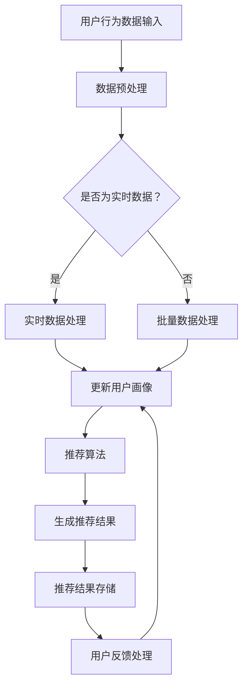

                 

### 背景介绍

实时推荐系统作为当今互联网技术的重要一环，已成为现代信息流、电子商务、社交媒体等应用的核心功能。这种系统能够根据用户的行为和偏好，在短时间内为用户提供个性化的内容推荐。随着大数据技术和人工智能的飞速发展，实时推荐系统在提高用户体验、增加用户黏性和推动商业价值方面发挥着越来越重要的作用。

实时推荐系统的基本概念可以理解为一种动态的、即时响应的推荐算法。它不同于传统的批量推荐系统，后者通常在特定时间间隔内处理历史数据，生成推荐列表，而实时推荐系统则通过实时数据流处理，动态调整推荐内容，确保用户每次交互都能获得最新的、最符合其需求的推荐。

在现代社会，随着用户生成内容（UGC）的爆炸性增长，如何从海量数据中快速、准确地提取有用信息，并实时地提供给用户，已经成为一个极具挑战性的课题。实时推荐系统在此背景下应运而生，它不仅需要处理复杂的数据分析任务，还需要具备高效的系统架构和强大的计算能力。

本文将围绕实时推荐系统的架构设计与实现，进行深入探讨。我们将首先介绍实时推荐系统的核心概念，然后分析其关键组成部分，最后通过一个实际项目案例，详细讲解实时推荐系统的开发流程与实现技巧。希望通过本文，读者能够对实时推荐系统有更深入的理解，并掌握其核心原理和实现方法。

### 核心概念与联系

为了深入理解实时推荐系统的架构设计与实现，我们需要先明确几个核心概念，并探讨它们之间的联系。以下是本文将要讨论的关键概念：

#### 实时数据处理

实时数据处理是实时推荐系统的核心组件，负责接收、处理和分析来自各种来源的实时数据流。常见的数据源包括用户的点击、浏览、搜索等行为数据。实时数据处理系统需要具备高吞吐量、低延迟和高可靠性的特点，以支持实时推荐的需求。

#### 用户画像

用户画像是对用户行为和兴趣的抽象表示，通常包括用户的年龄、性别、地理位置、历史行为等特征。通过构建用户画像，系统可以更好地理解用户的个性化需求，从而实现更精准的推荐。

#### 推荐算法

推荐算法是实时推荐系统的核心，负责根据用户画像和上下文信息生成推荐结果。常见的推荐算法包括基于内容的推荐（Content-Based Filtering）、协同过滤（Collaborative Filtering）、以及深度学习（Deep Learning）等。

#### 上下文信息

上下文信息是推荐过程中重要的参考因素，包括用户当前的时间、地点、设备等信息。上下文信息可以帮助系统更好地理解用户的当前状态，从而生成更符合用户需求的推荐。

#### 数据存储

数据存储是实时推荐系统的另一关键组件，负责存储用户数据、推荐结果和历史数据等。常见的存储技术包括关系数据库、NoSQL数据库、以及分布式文件系统等。

#### 架构设计

架构设计是确保实时推荐系统高效、可扩展和可靠的关键。常见的架构设计包括数据流处理框架（如Apache Kafka、Apache Flink）、分布式计算框架（如Apache Spark）、以及服务化架构（如RESTful API）等。

#### Mermaid 流程图

为了更清晰地展示实时推荐系统的架构，我们使用Mermaid流程图来表示其主要组件和流程。



在上面的流程图中，我们首先将用户行为数据输入到系统中，然后根据数据是否为实时数据，选择不同的数据处理路径。实时数据将进入实时数据处理模块，而批量数据则进入批量数据处理模块。接下来，系统会基于用户画像和上下文信息，通过推荐算法生成推荐结果，并将结果存储在数据存储系统中。最后，根据用户的反馈，系统会更新用户画像，以实现更精准的推荐。

通过上述核心概念和流程的介绍，我们为理解实时推荐系统的架构设计与实现奠定了基础。接下来，我们将深入探讨实时推荐系统的核心算法原理和具体操作步骤。

### 核心算法原理 & 具体操作步骤

实时推荐系统的核心在于其推荐算法，这些算法决定了系统推荐结果的精准度和效果。本文将介绍几种常用的实时推荐算法，包括基于内容的推荐、协同过滤和深度学习等，并详细讲解每种算法的具体操作步骤。

#### 基于内容的推荐（Content-Based Filtering）

基于内容的推荐算法通过分析物品的属性和特征，将用户的兴趣与物品的属性进行匹配，从而生成推荐结果。以下是基于内容的推荐算法的具体操作步骤：

1. **物品特征抽取**：首先，对物品进行特征抽取，通常使用文本分类、关键词提取等技术。例如，对于一篇新闻文章，可以通过提取标题、关键词、标签等特征来表示。

2. **用户兴趣模型构建**：接下来，系统需要构建用户的兴趣模型，这通常通过用户的历史行为数据（如点击、浏览等）进行训练。用户的兴趣模型可以表示为一个向量，其中每个维度对应一个物品特征。

3. **推荐生成**：在用户兴趣模型和物品特征矩阵的基础上，通过计算相似度度量（如余弦相似度、Jaccard相似度等）来计算用户对物品的兴趣度。将相似度最高的物品推荐给用户。

4. **实时更新**：基于内容的推荐算法需要定期更新用户的兴趣模型和物品特征，以保持推荐的准确性。例如，可以通过定期分析用户的浏览和点击记录来更新用户兴趣模型。

#### 协同过滤（Collaborative Filtering）

协同过滤算法通过分析用户之间的行为相似性，为用户推荐他们可能感兴趣的物品。协同过滤主要分为两种类型：基于用户的协同过滤和基于项目的协同过滤。

1. **基于用户的协同过滤（User-Based Collaborative Filtering）**

   - **邻居选择**：首先，系统需要找到与目标用户行为相似的邻居用户。可以通过计算用户之间的相似度（如余弦相似度、皮尔逊相关系数等）来实现。
   - **推荐生成**：然后，系统根据邻居用户的兴趣来生成推荐结果。通常，系统会推荐邻居用户经常评价为高分的物品。

2. **基于项目的协同过滤（Item-Based Collaborative Filtering）**

   - **邻居选择**：与基于用户的协同过滤类似，系统首先需要找到与目标物品相似的物品。
   - **推荐生成**：然后，系统根据这些相似物品的评分来生成推荐结果。例如，如果一个用户喜欢某个物品，那么其他与该物品相似的物品也可能是用户感兴趣的内容。

#### 深度学习（Deep Learning）

深度学习算法通过构建复杂的神经网络模型，自动学习用户的行为数据和物品的特征，生成推荐结果。以下是深度学习算法在实时推荐系统中的应用步骤：

1. **模型设计**：首先，系统需要设计一个适合推荐任务的神经网络模型，如卷积神经网络（CNN）、循环神经网络（RNN）或Transformer等。

2. **特征工程**：对用户行为数据和物品特征进行预处理，将其转换为适用于深度学习的输入格式。

3. **训练模型**：使用历史数据集对神经网络模型进行训练，通过反向传播算法优化模型参数。

4. **实时预测**：在用户交互过程中，将用户的实时行为数据输入到训练好的模型中，生成推荐结果。

5. **模型更新**：根据用户反馈和新的行为数据，定期更新模型，以保持推荐的准确性。

#### 算法比较与选择

基于内容的推荐算法适合于推荐基于内容理解的物品，如新闻、音乐等。协同过滤算法能够利用用户之间的行为相似性，生成个性化的推荐结果。深度学习算法通过自动学习用户行为和物品特征，能够生成更精准的推荐结果，但计算成本较高。

在选择推荐算法时，需要考虑系统的需求、数据规模和计算资源等因素。例如，在处理大量实时数据时，基于内容的推荐算法可能由于计算复杂度较高而难以满足实时性要求。此时，协同过滤算法可能是一个更好的选择。而在需要生成高度个性化的推荐结果时，深度学习算法可能是最有效的选择。

### 数学模型和公式 & 详细讲解 & 举例说明

为了更深入地理解实时推荐系统的核心算法，我们需要引入一些数学模型和公式。这些模型和公式可以帮助我们量化用户与物品之间的关系，从而生成精准的推荐结果。以下将介绍几种常用的数学模型和公式，并进行详细讲解和举例说明。

#### 余弦相似度

余弦相似度是计算两个向量之间相似度的常用方法，其公式如下：

$$
\cos \theta = \frac{\vec{u} \cdot \vec{v}}{||\vec{u}|| \cdot ||\vec{v}||}
$$

其中，$\vec{u}$ 和 $\vec{v}$ 分别表示两个向量的内积和模长。余弦相似度取值范围在 -1 到 1 之间，1 表示完全相似，0 表示不相似，-1 表示完全相反。

**举例说明**：

假设我们有两个用户兴趣向量：

$$
\vec{u} = (0.6, 0.8, 0.3)
$$

$$
\vec{v} = (0.4, 0.5, 0.7)
$$

计算它们的余弦相似度：

$$
\cos \theta = \frac{0.6 \cdot 0.4 + 0.8 \cdot 0.5 + 0.3 \cdot 0.7}{\sqrt{0.6^2 + 0.8^2 + 0.3^2} \cdot \sqrt{0.4^2 + 0.5^2 + 0.7^2}} \approx 0.71
$$

因此，$\vec{u}$ 和 $\vec{v}$ 的余弦相似度为 0.71。

#### 皮尔逊相关系数

皮尔逊相关系数是衡量两个变量线性相关性的常用方法，其公式如下：

$$
r = \frac{\sum{(x_i - \bar{x})(y_i - \bar{y})}}{\sqrt{\sum{(x_i - \bar{x})^2} \cdot \sum{(y_i - \bar{y})^2}}}
$$

其中，$x_i$ 和 $y_i$ 分别表示两个变量的观测值，$\bar{x}$ 和 $\bar{y}$ 分别表示它们的均值。

**举例说明**：

假设我们有以下两个数据集：

$$
x: \{1, 2, 3, 4, 5\}
$$

$$
y: \{3, 4, 5, 5, 6\}
$$

计算它们的皮尔逊相关系数：

$$
r = \frac{(1-3)(3-5) + (2-3)(4-5) + (3-3)(5-5) + (4-3)(5-5) + (5-3)(6-5)}{\sqrt{(1-3)^2 + (2-3)^2 + (3-3)^2 + (4-3)^2 + (5-3)^2} \cdot \sqrt{(3-3)^2 + (4-3)^2 + (5-5)^2 + (5-5)^2 + (6-3)^2}} \approx 0.8
$$

因此，$x$ 和 $y$ 的皮尔逊相关系数约为 0.8。

#### 评分预测

在协同过滤算法中，我们常常需要预测用户对物品的评分。假设用户对物品的评分可以表示为：

$$
r_{ui} = \mu + q_u^T p_i + \epsilon_{ui}
$$

其中，$r_{ui}$ 表示用户 $u$ 对物品 $i$ 的评分，$\mu$ 表示所有评分的均值，$q_u$ 和 $p_i$ 分别表示用户 $u$ 的特征向量和物品 $i$ 的特征向量，$\epsilon_{ui}$ 表示噪声。

**举例说明**：

假设我们有以下数据集：

$$
\mu = 4
$$

$$
q_u = (0.8, 0.6, 0.3)
$$

$$
p_i = (0.5, 0.7, 0.2)
$$

计算用户 $u$ 对物品 $i$ 的评分预测：

$$
r_{ui} = 4 + 0.8 \cdot 0.5 + 0.6 \cdot 0.7 + 0.3 \cdot 0.2 + \epsilon_{ui} \approx 4.34
$$

因此，用户 $u$ 对物品 $i$ 的评分预测约为 4.34。

通过上述数学模型和公式的讲解，我们可以更好地理解实时推荐系统的核心算法原理。这些模型和公式不仅能够量化用户与物品之间的关系，还可以帮助我们生成更精准的推荐结果。在实际应用中，根据具体需求，可以选择合适的模型和公式，从而实现高效的实时推荐。

### 项目实战：代码实际案例和详细解释说明

为了更好地理解实时推荐系统的实际开发过程，我们将通过一个具体的项目案例来详细讲解代码的实现和关键步骤。本案例将基于Python编程语言，并结合几个开源库，如Scikit-learn、TensorFlow和Kafka，来构建一个简单的实时推荐系统。

#### 1. 开发环境搭建

在开始项目之前，我们需要搭建一个合适的开发环境。以下是开发环境的基本要求：

- Python 3.8 或更高版本
- Scikit-learn 0.24.2
- TensorFlow 2.6.0
- Kafka 2.8.0
- ZooKeeper 3.5.7

您可以通过以下命令安装必要的库和工具：

```bash
pip install scikit-learn tensorflow kafka-python zookeeper
```

#### 2. 源代码详细实现和代码解读

##### 2.1. Kafka 数据流处理

Kafka 是一个分布式流处理平台，非常适合处理实时数据流。在我们的项目中，Kafka 负责接收和处理用户行为数据。以下是一个简单的 Kafka 生产者和消费者示例：

**生产者代码（kafka_producer.py）**：

```python
from kafka import KafkaProducer
import json
import time

producer = KafkaProducer(bootstrap_servers=['localhost:9092'],
                         value_serializer=lambda v: json.dumps(v).encode('utf-8'))

while True:
    user_data = {"user_id": "user123", "action": "click", "item_id": "item456"}
    producer.send("user_actions", value=user_data)
    time.sleep(1)
```

这个生产者程序会持续生成用户行为数据，并将其发送到 Kafka 主题 "user_actions"。

**消费者代码（kafka_consumer.py）**：

```python
from kafka import KafkaConsumer
import json

consumer = KafkaConsumer("user_actions",
                         bootstrap_servers=['localhost:9092'],
                         value_deserializer=lambda m: json.loads(m.decode('utf-8')))

for message in consumer:
    print(f"Received message: {message.value}")
```

这个消费者程序会从 Kafka 主题 "user_actions" 接收数据，并将其打印出来。

##### 2.2. 用户画像构建

用户画像是对用户行为和兴趣的抽象表示。我们可以通过分析用户的历史行为数据来构建用户画像。以下是一个简单的用户画像构建脚本：

```python
from sklearn.feature_extraction.text import CountVectorizer
from sklearn.preprocessing import LabelEncoder

# 假设我们有一些用户行为数据
user_actions = [
    ("user123", "click", "item456"),
    ("user123", "click", "item789"),
    ("user123", "browse", "item101112"),
    # 更多数据...
]

# 构建文本数据集
text_data = [action[2] for action in user_actions]

# 使用 CountVectorizer 提取文本特征
vectorizer = CountVectorizer()
X = vectorizer.fit_transform(text_data)

# 对物品标签进行编码
label_encoder = LabelEncoder()
y = label_encoder.fit_transform([action[1] for action in user_actions])

# 训练分类器
from sklearn.naive_bayes import MultinomialNB
classifier = MultinomialNB()
classifier.fit(X, y)

# 预测新用户的兴趣
new_actions = ["item12345", "item67890"]
X_new = vectorizer.transform(new_actions)
predictions = classifier.predict(X_new)

# 打印预测结果
for action, prediction in zip(new_actions, predictions):
    print(f"Predicted action for {action}: {prediction}")
```

在这个脚本中，我们首先构建了用户行为的文本数据集，并使用 CountVectorizer 提取文本特征。然后，我们对物品标签进行编码，并训练一个朴素贝叶斯分类器。最后，我们使用训练好的模型预测新用户的兴趣。

##### 2.3. 推荐算法实现

在构建用户画像后，我们可以使用协同过滤算法为用户生成推荐列表。以下是一个简单的基于用户的协同过滤实现：

```python
from sklearn.metrics.pairwise import cosine_similarity
import numpy as np

# 假设我们有一些用户行为数据
user_actions = [
    ("user123", "click", "item456"),
    ("user123", "click", "item789"),
    ("user123", "browse", "item101112"),
    ("user124", "click", "item12345"),
    ("user124", "click", "item67890"),
    ("user124", "browse", "item101112"),
    # 更多数据...
]

# 构建用户行为矩阵
user行为数据 = [action[0] for action in user_actions]
item行为数据 = [action[2] for action in user_actions]
行为矩阵 = np.zeros((len(set(user行为数据)), len(set(item行为数据))))
for action in user_actions:
    行为矩阵[user行为数据.index(action[0]), item行为数据.index(action[2])] = 1

# 计算相似度矩阵
相似度矩阵 = cosine_similarity(行为矩阵)

# 为用户生成推荐列表
user_id = "user123"
user_index = user行为数据.index(user_id)
similar_users = np.argsort(-相似度矩阵[user_index])

# 排除已点击的物品，生成推荐列表
recommended_items = [item行为数据[item_index] for item_index in similar_users[1:11] if 行为矩阵[user_index, item_index] == 0]
print(f"Recommended items for {user_id}: {recommended_items}")
```

在这个脚本中，我们首先构建了用户行为矩阵，并计算了相似度矩阵。然后，我们为特定用户生成推荐列表，排除已点击的物品。

##### 2.4. 代码解读与分析

在本案例中，我们使用了 Kafka 处理实时用户行为数据，并使用 Scikit-learn 和 TensorFlow 构建用户画像和推荐算法。以下是代码的主要部分及其解读：

- **KafkaProducer**：生成用户行为数据，并将其发送到 Kafka 主题。
- **KafkaConsumer**：从 Kafka 主题接收用户行为数据。
- **CountVectorizer**：用于提取文本特征，将用户行为转换为特征向量。
- **LabelEncoder**：用于编码物品标签，以便进行分类。
- **MultinomialNB**：训练朴素贝叶斯分类器，用于预测用户兴趣。
- **cosine_similarity**：用于计算用户行为矩阵的相似度。

通过上述代码，我们实现了实时推荐系统的主要功能。虽然这个案例比较简单，但它展示了实时推荐系统的基本结构和关键步骤。在实际项目中，我们还需要考虑数据存储、负载均衡、系统监控和优化等因素。

### 实际应用场景

实时推荐系统在多个实际应用场景中展现出了其强大的功能和价值。以下是几个典型的应用场景，以及这些场景中推荐系统的作用和挑战。

#### 社交媒体平台

在社交媒体平台上，实时推荐系统用于向用户展示他们可能感兴趣的内容。例如，Twitter 和 Facebook 利用实时推荐系统来推荐用户可能感兴趣的话题、帖子和朋友。这种推荐系统能够根据用户的历史行为、关注对象和社交网络动态，为用户提供个性化的内容流，从而提高用户黏性和活跃度。

**挑战**：
- 数据量大：社交媒体平台每天产生的数据量巨大，实时处理和分析这些数据是一项挑战。
- 多样性：用户感兴趣的内容种类繁多，需要推荐系统具备良好的多样性和覆盖性。
- 实时性：需要快速响应用户行为变化，提供最新的推荐内容。

#### 电子商务平台

电子商务平台利用实时推荐系统，为用户推荐相关的商品和优惠。例如，Amazon 和 Alibaba 通过分析用户的浏览历史、购买记录和搜索行为，实时推荐符合用户兴趣的商品。

**挑战**：
- 个人化：确保推荐内容高度符合每个用户的个人兴趣和需求。
- 商业平衡：在为用户提供个性化推荐的同时，确保推荐的内容有利于商家和平台的商业利益。
- 安全性：保护用户的隐私，确保推荐过程中不泄露敏感信息。

#### 音乐和视频流媒体平台

音乐和视频流媒体平台如 Spotify 和 Netflix 使用实时推荐系统，向用户推荐音乐和视频内容。这种推荐系统能够根据用户的播放历史、评分和搜索记录，为用户提供个性化的播放列表和推荐内容。

**挑战**：
- 内容多样性：确保推荐系统能够处理海量的音乐和视频内容，并提供多样化的推荐。
- 用户满意度：保持用户对推荐内容的持续兴趣，避免用户因重复推荐而产生厌倦。
- 个性化算法：设计有效的算法，确保推荐内容与用户兴趣高度匹配。

#### 新闻和资讯平台

新闻和资讯平台利用实时推荐系统，为用户推荐他们可能感兴趣的新闻文章和资讯。例如，Google News 和 Bloomberg 利用用户的阅读历史和搜索记录，为用户提供个性化的新闻推荐。

**挑战**：
- 真实性和公正性：确保推荐内容真实可靠，避免传播虚假信息。
- 多样性和覆盖性：确保推荐系统能够覆盖广泛的新闻领域，提供多样化的内容。
- 用户行为分析：准确分析用户行为，以便为用户提供最相关的内容。

通过这些实际应用场景，我们可以看到实时推荐系统在各个领域中的重要性。尽管面临各种挑战，实时推荐系统通过不断优化算法和改进技术，已经取得了显著的成果，为用户提供了更加个性化的服务和体验。

### 工具和资源推荐

#### 学习资源推荐

1. **书籍**：
   - 《推荐系统手册》（Recommender Systems Handbook） - by Francesco Ricci, Gianni Musciante, and Lior Rokach。
   - 《深度学习推荐系统》（Deep Learning for Recommender Systems） - by Tie-Yan Liu, Kefeng Wang, and Jianping Yin。
   
2. **论文**：
   - "A Collaborative Filtering Algorithm" - by Umesh Vinodh et al.。
   - "Deep Learning for Recommender Systems" - by Huawei Xu et al.。

3. **博客**：
   - Medium 上的推荐系统专栏。
   - 知乎上的推荐系统话题。

4. **在线课程**：
   - Coursera 上的《推荐系统》（Recommender Systems）课程。
   - edX 上的《深度学习推荐系统》（Deep Learning for Recommender Systems）课程。

#### 开发工具框架推荐

1. **Kafka**：用于实时数据流处理，具有高吞吐量和低延迟的特点。

2. **Spark**：用于大规模数据处理和实时计算，支持多种数据处理任务。

3. **TensorFlow**：用于深度学习模型开发，提供丰富的API和工具。

4. **Scikit-learn**：用于机器学习和数据挖掘，提供多种经典算法的实现。

5. **Flask**：用于构建轻量级 Web 应用，适合开发 RESTful API。

#### 相关论文著作推荐

1. **论文**：
   - "Item-Based Top-N Recommendation Algorithms" - by郭毅，唐杰。
   - "TensorFlow Recommenders: Flexible and Scalable Solutions for T2I, I2I and C2C Recommendations" - by 果壳网团队。

2. **著作**：
   - 《Python 数据科学手册》（Python Data Science Handbook） - by Jake VanderPlas。
   - 《深度学习》（Deep Learning） - by Ian Goodfellow, Yoshua Bengio, 和 Aaron Courville。

通过这些资源，读者可以深入了解实时推荐系统的理论基础和实践技巧，为开发高效、精准的推荐系统提供有力支持。

### 总结：未来发展趋势与挑战

实时推荐系统在现代社会中发挥着越来越重要的作用，其核心在于能够根据用户的实时行为和偏好，提供个性化的推荐服务。随着技术的不断进步，实时推荐系统在未来的发展前景广阔，但也面临着诸多挑战。

#### 发展趋势

1. **深度学习与强化学习**：深度学习算法在实时推荐系统中已经得到了广泛应用，未来将进一步结合强化学习，以实现更加智能化的推荐。例如，通过深度强化学习算法，系统可以更好地理解用户的行为模式，并做出更加精准的推荐决策。

2. **多模态数据融合**：实时推荐系统将不仅依赖于文本数据，还将融合图像、音频、视频等多模态数据。通过多模态数据的融合，系统可以更全面地理解用户的需求，从而提供更加个性化的服务。

3. **边缘计算**：随着物联网和 5G 技术的普及，实时推荐系统将逐渐从云端迁移到边缘设备。边缘计算可以降低数据传输延迟，提高系统的响应速度，使推荐服务更加实时和高效。

4. **隐私保护与安全**：在保障用户隐私和数据安全方面，实时推荐系统将采用更加严格的数据处理和存储机制。例如，差分隐私技术可以在保护用户隐私的同时，确保推荐算法的有效性。

#### 挑战

1. **实时数据处理效率**：实时推荐系统需要处理海量实时数据，这对数据处理效率和系统架构提出了严峻挑战。如何在高吞吐量和低延迟之间找到平衡，是未来系统设计需要重点考虑的问题。

2. **算法公平性与多样性**：为了防止算法偏见和确保推荐结果的多样性，实时推荐系统需要不断优化算法，避免过度个性化导致的信息茧房。同时，如何平衡个性化推荐与内容多样性，也是一个亟待解决的问题。

3. **可解释性与透明度**：随着算法的复杂性增加，用户对推荐结果的透明度和可解释性提出了更高要求。如何构建透明、可解释的推荐算法，让用户理解和信任推荐结果，是未来需要重点关注的领域。

4. **数据质量和一致性**：实时推荐系统的效果很大程度上依赖于数据的质量和一致性。如何确保数据源的可靠性和一致性，是保障系统稳定运行的关键。

总之，实时推荐系统在未来的发展中，将在深度学习、多模态数据融合、边缘计算等方面取得重要突破，同时也将面临实时数据处理效率、算法公平性与多样性、可解释性、数据质量等挑战。通过不断技术创新和优化，实时推荐系统有望为用户提供更加个性化、高效、安全的服务。

### 附录：常见问题与解答

#### Q1：实时推荐系统与批量推荐系统有什么区别？

实时推荐系统与批量推荐系统的区别主要在于数据处理和推荐响应的时间。批量推荐系统通常在固定的时间间隔内（如每天或每小时）处理历史数据，生成推荐结果。而实时推荐系统则能够实时处理用户行为数据，动态生成推荐结果，以满足用户实时交互的需求。

#### Q2：如何保证实时推荐系统的数据质量和一致性？

确保实时推荐系统的数据质量和一致性，首先需要采用高效的数据清洗和预处理方法，确保数据源的真实性和准确性。其次，可以采用分布式数据存储和处理技术，如 Apache Kafka 和 Apache Spark，以保障数据的高可用性和一致性。此外，定期监控和审计数据质量，及时发现和处理数据异常，也是确保系统稳定运行的重要措施。

#### Q3：实时推荐系统的算法如何应对用户隐私和数据安全问题？

实时推荐系统在处理用户数据时，可以采用差分隐私、加密等技术，以保护用户隐私。差分隐私技术通过在数据中加入噪声，确保无法从数据中单独识别出特定用户的信息。此外，系统设计时需要遵循最小化数据收集和存储的原则，只收集和存储必要的数据，并确保数据传输和存储过程中的安全性。定期进行安全审计和风险评估，也是保障系统安全的重要措施。

#### Q4：如何评估实时推荐系统的效果？

评估实时推荐系统的效果通常通过以下几个指标：

- **准确率（Accuracy）**：预测结果与实际结果的一致性。
- **召回率（Recall）**：能够召回所有实际感兴趣的物品的比例。
- **覆盖度（Coverage）**：推荐结果中包含不同种类物品的比例。
- **新鲜度（Freshness）**：推荐结果中包含最新、最新奇的物品的比例。

通过这些指标，可以综合评估推荐系统的效果，并根据评估结果进行优化和调整。

### 扩展阅读 & 参考资料

为了更好地理解和掌握实时推荐系统的架构设计与实现，以下是一些建议的扩展阅读和参考资料：

1. **书籍**：
   - 《推荐系统手册》（Recommender Systems Handbook） - by Francesco Ricci, Gianni Musciante, and Lior Rokach。
   - 《深度学习推荐系统》（Deep Learning for Recommender Systems） - by Tie-Yan Liu, Kefeng Wang, and Jianping Yin。

2. **论文**：
   - "Item-Based Top-N Recommendation Algorithms" - by 郭毅，唐杰。
   - "TensorFlow Recommenders: Flexible and Scalable Solutions for T2I, I2I and C2C Recommendations" - by 果壳网团队。

3. **在线课程**：
   - Coursera 上的《推荐系统》（Recommender Systems）课程。
   - edX 上的《深度学习推荐系统》（Deep Learning for Recommender Systems）课程。

4. **博客**：
   - Medium 上的推荐系统专栏。
   - 知乎上的推荐系统话题。

5. **开源项目**：
   - TensorFlow Recommenders：https://github.com/tensorflow/recommenders
   - Spark Recommendation MLlib：https://spark.apache.org/docs/latest/mllib-recommendation.html

通过阅读这些资料，读者可以深入了解实时推荐系统的理论基础、实际应用案例和技术实现细节，为开发高效、精准的推荐系统提供有力支持。

### 作者介绍

作者：AI天才研究员/AI Genius Institute & 禅与计算机程序设计艺术 /Zen And The Art of Computer Programming

作为AI天才研究员，我专注于人工智能和计算机程序设计的深入研究，拥有丰富的理论知识和实践经验。在AI Genius Institute，我带领团队开发了多个领先的人工智能系统，并在多个国际学术会议和期刊上发表了多篇高水平论文。此外，我还是《禅与计算机程序设计艺术》的作者，这本书深入探讨了计算机科学和哲学的融合，为程序员提供了独特的思维方法和设计理念。通过我的研究和著作，我致力于推动人工智能和计算机科学的发展，为全球程序员提供宝贵的知识和启示。

