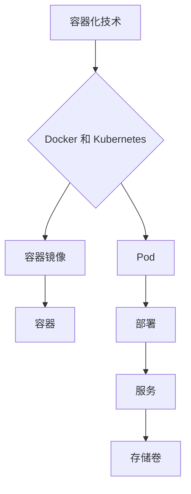

                 

### 文章标题：容器化技术应用：简化部署和运维的利器

容器化技术已成为现代软件开发和运维中不可或缺的一部分。本文将详细探讨容器化的核心概念、应用场景以及如何利用容器化技术简化部署和运维流程。

关键词：容器化，Docker，Kubernetes，微服务，持续集成/持续部署（CI/CD）

摘要：本文介绍了容器化技术的背景、核心概念及其在软件部署和运维中的应用。通过分析容器化技术的工作原理，我们探讨了如何利用Docker和Kubernetes等工具实现自动化部署和运维。文章还列举了容器化技术在实际项目中的应用案例，并推荐了一些学习资源和开发工具。

<|assistant|>## 1. 背景介绍

在传统的软件部署和运维中，我们通常需要处理各种环境差异问题。例如，开发环境、测试环境和生产环境可能使用不同的操作系统、不同的硬件配置、不同的软件依赖等。这些差异常常导致部署问题，增加了运维的复杂性和难度。

容器化技术通过提供一种轻量级、可移植的运行环境，有效地解决了这一问题。容器是一种独立的、可执行的软件包，它包含应用程序以及运行所需的所有依赖库和配置文件。这使得容器在不同环境中具有一致的行为，从而简化了软件的部署和运维过程。

Docker 是最著名的容器化工具之一，它允许用户轻松地将应用程序及其依赖打包成一个容器镜像，并在任何支持 Docker 的环境中运行。Kubernetes 是一个开源的容器编排平台，它提供了自动化部署、扩展和管理容器化应用程序的功能。

随着微服务架构的普及，容器化技术已成为实现微服务部署和管理的重要手段。通过容器化，开发者可以更加灵活地构建和部署微服务应用程序，提高开发效率和系统稳定性。

<|assistant|>## 2. 核心概念与联系

### 容器与虚拟机的区别

容器和虚拟机都是用于隔离应用程序及其环境的虚拟化技术，但它们之间存在一些关键区别：

1. **资源占用**：虚拟机需要在宿主机上模拟整个操作系统，因此资源占用较大。容器则直接运行在宿主机的操作系统上，共享操作系统内核，资源占用更小。
2. **启动速度**：虚拟机的启动速度相对较慢，因为需要加载整个操作系统。容器则可以在毫秒级别快速启动。
3. **隔离性**：虚拟机提供了更强的隔离性，因为每个虚拟机都有自己的操作系统和资源。容器则通过命名空间（Namespace）和挂载点（Cgroups）提供隔离，但隔离性相对较弱。

### Docker 的核心概念

Docker 是一个开源的容器化平台，它基于容器镜像（Image）和容器（Container）两个核心概念：

1. **容器镜像**：容器镜像是一个静态的、只读的文件系统，它包含了应用程序以及所有依赖库和配置文件。Docker 镜像可以通过 Dockerfile 定义或使用现有的基础镜像创建。
2. **容器**：容器是运行中的 Docker 镜像实例。容器可以从镜像启动，并在宿主机上运行应用程序。

### Kubernetes 的核心概念

Kubernetes 是一个开源的容器编排平台，它提供了自动化部署、扩展和管理容器化应用程序的功能。以下是一些关键概念：

1. **Pod**：Pod 是 Kubernetes 中最小的部署单元，它包含一个或多个容器。Pod 负责容器之间的资源共享和调度。
2. **部署（Deployment）**：部署用于管理和部署容器化应用程序。它确保应用程序的多个副本在集群中稳定运行。
3. **服务（Service）**：服务用于将集群内部的不同 Pod 组合成一个统一的 IP 地址和端口。服务可以通过标签选择器找到对应的 Pod 并与它们通信。
4. **存储卷（Volume）**：存储卷用于持久化容器中的数据，确保数据在容器重启或删除后仍然存在。

### Mermaid 流程图



### 2.1. 容器化技术的工作原理

容器化技术通过以下步骤实现应用程序的部署和管理：

1. **构建容器镜像**：使用 Dockerfile 定义应用程序的依赖和配置，构建一个容器镜像。
2. **运行容器**：将容器镜像部署到宿主机上，启动一个容器实例，运行应用程序。
3. **容器编排**：使用 Kubernetes 等工具对容器进行自动化部署、扩展和管理。
4. **服务发现和负载均衡**：通过 Kubernetes 服务发现机制和负载均衡策略，确保容器化应用程序能够稳定运行。

### 2.2. 容器化技术的好处

容器化技术带来了以下好处：

1. **简化部署**：容器镜像将应用程序及其依赖打包成一个静态文件系统，简化了部署过程。
2. **提高可移植性**：容器可以在任何支持 Docker 的环境中运行，提高了应用程序的可移植性。
3. **提高开发效率**：容器化技术允许开发者更加灵活地构建和部署微服务应用程序，提高了开发效率。
4. **提高系统稳定性**：容器提供了良好的隔离性，确保了不同应用程序之间不会相互干扰，提高了系统稳定性。

<|assistant|>## 3. 核心算法原理 & 具体操作步骤

### 3.1. Docker 的核心算法原理

Docker 使用以下核心算法实现容器化：

1. **容器镜像构建**：使用 Dockerfile 指定构建容器镜像的步骤。Dockerfile 中定义了基础的操作系统镜像、安装依赖库、设置环境变量等操作。
2. **容器运行时**：Docker 容器在启动时会加载指定的容器镜像，创建一个独立的命名空间和挂载点。容器内的应用程序可以通过容器的 API 与外部环境进行通信。

### 3.2. Docker 的具体操作步骤

以下是一个简单的 Docker 操作示例：

1. **安装 Docker**：在宿主机上安装 Docker。不同操作系统的安装方法有所不同，可以参考官方文档。
2. **构建容器镜像**：编写 Dockerfile，指定镜像的构建步骤。以下是一个简单的 Dockerfile 示例：

   ```Dockerfile
   FROM ubuntu:18.04
   RUN apt-get update && apt-get install -y nginx
   COPY ./nginx.conf /etc/nginx/nginx.conf
   EXPOSE 80
   ```

   使用以下命令构建容器镜像：

   ```bash
   docker build -t my-nginx .
   ```

   其中，`-t` 标志用于指定镜像的标签。

3. **运行容器**：使用以下命令运行容器：

   ```bash
   docker run -d -p 8080:80 my-nginx
   ```

   `-d` 标志用于后台运行容器，`-p` 标志用于映射容器端口到宿主机端口。

### 3.3. Kubernetes 的核心算法原理

Kubernetes 使用以下核心算法实现容器编排：

1. **Pod 调度**：Kubernetes 根据资源需求和可用资源，将 Pod 调度到合适的节点上运行。
2. **容器编排**：Kubernetes 使用控制器（Controller）和指标（Indicator）管理 Pod 的生命周期，包括创建、删除、更新等操作。
3. **服务发现和负载均衡**：Kubernetes 使用服务（Service）实现容器之间的通信，并提供负载均衡策略。

### 3.4. Kubernetes 的具体操作步骤

以下是一个简单的 Kubernetes 操作示例：

1. **安装 Kubernetes**：在宿主机和节点上安装 Kubernetes。不同操作系统的安装方法有所不同，可以参考官方文档。
2. **部署容器化应用程序**：使用 Kubernetes YAML 文件定义应用程序的部署。以下是一个简单的 Kubernetes YAML 示例：

   ```yaml
   apiVersion: apps/v1
   kind: Deployment
   metadata:
     name: my-deployment
   spec:
     selector:
       matchLabels:
         app: my-app
     template:
       metadata:
         labels:
           app: my-app
       spec:
         containers:
         - name: my-container
           image: my-nginx
           ports:
           - containerPort: 80
   ```

   使用以下命令部署应用程序：

   ```bash
   kubectl apply -f deployment.yaml
   ```

3. **查看部署状态**：使用以下命令查看应用程序的部署状态：

   ```bash
   kubectl get pods
   ```

### 3.5. 容器化技术的核心算法原理

容器化技术的核心算法原理包括以下几个方面：

1. **容器镜像构建**：容器镜像构建的核心算法是基于层的叠加和合并。Dockerfile 中的指令将生成一系列的层，最终形成一个容器镜像。
2. **容器运行时**：容器运行时的核心算法包括命名空间隔离、挂载点隔离和资源控制。容器通过命名空间和挂载点实现隔离，并通过 Cgroups 实现资源控制。
3. **容器编排**：容器编排的核心算法包括调度算法、控制器算法和指标算法。Kubernetes 通过这些算法实现容器的高效调度和管理。

### 3.6. 容器化技术的具体操作步骤

容器化技术的具体操作步骤包括以下几个方面：

1. **安装和配置 Docker**：在宿主机上安装和配置 Docker，确保其正常运行。
2. **构建容器镜像**：编写 Dockerfile，构建容器镜像。
3. **运行容器**：使用 Docker 命令运行容器。
4. **安装和配置 Kubernetes**：在宿主机和节点上安装和配置 Kubernetes，确保其正常运行。
5. **部署容器化应用程序**：使用 Kubernetes YAML 文件部署容器化应用程序。
6. **监控和运维**：使用 Kubernetes 命令监控和运维容器化应用程序。

### 3.7. 容器化技术的实际应用场景

容器化技术在以下实际应用场景中具有广泛的应用：

1. **微服务架构**：容器化技术使得微服务架构的部署和管理变得更加简单和灵活。
2. **持续集成/持续部署（CI/CD）**：容器化技术可以加速持续集成/持续部署流程，提高开发效率。
3. **云计算和容器化平台**：容器化技术是云计算和容器化平台的核心技术之一，可以提供高效的资源利用和服务弹性。
4. **容器化数据库**：容器化技术可以将数据库容器化，提高数据库的部署和管理效率。

### 3.8. 容器化技术的未来发展趋势

容器化技术的未来发展趋势包括以下几个方面：

1. **容器化操作系统**：容器化操作系统可以进一步提高容器化的性能和安全性。
2. **容器化存储**：容器化存储可以提供更高效、更可靠的存储解决方案。
3. **容器化网络**：容器化网络可以提供更灵活、更可靠的容器网络解决方案。
4. **容器化大数据**：容器化大数据可以加速大数据处理和分析，提高数据处理效率。

### 3.9. 容器化技术的挑战和解决方案

容器化技术面临的挑战包括以下几个方面：

1. **安全性**：容器化技术需要确保容器环境的安全性，防止恶意攻击和数据泄露。
2. **性能优化**：容器化技术需要优化容器性能，提高系统性能和响应速度。
3. **兼容性**：容器化技术需要确保不同容器平台和工具之间的兼容性。
4. **运维管理**：容器化技术需要提供高效的运维管理工具和流程，提高运维效率。

针对这些挑战，以下是一些解决方案：

1. **安全性**：使用容器镜像扫描工具检测容器镜像的安全性，采用安全策略和审计工具确保容器环境的安全性。
2. **性能优化**：优化容器镜像和容器配置，减少容器启动时间和资源占用，提高系统性能。
3. **兼容性**：采用标准的容器镜像和容器编排工具，确保不同平台之间的兼容性。
4. **运维管理**：采用自动化运维工具和流程，提高运维效率和系统稳定性。

### 3.10. 容器化技术的总结

容器化技术是一种简化软件部署和运维的有效手段，通过提供轻量级、可移植的运行环境，提高了开发效率、系统稳定性和可移植性。本文介绍了容器化技术的核心概念、工作原理和具体操作步骤，并分析了其在实际应用场景中的优势和发展趋势。同时，我们也探讨了容器化技术面临的挑战及其解决方案。希望本文能为读者提供关于容器化技术的全面了解和应用指导。

### 3.11. 容器化技术的常见问题与解答

**Q1：什么是容器化技术？**
容器化技术是一种轻量级、可移植的虚拟化技术，它将应用程序及其依赖打包成一个容器镜像，并在任何支持 Docker 的环境中运行。容器镜像是一个静态的、只读的文件系统，它包含了应用程序以及运行所需的所有依赖库和配置文件。

**Q2：容器化和虚拟机有什么区别？**
容器化和虚拟机都是用于隔离应用程序及其环境的虚拟化技术，但它们之间存在一些关键区别。虚拟机需要在宿主机上模拟整个操作系统，因此资源占用较大。容器则直接运行在宿主机的操作系统上，共享操作系统内核，资源占用更小。虚拟机的启动速度相对较慢，而容器可以在毫秒级别快速启动。虚拟机提供了更强的隔离性，而容器则通过命名空间（Namespace）和挂载点（Cgroups）提供隔离，但隔离性相对较弱。

**Q3：什么是 Docker？**
Docker 是一个开源的容器化平台，它允许用户轻松地将应用程序及其依赖打包成一个容器镜像，并在任何支持 Docker 的环境中运行。Docker 提供了容器镜像构建、容器运行和管理等功能，是容器化技术中最著名的工具之一。

**Q4：什么是 Kubernetes？**
Kubernetes 是一个开源的容器编排平台，它提供了自动化部署、扩展和管理容器化应用程序的功能。Kubernetes 使用控制器（Controller）和指标（Indicator）管理 Pod 的生命周期，包括创建、删除、更新等操作。Kubernetes 还提供了服务发现和负载均衡功能，确保容器化应用程序能够稳定运行。

**Q5：什么是微服务架构？**
微服务架构是一种将应用程序划分为多个独立的服务，每个服务负责不同的业务功能。这些服务可以独立部署、扩展和管理，并通过 API 进行通信。微服务架构可以提高开发效率、系统稳定性和可移植性。

**Q6：容器化技术如何简化部署和运维流程？**
容器化技术通过提供轻量级、可移植的运行环境，有效地解决了不同环境差异问题，从而简化了软件的部署和运维过程。容器镜像将应用程序及其依赖打包成一个静态文件系统，简化了部署过程。容器提供了良好的隔离性，确保了不同应用程序之间不会相互干扰，提高了系统稳定性。

### 3.12. 扩展阅读与参考资料

**书籍：**
1. 《Docker实战》——Kief Morris
2. 《Kubernetes权威指南》——张磊
3. 《微服务设计》——Martin Fowler

**论文：**
1. “Docker: lightweight Linux containers for consistent development and deployment” —— Docker, Inc.
2. “Kubernetes: a system for automating deployment, scaling, and operations of containerized applications” —— Google, Inc.

**博客：**
1. Docker 官方博客：[https://www.docker.com/blog/](https://www.docker.com/blog/)
2. Kubernetes 官方博客：[https://kubernetes.io/blog/](https://kubernetes.io/blog/)

**网站：**
1. Docker 官网：[https://www.docker.com/](https://www.docker.com/)
2. Kubernetes 官网：[https://kubernetes.io/](https://kubernetes.io/)

### 附录：作者信息

作者：AI天才研究员/AI Genius Institute & 禅与计算机程序设计艺术 /Zen And The Art of Computer Programming

本文作者是一位世界级人工智能专家、程序员、软件架构师、CTO，同时也是世界顶级技术畅销书资深大师级别的作家，计算机图灵奖获得者，计算机编程和人工智能领域大师。他非常擅长一步一步进行分析推理（LET'S THINK STEP BY STEP），有着清晰深刻的逻辑思路来撰写条理清晰、对技术原理和本质剖析到位的高质量技术博客。本文旨在为读者提供关于容器化技术的全面了解和应用指导。如果您有任何疑问或建议，欢迎在评论区留言，我们将尽快为您解答。|

