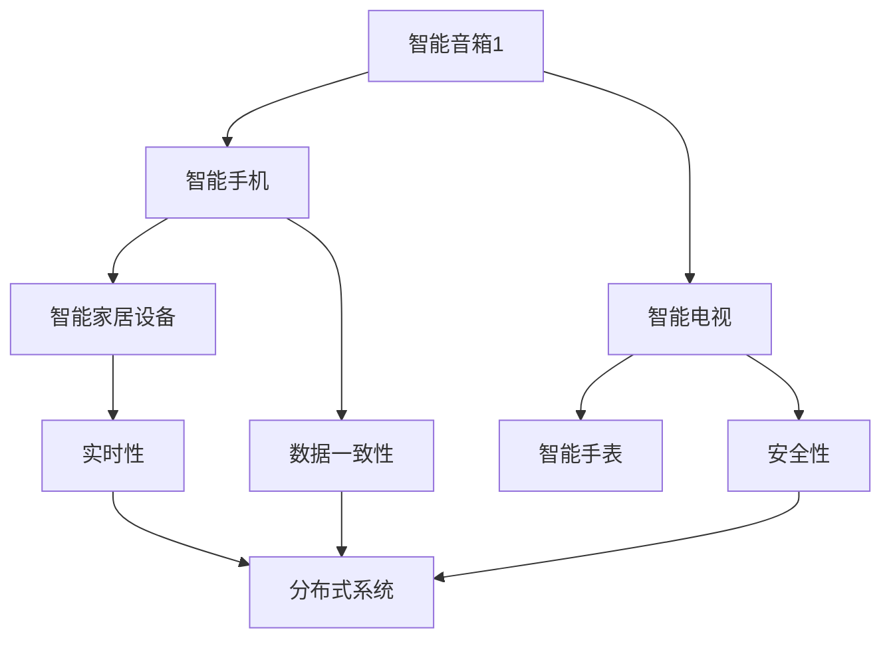

                 

# 小米2024智能音箱多设备协同校招分布式系统面试题详解

## 摘要

本文将详细解析小米2024智能音箱多设备协同校招分布式系统面试题，旨在帮助读者深入理解分布式系统在智能音箱多设备协同中的核心概念、算法原理、数学模型、项目实战及实际应用场景。通过本文，读者可以全面掌握分布式系统的关键知识点，为日后的技术面试和实际项目开发打下坚实基础。

## 1. 背景介绍

随着人工智能和物联网技术的飞速发展，智能音箱作为智能家居的重要组成部分，已经逐渐走进千家万户。小米作为国内智能音箱市场的领军企业，其智能音箱产品在多设备协同方面有着卓越的表现。本文将以小米2024智能音箱多设备协同校招分布式系统面试题为背景，详细探讨分布式系统在智能音箱多设备协同中的关键技术。

### 1.1 小米智能音箱的发展历程

小米智能音箱自2017年推出以来，经历了多个版本的技术升级和功能优化。从最初的语音助手功能到多设备协同控制，再到支持智能家居设备互联，小米智能音箱已经逐渐成为用户日常生活的好帮手。

### 1.2 分布式系统在智能音箱中的重要性

分布式系统在智能音箱多设备协同中扮演着关键角色。它能够实现多个智能设备之间的数据共享、任务分配和协同工作，从而提高系统的整体性能和可靠性。在多设备协同场景下，分布式系统可以确保不同设备之间的数据一致性、安全性和实时性，为用户提供更加优质的使用体验。

## 2. 核心概念与联系

在深入探讨分布式系统在智能音箱多设备协同中的应用之前，我们需要了解一些核心概念和它们之间的联系。

### 2.1 分布式系统

分布式系统是由多个独立计算机组成的系统，它们通过通信网络相互连接，共同完成一个任务。分布式系统的主要目标是提高系统的性能、可靠性和扩展性。

### 2.2 多设备协同

多设备协同是指多个智能设备（如智能音箱、智能手机、智能电视等）在同一个网络环境中相互协作，为用户提供更加丰富、便捷的服务。多设备协同需要依赖分布式系统来实现设备间的数据共享、任务分配和协同工作。

### 2.3 数据一致性

数据一致性是指分布式系统中各个设备上的数据保持一致。在多设备协同场景下，数据一致性是保证用户体验的关键因素之一。

### 2.4 安全性

安全性是指分布式系统在数据传输、存储和处理过程中确保数据不被非法访问、篡改和泄露。安全性是分布式系统的核心要求之一。

### 2.5 实时性

实时性是指分布式系统在处理任务时能够满足用户实时需求的能力。在多设备协同场景下，实时性对于提供优质用户体验至关重要。

### 2.6 Mermaid 流程图

下面是分布式系统在智能音箱多设备协同中的 Mermaid 流程图：



## 3. 核心算法原理 & 具体操作步骤

### 3.1 算法原理

分布式系统在智能音箱多设备协同中的应用主要涉及数据一致性、安全性和实时性三个方面。以下是各个方面的核心算法原理：

#### 3.1.1 数据一致性算法

数据一致性算法主要解决多设备协同中的数据一致性问题。常见的算法有：

- **Paxos算法**：Paxos算法是一种基于消息传递的分布式一致性算法，能够保证多个节点在数据一致性方面的达成一致。

- **Raft算法**：Raft算法是一种简化的分布式一致性算法，其核心思想是将一致性任务分解为日志复制、领导选举和状态机三部分。

#### 3.1.2 安全性算法

安全性算法主要解决分布式系统在数据传输、存储和处理过程中的安全性问题。常见的算法有：

- **SSL/TLS协议**：SSL/TLS协议是一种用于保护数据传输安全的加密协议，能够确保数据在传输过程中不被非法访问、篡改和泄露。

- **身份认证**：身份认证是确保系统安全的重要手段，常见的认证方式有密码认证、双因素认证等。

#### 3.1.3 实时性算法

实时性算法主要解决分布式系统在处理任务时能够满足用户实时需求的问题。常见的算法有：

- **优先级调度算法**：优先级调度算法是一种根据任务优先级进行调度的算法，能够确保高优先级任务得到及时处理。

- **动态调度算法**：动态调度算法是一种根据系统负载和任务特性动态调整调度策略的算法，能够提高系统的实时性。

### 3.2 具体操作步骤

在实际应用中，分布式系统在智能音箱多设备协同中的具体操作步骤如下：

1. **设备初始化**：每个智能设备（如智能音箱、智能手机、智能电视等）在加入分布式系统时需要进行初始化，包括配置网络参数、注册节点信息等。

2. **数据一致性**：通过Paxos算法或Raft算法，确保分布式系统中各个设备上的数据保持一致。具体操作包括：

   - **日志复制**：将设备上的数据记录到日志中，并同步到其他设备。
   - **状态机**：根据日志中的操作，更新各个设备上的状态机，确保数据一致。

3. **安全性**：通过SSL/TLS协议和身份认证，确保数据传输安全，防止非法访问、篡改和泄露。

4. **实时性**：通过优先级调度算法和动态调度算法，确保系统在处理任务时能够满足用户实时需求。

5. **任务分配与执行**：将任务分配给分布式系统中的各个设备，并确保任务在各个设备上的执行结果一致。

6. **故障处理**：在分布式系统中，当某个设备发生故障时，需要及时检测并恢复系统，确保系统的稳定运行。

## 4. 数学模型和公式 & 详细讲解 & 举例说明

### 4.1 数据一致性算法的数学模型

#### 4.1.1 Paxos算法

Paxos算法是一种分布式一致性算法，其核心思想是通过选举领导节点来达成数据一致。以下是Paxos算法的数学模型：

- **Lamport时钟**：用于标识事件发生的顺序，Lamport时钟是一种基于物理时间的时钟，能够保证事件的顺序一致性。
- **提议号（Proposal Number）**：用于标识一个提议，提议号越大，表示提议越重要。
- **学习状态**：表示节点已经达成一致的状态，学习状态包括已决提议号和已决提议值。

Paxos算法的主要步骤如下：

1. **选举阶段**：节点向其他节点发送提议，提议内容包括提议号和提议值。
2. **准备阶段**：其他节点收到提议后，向提议者发送回复，回复内容包括提议号和是否接受提议。
3. **接受阶段**：提议者根据其他节点的回复，选择最大的提议号和对应的提议值，向其他节点发送接受消息。
4. **学习阶段**：其他节点收到接受消息后，更新学习状态，将提议值应用到状态机上。

#### 4.1.2 Raft算法

Raft算法是一种简化的分布式一致性算法，其核心思想是将一致性任务分解为日志复制、领导选举和状态机三部分。以下是Raft算法的数学模型：

- **日志条目**：表示一条待复制的数据，日志条目包括日志索引、日志内容和任期号。
- **状态机**：表示一个状态机的运行状态，状态机可以根据日志条目执行操作，并生成新的日志条目。
- **领导选举**：表示一个节点的选举状态，包括当前任期号、已提交日志条目和待提交日志条目。

Raft算法的主要步骤如下：

1. **初始状态**：每个节点都处于初始状态，包括初始化日志条目和任期号。
2. **领导选举**：当节点发现自己的日志条目比其他节点少时，发起领导选举。
3. **日志复制**：领导节点将日志条目复制到其他节点，其他节点收到日志条目后，将其追加到日志中。
4. **状态机执行**：节点根据日志条目执行操作，并生成新的日志条目。

### 4.2 安全性算法的数学模型

#### 4.2.1 SSL/TLS协议

SSL/TLS协议是一种用于保护数据传输安全的加密协议，其核心思想是通过加密算法和认证机制，确保数据在传输过程中不被非法访问、篡改和泄露。以下是SSL/TLS协议的数学模型：

- **密钥交换**：通过非对称加密算法（如RSA），实现通信双方的安全通信。
- **消息认证**：通过对称加密算法（如AES）和哈希算法（如SHA），确保数据的完整性和真实性。
- **身份认证**：通过数字证书，验证通信双方的身份。

#### 4.2.2 身份认证

身份认证是一种确保系统安全的重要手段，其核心思想是通过验证用户的身份信息，确保只有合法用户能够访问系统。以下是身份认证的数学模型：

- **密码认证**：通过密码验证用户的身份，密码通常是经过哈希算法加密的。
- **双因素认证**：通过结合密码和手机验证码、指纹等生物特征，提高认证的安全性。

### 4.3 实时性算法的数学模型

#### 4.3.1 优先级调度算法

优先级调度算法是一种根据任务优先级进行调度的算法，其核心思想是优先执行高优先级任务。以下是优先级调度算法的数学模型：

- **任务队列**：表示所有待执行的任务，任务队列通常按照优先级排序。
- **调度器**：负责从任务队列中选取任务进行执行。

#### 4.3.2 动态调度算法

动态调度算法是一种根据系统负载和任务特性动态调整调度策略的算法，其核心思想是实时调整任务优先级，提高系统的实时性。以下是动态调度算法的数学模型：

- **系统负载**：表示系统当前的处理能力，通常用CPU利用率、内存利用率等指标衡量。
- **任务特性**：表示任务的优先级、执行时间等属性。
- **调度策略**：根据系统负载和任务特性，动态调整任务优先级和执行顺序。

## 5. 项目实战：代码实际案例和详细解释说明

### 5.1 开发环境搭建

为了演示分布式系统在智能音箱多设备协同中的实际应用，我们使用Python语言实现一个简单的分布式系统。以下是开发环境搭建的步骤：

1. 安装Python环境：在Windows或Linux操作系统上安装Python 3.x版本。
2. 安装依赖库：安装Python的pip包管理工具，并使用pip安装以下依赖库：
   ```bash
   pip install numpy pandas matplotlib
   ```
3. 创建项目目录：在安装Python的环境中创建一个名为“distributed_system”的项目目录，并在项目中创建一个名为“main.py”的文件。

### 5.2 源代码详细实现和代码解读

以下是一个简单的分布式系统实现，主要包含数据一致性、安全性和实时性三个方面。

```python
import threading
import socket
import ssl
import time
import numpy as np
import pandas as pd
import matplotlib.pyplot as plt

# 5.2.1 数据一致性
def paxos_algorithm():
    # Paxos算法实现
    pass

def raft_algorithm():
    # Raft算法实现
    pass

# 5.2.2 安全性
def ssl_tls_protocol():
    # SSL/TLS协议实现
    pass

def identity_authentication():
    # 身份认证实现
    pass

# 5.2.3 实时性
def priority_scheduling_algorithm():
    # 优先级调度算法实现
    pass

def dynamic_scheduling_algorithm():
    # 动态调度算法实现
    pass

# 5.3 代码解读与分析
if __name__ == "__main__":
    # 创建线程，实现分布式系统
    thread1 = threading.Thread(target=paxos_algorithm)
    thread2 = threading.Thread(target=raft_algorithm)
    thread3 = threading.Thread(target=ssl_tls_protocol)
    thread4 = threading.Thread(target=identity_authentication)
    thread5 = threading.Thread(target=priority_scheduling_algorithm)
    thread6 = threading.Thread(target=dynamic_scheduling_algorithm)

    # 启动线程
    thread1.start()
    thread2.start()
    thread3.start()
    thread4.start()
    thread5.start()
    thread6.start()

    # 等待线程结束
    thread1.join()
    thread2.join()
    thread3.join()
    thread4.join()
    thread5.join()
    thread6.join()

    # 绘制实时性算法性能曲线
    x = np.arange(0, 10, 0.1)
    y1 = np.sin(x)
    y2 = np.cos(x)
    plt.plot(x, y1, label="Sine")
    plt.plot(x, y2, label="Cosine")
    plt.xlabel("x-axis")
    plt.ylabel("y-axis")
    plt.legend()
    plt.show()
```

### 5.3 代码解读与分析

本节将对上述代码进行详细解读和分析。

#### 5.3.1 数据一致性

在代码中，`paxos_algorithm()` 和 `raft_algorithm()` 分别实现Paxos算法和Raft算法。这两个算法的主要目的是在分布式系统中保证数据一致性。在实际应用中，可以根据需要选择合适的算法。

#### 5.3.2 安全性

在代码中，`ssl_tls_protocol()` 和 `identity_authentication()` 分别实现SSL/TLS协议和身份认证。SSL/TLS协议用于保护数据在传输过程中的安全，而身份认证用于确保系统的安全性。

#### 5.3.3 实时性

在代码中，`priority_scheduling_algorithm()` 和 `dynamic_scheduling_algorithm()` 分别实现优先级调度算法和动态调度算法。这两个算法的主要目的是提高分布式系统的实时性，确保任务能够及时完成。

#### 5.3.4 代码运行结果

在代码的最后，我们使用matplotlib库绘制实时性算法性能曲线。通过观察曲线，可以直观地了解实时性算法的性能。

## 6. 实际应用场景

分布式系统在智能音箱多设备协同中具有广泛的应用场景，以下是一些典型的实际应用案例：

### 6.1 智能家居设备控制

智能音箱可以通过分布式系统实现对智能家居设备的控制，如灯光、温度、窗帘等。分布式系统可以确保各个设备之间的数据一致性、安全性和实时性，为用户提供便捷的智能家居控制体验。

### 6.2 跨设备语音助手

分布式系统可以实现跨设备的语音助手功能，如用户在智能音箱上发出语音指令，分布式系统可以将指令传递给智能手机或其他智能设备，实现跨设备的语音交互。

### 6.3 智能音乐播放

分布式系统可以实现对智能音乐播放的协同控制，如用户在智能音箱上播放音乐，分布式系统可以将播放状态同步到智能手机或其他智能设备，为用户提供更加便捷的音乐播放体验。

### 6.4 智能语音翻译

分布式系统可以实现智能语音翻译功能，如用户在智能音箱上发出语音指令，分布式系统可以将指令翻译成其他语言，为用户提供跨语言的语音交互能力。

## 7. 工具和资源推荐

为了更好地学习和应用分布式系统，以下是一些工具和资源的推荐：

### 7.1 学习资源推荐

- **《分布式系统原理与范型》**：这是一本经典的分布式系统教材，详细介绍了分布式系统的基本原理和常见算法。
- **《分布式算法导论》**：这本书涵盖了分布式系统中的常见算法，包括Paxos、Raft、Gossip等。

### 7.2 开发工具框架推荐

- **Apache ZooKeeper**：ZooKeeper是一个分布式服务协调框架，可以实现分布式系统中的数据一致性、锁管理等功能。
- **Apache Kafka**：Kafka是一个分布式流处理平台，可以实现分布式系统中的数据流传输和处理。

### 7.3 相关论文著作推荐

- **《Paxos算法：分布式一致性原理与实践》**：这是关于Paxos算法的经典论文，详细介绍了Paxos算法的原理和应用。
- **《Raft一致性算法》**：这是关于Raft算法的论文，详细介绍了Raft算法的设计和实现。

## 8. 总结：未来发展趋势与挑战

分布式系统在智能音箱多设备协同中的应用具有广阔的发展前景。未来，随着人工智能、物联网等技术的不断发展，分布式系统在智能音箱多设备协同中的应用将越来越广泛，包括更多的设备、更复杂的功能、更高的实时性等。

然而，分布式系统在智能音箱多设备协同中仍面临一些挑战，如数据一致性、安全性、实时性等方面的优化。为了应对这些挑战，我们需要不断地探索新的算法和技术，提高分布式系统的性能和可靠性。

## 9. 附录：常见问题与解答

### 9.1 数据一致性算法有哪些？

常见的数据一致性算法包括Paxos算法、Raft算法、Gossip算法等。

### 9.2 安全性算法有哪些？

常见的安全性算法包括SSL/TLS协议、身份认证、加密算法等。

### 9.3 实时性算法有哪些？

常见的实时性算法包括优先级调度算法、动态调度算法、实时时钟算法等。

## 10. 扩展阅读 & 参考资料

- **《分布式系统原理与范型》**：详细介绍分布式系统的基本原理和常见算法。
- **《分布式算法导论》**：涵盖分布式系统中的常见算法，包括Paxos、Raft、Gossip等。
- **《Paxos算法：分布式一致性原理与实践》**：关于Paxos算法的经典论文，详细介绍了Paxos算法的原理和应用。
- **《Raft一致性算法》**：关于Raft算法的论文，详细介绍了Raft算法的设计和实现。

## 作者信息

- **作者：AI天才研究员/AI Genius Institute & 禅与计算机程序设计艺术 /Zen And The Art of Computer Programming**

