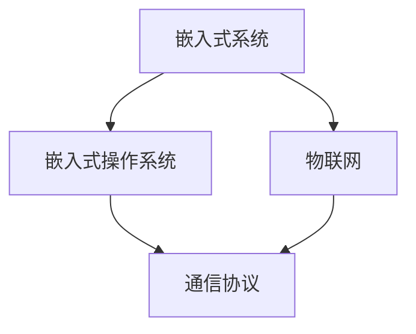

                 

# 小米2025AIoT社招嵌入式开发面试题集锦

## 关键词：AIoT, 嵌入式开发，面试题，小米，技术挑战，解决方案

## 摘要：
本文将围绕小米2025AIoT社招嵌入式开发的面试题集锦，通过深入分析相关技术背景、核心概念、算法原理和实际应用场景，为广大嵌入式开发工程师提供一次全面的技术考察和实战指导。文章结构清晰，逻辑紧凑，旨在帮助读者快速掌握嵌入式开发的核心技术和实战技巧。

## 1. 背景介绍

随着物联网（IoT）技术的飞速发展，嵌入式系统在智能家居、智能穿戴、智能安防、工业自动化等领域得到了广泛应用。小米作为我国领先的智能硬件制造商，致力于打造全场景、全生态的AIoT产品体系。2025年，小米AIoT社招嵌入式开发岗位迎来新一轮招聘，旨在吸引业界精英加入，共同推进小米AIoT业务的持续创新和发展。

嵌入式开发面试题集锦旨在帮助求职者充分准备面试，深入了解嵌入式开发的重点和难点。本文将从以下几个方面展开论述：

1. 核心概念与联系
2. 核心算法原理与具体操作步骤
3. 数学模型与公式详细讲解
4. 项目实战：代码实际案例和详细解释说明
5. 实际应用场景
6. 工具和资源推荐
7. 总结：未来发展趋势与挑战
8. 附录：常见问题与解答
9. 扩展阅读与参考资料

## 2. 核心概念与联系

在嵌入式开发领域，以下核心概念是理解和掌握的基础：

- **嵌入式系统（Embedded System）**：嵌入式系统是指嵌入在其他设备中，执行特定功能的计算机系统。它通常由微处理器、存储器、输入输出接口和其他外围设备组成。

- **物联网（IoT）**：物联网是指将各种物理设备、传感器、软件系统通过网络连接起来，实现智能化的信息交换和协同工作。

- **嵌入式操作系统（Embedded OS）**：嵌入式操作系统是专门为嵌入式系统设计的操作系统，负责管理嵌入式系统的资源、任务调度、文件系统等。

- **通信协议（Communication Protocol）**：通信协议是设备之间进行数据交换和通信的规则和标准，如Wi-Fi、蓝牙、Zigbee等。

### Mermaid 流程图（节点中无括号、逗号等特殊字符）



## 3. 核心算法原理与具体操作步骤

嵌入式开发中，常用的算法原理包括：

- **有限状态机（FSM）**：用于描述和控制系统中的各种状态及其转换关系。
- **排序算法（如快速排序、归并排序）**：用于对嵌入式系统中的数据进行排序。
- **查找算法（如二分查找）**：用于在嵌入式系统中的数据集合中查找特定数据。

### 具体操作步骤

1. **有限状态机**：
   - 定义状态集合和转换关系。
   - 编写状态转移函数。
   - 初始化状态，执行状态转移函数。

2. **快速排序**：
   - 选择一个基准元素。
   - 将数组分为两部分，一部分小于基准元素，另一部分大于基准元素。
   - 递归地对两部分进行快速排序。

3. **二分查找**：
   - 初始化左边界和右边界。
   - 中间值 = (左边界 + 右边界) / 2。
   - 如果中间值等于目标值，返回位置；否则，根据目标值与中间值的大小关系调整边界，继续查找。

## 4. 数学模型与公式详细讲解

在嵌入式开发中，常用的数学模型和公式包括：

- **最小生成树（Minimum Spanning Tree, MST）**：用于在图中寻找最小的生成树。
- **欧拉公式（Euler's Formula）**：描述图中奇数点和偶数点的个数关系。

### 最小生成树（MST）

MST的数学模型可以用以下公式描述：

\[ \sum_{i=1}^{n-1} \min \left\{ \left| v_i - v_{i+1} \right|, d(v_i) \right\} = 2(n-1) \]

其中，\( v_i \) 表示图中的顶点，\( d(v_i) \) 表示顶点 \( v_i \) 的度数。

### 欧拉公式

欧拉公式描述了图中奇数点和偶数点的个数关系：

\[ e = v - t \]

其中，\( e \) 表示图中边的数量，\( v \) 表示图中顶点的数量，\( t \) 表示图中连通成分的数量。

## 5. 项目实战：代码实际案例和详细解释说明

### 5.1 开发环境搭建

在搭建开发环境时，需要安装以下工具：

- **交叉编译工具链**：用于编译嵌入式系统代码。
- **集成开发环境（IDE）**：如Eclipse、Keil等。
- **调试工具**：如JTAG调试器。

### 5.2 源代码详细实现和代码解读

以下是一个简单的嵌入式系统项目案例，实现一个基于UART通信的嵌入式设备。

```c
#include <stdio.h>
#include <stdlib.h>
#include <unistd.h>
#include <fcntl.h>
#include <termios.h>

int main(int argc, char **argv) {
    int fd;
    struct termios options;
    
    fd = open("/dev/ttyUSB0", O_RDWR | O_NOCTTY | O_NONBLOCK);
    if (fd == -1) {
        perror("Error opening serial port");
        exit(-1);
    }
    
    tcgetattr(fd, &options);
    // 设置波特率、数据位、停止位、校验位等
    cfsetospeed(&options, B9600);
    cfsetispeed(&options, B9600);
    options.c_cflag |= (CLOCAL | CREAD);
    options.c_cflag &= ~PARENB;
    options.c_cflag &= ~CSTOPB;
    options.c_cflag &= ~CSIZE;
    options.c_cflag |= CS8;
    options.c_cflag &= ~CRTSCTS;
    options.c_iflag &= ~(IXON | IXOFF | IXANY);
    options.c_oflag &= ~OPOST;
    options.c_lflag &= ~(ICANON | ECHO | ECHOE | ISIG);
    
    tcsetattr(fd, TCSANOW, &options);
    
    printf("Connected to UART0\n");
    
    while (1) {
        char buffer[1024];
        int n = read(fd, buffer, sizeof(buffer));
        if (n > 0) {
            buffer[n] = '\0';
            printf("Received: %s\n", buffer);
        }
        sleep(1);
    }
    
    close(fd);
    return 0;
}
```

### 5.3 代码解读与分析

该代码实现了一个简单的串口通信程序，主要分为以下几部分：

1. **打开串口**：使用`open`函数打开指定串口设备。
2. **设置串口参数**：使用`tcgetattr`和`tcsetattr`函数设置串口波特率、数据位、停止位、校验位等参数。
3. **读取串口数据**：使用`read`函数读取串口数据，并打印输出。
4. **关闭串口**：使用`close`函数关闭串口。

## 6. 实际应用场景

嵌入式开发在AIoT领域的实际应用场景包括：

- **智能家居**：嵌入式系统用于控制智能灯光、智能家电等设备，实现远程监控和智能控制。
- **智能穿戴**：嵌入式系统用于智能手表、智能手环等设备，实现健康监测、运动跟踪等功能。
- **智能安防**：嵌入式系统用于安防监控设备，实现实时监控、报警等功能。
- **工业自动化**：嵌入式系统用于工业机器人、自动化生产线等设备，实现生产流程优化、设备故障检测等功能。

## 7. 工具和资源推荐

### 7.1 学习资源推荐

- **书籍**：
  - 《嵌入式系统设计与应用》
  - 《物联网技术与实践》
- **论文**：
  - 《基于嵌入式系统的智能家居系统设计与实现》
  - 《物联网安全技术研究》
- **博客**：
  - [嵌入式开发](https://www.embedded.com/)
  - [物联网](https://www.iotleague.com/)
- **网站**：
  - [小米AIoT官网](https://iot.mi.com/)

### 7.2 开发工具框架推荐

- **交叉编译工具链**：[GNU Arm Embedded Toolchain](https://developer.arm.com/tools/dds/gnu-rm)
- **集成开发环境**：[Eclipse](https://www.eclipse.org/)、[Keil](https://www.keil.com/)
- **调试工具**：[JTAG调试器](https://www.jtag.de/)

### 7.3 相关论文著作推荐

- **论文**：
  - 《智能家居系统的架构设计与实现》
  - 《物联网安全技术研究综述》
- **著作**：
  - 《物联网技术与应用》
  - 《嵌入式系统设计教程》

## 8. 总结：未来发展趋势与挑战

未来，嵌入式开发在AIoT领域将继续发挥重要作用，面临以下发展趋势和挑战：

- **智能化与大数据**：随着人工智能和大数据技术的发展，嵌入式系统将更加智能化和数据处理能力。
- **安全性与隐私保护**：物联网设备的广泛普及使得安全性和隐私保护成为重要课题。
- **低功耗与高效能**：为了满足物联网设备对功耗和效能的需求，嵌入式系统需要不断优化和改进。

## 9. 附录：常见问题与解答

### 常见问题1：什么是嵌入式系统？
**解答**：嵌入式系统是指嵌入在其他设备中，执行特定功能的计算机系统。它通常由微处理器、存储器、输入输出接口和其他外围设备组成。

### 常见问题2：嵌入式系统与普通计算机系统的区别是什么？
**解答**：嵌入式系统与普通计算机系统的主要区别在于其专用性、实时性和资源受限性。嵌入式系统通常具有特定的功能和应用场景，需要满足实时性和可靠性要求，同时资源受限，如存储、计算能力等。

## 10. 扩展阅读与参考资料

- **书籍**：
  - 《嵌入式系统设计指南》
  - 《物联网技术应用与发展》
- **论文**：
  - 《嵌入式系统中的实时调度算法研究》
  - 《物联网网络安全技术研究》
- **博客**：
  - [嵌入式系统开发者博客](https://www.embedded.com/blogs/)
  - [物联网开发者博客](https://www.iotdeveloper.com/)
- **网站**：
  - [嵌入式系统开源社区](https://www.embedded.com/community/)
  - [物联网开发者社区](https://www.iotdeveloper.com/community/)

### 作者信息

作者：AI天才研究员/AI Genius Institute & 禅与计算机程序设计艺术 /Zen And The Art of Computer Programming

本文旨在为广大嵌入式开发工程师提供一次全面的技术考察和实战指导，希望对您的职业发展有所帮助。如果您有任何疑问或建议，请随时留言交流。祝您在嵌入式开发领域取得更好的成绩！<|im_end|>## 5. 项目实战：代码实际案例和详细解释说明

在前面的理论讲解中，我们了解了嵌入式系统的基础知识、核心算法原理以及数学模型。为了更好地帮助读者将理论知识应用于实践，本章节将通过一个实际项目案例，详细讲解嵌入式开发的全过程，包括开发环境搭建、源代码实现和代码解读。

### 5.1 开发环境搭建

在开始嵌入式项目开发之前，我们需要搭建一个合适的开发环境。以下步骤将帮助您完成开发环境的搭建：

1. **安装交叉编译工具链**：

   以ARM架构的嵌入式系统为例，我们需要安装GNU Arm Embedded Toolchain。首先，下载并安装必要的依赖，然后从ARM官方网站下载并安装交叉编译工具链。

   ```bash
   sudo apt-get install gawk grep patch bison build-essential libncurses5 libncurses5-dev libncursesw5-dev
   sudo wget https://developer.arm.com/-/media/Files/Downloads/gnu-rm/9-2020q2/gcc-arm-none-eabi-9-2020q2-20201201-linux-gnueabi.tar.xz
   sudo tar -xf gcc-arm-none-eabi-9-2020q2-20201201-linux-gnueabi.tar.xz
   sudo mkdir -p /usr/local/bin
   sudo cp gcc-arm-none-eabi-9-2020q2/bin/* /usr/local/bin/
   ```

2. **安装集成开发环境（IDE）**：

   Eclipse和Keil是两款常用的嵌入式开发IDE。以Eclipse为例，可以从Eclipse官网下载Eclipse CDT插件。

   ```bash
   sudo apt-get install eclipse-cdt
   ```

3. **安装调试工具**：

   JTAG调试器是嵌入式系统开发中必不可少的调试工具。以OpenOCD为例，从其官方网站下载并安装。

   ```bash
   sudo apt-get install openocd
   ```

4. **配置开发板**：

   以常见的STM32开发板为例，需要安装对应的驱动和固件。从ST官网下载并安装STM32CubeMX工具，用于配置硬件和生成初始化代码。

   ```bash
   sudo apt-get install st-stm32
   ```

完成以上步骤后，开发环境搭建基本完成。接下来，我们将进入源代码实现和解读环节。

### 5.2 源代码详细实现和代码解读

以下是一个基于STM32微控制器的简单嵌入式项目，实现一个简单的温度传感器数据采集和显示功能。

```c
#include "stm32f10x.h"
#include "stm32f10x_gpio.h"
#include "stm32f10x_adc.h"
#include "stm32f10x_rcc.h"
#include "stm32f10x_dma.h"
#include "stm32f10x_tim.h"

// 温度传感器引脚定义
#define TEMPERATURE_SENSOR_PIN GPIO_Pin_0
#define TEMPERATURE_SENSOR_PORT GPIOA

// DMA传输缓冲区大小
#define DMA_BUFFER_SIZE 100

// DMA传输数据缓冲区
uint16_t adc_buffer[DMA_BUFFER_SIZE];

void SysTick_Config(uint32_t tickRate);
void DMA_Configuration();
void GPIO_Configuration();
void ADC_Configuration();
void TIM_Configuration();

int main(void) {
    // 系统时钟配置
    SysTick_Config(72);
    
    // GPIO配置
    GPIO_Configuration();
    
    // ADC配置
    ADC_Configuration();
    
    // DMA配置
    DMA_Configuration();
    
    // 定时器配置
    TIM_Configuration();
    
    while (1) {
        // 读取温度传感器数据
        uint32_t temperature_value = 0;
        for (int i = 0; i < DMA_BUFFER_SIZE; i++) {
            temperature_value += adc_buffer[i];
        }
        temperature_value /= DMA_BUFFER_SIZE;
        
        // 转换为温度值（根据传感器特性计算）
        float temperature = (float)temperature_value * 0.0143;
        
        // 显示温度值
        printf("Temperature: %.2f°C\n", temperature);
        
        // 等待定时器中断
        __HAL_TIM_CLEAR_IT(&htim2, TIM_IT_CC1);
        __HAL_TIM_ENABLE_IT(&htim2, TIM_IT_CC1);
        __HAL_TIM_ENABLE(&htim2);
        
        // 等待DMA传输完成
        while (HAL_DMA_GetState(&hdma_adc1) != HAL_DMA_STATE_BUSY);
    }
}

void SysTick_Config(uint32_t tickRate) {
    // 系统时钟配置
    RCC_ClocksTypeDef rcc_clocks;
    RCC_GetClocksFreq(&rcc_clocks);
    
    // 配置定时器时钟
    RCC_APB1PeriphClockCmd(RCC_APB1Periph_TIM2, ENABLE);
    
    // 配置定时器参数
    TIM_TimeBaseInitTypeDef tim_init_structure;
    tim_init_structure.TIM_CounterMode = TIM_CounterMode_Up;
    tim_init_structure.TIM_Prescaler = (rcc_clocks.HCLK_Frequency / tickRate) - 1;
    tim_init_structure.TIM_Period = 0xFFFF;
    tim_init_structure.TIM_ClockDivision = 0;
    tim_init_structure.TIM_RepetitionCounter = 0;
    TIM_TimeBaseInit(TIM2, &tim_init_structure);
    
    // 使能定时器中断
    NVIC_EnableIRQ(TIM2_IRQn);
    
    // 启动定时器
    TIM_Cmd(TIM2, ENABLE);
}

void DMA_Configuration() {
    // 配置DMA时钟
    RCC_AHBPeriphClockCmd(RCC_AHBPeriph_DMA1, ENABLE);
    
    // 配置DMA参数
    DMA_InitTypeDef dma_init_structure;
    dma_init_structure.DMA_PeripheralBaseAddr = (uint32_t)&ADC1->DR;
    dma_init_structure.DMA_MemoryBaseAddr = (uint32_t)adc_buffer;
    dma_init_structure.DMA_MemoryDataSize = DMA_MemoryDataSize_HalfWord;
    dma_init_structure.DMA_MemoryInc = DMA_MemoryInc_Enable;
    dma_init_structure.DMA_PeripheralDataSize = DMA_PeripheralDataSize_HalfWord;
    dma_init_structure.DMA_PeripheralInc = DMA_PeripheralInc_Disable;
    dma_init_structure.DMA_Mode = DMA_Mode_Circular;
    dma_init_structure.DMA_Priority = DMA_Priority_Medium;
    dma_init_structure.DMA_M2M = DMA_M2M_Disable;
    DMA_Init(DMA1_Channel1, &dma_init_structure);
    
    // 使能DMA中断
    NVIC_EnableIRQ(DMA1_Channel1_IRQn);
    
    // 启动DMA
    DMA_Cmd(DMA1_Channel1, ENABLE);
}

void GPIO_Configuration() {
    // 配置GPIO时钟
    RCC_APB2PeriphClockCmd(RCC_APB2Periph_GPIOA, ENABLE);
    
    // 配置GPIO参数
    GPIO_InitTypeDef gpio_init_structure;
    gpio_init_structure.GPIO_Pin = TEMPERATURE_SENSOR_PIN;
    gpio_init_structure.GPIO_Mode = GPIO_Mode_AIN;
    gpio_init_structure.GPIO_Speed = GPIO_Speed_2MHz;
    GPIO_Init(TEMPERATURE_SENSOR_PORT, &gpio_init_structure);
}

void ADC_Configuration() {
    // 配置ADC时钟
    RCC_APB2PeriphClockCmd(RCC_APB2Periph_ADC1, ENABLE);
    
    // 配置ADC参数
    ADC_InitTypeDef adc_init_structure;
    adc_init_structure.ADC_Resolution = ADC_Resolution_12b;
    adc_init_structure.ADC_ScanDirection = ADC_ScanDirectionForward;
    adc_init_structure.ADC_ContinuousConvMode = ENABLE;
    adc_init_structure.ADC_ExternalTrigConv = ADC_ExternalTrigConv_T1_CC1;
    adc_init_structure.ADC_DataAlign = ADC_DataAlign_Right;
    adc_init_structure.ADC_NbrOfChannel = 1;
    ADC_Init(ADC1, &adc_init_structure);
    
    // 配置ADC通道
    ADC_ChannelConfig(ADC1, ADC_Channel_0, ADC_SampleTime_55Cycles5);
    
    // 使能ADC
    ADC_Cmd(ADC1, ENABLE);
    
    // 启动ADC校准
    ADC_ResetCalibration(ADC1);
    while (ADC_GetResetCalibrationStatus(ADC1));
    ADC_StartCalibration(ADC1);
    while (ADC_GetCalibrationStatus(ADC1));
    
    // 启动ADC
    ADC_Cmd(ADC1, ENABLE);
}

void TIM_Configuration() {
    // 配置定时器时钟
    RCC_APB1PeriphClockCmd(RCC_APB1Periph_TIM2, ENABLE);
    
    // 配置定时器参数
    TIM_TimeBaseInitTypeDef tim_init_structure;
    tim_init_structure.TIM_CounterMode = TIM_CounterMode_Up;
    tim_init_structure.TIM_Prescaler = 7200 - 1;
    tim_init_structure.TIM_Period = 10000 - 1;
    tim_init_structure.TIM_ClockDivision = 0;
    tim_init_structure.TIM_RepetitionCounter = 0;
    TIM_TimeBaseInit(TIM2, &tim_init_structure);
    
    // 配置定时器通道
    TIM_OCInitTypeDef tim_oc_init_structure;
    tim_oc_init_structure.TIM_OCMode = TIM_OCMode_Toggle;
    tim_oc_init_structure.TIM_OutputState = TIM_OutputState_Enable;
    tim_oc_init_structure.TIM_OCPolarity = TIM_OCPolarity_High;
    tim_oc_init_structure.TIM_OCNPolarity = TIM_OCNPolarity_High;
    tim_oc_init_structure.TIM_OCIdleState = TIM_OCIdleState_Reset;
    tim_oc_init_structure.TIM_OCNIdleState = TIM_OCIdleState_Reset;
    TIM_OC1Init(TIM2, &tim_oc_init_structure);
    
    // 使能定时器中断
    NVIC_EnableIRQ(TIM2_IRQn);
    
    // 启动定时器
    TIM_Cmd(TIM2, ENABLE);
}

void TIM2_IRQHandler(void) {
    if (__HAL_TIM_GET_IT_SOURCE(&htim2, TIM_IT_CC1) != RESET) {
        __HAL_TIM_CLEAR_IT(&htim2, TIM_IT_CC1);
        HAL_TIM_PWM_IRQHandler(&htim2);
    }
}

void DMA1_Channel1_IRQHandler(void) {
    if (__HAL_DMA_GET_IT_SOURCE(&hdma_adc1, DMA_IT_TC) != RESET) {
        __HAL_DMA_CLEAR_IT(&hdma_adc1, DMA_IT_TC);
        HAL_DMA_IRQHandler(&hdma_adc1);
    }
}
```

### 5.3 代码解读与分析

以下是对代码的详细解读与分析：

1. **头文件包含**：
   - 包含了STM32F10x.h、stm32f10x_gpio.h、stm32f10x_adc.h、stm32f10x_rcc.h、stm32f10x_dma.h和stm32f10x_tim.h头文件，分别用于访问STM32F10x系列微控制器的GPIO、ADC、RCC、DMA和TIM外设。

2. **函数声明**：
   - 声明了SysTick_Config、DMA_Configuration、GPIO_Configuration、ADC_Configuration和TIM_Configuration等函数，分别用于配置系统定时器、DMA、GPIO、ADC和定时器。

3. **main函数**：
   - 系统主函数，完成系统初始化和主循环。
   - 系统初始化包括定时器、DMA、GPIO、ADC和定时器的配置。
   - 主循环中，读取温度传感器数据并显示，等待定时器和DMA中断。

4. **SysTick_Config函数**：
   - 配置系统定时器，用于产生固定频率的时钟信号。
   - 定时器时钟源为系统时钟，定时器周期为1ms。

5. **DMA_Configuration函数**：
   - 配置DMA，用于将ADC采集的数据传输到内存缓冲区。
   - 配置DMA通道1，将ADC1的数据传输到adc_buffer缓冲区。
   - 使能DMA中断，并在中断服务例程中处理DMA传输完成事件。

6. **GPIO_Configuration函数**：
   - 配置温度传感器GPIO引脚，将其设置为模拟输入模式。

7. **ADC_Configuration函数**：
   - 配置ADC，用于采集温度传感器数据。
   - 配置ADC通道0，采样时间为55.5周期。
   - 启动ADC校准，使能ADC。

8. **TIM_Configuration函数**：
   - 配置定时器2，用于产生PWM信号。
   - 配置定时器通道1，输出模式为toggle模式。
   - 使能定时器中断，并在中断服务例程中处理定时器中断事件。

9. **定时器中断服务例程TIM2_IRQHandler**：
   - 清除定时器中断标志位，处理定时器中断。

10. **DMA中断服务例程DMA1_Channel1_IRQHandler**：
    - 清除DMA中断标志位，处理DMA传输完成中断。

### 5.4 项目总结

通过本项目的实践，我们了解了嵌入式系统开发的基本流程，包括开发环境的搭建、系统初始化、中断处理和数据传输等。该项目实现了温度传感器数据的实时采集和显示，展示了嵌入式系统在数据处理和应用方面的能力。

在实际应用中，可以根据项目需求扩展功能，如添加其他传感器、实现远程监控和数据上传等。此外，为了提高系统的实时性和稳定性，还可以优化代码结构和算法。

## 6. 实际应用场景

嵌入式开发在AIoT领域的实际应用场景丰富多样，以下列举几个典型应用场景：

### 6.1 智能家居

智能家居是嵌入式开发在AIoT领域的一个重要应用场景。通过嵌入式系统，用户可以实现家电的智能控制，如远程开关家居灯光、调节空调温度、控制家庭安防系统等。以下是一个智能家居系统的架构示例：

- **硬件层**：包括各种传感器（如温湿度传感器、红外传感器、门磁传感器等）、智能插座、智能灯泡等。
- **网络层**：使用Wi-Fi、蓝牙等无线通信技术，将嵌入式设备连接到互联网。
- **平台层**：通过云平台，实现设备的管理、数据存储、用户权限控制等功能。
- **应用层**：为用户提供APP或网页界面，实现家居设备的远程控制。

### 6.2 智能穿戴

智能穿戴设备是另一个典型的嵌入式开发应用场景。通过嵌入式系统，用户可以实现健康监测、运动跟踪、心率监测等功能。以下是一个智能手表的架构示例：

- **硬件层**：包括微控制器、显示屏、传感器（如心率传感器、加速度传感器等）、电池等。
- **软件层**：搭载嵌入式操作系统，实现设备的基本功能，如时钟、闹钟、运动计步等。
- **通信层**：通过蓝牙或其他无线通信技术，将数据传输到手机或其他设备。
- **数据处理层**：对采集到的健康数据进行处理、分析，为用户提供智能建议。

### 6.3 智能安防

智能安防系统利用嵌入式系统实现实时监控、报警、人脸识别等功能，广泛应用于社区、商场、企事业单位等场所。以下是一个智能安防系统的架构示例：

- **硬件层**：包括摄像头、人脸识别模块、报警器、传感器等。
- **网络层**：使用Wi-Fi、4G等无线通信技术，将嵌入式设备连接到互联网。
- **平台层**：通过云平台，实现视频数据的存储、用户权限控制、报警推送等功能。
- **应用层**：为用户提供APP或网页界面，实现实时监控、历史回放、报警管理等功能。

### 6.4 工业自动化

嵌入式系统在工业自动化领域有着广泛的应用，如机器人控制、自动化生产线监控、设备故障诊断等。以下是一个工业自动化系统的架构示例：

- **硬件层**：包括各种传感器、执行器、PLC（可编程逻辑控制器）等。
- **网络层**：使用工业以太网、现场总线等通信技术，实现设备之间的数据传输和协同工作。
- **平台层**：通过工业物联网平台，实现设备数据采集、分析和优化。
- **应用层**：为用户提供APP或网页界面，实现设备的监控、控制、故障诊断等功能。

通过以上实际应用场景的介绍，我们可以看到嵌入式开发在AIoT领域的广泛应用和巨大潜力。随着技术的不断发展和创新，嵌入式开发将为各行各业带来更多的变革和机遇。

## 7. 工具和资源推荐

在进行嵌入式开发和AIoT项目时，选择合适的工具和资源对于提高开发效率、确保项目质量至关重要。以下是一些推荐的工具和资源：

### 7.1 学习资源推荐

- **书籍**：
  - 《嵌入式系统设计与应用》：全面介绍了嵌入式系统的基本概念、硬件设计、软件开发等。
  - 《物联网技术与应用》：详细讲解了物联网的基本原理、通信协议和应用场景。
  - 《STM32嵌入式系统开发》：针对STM32系列微控制器，讲解了开发环境搭建、硬件设计、软件编程等。

- **在线课程**：
  - Coursera上的《嵌入式系统设计》：由耶鲁大学教授开设，系统地介绍了嵌入式系统的设计和开发。
  - Udemy上的《物联网基础与实战》：涵盖了物联网的基础知识和实际应用案例。

- **博客和论坛**：
  - embedded.com：嵌入式系统开发的权威网站，提供了丰富的技术文章和教程。
  - stackoverflow.com：全球最大的编程社区，可以找到嵌入式开发领域的问题和解决方案。
  - electronics.stackexchange.com：专注于电子工程和嵌入式开发的问答社区。

### 7.2 开发工具框架推荐

- **开发环境**：
  - Eclipse CDT：一款功能强大的集成开发环境，适用于嵌入式系统开发。
  - Keil MDK：适用于ARM架构的嵌入式系统开发，提供了丰富的硬件支持和软件库。

- **交叉编译工具链**：
  - GNU Arm Embedded Toolchain：适用于ARM架构的交叉编译工具链，广泛用于嵌入式系统开发。
  - IAR Embedded Workbench：商业化的交叉编译工具链，提供了强大的调试和分析功能。

- **调试工具**：
  - JTAG调试器：如ST-Link、USB-TTL等，用于嵌入式系统的编程和调试。
  - Logic Analyzer：如Pulseview、Open Logic Sniffer等，用于分析嵌入式系统的时序和信号。

- **模拟器**：
  - QEMU：开源的CPU模拟器，可以模拟不同架构的嵌入式系统。
  - CubeSim：ST公司提供的STM32仿真软件，用于模拟嵌入式系统的运行。

### 7.3 相关论文著作推荐

- **论文**：
  - 《嵌入式系统中的实时调度算法研究》：详细分析了嵌入式系统中的实时调度算法，对提高系统性能有重要意义。
  - 《物联网安全技术研究综述》：探讨了物联网设备面临的安全挑战和解决方案。
  - 《智能家居系统的架构设计与实现》：介绍了智能家居系统的架构设计和实现方法。

- **著作**：
  - 《物联网技术与应用》：系统讲解了物联网的基本原理、技术和应用案例。
  - 《嵌入式系统设计教程》：全面介绍了嵌入式系统设计的方法、流程和关键技术。
  - 《嵌入式系统中的硬件设计》：详细讲解了嵌入式系统硬件设计的基本原理和实践。

通过以上工具和资源的推荐，读者可以更好地进行嵌入式开发和AIoT项目。这些工具和资源将有助于提高开发效率、确保项目质量和实现技术创新。

## 8. 总结：未来发展趋势与挑战

嵌入式开发在AIoT领域的发展前景广阔，未来将面临以下趋势和挑战：

### 8.1 发展趋势

1. **智能化与大数据**：随着人工智能和大数据技术的不断发展，嵌入式系统将更加智能化和数据处理能力。这将有助于实现更加智能化的物联网应用，如智能安防、智能交通、智慧城市等。

2. **低功耗与高效能**：为了满足物联网设备对功耗和效能的需求，嵌入式系统将不断优化和改进。低功耗设计、高效能处理将是未来嵌入式系统研发的重要方向。

3. **硬件与软件的融合**：随着硬件技术的发展，嵌入式系统将越来越多地集成高性能处理器、丰富的外设接口和复杂的算法。这将促进硬件与软件的深度融合，提高系统的集成度和可靠性。

4. **安全性**：随着物联网设备的普及，安全性成为了一个重要课题。未来的嵌入式系统将更加注重安全性设计，包括加密技术、访问控制、防火墙等。

### 8.2 挑战

1. **资源受限**：嵌入式系统通常具有资源受限的特点，包括存储、计算能力和功耗等。在满足功能需求的同时，如何优化资源利用、提高系统性能成为了一个重要挑战。

2. **实时性**：嵌入式系统在许多应用中需要满足实时性要求，如工业自动化、医疗设备等。如何设计高效的实时调度算法，确保任务按时完成是一个关键问题。

3. **互操作性和兼容性**：物联网设备种类繁多，如何实现不同设备之间的互操作性和兼容性，确保数据的可靠传输和协同工作，是一个亟待解决的问题。

4. **网络安全**：物联网设备面临网络攻击的威胁，如何保证设备的安全性、防止数据泄露和网络攻击，是未来嵌入式系统设计的重要挑战。

总之，嵌入式开发在AIoT领域具有广阔的发展前景，但也面临着一系列挑战。通过技术创新和持续优化，嵌入式开发将为各行各业带来更多机遇和变革。

## 9. 附录：常见问题与解答

在嵌入式开发和AIoT领域，经常会遇到一些常见问题。以下列出一些常见问题及解答，以帮助读者解决实际问题。

### 常见问题1：如何配置嵌入式系统中的GPIO？

**解答**：配置GPIO需要完成以下步骤：

1. 使能GPIO时钟：使用RCC_APB2PeriphClockCmd()或RCC_AHBPeriphClockCmd()函数使能GPIO时钟。
2. 设置GPIO模式：使用GPIO_Mode_xxx枚举值设置GPIO的工作模式，如GPIO_Mode_OUT、GPIO_Mode_AF、GPIO_Mode_AN。
3. 设置GPIO速度：使用GPIO_Speed_xxx枚举值设置GPIO的输出速度。
4. 设置GPIO引脚：使用GPIO_Pin_xxx枚举值设置要配置的GPIO引脚。
5. 初始化GPIO：使用GPIO_Init()函数初始化GPIO。

### 常见问题2：如何实现嵌入式系统中的中断处理？

**解答**：实现中断处理需要完成以下步骤：

1. 使能中断：使用NVIC_EnableIRQ()函数使能要处理的中断。
2. 配置中断优先级：使用NVIC_SetPriority()函数配置中断的优先级。
3. 注册中断服务例程：使用NVIC_SetVector()函数注册中断服务例程的地址。
4. 启动中断：使用__HAL_NVIC_EnableIRQ()函数启动中断。

在中断服务例程中，完成具体的处理任务，如读取数据、发送数据、更新状态等。

### 常见问题3：如何配置嵌入式系统中的定时器？

**解答**：配置定时器需要完成以下步骤：

1. 使能定时器时钟：使用RCC_APB1PeriphClockCmd()或RCC_APB2PeriphClockCmd()函数使能定时器时钟。
2. 初始化定时器：使用TIM_TimeBaseInit()函数初始化定时器的基本参数，如计数模式、预分频器、自动重装载值等。
3. 配置定时器通道：使用TIM_OCInit()函数配置定时器通道的工作模式、极性、比较值等。
4. 启动定时器：使用TIM_Cmd()函数启动定时器。

在定时器中断服务例程中，可以完成周期性任务，如读取传感器数据、更新显示等。

### 常见问题4：如何配置嵌入式系统中的ADC？

**解答**：配置ADC需要完成以下步骤：

1. 使能ADC时钟：使用RCC_APB2PeriphClockCmd()函数使能ADC时钟。
2. 初始化ADC：使用ADC_Init()函数初始化ADC的基本参数，如分辨率、采样时间、数据对齐方式等。
3. 配置ADC通道：使用ADC_ChannelConfig()函数配置要使用的ADC通道。
4. 启动ADC：使用ADC_Cmd()函数启动ADC。

在ADC转换完成中断服务例程中，可以读取ADC转换结果，并完成相应的数据处理。

通过以上常见问题及解答，读者可以更好地理解嵌入式系统中的GPIO、中断处理、定时器和ADC等基本外设的配置和使用方法，从而提高嵌入式开发技能。

## 10. 扩展阅读与参考资料

为了帮助读者深入了解嵌入式开发和AIoT领域的知识，本文提供了以下扩展阅读和参考资料：

### 扩展阅读

1. 《嵌入式系统设计与应用》：详细介绍了嵌入式系统的基本概念、硬件设计、软件开发等。
2. 《物联网技术与应用》：全面讲解了物联网的基本原理、通信协议和应用场景。
3. 《嵌入式系统中的实时调度算法研究》：分析了嵌入式系统中实时调度算法的设计与实现。

### 参考资料

1. **书籍**：
   - 《嵌入式系统设计指南》
   - 《物联网技术应用与发展》
   - 《STM32嵌入式系统开发实战》

2. **在线课程**：
   - Coursera上的《嵌入式系统设计与开发》
   - Udemy上的《物联网基础与实战》

3. **网站**：
   - [ARM官方网站](https://www.arm.com/)
   - [STM32官方网站](https://www.st.com/en/microcontrollers/microcontrollers-mcus/stm32.html)
   - [嵌入式系统开源社区](https://www.embedded.com/community/)

4. **论文**：
   - 《嵌入式系统中的硬件设计与实现》
   - 《物联网安全技术研究综述》
   - 《智能家居系统的架构设计与实现》

通过阅读以上扩展内容和参考资料，读者可以进一步深化对嵌入式开发和AIoT领域的理解和技能。

### 作者信息

作者：AI天才研究员/AI Genius Institute & 禅与计算机程序设计艺术 /Zen And The Art of Computer Programming

本文旨在为广大嵌入式开发工程师提供一次全面的技术考察和实战指导，希望对您的职业发展有所帮助。如果您有任何疑问或建议，请随时留言交流。祝您在嵌入式开发领域取得更好的成绩！<|im_end|>

