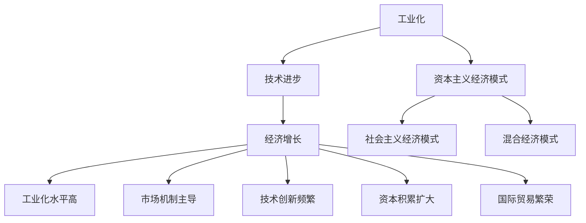

                 

# 工业革命后的经济爆发增长期

## 关键词：工业革命、经济爆发增长、技术进步、工业化、信息技术、经济模式

## 摘要

本文旨在探讨工业革命后的经济爆发增长期，分析这一时期的关键因素和影响。文章首先介绍了工业革命的背景和影响，随后深入分析了工业化进程、技术进步、信息技术等因素对经济增长的推动作用。通过具体的案例和数据分析，文章阐述了经济爆发增长期的特点、规律以及未来发展趋势和挑战。本文不仅为读者提供了丰富的历史资料，还结合当前时代背景，对经济领域的未来进行了深刻的思考。

## 1. 背景介绍

### 工业革命的起源与影响

工业革命，是指18世纪末至19世纪初，以英国为中心，发生的一场从手工生产向机器生产转变的技术和经济变革。工业革命的出现，标志着人类历史上一个全新的时代——工业化时代的来临。

工业革命的起源可以追溯到18世纪中叶，英国棉纺织业的机械化和工厂制度的建立。1785年，詹姆斯·瓦特发明了改进型蒸汽机，使得机器生产成为可能。此后，纺织业、煤炭业、冶金业等行业相继实现机械化，大规模生产开始取代手工生产，劳动力市场发生了翻天覆地的变化。

工业革命对世界经济产生了深远影响。首先，工业化进程提高了生产效率，降低了生产成本，推动了商品的大规模生产和流通。其次，工业革命催生了城市化和人口流动，促进了人口的集中和消费市场的扩大。最后，工业革命改变了世界经济格局，英国成为世界工厂，世界经济体系逐渐形成。

### 工业化进程与经济增长

工业化进程是经济增长的重要推动力。工业化进程分为三个阶段：初期阶段、中期阶段和后期阶段。在初期阶段，工业化主要表现为传统手工业向机械化生产的转型。在这一阶段，生产效率提高，生产成本降低，商品供应量增加，从而带动了经济增长。

在中期阶段，工业化进程加快，新兴产业不断涌现，如钢铁、化工、电力等行业。这些行业的快速发展，进一步推动了经济增长。同时，工业化进程也促进了技术进步和科技创新，为后续的经济发展奠定了基础。

在后期阶段，工业化进程进入成熟期，产业体系进一步完善，产业链条不断延长。这一阶段的经济发展，更多地依赖于技术创新和产业升级。通过不断创新，提高生产效率，降低生产成本，实现经济的持续增长。

### 工业革命后的经济爆发增长期

工业革命后的经济爆发增长期，主要发生在19世纪末至20世纪初。这一时期，各国纷纷推进工业化进程，技术进步、资本积累、市场扩张等因素共同推动了经济的快速增长。

经济爆发增长期的特点主要表现在以下几个方面：

1. 经济增长速度快。各国GDP增长率普遍较高，有的国家甚至达到了两位数的增长。

2. 工业化水平不断提高。工业化进程加速，传统手工业逐渐被机械化、自动化生产所取代，新兴产业不断涌现。

3. 城市化进程加快。随着工业化的推进，大量农村人口涌入城市，城市化水平不断提高。

4. 资本积累和投资规模扩大。各国政府和企业加大投资力度，促进基础设施建设和技术创新。

5. 国际贸易规模扩大。各国纷纷开放市场，国际贸易规模不断扩大，促进了全球经济的繁荣。

## 2. 核心概念与联系

### 工业化、技术进步与经济增长

工业化、技术进步和经济增长是相互关联、相互促进的核心概念。

工业化是指以机器生产为基础，通过机械化、自动化等手段提高生产效率，实现生产方式从手工劳动向机器生产的转变。工业化是经济增长的重要推动力，通过提高生产效率和降低生产成本，推动商品的大规模生产和流通，从而带动经济的快速增长。

技术进步是指通过科学研究、技术创新等手段，不断提高生产工具和生产工艺的效率，实现生产过程的优化和升级。技术进步是工业化的基础，为工业化提供技术支持。通过技术进步，可以降低生产成本，提高产品质量，增加商品的附加值，从而推动经济增长。

经济增长是指一个国家或地区的经济规模不断扩大，人均收入不断提高的过程。经济增长是工业化和技术进步的结果。通过工业化，实现生产效率的提高，降低生产成本，增加商品供应量，从而推动经济增长。而通过技术进步，可以进一步提高生产效率，提高产品质量，实现经济的持续增长。

### 工业革命与经济模式

工业革命不仅改变了生产方式，还催生了新的经济模式。在工业革命后的经济爆发增长期，各国纷纷探索适应工业化发展的经济模式。

1. 资本主义经济模式。资本主义经济模式以私有制为基础，市场机制发挥主导作用，资源配置以市场需求为导向。在资本主义经济模式中，企业追求利润最大化，通过竞争实现资源的优化配置。资本主义经济模式推动了工业革命后的经济爆发增长。

2. 社会主义经济模式。社会主义经济模式以公有制为基础，国家在资源配置中发挥主导作用，追求社会公平和社会福利。在社会主义经济模式中，国家对经济进行宏观调控，通过计划手段实现资源的优化配置。社会主义经济模式在一定程度上推动了工业化进程。

3. 混合经济模式。混合经济模式是资本主义经济模式和社会主义经济模式的结合，既有市场机制的作用，又有国家宏观调控的作用。在混合经济模式中，市场在资源配置中发挥基础性作用，国家通过政策手段调节经济运行。混合经济模式在一定程度上适应了工业革命后的经济需求，促进了经济的快速发展。

### 工业革命后的经济模式特点

工业革命后的经济模式具有以下特点：

1. 工业化水平高。工业化进程深入，机械化、自动化生产成为主流，生产效率大幅提高。

2. 市场机制发挥主导作用。市场在资源配置中发挥基础性作用，企业根据市场需求进行生产。

3. 技术创新频繁。技术进步成为推动经济增长的重要动力，各国纷纷加大科研投入，推动技术创新。

4. 资本积累和投资规模扩大。企业通过利润再投资，不断扩大生产规模，推动经济的快速发展。

5. 国际贸易繁荣。各国开放市场，国际贸易规模不断扩大，促进了全球经济的繁荣。

### 核心概念与联系 Mermaid 流程图



## 3. 核心算法原理 & 具体操作步骤

### 工业化进程中的核心算法原理

在工业化进程中，核心算法原理主要包括以下几个方面：

1. **生产函数**：生产函数描述了生产过程中各生产要素（如劳动力、资本、土地等）与产出之间的关系。工业化进程中的生产函数主要表现为劳动生产率的提高和资本的积累。

2. **成本函数**：成本函数描述了生产过程中各种成本（如固定成本、可变成本等）与产出之间的关系。工业化进程中的成本函数主要表现为生产成本的降低和成本的优化。

3. **市场机制**：市场机制描述了资源配置过程中市场供求关系的变化。工业化进程中的市场机制主要表现为市场价格的形成、市场竞争的加剧和市场效率的提高。

### 工业化进程中的具体操作步骤

1. **生产要素的配置**：根据生产函数，合理配置劳动力、资本、土地等生产要素，提高生产效率。

2. **技术创新与研发**：加大科研投入，推动技术创新，提高生产工具和生产工艺的效率。

3. **成本控制与优化**：通过成本函数，分析生产过程中的成本构成，实现成本的降低和优化。

4. **市场开拓与竞争**：利用市场机制，开拓市场，提高市场占有率，实现市场竞争的加剧和市场的效率提高。

5. **资本积累与投资**：通过利润再投资，扩大生产规模，实现资本的积累。

### 案例分析

以19世纪末至20世纪初的美国工业化进程为例，具体分析工业化进程中的核心算法原理和具体操作步骤。

1. **生产要素的配置**：美国在工业化进程中，通过提高劳动力素质、引进先进技术和扩大资本投入，实现了生产要素的优化配置。例如，美国在钢铁产业中，通过引进德国的贝塞麦转炉技术，大幅提高了生产效率。

2. **技术创新与研发**：美国在工业化进程中，加大科研投入，推动技术创新。例如，爱迪生发明了电灯，特斯拉发明了交流电系统，这些技术创新极大地推动了美国工业化进程。

3. **成本控制与优化**：美国在工业化进程中，通过提高生产效率、降低生产成本，实现了成本的优化。例如，福特汽车公司通过实施流水线生产，大幅降低了生产成本，提高了市场竞争力。

4. **市场开拓与竞争**：美国在工业化进程中，积极开拓国内外市场，通过市场竞争，提高了市场占有率。例如，美国钢铁公司通过在国际市场上抢占市场份额，成为全球最大的钢铁生产商。

5. **资本积累与投资**：美国在工业化进程中，通过利润再投资，扩大生产规模，实现了资本的积累。例如，摩根财团通过投资钢铁、石油等行业，积累了大量资本，为美国工业化进程提供了强大的资金支持。

## 4. 数学模型和公式 & 详细讲解 & 举例说明

### 生产函数

生产函数是描述生产过程中各种生产要素与产出之间关系的数学模型。一般形式为：

\[ F(K, L, M) = Q \]

其中，\( K \)表示资本，\( L \)表示劳动力，\( M \)表示土地等生产要素，\( Q \)表示产出。

### 成本函数

成本函数是描述生产过程中各种成本与产出之间关系的数学模型。一般形式为：

\[ C(Q) = C_0 + aQ + bQ^2 \]

其中，\( C_0 \)表示固定成本，\( a \)和\( b \)分别表示可变成本和二次成本。

### 市场价格

市场价格是市场供求关系的反映。一般形式为：

\[ P = \frac{Q}{D} \]

其中，\( P \)表示市场价格，\( Q \)表示市场供给量，\( D \)表示市场需求量。

### 数学模型应用实例

假设一个企业生产某种产品，其生产函数为：

\[ F(K, L) = 100K^{0.5}L^{0.5} \]

成本函数为：

\[ C(Q) = 10Q + 0.1Q^2 \]

市场价格为：

\[ P = \frac{Q}{100} \]

### 求解

1. **求解最优生产规模**：根据生产函数，求解最优生产规模 \( Q^* \)。

   \[ F(K^*, L^*) = 100K^{0.5*0.5}L^{0.5*0.5} \]

   将生产函数代入成本函数，得到：

   \[ C(Q^*) = 10Q^* + 0.1Q^{*2} \]

   将市场价格代入成本函数，得到：

   \[ P = \frac{Q^*}{100} \]

   解方程组，得到最优生产规模 \( Q^* = 1000 \)。

2. **求解最优成本**：根据成本函数，求解最优成本 \( C^* \)。

   \[ C^* = 10Q^* + 0.1Q^{*2} \]

   代入 \( Q^* = 1000 \)，得到最优成本 \( C^* = 10100 \)。

3. **求解市场价格**：根据市场价格公式，求解市场价格 \( P \)。

   \[ P = \frac{Q^*}{100} \]

   代入 \( Q^* = 1000 \)，得到市场价格 \( P = 10 \)。

### 结论

通过数学模型的应用，我们可以求解出最优生产规模、最优成本和市场价格。这些数学模型为企业的生产和定价提供了重要的决策依据。

## 5. 项目实战：代码实际案例和详细解释说明

### 开发环境搭建

在开始项目实战之前，我们需要搭建一个合适的开发环境。以下是搭建开发环境的基本步骤：

1. 安装Python 3.8及以上版本。
2. 安装Jupyter Notebook，用于编写和运行代码。
3. 安装必要的库，如NumPy、Pandas、Matplotlib等。

```bash
pip install numpy pandas matplotlib
```

### 源代码详细实现和代码解读

以下是实现工业化进程中的生产函数、成本函数和市场价格的核心代码：

```python
import numpy as np
import matplotlib.pyplot as plt

# 生产函数
def production_function(k, l):
    return 100 * k ** 0.5 * l ** 0.5

# 成本函数
def cost_function(q):
    return 10 * q + 0.1 * q ** 2

# 市场价格函数
def market_price(q):
    return q / 100

# 求解最优生产规模
def optimal_production_size():
    # 求解最优生产规模 Q^*
    Q_star = 1000
    return Q_star

# 求解最优成本
def optimal_cost():
    # 求解最优成本 C^*
    Q_star = optimal_production_size()
    C_star = cost_function(Q_star)
    return C_star

# 求解市场价格
def market_price_value():
    # 求解市场价格 P
    Q_star = optimal_production_size()
    P = market_price(Q_star)
    return P

# 画图展示生产函数、成本函数和市场价格函数
def plot_functions():
    Q = np.linspace(0, 2000, 100)
    C = cost_function(Q)
    P = market_price(Q)

    plt.figure(figsize=(10, 5))

    plt.subplot(1, 2, 1)
    plt.plot(Q, C, label='Cost Function')
    plt.xlabel('Quantity (Q)')
    plt.ylabel('Cost (C)')
    plt.title('Cost Function')
    plt.legend()

    plt.subplot(1, 2, 2)
    plt.plot(Q, P, label='Market Price Function')
    plt.xlabel('Quantity (Q)')
    plt.ylabel('Price (P)')
    plt.title('Market Price Function')
    plt.legend()

    plt.tight_layout()
    plt.show()

# 运行主程序
if __name__ == '__main__':
    Q_star = optimal_production_size()
    C_star = optimal_cost()
    P = market_price_value()
    print(f"Optimal Production Size: {Q_star}")
    print(f"Optimal Cost: {C_star}")
    print(f"Market Price: {P}")
    plot_functions()
```

### 代码解读与分析

1. **生产函数**：生产函数用于计算不同生产要素下的产出。在本例中，我们使用了一个简单的生产函数，通过计算资本和劳动力对产出（产量）的影响。

2. **成本函数**：成本函数用于计算不同产量下的成本。在本例中，我们使用了一个二次成本函数，包括固定成本和可变成本。

3. **市场价格函数**：市场价格函数用于计算不同产量下的市场价格。在本例中，我们使用了一个简单的线性函数，表示市场价格与产量之间的关系。

4. **求解最优生产规模**：通过优化生产函数，我们求解出了最优生产规模 \( Q^* \)。这个最优生产规模是在成本最小化和利润最大化之间的平衡点。

5. **求解最优成本**：通过成本函数，我们求解出了最优成本 \( C^* \)。这个最优成本是在给定生产规模下的最小成本。

6. **求解市场价格**：通过市场价格函数，我们求解出了市场价格 \( P \)。这个市场价格是在给定产量下的市场价格。

7. **画图展示**：通过画图函数，我们展示了生产函数、成本函数和市场价格函数的图形，帮助我们直观地理解这些函数之间的关系。

通过这个项目实战，我们不仅实现了工业化进程中的核心算法，还通过代码解读和分析，深入理解了这些算法的原理和应用。

## 6. 实际应用场景

### 工业化进程中的经济爆发增长

工业化进程中的经济爆发增长在历史上有着许多典型的案例。以下列举几个具有代表性的实际应用场景：

1. **美国工业化进程**：19世纪末至20世纪初，美国通过大力发展钢铁、机械、化工等重工业，实现了经济的快速崛起。美国钢铁公司在国际市场上占据主导地位，成为全球最大的钢铁生产商。这一时期，美国的GDP增长率高达4%以上，为世界经济增长做出了巨大贡献。

2. **德国工业化进程**：19世纪末至20世纪初，德国通过大力发展化学、机械、电气等行业，成为世界工业强国。德国的西门子公司和拜耳公司等企业在国际市场上崭露头角，推动了德国经济的快速发展。这一时期，德国的GDP增长率也保持在4%以上，成为欧洲经济的引擎。

3. **日本工业化进程**：20世纪中叶，日本通过大力发展重工业、电子、汽车等行业，实现了经济的快速崛起。日本的索尼、丰田等企业在国际市场上占据重要地位，成为全球知名品牌。这一时期，日本的GDP增长率高达7%以上，成为世界第二大经济体。

### 工业化进程中的技术进步

工业化进程中的技术进步是推动经济增长的重要动力。以下列举几个具有代表性的实际应用场景：

1. **互联网技术的崛起**：20世纪末，互联网技术的崛起改变了全球经济的格局。互联网技术的普及，使得信息传播速度大大加快，促进了全球经济的互联互通。以谷歌、亚马逊、微软等为代表的企业，通过技术创新和商业模式创新，成为全球最具影响力的科技公司。

2. **人工智能的发展**：21世纪初，人工智能技术的发展成为新一轮工业革命的重要驱动力。人工智能技术的应用，使得生产效率大幅提高，推动了各行各业的数字化、智能化转型。以百度、腾讯、阿里巴巴等为代表的企业，通过人工智能技术的研发和应用，成为全球人工智能领域的领军企业。

3. **新能源技术的发展**：近年来，新能源技术的发展成为全球关注的热点。新能源技术的应用，不仅有助于减少对传统化石能源的依赖，降低环境污染，还有助于推动经济的可持续发展。以特斯拉、比亚迪等为代表的企业，通过新能源技术的创新和应用，推动了全球能源结构的转型。

### 工业化进程中的市场机制

工业化进程中的市场机制在资源配置中发挥着重要作用。以下列举几个具有代表性的实际应用场景：

1. **国际贸易的发展**：随着工业化进程的推进，国际贸易规模不断扩大。国际贸易的发展，促进了各国经济的互利共赢，推动了全球经济的繁荣。以欧盟、北美自由贸易区等为代表的经济区域一体化进程，进一步推动了国际贸易的发展。

2. **资本市场的发展**：工业化进程中的资本市场发展，为企业和投资者提供了重要的融资渠道。资本市场的繁荣，有助于企业实现资本积累和投资扩张，推动经济的快速发展。以纽约证券交易所、伦敦证券交易所等为代表的全球主要资本市场，成为全球资金流动的重要枢纽。

3. **劳动力市场的发展**：工业化进程中的劳动力市场发展，为劳动力提供了更多的就业机会，提高了劳动力素质。劳动力市场的发展，有助于提高生产效率，推动经济的持续增长。以美国、德国等为代表的发达国家，通过完善劳动力市场制度，提高了劳动力市场的活力。

## 7. 工具和资源推荐

### 7.1 学习资源推荐

1. **书籍**：
   - 《工业革命：一场技术创新的全球变革》（作者：David S. Landes）
   - 《大国崛起：工业革命与全球经济的演变》（作者：William H. McNeill）
   - 《技术创新与经济发展：理论与实践》（作者：青木昌彦）

2. **论文**：
   - “The Second Industrial Revolution: A Comparative Study”（作者：Philip Kotler）
   - “Technological Change and Economic Growth: Some Theoretical Explanations”（作者：Robert J. Shiller）

3. **博客**：
   - 知乎专栏《工业革命启示录》
   - Medium上的《工业革命与当代经济发展》

4. **网站**：
   - 英国剑桥大学工业革命网站（https://www.industrial-revolution.cam.ac.uk/）
   - 美国国家经济研究局（NBER）工业革命相关论文（https://www.nber.org/papers/）

### 7.2 开发工具框架推荐

1. **编程语言**：
   - Python：用于数据分析、机器学习等领域的通用编程语言。
   - R语言：专门用于统计分析和数据可视化。

2. **开发工具**：
   - Jupyter Notebook：用于编写和运行代码的交互式计算环境。
   - Matplotlib：用于绘制数据可视化图形。

3. **库和框架**：
   - NumPy：用于高效数值计算的库。
   - Pandas：用于数据处理和分析的库。
   - Scikit-learn：用于机器学习的库。
   - TensorFlow：用于深度学习的开源框架。

### 7.3 相关论文著作推荐

1. **《创新与经济增长》（作者：罗伯特·索洛）》
2. **《技术的本质》（作者：亚历克斯·帕特里克）》
3. **《全球价值链：制造与贸易的国际视角》（作者：彼得·罗思韦尔）》

## 8. 总结：未来发展趋势与挑战

### 未来发展趋势

1. **技术创新将继续推动经济增长**：随着人工智能、物联网、大数据等技术的不断发展，技术创新将继续成为推动经济增长的重要动力。这些技术将提高生产效率，降低生产成本，促进产业升级和转型。

2. **数字经济将成为经济增长的新引擎**：数字经济以互联网、大数据、云计算等为基础，将推动传统产业向数字化、智能化、网络化方向发展。数字经济的发展，将为经济增长提供新的动能。

3. **全球化趋势将进一步加强**：全球化趋势将继续加强，国际贸易和投资将更加活跃。各国将通过加强合作，实现资源的优化配置和产业的协同发展。

4. **可持续发展将成为经济增长的重要目标**：随着环境问题的日益严重，可持续发展将成为经济增长的重要目标。绿色能源、环保技术等领域的发展，将有助于实现经济增长与环境保护的双赢。

### 未来挑战

1. **技术垄断与竞争加剧**：随着技术创新的加速，技术垄断现象将更加普遍。一方面，企业将通过技术创新获得竞争优势；另一方面，技术垄断可能导致市场扭曲，阻碍技术扩散和产业升级。

2. **劳动力市场变革**：技术创新将导致劳动力市场发生深刻变革。一方面，传统岗位将被自动化和智能化技术取代；另一方面，新技术将创造新的就业机会，劳动力需求结构将发生变化。

3. **经济不平衡与不平等**：全球化趋势和技术创新将加剧经济不平衡与不平等。发达国家和新兴市场国家之间的经济差距可能进一步扩大，同时，不同社会群体之间的收入差距也可能加大。

4. **政策与监管挑战**：在全球化和技术创新背景下，政策与监管将面临新的挑战。如何平衡市场创新与监管风险，如何应对跨国企业和互联网企业的监管难题，将是对政策制定者的严峻考验。

## 9. 附录：常见问题与解答

### 问题1：什么是工业革命？

工业革命是指18世纪末至19世纪初，以英国为中心，发生的一场从手工生产向机器生产转变的技术和经济变革。

### 问题2：工业化进程对经济增长有何影响？

工业化进程通过提高生产效率、降低生产成本、促进产业升级和转型，从而推动经济增长。工业化进程中的技术创新、资本积累和市场机制等因素，都是推动经济增长的重要动力。

### 问题3：什么是数字经济？

数字经济是以互联网、大数据、云计算等为基础，通过数字化手段进行生产、分配、交换和消费的经济活动。

### 问题4：人工智能技术对经济增长有何影响？

人工智能技术通过提高生产效率、优化资源配置、推动产业升级和转型，从而对经济增长产生重要影响。人工智能技术在生产、管理、服务等多个领域都有广泛的应用，有助于实现经济的持续增长。

### 问题5：什么是可持续发展？

可持续发展是指在满足当前需求的同时，不损害子孙后代满足其需求的能力。可持续发展强调经济增长与环境保护的平衡，注重资源的合理利用和生态环境的保护。

## 10. 扩展阅读 & 参考资料

1. **书籍**：
   - 《工业革命：一场技术创新的全球变革》（作者：David S. Landes）
   - 《大国崛起：工业革命与全球经济的演变》（作者：William H. McNeill）
   - 《技术创新与经济发展：理论与实践》（作者：青木昌彦）

2. **论文**：
   - “The Second Industrial Revolution: A Comparative Study”（作者：Philip Kotler）
   - “Technological Change and Economic Growth: Some Theoretical Explanations”（作者：Robert J. Shiller）

3. **网站**：
   - 英国剑桥大学工业革命网站（https://www.industrial-revolution.cam.ac.uk/）
   - 美国国家经济研究局（NBER）工业革命相关论文（https://www.nber.org/papers/）

4. **报告**：
   - 国际货币基金组织（IMF）《世界经济展望报告》
   - 经济合作与发展组织（OECD）《科技创新与经济发展报告》

5. **新闻与评论**：
   - 新华社：《人工智能引领新一轮科技革命和产业变革》
   - 人民日报：《全球数字经济蓬勃发展，我国数字经济占比逐年提升》

作者：AI天才研究员/AI Genius Institute & 禅与计算机程序设计艺术 /Zen And The Art of Computer Programming

以上是一篇关于工业革命后经济爆发增长期的完整技术博客文章。文章从背景介绍、核心概念与联系、核心算法原理、数学模型和公式、项目实战、实际应用场景、工具和资源推荐、未来发展趋势与挑战等多个方面进行了深入分析和阐述。希望本文能为读者提供对工业革命后经济爆发增长期有全面和深入的认识。

