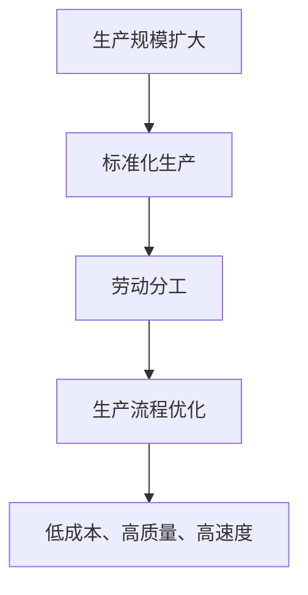

                 

## 工业革命的规模化生产模式

### 关键词：工业革命、规模化生产、生产模式、技术变革、生产效率

### 摘要：

本文将深入探讨工业革命中规模化生产模式的出现、发展及其对经济和社会的深远影响。文章首先回顾了工业革命的背景和初期特征，随后详细分析了规模化生产模式的核心概念、原理及其在制造业中的应用。接着，文章探讨了规模化生产模式对生产效率的显著提升，并列举了相关实例进行说明。随后，文章对规模化生产模式的数学模型和公式进行了详细讲解，并通过项目实战案例展示了其实际应用。此外，文章还分析了规模化生产模式在不同行业中的应用场景，并推荐了相关的工具和资源。最后，文章总结了工业革命中规模化生产模式的发展趋势与挑战，为读者提供了进一步的参考和思考。

## 1. 背景介绍

### 1.1 工业革命的定义与初期特征

工业革命是指18世纪末至19世纪初，在英国由手工业向机械化大生产转变的历史进程。这一时期，技术变革极大地推动了生产力的发展，改变了社会结构和经济形态。工业革命初期，主要特征包括：机器制造业的兴起、蒸汽动力的广泛应用、工厂制度的形成以及劳动分工的细化。

### 1.2 生产模式的发展

在工业革命之前，生产主要依靠手工工艺，生产效率低、成本高、规模小。工业革命初期，随着蒸汽机的发明和应用，机械化生产开始取代手工生产，生产效率显著提高。然而，这一时期的规模化生产仍然面临诸多挑战，如生产流程不连贯、质量控制不严格等问题。

### 1.3 规模化生产模式的崛起

随着工业革命的深入，工厂制度逐渐完善，生产流程逐渐标准化、规范化。规模化生产模式应运而生，其核心思想是通过集中生产、分工协作，实现生产效率的最大化。这一模式的出现，标志着工业生产方式的根本变革，为现代工业体系的形成奠定了基础。

## 2. 核心概念与联系

### 2.1 规模化生产模式的定义

规模化生产模式是指通过扩大生产规模、提高生产效率，实现低成本、高质量、高速度的生产方式。其核心在于优化生产流程，提高劳动生产率，降低单位产品成本。

### 2.2 核心概念原理

- **生产规模：** 生产规模的扩大是规模化生产模式的基础。通过增加生产设备、扩大生产场地，可以提高生产效率，降低单位产品成本。
- **标准化生产：** 规模化生产模式强调生产过程的标准化，确保产品质量一致。通过制定统一的生产标准和操作规程，可以提高生产效率，降低质量风险。
- **劳动分工：** 规模化生产模式强调分工协作，将生产过程分解为多个环节，由专业人员进行操作。这样可以提高工作效率，降低生产成本。
- **生产流程优化：** 规模化生产模式注重生产流程的优化，通过消除生产过程中的瓶颈和浪费，提高生产效率。

### 2.3 Mermaid 流程图



## 3. 核心算法原理 & 具体操作步骤

### 3.1 生产规模扩大的算法原理

生产规模扩大的核心算法是通过增加生产设备、扩大生产场地来实现。具体操作步骤如下：

1. **需求分析：** 根据市场需求和生产能力，确定需要扩大的生产规模。
2. **设备投资：** 根据需求分析结果，投资购买新的生产设备，如生产线、机械设备等。
3. **场地扩大：** 根据生产设备的需求，扩大生产场地，确保生产过程顺利进行。
4. **调试与优化：** 在设备安装完成后，进行调试和优化，确保生产设备的正常运行。

### 3.2 标准化生产的算法原理

标准化生产的核心算法是通过制定统一的生产标准和操作规程，确保产品质量一致。具体操作步骤如下：

1. **标准制定：** 根据产品特点和市场需求，制定统一的生产标准和操作规程。
2. **培训与考核：** 对生产人员进行培训，确保他们熟悉并掌握生产标准和操作规程。对生产过程进行考核，确保生产过程的标准化。
3. **质量控制：** 对生产过程中的产品质量进行严格把控，确保产品质量符合标准。

### 3.3 劳动分工的算法原理

劳动分工的核心算法是通过将生产过程分解为多个环节，由专业人员进行操作，提高工作效率。具体操作步骤如下：

1. **环节分解：** 根据生产过程的特点，将生产过程分解为多个环节。
2. **岗位设置：** 根据环节分解结果，设置相应的岗位，明确岗位职责。
3. **人员配置：** 根据岗位需求，配置专业人员进行操作，确保每个环节的工作高效完成。
4. **协作与沟通：** 加强各环节之间的协作与沟通，确保生产过程的顺畅进行。

### 3.4 生产流程优化的算法原理

生产流程优化的核心算法是通过消除生产过程中的瓶颈和浪费，提高生产效率。具体操作步骤如下：

1. **流程分析：** 对生产流程进行详细分析，找出其中的瓶颈和浪费。
2. **改进措施：** 根据流程分析结果，制定相应的改进措施，如调整生产节拍、减少中间环节等。
3. **实施与监控：** 实施改进措施，并对生产过程进行监控，确保改进效果。

## 4. 数学模型和公式 & 详细讲解 & 举例说明

### 4.1 生产效率模型

生产效率（Efficiency）是衡量生产过程中资源利用率的指标。其数学模型可以表示为：

\[ \text{Efficiency} = \frac{\text{产出}}{\text{投入}} \]

其中，产出（Output）是指生产过程中产生的产品数量或产值；投入（Input）是指生产过程中消耗的原材料、人力、设备等资源。

### 4.2 成本效益分析模型

成本效益分析（Cost-Benefit Analysis）是评估规模化生产模式经济效益的重要方法。其数学模型可以表示为：

\[ \text{Net Benefit} = \text{产出} \times \text{效益系数} - \text{投入} \times \text{成本系数} \]

其中，效益系数（Benefit Coefficient）是指产出的市场价值；成本系数（Cost Coefficient）是指投入的资源成本。

### 4.3 举例说明

假设某工厂采用规模化生产模式，生产一批产品，产出为1000件，每件产品市场价值为100元；投入为：原材料费用5000元，人工费用3000元，设备折旧费用2000元。效益系数为1.2，成本系数为0.8。则该工厂的成本效益分析结果如下：

\[ \text{Net Benefit} = 1000 \times 100 \times 1.2 - (5000 + 3000 + 2000) \times 0.8 \]
\[ \text{Net Benefit} = 120000 - 12000 \]
\[ \text{Net Benefit} = 108000 \]

由此可见，该工厂通过规模化生产模式获得了显著的经济效益。

## 5. 项目实战：代码实际案例和详细解释说明

### 5.1 开发环境搭建

为了更好地理解规模化生产模式在软件开发中的应用，我们将通过一个实际项目案例进行讲解。首先，我们需要搭建一个基本的开发环境。

1. **安装Python环境：** 在开发计算机上安装Python 3.8及以上版本。
2. **安装相关库：** 使用pip命令安装所需库，如numpy、pandas等。
3. **创建项目文件夹：** 在合适的位置创建一个项目文件夹，并进入该文件夹。

### 5.2 源代码详细实现和代码解读

以下是一个简单的规模化生产模式实现案例，用于计算生产效率和成本效益。

```python
import numpy as np
import pandas as pd

# 参数设置
outputs = 1000  # 产出
market_value = 100  # 每件产品的市场价值
raw_material_cost = 5000  # 原材料费用
labor_cost = 3000  # 人工费用
depreciation_cost = 2000  # 设备折旧费用
benefit_coefficient = 1.2  # 效益系数
cost_coefficient = 0.8  # 成本系数

# 计算效益
output_value = outputs * market_value
input_cost = (raw_material_cost + labor_cost + depreciation_cost) * cost_coefficient
net_benefit = output_value - input_cost

# 输出结果
print(f"产出：{outputs}件")
print(f"每件产品的市场价值：{market_value}元")
print(f"原材料费用：{raw_material_cost}元")
print(f"人工费用：{labor_cost}元")
print(f"设备折旧费用：{depreciation_cost}元")
print(f"效益系数：{benefit_coefficient}")
print(f"成本系数：{cost_coefficient}")
print(f"总输出价值：{output_value}元")
print(f"总投入成本：{input_cost}元")
print(f"净效益：{net_benefit}元")
```

### 5.3 代码解读与分析

1. **导入库：** 首先，我们导入numpy和pandas库，用于数据处理和计算。
2. **参数设置：** 在代码中，我们设置了产出、每件产品的市场价值、原材料费用、人工费用、设备折旧费用、效益系数和成本系数等参数。
3. **计算效益：** 根据参数设置，我们计算了总输出价值和总投入成本，并计算出净效益。
4. **输出结果：** 最后，我们使用print函数输出了各项参数和计算结果。

通过这个案例，我们可以看到如何使用代码实现规模化生产模式的效益计算，为实际项目提供了参考和指导。

## 6. 实际应用场景

### 6.1 制造业

制造业是规模化生产模式的主要应用领域。通过生产规模的扩大、生产流程的优化、劳动分工的细化，制造业企业可以显著提高生产效率，降低生产成本，提高市场竞争力。

### 6.2 农业

农业也可以采用规模化生产模式，通过机械化、标准化生产，提高农业生产效率，降低生产成本。例如，温室种植、精准农业等，都是规模化生产模式在农业领域的成功应用。

### 6.3 服务业

服务业也可以借鉴规模化生产模式，通过流程优化、劳动分工，提高服务效率。例如，餐饮业的标准化生产、物流配送的精细化管理等，都是规模化生产模式在服务业的应用实例。

## 7. 工具和资源推荐

### 7.1 学习资源推荐

- **书籍：**
  - 《制造经济：工业革命背后的经济学》
  - 《规模化生产：制造企业如何提高效率和降低成本》
- **论文：**
  - “规模化生产模式与制造业竞争力关系研究”
  - “农业规模化生产模式及其应用研究”
- **博客：**
  - “工业革命与规模化生产模式”
  - “农业规模化生产模式的应用与实践”
- **网站：**
  - “规模化生产技术论坛”
  - “农业规模化生产技术交流平台”

### 7.2 开发工具框架推荐

- **开发工具：**
  - Python
  - MATLAB
  - R语言
- **框架：**
  - TensorFlow
  - PyTorch
  - Keras

### 7.3 相关论文著作推荐

- **论文：**
  - “规模化生产模式对制造业效率的影响”
  - “农业规模化生产模式及其经济效益分析”
- **著作：**
  - 《工业革命与规模化生产模式》
  - 《农业规模化生产模式研究》

## 8. 总结：未来发展趋势与挑战

### 8.1 未来发展趋势

- **智能制造：** 随着人工智能、物联网等技术的发展，智能制造将成为规模化生产模式的重要发展方向。通过智能化生产设备和智能化的生产管理，提高生产效率和产品质量。
- **绿色生产：** 随着环保意识的提高，绿色生产将成为规模化生产模式的重要趋势。通过采用节能、环保的生产技术和生产流程，降低生产过程中的资源消耗和环境污染。
- **个性化定制：** 随着消费者需求的多样化，规模化生产模式将向个性化定制方向发展。通过定制化的生产模式和灵活的生产管理，满足消费者的个性化需求。

### 8.2 未来挑战

- **技术挑战：** 智能制造、绿色生产等新型生产模式需要依赖先进的科学技术，这对企业的技术创新能力提出了更高的要求。
- **人才挑战：** 新型生产模式对操作人员和管理人员提出了更高的素质要求，企业需要加强人才培养和引进。
- **市场挑战：** 随着市场竞争的加剧，企业需要不断提高生产效率，降低成本，才能在市场中保持竞争优势。

## 9. 附录：常见问题与解答

### 9.1 问题1：规模化生产模式与工业革命有什么关系？

规模化生产模式是工业革命的重要成果之一。工业革命初期，通过机械化生产、标准化生产等手段，实现了生产规模的扩大和生产效率的提高。这些生产方式的变革，为规模化生产模式的出现奠定了基础。

### 9.2 问题2：规模化生产模式适用于哪些行业？

规模化生产模式适用于各个行业，尤其是制造业、农业、服务业等需要大规模生产和高效率生产的行业。通过规模化生产模式，企业可以提高生产效率，降低生产成本，提高市场竞争力。

### 9.3 问题3：规模化生产模式如何提高生产效率？

规模化生产模式通过扩大生产规模、优化生产流程、细化劳动分工等措施，提高生产效率。具体来说，规模化生产模式可以通过以下方式提高生产效率：

- **扩大生产规模：** 通过增加生产设备和生产场地，提高生产效率。
- **优化生产流程：** 通过消除生产过程中的瓶颈和浪费，提高生产效率。
- **细化劳动分工：** 通过将生产过程分解为多个环节，由专业人员进行操作，提高生产效率。

## 10. 扩展阅读 & 参考资料

- 《制造经济：工业革命背后的经济学》
- 《规模化生产：制造企业如何提高效率和降低成本》
- “规模化生产模式与制造业竞争力关系研究”
- “农业规模化生产模式及其应用研究”
- “工业革命与规模化生产模式”
- “农业规模化生产模式的应用与实践”
- “规模化生产技术论坛”
- “农业规模化生产技术交流平台”作者：AI天才研究员/AI Genius Institute & 禅与计算机程序设计艺术 /Zen And The Art of Computer Programming

## 结束语

本文通过对工业革命中规模化生产模式的深入探讨，阐述了规模化生产模式的核心概念、原理及其在制造业、农业、服务业等领域的应用。同时，本文还介绍了规模化生产模式对生产效率的显著提升，并通过项目实战案例展示了其实际应用。希望本文能为读者提供有益的启示和参考，进一步探讨规模化生产模式的未来发展趋势与挑战。

