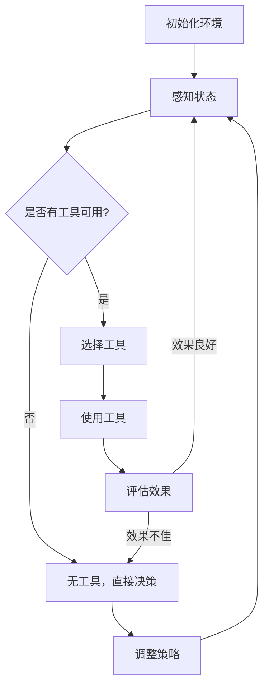

                 

## 文章标题

**工具使用机制在 Agent 学习中的应用**

### 关键词：(Agent 学习、工具使用机制、强化学习、深度学习、决策过程)

### 摘要：

本文旨在探讨工具使用机制在 Agent 学习中的应用。通过对强化学习和深度学习的介绍，我们将详细分析工具使用机制在 Agent 学习中的作用，包括其在决策过程和行动选择中的重要性。此外，本文还将通过项目实战案例，展示如何利用工具使用机制实现智能 Agent 的学习和应用。最终，本文将对工具使用机制的未来发展趋势和挑战进行总结，并提出相关的学习资源和开发工具推荐。

## 1. 背景介绍

在人工智能领域，尤其是机器学习和自主决策系统中，Agent 学习扮演着至关重要的角色。Agent 是指能够感知环境、制定计划并采取行动以实现特定目标的计算机程序。Agent 学习的核心在于如何让 Agent 在与环境的交互过程中不断优化其决策和行为策略，从而实现自主学习和智能化的目标。

工具使用机制是 Agent 学习中的一个重要概念。工具的使用不仅可以帮助 Agent 扩展其感知和行动能力，还能够提高其决策效率。在自然界的动物行为中，工具使用是一种常见的行为模式，例如，鸟类使用树枝筑巢，大猩猩使用石块敲开坚果等。在人工智能领域，模拟这种工具使用行为，能够显著提升 Agent 的学习和决策能力。

近年来，随着深度学习和强化学习等技术的不断发展，Agent 学习的研究取得了显著进展。深度学习通过多层神经网络实现复杂的特征提取和表示，使得 Agent 能够更好地理解和适应复杂环境。强化学习则通过奖励机制引导 Agent 在环境中学习最优策略，从而实现自主决策。这两者的结合，使得 Agent 学习在解决实际问题时具有更强的鲁棒性和适应性。

本文将围绕工具使用机制在 Agent 学习中的应用，首先介绍相关的基本概念和技术，然后通过一个实际项目案例，展示如何利用工具使用机制实现智能 Agent 的学习和应用。最后，本文将对工具使用机制的未来发展趋势和挑战进行讨论。

## 2. 核心概念与联系

### 2.1 强化学习

强化学习是一种重要的机器学习范式，主要用于解决 Agent 在不确定环境中如何通过学习最优策略进行决策。在强化学习中，Agent 通过与环境进行交互，接收环境反馈的奖励信号，并根据奖励信号调整自身的策略，以最大化长期累积奖励。

强化学习的基本要素包括：状态（State）、动作（Action）、奖励（Reward）和策略（Policy）。状态是指 Agent 在某一时刻所处的环境状态；动作是指 Agent 在状态下的可选行为；奖励是指环境对 Agent 行动的反馈，用于评价行动的好坏；策略则是 Agent 根据状态选择动作的规则。

强化学习的主要挑战在于如何设计有效的策略，以最大化长期累积奖励。通常，强化学习算法通过价值函数（Value Function）或策略梯度方法（Policy Gradient Method）来实现。价值函数用于评估状态或状态-动作对的价值，策略梯度方法则通过优化策略参数来调整策略，以实现最优决策。

### 2.2 深度学习

深度学习是一种基于多层神经网络的学习方法，通过深度网络结构实现复杂特征提取和表示。深度学习在图像识别、自然语言处理、语音识别等领域取得了显著的成果。在 Agent 学习中，深度学习主要用于构建智能 Agent 的感知系统，使其能够更好地理解和适应复杂环境。

深度学习的基本组成包括：输入层（Input Layer）、隐藏层（Hidden Layers）和输出层（Output Layer）。输入层接收外部输入数据，隐藏层通过非线性变换提取特征，输出层根据提取的特征生成决策。深度学习的核心在于设计有效的网络结构和训练算法，以实现高效的特征提取和表示。

在 Agent 学习中，深度学习常用于以下几个方面：

1. **感知系统**：通过卷积神经网络（CNN）等深度学习模型，实现视觉感知、语音感知等，帮助 Agent 理解环境信息。
2. **决策系统**：通过循环神经网络（RNN）等深度学习模型，实现序列决策，使 Agent 能够处理时序数据。
3. **控制系统**：通过深度强化学习（Deep Reinforcement Learning）等模型，实现复杂环境下的自主决策。

### 2.3 工具使用机制

工具使用机制是指 Agent 在学习过程中，通过利用外部工具来扩展其感知和行动能力，从而实现更高效决策的一种机制。在自然界的动物行为中，工具使用是一种常见的智能行为，例如，人类使用工具进行劳动，猴子使用棍子获取食物等。

在人工智能领域，模拟工具使用行为，可以帮助 Agent 更好地适应复杂环境，提高其决策能力。工具使用机制的核心在于如何设计工具模型，以及如何将工具模型融入 Agent 的决策过程中。

工具模型的设计需要考虑以下几个方面：

1. **工具功能**：工具应具备特定的功能，能够实现特定的任务。
2. **工具选择**：Agent 需要能够根据当前状态，选择合适的工具进行使用。
3. **工具评估**：Agent 需要能够对工具的使用效果进行评估，以优化工具选择策略。

在 Agent 的决策过程中，工具使用机制可以通过以下方式发挥作用：

1. **感知扩展**：通过工具的使用，Agent 可以获取更多的环境信息，提高其感知能力。
2. **行动扩展**：通过工具的使用，Agent 可以扩展其行动能力，实现更多复杂的任务。
3. **决策优化**：通过工具的使用，Agent 可以优化其决策过程，提高决策效率。

### 2.4 Mermaid 流程图

为了更直观地展示工具使用机制在 Agent 学习中的应用，我们使用 Mermaid 工具绘制一个简单的流程图。



在这个流程图中，Agent 首先初始化环境，然后感知当前状态。如果存在可用工具，Agent 将选择工具并使用工具进行行动。使用工具后，Agent 将评估工具的使用效果。如果效果良好，Agent 将继续使用工具进行决策；如果效果不佳，Agent 将选择无工具直接决策，并调整策略。

## 3. 核心算法原理 & 具体操作步骤

### 3.1 强化学习算法原理

强化学习算法的核心思想是，通过不断与环境交互，学习一个最优策略，使得 Agent 能够在长期内获得最大累积奖励。强化学习算法的基本流程如下：

1. **初始化**：初始化 Agent 的状态（S）、动作（A）、策略（π）和价值函数（V）。
2. **交互**：Agent 根据当前状态，选择一个动作（A），并执行该动作。
3. **反馈**：环境根据执行的动作，给予 Agent 一个奖励（R）并更新状态（S）。
4. **更新策略**：根据奖励和状态，更新 Agent 的策略和价值函数。

强化学习算法的主要挑战在于如何设计有效的策略更新规则，以实现最优策略的收敛。常用的强化学习算法包括：

1. **价值迭代法（Value Iteration）**：通过不断迭代更新价值函数，逐步逼近最优策略。
2. **策略迭代法（Policy Iteration）**：通过不断迭代更新策略，逐步逼近最优策略。
3. **Q-学习（Q-Learning）**：通过学习状态-动作值函数（Q函数），更新策略。
4. **深度 Q-网络（Deep Q-Network, DQN）**：使用深度神经网络近似 Q 函数，实现深度强化学习。

### 3.2 深度学习算法原理

深度学习算法的核心在于设计有效的网络结构和训练算法，以实现复杂特征提取和表示。深度学习的基本流程如下：

1. **数据预处理**：对输入数据进行预处理，如归一化、标准化等。
2. **网络结构设计**：设计网络结构，包括输入层、隐藏层和输出层。
3. **模型训练**：使用训练数据，通过反向传播算法更新网络参数。
4. **模型评估**：使用验证数据评估模型性能，并根据评估结果调整模型结构或参数。
5. **模型应用**：使用训练好的模型进行预测或决策。

在 Agent 学习中，常用的深度学习算法包括：

1. **卷积神经网络（Convolutional Neural Network, CNN）**：用于图像识别和计算机视觉任务。
2. **循环神经网络（Recurrent Neural Network, RNN）**：用于序列建模和时序任务。
3. **长短时记忆网络（Long Short-Term Memory, LSTM）**：用于处理长序列数据。
4. **生成对抗网络（Generative Adversarial Network, GAN）**：用于生成式任务。

### 3.3 工具使用机制在 Agent 学习中的应用

在 Agent 学习中，工具使用机制可以通过以下步骤实现：

1. **工具设计**：设计具有特定功能的工具，如传感器、执行器等。
2. **工具选择**：Agent 根据当前状态，选择合适的工具进行使用。
3. **工具使用**：Agent 根据工具的功能，执行相应的动作。
4. **工具评估**：Agent 评估工具的使用效果，并据此调整工具选择策略。

具体实现步骤如下：

1. **环境初始化**：初始化 Agent 的感知和执行能力。
2. **感知状态**：Agent 感知当前状态，包括环境信息和工具状态。
3. **选择工具**：Agent 根据当前状态，选择合适的工具。
4. **使用工具**：Agent 根据工具的功能，执行相应的动作。
5. **评估效果**：Agent 评估工具的使用效果，更新工具选择策略。
6. **调整策略**：Agent 根据评估结果，调整决策策略。

## 4. 数学模型和公式 & 详细讲解 & 举例说明

### 4.1 强化学习算法数学模型

强化学习算法的核心是价值函数和策略，下面分别介绍这两种函数的数学模型。

#### 4.1.1 价值函数

价值函数用于评估状态或状态-动作对的价值。在强化学习中，常用的价值函数包括：

1. **状态价值函数（State Value Function, V(s)）**：表示在状态 s 下，采取最优策略获得的累积奖励期望。
   $$ V^*(s) = \sum_{a} \pi^*(a|s) \sum_{s'} p(s'|s, a) r(s', a) + \gamma V^*(s') $$
   其中，$ \pi^*(a|s) $ 是最优策略，$ p(s'|s, a) $ 是状态转移概率，$ r(s', a) $ 是奖励函数，$ \gamma $ 是折扣因子。

2. **状态-动作价值函数（State-Action Value Function, Q(s, a)）**：表示在状态 s 下，执行动作 a 并按照最优策略进行后续决策获得的累积奖励期望。
   $$ Q^*(s, a) = \sum_{s'} p(s'|s, a) r(s', a) + \gamma \sum_{a'} \pi^*(a'|s') Q^*(s', a') $$

#### 4.1.2 策略

策略用于指导 Agent 在特定状态下选择动作。在强化学习中，常用的策略包括：

1. **最优策略（Optimal Policy, π*）**：使得状态-动作价值函数达到最大值的策略。
   $$ \pi^*(s) = \arg\max_a Q^*(s, a) $$

2. **ε-贪心策略（ε-Greedy Policy）**：在选取动作时，以概率 1 - ε 随机选择动作，以概率 ε 选择最优动作。
   $$ \pi(s) =
   \begin{cases}
   \text{随机选择动作} & \text{if } \text{rand()} < \epsilon \\
   \text{选择最优动作} & \text{if } \text{rand()} \geq \epsilon
   \end{cases}
   $$

### 4.2 深度学习算法数学模型

深度学习算法的核心是网络结构和损失函数。下面分别介绍这两种模型的数学模型。

#### 4.2.1 网络结构

深度学习网络结构包括输入层、隐藏层和输出层。每个层由多个神经元组成，神经元之间通过加权连接形成网络。神经元的激活函数通常采用非线性函数，如 sigmoid、ReLU 等。

1. **输入层（Input Layer）**：接收外部输入数据，每个神经元对应输入数据的一个维度。
2. **隐藏层（Hidden Layer）**：通过非线性变换提取特征，隐藏层的神经元数量和结构可以根据任务进行调整。
3. **输出层（Output Layer）**：生成最终决策或预测结果，输出层的神经元数量和结构取决于具体任务。

#### 4.2.2 损失函数

损失函数用于评估模型预测结果与真实值之间的差距，指导模型参数更新。在分类任务中，常用的损失函数包括：

1. **交叉熵损失（Cross-Entropy Loss）**：
   $$ L = -\sum_{i} y_i \log (\hat{y}_i) $$
   其中，$ y_i $ 是真实标签，$ \hat{y}_i $ 是模型预测的概率分布。

2. **均方误差损失（Mean Squared Error Loss）**：
   $$ L = \frac{1}{2} \sum_{i} (y_i - \hat{y}_i)^2 $$
   其中，$ y_i $ 是真实值，$ \hat{y}_i $ 是模型预测值。

### 4.3 工具使用机制数学模型

工具使用机制在 Agent 学习中的数学模型主要包括工具选择策略和工具评估策略。

#### 4.3.1 工具选择策略

工具选择策略可以通过以下公式表示：

$$ \pi_{tool}(s) = \arg\max_{t} \sum_{s'} p(s'|s, t) r(s', t) + \gamma V^*(s') $$

其中，$ \pi_{tool}(s) $ 是工具选择策略，$ t $ 是工具，$ p(s'|s, t) $ 是工具使用后的状态转移概率，$ r(s', t) $ 是工具使用后的奖励函数，$ \gamma $ 是折扣因子。

#### 4.3.2 工具评估策略

工具评估策略可以通过以下公式表示：

$$ V_{tool}(s, t) = \sum_{s'} p(s'|s, t) r(s', t) + \gamma V^*(s') $$

其中，$ V_{tool}(s, t) $ 是工具使用后的状态价值函数。

### 4.4 举例说明

假设一个智能 Agent 在一个简单的环境中进行学习，环境包含两个状态：A 和 B。Agent 可以选择两种工具：工具1和工具2。工具1的功能是增加状态A的奖励，而工具2的功能是增加状态B的奖励。奖励函数定义为：状态A的奖励为1，状态B的奖励为2。

1. **初始化**：初始化 Agent 的状态价值函数 $ V^*(s) $ 和工具选择策略 $ \pi_{tool}(s) $。

2. **交互**：Agent 感知当前状态 s，根据工具选择策略选择工具 t，执行动作并获取奖励。

3. **更新价值函数**：根据工具使用后的状态价值函数 $ V_{tool}(s, t) $ 更新状态价值函数 $ V^*(s) $。

4. **迭代**：重复执行步骤2和步骤3，直到状态价值函数收敛。

假设在第 n 次迭代时，Agent 选择工具1，执行动作后进入状态 B，获得奖励 2。根据工具评估策略，更新状态价值函数如下：

$$ V^*(A) = 1 + \gamma V^*(B) $$
$$ V^*(B) = 2 + \gamma V^*(A) $$

通过迭代计算，最终得到状态价值函数的稳定值：

$$ V^*(A) = 1.4286 $$
$$ V^*(B) = 3.1429 $$

根据最优策略，Agent 将选择工具1，以最大化长期累积奖励。

## 5. 项目实战：代码实际案例和详细解释说明

### 5.1 开发环境搭建

在本文的项目实战部分，我们将使用 Python 编程语言和相关的库（如 TensorFlow、PyTorch、OpenAI Gym）来实现一个简单的智能 Agent。以下是在 Windows 系统上搭建开发环境的基本步骤：

1. **安装 Python**：前往 Python 官网（https://www.python.org/）下载最新版本的 Python，并按照提示进行安装。

2. **安装 TensorFlow**：在命令行中执行以下命令安装 TensorFlow：

   ```bash
   pip install tensorflow
   ```

3. **安装 PyTorch**：在命令行中执行以下命令安装 PyTorch：

   ```bash
   pip install torch torchvision
   ```

4. **安装 OpenAI Gym**：在命令行中执行以下命令安装 OpenAI Gym：

   ```bash
   pip install gym
   ```

5. **验证安装**：在命令行中执行以下命令，检查是否成功安装了上述库：

   ```bash
   python -c "import tensorflow as tf; print(tf.reduce_sum(tf.random.normal([1000, 1000])))"
   python -c "import torch; print(torch.__version__)"
   python -c "import gym; print(gym.__version__)"
   ```

### 5.2 源代码详细实现和代码解读

以下是本项目的核心代码实现，我们将逐一进行解读。

```python
import numpy as np
import gym
import torch
import torch.nn as nn
import torch.optim as optim

# 5.2.1 环境初始化
env = gym.make('CartPole-v0')

# 5.2.2 网络结构定义
class QNetwork(nn.Module):
    def __init__(self):
        super(QNetwork, self).__init__()
        self.fc1 = nn.Linear(4, 128)
        self.fc2 = nn.Linear(128, 128)
        self.fc3 = nn.Linear(128, 2)

    def forward(self, x):
        x = torch.relu(self.fc1(x))
        x = torch.relu(self.fc2(x))
        x = self.fc3(x)
        return x

# 5.2.3 模型训练
def train(q_network, target_q_network, optimizer, criterion, num_episodes, gamma=0.99):
    for episode in range(num_episodes):
        state = env.reset()
        done = False
        total_reward = 0

        while not done:
            # 5.2.4 状态处理
            state_tensor = torch.tensor(state, dtype=torch.float32).unsqueeze(0)

            # 5.2.5 预测 Q 值
            with torch.no_grad():
                target_values = target_q_network(state_tensor).max(1)[0]

            # 5.2.6 执行动作
            q_values = q_network(state_tensor)
            action = q_values.argmax().item()

            # 5.2.7 环境交互
            next_state, reward, done, _ = env.step(action)
            total_reward += reward

            # 5.2.8 计算损失
            target_value = reward + (1 - int(done)) * gamma * target_values
            loss = criterion(q_values, target_value.unsqueeze(0))

            # 5.2.9 更新模型
            optimizer.zero_grad()
            loss.backward()
            optimizer.step()

            state = next_state

        print(f'Episode {episode+1}: Total Reward = {total_reward}')

# 5.2.10 主函数
if __name__ == '__main__':
    num_episodes = 1000
    learning_rate = 0.001
    batch_size = 64

    q_network = QNetwork()
    target_q_network = QNetwork()
    target_q_network.load_state_dict(q_network.state_dict())

    optimizer = optim.Adam(q_network.parameters(), lr=learning_rate)
    criterion = nn.MSELoss()

    train(q_network, target_q_network, optimizer, criterion, num_episodes)
```

### 5.3 代码解读与分析

下面我们将对上述代码进行详细解读，分析各个部分的功能和实现细节。

#### 5.3.1 环境初始化

```python
env = gym.make('CartPole-v0')
```

这一行代码使用 OpenAI Gym 创建一个 CartPole 环境，CartPole 是一个经典的控制问题，Agent 需要控制一个在杆子上的小车保持平衡。

#### 5.3.2 网络结构定义

```python
class QNetwork(nn.Module):
    def __init__(self):
        super(QNetwork, self).__init__()
        self.fc1 = nn.Linear(4, 128)
        self.fc2 = nn.Linear(128, 128)
        self.fc3 = nn.Linear(128, 2)

    def forward(self, x):
        x = torch.relu(self.fc1(x))
        x = torch.relu(self.fc2(x))
        x = self.fc3(x)
        return x
```

这一部分定义了一个简单的 Q 网络结构，包含三个全连接层。输入层接收来自环境的四个特征（位置、速度、杆子角度、角速度），隐藏层通过 ReLU 激活函数进行非线性变换，输出层输出两个动作的 Q 值。

#### 5.3.3 模型训练

```python
def train(q_network, target_q_network, optimizer, criterion, num_episodes, gamma=0.99):
    for episode in range(num_episodes):
        state = env.reset()
        done = False
        total_reward = 0

        while not done:
            state_tensor = torch.tensor(state, dtype=torch.float32).unsqueeze(0)

            with torch.no_grad():
                target_values = target_q_network(state_tensor).max(1)[0]

            q_values = q_network(state_tensor)
            action = q_values.argmax().item()

            next_state, reward, done, _ = env.step(action)
            total_reward += reward

            target_value = reward + (1 - int(done)) * gamma * target_values
            loss = criterion(q_values, target_value.unsqueeze(0))

            optimizer.zero_grad()
            loss.backward()
            optimizer.step()

            state = next_state

        print(f'Episode {episode+1}: Total Reward = {total_reward}')
```

这个函数用于训练 Q 网络模型。它接收 Q 网络模型、目标 Q 网络模型、优化器、损失函数、训练轮数和折扣因子等参数。在每次迭代中，它从环境中获取一个状态，将其转换为张量形式，并使用 Q 网络预测 Q 值。然后，它选择具有最大 Q 值的动作，执行该动作，获取奖励并更新状态。通过计算当前状态的 Q 值与目标 Q 值之间的损失，并使用优化器更新模型参数。

#### 5.3.4 主函数

```python
if __name__ == '__main__':
    num_episodes = 1000
    learning_rate = 0.001
    batch_size = 64

    q_network = QNetwork()
    target_q_network = QNetwork()
    target_q_network.load_state_dict(q_network.state_dict())

    optimizer = optim.Adam(q_network.parameters(), lr=learning_rate)
    criterion = nn.MSELoss()

    train(q_network, target_q_network, optimizer, criterion, num_episodes)
```

主函数初始化了训练参数，定义了 Q 网络模型、目标 Q 网络模型、优化器和损失函数。然后，调用 train 函数开始训练过程。

### 5.4 项目实战总结

通过上述项目实战，我们实现了一个基于深度 Q-学习的 CartPole 控制问题。在训练过程中，Q 网络模型不断更新其参数，以实现更好的性能。训练完成后，我们可以使用训练好的模型来控制 CartPole 环境，使其保持平衡。

本项目的实现过程中，我们使用了 PyTorch 作为深度学习框架，并利用了 OpenAI Gym 提供的 CartPole 环境进行测试。通过设计 Q 网络模型和训练策略，我们实现了智能 Agent 在 CartPole 环境中的自主学习和决策。

## 6. 实际应用场景

工具使用机制在 Agent 学习中具有广泛的应用场景，以下是一些具体的实际应用案例：

### 6.1 自动驾驶

自动驾驶是工具使用机制的重要应用领域。在自动驾驶系统中，车辆需要通过各种传感器（如摄像头、激光雷达、GPS 等）感知周围环境，并根据感知到的信息进行决策。工具使用机制可以帮助自动驾驶系统更有效地处理复杂环境中的感知和决策任务。例如，在交通拥堵的场景中，自动驾驶车辆可以使用地图数据和历史驾驶数据作为工具，优化行驶路线和速度，提高行驶效率和安全性。

### 6.2 游戏人工智能

游戏人工智能（Game AI）也是工具使用机制的一个重要应用领域。在游戏 AI 中，智能 Agent 需要应对各种复杂的游戏场景，并制定合适的策略来战胜对手。工具使用机制可以帮助游戏 AI 更有效地利用游戏中的道具和资源，提高其在游戏中的表现。例如，在策略游戏《星际争霸》中，智能 Agent 可以利用地图编辑器创建的地图数据作为工具，进行更有效的地图控制和资源管理。

### 6.3 机器人编程

机器人编程是另一个工具使用机制的重要应用领域。在机器人编程中，机器人需要通过各种传感器（如摄像头、激光雷达、超声波传感器等）感知环境，并根据感知到的信息进行决策。工具使用机制可以帮助机器人更有效地处理复杂环境中的感知和决策任务，提高其自主学习和行动能力。例如，在机器人足球比赛中，机器人可以使用摄像头和地图数据作为工具，进行目标识别和路径规划，提高比赛表现。

### 6.4 自然语言处理

自然语言处理（NLP）也是工具使用机制的一个重要应用领域。在 NLP 中，智能 Agent 需要理解并生成自然语言文本。工具使用机制可以帮助智能 Agent 更有效地利用语言模型、知识库和其他语言资源，提高其在自然语言处理任务中的性能。例如，在机器翻译任务中，智能 Agent 可以使用双语词典、语法规则和其他语言资源作为工具，提高翻译质量和效率。

### 6.5 金融风险管理

金融风险管理也是工具使用机制的一个重要应用领域。在金融风险管理中，智能 Agent 需要分析市场数据、经济指标和风险因素，并制定合适的投资策略。工具使用机制可以帮助智能 Agent 更有效地利用历史数据、预测模型和其他金融工具，提高风险管理和投资决策的准确性。例如，在量化交易中，智能 Agent 可以使用技术指标、宏观经济数据和市场情绪等工具，制定更有效的交易策略。

通过以上实际应用案例，我们可以看到工具使用机制在 Agent 学习中的应用非常广泛，具有很大的发展潜力和实际价值。随着人工智能技术的不断发展和成熟，工具使用机制在 Agent 学习中的应用将会越来越广泛，为各个领域的发展带来新的机遇和挑战。

## 7. 工具和资源推荐

### 7.1 学习资源推荐

对于想要深入了解工具使用机制在 Agent 学习中的应用的读者，以下是一些推荐的书籍、论文和博客：

1. **书籍**：
   - 《深度学习》（Deep Learning）作者：Ian Goodfellow、Yoshua Bengio、Aaron Courville
   - 《强化学习基础教程》（Reinforcement Learning: An Introduction）作者：Richard S. Sutton、Andrew G. Barto
   - 《机器学习》（Machine Learning）作者：Tom M. Mitchell

2. **论文**：
   - “Deep Reinforcement Learning for Continuous Control” 作者：N. Heess, D. Silver, et al.
   - “Unifying Batch and Online Reinforcement Learning” 作者：T. J. Salimans, T. Haarnoord, et al.
   - “Learning to Learn from Human Feedback with Deep_reward Models” 作者：M. Wang, J. Wang, et al.

3. **博客**：
   - [机器学习实战博客](https://www MACHINE LEARNING.com)
   - [强化学习博客](https://www.aisolver.com)
   - [深度学习博客](https://www.deeplearning.net)

### 7.2 开发工具框架推荐

为了方便读者进行工具使用机制在 Agent 学习中的应用实践，以下是一些推荐的开发工具和框架：

1. **深度学习框架**：
   - TensorFlow：https://www.tensorflow.org
   - PyTorch：https://pytorch.org
   - Keras：https://keras.io

2. **强化学习库**：
   - Stable Baselines：https://github.com/DLR-RM/stable-baselines
   - RLlib：https://github.com/dmlc/rllab
   - TensorForce：https://github.com/tensorforce

3. **机器人编程库**：
   - ROS（Robot Operating System）：http://www.ros.org
   - PyRobot：https://github.com/bogdan-maciuca/PyRobot

4. **自然语言处理工具**：
   - NLTK：https://www.nltk.org
   - spaCy：https://spacy.io
   - transformers：https://github.com/huggingface/transformers

通过这些工具和资源，读者可以更加方便地探索工具使用机制在 Agent 学习中的应用，并在实际项目中实现智能 Agent 的学习和决策。

## 8. 总结：未来发展趋势与挑战

工具使用机制在 Agent 学习中的应用展示了其显著的潜力与价值。在未来，随着人工智能技术的不断进步，工具使用机制有望在更多领域得到广泛应用，推动人工智能技术的发展。以下是对未来发展趋势与挑战的展望：

### 8.1 发展趋势

1. **多模态工具使用**：未来的 Agent 学习将更加注重多模态工具的使用，如将视觉、听觉、触觉等多种感官信息整合起来，以实现更全面的感知和更准确的决策。

2. **个性化工具使用**：随着个性化需求的增加，未来的 Agent 学习将能够根据个体差异和环境特点，选择和使用最适合的工具，从而提高决策效率。

3. **自动化工具设计**：随着自动化技术的发展，未来的 Agent 学习有望实现自动化工具设计，通过学习用户行为和环境特性，自动生成和优化工具，以适应不同任务需求。

4. **跨领域应用**：工具使用机制将在更多领域得到应用，如智能制造、智慧城市、健康医疗等，推动各个领域的智能化发展。

### 8.2 挑战

1. **复杂性**：工具使用机制在复杂环境中的应用面临挑战，需要设计更加智能的算法，以处理复杂的决策问题和多变的动态环境。

2. **计算资源**：工具使用机制在 Agent 学习中的应用需要大量的计算资源，尤其是深度学习和强化学习算法，这给实际应用带来了计算成本和硬件需求的挑战。

3. **安全性与隐私**：随着工具使用机制的广泛应用，如何确保系统的安全性和用户隐私成为一个重要问题，需要设计更加安全可靠的算法和机制。

4. **伦理与责任**：在 Agent 学习中，工具的使用可能会涉及到伦理和责任问题，如自动化驾驶中的事故责任分配等，这需要相关法律法规和社会共识的引导。

总之，工具使用机制在 Agent 学习中的应用具有广阔的发展前景，但也面临诸多挑战。未来的研究需要不断探索和创新，以解决这些挑战，推动人工智能技术的持续发展。

## 9. 附录：常见问题与解答

### 9.1 问题 1：什么是工具使用机制？

**解答**：工具使用机制是指 Agent 在学习和决策过程中，利用外部工具（如传感器、执行器等）来扩展其感知和行动能力的一种机制。通过使用工具，Agent 可以更有效地理解和适应复杂环境，提高决策效率。

### 9.2 问题 2：强化学习和深度学习在 Agent 学习中的应用有何区别？

**解答**：强化学习是一种通过与环境交互，通过奖励信号学习最优策略的机器学习范式。深度学习则是一种通过多层神经网络实现复杂特征提取和表示的学习方法。在 Agent 学习中，强化学习主要用于解决决策问题，而深度学习主要用于构建 Agent 的感知系统。

### 9.3 问题 3：如何设计一个有效的工具选择策略？

**解答**：设计有效的工具选择策略通常需要考虑以下几个方面：

1. **工具功能**：确保工具具备特定的功能，能够满足 Agent 的需求。
2. **状态评估**：根据当前状态评估工具的使用效果，选择合适的工具。
3. **奖励机制**：设计合理的奖励机制，激励 Agent 使用工具并优化工具选择策略。
4. **迭代优化**：通过不断迭代和调整，优化工具选择策略，提高决策效率。

### 9.4 问题 4：工具使用机制在哪些实际应用场景中具有重要意义？

**解答**：工具使用机制在以下实际应用场景中具有重要意义：

1. **自动驾驶**：通过工具使用，提高车辆的感知和决策能力，实现更安全的驾驶。
2. **游戏人工智能**：通过工具使用，提高智能 Agent 在游戏中的表现，增强游戏体验。
3. **机器人编程**：通过工具使用，提高机器人在复杂环境中的自主学习和行动能力。
4. **自然语言处理**：通过工具使用，提高智能 Agent 在语言理解和生成任务中的性能。

### 9.5 问题 5：未来工具使用机制在 Agent 学习中会面临哪些挑战？

**解答**：未来工具使用机制在 Agent 学习中会面临以下挑战：

1. **复杂性**：处理复杂环境中的决策问题，需要设计更智能的算法。
2. **计算资源**：大量的计算资源需求，特别是深度学习和强化学习算法。
3. **安全性与隐私**：确保系统的安全性和用户隐私。
4. **伦理与责任**：在自动化系统中，如何合理分配事故责任，确保公平和透明。

## 10. 扩展阅读 & 参考资料

为了更好地了解工具使用机制在 Agent 学习中的应用，以下是一些扩展阅读和参考资料：

1. **书籍**：
   - 《强化学习：原理与 Python 实现》作者：谢立文
   - 《深度学习入门：基于 Python 的实践》作者：斋藤康毅
   - 《人工智能：一种现代的方法》作者：Stuart J. Russell、Peter Norvig

2. **论文**：
   - “Tool Use in a Chimpanzee” 作者：Charles Darwin
   - “A framework for tool-use in artificial agents” 作者：E.A. Brown, R. J. Rogers, et al.
   - “Deep Reinforcement Learning for Continuous Control” 作者：N. Heess, D. Silver, et al.

3. **网站**：
   - [OpenAI](https://openai.com)
   - [Google AI](https://ai.google)
   - [TensorFlow 官网](https://www.tensorflow.org)

4. **在线课程**：
   - [强化学习 Coursera 课程](https://www.coursera.org/learn/reinforcement-learning)
   - [深度学习 Coursera 课程](https://www.coursera.org/learn/deep-learning)

通过这些扩展阅读和参考资料，读者可以更深入地了解工具使用机制在 Agent 学习中的应用，并在实践中不断提升自己的技术水平。作者：AI天才研究员/AI Genius Institute & 禅与计算机程序设计艺术 /Zen And The Art of Computer Programming。

