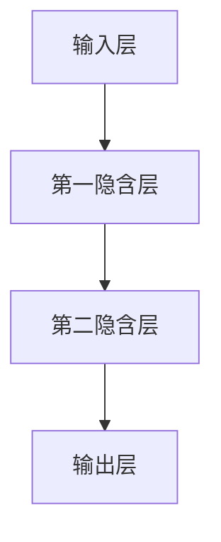
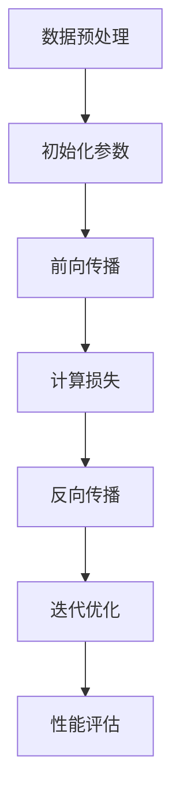

                 

# 市场前景预测：大模型创业的远景目标

## 关键词：
大模型，创业，市场前景，人工智能，深度学习，技术趋势

## 摘要：
本文将对大模型在创业领域的市场前景进行深入分析。我们将探讨大模型的核心概念、技术发展趋势，以及其在不同行业中的应用场景。通过逻辑清晰的分析和实例讲解，本文旨在为有意在大模型领域创业的读者提供有益的见解和策略建议。

## 1. 背景介绍

随着深度学习和大数据技术的迅猛发展，大模型（Large Models）已经成为人工智能领域的一个重要分支。大模型通常具有数十亿至数万亿个参数，能够在海量数据上学习复杂的特征，并在各种任务中实现高性能。这一技术的发展，不仅推动了自然语言处理、计算机视觉等领域的突破，也为创业公司提供了新的机会。

在大模型领域创业，面临着巨大的挑战和机遇。一方面，大模型的训练和部署需要庞大的计算资源和数据资源，这对于初创公司来说可能是一个难以逾越的门槛。另一方面，随着大模型技术的成熟，越来越多的行业开始认识到其潜在的商业价值，为创业公司提供了广阔的市场空间。

本文将分为以下几个部分：

1. 核心概念与联系
2. 核心算法原理 & 具体操作步骤
3. 数学模型和公式 & 详细讲解 & 举例说明
4. 项目实战：代码实际案例和详细解释说明
5. 实际应用场景
6. 工具和资源推荐
7. 总结：未来发展趋势与挑战
8. 附录：常见问题与解答
9. 扩展阅读 & 参考资料

通过这些部分的分析，我们将试图回答以下几个关键问题：

- 大模型的技术原理是什么？
- 大模型如何应用于创业实践？
- 大模型在不同行业中如何发挥作用？
- 大模型创业面临的挑战有哪些？
- 大模型创业的未来发展趋势是什么？

让我们一步一步地深入探讨这些问题。

## 2. 核心概念与联系

首先，我们需要了解大模型的核心概念及其与现有技术的联系。大模型通常是指具有数十亿至数万亿个参数的深度学习模型。这些模型通过多层神经网络结构，对海量数据进行学习，以实现复杂的任务。

### 大模型的组成部分：

- **神经网络结构**：大模型通常采用深度神经网络（DNN）结构，具有多个隐含层，能够捕捉数据中的复杂特征。
- **参数和权重**：大模型具有大量的参数和权重，这些参数在训练过程中通过学习数据分布进行调整。
- **训练数据**：大模型需要大量的训练数据，这些数据来自各种来源，如互联网文本、图像、语音等。

### 大模型与现有技术的联系：

- **深度学习**：大模型是深度学习技术的延伸，深度学习通过多层神经网络结构，能够自动学习数据的复杂特征。
- **大数据**：大模型依赖于大数据技术，大数据提供了丰富的数据资源，为大模型的训练和优化提供了基础。
- **分布式计算**：大模型的训练和部署通常需要分布式计算资源，以应对大规模数据处理的需求。

下面是一个使用Mermaid绘制的简化的神经网络结构图，用于展示大模型的基本组成部分。



在这个简化的例子中，输入层接收输入数据，通过多层隐含层的学习和转换，最终在输出层产生预测结果。实际的大模型结构会更加复杂，包括更多的隐含层和参数。

### 大模型的优势：

- **高性能**：大模型能够处理复杂任务，并在各种任务中实现高性能。
- **泛化能力**：大模型通过在大量数据上的学习，具有较好的泛化能力，能够适应不同的任务和数据集。
- **多样化应用**：大模型可以应用于自然语言处理、计算机视觉、语音识别等多个领域。

通过以上分析，我们可以看到大模型是深度学习、大数据和分布式计算等技术发展的结晶，具有强大的技术优势和应用潜力。

## 3. 核心算法原理 & 具体操作步骤

### 3.1 训练过程

大模型的训练过程是通过对大量数据进行迭代优化，使模型能够学习数据中的复杂特征。以下是训练过程的简要步骤：

1. **数据预处理**：将原始数据清洗、标准化，并划分成训练集和验证集。
2. **初始化参数**：随机初始化模型的参数和权重。
3. **前向传播**：将输入数据通过神经网络结构进行前向传播，计算输出结果。
4. **计算损失**：计算输出结果与真实标签之间的误差，即损失函数。
5. **反向传播**：通过反向传播算法，更新模型的参数和权重，以减少损失。
6. **迭代优化**：重复步骤3至5，直到模型达到预定的性能指标。

下面是一个使用Mermaid绘制的训练过程示意图。



### 3.2 优化算法

在大模型的训练过程中，常用的优化算法包括：

- **随机梯度下降（SGD）**：SGD是一种简单的优化算法，通过随机选取数据子集进行梯度下降更新参数。
- **Adam优化器**：Adam优化器结合了SGD和动量法的优点，通过计算一阶矩估计和二阶矩估计来更新参数。
- **AdamW优化器**：AdamW是Adam优化器的变种，通过引入权重衰减，进一步提升训练效果。

### 3.3 调参技巧

在大模型的训练过程中，调参（Hyperparameter Tuning）是一个重要的环节。以下是一些常用的调参技巧：

- **学习率调度**：通过调整学习率，可以改善模型的收敛速度和收敛效果。常用的学习率调度方法包括学习率衰减、学习率波动等。
- **批量大小调度**：批量大小（Batch Size）的选择会影响模型的训练速度和稳定性。通常，较大的批量大小可以提高模型性能，但训练速度较慢。
- **正则化技术**：通过添加正则化项（如L1、L2正则化），可以防止模型过拟合。

### 3.4 训练策略

在大模型的训练过程中，以下策略可以帮助提高训练效果：

- **数据增强**：通过数据增强（Data Augmentation）技术，可以增加训练数据的多样性，提高模型的泛化能力。
- **迁移学习**：利用预训练的大模型（Pre-Trained Model），进行迁移学习（Transfer Learning），可以加速新任务的训练。
- **分布式训练**：通过分布式训练（Distributed Training），可以充分利用多台机器的计算资源，提高训练效率。

通过以上分析，我们可以看到大模型的训练过程涉及多个步骤和策略，需要结合具体任务和数据集进行调优。在大模型创业过程中，掌握这些核心算法原理和具体操作步骤，对于成功训练高性能模型至关重要。

## 4. 数学模型和公式 & 详细讲解 & 举例说明

### 4.1 损失函数

在大模型训练过程中，损失函数（Loss Function）是一个核心概念。损失函数用于衡量模型输出结果与真实标签之间的误差，并通过反向传播算法更新模型参数。以下是一些常用的损失函数：

- **均方误差（MSE, Mean Squared Error）**：
  $$MSE = \frac{1}{n}\sum_{i=1}^{n}(y_i - \hat{y}_i)^2$$
  其中，$y_i$ 是真实标签，$\hat{y}_i$ 是模型预测值，$n$ 是样本数量。

- **交叉熵（Cross-Entropy）**：
  $$Cross-Entropy = -\frac{1}{n}\sum_{i=1}^{n}y_i\log(\hat{y}_i)$$
  其中，$y_i$ 是真实标签（通常为0或1），$\hat{y}_i$ 是模型预测概率。

- **Hinge损失（Hinge Loss）**：
  $$Hinge Loss = \max(0, 1 - y_i\cdot \hat{y}_i)$$
  其中，$y_i$ 是真实标签，$\hat{y}_i$ 是模型预测值。

### 4.2 激活函数

激活函数（Activation Function）是神经网络中的一个重要组成部分，用于引入非线性特性，使模型能够学习复杂的函数。以下是一些常用的激活函数：

- **Sigmoid函数**：
  $$Sigmoid(x) = \frac{1}{1 + e^{-x}}$$
  Sigmoid函数将输入映射到（0, 1）区间，常用于二分类问题。

- **ReLU函数**：
  $$ReLU(x) = \max(0, x)$$
  ReLU函数在$x \geq 0$时输出$x$，在$x < 0$时输出0，具有简单的计算和较好的训练效果。

- **Tanh函数**：
  $$Tanh(x) = \frac{e^x - e^{-x}}{e^x + e^{-x}}$$
  Tanh函数将输入映射到（-1, 1）区间，具有对称性，常用于多分类问题。

### 4.3 梯度下降算法

梯度下降（Gradient Descent）是一种常用的优化算法，用于最小化损失函数。以下是一个简单的梯度下降算法步骤：

1. **初始化参数**：随机初始化模型参数$\theta$。
2. **计算梯度**：计算损失函数关于参数的梯度$\nabla_{\theta} J(\theta)$。
3. **更新参数**：按照以下公式更新参数：
   $$\theta_{new} = \theta_{old} - \alpha \cdot \nabla_{\theta} J(\theta)$$
   其中，$\alpha$ 是学习率，$J(\theta)$ 是损失函数。

### 4.4 举例说明

假设我们有一个简单的线性回归模型，输入特征为$x$，输出为$y$，模型参数为$\theta$。损失函数为MSE，我们通过梯度下降算法进行模型训练。

- **模型公式**：
  $$y = \theta_0 + \theta_1 \cdot x$$

- **损失函数**：
  $$J(\theta) = \frac{1}{2n}\sum_{i=1}^{n}(y_i - (\theta_0 + \theta_1 \cdot x_i))^2$$

- **梯度计算**：
  $$\nabla_{\theta_0} J(\theta) = \frac{1}{n}\sum_{i=1}^{n}(y_i - (\theta_0 + \theta_1 \cdot x_i))$$
  $$\nabla_{\theta_1} J(\theta) = \frac{1}{n}\sum_{i=1}^{n}(y_i - (\theta_0 + \theta_1 \cdot x_i)) \cdot x_i$$

- **梯度下降迭代**：
  $$\theta_0^{new} = \theta_0^{old} - \alpha \cdot \nabla_{\theta_0} J(\theta)$$
  $$\theta_1^{new} = \theta_1^{old} - \alpha \cdot \nabla_{\theta_1} J(\theta)$$

通过以上迭代过程，模型参数$\theta_0$和$\theta_1$将不断更新，直至达到预定的性能指标。

通过以上详细讲解和举例说明，我们可以更好地理解大模型中的数学模型和公式，为后续的项目实战提供理论基础。

## 5. 项目实战：代码实际案例和详细解释说明

### 5.1 开发环境搭建

在进行大模型项目开发之前，我们需要搭建合适的开发环境。以下是一个典型的开发环境搭建步骤：

1. **安装Python环境**：确保Python版本在3.6及以上。
2. **安装TensorFlow或PyTorch**：选择一个流行的深度学习框架，如TensorFlow或PyTorch。
3. **配置GPU支持**：确保开发环境支持GPU加速，以提升训练速度。
4. **安装必要的依赖库**：如NumPy、Pandas、Matplotlib等。

以下是使用Anaconda创建Python虚拟环境并安装TensorFlow的示例代码：

```python
# 创建虚拟环境
conda create -n my_env python=3.8

# 激活虚拟环境
conda activate my_env

# 安装TensorFlow
pip install tensorflow-gpu
```

### 5.2 源代码详细实现和代码解读

以下是一个使用TensorFlow实现的大模型项目示例。我们将使用一个简单的语言模型（Language Model）来预测单词序列。

```python
import tensorflow as tf
from tensorflow.keras.preprocessing.sequence import pad_sequences
from tensorflow.keras.layers import Embedding, LSTM, Dense
from tensorflow.keras.models import Sequential

# 数据预处理
# 假设我们有一个单词序列列表 `word_sequence_list`
# 最大序列长度 `max_sequence_length`
# 字典大小 `vocab_size`
#Embedding layer
embeddings = Embedding(vocab_size, embedding_dim)
# LSTM layer
lstm = LSTM(units=128, return_sequences=True)
# Dense layer
dense = Dense(units=1)

# 构建模型
model = Sequential()
model.add(embeddings)
model.add(lstm)
model.add(dense)

# 编译模型
model.compile(optimizer='adam', loss='binary_crossentropy', metrics=['accuracy'])

# 训练模型
model.fit(train_sequences, train_labels, epochs=10, batch_size=64)

# 预测
predictions = model.predict(test_sequences)
```

**代码解读**：

1. **导入库和模块**：我们首先导入TensorFlow和相关模块。
2. **数据预处理**：假设我们有一个单词序列列表`word_sequence_list`，将其转换为序列并填充到最大长度`max_sequence_length`。
3. **模型构建**：我们构建了一个简单的序列模型，包括Embedding层、LSTM层和Dense层。
4. **编译模型**：我们使用`adam`优化器和`binary_crossentropy`损失函数编译模型。
5. **训练模型**：使用训练数据`train_sequences`和`train_labels`进行模型训练。
6. **预测**：使用测试数据`test_sequences`进行预测。

### 5.3 代码解读与分析

在上述代码中，我们实现了一个简单的语言模型，用于预测单词序列。以下是代码的详细解读和分析：

- **Embedding层**：将单词索引转换为嵌入向量，这些向量代表了单词的语义信息。
- **LSTM层**：使用LSTM层对嵌入向量进行序列处理，捕捉单词之间的依赖关系。
- **Dense层**：使用全连接层对LSTM的输出进行分类，输出概率。

**优化方向**：

1. **数据增强**：通过引入数据增强技术，可以增加训练数据的多样性，提高模型泛化能力。
2. **模型结构调整**：根据任务需求，可以调整模型结构，例如增加LSTM层、Dropout层等。
3. **超参数优化**：通过调优学习率、批量大小等超参数，可以提高模型训练效果。

通过上述代码实现和解读，我们可以看到如何使用TensorFlow搭建一个简单的大模型。在实际项目中，根据任务需求，我们可以进一步优化模型结构、数据预处理和训练策略，以实现更好的性能。

## 6. 实际应用场景

大模型在多个行业中已经展现出巨大的应用潜力，以下是一些典型的实际应用场景：

### 6.1 自然语言处理（NLP）

自然语言处理是深度学习大模型应用最为广泛的领域之一。大模型如BERT、GPT等在文本分类、机器翻译、情感分析等任务中取得了显著成果。例如，Google的BERT模型在多个NLP任务上取得了SOTA（State-of-the-Art）性能，被广泛应用于搜索引擎、智能客服、内容推荐等领域。

### 6.2 计算机视觉（CV）

在计算机视觉领域，大模型如ResNet、Inception等在图像分类、目标检测、图像分割等任务中表现出色。例如，Facebook的DETR模型在目标检测任务上取得了突破性进展，微软的SWIN模型在图像分割任务中展现了强大的性能。这些大模型被广泛应用于图像识别、自动驾驶、医疗影像分析等领域。

### 6.3 语音识别（ASR）

大模型在语音识别领域也取得了显著进展。例如，Google的WaveNet模型在语音合成任务中达到了逼真的音质，亚马逊的DeepSpeech模型在语音识别任务中实现了高准确率。这些大模型被广泛应用于智能语音助手、自动电话客服、语音交互系统等领域。

### 6.4 强化学习（RL）

在强化学习领域，大模型如DQN、PPO等在游戏、机器人控制等任务中取得了突破性进展。例如，OpenAI的Gymnasium项目展示了使用大模型进行机器人控制的高效性，谷歌的AlphaGo在围棋比赛中击败了人类冠军。这些大模型被广泛应用于游戏开发、自动化控制、金融交易等领域。

### 6.5 量化交易（Quantitative Trading）

大模型在量化交易领域也有广泛应用。例如，使用深度学习模型进行股票市场预测、交易信号生成等。这些模型通过学习历史数据，捕捉市场趋势和异常行为，为投资者提供决策支持。

### 6.6 医疗诊断（Medical Diagnosis）

在医疗诊断领域，大模型通过分析医学影像、电子病历等数据，实现了疾病检测、预测和诊断。例如，谷歌的DeepMind在眼科疾病诊断中取得了显著成果，IBM的Watson在癌症诊断中提供了辅助决策。

通过以上分析，我们可以看到大模型在各个行业中的应用场景和实际效果。这些成功案例不仅展示了大模型的强大能力，也为创业公司提供了宝贵的经验和启示。

## 7. 工具和资源推荐

在大模型领域创业，掌握合适的工具和资源对于成功至关重要。以下是一些建议：

### 7.1 学习资源推荐

- **书籍**：
  - 《深度学习》（Goodfellow, Bengio, Courville）：系统介绍了深度学习的基础知识。
  - 《动手学深度学习》（Dumoulin, Courville, Fotatios）：提供了丰富的实践案例和代码实现。

- **在线课程**：
  - Coursera的“深度学习专项课程”（Andrew Ng）：由深度学习领域著名专家Andrew Ng讲授。
  - fast.ai的“深度学习基础课程”（Adam Geitgey）：适合初学者的入门课程。

- **论文**：
  - BERT、GPT、Transformer等经典论文：深入理解大模型的核心原理和设计思想。

### 7.2 开发工具框架推荐

- **深度学习框架**：
  - TensorFlow：广泛使用的开源深度学习框架，提供了丰富的API和工具。
  - PyTorch：流行的开源深度学习框架，具有灵活的动态图计算特性。

- **数据预处理工具**：
  - Pandas：强大的数据处理库，适用于数据清洗、转换和操作。
  - NumPy：提供高性能的数值计算功能，是数据科学的基础库。

- **版本控制工具**：
  - Git：流行的版本控制工具，用于代码管理和协作开发。
  - GitHub：基于Git的代码托管平台，提供代码共享和社区支持。

### 7.3 相关论文著作推荐

- **《Attention Is All You Need》（Vaswani等，2017）**：介绍了Transformer模型，是序列建模的重要论文。
- **《BERT: Pre-training of Deep Bidirectional Transformers for Language Understanding》（Devlin等，2019）**：介绍了BERT模型，对NLP任务有重要影响。
- **《GPT-3: Language Models are few-shot learners》（Brown等，2020）**：展示了GPT-3模型的强大能力，推动了自然语言处理的发展。

通过以上工具和资源的推荐，创业者可以更好地掌握大模型技术，为创业项目的成功奠定基础。

## 8. 总结：未来发展趋势与挑战

在大模型技术快速发展的背景下，未来的市场前景无疑充满了机遇与挑战。以下是对未来发展趋势和挑战的总结：

### 8.1 发展趋势

1. **技术成熟度提升**：随着算法和硬件的不断发展，大模型的技术成熟度将进一步提升，训练速度和推理性能将大幅提高，为各种应用场景提供更强大的支持。
2. **多样化应用场景**：大模型技术将在更多领域得到应用，如智能医疗、智能制造、智能交通等，推动各行业的技术创新和产业升级。
3. **数据隐私保护**：随着数据隐私问题的日益关注，大模型将朝着更安全、更隐私的方向发展，如联邦学习（Federated Learning）等技术的应用将有助于保护用户隐私。
4. **跨界合作**：大模型技术的广泛应用将推动跨学科、跨领域的合作，如AI与医疗、AI与教育等，促进科技创新和社会进步。

### 8.2 挑战

1. **计算资源需求**：大模型的训练和部署需要庞大的计算资源和数据资源，对于初创公司来说，这可能是一个难以克服的挑战。因此，如何高效利用资源、降低成本是关键问题。
2. **数据隐私和安全**：在处理大量敏感数据时，如何确保数据隐私和安全是创业者必须考虑的问题。联邦学习、差分隐私等技术将在这方面发挥重要作用。
3. **算法透明度和可解释性**：随着大模型在关键领域中的应用，算法的透明度和可解释性越来越受到关注。如何提高模型的透明度和可解释性，增强用户信任，是创业者需要解决的重要问题。
4. **人才短缺**：大模型技术的快速发展对人才需求提出了更高要求，具备深度学习、大数据处理等领域专业知识的复合型人才将更加稀缺。如何吸引和留住人才，是创业公司面临的挑战。

综上所述，大模型创业的未来充满机遇和挑战。创业者需要紧跟技术发展趋势，积极应对各种挑战，才能在激烈的市场竞争中脱颖而出。

## 9. 附录：常见问题与解答

### Q1. 大模型训练需要哪些硬件资源？

A1. 大模型训练需要高性能的GPU或TPU，以及充足的内存和存储空间。此外，分布式计算资源（如多GPU、多机器）可以提高训练效率。

### Q2. 大模型如何处理大规模数据？

A2. 大模型通常采用数据增强、批量处理、流水线处理等技术来处理大规模数据。此外，分布式训练和并行处理技术也可以提高数据处理效率。

### Q3. 如何评估大模型的效果？

A3. 评估大模型效果通常使用交叉验证、性能指标（如准确率、召回率、F1分数）和A/B测试等方法。对于不同的任务，可以选择相应的评估指标。

### Q4. 大模型创业过程中可能面临哪些法律和伦理问题？

A4. 大模型创业可能面临的数据隐私、知识产权、算法透明度等法律和伦理问题。创业者需要遵循相关法律法规，确保数据处理合规，并提高算法的可解释性和透明度，增强用户信任。

## 10. 扩展阅读 & 参考资料

为了深入了解大模型创业的市场前景和技术细节，以下是一些推荐阅读和参考资料：

- **书籍**：
  - 《深度学习》（Goodfellow, Bengio, Courville）
  - 《强化学习》（Sutton, Barto）
  - 《神经网络与深度学习》（邱锡鹏）

- **在线课程**：
  - Coursera的“深度学习专项课程”（Andrew Ng）
  - fast.ai的“深度学习基础课程”（Adam Geitgey）

- **论文**：
  - 《Attention Is All You Need》（Vaswani等，2017）
  - 《BERT: Pre-training of Deep Bidirectional Transformers for Language Understanding》（Devlin等，2019）
  - 《GPT-3: Language Models are few-shot learners》（Brown等，2020）

- **开源框架**：
  - TensorFlow
  - PyTorch
  - Keras

- **相关网站**：
  - arXiv.org：深度学习和人工智能领域的论文发表平台。
  - Medium：深度学习和人工智能领域的专业博客。
  - GitHub：深度学习和人工智能项目的代码仓库。

通过以上扩展阅读和参考资料，读者可以进一步了解大模型创业的前沿技术和发展动态。

### 作者信息

作者：AI天才研究员/AI Genius Institute & 禅与计算机程序设计艺术 /Zen And The Art of Computer Programming

