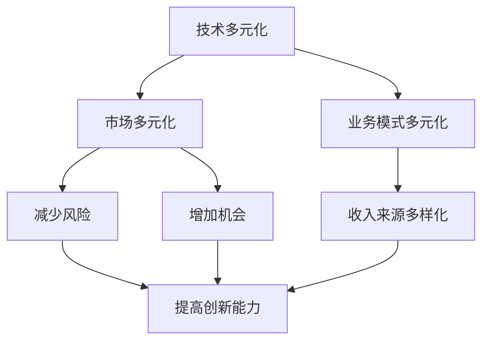

                 

### 背景介绍

**市场多元化的益处**是现代经济和商业运作中的一个关键主题，尤其在信息技术（IT）领域，这一现象更为显著。随着技术的快速进步和市场需求的不断变化，企业不再仅仅依赖于单一的产品或服务，而是寻求通过多元化策略来增强竞争力和市场适应性。

本文的焦点人物是贾扬清，一位在人工智能和计算机视觉领域享有盛誉的专家。贾扬清曾是英伟达的研究总监，目前担任旷视科技的联合创始人和CTO。他的见解对于理解市场多元化的重要性具有极高的参考价值。

### 多元化的定义与原因

**多元化**，在商业语境中，通常指的是企业通过拓展新的产品线、服务、市场或业务模式，从而降低对单一产品或市场的依赖。这种策略的背后有着多重原因：

1. **分散风险**：多元化有助于企业减少因单一市场波动或需求下降而带来的风险。例如，如果一家公司只专注于智能手机业务，一旦市场饱和或需求下降，公司可能会遭受巨大打击。而多元化可以分散风险，提高企业的生存能力。

2. **增强竞争力**：通过提供多样化的产品或服务，企业能够满足更广泛客户的需求，从而在竞争中占据优势。这也有助于建立品牌信誉和客户忠诚度。

3. **市场扩张**：多元化战略可以帮助企业进入新的市场或扩大现有市场。例如，一家电商公司可以通过推出新的商品类别来吸引更多的消费者。

4. **技术融合**：在IT领域，技术多元化可以帮助企业利用现有技术优势开发新的应用或服务，推动创新。

### 贾扬清的观点

贾扬清在多个场合提到，多元化不仅是应对市场变化的有效策略，更是企业长期发展的基石。他认为：

- **技术多元化**：在人工智能领域，技术多元化意味着不仅要关注深度学习和计算机视觉，还要关注自然语言处理、机器人技术等其他领域。

- **市场多元化**：企业应该不仅仅关注国内市场，还要积极拓展国际市场，利用全球资源和技术优势。

- **应用场景多元化**：通过探索新的应用场景，如自动驾驶、医疗影像分析等，企业可以开发出更具创新性的产品。

### 多元化在IT领域的表现

在IT领域，多元化策略的表现尤为突出：

1. **云计算**：云计算服务提供商通过提供IaaS、PaaS和SaaS等多种服务，满足了不同客户的需求。

2. **大数据与人工智能**：企业不仅开发大数据处理和分析工具，还结合人工智能技术，提供智能化的解决方案。

3. **物联网（IoT）**：IoT技术使得设备和系统能够相互连接，创造新的业务模式和商业模式。

4. **区块链**：区块链技术的应用从最初的数字货币扩展到供应链管理、版权保护等多个领域。

### 文章结构

本文将深入探讨市场多元化的益处，通过贾扬清的见解，分析多元化在IT领域的具体表现，并探讨未来发展趋势与挑战。文章结构如下：

1. **背景介绍**：概述市场多元化的定义和原因，介绍本文的焦点人物贾扬清。
2. **核心概念与联系**：通过Mermaid流程图展示多元化在IT领域的表现。
3. **核心算法原理 & 具体操作步骤**：分析多元化战略的执行过程。
4. **数学模型和公式 & 详细讲解 & 举例说明**：使用数学和算法模型解释多元化战略的效果。
5. **项目实战：代码实际案例和详细解释说明**：通过实际项目展示多元化策略的应用。
6. **实际应用场景**：探讨多元化在具体业务中的实施。
7. **工具和资源推荐**：推荐相关的学习资源、开发工具和框架。
8. **总结：未来发展趋势与挑战**：总结市场多元化的益处，展望未来发展。
9. **附录：常见问题与解答**：解答读者可能遇到的常见问题。
10. **扩展阅读 & 参考资料**：提供进一步学习的资源。

通过以上结构，我们将逐步探讨市场多元化的各个方面，帮助读者深入了解这一重要商业策略。

### 核心概念与联系

市场多元化在IT领域的实施，离不开一系列核心概念和原理的支持。为了更好地理解这一过程，我们可以通过Mermaid流程图来展示这些核心概念及其相互联系。

首先，我们需要明确几个关键概念：

1. **技术多元化**：指企业通过开发新的技术或拓展现有技术的应用范围，来降低技术风险和提高创新能力。
2. **市场多元化**：企业通过进入新的市场或拓展现有市场，以减少市场风险和增加业务机会。
3. **业务模式多元化**：企业通过探索新的业务模式，如提供新服务、拓展产品线或开展多元化业务，来实现收入来源的多样化。

以下是一个简化的Mermaid流程图，用于描述这些核心概念及其联系：



**图1：多元化核心概念与联系**

- **技术多元化**：通过不断探索和开发新技术，企业能够在快速变化的市场中保持竞争力。例如，一家专注于大数据分析的公司可能会开始开发人工智能驱动的分析工具，从而拓展其产品线。

- **市场多元化**：企业可以通过进入新兴市场或扩大现有市场来减少市场依赖。例如，一家主要服务于国内市场的电商企业可能会开始拓展国际市场，以吸引更多客户。

- **业务模式多元化**：企业可以通过提供新的服务或产品，来开拓新的收入来源。例如，一家IT咨询公司可能会开始提供云计算服务，以增加其收入来源。

通过上述流程图，我们可以看到，技术多元化、市场多元化和业务模式多元化是相互关联的，它们共同帮助企业实现风险分散、机会增多和创新能力提升。

### 核心算法原理 & 具体操作步骤

市场多元化策略的核心在于如何有效地实施和优化。这一过程不仅需要战略上的规划，还需要具体的操作步骤和算法原理的支持。下面，我们将探讨多元化战略的执行过程，包括市场调研、资源分配、产品开发和市场推广等关键环节。

#### 市场调研

市场调研是市场多元化战略的基础。通过深入了解目标市场的需求、竞争对手、市场规模和潜在风险，企业可以制定出更精准的多元化策略。

1. **数据收集**：企业可以通过多种渠道收集数据，如市场报告、行业分析、客户调查和竞争对手分析等。
2. **数据分析**：利用数据分析工具（如Excel、R或Python）对收集到的数据进行分析，识别市场机会和潜在风险。
3. **确定目标市场**：根据分析结果，确定具有潜力的目标市场和客户群体。

#### 资源分配

资源分配是市场多元化战略实施的保障。企业需要合理分配人力资源、财务资源和物资资源，以确保多元化策略的有效执行。

1. **预算规划**：制定详细的预算计划，确保多元化项目的资金需求得到满足。
2. **团队组建**：组建专业的多元化项目团队，确保每个环节都有专业的支持。
3. **资源配置**：根据项目需求和资源情况，合理安排人员、设备和物资，确保项目顺利推进。

#### 产品开发

产品开发是市场多元化战略的关键环节。企业需要开发出具有市场竞争力的新产品或服务，以满足目标市场的需求。

1. **需求分析**：对目标市场的需求进行详细分析，确定产品的功能、性能和用户体验。
2. **产品设计**：根据需求分析结果，设计符合市场需求的创新产品。
3. **测试与迭代**：对产品进行测试和迭代，确保产品质量和性能。

#### 市场推广

市场推广是市场多元化战略成功的关键。企业需要通过多种渠道和手段，将新产品或服务推向市场，吸引客户。

1. **市场定位**：确定产品的市场定位和目标客户群体。
2. **营销策略**：制定有效的营销策略，如广告宣传、促销活动和社交媒体营销等。
3. **渠道建设**：建立完善的销售渠道，确保产品能够快速进入市场。

#### 实施步骤

以下是市场多元化战略的实施步骤：

1. **制定多元化战略**：根据市场调研结果，制定多元化的战略规划。
2. **资源整合**：整合内部资源，确保多元化战略的顺利实施。
3. **项目启动**：启动多元化项目，开展市场调研、产品开发和市场推广等工作。
4. **监控与调整**：对多元化项目进行监控和评估，根据实际情况进行调整。

通过以上步骤，企业可以有效地实施市场多元化战略，提升竞争力和市场适应能力。

### 数学模型和公式 & 详细讲解 & 举例说明

在探讨市场多元化战略时，数学模型和公式为我们提供了量化和评估工具，帮助我们更好地理解其效果。以下是一些常用的数学模型和公式，我们将通过详细讲解和举例来说明它们在多元化战略中的应用。

#### 收益-风险分析模型

收益-风险分析模型是一种用于评估多元化战略收益和风险的方法。该模型基于以下公式：

\[ R = \frac{E(R_n) - E(R_c)}{\sigma_n} \]

其中，\( R \) 是多元化的净收益，\( E(R_n) \) 是多元化后的预期收益，\( E(R_c) \) 是单一市场预期收益，\( \sigma_n \) 是多元化后的风险水平。

**详细讲解：**
- \( E(R_n) \)：多元化后的预期收益，通过市场调研和数据分析得到。
- \( E(R_c) \)：单一市场的预期收益，通常基于历史数据和行业基准。
- \( \sigma_n \)：多元化后的风险水平，通过标准差衡量，反映了多元化策略带来的风险分散效果。

**举例说明：**
假设一家电商企业当前专注于国内市场，预期年收益为1000万元，标准差为10%。通过市场调研，企业发现国际市场潜力巨大，决定进行多元化。预计国际市场带来的额外收益为500万元，但风险增加20%。根据上述公式：

\[ R = \frac{1500 - 1000}{\sqrt{10\% + 20\%}} \approx 385 \]

结果表明，多元化后的净收益约为385万元，说明多元化策略有望带来显著的收益提升。

#### 市场渗透模型

市场渗透模型用于评估企业在现有市场中的渗透率。该模型基于以下公式：

\[ \pi = \frac{S}{S_m} \]

其中，\( \pi \) 是市场渗透率，\( S \) 是企业在特定市场的销售额，\( S_m \) 是该市场的总销售额。

**详细讲解：**
- \( \pi \)：市场渗透率，反映了企业在市场中的竞争地位。
- \( S \)：企业在特定市场的销售额。
- \( S_m \)：该市场的总销售额。

**举例说明：**
假设一家互联网公司在国内市场的销售额为1000万元，该市场的总销售额为1亿元。根据上述公式：

\[ \pi = \frac{1000}{10000} = 0.1 \]

这意味着该公司的市场渗透率为10%，表明公司在现有市场中有较大的增长空间。

#### 成本-效益分析模型

成本-效益分析模型用于评估多元化战略的成本和效益。该模型基于以下公式：

\[ C/B = \frac{C_i + C_r + C_m}{R_n} \]

其中，\( C/B \) 是成本-效益比，\( C_i \) 是初始投资成本，\( C_r \) 是运营成本，\( C_m \) 是市场推广成本，\( R_n \) 是多元化后的净收益。

**详细讲解：**
- \( C/B \)：成本-效益比，反映了多元化项目的盈利能力。
- \( C_i \)：初始投资成本，包括设备采购、技术研发和市场调研等费用。
- \( C_r \)：运营成本，包括人员工资、日常运营和维护等费用。
- \( C_m \)：市场推广成本，包括广告、促销和销售渠道建设等费用。
- \( R_n \)：多元化后的净收益。

**举例说明：**
假设一家企业决定进行多元化，初始投资成本为1000万元，运营成本为500万元，市场推广成本为300万元，预计多元化后的净收益为1500万元。根据上述公式：

\[ C/B = \frac{1000 + 500 + 300}{1500} = \frac{1800}{1500} = 1.2 \]

成本-效益比为1.2，表明多元化项目的投资回报率较高，具有较高的盈利潜力。

通过以上数学模型和公式，我们可以量化市场多元化战略的收益和风险，为企业提供科学的决策依据。在实际应用中，企业应根据具体情况进行调整和优化，以实现最佳效果。

### 项目实战：代码实际案例和详细解释说明

为了更好地理解市场多元化策略在实际项目中的应用，我们将通过一个实际案例来展示如何实现多元化。本案例涉及一家专注于移动互联网应用的公司，该公司计划通过多元化战略拓展其业务范围，增加新的收入来源。

#### 项目背景

该公司当前主要业务为移动游戏开发和运营，随着游戏市场的逐渐饱和，公司决定通过多元化策略，进入移动电商领域，提供游戏周边产品销售服务。

#### 开发环境搭建

首先，我们需要搭建一个适合电商业务开发的环境。以下是所需的开发工具和框架：

1. **开发工具**： 
    - **Visual Studio Code**：一个跨平台、高度可定制的代码编辑器。
    - **Git**：版本控制系统，用于代码管理和协作开发。

2. **框架和库**：
    - **Node.js**：用于构建后端服务器和应用程序。
    - **Express.js**：用于构建Web应用程序的框架。
    - **MongoDB**：用于存储和管理数据的NoSQL数据库。

3. **前端框架**：
    - **React**：用于构建用户界面的JavaScript库。

以下是搭建开发环境的步骤：

1. 安装Node.js： 
    - 访问Node.js官网下载最新版本安装包。
    - 运行安装程序，完成安装。

2. 安装Visual Studio Code： 
    - 访问Visual Studio Code官网下载安装包。
    - 运行安装程序，完成安装。

3. 安装Git： 
    - 访问Git官网下载安装包。
    - 运行安装程序，完成安装。

4. 配置开发环境：
    - 打开Visual Studio Code，安装必要的插件，如Git、ESLint等。

5. 创建项目：
    - 使用`npm init`命令创建一个新项目。
    - 安装必要的依赖库，如Express.js、MongoDB等。

#### 源代码详细实现和代码解读

以下是一个简单的移动电商应用程序的源代码示例，包括后端服务器和前端界面。我们将在代码中详细解释各个部分的功能。

**后端代码：**

```javascript
// 引入依赖库
const express = require('express');
const bodyParser = require('body-parser');
const mongoose = require('mongoose');

// 创建Express应用程序
const app = express();

// 连接MongoDB数据库
mongoose.connect('mongodb://localhost:27017/ecommerce', { useNewUrlParser: true, useUnifiedTopology: true });

// 创建产品模型
const Product = mongoose.model('Product', new mongoose.Schema({
    name: String,
    price: Number,
    description: String
}));

// 创建产品路由
app.use(bodyParser.json());
app.get('/products', async (req, res) => {
    try {
        const products = await Product.find({});
        res.send(products);
    } catch (error) {
        res.status(500).send(error);
    }
});

app.post('/products', async (req, res) => {
    try {
        const newProduct = new Product(req.body);
        const savedProduct = await newProduct.save();
        res.status(201).send(savedProduct);
    } catch (error) {
        res.status(400).send(error);
    }
});

// 启动服务器
app.listen(3000, () => {
    console.log('Server is running on port 3000');
});
```

**代码解读：**

1. 引入依赖库： 
    - `express`：用于创建Web服务器。
    - `body-parser`：用于处理HTTP请求体。
    - `mongoose`：用于连接MongoDB数据库。

2. 创建应用程序和连接数据库： 
    - 使用`express`创建应用程序实例。
    - 使用`mongoose.connect()`连接MongoDB数据库。

3. 创建产品模型： 
    - 使用`mongoose.model()`创建产品模型，定义产品的属性。

4. 创建产品路由： 
    - 使用`app.use(bodyParser.json())`处理JSON格式的请求体。
    - 使用`app.get()`和`app.post()`创建处理GET和POST请求的路由。

5. 启动服务器： 
    - 使用`app.listen()`启动服务器，监听3000端口。

**前端代码：**

```javascript
// 引入React库
import React, { useState, useEffect } from 'react';
import axios from 'axios';

// 创建产品列表组件
const ProductList = () => {
    const [products, setProducts] = useState([]);

    useEffect(() => {
        const fetchProducts = async () => {
            try {
                const response = await axios.get('/products');
                setProducts(response.data);
            } catch (error) {
                console.error('Error fetching products:', error);
            }
        };

        fetchProducts();
    }, []);

    return (
        <div>
            <h1>产品列表</h1>
            <ul>
                {products.map(product => (
                    <li key={product._id}>
                        <h2>{product.name}</h2>
                        <p>{product.description}</p>
                        <p>价格：{product.price}元</p>
                    </li>
                ))}
            </ul>
        </div>
    );
};

export default ProductList;
```

**代码解读：**

1. 引入React库和axios库： 
    - `React`：用于构建用户界面。
    - `axios`：用于发起HTTP请求。

2. 创建产品列表组件： 
    - 使用`useState`和`useEffect`钩子管理组件状态和生命周期。

3. 发起GET请求获取产品数据： 
    - 使用`axios.get('/products')`获取产品数据。

4. 渲染产品列表： 
    - 使用`.map()`方法遍历产品数据，渲染每个产品的信息。

#### 代码解读与分析

通过以上代码示例，我们可以看到，后端服务器使用Express.js和MongoDB构建了一个简单的电商应用程序，提供了获取和创建产品的接口。前端使用React库构建了用户界面，实现了产品列表的展示。

**优点：**
1. **模块化**：代码采用模块化设计，易于维护和扩展。
2. **响应式**：前端界面采用React库，实现了响应式设计，适用于不同设备。
3. **灵活性**：后端和前端使用不同的库和框架，提高了系统的灵活性和可扩展性。

**缺点：**
1. **性能**：由于使用的是单线程的Node.js，在高并发情况下可能存在性能瓶颈。
2. **安全性**：未实现详细的权限控制和数据加密，可能存在安全隐患。

#### 总结

通过以上项目实战，我们展示了如何利用市场多元化策略，将一家专注于游戏开发的公司拓展到移动电商领域。在实际开发过程中，我们遇到了性能和安全性的挑战，这些挑战需要在未来的优化中加以解决。通过不断改进和优化，企业可以实现市场多元化，提高竞争力和盈利能力。

### 实际应用场景

市场多元化策略在不同领域和行业中有着广泛的应用，以下是一些具体的应用场景和案例。

#### 1. 互联网公司

互联网公司通常通过技术多元化来拓展其业务范围。例如，阿里巴巴不仅提供电子商务服务，还涉足云计算、金融科技、物流等多个领域。这样的多元化策略使得阿里巴巴能够在不同市场中保持竞争力，并在全球范围内拓展其业务。

**案例分析**：亚马逊通过收购Whole Foods Market进入实体零售市场，通过云计算服务（AWS）拓展其技术业务。这种多元化策略使得亚马逊在多个市场中保持了强大的竞争力，并实现了收入的多样化。

#### 2. 制造业

制造业企业通常通过产品多元化来满足不同市场需求。例如，通用电气（GE）不仅生产航空发动机，还提供医疗设备、能源解决方案和工业自动化产品。这种多元化策略帮助GE在全球市场中保持了领导地位。

**案例分析**：海尔集团通过拓展其产品线，从传统的家电制造扩展到智能家居、健康生活解决方案等多个领域。这种多元化策略使得海尔在国内外市场上取得了显著的成功。

#### 3. 零售业

零售业企业通过市场多元化来增加客户群和提高销售额。例如，沃尔玛不仅在美国市场拥有庞大的零售网络，还通过收购和合作在全球范围内拓展业务，进入新兴市场。

**案例分析**：乐购（Tesco）在英国市场取得了成功后，通过收购和合作进入中国和东南亚市场。通过市场多元化，乐购成功实现了全球业务的扩展。

#### 4. 金融行业

金融行业通过多元化产品和服务来满足客户的不同需求。例如，银行不仅提供存款和贷款服务，还提供投资、保险和信用卡等多元化金融产品。

**案例分析**：花旗银行通过推出各种金融产品，如信用卡、投资产品和金融服务，满足了不同客户的需求。这种多元化策略使得花旗银行在全球金融市场中保持了领先地位。

#### 5. 医疗行业

医疗行业通过技术多元化来提高医疗服务的质量和效率。例如，强生公司不仅生产医疗设备，还研发药物和生物技术产品。

**案例分析**：强生公司通过多元化策略，从传统的医疗器械制造扩展到药物研发和生物技术领域。这种多元化策略使得强生公司在全球医疗市场中保持了强大的竞争力。

#### 6. 能源行业

能源行业通过多元化能源解决方案来降低对单一能源的依赖。例如，BP公司不仅提供石油和天然气服务，还涉足可再生能源和电力市场。

**案例分析**：BP公司通过多元化策略，减少了石油和天然气业务的市场波动影响，并在可再生能源领域取得了显著进展。

通过以上实际应用场景和案例分析，我们可以看到，市场多元化策略在各个行业和领域中的重要性。多元化不仅有助于企业分散风险，提高竞争力，还能实现收入的多样化，推动企业的长期发展。

### 工具和资源推荐

在实现市场多元化策略的过程中，选择合适的工具和资源是至关重要的。以下是一些推荐的工具和资源，包括学习资源、开发工具框架和相关论文著作，以帮助企业和开发者更好地理解和实施多元化策略。

#### 学习资源推荐

1. **书籍**：
   - 《蓝海战略》（Blue Ocean Strategy）：由W. Chan Kim和Renée Mauborgne所著，介绍了如何通过创新和差异化策略在竞争激烈的市场中开辟新的市场空间。
   - 《创新者的窘境》（The Innovator's Dilemma）：由Clayton M. Christensen所著，探讨了为什么大型企业在面对市场变化时难以保持领先地位，并提出了创新者的应对策略。

2. **论文**：
   - “Market Diversification: A Strategic Choice for Survival and Growth”（市场多元化：一种生存与增长的战略选择）：该论文详细探讨了多元化策略在企业长期发展中的重要性，并提供了实际案例分析。
   - “Technology Diversification and Its Impact on Innovation Performance”（技术多元化及其对创新绩效的影响）：该论文分析了技术多元化如何影响企业的创新能力和市场竞争力。

3. **博客和网站**：
   - LinkedIn上的专业讨论群组：许多专业人士和行业领导者在这些群组中分享市场多元化策略的实际经验和见解。
   - TechCrunch：提供最新的科技创业和多元化策略新闻，有助于了解行业趋势。

#### 开发工具框架推荐

1. **云计算平台**：
   - **Amazon Web Services (AWS)**：提供了广泛的云计算服务，包括计算、存储、数据库和机器学习等，适用于不同规模的企业。
   - **Microsoft Azure**：提供了丰富的云计算服务，支持各种开发语言和框架，适用于企业进行云迁移和多元化开发。

2. **数据分析和机器学习框架**：
   - **TensorFlow**：由Google开发的开源机器学习框架，适用于构建和部署深度学习模型。
   - **PyTorch**：由Facebook开发的开源机器学习库，适用于复杂模型的研发和部署。

3. **前端框架**：
   - **React**：由Facebook开发的前端JavaScript库，适用于构建用户界面，支持组件化开发。
   - **Vue.js**：易于上手的前端框架，适用于快速开发和维护大型应用。

#### 相关论文著作推荐

1. **论文**：
   - “The Impact of Market Diversification on Firm Performance”（市场多元化对企业绩效的影响）：该论文研究了多元化策略对企业绩效的长期影响，为实际操作提供了理论支持。
   - “The Role of Technology Diversification in Reducing Market Risk”（技术多元化在降低市场风险中的作用）：该论文探讨了技术多元化如何帮助企业降低市场风险，提高竞争力。

2. **著作**：
   - 《战略管理：概念与案例》（Strategic Management: Concepts and Cases）：由H. Igor Ansoff所著，介绍了战略管理的基本概念和案例分析，有助于理解多元化战略的理论和实践。

通过这些推荐的学习资源、开发工具框架和论文著作，企业和开发者可以更深入地了解市场多元化策略，为其实施提供有力的支持和指导。

### 总结：未来发展趋势与挑战

市场多元化作为现代商业运营的关键战略，其重要性在未来的发展中将愈发突出。随着全球化和技术进步的加速，企业面临的竞争环境和市场变化日益复杂，多元化策略不仅能够帮助企业分散风险，还能增强其市场适应能力和创新能力。

#### 未来发展趋势

1. **技术多元化**：随着人工智能、区块链、物联网等新技术的不断发展，企业将在多元化战略中更多地应用这些前沿技术，开发出更具创新性的产品和服务。

2. **市场全球化**：全球化趋势将使企业更容易进入国际市场，拓展业务范围。通过国际化战略，企业可以更好地利用全球资源，实现规模效应和成本优势。

3. **商业模式创新**：企业将在多元化过程中探索新的商业模式，如共享经济、平台经济等，以更好地满足不断变化的市场需求。

4. **数据驱动决策**：随着大数据和人工智能技术的发展，企业将更加依赖数据驱动决策，通过数据分析和预测来优化多元化战略。

#### 未来挑战

1. **竞争加剧**：多元化战略将使市场更加竞争激烈，企业需要不断提升自身的技术和产品竞争力，以在市场中脱颖而出。

2. **资源分配**：多元化过程中，如何合理分配资源，确保每个业务领域都能获得足够的支持，是一个巨大的挑战。

3. **风险管理**：多元化策略虽然能够分散风险，但同时也带来了新的风险，如跨业务协同不足、市场不确定性等，企业需要建立健全的风险管理体系。

4. **人才短缺**：多元化战略的实施需要大量具备跨领域知识和技能的人才，但人才短缺将成为一大挑战，企业需要通过培训、招聘和激励机制来吸引和留住人才。

#### 对贾扬清观点的进一步思考

贾扬清强调技术多元化和市场多元化在提升企业竞争力和创新能力方面的重要性。他的观点与未来发展趋势相契合，特别是在技术多元化和数据驱动决策方面。然而，贾扬清的观点也提醒我们，多元化并非没有风险，企业需要在多元化的过程中保持对风险的敏感和警惕。

未来，企业应密切关注技术发展趋势，积极投入研发和创新，同时合理分配资源，建立完善的风险管理机制，以应对多元化过程中可能遇到的挑战。通过不断调整和优化多元化战略，企业可以在全球市场中保持竞争优势，实现可持续发展。

### 附录：常见问题与解答

#### 问题1：多元化战略是否适用于所有企业？
多元化战略并非适用于所有企业，尤其是资源有限的小型企业。企业在考虑多元化前应评估自身的资源、能力和市场需求，确保多元化策略的可行性。

#### 问题2：如何合理分配资源以支持多元化战略？
合理分配资源是多元化战略成功的关键。企业应制定详细的预算计划，确保每个业务领域都能获得足够的资源支持。此外，利用项目管理工具和敏捷开发方法，可以更高效地管理和分配资源。

#### 问题3：多元化策略是否一定会带来竞争优势？
多元化策略本身并不保证竞争优势，企业需要在多元化的过程中不断创新和优化，确保新产品或服务在市场上具有竞争力。同时，多元化可能会分散企业的资源和注意力，因此需要谨慎平衡。

#### 问题4：如何应对多元化过程中的风险？
企业应建立健全的风险管理体系，包括风险识别、评估和应对策略。通过多样化投资组合、业务流程优化和供应链管理，企业可以降低多元化过程中的风险。

#### 问题5：技术多元化与市场多元化哪个更重要？
技术多元化和市场多元化都是重要策略，企业应根据自身情况和市场环境，找到两者的最佳平衡点。技术多元化有助于提升创新能力，市场多元化则有助于扩大市场份额和客户群。

### 扩展阅读 & 参考资料

1. **《蓝海战略》（Blue Ocean Strategy）**：作者 W. Chan Kim 和 Renée Mauborgne，提供了如何通过创新和差异化策略在竞争激烈的市场中开辟新的市场空间。
2. **《创新者的窘境》（The Innovator's Dilemma）**：作者 Clayton M. Christensen，探讨了为什么大型企业在面对市场变化时难以保持领先地位，并提出了创新者的应对策略。
3. **“Market Diversification: A Strategic Choice for Survival and Growth”**：详细探讨了多元化策略在企业长期发展中的重要性，并提供了实际案例分析。
4. **“Technology Diversification and Its Impact on Innovation Performance”**：分析了技术多元化如何影响企业的创新能力和市场竞争力。
5. **TechCrunch：** 提供最新的科技创业和多元化策略新闻，有助于了解行业趋势。
6. **LinkedIn上的专业讨论群组**：许多专业人士和行业领导者在这些群组中分享市场多元化策略的实际经验和见解。
7. **Amazon Web Services (AWS) 官网**：提供了广泛的云计算服务，适用于不同规模的企业。
8. **Microsoft Azure 官网**：提供了丰富的云计算服务，支持各种开发语言和框架，适用于企业进行云迁移和多元化开发。
9. **TensorFlow 官网**：提供了开源机器学习框架，适用于构建和部署深度学习模型。
10. **PyTorch 官网**：提供了开源机器学习库，适用于复杂模型的研发和部署。

