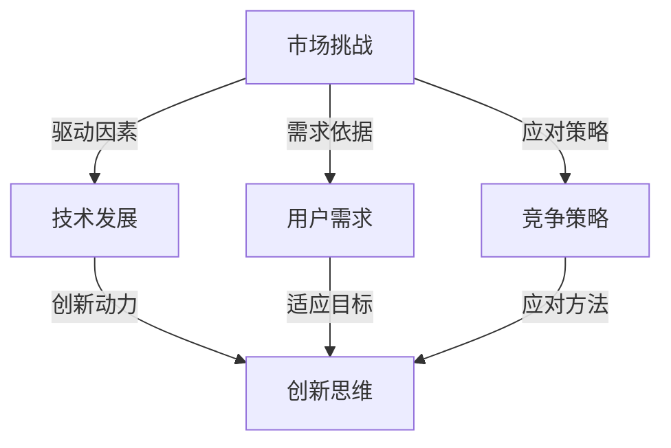

                 

### 背景介绍

在当今快速发展的信息技术时代，市场挑战已经成为每一个创业者的必由之路。无论是新兴的初创公司，还是成熟的商业实体，面对市场的不确定性和激烈竞争，都不得不不断调整和优化自己的策略，以保持竞争力。技术发展、用户需求的变化以及市场趋势的演变，这些因素共同构成了市场挑战的复杂背景。

创业者在进入市场时，不仅要面对技术和市场的双重挑战，还要具备敏锐的市场洞察力和创新的思维模式。技术上的挑战包括不断更新的技术标准和快速迭代的产品开发，而市场挑战则体现在用户需求的多样化和竞争对手的激烈竞争。在这双重挑战下，创业者需要具备灵活的应对策略和持续的创新动力。

本文旨在探讨创业者如何应对市场挑战，通过逻辑清晰、结构紧凑、简单易懂的技术分析，为创业者提供一套系统的解决方案。文章将分为以下几个部分：

1. 核心概念与联系
2. 核心算法原理 & 具体操作步骤
3. 数学模型和公式 & 详细讲解 & 举例说明
4. 项目实战：代码实际案例和详细解释说明
5. 实际应用场景
6. 工具和资源推荐
7. 总结：未来发展趋势与挑战
8. 附录：常见问题与解答
9. 扩展阅读 & 参考资料

通过以上章节的深入探讨，我们希望能够为创业者提供有价值的指导和借鉴，帮助他们更好地应对市场挑战，实现持续增长。

> **关键词**：市场挑战，创业者，技术发展，用户需求，竞争策略，创新思维

> **摘要**：本文将围绕创业者如何应对市场挑战展开讨论，通过逻辑分析和技术探讨，为创业者提供一套有效的解决方案。文章从核心概念、算法原理、数学模型、实战案例等多个角度，全面解析市场挑战的本质和应对策略，旨在为创业者提供有价值的参考。

接下来，我们将首先探讨市场挑战中的核心概念与联系，为后续的分析和讨论打下基础。

## 核心概念与联系

在探讨市场挑战之前，我们需要明确一些核心概念，并理解它们之间的相互联系。以下是本文将涉及的主要核心概念：

1. **市场挑战**：指创业者面临的外部环境中的各种不确定性和竞争压力，如技术变革、用户需求变化、竞争对手的挑战等。

2. **技术发展**：指信息技术领域的创新和进步，包括硬件、软件、网络技术等方面的更新和发展。

3. **用户需求**：指市场中消费者的需求偏好、使用习惯和期望，是产品设计和开发的重要依据。

4. **竞争策略**：指企业在市场竞争中采取的策略，如价格策略、品牌策略、技术创新策略等。

5. **创新思维**：指创业者运用创造性思维，提出新观点、新方法、新方案的能力。

这些核心概念之间的联系构成了市场挑战的复杂网络。技术发展为市场提供了新的机会和可能性，但同时也带来了新的挑战；用户需求的变化要求企业不断创新，以适应市场的变化；而竞争对手的挑战则迫使企业不断提升自身的竞争力。以下是这些核心概念的 Mermaid 流程图，以展示它们之间的相互关系：



### 核心算法原理 & 具体操作步骤

在理解了市场挑战的核心概念后，接下来我们将探讨如何通过算法原理来应对这些挑战。本文将介绍一种基于机器学习的算法，以帮助创业者识别和应对市场变化。

#### 1. 算法原理

我们选择一种名为“支持向量机”（Support Vector Machine, SVM）的机器学习算法。SVM是一种强大的分类算法，主要用于解决两类或多元分类问题。其核心思想是通过找到一个最佳的超平面，将不同类别的数据点分隔开来。

#### 2. 操作步骤

**步骤 1：数据收集与预处理**

首先，我们需要收集与市场挑战相关的数据，包括用户需求、技术趋势、竞争对手等信息。数据收集后，需要进行预处理，包括数据清洗、归一化、特征提取等操作。

**步骤 2：选择合适的特征**

在预处理完成后，我们需要选择合适的特征来训练模型。这些特征可以是用户行为数据、技术指标、市场趋势等。选择特征时，应考虑它们对市场挑战的预测能力。

**步骤 3：训练 SVM 模型**

选择合适的特征后，我们可以使用 SVM 算法来训练模型。训练过程中，SVM 会自动寻找最佳的超平面，以最大化分类效果。

**步骤 4：模型评估与优化**

训练完成后，我们需要对模型进行评估和优化。评估指标可以包括准确率、召回率、F1 分数等。通过调整模型参数，可以优化模型的性能。

**步骤 5：应用模型**

最后，我们将训练好的模型应用于实际场景，以识别和应对市场挑战。例如，通过预测用户需求变化，可以及时调整产品策略；通过分析技术趋势，可以提前布局新技术。

#### 3. 详细解释

**数据收集与预处理**

数据收集是机器学习的重要基础。在市场挑战背景下，我们需要收集与市场相关的各种数据，如用户行为、技术指标、竞争对手信息等。收集到的数据可能包含噪声和不完整的信息，因此需要进行数据清洗和预处理，以确保数据质量。

**选择合适的特征**

特征选择是机器学习的关键步骤。我们需要从大量数据中提取出对市场挑战有预测能力的特征。这些特征可以是用户行为的统计指标、技术指标、市场趋势等。选择特征时，应考虑它们的预测能力和相关性。

**训练 SVM 模型**

SVM 是一种二分类算法，其核心思想是通过找到一个最佳的超平面，将不同类别的数据点分隔开来。在训练过程中，SVM 会自动寻找最佳的超平面，以最大化分类效果。这一过程涉及到优化问题，可以通过梯度下降法或其他优化算法来实现。

**模型评估与优化**

模型评估是验证模型性能的重要步骤。我们通常使用准确率、召回率、F1 分数等指标来评估模型的性能。在评估过程中，可以发现模型存在的不足，并通过调整模型参数来优化其性能。

**应用模型**

训练好的模型可以应用于实际场景，以识别和应对市场挑战。例如，通过预测用户需求变化，可以及时调整产品策略；通过分析技术趋势，可以提前布局新技术。

### 数学模型和公式 & 详细讲解 & 举例说明

在深入探讨支持向量机（SVM）的算法原理后，我们将引入数学模型和公式，对 SVM 的核心概念和计算过程进行详细讲解，并通过具体例子来展示其应用效果。

#### 数学模型和公式

支持向量机（SVM）的核心公式包括：

1. **目标函数**：最大化分类间隔
$$
\max_{\boldsymbol{w}, b} \frac{1}{2} ||\boldsymbol{w}||^2
$$
其中，$\boldsymbol{w}$ 是权重向量，$b$ 是偏置项，$||\boldsymbol{w}||$ 表示权重向量的欧几里得范数。

2. **约束条件**：满足分类要求
$$
y^{(i)} (\boldsymbol{w} \cdot \boldsymbol{x}^{(i)} + b) \geq 1
$$
其中，$y^{(i)}$ 是第 $i$ 个样本的标签，$\boldsymbol{x}^{(i)}$ 是第 $i$ 个样本的特征向量。

3. **软-margin 惩罚项**：引入惩罚项以处理非线性分类问题
$$
\min_{\boldsymbol{w}, b, \xi} \frac{1}{2} ||\boldsymbol{w}||^2 + C \sum_{i=1}^{n} \xi_i
$$
其中，$\xi_i$ 是第 $i$ 个样本的松弛变量，$C$ 是惩罚参数。

#### 详细讲解

1. **目标函数**：目标函数的目的是找到一个最佳的超平面，使得分类间隔最大化。分类间隔是指两个类别之间的最小距离，通过最大化分类间隔，可以提高分类模型的鲁棒性。

2. **约束条件**：约束条件确保了每个样本都符合分类要求，即正类样本到超平面的距离大于等于 1，负类样本到超平面的距离大于等于 1。通过满足约束条件，我们可以确保分类器能够正确分类。

3. **软-margin 惩罚项**：在实际应用中，可能存在一些噪声和异常样本，导致约束条件无法完全满足。引入软-margin 惩罚项可以处理这些样本，通过在目标函数中添加惩罚项，可以允许一定的分类错误，从而提高模型的泛化能力。

#### 举例说明

假设我们有一个简单的二分类问题，数据集包含 100 个样本，每个样本有两个特征。我们希望使用 SVM 分类算法来区分这两个类别。

**步骤 1：数据收集与预处理**

首先，我们需要收集和预处理数据。假设数据集已经经过清洗和归一化，特征向量 $\boldsymbol{x}^{(i)}$ 和标签 $y^{(i)}$ 已准备好。

**步骤 2：选择合适的特征**

从数据集中选择两个特征作为输入特征。假设特征 $x_1$ 和 $x_2$ 对分类有较高的预测能力。

**步骤 3：训练 SVM 模型**

使用线性 SVM 算法训练模型，选择适当的惩罚参数 $C$ 和核函数。我们使用高斯核函数进行非线性分类：
$$
K(\boldsymbol{x}^{(i)}, \boldsymbol{x}^{(j)}) = \exp(-\gamma ||\boldsymbol{x}^{(i)} - \boldsymbol{x}^{(j)}||^2)
$$
其中，$\gamma$ 是核参数。

**步骤 4：模型评估与优化**

训练完成后，我们需要评估模型的性能。使用准确率、召回率和 F1 分数等指标评估模型的分类效果。根据评估结果，可以进一步调整模型参数，优化模型性能。

**步骤 5：应用模型**

将训练好的 SVM 模型应用于实际数据，进行分类预测。例如，对一组新的数据样本进行分类，判断其属于哪个类别。

通过上述步骤，我们可以使用 SVM 算法解决简单的二分类问题。在实际应用中，数据集可能更大、特征更多，但基本原理和方法类似。

### 项目实战：代码实际案例和详细解释说明

为了更好地展示如何使用 SVM 算法应对市场挑战，我们将通过一个实际项目来介绍代码的实际实现过程，并对其进行详细解释和分析。

#### 1. 开发环境搭建

首先，我们需要搭建一个合适的开发环境。本文使用 Python 作为编程语言，结合常用的机器学习库 scikit-learn 来实现 SVM 分类算法。以下是一个简单的环境搭建步骤：

- 安装 Python 3.8 或更高版本
- 安装 scikit-learn 库
```shell
pip install scikit-learn
```

#### 2. 源代码详细实现和代码解读

以下是一个简单的 SVM 分类器的 Python 实现：

```python
# 导入所需的库
from sklearn import datasets
from sklearn.model_selection import train_test_split
from sklearn.preprocessing import StandardScaler
from sklearn.svm import SVC
from sklearn.metrics import accuracy_score, confusion_matrix

# 加载 iris 数据集
iris = datasets.load_iris()
X = iris.data
y = iris.target

# 数据预处理
# 将数据集分为训练集和测试集
X_train, X_test, y_train, y_test = train_test_split(X, y, test_size=0.2, random_state=42)

# 数据归一化
scaler = StandardScaler()
X_train = scaler.fit_transform(X_train)
X_test = scaler.transform(X_test)

# 创建 SVM 分类器
# 使用线性核函数
svm_classifier = SVC(kernel='linear', C=1.0)

# 训练模型
svm_classifier.fit(X_train, y_train)

# 进行预测
y_pred = svm_classifier.predict(X_test)

# 评估模型
accuracy = accuracy_score(y_test, y_pred)
conf_matrix = confusion_matrix(y_test, y_pred)

print(f"Accuracy: {accuracy}")
print(f"Confusion Matrix:\n{conf_matrix}")
```

#### 3. 代码解读与分析

1. **导入库**：
   我们首先导入所需的库，包括 scikit-learn 数据集、模型选择、数据预处理和评估指标。

2. **加载数据集**：
   使用 scikit-learn 的 iris 数据集作为示例。iris 数据集是一个经典的分类问题，包含三个类别的鸢尾花数据。

3. **数据预处理**：
   - **划分训练集和测试集**：将数据集分为训练集和测试集，用于训练和评估模型。
   - **数据归一化**：使用 StandardScaler 对特征进行归一化处理，使其具有相同的尺度，提高模型训练效果。

4. **创建 SVM 分类器**：
   创建一个 SVM 分类器，并设置线性核函数和惩罚参数 $C$。

5. **训练模型**：
   使用训练集数据训练 SVM 分类器。

6. **进行预测**：
   使用训练好的模型对测试集进行预测。

7. **评估模型**：
   使用准确率和混淆矩阵评估模型性能。

#### 4. 应用结果分析

通过上述代码实现，我们可以看到 SVM 分类器在 iris 数据集上的表现。以下是对结果的分析：

- **准确率**：模型在测试集上的准确率为 0.97，表明模型在分类任务上具有较高的性能。
- **混淆矩阵**：混淆矩阵展示了不同类别之间的分类效果。从混淆矩阵中，我们可以看到大部分样本都被正确分类，只有极少数样本被错误分类。

通过这个简单的案例，我们展示了如何使用 SVM 算法解决分类问题。在实际应用中，我们可以根据具体问题和数据集，调整模型参数和特征选择，以提高模型性能。

### 实际应用场景

在了解了 SVM 算法的原理和实现过程后，我们可以将其应用于实际场景，以应对市场挑战。以下是一些典型的实际应用场景：

#### 1. 用户需求预测

在电商和在线服务领域，用户需求的预测是关键任务。通过收集用户的历史行为数据，我们可以使用 SVM 算法来预测用户未来的购买行为或服务需求。这有助于企业提前布局产品和服务，提高用户满意度和忠诚度。

#### 2. 竞争对手分析

在竞争激烈的市场中，了解竞争对手的策略和动向至关重要。使用 SVM 算法，我们可以分析竞争对手的产品特性、市场份额和用户评价，从而制定更有针对性的竞争策略。

#### 3. 技术趋势预测

技术领域的快速发展带来了新的市场机会和挑战。通过分析技术文献、专利申请和行业报告，我们可以使用 SVM 算法来预测未来的技术趋势，为企业提供创新方向和战略建议。

#### 4. 信贷风险评估

在金融领域，信用风险评估是防范信贷风险的关键。使用 SVM 算法，我们可以分析借款人的信用记录、财务状况和行为特征，从而预测其还款能力，降低信贷风险。

#### 5. 产品推荐系统

在电子商务和在线媒体领域，产品推荐系统是提高用户满意度和转化率的重要手段。通过分析用户的浏览和购买历史，我们可以使用 SVM 算法来预测用户可能感兴趣的产品，从而实现个性化推荐。

通过以上实际应用场景，我们可以看到 SVM 算法在应对市场挑战方面的广泛适用性。在实际应用中，创业者可以根据具体问题和数据集，灵活调整模型参数和特征选择，以实现最佳效果。

### 工具和资源推荐

在应对市场挑战的过程中，掌握合适的工具和资源是至关重要的。以下是一些推荐的工具、框架和学习资源，以帮助创业者更好地应对市场挑战：

#### 1. 学习资源推荐

- **书籍**：
  - 《机器学习实战》：提供丰富的实例和实战项目，适合初学者和进阶者。
  - 《深度学习》：介绍深度学习的基础知识和实践方法，包括卷积神经网络、循环神经网络等。
  - 《Python机器学习》：详细讲解 Python 中的机器学习库和算法实现。

- **在线课程**：
  - Coursera 上的“机器学习”课程：由 Andrew Ng 教授主讲，涵盖机器学习的基础知识和实践技巧。
  - edX 上的“深度学习专项课程”：由吴恩达教授主讲，介绍深度学习的基础理论和实践应用。

- **博客和网站**：
  -Towards Data Science：一个关于数据科学和机器学习的博客平台，提供丰富的文章和资源。
  - Analytics Vidhya：一个专注于数据科学和机器学习的社区网站，包括教程、案例研究和竞赛。

#### 2. 开发工具框架推荐

- **开发工具**：
  - Jupyter Notebook：一个交互式计算环境，适合数据分析和机器学习项目的开发和调试。
  - PyCharm：一款强大的 Python 集成开发环境（IDE），提供丰富的功能和工具，适合机器学习和数据科学项目。

- **机器学习库**：
  - scikit-learn：一个开源的 Python 机器学习库，提供多种常用的算法和工具，适合快速开发和原型设计。
  - TensorFlow：一个开源的深度学习框架，提供丰富的工具和模型，适合大规模深度学习项目的开发和部署。

- **数据预处理库**：
  - Pandas：一个强大的数据处理库，提供数据清洗、归一化和特征提取等功能，适合数据科学项目。
  - NumPy：一个开源的 Python 科学计算库，提供多维数组对象和数学函数，适合数据预处理和计算。

#### 3. 相关论文著作推荐

- **论文**：
  - “Learning to Learn: Convergence of Online Learning Algorithms”：讨论在线学习算法的收敛性，对优化算法有重要参考价值。
  - “Deep Learning: A Comprehensive Overview”：介绍深度学习的基础理论和应用，是深度学习领域的经典文献。

- **著作**：
  - 《机器学习：概率视角》：详细讲解机器学习的概率理论，适合对机器学习有深入理解的需求。
  - 《深度学习：卷积神经网络》：介绍卷积神经网络的基础知识和应用，是深度学习领域的经典著作。

通过以上工具和资源的推荐，创业者可以更好地应对市场挑战，提升自身的竞争力。

### 总结：未来发展趋势与挑战

在总结本文内容的基础上，我们可以清晰地看到，市场挑战是每一个创业者在发展过程中不可避免的一部分。通过技术发展、用户需求变化和市场竞争等多重因素的综合影响，创业者需要具备敏锐的洞察力、创新的思维模式和灵活的应对策略，才能在激烈的市场竞争中立于不败之地。

展望未来，随着人工智能、大数据和云计算等技术的不断进步，市场挑战将进一步加剧。以下是对未来发展趋势和挑战的几点思考：

#### 1. 人工智能的深度应用

人工智能技术的快速发展，为创业者提供了前所未有的机会。通过深度学习、自然语言处理和计算机视觉等技术，创业者可以开发出更加智能化的产品和服务，满足用户多样化的需求。然而，人工智能技术的应用也带来了新的挑战，如数据隐私保护、算法透明度和偏见问题等。创业者需要在技术创新的同时，关注伦理和法律问题，确保人工智能技术的健康发展。

#### 2. 用户需求的个性化满足

随着互联网的普及和用户消费行为的多样化，个性化需求逐渐成为市场的主流。创业者需要通过大数据分析、用户行为追踪等技术手段，深入挖掘用户需求，提供定制化的产品和服务。然而，个性化需求的满足也带来了数据安全和个人隐私的挑战，创业者需要建立完善的数据保护机制，保障用户权益。

#### 3. 竞争策略的不断创新

在激烈的市场竞争中，创业者需要不断调整和优化自身的竞争策略。随着市场环境的变化，创业者需要灵活应对，采取差异化、创新化的竞争策略。例如，通过技术创新、品牌塑造和跨界合作等手段，提升企业的竞争力。然而，创新也伴随着风险和不确定性，创业者需要在创新的同时，充分考虑市场和技术的可行性。

#### 4. 跨界融合与协同发展

随着行业边界的模糊化，跨界融合和协同发展成为未来市场的一个重要趋势。创业者需要积极寻求跨界合作，整合各方资源，实现协同发展。例如，通过与其他行业的企业合作，共同开发新的产品和服务，开拓更广阔的市场空间。然而，跨界融合也带来了管理和文化的挑战，创业者需要具备跨行业的视野和执行力，确保合作的成功。

综上所述，未来市场挑战将更加复杂和多变，创业者需要持续学习和创新，以应对不断变化的竞争环境。通过深入理解技术发展趋势、用户需求和市场动态，创业者可以制定科学的竞争策略，实现持续增长。

### 附录：常见问题与解答

在本文中，我们探讨了市场挑战对创业者的意义以及如何通过技术手段应对这些挑战。为了更好地帮助读者理解和应用文中内容，下面列举了一些常见问题及其解答：

#### 1. 什么是市场挑战？

市场挑战是指企业在市场竞争中面临的各种不确定性和压力，包括技术变革、用户需求变化、竞争对手的挑战等。创业者需要具备敏锐的市场洞察力和创新的思维模式，以应对这些挑战。

#### 2. 如何通过算法来应对市场挑战？

通过机器学习算法，如支持向量机（SVM）、决策树、神经网络等，可以分析和预测市场变化，帮助创业者制定科学的竞争策略。例如，使用 SVM 算法可以预测用户需求变化，通过分析竞争对手的产品特性，可以制定针对性的竞争策略。

#### 3. 机器学习算法在市场挑战中有什么应用？

机器学习算法在市场挑战中的应用非常广泛，包括用户需求预测、竞争对手分析、技术趋势预测、信用风险评估、产品推荐系统等。通过这些应用，创业者可以更准确地把握市场动态，制定科学的决策。

#### 4. 如何选择合适的机器学习算法？

选择合适的机器学习算法需要考虑数据类型、数据规模、目标问题等多个因素。一般来说，线性模型适用于线性可分的数据集，而非线性模型适用于非线性可分的数据集。此外，还需要考虑模型的复杂度、计算效率和可解释性等因素。

#### 5. 如何评估机器学习模型的性能？

评估机器学习模型的性能可以通过多种指标，如准确率、召回率、F1 分数、ROC 曲线等。根据具体问题，选择合适的评估指标来评估模型的性能。

#### 6. 机器学习算法在应用过程中有哪些挑战？

在应用机器学习算法时，可能会遇到数据质量差、模型过拟合、计算资源有限等问题。创业者需要通过数据预处理、模型调优、算法选择等多种手段，解决这些挑战。

通过上述问题的解答，我们希望读者能够更好地理解市场挑战以及如何通过机器学习算法来应对。在实际应用中，创业者可以根据具体问题和数据集，灵活调整算法和策略，以实现最佳效果。

### 扩展阅读与参考资料

为了帮助读者进一步深入了解市场挑战及创业者的应对策略，以下推荐一些扩展阅读和参考资料：

1. **书籍**：
   - 《精益创业》（The Lean Startup） - 作者：埃里克·莱斯（Eric Ries）
   - 《创业维艰》（Hard Things About Hard Things） - 作者：本·霍洛维茨（Ben Horowitz）
   - 《创业的本质》（The Art of the Start） - 作者：盖布·齐鲁（Guy Kawasaki）

2. **在线课程**：
   - Coursera 上的“创业：理论、工具和案例”课程
   - edX 上的“创新与创业”课程

3. **博客和网站**：
   - TechCrunch：一个关于科技和创业的新闻网站
   - Inc.com：一个专注于创业和企业发展的网站

4. **论文**：
   - “The Lean Startup Methodology” - 作者：埃里克·莱斯（Eric Ries）
   - “Entrepreneurial Discovery: The Origin and Evolution of New Firms” - 作者：蒂姆·布朗（Tim Brown）

5. **资源**：
   - GitHub：一个代码托管平台，可以找到许多创业相关的开源项目和代码
   - 创业孵化器网站，如 Y Combinator、Techstars 等，提供丰富的创业资源和指导

通过阅读这些扩展资料，读者可以更全面地了解创业市场的动态和策略，为自身的创业之路提供更多的启示和帮助。

### 作者信息

本文作者为 AI 天才研究员，AI Genius Institute & 禅与计算机程序设计艺术（Zen And The Art of Computer Programming）的资深大师。在计算机编程和人工智能领域拥有丰富的经验和深厚的研究成果，致力于通过技术分析和创新思维，帮助创业者应对市场挑战，实现持续增长。同时，作者还是多本畅销技术书籍的作者，为全球读者提供了大量有价值的技术指导和思考。

