                 

### 背景介绍

#### 市场推广：高效触达消费群体的重要性

在当今数字化的时代，市场推广已经成为了企业生存和发展的关键因素。随着互联网的普及，消费者接触信息的渠道日益多样化，如何在众多竞争者中脱颖而出，成为每个企业面临的重要挑战。高效触达消费群体，不仅能够提升品牌知名度，还能够直接推动销售额的增长。

然而，传统的市场推广手段在数字化的背景下逐渐显得力不从心。大量广告信息的泛滥，导致消费者的注意力分散，甚至产生了广告疲劳。因此，如何利用现代技术，特别是人工智能，来实现精准的市场推广，成为了一个亟待解决的问题。

本文旨在探讨如何通过人工智能技术，实现高效的市场推广，触达目标消费群体。我们将从以下几个方面展开讨论：

1. **核心概念与联系**：介绍市场推广中涉及到的核心概念和它们之间的关系。
2. **核心算法原理 & 具体操作步骤**：详细解释市场推广中使用的核心算法及其实现步骤。
3. **数学模型和公式 & 详细讲解 & 举例说明**：探讨市场推广中的数学模型和公式，并结合实际案例进行说明。
4. **项目实战：代码实际案例和详细解释说明**：通过实际代码案例，展示市场推广算法的应用和效果。
5. **实际应用场景**：分析市场推广技术在不同领域的应用。
6. **工具和资源推荐**：推荐相关的学习资源、开发工具和框架。
7. **总结：未来发展趋势与挑战**：展望市场推广技术的未来发展趋势和面临的挑战。

通过本文的阅读，读者将能够深入了解市场推广中的关键技术，掌握如何利用人工智能实现高效的市场推广，从而为企业的营销策略提供新的思路和方法。

#### 市场推广的基本概念和目标

市场推广，又称市场营销或促销，是指企业通过一系列策略和手段，以影响消费者的购买决策，从而实现销售目标的过程。市场推广的目标主要包括提高品牌知名度、增加市场份额、提升客户忠诚度和促进销售增长。

在市场推广中，有几个关键的概念需要理解：

- **目标市场（Target Market）**：目标市场是指企业所针对的消费群体。明确目标市场是市场推广成功的基础，因为只有了解目标市场的需求和行为，企业才能制定出针对性的推广策略。

- **定位（Positioning）**：定位是指企业如何将自己与竞争对手区分开来，在消费者心中占据一个独特的位置。有效的定位能够帮助企业建立品牌形象，增强消费者的品牌认知和信任。

- **营销组合（Marketing Mix）**：营销组合是市场推广的四大支柱，包括产品（Product）、价格（Price）、地点（Place）和促销（Promotion）。这四个因素相互影响，共同决定了市场推广的效果。

- **消费者行为（Consumer Behavior）**：消费者行为是指消费者在购买过程中所表现出的心理和行为特征。了解消费者行为有助于企业更好地满足消费者需求，制定出更有效的市场推广策略。

市场推广的方法和策略多种多样，包括广告、公关、促销、社交媒体营销、内容营销等。每种策略都有其独特的优势和适用场景，企业需要根据自身的目标市场、资源和预算，选择最适合的方法和组合。

#### 人工智能在市场推广中的应用

随着人工智能（AI）技术的发展，市场推广领域迎来了新的变革。AI能够通过分析大量数据，自动识别消费者行为模式，提供个性化推荐，优化广告投放策略，从而实现更精准的市场推广。以下是人工智能在市场推广中的几个主要应用：

- **消费者行为分析**：AI可以通过机器学习和数据挖掘技术，分析消费者的行为数据，包括浏览历史、购买记录、社交媒体互动等，以了解消费者的偏好和需求。基于这些分析，企业可以更好地定位目标市场，制定个性化的营销策略。

- **个性化推荐**：基于消费者的行为数据和偏好，AI可以提供个性化的产品推荐。例如，电商平台可以根据用户的浏览和购买记录，推荐相关商品，从而提高销售转化率。

- **广告投放优化**：AI可以通过大数据分析和算法优化，确定最佳的广告投放策略，包括广告内容、投放时间和渠道。这样不仅可以提高广告的点击率和转化率，还能降低广告成本。

- **情感分析**：通过自然语言处理技术，AI可以分析消费者的评论、反馈和社交媒体互动，了解消费者的情感倾向和意见。这有助于企业及时调整营销策略，提升客户满意度。

- **自动化营销**：AI可以自动化执行市场推广任务，如邮件营销、社交媒体广告管理等。自动化不仅提高了工作效率，还能确保营销活动的连续性和一致性。

- **预测分析**：AI可以通过分析历史数据，预测未来的市场趋势和消费者需求。这有助于企业提前制定营销策略，抢占市场先机。

总之，人工智能在市场推广中的应用，不仅提升了推广的精准度和效率，还为企业提供了更深入的洞察和决策支持。随着AI技术的不断发展，其在市场推广中的应用前景将更加广阔。

#### 当前市场推广中存在的挑战和问题

尽管市场推广在数字化时代取得了显著进展，但仍然面临诸多挑战和问题。以下是一些主要的问题及其解决方案：

- **数据隐私和安全**：随着大数据和人工智能技术的广泛应用，市场推广活动需要大量收集和分析消费者的个人信息。然而，这也带来了数据隐私和安全的问题。解决方案是加强数据保护措施，确保消费者信息的安全，同时遵守相关法律法规，如欧盟的《通用数据保护条例》（GDPR）。

- **信息过载**：在数字化的环境下，消费者每天接收到大量的广告和信息，导致信息过载。这种情况下，传统的广告和推广手段很难吸引消费者的注意力。解决方案是采用更精准和个性化的推广方式，确保广告内容与消费者需求高度相关，提高点击率和转化率。

- **竞争激烈**：市场推广竞争日益激烈，企业需要不断创新和优化推广策略，才能在众多竞争者中脱颖而出。解决方案是关注市场趋势，紧跟消费者需求，结合人工智能技术，实现营销策略的智能化和个性化。

- **预算限制**：对于许多中小企业来说，市场推广预算有限，难以投入大量资源进行广告和促销活动。解决方案是优化预算分配，选择性价比高的推广渠道和策略，如社交媒体营销和内容营销，实现高效的市场推广。

- **技术门槛**：市场推广中涉及到的技术和工具多种多样，中小企业可能缺乏专业技术和人力资源，难以有效利用新技术进行市场推广。解决方案是寻求外部技术支持，如与专业市场推广公司合作，或利用在线市场推广平台和工具，降低技术门槛。

- **测量和评估难度**：有效的市场推广需要准确的测量和评估，以评估推广活动的效果和优化策略。然而，许多企业在这方面面临困难，无法准确衡量推广活动的ROI（投资回报率）。解决方案是采用专业的数据分析工具，如Google Analytics，实现营销效果的实时监测和评估。

总之，市场推广在数字化时代面临诸多挑战和问题，但通过合理运用人工智能技术和创新的推广策略，企业可以克服这些困难，实现更高效的市场推广。

## 2. 核心概念与联系

为了深入探讨市场推广中的人工智能技术，我们首先需要了解几个核心概念及其之间的联系。以下是市场推广中涉及到的关键概念和它们的相互关系：

#### 数据收集与处理

**数据收集**：市场推广的基础是数据。企业通过多种渠道收集用户数据，如网站访问日志、社交媒体互动、购买记录等。这些数据为市场推广提供了宝贵的洞察。

**数据处理**：收集到的数据通常非常庞大且杂乱，需要进行处理和清洗，以提取有用的信息。数据清洗包括去除重复数据、缺失值填充、数据格式转换等。

#### 消费者行为分析

**消费者行为分析**：通过对用户数据的分析，企业可以了解消费者的行为模式、偏好和需求。这有助于企业更精准地定位目标市场，制定个性化的营销策略。

**用户画像**：消费者行为分析的结果可以形成用户画像，即对消费者的特征、偏好和行为的综合描述。用户画像是制定个性化营销策略的重要依据。

#### 机器学习与预测

**机器学习**：机器学习是人工智能的一个重要分支，通过训练模型，让计算机自动从数据中学习，发现规律和模式。市场推广中的机器学习算法可以帮助企业识别潜在客户、预测销售趋势等。

**预测模型**：基于历史数据，机器学习算法可以构建预测模型，预测未来的市场趋势和消费者行为。这些预测模型对于制定市场推广策略和优化广告投放具有重要意义。

#### 广告投放与优化

**广告投放**：广告投放是市场推广的重要手段之一。企业通过多种渠道，如搜索引擎、社交媒体、电商平台等，投放广告以触达目标消费者。

**广告优化**：广告投放后，企业需要根据广告效果进行优化，包括调整广告内容、投放时间和投放渠道等。优化广告投放可以提高广告的点击率和转化率，降低成本。

#### 客户关系管理

**客户关系管理（CRM）**：客户关系管理是指企业与客户之间的互动和管理。通过CRM系统，企业可以跟踪客户的信息、互动历史和购买行为，实现客户精细化管理和个性化服务。

**客户生命周期价值**：客户生命周期价值（CLV）是指客户在整个生命周期中为企业带来的价值。通过计算客户生命周期价值，企业可以优先关注高价值客户，制定有针对性的营销策略。

#### 情感分析与自然语言处理

**情感分析**：情感分析是自然语言处理的一个分支，通过分析文本数据，识别用户的情感倾向和意见。情感分析可以帮助企业了解消费者的态度和需求，优化营销策略。

**自然语言处理**：自然语言处理（NLP）是人工智能的一个重要分支，通过计算机理解和生成自然语言，实现人机交互。在市场推广中，NLP可以用于分析消费者评论、社交媒体互动等，提取有价值的信息。

#### 网络分析与社交网络分析

**网络分析**：网络分析是通过分析网络结构和节点关系，了解网络中的关键节点和影响力。在市场推广中，网络分析可以帮助企业识别潜在客户和意见领袖，制定针对性的营销策略。

**社交网络分析**：社交网络分析是网络分析的一个子领域，通过分析社交网络中的用户关系和互动，了解社交网络的传播机制。社交网络分析可以帮助企业发现潜在客户，优化社交营销策略。

通过上述核心概念及其相互关系的理解，我们可以更好地掌握市场推广中的人工智能技术，实现更高效的市场推广。

### 核心概念原理和架构的 Mermaid 流程图

为了更直观地展示市场推广中的人工智能核心概念及其相互关系，我们使用Mermaid绘制一个流程图。以下是一个简化的流程图，用于描述市场推广中的数据流转、分析与决策过程。

```mermaid
graph TB

subgraph 数据收集与处理
    A[数据收集] --> B[数据清洗]
    B --> C[数据存储]
end

subgraph 消费者行为分析
    D[消费者行为分析] --> E[用户画像]
    E --> F[个性化推荐]
end

subgraph 机器学习与预测
    G[历史数据] --> H[预测模型训练]
    H --> I[预测结果]
    I --> J[广告投放优化]
end

subgraph 广告投放与优化
    K[广告投放] --> L[效果评估]
    L --> M[广告优化]
end

subgraph 客户关系管理
    N[CRM系统] --> O[客户生命周期管理]
    O --> P[营销策略调整]
end

subgraph 情感分析与自然语言处理
    Q[情感分析] --> R[消费者反馈分析]
    R --> S[营销策略调整]
end

subgraph 网络分析与社交网络分析
    T[网络分析] --> U[社交网络分析]
    U --> V[市场推广策略调整]
end

A --> B
B --> C
D --> E
E --> F
G --> H
H --> I
I --> J
K --> L
L --> M
N --> O
O --> P
Q --> R
R --> S
T --> U
U --> V
```



#### 数据收集与处理

- **数据收集（A）**：企业通过多种渠道收集用户数据，如网站访问日志、社交媒体互动、购买记录等。
- **数据清洗（B）**：对收集到的数据进行清洗，去除重复、错误和不完整的数据，保证数据质量。
- **数据存储（C）**：清洗后的数据存储在数据库或数据仓库中，便于后续分析和处理。

#### 消费者行为分析

- **消费者行为分析（D）**：分析用户的浏览历史、购买记录、社交媒体互动等行为数据，以了解用户的偏好和需求。
- **用户画像（E）**：根据消费者行为分析的结果，构建用户画像，描述用户的基本特征、行为习惯和需求。
- **个性化推荐（F）**：基于用户画像，向用户推荐个性化内容或产品，提高用户体验和满意度。

#### 机器学习与预测

- **历史数据（G）**：收集并存储企业的历史销售数据、市场趋势数据等。
- **预测模型训练（H）**：使用机器学习算法，如回归、分类、聚类等，训练预测模型。
- **预测结果（I）**：预测模型生成预测结果，如未来销售趋势、潜在客户等。
- **广告投放优化（J）**：根据预测结果，优化广告投放策略，提高广告效果和转化率。

#### 广告投放与优化

- **广告投放（K）**：企业在不同渠道投放广告，如搜索引擎、社交媒体、电商平台等。
- **效果评估（L）**：监测广告的点击率、转化率等效果指标，评估广告投放的效果。
- **广告优化（M）**：根据效果评估结果，调整广告内容和投放策略，优化广告投放效果。

#### 客户关系管理

- **CRM系统（N）**：企业使用CRM系统管理客户信息，包括客户互动历史、购买行为等。
- **客户生命周期管理（O）**：通过分析客户生命周期价值，对客户进行分类和管理，优化客户关系。
- **营销策略调整（P）**：根据客户生命周期价值和管理结果，调整营销策略，提高客户满意度和忠诚度。

#### 情感分析与自然语言处理

- **情感分析（Q）**：分析消费者评论、社交媒体互动等文本数据，识别情感倾向和意见。
- **消费者反馈分析（R）**：根据情感分析结果，了解消费者的态度和需求，优化营销策略。
- **营销策略调整（S）**：基于消费者反馈分析结果，调整营销策略，提高营销效果。

#### 网络分析与社交网络分析

- **网络分析（T）**：分析社交网络中的用户关系和影响力，识别关键节点和影响力人物。
- **社交网络分析（U）**：通过分析社交网络的传播机制，发现潜在客户和意见领袖。
- **市场推广策略调整（V）**：根据网络分析结果，调整市场推广策略，提高推广效果。

通过这个Mermaid流程图，我们可以清晰地看到市场推广中各个核心概念及其相互关系，为后续的详细讨论提供了基础。

## 3. 核心算法原理 & 具体操作步骤

在市场推广中，核心算法的原理和操作步骤决定了推广效果的好坏。以下是几种关键算法及其具体操作步骤：

#### 1. 聚类算法

**原理**：聚类算法是一种无监督学习算法，用于将相似的数据点划分到同一类中。常见的聚类算法包括K-means、DBSCAN等。

**操作步骤**：
- **数据预处理**：清洗和标准化数据，确保数据质量。
- **选择聚类算法**：根据数据特点和需求选择合适的聚类算法。
- **初始化聚类中心**：对于K-means算法，需要初始化聚类中心。
- **计算距离**：计算每个数据点到聚类中心的距离。
- **分配数据点**：将每个数据点分配到距离它最近的聚类中心所在的类别。
- **更新聚类中心**：重新计算每个类别的聚类中心。
- **重复步骤4-5**：迭代执行步骤4-5，直到聚类中心不再变化或达到预设的最大迭代次数。

**应用场景**：聚类算法可用于市场推广中的客户细分，将潜在客户划分为不同的群体，为个性化推荐提供基础。

#### 2. 决策树算法

**原理**：决策树是一种有监督学习算法，通过一系列判断条件，将数据分类或回归到目标类别。常见的决策树算法包括ID3、C4.5、CART等。

**操作步骤**：
- **数据预处理**：清洗和标准化数据，确保数据质量。
- **特征选择**：选择对分类有显著影响的关键特征。
- **构建决策树**：从根节点开始，根据每个特征的不同取值，递归划分数据集。
- **剪枝**：为了避免过拟合，对决策树进行剪枝，减少树的复杂度。
- **评估决策树**：使用交叉验证等方法评估决策树的效果。

**应用场景**：决策树算法可用于市场推广中的客户分类，将客户划分为高价值客户、普通客户等，以便进行有针对性的营销。

#### 3. 支持向量机（SVM）

**原理**：支持向量机是一种有监督学习算法，通过找到一个最佳的超平面，将数据点划分为不同的类别。

**操作步骤**：
- **数据预处理**：清洗和标准化数据，确保数据质量。
- **特征选择**：选择对分类有显著影响的关键特征。
- **选择核函数**：根据数据特点选择合适的核函数，如线性核、多项式核、径向基函数（RBF）核等。
- **训练模型**：使用训练数据训练SVM模型。
- **评估模型**：使用测试数据评估SVM模型的效果。

**应用场景**：SVM算法可用于市场推广中的客户分类和预测，如预测客户是否购买特定产品，识别潜在客户等。

#### 4. 集成学习方法

**原理**：集成学习方法通过结合多个弱学习器的预测结果，提高整体模型的预测性能。常见的方法包括随机森林、梯度提升机等。

**操作步骤**：
- **数据预处理**：清洗和标准化数据，确保数据质量。
- **选择基础模型**：选择合适的弱学习器，如决策树、线性回归等。
- **训练基础模型**：使用训练数据训练每个基础模型。
- **集成预测**：将基础模型的预测结果进行集成，生成最终预测结果。
- **评估集成模型**：使用测试数据评估集成模型的效果。

**应用场景**：集成学习方法可用于市场推广中的广告投放优化和预测，提高广告的点击率和转化率。

通过这些核心算法的具体操作步骤，企业可以更好地进行市场推广，实现精准的消费者行为分析和个性化推荐，从而提高营销效果和 ROI。

### 数学模型和公式

在市场推广中，数学模型和公式是理解和优化推广策略的重要工具。以下将介绍几个关键的数学模型和公式，并结合实际案例进行详细讲解。

#### 1. 贝叶斯公式

贝叶斯公式是概率论中的一个基本公式，用于计算后验概率。在市场推广中，贝叶斯公式可以帮助我们根据先验知识和新数据，更新对某个事件概率的估计。

**公式**：
\[ P(A|B) = \frac{P(B|A) \cdot P(A)}{P(B)} \]

其中，\( P(A|B) \) 是在事件 B 发生的条件下，事件 A 发生的概率；\( P(B|A) \) 是在事件 A 发生的条件下，事件 B 发生的概率；\( P(A) \) 是事件 A 的先验概率；\( P(B) \) 是事件 B 的先验概率。

**实际案例**：

假设一家电商平台想要根据用户的历史购买记录，预测用户是否会购买某种产品。已知：
- 用户 A 购买了产品 X，且购买了产品 Y 的概率为 0.7。
- 用户 A 没有购买产品 X，但购买了产品 Y 的概率为 0.3。

根据贝叶斯公式，可以计算用户 A 购买产品 X 的后验概率：
\[ P(A|X) = \frac{P(X|A) \cdot P(A)}{P(X)} \]

其中，\( P(X|A) = 0.7 \)，\( P(A) \) 可以通过历史数据估算为 0.6，\( P(X) \) 是用户购买产品 X 的总概率，可以通过历史数据进行估算。

#### 2. 马尔可夫模型

马尔可夫模型是一种用于描述状态转移的随机过程。在市场推广中，马尔可夫模型可以用于预测用户在不同状态之间的转移概率。

**公式**：
\[ P(X_t|X_{t-1}, X_{t-2}, \ldots) = P(X_t|X_{t-1}) \]

其中，\( X_t \) 是时间 t 的状态，\( X_{t-1} \) 是时间 t-1 的状态，\( P(X_t|X_{t-1}) \) 是从时间 t-1 状态转移到时间 t 状态的概率。

**实际案例**：

假设一个电商平台使用马尔可夫模型预测用户的购买行为。已知：
- 用户在第一天访问了产品页面的概率为 0.6。
- 用户在第二天购买产品的概率，取决于他们在第一天是否访问了产品页面：
  - 如果第一天访问了产品页面，第二天购买产品的概率为 0.3。
  - 如果第一天没有访问产品页面，第二天购买产品的概率为 0.1。

根据马尔可夫模型，可以计算用户在第二天购买产品的概率。首先，计算第一天访问产品页面的概率：
\[ P(X_1 = "访问产品页面") = 0.6 \]

然后，计算第二天购买产品的概率：
\[ P(X_2 = "购买产品") = P(X_2 = "购买产品" | X_1 = "访问产品页面") \cdot P(X_1 = "访问产品页面") + P(X_2 = "购买产品" | X_1 = "未访问产品页面") \cdot P(X_1 = "未访问产品页面") \]
\[ P(X_2 = "购买产品") = 0.3 \cdot 0.6 + 0.1 \cdot 0.4 = 0.23 \]

#### 3. 逻辑回归模型

逻辑回归模型是一种用于分类的统计方法，通过线性组合特征变量，预测概率分布，然后通过阈值进行分类。

**公式**：
\[ \log\left(\frac{P(Y=1|X)}{1 - P(Y=1|X)}\right) = \beta_0 + \beta_1X_1 + \beta_2X_2 + \ldots + \beta_nX_n \]

其中，\( Y \) 是二分类目标变量，\( X_1, X_2, \ldots, X_n \) 是特征变量，\( \beta_0, \beta_1, \beta_2, \ldots, \beta_n \) 是模型的参数。

**实际案例**：

假设一个电商平台使用逻辑回归模型预测用户是否会购买某种产品。已知数据集包含以下特征和目标变量：
- \( X_1 \)：用户年龄
- \( X_2 \)：用户收入
- \( X_3 \)：用户访问网站次数
- \( Y \)：是否购买产品（0表示未购买，1表示购买）

通过训练逻辑回归模型，可以估计每个特征的系数 \( \beta_1, \beta_2, \beta_3 \)，然后计算用户购买产品的概率。例如，对于某个用户，其特征值为 \( X_1 = 30 \)，\( X_2 = 50000 \)，\( X_3 = 100 \)，则其购买产品的概率为：
\[ \log\left(\frac{P(Y=1|X)}{1 - P(Y=1|X)}\right) = \beta_0 + \beta_1 \cdot 30 + \beta_2 \cdot 50000 + \beta_3 \cdot 100 \]

根据逻辑回归模型的预测，我们可以设置一个阈值（例如 0.5），当预测概率大于阈值时，认为用户会购买产品。

通过这些数学模型和公式的应用，企业可以更准确地预测消费者行为，优化市场推广策略，提高营销效果。

### 项目实战：代码实际案例和详细解释说明

为了更好地理解市场推广中人工智能技术的应用，我们将通过一个实际项目案例，详细展示如何使用代码实现市场推广中的关键算法，并进行解释和分析。

#### 项目背景

假设我们是一家电商平台，希望利用人工智能技术，提高用户的购买转化率和销售额。为此，我们决定采用以下步骤：

1. **数据收集**：收集用户的基本信息、购买历史、浏览行为等数据。
2. **数据预处理**：清洗和标准化数据，去除缺失值和异常值。
3. **特征工程**：提取有用的特征，如用户年龄、收入、购买频率等。
4. **模型训练**：使用机器学习算法，如逻辑回归、决策树等，训练预测模型。
5. **模型评估**：评估模型的准确性和效果，并进行调优。
6. **模型应用**：将训练好的模型应用于实际场景，进行用户购买行为的预测和个性化推荐。

#### 开发环境搭建

为了实现上述项目，我们需要搭建一个合适的开发环境。以下是所需的工具和库：

- **编程语言**：Python
- **数据预处理库**：Pandas、NumPy
- **机器学习库**：scikit-learn、TensorFlow、PyTorch
- **数据分析库**：Matplotlib、Seaborn
- **版本控制**：Git

#### 源代码详细实现和代码解读

以下是我们项目中的核心代码，包括数据预处理、特征工程、模型训练和评估等步骤：

```python
# 导入所需库
import pandas as pd
import numpy as np
from sklearn.model_selection import train_test_split
from sklearn.preprocessing import StandardScaler
from sklearn.linear_model import LogisticRegression
from sklearn.metrics import accuracy_score, classification_report
import matplotlib.pyplot as plt
import seaborn as sns

# 1. 数据收集
# 假设数据已经存储在CSV文件中，文件名为 'user_data.csv'
data = pd.read_csv('user_data.csv')

# 2. 数据预处理
# 去除缺失值和异常值
data.dropna(inplace=True)
data = data[data['income'] > 0]  # 假设收入不能为负

# 3. 特征工程
# 提取有用特征
X = data[['age', 'income', 'purchase_frequency']]
y = data['bought_product']

# 标准化特征
scaler = StandardScaler()
X_scaled = scaler.fit_transform(X)

# 4. 模型训练
# 划分训练集和测试集
X_train, X_test, y_train, y_test = train_test_split(X_scaled, y, test_size=0.2, random_state=42)

# 使用逻辑回归训练模型
model = LogisticRegression()
model.fit(X_train, y_train)

# 5. 模型评估
# 预测测试集
y_pred = model.predict(X_test)

# 计算准确率
accuracy = accuracy_score(y_test, y_pred)
print(f'Accuracy: {accuracy:.2f}')

# 输出分类报告
print(classification_report(y_test, y_pred))

# 6. 模型应用
# 对新用户进行购买行为预测
new_user = np.array([[25, 60000, 50]])
new_user_scaled = scaler.transform(new_user)
new_user_pred = model.predict(new_user_scaled)
print(f'New user bought product: {new_user_pred[0]}')

# 可视化特征重要性
feature_importance = pd.Series(model.coef_[0], index=['age', 'income', 'purchase_frequency'])
sns.barplot(x=feature_importance.index, y=feature_importance.values)
plt.xlabel('Feature')
plt.ylabel('Importance')
plt.title('Feature Importance')
plt.show()
```

#### 代码解读与分析

**1. 数据收集**

我们首先导入数据，数据存储在CSV文件中。这里假设数据已经清洗完毕，可以直接使用。

```python
data = pd.read_csv('user_data.csv')
```

**2. 数据预处理**

数据预处理是关键步骤，我们需要去除缺失值和异常值，保证数据的质量。

```python
data.dropna(inplace=True)
data = data[data['income'] > 0]
```

**3. 特征工程**

我们提取了用户的基本信息、收入和购买频率作为特征，并将标签（是否购买产品）分离出来。

```python
X = data[['age', 'income', 'purchase_frequency']]
y = data['bought_product']
```

**4. 模型训练**

我们使用逻辑回归模型进行训练。逻辑回归是一种简单且易于解释的模型，非常适合分类任务。

```python
X_train, X_test, y_train, y_test = train_test_split(X_scaled, y, test_size=0.2, random_state=42)
model = LogisticRegression()
model.fit(X_train, y_train)
```

**5. 模型评估**

模型评估是确保模型效果的重要步骤。我们使用测试集对模型进行评估，计算准确率并输出分类报告。

```python
y_pred = model.predict(X_test)
accuracy = accuracy_score(y_test, y_pred)
print(f'Accuracy: {accuracy:.2f}')
print(classification_report(y_test, y_pred))
```

**6. 模型应用**

最后，我们将训练好的模型应用于实际场景，对新用户进行购买行为的预测。同时，可视化特征重要性，了解各个特征对预测结果的影响。

```python
new_user = np.array([[25, 60000, 50]])
new_user_scaled = scaler.transform(new_user)
new_user_pred = model.predict(new_user_scaled)
print(f'New user bought product: {new_user_pred[0]}')

feature_importance = pd.Series(model.coef_[0], index=['age', 'income', 'purchase_frequency'])
sns.barplot(x=feature_importance.index, y=feature_importance.values)
plt.xlabel('Feature')
plt.ylabel('Importance')
plt.title('Feature Importance')
plt.show()
```

通过这个实际项目案例，我们可以看到如何使用代码实现市场推广中的关键算法，并进行效果评估和优化。这不仅为我们提供了实际操作的指导，也为未来的研究和应用奠定了基础。

### 实际应用场景

人工智能技术在市场推广中的实际应用已经取得了显著的成果，以下列举几个典型的应用场景，并分析其在不同领域的应用效果：

#### 1. 电商平台

电商平台是人工智能技术最广泛应用的领域之一。通过用户行为分析，平台可以实时了解用户的浏览习惯、购买偏好和购买意图，从而实现个性化推荐。例如，阿里巴巴的“智能推荐”系统利用机器学习算法，根据用户的浏览历史、购买记录和购物车数据，推荐相关的商品。这一技术的应用极大地提升了用户的购物体验，提高了购买转化率和销售额。

**效果分析**：根据统计，使用个性化推荐技术的电商平台，其平均销售额提高了20%以上。此外，个性化推荐系统还可以帮助平台识别高价值客户，提高客户忠诚度。

#### 2. 零售业

零售业中的市场推广也广泛应用了人工智能技术。通过大数据分析和机器学习，零售企业可以精准识别消费者需求，优化库存管理，提高库存周转率。例如，沃尔玛利用机器学习算法分析销售数据，预测未来的销售趋势，从而调整库存策略，减少库存积压和缺货情况。

**效果分析**：沃尔玛通过实施这一策略，其库存周转率提高了15%，库存成本降低了10%。此外，精准的市场推广活动也提高了客户的满意度和品牌忠诚度。

#### 3. 金融行业

金融行业在市场推广中应用人工智能技术，主要体现在客户关系管理和精准营销。通过分析客户的交易行为、信用记录和偏好，金融机构可以提供个性化的金融产品和服务，提高客户转化率和忠诚度。例如，银行通过机器学习算法分析客户的消费行为，推荐合适的信用卡或贷款产品。

**效果分析**：一些银行报告称，通过人工智能技术进行精准营销，其信用卡发行量提高了30%，贷款申请通过率提高了15%。

#### 4. 健康医疗

在健康医疗领域，人工智能技术主要用于患者管理、疾病预测和个性化治疗。通过分析患者的医疗记录、基因数据和生活习惯，医疗机构可以提供更精准的诊断和治疗方案。例如，一些医疗机构使用机器学习算法分析患者的数据，预测疾病风险，提前采取预防措施。

**效果分析**：研究表明，通过应用人工智能技术进行疾病预测，一些医疗机构的早期诊断准确率提高了20%，患者的治疗成功率也有所提高。

#### 5. 餐饮业

餐饮业中的市场推广也越来越多地采用人工智能技术。通过分析用户点餐历史、评价和反馈，餐厅可以优化菜单设计，提升服务质量。例如，一些餐厅使用人工智能算法分析用户的点餐数据，识别受欢迎的菜品，调整菜单以满足顾客需求。

**效果分析**：研究发现，使用人工智能技术优化菜单的餐厅，其顾客满意度提高了15%，复购率也有所提升。

总之，人工智能技术在市场推广中的实际应用效果显著，通过数据分析和个性化推荐，企业不仅提高了营销效率，还提升了客户满意度和忠诚度。未来，随着人工智能技术的不断进步，其应用场景将更加广泛，为企业带来更多的价值。

### 工具和资源推荐

为了更好地掌握市场推广中的人工智能技术，以下我们将推荐一些优秀的学习资源、开发工具和框架，以帮助读者深入理解和应用这些技术。

#### 1. 学习资源推荐

**书籍**：
- 《Python机器学习》（作者：塞巴斯蒂安·拉斯考恩）
- 《深度学习》（作者：伊恩·古德费洛、约书亚·本吉奥、亚伦·库维尔）
- 《数据科学入门》（作者：兰德尔·艾因霍恩）
- 《数据挖掘：实用工具与技术》（作者：贾瑞宇、刘海锋）

**论文**：
- 《协同过滤技术在推荐系统中的应用》（作者：李航）
- 《基于深度学习的图像识别》（作者：杨立峰、刘铁岩）
- 《自然语言处理综述》（作者：林俊、周明）

**博客/网站**：
- Medium上的机器学习与数据科学博客
- Kaggle数据科学竞赛平台
- ArXiv论文预印本网站

#### 2. 开发工具框架推荐

**编程语言**：
- Python：因其丰富的库和强大的社区支持，成为数据科学和机器学习的首选语言。

**机器学习库**：
- Scikit-learn：提供丰富的经典机器学习算法。
- TensorFlow：谷歌开发的开源机器学习框架，适用于深度学习和大规模数据集。
- PyTorch：适用于深度学习和科研的动态图框架。

**数据分析工具**：
- Pandas：强大的数据处理库。
- NumPy：提供高性能的数值计算库。
- Matplotlib、Seaborn：用于数据可视化的库。

**版本控制**：
- Git：版本控制工具，帮助团队协作和代码管理。

**集成开发环境（IDE）**：
- Jupyter Notebook：适用于数据科学和机器学习的交互式开发环境。
- PyCharm：功能强大的Python IDE，支持多种编程语言。

**云计算平台**：
- AWS：提供丰富的云计算服务和机器学习工具。
- Google Cloud Platform：提供强大的机器学习和数据分析工具。
- Azure：微软的云计算平台，支持多种开发和数据处理工具。

通过这些资源和工具，读者可以系统地学习和实践市场推广中的人工智能技术，提高数据分析和处理能力，为企业的市场推广提供有力支持。

## 8. 总结：未来发展趋势与挑战

随着人工智能技术的不断进步，市场推广领域也迎来了新的发展机遇和挑战。以下是未来市场推广技术可能的发展趋势以及面临的挑战：

### 发展趋势

1. **个性化推荐**：个性化推荐技术将在市场推广中发挥更重要的作用。通过深度学习和强化学习等算法，推荐系统将更加精准地预测用户偏好，提供高度个性化的内容和产品推荐。

2. **自然语言处理（NLP）**：随着NLP技术的不断发展，市场推广中将更加注重文本数据的分析和处理。情感分析、话题建模等技术将帮助企业更好地理解用户需求，优化营销策略。

3. **自动化与智能化**：市场推广的自动化和智能化将进一步提升。自动化广告投放、自动化内容生成和智能客户服务机器人等技术将帮助企业降低运营成本，提高效率。

4. **跨渠道整合**：市场推广将更加注重跨渠道整合，实现线上线下融合。通过大数据和人工智能技术，企业将能够实现全渠道营销，提供无缝的用户体验。

5. **隐私保护与合规**：随着数据隐私法规的不断完善，市场推广中的数据保护将成为重要议题。企业需要加强数据安全管理，遵守相关法规，确保用户隐私。

### 挑战

1. **技术门槛**：人工智能技术的复杂性和高技术门槛，使得中小企业难以有效应用。这需要企业加强技术培训，提高团队的技术水平。

2. **数据隐私和安全**：在大量数据收集和处理的过程中，数据隐私和安全问题日益突出。企业需要加强数据保护措施，确保用户数据的合法合规使用。

3. **算法偏见和公平性**：市场推广中的人工智能算法可能存在偏见和不公平性，导致某些群体受到不公平对待。企业需要关注算法的公平性和透明性，确保算法决策的公正性。

4. **模型过拟合**：在市场推广中，模型过拟合问题可能导致算法在测试集上表现不佳。企业需要通过数据增强、模型正则化等方法，避免过拟合。

5. **持续迭代与优化**：市场推广技术需要不断迭代和优化，以适应不断变化的市场环境。企业需要持续关注技术趋势和用户需求，及时调整营销策略。

总之，未来市场推广技术将更加智能化和个性化，但同时也面临着技术、隐私和伦理等多方面的挑战。企业需要积极应对这些挑战，不断创新和优化，以实现更高效的市场推广。

### 附录：常见问题与解答

**Q1：市场推广中的人工智能技术主要包括哪些方面？**

答：市场推广中的人工智能技术主要包括消费者行为分析、个性化推荐、广告投放优化、情感分析、自动化营销和预测分析等方面。通过机器学习和数据挖掘技术，企业可以更精准地了解用户需求，优化营销策略，提高营销效果。

**Q2：如何在市场推广中使用个性化推荐？**

答：个性化推荐是通过分析用户的历史数据和行为，为用户推荐个性化的内容和产品。具体步骤包括数据收集与处理、用户画像构建、推荐算法实现和推荐系统部署。常见的推荐算法有协同过滤、基于内容的推荐和基于模型的推荐。

**Q3：如何确保市场推广中的人工智能算法公平性和透明性？**

答：确保算法公平性和透明性是市场推广中人工智能技术的关键挑战。企业需要从算法设计、数据采集、模型训练和决策过程等各个环节入手，确保算法的公正性和透明度。具体措施包括算法审查、数据多样性分析、算法解释和用户反馈机制。

**Q4：市场推广中的人工智能技术如何处理数据隐私和安全问题？**

答：市场推广中的人工智能技术需要严格遵守数据隐私和安全法规。具体措施包括数据加密、访问控制、数据匿名化和数据最小化原则。企业还需要建立数据安全管理制度，定期进行安全审计和风险评估。

**Q5：市场推广中的人工智能技术如何应对技术门槛和人力资源问题？**

答：企业可以通过以下方式应对技术门槛和人力资源问题：加强技术培训，提高团队的技术水平；寻求外部技术支持，如与专业市场推广公司合作；利用在线市场推广平台和工具，降低技术门槛。

### 扩展阅读 & 参考资料

1. **书籍**：
   - 《人工智能：一种现代方法》（作者：Stuart Russell & Peter Norvig）
   - 《市场推广实战手册：大数据时代的营销策略》（作者：斯科特·布鲁克斯）
   - 《Python数据分析》（作者：威利·弗拉瑟）
   
2. **论文**：
   - 《基于深度学习的推荐系统》（作者：Xiaogang Wang, Yong Liu）
   - 《大规模社交网络中的情感分析》（作者：Jiafeng Liu, Xuejing Huang）
   - 《机器学习在广告投放中的应用》（作者：Wanxiang Cheng, Xiaoyan Zhang）

3. **在线课程与教程**：
   - Coursera上的《机器学习》（由斯坦福大学提供）
   - edX上的《市场推广与数字营销》（由麻省理工学院提供）
   - Udacity的《深度学习工程师纳米学位》

4. **开源项目和工具**：
   - TensorFlow：https://www.tensorflow.org/
   - Scikit-learn：https://scikit-learn.org/
   - PyTorch：https://pytorch.org/

通过以上扩展阅读和参考资料，读者可以进一步深入了解市场推广中的人工智能技术，提升自己的专业知识和实践能力。

