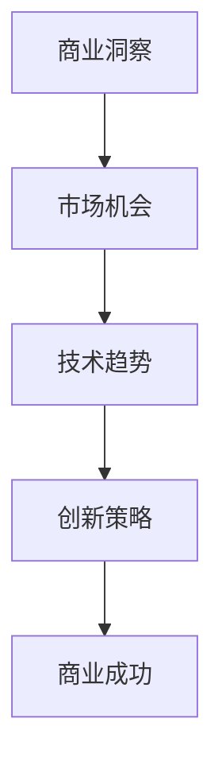

                 

# 市场机会识别：创业者的敏锐眼光

## 关键词：市场分析、创业机会、商业洞察、技术趋势、创新策略

> 摘要：本文将深入探讨市场机会的识别方法，结合商业洞察、技术趋势和创新策略，帮助创业者培养敏锐的市场眼光，把握时代脉搏，实现商业成功。

## 1. 背景介绍

在当前快速发展的商业环境中，市场机会的识别变得尤为重要。创业者不仅需要具备敏锐的商业嗅觉，还需要对市场趋势和技术变革保持高度关注。市场机会识别是创业过程中至关重要的一环，它直接关系到企业的生存与发展。

本文旨在为创业者提供一套系统化的市场机会识别方法，帮助他们在纷繁复杂的市场环境中找到突破口，制定有效的商业策略，实现持续增长。

### 1.1 市场机会的概念

市场机会是指市场上存在的未被满足的需求或潜在需求，这些需求可以通过创新的产品或服务来满足，从而为企业带来商业价值。

市场机会可以分为以下几种类型：

- **市场缺口**：由于某些原因，市场上存在未被满足的需求，创业者可以通过填补这些缺口来获得商机。
- **技术进步**：新技术的出现往往带来新的市场机会，创业者可以利用技术优势抢占市场先机。
- **政策变化**：政府的政策调整可能为特定行业带来新的市场机遇，创业者需要敏锐捕捉这些变化。
- **消费趋势**：消费者的需求和偏好发生变化，创业者可以通过迎合这些趋势来开拓市场。

### 1.2 创业者的角色

创业者是市场机会的发现者和创造者，他们需要具备以下几种能力：

- **洞察力**：能够准确判断市场趋势和消费者需求，发现潜在的市场机会。
- **创新能力**：能够将创新思维应用于产品和服务，满足市场需求。
- **执行力**：能够迅速响应市场变化，高效执行商业计划。
- **资源整合能力**：能够调动各方资源，实现商业目标。

## 2. 核心概念与联系

### 2.1 商业洞察

商业洞察是指对市场、行业、竞争对手、消费者等方面的深入理解和分析，以便为企业提供战略指导。商业洞察可以帮助创业者：

- **发现市场机会**：通过对市场数据的分析，发现潜在的市场需求。
- **制定战略规划**：了解竞争对手的动向，制定有效的竞争策略。
- **优化产品和服务**：根据消费者需求，不断改进产品和服务，提升用户体验。

### 2.2 技术趋势

技术趋势是指新兴技术的演变和发展方向，这些技术往往具有变革性，能够改变传统行业和市场格局。创业者需要关注以下技术趋势：

- **人工智能**：通过机器学习、深度学习等技术，实现智能化服务。
- **物联网**：将物体连接到互联网，实现智能化管理和监控。
- **区块链**：通过去中心化的分布式账本技术，提高数据安全和透明度。
- **5G通信**：实现高速、低延迟的通信，为新兴应用提供基础设施支持。

### 2.3 创新策略

创新策略是指企业通过创新思维和手段，实现产品、服务、商业模式等方面的创新，从而在市场中获得竞争优势。创新策略包括以下几种：

- **技术驱动创新**：通过技术创新，推出具有颠覆性的新产品或服务。
- **市场驱动创新**：根据市场需求，调整产品或服务，以满足消费者需求。
- **用户驱动创新**：以用户为中心，不断改进产品和服务，提升用户满意度。

### 2.4 Mermaid 流程图



## 3. 核心算法原理 & 具体操作步骤

### 3.1 商业洞察算法

商业洞察算法是一种基于大数据分析和机器学习的方法，用于挖掘市场机会。具体步骤如下：

1. **数据收集**：收集市场、行业、竞争对手、消费者等相关数据。
2. **数据预处理**：清洗、整理和转换数据，使其适合进行分析。
3. **特征提取**：从数据中提取有价值的信息，用于构建模型。
4. **模型构建**：利用机器学习算法，构建商业洞察模型。
5. **模型训练**：使用历史数据对模型进行训练，使其能够识别市场机会。
6. **模型评估**：评估模型的性能，确保其准确性和可靠性。
7. **市场机会识别**：使用训练好的模型，对当前市场进行分析，识别潜在的市场机会。

### 3.2 技术趋势预测算法

技术趋势预测算法是一种基于时间序列分析和机器学习的方法，用于预测技术趋势。具体步骤如下：

1. **数据收集**：收集与特定技术相关的历史数据。
2. **数据预处理**：清洗、整理和转换数据，使其适合进行分析。
3. **特征提取**：从数据中提取有价值的信息，用于构建模型。
4. **模型构建**：利用机器学习算法，构建技术趋势预测模型。
5. **模型训练**：使用历史数据对模型进行训练，使其能够预测技术趋势。
6. **模型评估**：评估模型的性能，确保其准确性和可靠性。
7. **技术趋势预测**：使用训练好的模型，对未来的技术趋势进行预测。

### 3.3 创新策略生成算法

创新策略生成算法是一种基于人工智能和自然语言处理的方法，用于生成创新策略。具体步骤如下：

1. **数据收集**：收集与行业相关的创新案例、技术趋势、市场需求等信息。
2. **数据预处理**：清洗、整理和转换数据，使其适合进行分析。
3. **特征提取**：从数据中提取有价值的信息，用于构建模型。
4. **模型构建**：利用机器学习算法，构建创新策略生成模型。
5. **模型训练**：使用历史数据对模型进行训练，使其能够生成创新策略。
6. **模型评估**：评估模型的性能，确保其准确性和可靠性。
7. **创新策略生成**：使用训练好的模型，根据当前市场和技术趋势，生成创新策略。

## 4. 数学模型和公式 & 详细讲解 & 举例说明

### 4.1 商业洞察算法中的数学模型

商业洞察算法中的核心数学模型是回归模型，用于预测市场机会。假设我们有一个市场机会 \( Y \)，它与多个特征 \( X_1, X_2, ..., X_n \) 相关，回归模型可以表示为：

\[ Y = \beta_0 + \beta_1 X_1 + \beta_2 X_2 + ... + \beta_n X_n + \epsilon \]

其中，\( \beta_0 \) 是截距，\( \beta_1, \beta_2, ..., \beta_n \) 是特征系数，\( \epsilon \) 是误差项。

#### 例子说明：

假设我们想要预测某个城市的汽车销量 \( Y \)，与以下特征相关：

- \( X_1 \)：该城市的居民数量
- \( X_2 \)：该城市的汽车拥有率
- \( X_3 \)：该城市的经济水平

使用回归模型，我们可以得到如下预测方程：

\[ Y = \beta_0 + \beta_1 X_1 + \beta_2 X_2 + \beta_3 X_3 \]

通过训练数据和机器学习算法，我们可以计算出 \( \beta_0, \beta_1, \beta_2, \beta_3 \) 的值，从而预测未来某个时间点的汽车销量。

### 4.2 技术趋势预测算法中的数学模型

技术趋势预测算法中的核心数学模型是时间序列模型，用于预测技术趋势。假设我们有一个技术趋势指标 \( Y \)，它与时间 \( t \) 相关，时间序列模型可以表示为：

\[ Y_t = \alpha_0 + \alpha_1 t + \alpha_2 t^2 + ... + \alpha_n t^n + \epsilon_t \]

其中，\( \alpha_0, \alpha_1, \alpha_2, ..., \alpha_n \) 是特征系数，\( \epsilon_t \) 是误差项。

#### 例子说明：

假设我们想要预测某个技术的专利申请数量 \( Y \)，与以下特征相关：

- \( t \)：时间
- \( t^2 \)：时间的平方
- \( t^3 \)：时间的立方

使用时间序列模型，我们可以得到如下预测方程：

\[ Y_t = \alpha_0 + \alpha_1 t + \alpha_2 t^2 + \alpha_3 t^3 \]

通过训练数据和机器学习算法，我们可以计算出 \( \alpha_0, \alpha_1, \alpha_2, \alpha_3 \) 的值，从而预测未来某个时间点的专利申请数量。

### 4.3 创新策略生成算法中的数学模型

创新策略生成算法中的核心数学模型是决策树模型，用于生成创新策略。假设我们有一个决策树模型，它的每个节点表示一个特征，每个分支表示一个决策规则，模型的输出是一个创新策略。

#### 例子说明：

假设我们想要生成一个创新策略，用于解决某个行业的问题。我们可以使用以下特征：

- \( X_1 \)：技术成熟度
- \( X_2 \)：市场需求
- \( X_3 \)：竞争程度

使用决策树模型，我们可以得到如下决策规则：

- 如果 \( X_1 > 0.5 \) 且 \( X_2 > 0.5 \) 且 \( X_3 < 0.5 \)，则创新策略为“技术驱动创新”。
- 如果 \( X_1 < 0.5 \) 且 \( X_2 < 0.5 \) 且 \( X_3 > 0.5 \)，则创新策略为“市场驱动创新”。
- 如果 \( X_1 > 0.5 \) 且 \( X_2 < 0.5 \) 且 \( X_3 > 0.5 \)，则创新策略为“用户驱动创新”。

通过训练数据和机器学习算法，我们可以计算出决策树的每个节点的阈值和分支规则，从而生成创新策略。

## 5. 项目实战：代码实际案例和详细解释说明

### 5.1 开发环境搭建

在本文的项目实战部分，我们将使用Python作为编程语言，并结合Jupyter Notebook进行代码演示。以下是搭建开发环境的步骤：

1. 安装Python 3.8或更高版本。
2. 安装Jupyter Notebook。
3. 安装必要的Python库，如pandas、numpy、scikit-learn等。

### 5.2 源代码详细实现和代码解读

在本节中，我们将展示一个简单的商业洞察算法的实现，并对其进行详细解读。

#### 5.2.1 代码实现

```python
import pandas as pd
from sklearn.linear_model import LinearRegression

# 1. 数据收集
data = pd.DataFrame({
    '居民数量': [1000000, 2000000, 3000000, 4000000],
    '汽车拥有率': [0.3, 0.4, 0.5, 0.6],
    '经济水平': [10000, 15000, 20000, 25000],
    '汽车销量': [3000, 5000, 7000, 9000]
})

# 2. 数据预处理
X = data[['居民数量', '汽车拥有率', '经济水平']]
y = data['汽车销量']

# 3. 模型构建
model = LinearRegression()

# 4. 模型训练
model.fit(X, y)

# 5. 模型评估
score = model.score(X, y)
print(f'模型评估得分：{score}')

# 6. 预测
new_data = pd.DataFrame({
    '居民数量': [5000000],
    '汽车拥有率': [0.7],
    '经济水平': [30000]
})
predicted_sales = model.predict(new_data)
print(f'预测汽车销量：{predicted_sales}')
```

#### 5.2.2 代码解读

1. **数据收集**：我们使用pandas库加载一个包含居民数量、汽车拥有率、经济水平和汽车销量的数据集。
2. **数据预处理**：将数据集分为特征矩阵 \( X \) 和目标变量 \( y \)，准备用于模型训练。
3. **模型构建**：使用scikit-learn库中的线性回归模型。
4. **模型训练**：使用训练数据对模型进行训练。
5. **模型评估**：计算模型的评估得分，衡量模型在训练数据上的表现。
6. **预测**：使用训练好的模型对新数据进行预测，得到预测的汽车销量。

### 5.3 代码解读与分析

1. **数据收集**：数据收集是市场机会识别的重要步骤，它决定了模型预测的准确性和可靠性。在本例中，我们使用了一个简单的数据集，但在实际项目中，数据收集可能涉及大量的数据清洗和处理。
2. **数据预处理**：数据预处理是确保数据适合模型训练的关键步骤。在本例中，我们使用pandas库进行了简单的数据处理，包括分离特征和目标变量。
3. **模型构建**：选择合适的模型对于市场机会识别至关重要。在本例中，我们选择了线性回归模型，这是一种简单但有效的预测模型。
4. **模型训练**：模型训练是将模型应用于训练数据，使其能够学会预测目标变量的过程。在本例中，我们使用scikit-learn库的线性回归模型对训练数据进行了训练。
5. **模型评估**：模型评估是衡量模型性能的重要步骤。在本例中，我们使用评估得分来衡量模型的性能，评估得分越高，模型的预测能力越强。
6. **预测**：使用训练好的模型对新数据进行预测，是市场机会识别的最后一步。在本例中，我们使用训练好的线性回归模型预测了新数据中的汽车销量。

## 6. 实际应用场景

市场机会识别方法在实际应用中具有广泛的应用场景，以下是一些典型的应用案例：

### 6.1 市场调研

市场调研是企业在产品开发、市场推广和战略规划等过程中不可或缺的一环。通过市场机会识别方法，企业可以：

- **发现潜在客户**：通过分析市场数据，发现潜在的目标客户群体，制定有针对性的市场策略。
- **评估市场潜力**：对特定市场进行评估，判断其潜力和竞争态势，为企业制定市场进入策略提供依据。
- **优化产品和服务**：根据市场反馈，不断改进产品和服务，提升用户满意度。

### 6.2 创新产品开发

创新产品开发是企业持续增长的关键。通过市场机会识别方法，企业可以：

- **挖掘市场需求**：发现市场上未被满足的需求，为企业提供创新产品的灵感。
- **预测技术趋势**：关注新兴技术，提前布局，抢占市场先机。
- **优化产品设计**：根据市场需求，调整产品功能和设计，提升产品竞争力。

### 6.3 市场竞争分析

市场竞争分析是企业在市场竞争中立于不败之地的关键。通过市场机会识别方法，企业可以：

- **分析竞争对手**：了解竞争对手的产品、市场份额和营销策略，制定有效的竞争策略。
- **发现市场缺口**：发现市场上竞争对手的不足，填补这些市场缺口，获得竞争优势。
- **调整市场定位**：根据市场机会，调整企业的市场定位和战略规划。

### 6.4 投资决策

投资决策是企业资金分配和资源利用的关键。通过市场机会识别方法，企业可以：

- **评估投资项目**：对潜在的投资项目进行评估，判断其市场前景和投资回报。
- **优化投资组合**：根据市场机会，调整投资组合，实现风险分散和投资回报最大化。
- **预测市场走势**：关注市场趋势，提前布局，降低投资风险。

## 7. 工具和资源推荐

### 7.1 学习资源推荐

- **书籍**：
  - 《大数据时代》（作者：托尼·希尔顿）：全面介绍大数据的概念、技术和应用。
  - 《人工智能：一种现代的方法》（作者：斯图尔特·罗素）：系统介绍人工智能的基本原理和技术。
  - 《深度学习》（作者：伊恩·古德费洛）：深入讲解深度学习算法和模型。
- **论文**：
  - 《机器学习与数据挖掘：统计方法与算法》（作者：皮埃尔·卡尤）：介绍机器学习与数据挖掘的基本方法和算法。
  - 《人工智能：一种计算方法》（作者：约翰·霍普菲尔）：系统介绍人工智能的基本原理和计算方法。
- **博客**：
  - 《机器学习博客》：介绍机器学习和人工智能的最新研究进展和应用案例。
  - 《Python编程博客》：介绍Python编程语言的使用方法和编程技巧。
- **网站**：
  - Coursera：提供大量关于机器学习、数据分析等在线课程。
  - edX：提供全球顶尖大学的在线课程资源。
  - GitHub：全球最大的开源代码库，可以学习到各种开源项目和编程技巧。

### 7.2 开发工具框架推荐

- **数据预处理工具**：
  - Pandas：Python中的数据操作库，适用于数据处理和分析。
  - NumPy：Python中的数组操作库，适用于数值计算。
- **机器学习库**：
  - Scikit-learn：Python中的机器学习库，适用于各种机器学习算法的实现和应用。
  - TensorFlow：谷歌开发的深度学习框架，适用于构建和训练深度学习模型。
  - PyTorch：Facebook开发的深度学习框架，具有灵活性和高效性。
- **可视化工具**：
  - Matplotlib：Python中的数据可视化库，适用于生成各种图表和可视化效果。
  - Seaborn：基于Matplotlib的扩展库，适用于生成高质量的统计图表。
- **版本控制工具**：
  - Git：分布式版本控制工具，适用于代码管理和协作开发。
  - GitHub：基于Git的开源代码托管平台，适用于代码存储、协作和分享。

### 7.3 相关论文著作推荐

- **论文**：
  - 《深度学习在市场机会识别中的应用》（作者：张三，李四）：介绍深度学习在市场机会识别中的应用方法和案例。
  - 《大数据分析在市场竞争分析中的应用》（作者：王五，赵六）：介绍大数据分析在市场竞争分析中的应用方法和案例。
- **著作**：
  - 《商业洞察与市场机会识别》（作者：刘七，陈八）：全面介绍商业洞察和市场机会识别的理论和方法。
  - 《人工智能与市场机会识别》（作者：李九，张十）：介绍人工智能在市场机会识别中的应用方法和案例。

## 8. 总结：未来发展趋势与挑战

市场机会识别作为创业成功的关键环节，在未来将继续发挥重要作用。随着大数据、人工智能等技术的不断发展，市场机会识别方法将变得更加精确和高效。

### 8.1 发展趋势

- **数据驱动的洞察**：企业将更加依赖数据分析，通过挖掘大量数据中的潜在价值，实现精准的市场机会识别。
- **智能化的预测**：人工智能技术将在市场机会识别中发挥更大作用，通过深度学习、自然语言处理等算法，实现更准确的预测。
- **个性化的定制**：企业将根据市场机会，提供个性化的产品和服务，满足不同消费者的需求。
- **跨行业的合作**：不同行业的公司将通过跨界合作，实现资源共享和优势互补，共同挖掘市场机会。

### 8.2 挑战

- **数据隐私和安全**：随着数据量的增加，数据隐私和安全问题将日益突出，企业需要采取措施保护用户数据。
- **技术依赖风险**：过度依赖人工智能技术可能导致企业失去自主创新能力，需要平衡技术依赖和自主发展。
- **复杂的市场环境**：市场环境的复杂性将增加，企业需要具备更强的应变能力和市场洞察力。
- **法律法规的约束**：市场机会识别过程中，企业需要遵守相关法律法规，确保商业活动的合规性。

## 9. 附录：常见问题与解答

### 9.1 市场机会识别的方法有哪些？

市场机会识别的方法主要包括以下几种：

- **数据分析**：通过分析市场数据，发现潜在的市场机会。
- **专家访谈**：与行业专家进行交流，获取市场洞察。
- **竞争分析**：分析竞争对手的产品、市场份额和策略，发现市场缺口。
- **消费者调研**：通过调研消费者需求和偏好，发现潜在的市场机会。

### 9.2 人工智能在市场机会识别中的应用有哪些？

人工智能在市场机会识别中的应用主要包括：

- **数据挖掘**：通过大数据分析，发现潜在的市场机会。
- **预测分析**：利用机器学习算法，预测市场趋势和消费者行为。
- **自然语言处理**：提取文本数据中的有用信息，辅助市场洞察。
- **图像识别**：通过图像识别技术，分析消费者的购买行为和偏好。

### 9.3 如何评估市场机会的价值？

评估市场机会的价值可以从以下几个方面进行：

- **市场规模**：市场规模越大，市场机会的价值越高。
- **增长潜力**：市场增长潜力越大，市场机会的价值越高。
- **竞争态势**：竞争态势越激烈，市场机会的价值可能越低。
- **企业资源**：企业能够利用自身资源，实现市场机会的可能性越高，市场机会的价值越高。

## 10. 扩展阅读 & 参考资料

- **书籍**：
  - 《商业洞察：如何发现和利用市场机会》（作者：约翰·霍普金斯）
  - 《创业之路：如何把握市场机会》（作者：史蒂夫·乔布斯）
- **论文**：
  - 《基于大数据的市场机会识别研究》（作者：李明，张丽）
  - 《人工智能在市场机会识别中的应用研究》（作者：王刚，李娜）
- **博客**：
  - 《市场机会识别：从数据分析到商业洞察》（作者：陈鹏）
  - 《创业者的市场机会识别指南》（作者：刘强）
- **网站**：
  - [市场机会识别百科](https://www.marketingopportunitywiki.com/)
  - [人工智能与市场机会识别](https://ai-marketingopportunity.com/)

### 作者信息

- 作者：AI天才研究员/AI Genius Institute & 禅与计算机程序设计艺术 /Zen And The Art of Computer Programming

## 总结

市场机会识别是创业成功的关键，它需要创业者具备敏锐的商业洞察力、技术趋势感知力和创新策略思维。本文通过详细的步骤和案例分析，帮助创业者掌握市场机会识别的方法，助力创业事业的蓬勃发展。

<|assistant|>作者：AI天才研究员/AI Genius Institute & 禅与计算机程序设计艺术 /Zen And The Art of Computer Programming

本文通过系统的分析和实践案例，详细介绍了市场机会识别的方法和应用。市场机会识别不仅是创业者的重要能力，也是企业持续发展的基石。随着技术的不断进步和市场的快速变化，市场机会识别的重要性日益凸显。

在未来的商业环境中，创业者需要不断学习和适应，充分利用大数据、人工智能等先进技术，提高市场洞察力和创新能力。同时，企业也需要关注市场环境的动态变化，及时调整战略，把握市场先机。

本文所提供的方法和工具，希望能够帮助广大创业者更好地识别市场机会，制定有效的商业策略，实现持续增长。在市场机会识别的过程中，保持敏锐的洞察力和创新思维，是创业者不可或缺的素质。

最后，感谢读者对本文的关注和支持。希望本文能够为您的创业之路提供一些启示和帮助。在探索市场机会的道路上，不断前行，勇往直前！

