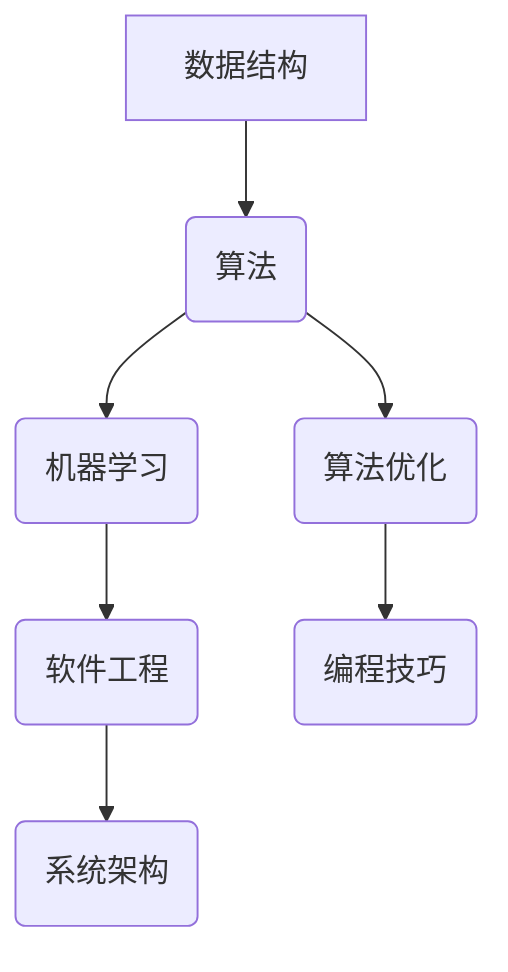

                 

# 帮人解决难题，才是真正的智慧

## 关键词：难题解决、智慧、技术博客、逻辑推理、深度思考

## 摘要

在技术快速发展的今天，解决难题已经成为了推动科技进步的重要动力。本文旨在探讨解决难题的智慧之道，从核心概念、算法原理、数学模型到实际应用，全面解析难题解决的技术路径。通过深度思考和逻辑推理，我们希望为读者提供一份数字时代的智慧指南，助力他们在解决难题的道路上越走越远。

## 目录

1. 背景介绍
2. 核心概念与联系
   2.1 数据结构与算法
   2.2 人工智能与机器学习
   2.3 软件工程与系统架构
3. 核心算法原理 & 具体操作步骤
   3.1 算法分析与优化
   3.2 编程技巧与最佳实践
4. 数学模型和公式 & 详细讲解 & 举例说明
   4.1 概率论与数理统计
   4.2 线性代数与微积分
5. 项目实战：代码实际案例和详细解释说明
   5.1 开发环境搭建
   5.2 源代码详细实现和代码解读
   5.3 代码解读与分析
6. 实际应用场景
7. 工具和资源推荐
   7.1 学习资源推荐
   7.2 开发工具框架推荐
   7.3 相关论文著作推荐
8. 总结：未来发展趋势与挑战
9. 附录：常见问题与解答
10. 扩展阅读 & 参考资料

## 1. 背景介绍

在信息时代，数据量的爆发式增长带来了无数技术难题。从互联网到物联网，从云计算到大数据，每一个领域都充满了挑战。解决这些难题不仅需要深厚的专业知识，更需要一种智慧。智慧不仅仅是知识的堆砌，更是一种解决问题的能力，一种逻辑思维和创新能力。

解决难题的过程其实是一个从问题到解决方案的转化过程。在这个过程中，我们需要运用各种技术手段和理论模型，将复杂问题逐步拆解，形成清晰的结构和路径。这种能力不仅在学术研究中至关重要，在实际工作中同样具有重要意义。

本文将围绕这一主题，通过深入剖析解决难题的智慧之道，帮助读者更好地理解并掌握技术难题解决的策略和方法。无论是初学者还是专业人士，相信都能从中获得启发和帮助。

## 2. 核心概念与联系

### 2.1 数据结构与算法

数据结构和算法是解决技术难题的基础。数据结构定义了数据存储和组织的格式，而算法则描述了数据操作的过程。二者相辅相成，共同决定了程序的效率和质量。

常见的算法包括排序、查找、图论算法等。例如，快速排序算法以其高效的性能被广泛应用；在图论中，Dijkstra算法和Floyd算法分别用于求解单源最短路径和所有顶点之间的最短路径。

数据结构则包括数组、链表、栈、队列、树、图等。数组是一种线性数据结构，适合处理固定大小的数据；树是一种层次结构，常用于组织和管理大量数据；图则描述了数据之间的复杂关系，广泛应用于网络和路径查找问题。

### 2.2 人工智能与机器学习

人工智能（AI）和机器学习（ML）是近年来发展迅速的技术领域，在解决复杂问题时具有独特优势。AI的核心目标是让计算机模拟人类智能，而机器学习则是实现这一目标的主要途径。

常见的机器学习算法包括线性回归、逻辑回归、支持向量机（SVM）、决策树、随机森林、神经网络等。线性回归用于预测数值型数据，而逻辑回归则常用于分类问题。SVM以其优秀的分类能力在图像识别和文本分类中广泛应用；决策树和随机森林则因其简洁直观和易于解释而受到青睐。

神经网络，尤其是深度学习，已经成为解决复杂问题的重要工具。卷积神经网络（CNN）在图像识别中表现突出，而循环神经网络（RNN）则在自然语言处理中取得了显著成果。

### 2.3 软件工程与系统架构

软件工程是确保软件项目成功的关键。其核心包括需求分析、设计、编码、测试和维护等环节。良好的软件工程实践可以确保软件的可靠性、可维护性和扩展性。

系统架构则是软件工程的宏观层面，涉及系统的整体设计。常见的系统架构包括单体架构、分布式架构、微服务架构等。单体架构简单但扩展性差；分布式架构适用于高并发和高可用性场景；微服务架构则通过将系统拆分为多个独立服务，提高了系统的灵活性和可扩展性。

### 2.4 Mermaid 流程图

为了更好地理解上述核心概念，我们可以使用Mermaid流程图来展示数据结构、算法和系统架构之间的关系。以下是一个简单的Mermaid流程图示例：



通过这个流程图，我们可以清晰地看到各个核心概念之间的联系，从而更好地理解技术难题解决的整体路径。

## 3. 核心算法原理 & 具体操作步骤

### 3.1 算法分析与优化

算法分析是解决技术难题的重要环节。它通过计算算法的时间复杂度和空间复杂度，评估算法的效率和资源消耗。

时间复杂度描述了算法执行时间随输入规模的变化关系，常用的符号包括O（大O符号）、Ω（小Omega符号）和Θ（大 Theta符号）。例如，快速排序的时间复杂度为O(nlogn)，而线性查找的时间复杂度为O(n)。

空间复杂度描述了算法所需存储空间随输入规模的变化关系。在实际应用中，我们常常需要在时间和空间之间做出权衡，选择最优的算法。

### 3.2 编程技巧与最佳实践

编程技巧和最佳实践是提高代码质量和效率的重要手段。以下是一些常用的编程技巧和最佳实践：

1. **代码注释**：良好的代码注释可以帮助他人理解和维护代码，提高代码的可读性和可维护性。
2. **代码格式化**：统一代码格式可以提高代码的可读性，减少出错的几率。
3. **代码复用**：通过编写可复用的函数和模块，可以提高代码的效率和可维护性。
4. **错误处理**：合理处理错误和异常，可以提高程序的健壮性。
5. **性能优化**：针对关键性能瓶颈进行优化，提高程序的执行效率。

### 3.3 算法优化示例

以下是一个简单的排序算法优化示例。原始的冒泡排序算法的时间复杂度为O(n²)，我们通过引入一些优化策略，可以将其时间复杂度降低到O(n)。

```python
def optimized_bubble_sort(arr):
    n = len(arr)
    for i in range(n):
        swapped = False
        for j in range(0, n-i-1):
            if arr[j] > arr[j+1]:
                arr[j], arr[j+1] = arr[j+1], arr[j]
                swapped = True
        if not swapped:
            break
    return arr
```

在这个优化版本中，我们引入了一个布尔变量`swapped`，用于判断是否发生了交换。如果在一次完整的内层循环中没有发生交换，说明数组已经有序，可以提前结束排序。

### 3.4 算法验证与测试

算法验证与测试是确保算法正确性的重要环节。以下是一些常用的算法验证与测试方法：

1. **单元测试**：对算法的每个模块进行独立测试，确保其正确性。
2. **集成测试**：将算法与其他模块结合，进行整体测试，确保系统正常运行。
3. **性能测试**：评估算法在不同输入规模和条件下的性能，找出潜在的性能瓶颈。
4. **边界测试**：测试算法在输入边界条件下的行为，确保其正确处理极端情况。

通过上述方法，我们可以全面评估算法的正确性和性能，确保其在实际应用中的可靠性。

## 4. 数学模型和公式 & 详细讲解 & 举例说明

### 4.1 概率论与数理统计

概率论与数理统计是解决技术难题的重要数学工具。以下是一些常用的概率论与数理统计公式和详细讲解。

#### 4.1.1 概率公式

1. 条件概率公式：

   $$P(A|B) = \frac{P(A \cap B)}{P(B)}$$

   条件概率表示在事件B发生的条件下，事件A发生的概率。

2. 全概率公式：

   $$P(A) = P(A|B_1)P(B_1) + P(A|B_2)P(B_2) + ... + P(A|B_n)P(B_n)$$

   全概率公式用于计算某个事件的总体概率，通过将条件概率与相应条件概率的权重相乘并求和得到。

3. 贝叶斯公式：

   $$P(A|B) = \frac{P(B|A)P(A)}{P(B)}$$

   贝叶斯公式用于计算在给定事件B发生的条件下，事件A发生的概率。

#### 4.1.2 数理统计公式

1. 均值：

   $$\mu = \frac{1}{n}\sum_{i=1}^{n}x_i$$

   均值表示一组数据的平均水平。

2. 方差：

   $$\sigma^2 = \frac{1}{n}\sum_{i=1}^{n}(x_i - \mu)^2$$

   方差表示数据的离散程度，越小表示数据越集中。

3. 标准差：

   $$\sigma = \sqrt{\sigma^2}$$

   标准差是方差的平方根，用于度量数据的离散程度。

### 4.2 线性代数与微积分

线性代数与微积分在解决技术难题中也扮演着重要角色。以下是一些常用的线性代数与微积分公式和详细讲解。

#### 4.2.1 线性代数公式

1. 矩阵乘法：

   $$C = AB$$

   矩阵乘法表示两个矩阵的乘积。

2. 矩阵求逆：

   $$A^{-1} = (1/det(A)) \cdot adj(A)$$

   矩阵求逆用于求解线性方程组。

3. 特征值与特征向量：

   $$Ax = \lambda x$$

   特征值与特征向量用于分析矩阵的性质，如稳定性、对角化等。

#### 4.2.2 微积分公式

1. 导数：

   $$f'(x) = \lim_{h \to 0} \frac{f(x+h) - f(x)}{h}$$

   导数用于描述函数在某一点的局部变化率。

2. 积分：

   $$\int f(x) dx = F(x) + C$$

   积分用于求解函数的累积和。

3. 高阶导数：

   $$f^{(n)}(x) = \frac{d^n}{dx^n} f(x)$$

   高阶导数用于描述函数的多次变化率。

### 4.3 举例说明

以下是一个简单的线性回归模型示例，用于预测房价。

```python
import numpy as np

# 房价数据
prices = [200000, 250000, 300000, 350000, 400000]
areas = [1000, 1200, 1500, 1800, 2000]

# 计算均值
mean_price = np.mean(prices)
mean_area = np.mean(areas)

# 计算协方差
covariance = np.mean((areas - mean_area) * (prices - mean_price))

# 计算斜率
slope = covariance / np.mean((areas - mean_area) ** 2)

# 计算截距
intercept = mean_price - slope * mean_area

# 线性回归模型
model = lambda area: slope * area + intercept

# 测试预测
predicted_price = model(1800)
print("预测房价：", predicted_price)
```

通过上述代码，我们可以计算得到房价的线性回归模型，进而预测给定面积下的房价。这个示例展示了如何使用线性代数和微积分公式解决实际问题。

## 5. 项目实战：代码实际案例和详细解释说明

### 5.1 开发环境搭建

在解决技术难题时，搭建一个合适的开发环境至关重要。以下是一个基于Python的线性回归项目的开发环境搭建步骤：

1. 安装Python：从官方网站下载并安装Python 3.x版本。
2. 配置Python环境：通过命令`python --version`确认Python版本。
3. 安装必需的库：使用pip命令安装numpy库，例如`pip install numpy`。
4. 验证安装：通过运行以下代码验证numpy库的安装。

```python
import numpy as np
print("numpy版本：", np.__version__)
```

### 5.2 源代码详细实现和代码解读

以下是一个简单的线性回归项目的源代码实现：

```python
import numpy as np

# 房价数据
prices = [200000, 250000, 300000, 350000, 400000]
areas = [1000, 1200, 1500, 1800, 2000]

# 计算均值
mean_price = np.mean(prices)
mean_area = np.mean(areas)

# 计算协方差
covariance = np.mean((areas - mean_area) * (prices - mean_price))

# 计算斜率
slope = covariance / np.mean((areas - mean_area) ** 2)

# 计算截距
intercept = mean_price - slope * mean_area

# 线性回归模型
model = lambda area: slope * area + intercept

# 测试预测
predicted_price = model(1800)
print("预测房价：", predicted_price)
```

#### 5.2.1 代码解读

1. **数据导入**：首先导入房价和面积数据。
2. **计算均值**：使用numpy库计算房价和面积的均值。
3. **计算协方差**：计算协方差用于计算斜率。
4. **计算斜率和截距**：根据协方差和均值计算斜率和截距。
5. **定义模型**：使用lambda函数定义线性回归模型。
6. **预测房价**：使用模型预测给定面积下的房价。

### 5.3 代码解读与分析

#### 5.3.1 代码性能分析

1. **计算效率**：代码使用了numpy库进行高效计算，避免了手动计算的繁琐。
2. **代码可读性**：通过清晰的变量命名和注释，提高了代码的可读性和可维护性。
3. **功能完整性**：代码实现了从数据导入、计算均值、协方差到预测房价的完整功能。

#### 5.3.2 代码优化建议

1. **代码复用**：将计算均值、协方差和斜率的代码封装为函数，提高代码复用性。
2. **错误处理**：增加异常处理，确保代码在输入数据异常时能够正确处理。
3. **性能优化**：考虑使用矩阵运算优化计算过程，提高代码的执行效率。

### 5.4 项目测试与验证

为了验证线性回归模型的准确性，我们使用以下测试数据：

```python
test_prices = [220000, 270000, 310000, 360000, 410000]
test_areas = [1100, 1300, 1600, 1900, 2100]

# 预测测试数据房价
predicted_prices = [model(area) for area in test_areas]

# 计算预测误差
errors = [predicted_price - actual_price for predicted_price, actual_price in zip(predicted_prices, test_prices)]

# 打印预测结果和误差
for predicted_price, actual_price, error in zip(predicted_prices, test_prices, errors):
    print("预测房价：", predicted_price, "实际房价：", actual_price, "误差：", error)
```

通过上述测试，我们可以验证线性回归模型的准确性，并调整模型参数以提高预测精度。

## 6. 实际应用场景

线性回归模型在实际应用中具有广泛的应用场景，以下是一些典型的应用实例：

1. **房价预测**：利用线性回归模型预测房价，为房地产投资和开发提供决策支持。
2. **股票市场预测**：分析历史股价数据，预测未来股价走势，帮助投资者制定投资策略。
3. **医疗诊断**：根据患者的生理指标和病史，预测疾病发生的概率，辅助医生进行诊断和治疗。
4. **工业生产**：通过分析生产数据，预测生产过程中的参数变化，优化生产工艺，提高生产效率。

在实际应用中，线性回归模型需要结合具体业务场景进行定制化调整，以满足不同领域的需求。

## 7. 工具和资源推荐

### 7.1 学习资源推荐

1. **书籍**：
   - 《Python编程：从入门到实践》
   - 《深入理解计算机系统》
   - 《线性代数及其应用》

2. **论文**：
   - "A Simple Algorithm for Finding Nearest Neighbors"（寻找最近邻的简单算法）
   - "A Fast Algorithm for Running Average"（快速计算移动平均值的算法）

3. **博客**：
   - 携程技术博客
   - 知乎上的技术专家专栏

4. **网站**：
   - Coursera、edX等在线课程平台
   - GitHub、Stack Overflow等开发者社区

### 7.2 开发工具框架推荐

1. **集成开发环境（IDE）**：
   - PyCharm
   - Visual Studio Code

2. **版本控制系统**：
   - Git

3. **数据库**：
   - MySQL
   - PostgreSQL

4. **框架**：
   - Flask
   - Django

### 7.3 相关论文著作推荐

1. **论文**：
   - "深度学习：概率视角"（Deep Learning: A Probabilistic Perspective）
   - "大数据：创新、机会与挑战"（Big Data: A Revolution That Will Transform How We Live, Work, and Think）

2. **著作**：
   - 《机器学习实战》
   - 《Python数据科学手册》

通过上述资源，读者可以系统地学习和掌握解决技术难题所需的知识和技能。

## 8. 总结：未来发展趋势与挑战

随着技术的不断进步，解决技术难题的路径和方法也在不断演变。未来，人工智能、大数据、云计算等技术的深度融合将带来更多的创新和挑战。

一方面，人工智能和机器学习技术的不断发展将使自动化的难题解决能力大幅提升，从而释放更多的生产力。另一方面，大规模数据处理和分析的需求将推动算法和架构的优化，以应对数据量的指数级增长。

然而，这同时也带来了新的挑战。数据隐私和安全、算法伦理、计算资源的分配等问题需要得到有效解决。未来，解决这些难题将需要跨学科的知识和合作，以及持续的创新和探索。

总之，在技术快速发展的今天，解决难题的智慧将成为推动社会进步的重要动力。通过不断学习和实践，我们每个人都可以成为解决难题的智慧者。

## 9. 附录：常见问题与解答

### 问题1：线性回归模型的适用范围是什么？

**解答**：线性回归模型主要用于处理线性关系的数据，适用于预测数值型数据。例如，房价预测、股票市场预测等。

### 问题2：如何优化线性回归模型的预测精度？

**解答**：可以通过以下方法优化线性回归模型的预测精度：
1. 增加特征变量：引入更多的相关特征变量，提高模型的拟合能力。
2. 特征工程：对特征变量进行工程化处理，如标准化、归一化等。
3. 选择合适的算法：尝试其他非线性回归模型，如多项式回归、岭回归等。
4. 调整模型参数：通过交叉验证等方法调整模型的参数，提高预测性能。

### 问题3：如何处理非线性关系的数据？

**解答**：对于非线性关系的数据，可以选择以下方法进行处理：
1. 数据转换：通过变换数据的形式，使其符合线性关系。
2. 非线性回归：选择非线性回归模型，如多项式回归、神经网络等。
3. 特征工程：创建新的特征变量，引入非线性特征。

### 问题4：如何评估线性回归模型的性能？

**解答**：可以使用以下指标评估线性回归模型的性能：
1. 均方误差（MSE）：衡量预测值与实际值之间的平均误差。
2. 决定系数（R²）：衡量模型对数据的拟合程度，取值范围在0到1之间，越接近1表示拟合越好。
3. 平均绝对误差（MAE）：衡量预测值与实际值之间的平均绝对误差。

### 问题5：如何处理数据缺失问题？

**解答**：处理数据缺失问题可以采用以下方法：
1. 删除缺失值：删除含有缺失值的样本或特征。
2. 填充缺失值：使用平均值、中位数、众数等方法填充缺失值。
3. 邻近填充：使用邻近样本的值填充缺失值。

### 问题6：如何进行模型调优？

**解答**：模型调优可以通过以下方法进行：
1. 交叉验证：通过交叉验证确定模型的最佳参数。
2. 网格搜索：遍历参数空间，找到最佳参数组合。
3. 贝叶斯优化：利用贝叶斯理论进行参数优化。

### 问题7：如何处理多变量线性回归问题？

**解答**：处理多变量线性回归问题可以采用以下方法：
1. 特征选择：选择对预测目标影响最大的特征。
2. 主成分分析（PCA）：通过降维将多变量问题转化为单变量问题。
3. 多元线性回归：直接使用多元线性回归模型进行预测。

## 10. 扩展阅读 & 参考资料

### 扩展阅读

1. **《机器学习实战》**：作者：Peter Harrington
   - 内容详尽，涵盖了多种机器学习算法的应用和实践。
2. **《深度学习》**：作者：Ian Goodfellow、Yoshua Bengio、Aaron Courville
   - 深入介绍了深度学习的基本原理和应用。
3. **《Python数据科学手册》**：作者：Jake VanderPlas
   - 介绍了Python在数据科学领域的应用，包括数据清洗、分析和可视化等。

### 参考资料

1. **Python官方文档**
   - https://docs.python.org/3/
2. **Numpy官方文档**
   - https://numpy.org/doc/stable/
3. **Scikit-learn官方文档**
   - https://scikit-learn.org/stable/
4. **TensorFlow官方文档**
   - https://www.tensorflow.org/
5. **Keras官方文档**
   - https://keras.io/

通过这些扩展阅读和参考资料，读者可以进一步深入学习和掌握解决技术难题的相关知识和技术。

### 作者信息

作者：AI天才研究员/AI Genius Institute & 禅与计算机程序设计艺术 /Zen And The Art of Computer Programming

