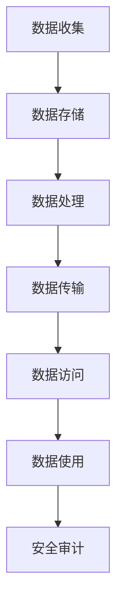

                 

# 平台经济的数据安全技术展望：如何展望未来？

> **关键词**：平台经济，数据安全，安全技术，未来展望

> **摘要**：本文将深入探讨平台经济中的数据安全挑战，分析现有技术的局限性，并提出一系列展望未来的解决方案和策略。通过系统化的分析，我们旨在为读者提供一个全面的数据安全思考框架，帮助应对平台经济的复杂环境。

## 1. 背景介绍

随着互联网的飞速发展和数字化转型的深入，平台经济已经成为全球经济的重要组成部分。平台经济通过互联网平台连接供需双方，实现了资源的优化配置和效率的提升。然而，平台经济的快速发展也带来了数据安全的新挑战。

### 平台经济的定义与特点

平台经济是指通过互联网平台实现多方参与、共享资源、协同创新的经济模式。其主要特点包括：

- **跨界融合**：平台经济不仅涉及到传统行业的转型升级，还催生了许多新兴产业。

- **用户参与**：平台经济的核心在于用户的参与和互动，用户既是服务的提供者，也是服务的消费者。

- **数据驱动**：平台经济的决策和优化依赖于海量数据，数据成为平台经济的关键生产要素。

### 数据安全的重要性

在平台经济中，数据安全至关重要。数据是平台经济的核心资产，一旦发生泄露或滥用，将可能导致以下严重后果：

- **经济损失**：数据泄露可能导致企业的财务损失，甚至引发连锁反应，影响整个平台的运营。

- **声誉受损**：数据泄露可能导致用户信任度下降，影响平台的声誉和用户忠诚度。

- **法律风险**：数据泄露可能违反相关法律法规，导致企业面临高额罚款和诉讼风险。

## 2. 核心概念与联系

### 数据安全的概念

数据安全是指通过一系列技术和管理措施，保护数据在存储、传输、处理和使用过程中的完整性和保密性。具体包括：

- **数据加密**：通过加密算法保护数据的机密性，防止未经授权的访问。

- **访问控制**：通过身份认证、权限管理等方式，控制对数据的访问。

- **安全审计**：记录和分析数据操作日志，及时发现和应对潜在的安全威胁。

### 平台经济的架构

平台经济的架构通常包括以下关键组件：

- **用户**：平台的参与者，包括提供服务和消费服务的用户。

- **平台**：连接用户并提供服务和交易的中间体。

- **第三方服务**：提供支付、物流、数据分析等服务的第三方机构。

### 数据安全的架构

在平台经济中，数据安全的架构需要考虑以下几个方面：

- **数据收集与存储**：确保数据的合法性和合规性，采用加密和访问控制措施保护数据。

- **数据处理与传输**：在数据处理和传输过程中，采用加密、签名等技术保障数据完整性。

- **数据访问与使用**：通过身份认证和权限控制，确保只有授权用户可以访问和使用数据。

### Mermaid 流程图

以下是平台经济中数据安全的关键流程和节点，使用 Mermaid 语言表示：



### 图解说明

- **数据收集**：平台收集用户数据，确保数据来源的合法性和合规性。

- **数据存储**：采用加密技术存储数据，保护数据免受未授权访问。

- **数据处理**：对数据进行处理和清洗，确保数据的质量和可用性。

- **数据传输**：在数据传输过程中，采用加密和签名技术，确保数据的完整性和机密性。

- **数据访问**：通过身份认证和权限控制，确保只有授权用户可以访问数据。

- **数据使用**：用户使用数据执行特定任务，如分析、决策等。

- **安全审计**：记录和分析数据操作日志，及时发现和应对潜在的安全威胁。

## 3. 核心算法原理 & 具体操作步骤

### 加密算法

加密算法是数据安全的核心技术之一，主要用于保护数据的机密性。以下是几种常见的加密算法及其具体操作步骤：

- **对称加密算法**：如AES（高级加密标准）

  - **步骤**：
    1. 选择密钥长度（如128位、192位或256位）。
    2. 生成密钥。
    3. 使用密钥对数据进行加密。
    4. 使用相同的密钥对数据进行解密。

- **非对称加密算法**：如RSA（Rivest-Shamir-Adleman）

  - **步骤**：
    1. 生成密钥对（公钥和私钥）。
    2. 使用公钥对数据进行加密。
    3. 使用私钥对数据进行解密。

### 访问控制算法

访问控制算法主要用于控制用户对数据的访问权限。以下是几种常见的访问控制算法及其具体操作步骤：

- **基于角色的访问控制（RBAC）**

  - **步骤**：
    1. 定义角色和权限。
    2. 分配角色给用户。
    3. 根据用户角色检查访问权限。

- **基于属性的访问控制（ABAC）**

  - **步骤**：
    1. 定义属性和权限。
    2. 分配属性给用户。
    3. 根据用户属性和资源属性检查访问权限。

### 安全审计算法

安全审计算法主要用于记录和分析数据操作日志，以发现潜在的安全威胁。以下是几种常见的安全审计算法及其具体操作步骤：

- **日志记录**：

  - **步骤**：
    1. 记录用户操作日志。
    2. 记录系统事件日志。
    3. 记录安全事件日志。

- **异常检测**：

  - **步骤**：
    1. 建立正常行为模型。
    2. 检测异常行为。
    3. 生成警报。

## 4. 数学模型和公式 & 详细讲解 & 举例说明

### 加密算法的数学模型

- **对称加密算法**：AES

  - **公式**：
    $$C = E_K(P)$$
    $$P = D_K(C)$$
  - **解释**：
    - \(C\) 表示加密后的数据。
    - \(P\) 表示原始数据。
    - \(K\) 表示加密密钥。
    - \(E_K\) 表示加密函数。
    - \(D_K\) 表示解密函数。

- **非对称加密算法**：RSA

  - **公式**：
    $$C = E_n(P)$$
    $$P = D_n(C)$$
  - **解释**：
    - \(n\) 表示公钥。
    - \(P\) 表示原始数据。
    - \(C\) 表示加密后的数据。
    - \(E_n\) 表示加密函数。
    - \(D_n\) 表示解密函数。

### 访问控制算法的数学模型

- **基于角色的访问控制（RBAC）**

  - **公式**：
    $$Access(A, R) = \cap_{P \in R} (Permission(A, P))$$
  - **解释**：
    - \(A\) 表示用户。
    - \(R\) 表示角色。
    - \(P\) 表示权限。
    - \(Access\) 表示访问权限检查。
    - \(Permission\) 表示权限检查。

- **基于属性的访问控制（ABAC）**

  - **公式**：
    $$Access(A, X) = \cap_{P \in X} (Attribute(A, P))$$
  - **解释**：
    - \(A\) 表示用户。
    - \(X\) 表示属性集。
    - \(P\) 表示权限。
    - \(Access\) 表示访问权限检查。
    - \(Attribute\) 表示属性检查。

### 安全审计算法的数学模型

- **日志记录**

  - **公式**：
    $$Log(event, data, time)$$
  - **解释**：
    - \(event\) 表示事件。
    - \(data\) 表示相关数据。
    - \(time\) 表示事件发生时间。

- **异常检测**

  - **公式**：
    $$Abnormal = \sum_{i=1}^n (deviation(i))$$
  - **解释**：
    - \(deviation\) 表示偏差值。
    - \(n\) 表示数据点的数量。
    - \(Abnormal\) 表示异常分数。

### 举例说明

#### 对称加密算法：AES

- **例子**：使用128位密钥对数据进行加密和解密。

  - **加密**：
    $$C = E_{K}("Hello World")$$

  - **解密**：
    $$P = D_{K}(C)$$

#### 非对称加密算法：RSA

- **例子**：使用公钥和私钥对数据进行加密和解密。

  - **加密**：
    $$C = E_{n}("Hello World")$$

  - **解密**：
    $$P = D_{n}(C)$$

#### 访问控制算法：RBAC

- **例子**：用户Alice具有管理员角色，可以访问数据库。

  - **公式**：
    $$Access(Alice, Admin) = \cap_{P \in Admin} (Permission(Alice, P))$$
  - **解释**：
    - \(Admin\) 表示管理员角色。
    - \(Permission\) 表示管理员权限。

#### 访问控制算法：ABAC

- **例子**：用户Bob具有“查看报告”属性，可以查看报告。

  - **公式**：
    $$Access(Bob, View_Report) = \cap_{P \in View_Report} (Attribute(Bob, P))$$
  - **解释**：
    - \(View_Report\) 表示查看报告属性。
    - \(Attribute\) 表示用户属性。

#### 安全审计算法：日志记录

- **例子**：记录用户登录事件。

  - **公式**：
    $$Log(Login, User_A, 2023-04-01 10:30:00)$$
  - **解释**：
    - \(Login\) 表示登录事件。
    - \(User_A\) 表示用户名。
    - \(2023-04-01 10:30:00\) 表示事件发生时间。

#### 安全审计算法：异常检测

- **例子**：检测用户登录次数的异常。

  - **公式**：
    $$Abnormal = \sum_{i=1}^n (deviation(i))$$
  - **解释**：
    - \(deviation\) 表示登录次数与正常值的偏差。

## 5. 项目实战：代码实际案例和详细解释说明

### 开发环境搭建

在开始实际案例之前，我们需要搭建一个适合进行数据安全实验的开发环境。以下是具体的步骤：

1. **安装Python环境**：Python是一种广泛用于数据安全和人工智能的编程语言。确保已经安装了Python 3.x版本。

2. **安装加密库**：使用pip命令安装加密库，例如`cryptography`库。

   ```shell
   pip install cryptography
   ```

3. **安装日志库**：安装用于日志记录的库，例如`logging`库。

   ```shell
   pip install logging
   ```

4. **安装其他依赖库**：根据项目需求，可能需要安装其他依赖库。

### 源代码详细实现和代码解读

以下是使用Python实现数据安全算法的示例代码。代码分为四个部分：加密、访问控制、日志记录和异常检测。

#### 加密模块

```python
from cryptography.hazmat.primitives.ciphers import Cipher, algorithms, modes
from cryptography.hazmat.backends import default_backend
import os

def encrypt_aes(data, key):
    backend = default_backend()
    iv = os.urandom(16)
    cipher = Cipher(algorithms.AES(key), modes.CBC(iv), backend=backend)
    encryptor = cipher.encryptor()
    ct = encryptor.update(data) + encryptor.finalize()
    return ct, iv

def decrypt_aes(ct, iv, key):
    backend = default_backend()
    cipher = Cipher(algorithms.AES(key), modes.CBC(iv), backend=backend)
    decryptor = cipher.decryptor()
    pt = decryptor.update(ct) + decryptor.finalize()
    return pt

# 示例
key = os.urandom(32)
data = b"Hello World"
ct, iv = encrypt_aes(data, key)
print("加密数据:", ct)
print("初始向量:", iv)
pt = decrypt_aes(ct, iv, key)
print("解密数据:", pt)
```

#### 访问控制模块

```python
from typing import List, Dict

# 定义角色和权限
roles = {
    "admin": ["read", "write", "delete"],
    "user": ["read"]
}

# 分配角色给用户
users = {
    "Alice": "admin",
    "Bob": "user"
}

def check_permission(user, action):
    role = users[user]
    permissions = roles[role]
    return action in permissions

# 示例
print(check_permission("Alice", "write"))  # 输出：True
print(check_permission("Bob", "write"))  # 输出：False
```

#### 日志记录模块

```python
import logging

logging.basicConfig(filename='security.log', level=logging.INFO)

def log_event(event, user, time):
    logging.info(f"{event} - User: {user} - Time: {time}")

# 示例
log_event("Login", "Alice", "2023-04-01 10:30:00")
```

#### 异常检测模块

```python
import numpy as np

# 假设正常登录次数为3次
normal_logins = 3
threshold = 5

def detect_abnormal(logins):
    deviation = abs(normal_logins - logins)
    return deviation > threshold

# 示例
print(detect_abnormal(4))  # 输出：False
print(detect_abnormal(8))  # 输出：True
```

### 代码解读与分析

- **加密模块**：使用`cryptography`库实现AES加密和解密。首先生成随机密钥和初始向量，然后创建加密和解密对象，执行加密和解密操作。

- **访问控制模块**：使用Python字典实现基于角色的访问控制。定义角色和权限，然后将角色分配给用户。检查用户权限时，根据用户角色检查对应的权限。

- **日志记录模块**：使用`logging`库记录安全事件。将事件、用户和时间等信息写入日志文件，方便后续审计。

- **异常检测模块**：使用简单的统计方法检测异常。计算登录次数的偏差，如果超过阈值，则认为存在异常。

## 6. 实际应用场景

### 平台经济的不同应用领域

平台经济广泛应用于多个领域，以下是一些常见应用场景：

- **电子商务平台**：如阿里巴巴、亚马逊等，通过平台连接买家和卖家，实现商品交易。

- **共享经济平台**：如滴滴出行、Airbnb等，通过平台连接供需双方，实现资源共享。

- **金融服务平台**：如支付宝、微信支付等，通过平台提供支付、转账等服务。

- **物流平台**：如顺丰、京东物流等，通过平台提供物流配送服务。

### 数据安全在平台经济中的应用

在平台经济中，数据安全是确保业务稳定运行和用户信任的关键。以下是一些实际应用场景：

- **用户数据保护**：平台需要收集和处理大量用户数据，如姓名、地址、身份证号等。通过加密和访问控制技术，确保用户数据的安全性。

- **交易数据安全**：在电子商务平台中，交易数据（如支付信息）需要通过加密技术保护，防止数据泄露。

- **日志记录与审计**：平台需要记录用户操作日志和安全事件，以便进行事后审计和追踪。

- **异常检测与响应**：通过异常检测技术，及时发现和应对潜在的安全威胁，确保平台安全运行。

### 案例分析

#### 电子商务平台的安全挑战

以电子商务平台为例，数据安全面临的挑战包括：

- **用户隐私保护**：用户数据泄露可能导致用户隐私泄露，影响用户信任。

- **交易安全**：交易数据泄露可能导致欺诈行为，影响用户和商家的利益。

- **恶意攻击**：恶意攻击可能导致平台瘫痪，影响业务运营。

#### 解决方案

为了应对上述挑战，电子商务平台可以采取以下措施：

- **数据加密**：使用加密技术保护用户数据和交易数据。

- **访问控制**：实施严格的访问控制策略，确保只有授权人员可以访问敏感数据。

- **日志记录与审计**：记录用户操作日志和安全事件，便于事后审计和追踪。

- **异常检测与响应**：建立异常检测系统，及时发现和应对潜在的安全威胁。

## 7. 工具和资源推荐

### 学习资源推荐

- **书籍**：

  - 《数据安全与隐私保护》
  - 《加密技术与网络安全》
  - 《大数据安全与隐私保护》

- **论文**：

  - "A Comprehensive Survey on Data Security and Privacy in the Cloud"
  - "Secure Multi-Party Computation for Privacy-Preserving Data Analytics"
  - "A Survey on Data Privacy Protection Techniques in Wireless Sensor Networks"

- **博客**：

  - [Data Security Blog](https://www.datasecurityblog.com/)
  - [Crypto World](https://cryptoworld.com/)
  - [Privacy Engineering](https://privacyengineering.com/)

- **网站**：

  - [National Institute of Standards and Technology (NIST)](https://nists.org/)
  - [IEEE Security & Privacy](https://www.ieee.org/publications/pubs/jourمنnal/index.html?tag=security)
  - [OWASP Foundation](https://owasp.org/www-project-top-ten/)

### 开发工具框架推荐

- **加密库**：

  - **PyCryptoDome**：用于Python的加密库，支持多种加密算法。

  - **Bouncy Castle**：跨平台的加密库，支持多种加密算法和协议。

- **日志库**：

  - **Python Logging**：Python内置的日志库，提供丰富的日志功能。

  - **Logstash**：用于收集、处理和存储日志数据的开源工具。

- **异常检测工具**：

  - **Suricata**：开源网络入侵检测系统。

  - **Snort**：开源入侵检测系统，支持实时流量分析。

## 8. 总结：未来发展趋势与挑战

### 发展趋势

- **数据隐私保护**：随着数据隐私保护法规的日益严格，数据隐私保护将成为数据安全的重要方向。

- **人工智能与数据安全**：人工智能技术在数据安全中的应用将越来越广泛，如智能异常检测、自动化安全响应等。

- **区块链技术**：区块链技术将提供更安全、透明和去中心化的数据存储和传输方式。

- **标准化与合规**：数据安全标准和法规的逐步完善，将推动数据安全技术的标准化和合规性。

### 挑战

- **技术复杂性**：随着数据安全技术的不断发展，技术复杂性将增加，对安全专家的要求也将提高。

- **人才短缺**：数据安全领域的人才短缺问题将日益突出，需要加强人才培养和引进。

- **持续威胁**：网络攻击手段将不断升级，数据安全威胁将更加复杂和隐蔽。

- **合规压力**：企业需要应对不断更新的数据安全法规，合规成本将增加。

## 9. 附录：常见问题与解答

### 数据加密相关问题

- **Q：对称加密算法和非对称加密算法有哪些区别？**

  **A：对称加密算法和非对称加密算法的主要区别在于加密和解密使用的是相同密钥（对称）还是不同密钥（非对称）。对称加密算法效率高，但密钥管理复杂；非对称加密算法安全性高，但计算复杂度大。**

- **Q：什么是公钥基础设施（PKI）？**

  **A：公钥基础设施（PKI）是一种用于管理公钥加密和数字证书的系统，包括证书颁发机构（CA）、注册机构（RA）等。PKI用于确保通信双方的身份认证和数据加密传输。**

### 访问控制相关问题

- **Q：什么是多因素认证（MFA）？**

  **A：多因素认证（MFA）是一种安全措施，要求用户在登录时提供两个或更多不同类型的认证因素，如密码、手机验证码、生物识别等。MFA可以显著提高账户安全性。**

### 安全审计相关问题

- **Q：什么是安全事件响应计划（SIEM）？**

  **A：安全事件响应计划（SIEM）是一种安全解决方案，用于监控、收集、分析和响应安全事件。SIEM系统可以帮助企业及时发现和应对潜在的安全威胁。**

## 10. 扩展阅读 & 参考资料

- **书籍**：

  - 《数据安全：从技术到实践》
  - 《区块链技术：从基础到应用》
  - 《人工智能：从理论到实践》

- **论文**：

  - "Data Security and Privacy: Challenges and Solutions"
  - "Blockchain for Data Security: A Comprehensive Survey"
  - "Artificial Intelligence for Cybersecurity: Opportunities and Challenges"

- **博客**：

  - [Data Security Insights](https://www.datasecurityinsights.com/)
  - [Blockchain Insights](https://www.blockchaininsights.com/)
  - [AI for Security](https://www.aiforsecurity.com/)

- **网站**：

  - [NIST Cybersecurity Framework](https://www.nist.gov/cyberframework)
  - [OWASP Top 10](https://owasp.org/www-project-top-ten/)
  - [The Blockchain Association](https://www.theblockchainassociation.org/)

