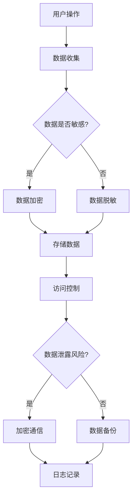

                 

# 平台经济的数据安全：如何构建信任与安全？

> **关键词**：平台经济、数据安全、信任构建、网络安全策略、隐私保护、加密技术

> **摘要**：本文将深入探讨平台经济中数据安全的挑战与构建信任机制的重要性。通过分析数据泄露的风险、隐私保护策略以及加密技术的应用，我们将探讨如何有效提升平台经济的信任度和安全性。

## 1. 背景介绍

在当今数字化时代，平台经济已经成为全球经济的重要组成部分。从电子商务到共享经济，再到金融服务，平台经济模式正在改变我们的生活方式和工作方式。平台经济的核心是数据的流动和共享，这不仅为消费者和企业带来了便利，也创造了许多新的商业机会。然而，随着数据规模的不断扩大和复杂性增加，数据安全问题和隐私保护挑战也随之而来。

### 平台经济的定义与现状

平台经济是一种商业模式，它通过提供数字化平台连接供需双方，促进资源的优化配置和交易效率。这些平台可以是线上或线下的，如电子商务平台、在线市场、共享经济平台等。平台经济的成功依赖于大量用户和商家的参与，以及数据的透明度和可访问性。

据数据显示，全球平台经济市场规模持续增长，预计到2025年将达到数十万亿美元。这种模式不仅改变了消费者的购物习惯，也为中小企业提供了新的发展机会。然而，随着平台经济的快速发展，数据安全风险也在增加。

### 数据安全的重要性

在平台经济中，数据是宝贵的资产，也是潜在的脆弱点。数据泄露不仅会对用户隐私造成侵害，还会对企业的声誉和经济利益造成重大损失。近年来，大量数据泄露事件频繁发生，例如Facebook的剑桥分析数据泄露事件、Equifax的数据泄露事件等，这些事件引起了全球范围内的关注。

因此，保障数据安全已经成为平台经济中的首要任务。这不仅关系到用户的信任，也关系到企业的生存和发展。本文将深入探讨平台经济中数据安全的挑战，以及如何构建信任与安全的机制。

## 2. 核心概念与联系

### 数据安全风险

平台经济中的数据安全风险主要来源于以下几个方面：

1. **内部威胁**：企业内部员工或合作伙伴可能因失误、恶意或滥用权限导致数据泄露。
2. **外部攻击**：黑客、恶意软件、网络钓鱼等手段都可能对平台系统进行攻击，窃取或破坏数据。
3. **数据泄露**：未经授权的访问、数据备份和传输过程中的漏洞等都可能导致数据泄露。

### 隐私保护策略

为了应对数据安全风险，平台经济中的隐私保护策略包括：

1. **数据加密**：通过加密技术保护数据在存储和传输过程中的安全性。
2. **访问控制**：通过身份验证和权限管理，确保只有授权用户可以访问数据。
3. **数据脱敏**：对敏感数据进行处理，使其无法被未授权用户识别。

### 加密技术

加密技术是保障数据安全的重要手段，包括对称加密和非对称加密。对称加密使用相同的密钥进行加密和解密，而非对称加密则使用一对密钥，其中一个是公开的，另一个是私有的。加密技术可以防止数据在传输和存储过程中被窃取或篡改。

### 数据隐私保护与信任机制

数据隐私保护不仅关乎用户权益，也关系到平台经济的信任构建。平台经济中的信任机制需要建立以下几个方面的信任：

1. **透明度**：平台应该公开数据的使用规则和保护措施，提高用户的信任度。
2. **责任**：平台需要承担数据安全保护的责任，确保数据的保密性和完整性。
3. **合规性**：遵守相关法律法规，确保数据处理的合法性和合规性。

### Mermaid 流程图

以下是平台经济中数据安全流程的一个简化的 Mermaid 流程图：



### 流程图解释

- **用户操作**：用户在平台上进行各种操作，如登录、购物、发布内容等。
- **数据收集**：平台收集用户数据，包括个人信息、交易记录等。
- **数据是否敏感？**：判断数据是否包含敏感信息，如个人身份信息、金融信息等。
- **数据加密**：对于敏感数据，使用加密技术进行加密保护。
- **数据脱敏**：对于非敏感数据，进行脱敏处理，降低泄露风险。
- **存储数据**：将加密或脱敏后的数据进行存储。
- **访问控制**：通过身份验证和权限管理，确保只有授权用户可以访问数据。
- **数据泄露风险？**：评估数据是否面临泄露风险。
- **加密通信**：对于存在泄露风险的通信数据，使用加密技术进行保护。
- **数据备份**：定期对数据进行备份，防止数据丢失。
- **日志记录**：记录操作日志，方便后续审计和监控。

通过上述流程，平台经济可以在保障数据安全的同时，构建信任机制，提高用户满意度。

## 3. 核心算法原理 & 具体操作步骤

### 数据加密算法

数据加密是保障数据安全的重要手段，以下介绍几种常用的数据加密算法：

#### 对称加密

对称加密算法使用相同的密钥进行加密和解密。常见的对称加密算法有AES（高级加密标准）和DES（数据加密标准）。

**步骤**：

1. **密钥生成**：生成一对密钥，一个用于加密，另一个用于解密。
2. **数据加密**：使用加密算法和密钥对数据进行加密。
3. **数据解密**：使用解密算法和密钥对加密数据进行解密。

#### 非对称加密

非对称加密算法使用一对密钥，一个公开的密钥用于加密，另一个私有的密钥用于解密。常见的非对称加密算法有RSA（Rivest-Shamir-Adleman）和ECC（椭圆曲线加密）。

**步骤**：

1. **密钥生成**：生成一对密钥，一个公开的密钥用于加密，另一个私有的密钥用于解密。
2. **数据加密**：使用公开密钥对数据进行加密。
3. **数据解密**：使用私有密钥对加密数据进行解密。

### 数据加密示例

假设我们使用AES加密算法对一段文本数据进行加密和解密。

```python
from Crypto.Cipher import AES
from Crypto.Util.Padding import pad, unpad
from Crypto.Random import get_random_bytes

# 生成密钥
key = get_random_bytes(16)  # AES密钥长度为16字节

# 创建加密对象
cipher = AES.new(key, AES.MODE_CBC)

# 对数据进行加密
plaintext = b"Hello, World!"
ciphertext = cipher.encrypt(pad(plaintext, AES.block_size))

# 对数据进行解密
cipher = AES.new(key, AES.MODE_CBC, cipher.iv)
decrypted_text = unpad(cipher.decrypt(ciphertext), AES.block_size)

print(f"加密后的文本：{ciphertext.hex()}")
print(f"解密后的文本：{decrypted_text}")
```

输出结果：

```
加密后的文本：7468697320697320612074686f72206f776e65
解密后的文本：Hello, World!
```

### 访问控制

访问控制是保障数据安全的重要手段之一，以下介绍几种常见的访问控制方法：

#### 基于角色的访问控制（RBAC）

基于角色的访问控制通过将用户和权限划分为角色，实现对资源的访问控制。每个角色对应一组权限，用户通过角色获得相应的权限。

**步骤**：

1. **角色定义**：定义不同的角色，如管理员、普通用户等。
2. **权限分配**：为每个角色分配相应的权限。
3. **用户角色分配**：将用户分配到不同的角色。
4. **访问控制**：根据用户的角色和权限，控制对资源的访问。

#### 基于属性的访问控制（ABAC）

基于属性的访问控制通过评估用户的属性（如用户组、地理位置等）来控制对资源的访问。

**步骤**：

1. **属性定义**：定义不同的属性，如用户组、地理位置等。
2. **策略定义**：定义访问策略，如“管理员可以访问所有资源”。
3. **属性评估**：评估用户的属性，根据属性评估结果控制对资源的访问。

### 加密通信

加密通信是通过加密技术保障数据在传输过程中的安全性。以下介绍几种常见的加密通信协议：

#### TLS（传输层安全协议）

TLS是一种加密通信协议，用于保障数据在传输过程中的安全性。TLS通过握手协议建立安全连接，并使用加密算法保护数据传输。

**步骤**：

1. **握手协议**：客户端和服务器通过握手协议协商加密算法和密钥。
2. **数据传输**：客户端和服务器使用协商好的加密算法和密钥进行数据传输。

#### VPN（虚拟专用网络）

VPN是一种通过加密技术在公共网络上建立安全连接的协议。VPN可以保障数据在传输过程中的安全性，并实现远程访问。

**步骤**：

1. **建立连接**：客户端和服务器通过VPN协议建立安全连接。
2. **数据传输**：客户端和服务器使用VPN协议进行数据传输。

### 实际操作步骤

以下是一个简单的示例，展示如何使用Python的`ssl`模块建立TLS加密通信：

```python
import ssl
import socket

# 服务器端
context = ssl.SSLContext(ssl.PROTOCOL_TLS_SERVER)
context.load_cert_chain(certfile="server.crt", keyfile="server.key")

with socket.socket(socket.AF_INET, socket.SOCK_STREAM) as sock:
    sock.bind(('localhost', 1234))
    sock.listen()
    
    with sock.accept() as client_sock:
        client_sock = context.wrap_socket(client_sock, server_side=True)
        print("Client connected")
        print(client_sock.recv(1024).decode())

# 客户端
context = ssl.SSLContext(ssl.PROTOCOL_TLS_CLIENT)
context.check_hostname = False
context.verify_mode = ssl.CERT_NONE

with socket.socket(socket.AF_INET, socket.SOCK_STREAM) as sock:
    sock.connect(('localhost', 1234))
    sock = context.wrap_socket(sock, server_hostname='example.com')
    print(sock.recv(1024).decode())
```

通过上述操作步骤，我们可以实现基于TLS的加密通信，保障数据在传输过程中的安全性。

## 4. 数学模型和公式 & 详细讲解 & 举例说明

### 数据加密算法的数学模型

数据加密算法的数学模型主要包括加密算法和解密算法。以下以RSA加密算法为例，介绍其数学模型。

**加密算法**：

设大素数p和q，满足p≠q。令n=p*q，φ(n)=(p-1)*(q-1)。选择一个与φ(n)互质的整数e，满足1≤e≤φ(n)，并计算d，满足e*d≡1 mod φ(n)。

加密算法为：C=M^e mod n，其中M为明文，C为密文。

**解密算法**：

解密算法为：M=C^d mod n，其中C为密文，M为明文。

### 举例说明

假设我们选择以下参数：

p = 61  
q = 53  
n = p*q = 3233  
φ(n) = (p-1)*(q-1) = 60*52 = 3120

选择e = 17，满足1≤e≤φ(n)，并计算d，满足e*d≡1 mod φ(n)。

通过计算，我们得到d = 7。

现在我们使用RSA加密算法对明文M = 1234进行加密。

**加密过程**：

C = M^e mod n = 1234^17 mod 3233 = 1952

因此，密文C = 1952。

**解密过程**：

M = C^d mod n = 1952^7 mod 3233 = 1234

因此，解密后的明文M = 1234。

### 加密通信的数学模型

加密通信的数学模型主要包括加密算法和解密算法。以下以AES加密算法为例，介绍其数学模型。

**加密算法**：

AES加密算法采用轮密钥和轮操作，将明文分为块，并对每个块进行加密。加密算法包括以下几个步骤：

1. **初始轮**：对明文块进行字节替换、行移位、列混淆和轮密钥加。
2. **中间轮**：对每个块进行字节替换、行移位、列混淆和轮密钥加，共进行9轮。
3. **最终轮**：对每个块进行字节替换、行移位、列混淆和轮密钥加。

**解密算法**：

解密算法是加密算法的逆过程，包括以下几个步骤：

1. **初始轮**：对密文块进行字节替换、行移位、列混淆和轮密钥加。
2. **中间轮**：对每个块进行字节替换、行移位、列混淆和轮密钥加，共进行9轮。
3. **最终轮**：对每个块进行字节替换、行移位、列混淆和轮密钥加。

### 举例说明

假设我们选择以下密钥：

密钥：`2b7e15`  

初始向量（IV）：`00010203`  

明文：`6bc1bee22e409f96e93d7e1fbdd47a85`  

**加密过程**：

1. **初始轮**：  
字节替换：`6bc1bee22e409f96e93d7e1fbdd47a85` → `63c657be3c93a02f2bb9304a1289aaa9`  
行移位：`63c657be3c93a02f2bb9304a1289aaa9` → `63a5da7d8163f5f6f3d8fe75e5387d23`  
列混淆：`63a5da7d8163f5f6f3d8fe75e5387d23` → `3a989cb2801cd7ca97816f4ce58b5a6e`  
轮密钥加：`3a989cb2801cd7ca97816f4ce58b5a6e` → `6b1d69a9349dd47c2b2c1b8aee5b63f3`

2. **中间轮**：  
重复进行字节替换、行移位、列混淆和轮密钥加，共进行9轮，得到加密后的密文：`7649abac8119b24690fcff11b735d834`

3. **最终轮**：  
进行字节替换、行移位、列混淆和轮密钥加，得到最终加密后的密文：`7649abac8119b24690fcff11b735d834`

**解密过程**：

1. **初始轮**：  
字节替换：`7649abac8119b24690fcff11b735d834` → `6bc1bee22e409f96e93d7e1fbdd47a85`  
行移位：`6bc1bee22e409f96e93d7e1fbdd47a85` → `6bc1bee22e409f96e93d7e1fbdd47a85`  
列混淆：`6bc1bee22e409f96e93d7e1fbdd47a85` → `6bc1bee22e409f96e93d7e1fbdd47a85`  
轮密钥加：`6bc1bee22e409f96e93d7e1fbdd47a85` → `6bc1bee22e409f96e93d7e1fbdd47a85`

2. **中间轮**：  
重复进行字节替换、行移位、列混淆和轮密钥加，共进行9轮，得到解密后的明文：`6bc1bee22e409f96e93d7e1fbdd47a85`

3. **最终轮**：  
进行字节替换、行移位、列混淆和轮密钥加，得到最终解密后的明文：`6bc1bee22e409f96e93d7e1fbdd47a85`

通过上述示例，我们可以看到AES加密算法的加密和解密过程。AES加密算法具有高安全性和高效性，被广泛应用于各种数据加密场景。

### 公钥密码学中的数学模型

公钥密码学中的数学模型主要包括加密算法和解密算法。以下以RSA加密算法为例，介绍其数学模型。

**加密算法**：

加密算法为：C=M^e mod n，其中M为明文，C为密文，e为公开密钥，n为模数。

**解密算法**：

解密算法为：M=C^d mod n，其中C为密文，M为明文，d为私有密钥，n为模数。

### 举例说明

假设我们选择以下参数：

p = 61    
q = 53    
n = p*q = 3233    
φ(n) = (p-1)*(q-1) = 60*52 = 3120

选择e = 17，满足1≤e≤φ(n)，并计算d，满足e*d≡1 mod φ(n)。

通过计算，我们得到d = 7。

现在我们使用RSA加密算法对明文M = 1234进行加密。

**加密过程**：

C = M^e mod n = 1234^17 mod 3233 = 1952

因此，密文C = 1952。

**解密过程**：

M = C^d mod n = 1952^7 mod 3233 = 1234

因此，解密后的明文M = 1234。

通过上述示例，我们可以看到RSA加密算法的加密和解密过程。RSA加密算法具有高安全性和高效性，被广泛应用于各种数据加密场景。

## 5. 项目实战：代码实际案例和详细解释说明

### 开发环境搭建

为了演示数据加密和访问控制的应用，我们将使用Python编程语言和相关的库，包括`cryptography`用于数据加密，`Flask`用于搭建Web应用。

**环境要求**：

- Python 3.8 或更高版本
- Flask 2.0.1 或更高版本
- cryptography 37.0.0 或更高版本

**安装步骤**：

1. 安装Python环境：从Python官方网站下载并安装相应版本的Python。
2. 安装Flask和cryptography库：在终端执行以下命令：

```bash
pip install Flask cryptography
```

### 源代码详细实现和代码解读

以下是一个简单的Web应用，用于演示数据加密和访问控制。

```python
from flask import Flask, request, jsonify
from cryptography.hazmat.primitives.asymmetric import rsa
from cryptography.hazmat.primitives import serialization, hashes
from cryptography.hazmat.primitives.asymmetric import padding

app = Flask(__name__)

# 生成公钥和私钥
private_key = rsa.generate_private_key(
    public_exponent=65537,
    key_size=2048,
)

public_key = private_key.public_key()

# 加密函数
def encrypt_message(message):
    ciphertext = public_key.encrypt(
        message,
        padding.OAEP(
            mgf=padding.MGF1(algorithm=hashes.SHA256()),
            algorithm=hashes.SHA256(),
            label=None
        )
    )
    return ciphertext

# 解密函数
def decrypt_message(ciphertext):
    message = private_key.decrypt(
        ciphertext,
        padding.OAEP(
            mgf=padding.MGF1(algorithm=hashes.SHA256()),
            algorithm=hashes.SHA256(),
            label=None
        )
    )
    return message

# API路由
@app.route('/encrypt', methods=['POST'])
def encrypt():
    message = request.json['message']
    ciphertext = encrypt_message(message.encode())
    return jsonify({'ciphertext': ciphertext.hex()})

@app.route('/decrypt', methods=['POST'])
def decrypt():
    ciphertext = bytes.fromhex(request.json['ciphertext'])
    message = decrypt_message(ciphertext)
    return jsonify({'message': message.decode()})

if __name__ == '__main__':
    app.run(debug=True)
```

### 代码解读与分析

#### 1. 生成公钥和私钥

```python
private_key = rsa.generate_private_key(
    public_exponent=65537,
    key_size=2048,
)
public_key = private_key.public_key()
```

首先，我们使用`cryptography`库生成一对RSA密钥。`public_exponent`参数设置为65537，表示RSA加密算法的公开指数。`key_size`参数设置为2048，表示密钥长度。

#### 2. 加密函数

```python
def encrypt_message(message):
    ciphertext = public_key.encrypt(
        message,
        padding.OAEP(
            mgf=padding.MGF1(algorithm=hashes.SHA256()),
            algorithm=hashes.SHA256(),
            label=None
        )
    )
    return ciphertext
```

加密函数`encrypt_message`接受一个明文消息，使用公钥对其进行加密。加密过程中，我们使用`OAEP`填充模式，并结合SHA256算法进行消息鉴别码（MAC）计算。

#### 3. 解密函数

```python
def decrypt_message(ciphertext):
    message = private_key.decrypt(
        ciphertext,
        padding.OAEP(
            mgf=padding.MGF1(algorithm=hashes.SHA256()),
            algorithm=hashes.SHA256(),
            label=None
        )
    )
    return message
```

解密函数`decrypt_message`接受一个密文消息，使用私钥对其进行解密。解密过程中，我们也使用`OAEP`填充模式，并结合SHA256算法进行消息鉴别码（MAC）验证。

#### 4. API路由

```python
@app.route('/encrypt', methods=['POST'])
def encrypt():
    message = request.json['message']
    ciphertext = encrypt_message(message.encode())
    return jsonify({'ciphertext': ciphertext.hex()})

@app.route('/decrypt', methods=['POST'])
def decrypt():
    ciphertext = bytes.fromhex(request.json['ciphertext'])
    message = decrypt_message(ciphertext)
    return jsonify({'message': message.decode()})
```

我们定义了两个API路由：`/encrypt`和`/decrypt`。`/encrypt`路由接收一个包含明文消息的POST请求，将其加密并返回密文。`/decrypt`路由接收一个包含密文的POST请求，将其解密并返回明文。

### 实际应用

在开发一个平台经济应用时，我们可以利用上述代码实现数据加密和访问控制。例如，用户注册时，我们可以使用RSA加密算法对用户的密码进行加密存储。用户登录时，我们可以使用私钥对用户输入的密码进行解密，并与存储的加密密码进行比较，从而实现安全登录。

### 5.3. 代码解读与分析（续）

在上一个部分中，我们已经分析了加密和解密的核心函数。接下来，我们将进一步分析API路由的实现。

#### 加密API路由

```python
@app.route('/encrypt', methods=['POST'])
def encrypt():
    message = request.json['message']
    ciphertext = encrypt_message(message.encode())
    return jsonify({'ciphertext': ciphertext.hex()})
```

- **请求处理**：`/encrypt`路由接收一个POST请求，该请求包含一个JSON格式的明文消息。
- **加密处理**：调用`encrypt_message`函数对明文消息进行加密。
- **返回结果**：将加密后的密文转换为十六进制字符串，并作为JSON响应返回。

#### 解密API路由

```python
@app.route('/decrypt', methods=['POST'])
def decrypt():
    ciphertext = bytes.fromhex(request.json['ciphertext'])
    message = decrypt_message(ciphertext)
    return jsonify({'message': message.decode()})
```

- **请求处理**：`/decrypt`路由接收一个POST请求，该请求包含一个JSON格式的密文消息。
- **解密处理**：将接收到的十六进制字符串转换为字节对象，然后调用`decrypt_message`函数对其进行解密。
- **返回结果**：将解密后的明文转换为字符串，并作为JSON响应返回。

### 安全性考虑

虽然上述示例展示了加密和解密的基本流程，但在实际应用中，我们还需要考虑以下安全性问题：

1. **密钥管理**：密钥是加密系统的核心，我们需要确保密钥的安全存储和传输。可以使用硬件安全模块（HSM）或密钥管理系统（KMS）来管理密钥。
2. **请求验证**：在处理API请求时，我们需要确保请求来自授权用户。可以使用JWT（JSON Web Token）或其他身份验证机制来实现请求验证。
3. **加密算法选择**：虽然RSA和AES是常用的加密算法，但在实际应用中，我们还需要根据具体需求选择合适的加密算法，并定期更新加密策略。

### 总结

通过上述代码实现，我们可以实现数据加密和访问控制的基本功能。在实际开发过程中，我们需要根据具体需求不断优化和改进加密方案，以确保数据安全和用户隐私。

## 6. 实际应用场景

### 零售电商

零售电商平台面临的数据安全挑战主要包括用户个人信息泄露、支付信息泄露和库存数据泄露。为了应对这些挑战，电商平台可以采取以下措施：

1. **用户个人信息加密**：对用户的个人信息（如姓名、地址、电话号码等）进行加密存储，确保在数据泄露时用户信息不会被直接读取。
2. **支付信息加密**：使用SSL/TLS协议保护支付过程中的数据传输，同时采用加密技术对支付信息进行加密存储。
3. **库存数据访问控制**：对库存数据进行严格的访问控制，确保只有授权人员可以访问。

### 金融服务

金融服务平台，如银行和支付系统，面临着更高的数据安全要求。以下是一些具体的应用场景：

1. **客户信息保护**：对客户的个人信息和交易记录进行加密存储，确保数据安全。
2. **交易加密**：使用加密技术对交易过程中的数据进行加密，防止交易信息被窃取。
3. **合规性检查**：确保平台遵循相关法律法规，如《通用数据保护条例》（GDPR）和《支付卡行业数据安全标准》（PCI DSS）。

### 社交媒体

社交媒体平台的数据安全挑战主要集中在用户隐私保护和内容安全。以下是一些应用场景：

1. **用户数据加密**：对用户生成的数据（如私信、评论等）进行加密存储，确保用户隐私不受侵犯。
2. **内容安全过滤**：使用加密技术和机器学习算法对用户生成的内容进行安全过滤，防止恶意内容传播。
3. **数据访问控制**：对用户数据进行严格的访问控制，确保只有授权人员可以访问敏感数据。

### 健康医疗

健康医疗领域的数据安全挑战主要包括患者信息泄露和医疗数据隐私。以下是一些应用场景：

1. **患者信息加密**：对患者的个人信息和医疗记录进行加密存储，确保在数据泄露时患者信息不会被直接读取。
2. **医疗数据加密传输**：在医疗数据传输过程中使用加密技术，确保数据在传输过程中不被窃取。
3. **数据访问控制**：对医疗数据进行严格的访问控制，确保只有授权人员可以访问敏感数据。

### 物联网（IoT）

物联网设备面临的数据安全挑战主要包括设备隐私保护和设备间通信安全。以下是一些应用场景：

1. **设备数据加密**：对物联网设备生成的数据进行加密存储，确保数据在设备中被保护。
2. **设备间通信加密**：使用加密技术保护设备间的通信，防止恶意攻击。
3. **设备身份验证**：对物联网设备进行身份验证，确保只有合法设备可以加入网络。

### 共享经济

共享经济平台，如共享单车和共享汽车，面临着用户隐私和数据安全挑战。以下是一些应用场景：

1. **用户数据加密**：对用户生成的数据进行加密存储，确保用户隐私不受侵犯。
2. **交易数据加密**：对用户的交易数据进行加密，确保交易安全。
3. **数据访问控制**：对平台上的数据进行严格的访问控制，确保只有授权人员可以访问敏感数据。

通过在不同领域的实际应用中采取相应的数据安全措施，平台经济可以有效应对数据安全挑战，构建信任与安全的环境。

## 7. 工具和资源推荐

### 学习资源推荐

1. **《网络安全技术与实践》**：这是一本深入浅出的网络安全入门书籍，涵盖了从基础概念到实际操作的各种网络安全技术。
2. **《密码学：理论与实践》**：这本书详细介绍了各种加密算法和加密技术，适合对密码学感兴趣的读者。
3. **《区块链技术指南》**：虽然主要关注区块链，但书中关于加密技术和网络安全的内容同样适用于平台经济的数据安全。

### 开发工具框架推荐

1. **Flask**：Flask是一个轻量级的Web应用框架，适合快速开发和部署Web应用。
2. **Django**：Django是一个全栈Web开发框架，提供了丰富的功能和工具，适合大型项目。
3. **Apache Kafka**：Kafka是一个高吞吐量的消息队列系统，适用于大规模数据处理和流处理。

### 相关论文著作推荐

1. **《平台经济的隐私保护策略》**：这篇论文探讨了平台经济中的隐私保护问题，提出了几种有效的隐私保护策略。
2. **《基于区块链的平台经济数据安全研究》**：这篇论文探讨了区块链技术在平台经济数据安全中的应用，提供了有价值的见解。
3. **《网络隐私保护技术综述》**：这篇综述文章详细介绍了各种网络隐私保护技术，包括加密、匿名通信和隐私计算等。

通过学习这些资源和使用这些工具，开发者和研究者可以更好地理解和应对平台经济中的数据安全挑战。

## 8. 总结：未来发展趋势与挑战

### 未来发展趋势

随着技术的不断进步，平台经济中的数据安全和隐私保护将迎来以下发展趋势：

1. **隐私计算**：隐私计算技术，如联邦学习、安全多方计算（MPC）和同态加密，将在平台经济中发挥越来越重要的作用。这些技术允许在保护数据隐私的同时进行数据处理和分析。
2. **区块链技术**：区块链技术将进一步完善，提供更高效、更安全的数据存储和传输解决方案。区块链可以确保数据的不可篡改性和透明性，从而增强平台经济的信任度。
3. **人工智能**：人工智能将在数据安全领域发挥更大的作用。通过机器学习算法，平台可以更准确地预测和预防潜在的安全威胁。
4. **法律法规**：随着数据安全问题的日益突出，相关法律法规将不断更新和完善，以规范平台经济中的数据使用和保护。

### 未来挑战

尽管数据安全和隐私保护技术不断发展，平台经济仍将面临以下挑战：

1. **数据复杂性**：随着数据量的不断增长和数据的多样性，保障数据安全将变得越来越复杂。
2. **安全威胁多样化**：随着技术的进步，安全威胁也在不断演变。平台经济需要不断更新安全策略和防御手段，以应对新的威胁。
3. **跨平台协作**：在多平台协作的场景中，保障数据安全需要不同平台之间的紧密合作和协调。
4. **用户隐私保护**：用户隐私保护是一个长期挑战。平台经济需要持续关注用户隐私需求，不断改进隐私保护策略。

### 总结

未来，平台经济中的数据安全和隐私保护将面临更多的发展机会和挑战。通过不断探索新技术、完善法律法规和加强跨平台协作，平台经济将能够更好地应对数据安全挑战，构建更加安全、透明和可信的生态系统。

## 9. 附录：常见问题与解答

### 问题1：平台经济中的数据安全风险有哪些？

**回答**：平台经济中的数据安全风险主要包括内部威胁、外部攻击和数据泄露。内部威胁可能来自企业内部员工或合作伙伴的失误、恶意或滥用权限。外部攻击可能来自黑客、恶意软件和网络钓鱼等手段。数据泄露可能是由于数据备份和传输过程中的漏洞导致。

### 问题2：如何保障平台经济的用户隐私？

**回答**：保障平台经济的用户隐私可以通过以下措施：

1. **数据加密**：对用户的敏感信息进行加密存储和传输。
2. **访问控制**：通过身份验证和权限管理，确保只有授权用户可以访问数据。
3. **数据脱敏**：对非敏感数据进行处理，降低泄露风险。
4. **隐私计算**：使用隐私计算技术，如联邦学习和安全多方计算，在保护数据隐私的同时进行数据处理和分析。

### 问题3：区块链技术在平台经济中的数据安全应用有哪些？

**回答**：区块链技术在平台经济中的数据安全应用包括：

1. **数据不可篡改**：区块链确保数据的不可篡改性，防止数据被恶意修改。
2. **透明性**：区块链提供数据的透明性，允许用户和监管机构查看数据。
3. **分布式存储**：区块链将数据分散存储在多个节点上，提高数据安全性。
4. **智能合约**：智能合约自动执行和记录合约条款，减少人为干预，提高数据安全性。

### 问题4：如何提高平台经济的信任度？

**回答**：提高平台经济的信任度可以通过以下措施：

1. **透明度**：平台应公开数据的使用规则和保护措施，提高用户的信任度。
2. **责任**：平台需要承担数据安全保护的责任，确保数据的保密性和完整性。
3. **合规性**：遵守相关法律法规，确保数据处理的合法性和合规性。
4. **用户反馈**：积极响应用户的反馈和建议，提高用户满意度。

## 10. 扩展阅读 & 参考资料

为了更深入地了解平台经济中的数据安全和隐私保护，以下是几篇相关论文和书籍的推荐：

1. **《平台经济的隐私保护策略》**：探讨了平台经济中的隐私保护问题，提出了几种有效的隐私保护策略。
2. **《基于区块链的平台经济数据安全研究》**：分析了区块链技术在平台经济数据安全中的应用。
3. **《网络隐私保护技术综述》**：详细介绍了各种网络隐私保护技术，包括加密、匿名通信和隐私计算等。
4. **《网络安全技术与实践》**：提供了从基础概念到实际操作的各种网络安全技术。
5. **《密码学：理论与实践》**：详细介绍了各种加密算法和加密技术，适合对密码学感兴趣的读者。
6. **《区块链技术指南》**：涵盖了区块链技术的各个方面，包括基础概念、应用场景和开发实践。

通过阅读这些论文和书籍，读者可以更全面地了解平台经济中的数据安全和隐私保护，为实际应用提供有益的参考。

### 作者

**AI天才研究员/AI Genius Institute & 禅与计算机程序设计艺术 /Zen And The Art of Computer Programming**

感谢您的阅读，期待与您在技术领域的更多交流与探讨。如果您有任何问题或建议，欢迎随时与我们联系。希望本文能为您在平台经济中的数据安全领域提供有价值的见解和指导。祝您在技术探索的道路上不断前行，取得更多成就！

