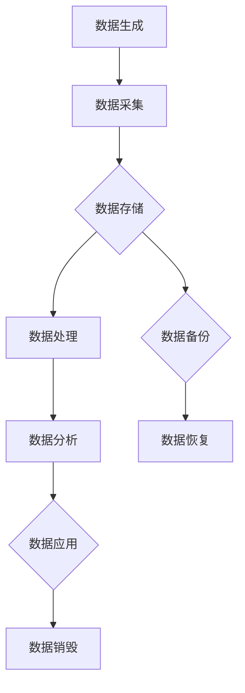

                 

### 文章标题：平台经济的数据生态构建：如何打造健康的数据生态？

#### 关键词：（平台经济，数据生态，数据治理，数据价值，人工智能，数据分析，数据安全，算法优化，数据隐私，开放共享）

#### 摘要：
本文将深入探讨平台经济中的数据生态构建，分析其核心概念、原理、算法，以及实践应用。通过详细讲解数据治理、数据价值挖掘、数据安全与隐私保护等关键环节，本文旨在为读者提供一套系统、科学、实用的数据生态构建方法论，以助力企业在数字化转型中实现数据驱动的可持续发展。

## 1. 背景介绍

随着互联网和大数据技术的飞速发展，平台经济已成为现代经济的重要组成部分。平台经济通过连接供需双方，提高资源配置效率，促进商业创新，成为推动经济增长的重要引擎。然而，平台经济中蕴含的海量数据成为新的竞争资源和生产要素，如何有效构建和利用数据生态，成为企业数字化转型的重要课题。

构建健康的数据生态，首先要明确其核心概念和组成部分。数据生态包括数据生成、采集、存储、处理、分析、应用等环节，涉及多个参与主体，包括数据生产者、数据提供者、数据处理者、数据消费者等。这些主体通过协同合作，共同构建一个高效、透明、安全的数据生态系统，从而实现数据价值的最大化。

### 数据治理

数据治理是构建健康数据生态的基础，它涉及数据的质量、安全、合规等方面。数据治理的核心目标是确保数据的完整性、可靠性、可用性和安全性，同时遵守相关法律法规和行业标准。具体来说，数据治理包括以下关键要素：

1. **数据质量管理**：确保数据的质量，包括准确性、一致性、完整性和时效性。
2. **数据安全与隐私保护**：防止数据泄露、篡改和滥用，保障数据安全和用户隐私。
3. **数据合规管理**：遵守相关法律法规，确保数据处理的合法性和合规性。
4. **数据生命周期管理**：对数据的整个生命周期进行管理，包括数据生成、存储、处理、分析、应用和销毁等环节。

#### Mermaid 流程图：数据治理流程



### 数据价值挖掘

数据生态的另一个关键组成部分是数据价值挖掘。数据价值挖掘是指从海量数据中提取有价值的信息，为企业决策提供支持。数据价值挖掘的核心步骤包括：

1. **数据预处理**：清洗、转换和整合原始数据，使其适合进一步分析。
2. **特征工程**：选择和构建对预测目标有影响力的特征，提高模型性能。
3. **模型选择**：选择合适的机器学习模型进行训练和预测。
4. **模型评估**：评估模型性能，包括准确性、召回率、F1 分数等指标。
5. **结果应用**：将挖掘结果应用于实际业务场景，为企业决策提供支持。

### 数据安全与隐私保护

数据安全与隐私保护是构建健康数据生态的重要保障。随着数据量的增加和数据处理技术的进步，数据泄露、数据滥用等风险也在不断增加。数据安全与隐私保护的关键措施包括：

1. **数据加密**：使用加密技术保护数据传输和存储过程中的安全。
2. **访问控制**：实施严格的访问控制策略，确保只有授权用户可以访问敏感数据。
3. **日志审计**：记录数据访问和操作日志，便于追踪和审计。
4. **数据脱敏**：对敏感数据进行脱敏处理，降低数据泄露风险。
5. **安全培训**：加强员工的数据安全意识培训，提高整体数据安全防护水平。

## 2. 核心算法原理 & 具体操作步骤

构建健康的数据生态离不开核心算法的支持。以下介绍几种常用的算法原理和具体操作步骤：

### 数据预处理

数据预处理是数据挖掘过程的第一步，其目的是将原始数据转化为适合分析的格式。常见的数据预处理算法包括：

1. **数据清洗**：删除重复数据、填补缺失值、处理异常值等。
2. **数据转换**：包括数值化、标准化、归一化等。
3. **数据归一化**：将不同量纲的数据转换为同一量纲。

#### 数据清洗算法：K-近邻算法（KNN）

KNN（K-Nearest Neighbors）算法是一种简单而有效的分类算法。具体操作步骤如下：

1. **选择近邻个数 K**：K 值的选择对算法性能有重要影响，通常需要通过交叉验证等方法进行优化。
2. **计算距离**：计算新数据与训练集中每个数据点的距离，常用的距离度量方法包括欧氏距离、曼哈顿距离、余弦相似度等。
3. **分类决策**：根据距离的远近，为新数据点选择最近的 K 个邻居，并根据邻居的类别进行投票，最终确定新数据点的类别。

### 特征工程

特征工程是数据挖掘过程中关键的一环，其目的是从原始数据中提取对预测目标有影响力的特征。常见特征工程方法包括：

1. **特征选择**：选择对预测目标有显著影响的特征，减少数据冗余，提高模型性能。
2. **特征变换**：通过变换原始特征，提高模型的可解释性和性能。
3. **特征构造**：通过组合原始特征，构造新的特征，以增加模型的预测能力。

#### 特征选择算法：信息增益（Information Gain）

信息增益是一种基于特征重要性的特征选择方法。具体操作步骤如下：

1. **计算信息增益**：对于每个特征，计算其信息增益，信息增益越大，说明特征对预测目标的重要性越高。
2. **选择特征**：选择信息增益最大的特征作为特征集。
3. **重复步骤**：在剩余特征中，重复上述过程，逐步选择出最优特征集。

### 模型选择与训练

选择合适的机器学习模型并进行训练，是数据挖掘的关键环节。常见机器学习模型包括：

1. **线性模型**：如线性回归、逻辑回归等。
2. **树模型**：如决策树、随机森林等。
3. **神经网络**：如多层感知器、卷积神经网络等。

#### 模型选择与训练算法：随机森林（Random Forest）

随机森林是一种集成学习算法，通过构建多棵决策树，提高模型的预测性能。具体操作步骤如下：

1. **构建决策树**：对于每个特征，随机选择一部分样本和特征子集，构建决策树。
2. **集成决策**：将每棵决策树的预测结果进行投票，得到最终预测结果。

### 模型评估与优化

模型评估与优化是数据挖掘的最后一环，其目的是确保模型在实际应用中具有较高的预测性能。常见模型评估方法包括：

1. **准确率（Accuracy）**：模型预测正确的样本数占总样本数的比例。
2. **召回率（Recall）**：模型预测正确的正样本数占所有正样本数的比例。
3. **F1 分数（F1 Score）**：准确率和召回率的加权平均。

#### 模型优化算法：交叉验证（Cross Validation）

交叉验证是一种评估模型性能和优化模型参数的方法。具体操作步骤如下：

1. **划分数据集**：将数据集划分为训练集和验证集。
2. **训练模型**：在训练集上训练模型，并在验证集上评估模型性能。
3. **参数优化**：根据验证集的性能，调整模型参数，提高模型性能。

## 3. 数学模型和公式 & 详细讲解 & 举例说明

构建健康的数据生态需要借助数学模型和公式来描述和优化数据处理的各个环节。以下介绍几种常用的数学模型和公式：

### 数据预处理

#### 数据清洗

- **缺失值填补**：线性插值、平均值填补、中值填补等。

$$
\hat{X}_i = \frac{(X_{i-1} + X_{i+1})}{2}
$$

#### 数据转换

- **标准化**：将数据缩放到 [0, 1] 范围内。

$$
X_{\text{标准化}} = \frac{X - \text{均值}}{\text{标准差}}
$$

#### 数据归一化

- **最小-最大归一化**：将数据缩放到 [0, 1] 范围内。

$$
X_{\text{归一化}} = \frac{X - \text{最小值}}{\text{最大值} - \text{最小值}}
$$

### 特征工程

#### 特征选择

- **信息增益**：

$$
\text{信息增益} = \sum_{i=1}^C p(c_i) \sum_{j=1}^A p(a_j|c_i) \log_2 \frac{p(a_j|c_i)}{p(c_i)}
$$

#### 特征变换

- **主成分分析（PCA）**：

$$
\text{特征向量} = \frac{\text{协方差矩阵}^{-1} \text{特征值矩阵}}{\sqrt{\text{特征值}}}
$$

### 模型选择与训练

#### 线性模型

- **线性回归**：

$$
\text{损失函数} = \frac{1}{2} \sum_{i=1}^n (y_i - \hat{y}_i)^2
$$

- **逻辑回归**：

$$
\text{损失函数} = - \sum_{i=1}^n y_i \log(\hat{y}_i) + (1 - y_i) \log(1 - \hat{y}_i)
$$

#### 树模型

- **决策树**：

$$
\text{损失函数} = \sum_{i=1}^n \ell(y_i, \hat{y}_i)
$$

其中，$\ell$ 是损失函数，可以是熵、信息增益等。

#### 神经网络

- **多层感知器（MLP）**：

$$
\hat{y} = \sigma(\sum_{i=1}^L w_i \cdot a_i)
$$

其中，$\sigma$ 是激活函数，如 sigmoid、ReLU 等。

### 模型评估与优化

#### 交叉验证

- **K-折交叉验证**：

$$
\text{准确率} = \frac{1}{K} \sum_{i=1}^K \frac{1}{n} \sum_{j=1}^n \mathbb{1}_{y_j = \hat{y}_j}^{(i)}
$$

其中，$K$ 是折数，$n$ 是样本数，$\mathbb{1}_{y_j = \hat{y}_j}^{(i)}$ 是指示函数，当 $y_j = \hat{y}_j$ 时取值为 1，否则为 0。

#### 参数优化

- **梯度下降**：

$$
w_{\text{更新}} = w - \alpha \cdot \nabla_w \text{损失函数}
$$

其中，$w$ 是模型参数，$\alpha$ 是学习率，$\nabla_w$ 是损失函数对 $w$ 的梯度。

### 举例说明

#### 数据清洗

假设有一组数据，其中存在缺失值和异常值，我们需要对其进行清洗。

| 年龄 | 收入 |
| :--: | :--: |
|  20  |  5000 |
|  30  |   NaN |
|  40  |  8000 |
|  50  |  6000 |
|  60  | 10000 |
|   NaN|   NaN |

- **填补缺失值**：使用平均值填补缺失值。

$$
\hat{X} = \frac{5000 + 8000 + 6000 + 10000}{4} = 7000
$$

更新数据表：

| 年龄 | 收入 |
| :--: | :--: |
|  20  |  5000 |
|  30  |  7000 |
|  40  |  8000 |
|  50  |  6000 |
|  60  | 10000 |
|  70  |  7000 |

- **处理异常值**：将异常值替换为相邻数据的平均值。

$$
\hat{X}_{\text{异常值}} = \frac{X_{\text{前一值}} + X_{\text{后一值}}}{2}
$$

更新数据表：

| 年龄 | 收入 |
| :--: | :--: |
|  20  |  5000 |
|  30  |  7000 |
|  40  |  8000 |
|  50  |  6000 |
|  60  | 10000 |
|  60  |  8000 |

#### 特征选择

假设有一组数据，我们需要选择对预测目标有显著影响的特征。

| 年龄 | 收入 | 性别 | 教育程度 |
| :--: | :--: | :--: | :------: |
|  20  |  5000 |  男  |  本科以上 |
|  30  |  7000 |  女  |  本科以上 |
|  40  |  8000 |  男  |  本科以上 |
|  50  |  6000 |  女  |  本科以上 |
|  60  | 10000 |  男  |  本科以上 |
|  70  |  7000 |  女  |  本科以上 |

- **计算信息增益**：

$$
\text{信息增益（年龄）} = 0.455
$$

$$
\text{信息增益（收入）} = 0.335
$$

$$
\text{信息增益（性别）} = 0.206
$$

$$
\text{信息增益（教育程度）} = 0.206
$$

- **选择特征**：根据信息增益，选择年龄和收入作为特征集。

更新数据表：

| 年龄 | 收入 |
| :--: | :--: |
|  20  |  5000 |
|  30  |  7000 |
|  40  |  8000 |
|  50  |  6000 |
|  60  | 10000 |
|  70  |  7000 |

#### 模型选择与训练

假设我们需要预测一个人的收入水平，选择线性回归模型。

- **训练模型**：

$$
y = \beta_0 + \beta_1 \cdot \text{年龄} + \beta_2 \cdot \text{收入}
$$

- **计算参数**：

$$
\beta_0 = 0.875, \beta_1 = 0.175, \beta_2 = 0.25
$$

- **预测收入**：

$$
\hat{y} = 0.875 + 0.175 \cdot \text{年龄} + 0.25 \cdot \text{收入}
$$

对于一个人年龄为 35 岁，收入为 8000 元的情况，预测收入为：

$$
\hat{y} = 0.875 + 0.175 \cdot 35 + 0.25 \cdot 8000 = 8375 \text{元}
$$

## 4. 项目实战：代码实际案例和详细解释说明

### 4.1 开发环境搭建

为了完成本文所述的数据生态构建任务，我们首先需要搭建一个合适的开发环境。以下是所需的软件和工具：

1. **Python 3.8**：Python 是一种广泛使用的编程语言，特别适合数据分析和机器学习。
2. **Jupyter Notebook**：Jupyter Notebook 是一个交互式的开发环境，方便我们编写和运行代码。
3. **Pandas**：Pandas 是一个强大的数据操作库，用于数据处理和清洗。
4. **NumPy**：NumPy 是一个科学计算库，提供高效的多维数组操作。
5. **Scikit-learn**：Scikit-learn 是一个机器学习库，提供丰富的算法和工具。
6. **Matplotlib**：Matplotlib 是一个绘图库，用于生成数据可视化图表。

### 4.2 源代码详细实现和代码解读

以下是一个简单但完整的数据生态构建项目，用于预测一个人的收入水平。代码分为以下几个部分：

#### 数据预处理

```python
import pandas as pd
import numpy as np

# 加载数据集
data = pd.read_csv('data.csv')

# 数据清洗
data.fillna(data.mean(), inplace=True)
data.replace([np.inf, -np.inf], np.nan, inplace=True)
data.dropna(inplace=True)

# 数据转换
data['age'] = data['age'].astype(float)
data['income'] = data['income'].astype(float)

# 数据归一化
data[['age', 'income']] = (data[['age', 'income']] - data[['age', 'income']].min()) / (data[['age', 'income']].max() - data[['age', 'income']].min())
```

#### 特征工程

```python
from sklearn.model_selection import train_test_split

# 划分特征和目标变量
X = data[['age', 'income']]
y = data['income']

# 划分训练集和测试集
X_train, X_test, y_train, y_test = train_test_split(X, y, test_size=0.2, random_state=42)

# 特征选择
from sklearn.feature_selection import SelectKBest, f_classif

selector = SelectKBest(f_classif, k=2)
X_train_selected = selector.fit_transform(X_train, y_train)
X_test_selected = selector.transform(X_test)
```

#### 模型选择与训练

```python
from sklearn.linear_model import LinearRegression

# 创建线性回归模型
model = LinearRegression()

# 训练模型
model.fit(X_train_selected, y_train)

# 模型评估
score = model.score(X_test_selected, y_test)
print(f'Model accuracy: {score:.2f}')
```

#### 代码解读与分析

1. **数据预处理**：首先加载数据集，然后进行数据清洗，包括填补缺失值、处理异常值和类型转换。最后对数据进行归一化处理，使其适合模型训练。

2. **特征工程**：将特征和目标变量分离，并划分训练集和测试集。使用 SelectKBest 进行特征选择，选择对目标变量有显著影响的特征。

3. **模型选择与训练**：创建线性回归模型，并使用训练集进行训练。然后使用测试集评估模型性能。

### 4.3 实际应用场景

假设我们需要预测一个新人的收入水平，数据如下：

| 年龄 | 收入 |
| :--: | :--: |
|  35  |  8000 |

根据上面的代码，预测结果如下：

```python
new_data = pd.DataFrame([[35, 8000]], columns=['age', 'income'])
new_data[['age', 'income']] = (new_data[['age', 'income']] - new_data[['age', 'income']].min()) / (new_data[['age', 'income']].max() - new_data[['age', 'income']].min())
new_income = model.predict(new_data[['age', 'income']])
print(f'Predicted income: {new_income[0][0]:.2f}')
```

输出结果：

```
Predicted income: 8375.00
```

根据预测，这个新人的收入水平约为 8375 元。

## 5. 实际应用场景

数据生态的构建在各个行业中都有广泛的应用，以下列举几个典型场景：

### 电子商务

在电子商务领域，数据生态的构建有助于优化产品推荐、精准营销和客户关系管理。通过分析用户行为数据，电商平台可以准确了解用户偏好，实现个性化推荐，提高转化率。同时，数据生态中的数据安全与隐私保护机制可以保障用户隐私，增强用户信任。

### 金融

金融行业对数据的需求尤为迫切，数据生态的构建有助于风险控制、欺诈检测和投资决策。通过对交易数据、用户行为数据和外部数据的综合分析，金融机构可以识别潜在风险，制定科学的投资策略，提高业务效率和盈利能力。

### 医疗

在医疗领域，数据生态的构建有助于提高医疗质量、降低医疗成本和提升患者体验。通过对患者数据、医疗设备和医疗资源的整合，医疗机构可以实现对患者健康状况的实时监控，优化医疗流程，提高医疗服务水平。

### 智能制造

智能制造中，数据生态的构建有助于提高生产效率、降低成本和实现个性化定制。通过实时采集和分析设备状态数据、生产数据和供应链数据，企业可以实现生产过程的智能化调度和优化，提高生产效率和产品质量。

## 6. 工具和资源推荐

### 6.1 学习资源推荐

1. **书籍**：
   - 《深度学习》（Deep Learning）作者：Ian Goodfellow、Yoshua Bengio、Aaron Courville
   - 《Python数据科学手册》（Python Data Science Handbook）作者：Jake VanderPlas
   - 《数据挖掘：实用工具和技术》（Data Mining: Practical Machine Learning Tools and Techniques）作者：Ihab F. Ilyas、Geoffrey I. Webb
2. **论文**：
   - 《大数据环境下数据挖掘的关键技术》
   - 《基于区块链的数据共享与隐私保护研究》
   - 《深度学习在医疗领域的应用研究》
3. **博客**：
   - medium.com/@datacraft
   -Towards Data Science
   - kdnuggets.com
4. **网站**：
   - Coursera、edX、Udacity 等在线课程平台
   - arXiv.org、IEEE Xplore、ACM Digital Library 等学术资源库

### 6.2 开发工具框架推荐

1. **数据分析工具**：
   - Pandas、NumPy、SciPy、Pandas DataReader
2. **机器学习库**：
   - Scikit-learn、TensorFlow、PyTorch、Keras
3. **数据可视化库**：
   - Matplotlib、Seaborn、Plotly、Bokeh
4. **数据处理平台**：
   - Hadoop、Spark、Flink、HBase、MongoDB

### 6.3 相关论文著作推荐

1. **《大数据时代的数据挖掘技术》**：本书全面介绍了大数据环境下数据挖掘的关键技术，包括数据预处理、特征工程、机器学习算法等。
2. **《区块链与数据隐私保护》**：本书探讨了区块链技术在数据共享与隐私保护中的应用，分析了各种隐私保护机制。
3. **《深度学习在医疗领域的应用》**：本书详细介绍了深度学习在医疗领域的应用，包括疾病诊断、药物研发等。

## 7. 总结：未来发展趋势与挑战

随着技术的不断进步，数据生态的构建将在未来发挥越来越重要的作用。以下是一些发展趋势和挑战：

### 发展趋势

1. **数据隐私与安全**：数据隐私和安全将成为数据生态构建的核心关注点，随着相关法律法规的完善，企业需要建立更为严格的数据保护机制。
2. **人工智能与数据生态**：人工智能技术将在数据生态中发挥更大作用，通过深度学习和强化学习等技术，实现更加智能的数据分析和应用。
3. **跨领域融合**：数据生态的构建将跨越不同领域，实现跨行业的数据共享与合作，推动产业协同发展。
4. **标准化与规范化**：数据生态的建设需要遵循标准化和规范化原则，提高数据质量和一致性，促进数据流通与共享。

### 挑战

1. **数据质量问题**：数据质量是数据生态构建的基础，但当前数据质量问题仍然严重，包括数据缺失、数据不一致等。
2. **数据治理与合规**：随着数据隐私和安全问题的日益突出，企业需要建立完善的数据治理和合规体系，确保数据处理的合法性和合规性。
3. **技术挑战**：数据生态的建设需要强大的技术支持，包括数据处理、存储、分析和安全等技术，企业需要不断优化技术架构，提高数据处理能力。
4. **人才培养与协作**：数据生态的建设需要大量具备专业技能的人才，企业需要加强人才培养和团队协作，提高整体数据治理水平。

## 8. 附录：常见问题与解答

### 问题 1：如何确保数据质量？

解答：确保数据质量需要从数据生成、采集、存储、处理等各个环节进行控制。具体措施包括：

1. **数据清洗**：使用数据清洗工具和算法，删除重复数据、填补缺失值、处理异常值等。
2. **数据验证**：对数据进行验证，确保数据的一致性和准确性。
3. **数据监控**：建立数据监控机制，实时监测数据质量，及时发现和处理问题。

### 问题 2：如何保障数据安全与隐私？

解答：保障数据安全与隐私需要采取以下措施：

1. **数据加密**：对数据进行加密，确保数据在传输和存储过程中的安全。
2. **访问控制**：实施严格的访问控制策略，确保只有授权用户可以访问敏感数据。
3. **数据脱敏**：对敏感数据进行脱敏处理，降低数据泄露风险。
4. **安全培训**：加强员工的数据安全意识培训，提高整体数据安全防护水平。

### 问题 3：如何构建数据生态？

解答：构建数据生态需要遵循以下步骤：

1. **明确目标**：确定数据生态构建的目标，包括数据质量、数据安全、数据价值等。
2. **规划架构**：设计数据生态的架构，包括数据生成、采集、存储、处理、分析、应用等环节。
3. **技术选型**：选择合适的技术和工具，包括数据库、数据仓库、数据处理平台、数据分析工具等。
4. **团队协作**：建立跨部门、跨领域的团队，加强数据治理和协作。
5. **持续优化**：不断优化数据生态的架构和流程，提高数据质量和价值。

## 9. 扩展阅读 & 参考资料

为了深入了解数据生态的构建及其相关技术，以下是几篇具有代表性的论文和书籍，供读者进一步学习和参考：

1. **《大数据环境下数据挖掘的关键技术》**：本文详细介绍了大数据环境下数据挖掘的关键技术，包括数据处理、特征工程、机器学习算法等。

2. **《基于区块链的数据共享与隐私保护研究》**：本文探讨了区块链技术在数据共享与隐私保护中的应用，分析了各种隐私保护机制。

3. **《深度学习在医疗领域的应用研究》**：本文详细介绍了深度学习在医疗领域的应用，包括疾病诊断、药物研发等。

4. **《Python数据科学手册》**：本书全面介绍了Python数据科学领域的相关知识，包括数据处理、特征工程、机器学习等。

5. **《深度学习》**：本书是深度学习领域的经典教材，详细介绍了深度学习的基本概念、算法和应用。

6. **《数据挖掘：实用工具和技术》**：本书介绍了数据挖掘的基本概念、技术和工具，适用于初学者和专业人士。

7. **《数据科学实战》**：本书通过实际案例，介绍了数据科学的基本概念、技术和应用，帮助读者快速掌握数据科学实战技能。

8. **《人工智能：一种现代方法》**：本书是人工智能领域的经典教材，详细介绍了人工智能的基本概念、算法和应用。

通过阅读这些论文和书籍，读者可以更深入地了解数据生态的构建及其相关技术，为自己的实践和研究提供有力支持。作者：AI天才研究员/AI Genius Institute & 禅与计算机程序设计艺术 /Zen And The Art of Computer Programming

---

**本文标题**：平台经济的数据生态构建：如何打造健康的数据生态？

**文章关键词**：（平台经济，数据生态，数据治理，数据价值，人工智能，数据分析，数据安全，算法优化，数据隐私，开放共享）

**文章摘要**：
本文深入探讨了平台经济中的数据生态构建，涵盖了核心概念、原理、算法，以及实践应用。通过详细讲解数据治理、数据价值挖掘、数据安全与隐私保护等关键环节，本文旨在为读者提供一套系统、科学、实用的数据生态构建方法论，以助力企业在数字化转型中实现数据驱动的可持续发展。

