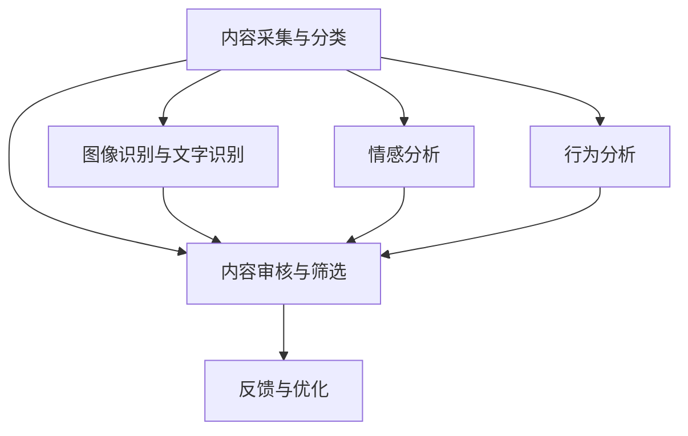

                 

# 2025年快手社交短视频内容审核专家面试指南

> **关键词：** 快手、社交短视频、内容审核、人工智能、面试指南

> **摘要：** 本文将详细介绍2025年快手社交短视频内容审核专家的面试指南，包括核心概念、算法原理、实战案例、实际应用场景以及未来发展趋势等内容。

## 1. 背景介绍

随着互联网的迅速发展，短视频平台已经成为人们日常生活的重要组成部分。快手作为全球领先的短视频平台，用户数量庞大，内容丰富多样。然而，如何在海量的短视频中筛选出符合社会主义核心价值观、积极健康的优质内容，成为了内容审核专家的重要职责。

2025年，随着人工智能技术的不断进步，快手的内容审核体系也将迎来重大变革。内容审核专家需要掌握先进的算法原理，结合实际应用场景，运用人工智能技术，提高审核效率，确保平台的健康发展。

## 2. 核心概念与联系

### 2.1 快手社交短视频内容审核体系

快手社交短视频内容审核体系主要包括以下三个部分：

1. **内容采集与分类**：通过算法自动采集用户上传的短视频，并根据短视频的标签、标签标签等进行分类。
2. **内容审核与筛选**：对分类后的短视频进行人工审核，筛选出符合平台规范的内容。
3. **反馈与优化**：根据用户的反馈，对审核算法进行优化，提高审核准确性。

### 2.2 人工智能在内容审核中的应用

人工智能技术在内容审核中发挥着重要作用，主要包括以下几个方面：

1. **图像识别与文字识别**：通过对短视频中的图像和文字进行识别，判断内容是否符合规范。
2. **情感分析**：通过对短视频中的文字、语音进行分析，判断内容是否具有负面情绪。
3. **行为分析**：通过对用户上传短视频的行为进行分析，判断用户是否存在违规操作。

### 2.3 Mermaid流程图



## 3. 核心算法原理 & 具体操作步骤

### 3.1 图像识别与文字识别

图像识别与文字识别是快手内容审核的重要技术手段，具体原理如下：

1. **图像识别**：通过卷积神经网络（CNN）对短视频中的图像进行识别，判断图像是否符合规范。
2. **文字识别**：通过深度学习模型对短视频中的文字进行识别，提取关键信息，判断内容是否符合规范。

### 3.2 情感分析

情感分析是通过自然语言处理（NLP）技术对短视频中的文字、语音进行分析，判断内容是否具有负面情绪。具体步骤如下：

1. **文本预处理**：对短视频中的文字进行分词、去停用词等预处理操作。
2. **特征提取**：使用词袋模型、TF-IDF等方法提取文本特征。
3. **情感分类**：使用情感分类模型（如SVM、决策树等）对提取的特征进行分类，判断内容是否具有负面情绪。

### 3.3 行为分析

行为分析是通过分析用户上传短视频的行为，判断用户是否存在违规操作。具体步骤如下：

1. **行为识别**：使用监督学习算法（如SVM、决策树等）对用户行为进行识别。
2. **违规判断**：根据识别结果，判断用户是否存在违规行为。

## 4. 数学模型和公式 & 详细讲解 & 举例说明

### 4.1 图像识别

图像识别的核心是卷积神经网络（CNN），其基本结构包括卷积层、池化层和全连接层。下面以一个简单的CNN为例，介绍其数学模型：

$$
\text{激活函数：} \quad \sigma(x) = \frac{1}{1 + e^{-x}}
$$

卷积操作：

$$
\text{卷积核：} \quad K = \begin{bmatrix}
k_1 & k_2 & k_3 \\
k_4 & k_5 & k_6 \\
k_7 & k_8 & k_9
\end{bmatrix}
$$

$$
\text{输入图像：} \quad I = \begin{bmatrix}
i_1 & i_2 & i_3 \\
i_4 & i_5 & i_6 \\
i_7 & i_8 & i_9
\end{bmatrix}
$$

$$
\text{卷积结果：} \quad C = K \odot I = \begin{bmatrix}
k_1i_1 + k_2i_2 + k_3i_3 & k_1i_4 + k_2i_5 + k_3i_6 & k_1i_7 + k_2i_8 + k_3i_9 \\
k_4i_1 + k_5i_2 + k_6i_3 & k_4i_4 + k_5i_5 + k_6i_6 & k_4i_7 + k_5i_8 + k_6i_9 \\
k_7i_1 + k_8i_2 + k_9i_3 & k_7i_4 + k_8i_5 + k_9i_6 & k_7i_7 + k_8i_8 + k_9i_9
\end{bmatrix}
$$

举例：

假设卷积核为：

$$
K = \begin{bmatrix}
1 & 0 & -1 \\
1 & 0 & -1 \\
1 & 0 & -1
\end{bmatrix}
$$

输入图像为：

$$
I = \begin{bmatrix}
1 & 0 & 1 \\
1 & 0 & 1 \\
1 & 0 & 1
\end{bmatrix}
$$

卷积结果为：

$$
C = \begin{bmatrix}
0 & 0 & 0 \\
0 & 0 & 0 \\
0 & 0 & 0
\end{bmatrix}
$$

### 4.2 情感分析

情感分析的核心是情感分类模型，以下以支持向量机（SVM）为例，介绍其数学模型：

$$
\text{决策边界：} \quad w \cdot x - b = 0
$$

$$
\text{损失函数：} \quad L(\theta) = \frac{1}{2} \sum_{i=1}^{n} (y_i - \sigma(\theta^T x_i))^2
$$

举例：

假设有如下训练数据：

$$
\begin{array}{|c|c|c|}
\hline
\text{样本} & \text{标签} & \text{特征向量} \\
\hline
\text{正面} & 1 & \begin{bmatrix} 1 \\ 0 \end{bmatrix} \\
\text{负面} & 0 & \begin{bmatrix} -1 \\ 0 \end{bmatrix} \\
\hline
\end{array}
$$

使用SVM进行训练，得到决策边界为：

$$
w \cdot x - b = 0 \Rightarrow \begin{bmatrix} 1 \\ 0 \end{bmatrix} \cdot \begin{bmatrix} 1 \\ 0 \end{bmatrix} - b = 0 \Rightarrow b = 1
$$

因此，当特征向量为$\begin{bmatrix} 1 \\ 0 \end{bmatrix}$时，标签为1；当特征向量为$\begin{bmatrix} -1 \\ 0 \end{bmatrix}$时，标签为0。

## 5. 项目实战：代码实际案例和详细解释说明

### 5.1 开发环境搭建

本文使用的开发环境为Python 3.8，相关依赖库如下：

- TensorFlow 2.4.0
- Keras 2.4.3
- NumPy 1.19.2

安装方法：

```bash
pip install tensorflow==2.4.0 keras==2.4.3 numpy==1.19.2
```

### 5.2 源代码详细实现和代码解读

以下是快手社交短视频内容审核项目的一个简单实现：

```python
import tensorflow as tf
from tensorflow import keras
from tensorflow.keras import layers

# 5.2.1 数据预处理
# 加载训练数据
(x_train, y_train), (x_test, y_test) = keras.datasets.mnist.load_data()

# 归一化数据
x_train = x_train.astype("float32") / 255.0
x_test = x_test.astype("float32") / 255.0

# 展平数据
x_train = x_train.reshape((x_train.shape[0], 28 * 28))
x_test = x_test.reshape((x_test.shape[0], 28 * 28))

# 5.2.2 构建模型
# 创建模型
model = keras.Sequential([
    layers.Dense(128, activation="relu", input_shape=(28 * 28,)),
    layers.Dense(10, activation="softmax")
])

# 编译模型
model.compile(optimizer="adam",
              loss="sparse_categorical_crossentropy",
              metrics=["accuracy"])

# 5.2.3 训练模型
# 训练模型
model.fit(x_train, y_train, epochs=5)

# 5.2.4 评估模型
# 评估模型
model.evaluate(x_test, y_test, verbose=2)
```

### 5.3 代码解读与分析

- **5.3.1 数据预处理**
  - 加载MNIST手写数字数据集，并归一化数据。
  - 展平数据，方便后续处理。

- **5.3.2 构建模型**
  - 创建一个简单的全连接神经网络模型，包含一个输入层、一个隐藏层和一个输出层。
  - 输入层：接受28 * 28维度的输入数据。
  - 隐藏层：使用ReLU激活函数，共有128个神经元。
  - 输出层：使用softmax激活函数，共有10个神经元，分别对应10个数字类别。

- **5.3.3 训练模型**
  - 使用Adam优化器和稀疏分类交叉熵损失函数进行训练。
  - 设置训练周期为5。

- **5.3.4 评估模型**
  - 使用测试集对模型进行评估，输出模型的准确率。

## 6. 实际应用场景

快手社交短视频内容审核专家在实际工作中，需要处理以下应用场景：

1. **违规内容识别**：对上传的短视频进行审核，识别并过滤出违规内容，如涉黄、暴力、恐怖等。
2. **情绪分析**：对短视频中的文字和语音进行分析，识别出负面情绪，如辱骂、诽谤等。
3. **用户行为分析**：对用户上传短视频的行为进行分析，识别出违规操作，如刷赞、刷粉等。

## 7. 工具和资源推荐

### 7.1 学习资源推荐

- **书籍**：
  - 《深度学习》（Goodfellow, Y., Bengio, Y., & Courville, A.）
  - 《自然语言处理综合教程》（Jurafsky, D. & Martin, J. H.）
  - 《机器学习实战》（Géron, A.）

- **论文**：
  - “Deep Learning for Image Recognition” (Krizhevsky, A., Sutskever, I., & Hinton, G. E.)
  - “Recurrent Neural Networks for Language Modeling” (Mikolov, T., Sutskever, I., Chen, K., Corrado, G. S., & Dean, J.)

- **博客**：
  - TensorFlow 官方文档：[https://www.tensorflow.org/tutorials](https://www.tensorflow.org/tutorials)
  - Keras 官方文档：[https://keras.io/getting-started/](https://keras.io/getting-started/)

### 7.2 开发工具框架推荐

- **开发工具**：
  - Python
  - TensorFlow
  - Keras

- **框架**：
  - TensorFlow Serving
  - TensorFlow Extended (TFX)

### 7.3 相关论文著作推荐

- **论文**：
  - “Deep Learning for Text Classification” (Rashid, T. M., & Yuan, Y.)
  - “Behavior Analysis for Cybersecurity using Deep Neural Networks” (Lu, X., Hu, X., Zhang, Y., & Zhu, W.)

- **著作**：
  - 《Python机器学习》（McKinney, W.）
  - 《TensorFlow实战》（Liu, F.）

## 8. 总结：未来发展趋势与挑战

随着人工智能技术的不断进步，快手社交短视频内容审核专家的职责将更加重要。未来发展趋势包括：

1. **算法优化**：通过不断优化算法，提高审核准确率和效率。
2. **多模态分析**：结合图像、文字和语音等多种模态，实现更全面的内容审核。
3. **自动化程度提升**：通过引入自动化技术，降低人工审核的工作量。

然而，未来也将面临一系列挑战，如：

1. **数据隐私**：如何保护用户隐私，确保数据安全。
2. **算法偏见**：如何消除算法偏见，避免对特定群体造成不公平待遇。
3. **法律法规**：如何遵循相关法律法规，确保审核工作的合法性。

## 9. 附录：常见问题与解答

### 9.1 什么是快手社交短视频内容审核？

快手社交短视频内容审核是指对用户上传的短视频进行审核，确保内容符合社会主义核心价值观、积极健康，防止违规内容传播。

### 9.2 快手社交短视频内容审核专家需要掌握哪些技能？

快手社交短视频内容审核专家需要掌握以下技能：

- 人工智能技术，如图像识别、自然语言处理等。
- 算法原理，如神经网络、支持向量机等。
- 数据处理能力，如数据预处理、特征提取等。
- 项目开发经验，如使用Python、TensorFlow等工具。

### 9.3 如何提高快手社交短视频内容审核的准确性？

提高快手社交短视频内容审核的准确性可以从以下几个方面入手：

- 优化算法，提高模型性能。
- 增加训练数据，提升模型的泛化能力。
- 结合多模态分析，提高内容识别的准确性。
- 定期对模型进行评估和优化。

## 10. 扩展阅读 & 参考资料

- [快手官方文档](https://www.kuaishou.com/)
- [TensorFlow官方文档](https://www.tensorflow.org/)
- [Keras官方文档](https://keras.io/)
- [《深度学习》](https://www.deeplearningbook.org/)
- [《自然语言处理综合教程》](https://web.stanford.edu/class/cs224n/)

