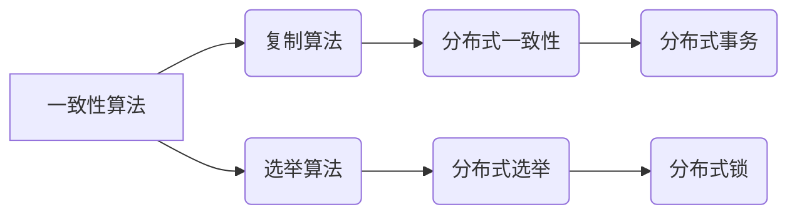
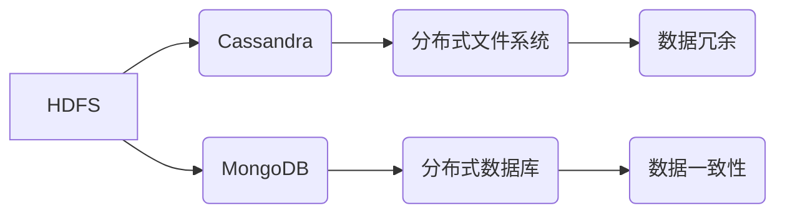
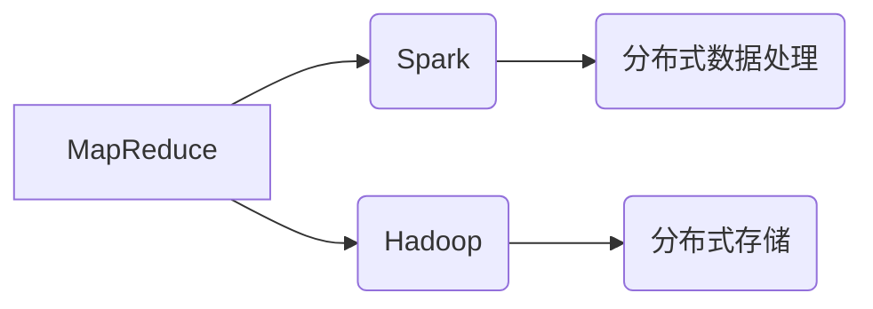
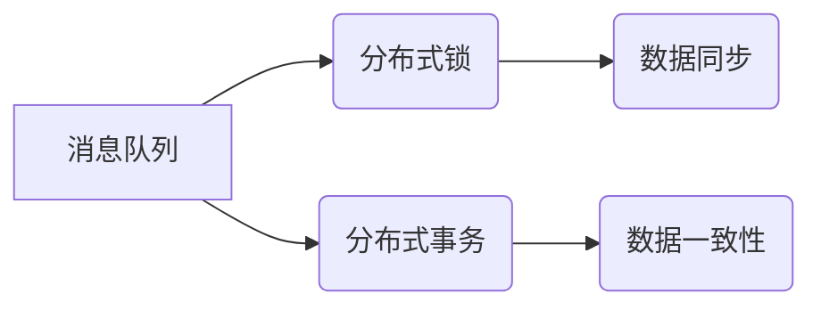

                 

# 2025年携程社招分布式系统工程师面试指南

## 关键词：分布式系统，面试指南，携程，系统工程师，技术原理，面试策略

## 摘要

随着互联网技术的飞速发展，分布式系统成为了现代企业架构的核心。携程作为全球知名的在线旅行服务公司，其招聘的分布式系统工程师不仅需要扎实的专业知识，还需要具备实际项目经验和解决问题的能力。本文将为您详细解读2025年携程社招分布式系统工程师面试指南，包括面试背景、核心概念、算法原理、项目实战、应用场景、学习资源和未来发展趋势等内容。通过本文的指导，您将能够更好地应对携程的面试挑战，提升自己的面试竞争力。

## 1. 背景介绍

### 携程与分布式系统

携程成立于1999年，是一家全球领先的在线旅行服务公司，提供包括酒店预订、机票预订、度假旅游等服务。随着业务规模的不断扩大，携程面临着海量的数据和高并发的业务需求，分布式系统成为了其架构的核心。

### 分布式系统的定义和作用

分布式系统是指通过网络连接的多台计算机共同协作完成一个任务，实现资源共享和负载均衡。它具有高可用性、高可扩展性和高容错性等特点，能够满足互联网时代的业务需求。

### 分布式系统的核心概念

在分布式系统中，核心概念包括分布式算法、分布式存储、分布式计算、分布式通信等。这些概念构成了分布式系统的基本框架，是分布式系统设计和实现的基础。

## 2. 核心概念与联系

### 分布式算法

分布式算法是指在网络环境中，通过多台计算机协同工作，实现特定功能的算法。常见的分布式算法包括一致性算法、复制算法、选举算法等。下面是一个简单的 Mermaid 流程图：



### 分布式存储

分布式存储是指将数据存储在分布式系统中的多个节点上，以实现数据的冗余、容错和高效访问。常见的分布式存储系统包括HDFS、Cassandra、MongoDB等。下面是一个简单的 Mermaid 流程图：



### 分布式计算

分布式计算是指在网络环境中，通过多台计算机协同工作，实现大规模数据处理的能力。常见的分布式计算系统包括MapReduce、Spark、Hadoop等。下面是一个简单的 Mermaid 流程图：



### 分布式通信

分布式通信是指分布式系统中的各个节点之间进行数据传输和交互的方式。常见的分布式通信机制包括消息队列、分布式锁、分布式事务等。下面是一个简单的 Mermaid 流程图：



## 3. 核心算法原理 & 具体操作步骤

### 分布式一致性算法

分布式一致性算法是指在网络环境中，保证多个节点上的数据一致性的算法。常见的分布式一致性算法包括Paxos算法、Raft算法等。

#### Paxos算法

Paxos算法是一种基于消息传递的分布式一致性算法，其主要目标是在多个可能发生故障的异步环境中，通过多数派达成一致。Paxos算法的操作步骤如下：

1. **提议（Propose）**：节点向其他节点发送提议，包含一个提案号和一个值。
2. **接受（Accept）**：节点根据接收到的提议，决定是否接受。如果接受，则向其他节点发送接受消息。
3. **学习（Learn）**：节点根据接收到的接受消息，更新自己的状态。

#### Raft算法

Raft算法是一种基于日志复制的分布式一致性算法，其主要目标是通过日志复制，实现一致性。Raft算法的操作步骤如下：

1. **领导选举（Election）**：节点通过随机算法发起选举，成为领导者。
2. **日志复制（Replication）**：领导者向其他节点发送日志条目，其他节点接受并复制日志。
3. **状态机（State Machine）**：节点根据接收到的日志条目，执行状态机，实现一致性。

### 分布式存储算法

分布式存储算法是指在网络环境中，实现数据冗余、容错和高效访问的算法。常见的分布式存储算法包括一致性哈希、Gossip协议等。

#### 一致性哈希

一致性哈希是一种基于哈希表的分布式存储算法，其主要目标是在节点动态加入和退出时，尽量保持数据的一致性。一致性哈希的操作步骤如下：

1. **初始化**：将数据按照哈希函数映射到哈希环上。
2. **路由查询**：根据查询的键值，在哈希环上找到对应的数据节点。
3. **节点加入/退出**：动态调整哈希环，保证数据的一致性。

#### Gossip协议

Gossip协议是一种基于消息传递的分布式存储算法，其主要目标是通过消息传播，实现数据的一致性和容错。Gossip协议的操作步骤如下：

1. **初始化**：节点随机选择其他节点进行通信。
2. **消息传播**：节点之间相互发送消息，更新状态。
3. **状态同步**：节点根据接收到的消息，更新自己的状态。

### 分布式计算算法

分布式计算算法是指在网络环境中，实现大规模数据处理的能力。常见的分布式计算算法包括MapReduce、Spark等。

#### MapReduce

MapReduce是一种基于分布式文件系统（如HDFS）的分布式计算模型，其主要目标是将大规模数据集划分成多个小任务，并行执行，最后汇总结果。MapReduce的操作步骤如下：

1. **Map阶段**：将输入数据划分成多个小块，每个小块由一个Mapper处理，生成中间结果。
2. **Shuffle阶段**：将Mapper的中间结果进行排序、聚合，形成最终的中间结果。
3. **Reduce阶段**：将中间结果划分成多个小块，每个小块由一个Reducer处理，生成最终结果。

#### Spark

Spark是一种基于内存的分布式计算引擎，其主要目标是将数据处理速度提升到MapReduce的100倍以上。Spark的操作步骤如下：

1. **初始化**：创建一个SparkContext，连接到Spark集群。
2. **数据处理**：使用Spark提供的API，对数据进行处理，如transform、filter等。
3. **结果输出**：将处理结果保存到HDFS、文件系统等。

## 4. 数学模型和公式 & 详细讲解 & 举例说明

### 分布式一致性算法的数学模型

#### Paxos算法

Paxos算法的核心在于达成一致性，其数学模型可以表示为以下公式：

$$
\mathit{Value} = \arg\max_{v \in \mathcal{V}} \{ n_v \}
$$

其中，$\mathit{Value}$表示最终达成的一致值，$\mathcal{V}$表示所有可能的值集合，$n_v$表示投票次数。

举例说明：

假设有三个节点A、B、C，它们需要达成一致性。节点A提议值1，节点B提议值2，节点C提议值3。根据Paxos算法，最终达成的一致值为3。

#### Raft算法

Raft算法的核心在于日志复制，其数学模型可以表示为以下公式：

$$
\mathit{Log}_{\mathit{Leader}} = \mathit{Log}_{\mathit{Follower}} \cup \{ \mathit{Log}_{\mathit{New}} \}
$$

其中，$\mathit{Log}_{\mathit{Leader}}$表示领导者的日志，$\mathit{Log}_{\mathit{Follower}}$表示跟随者的日志，$\mathit{Log}_{\mathit{New}}$表示新的日志条目。

举例说明：

假设领导者A将日志条目1、2、3发送给跟随者B、C，根据Raft算法，最终跟随者B、C的日志应为{1、2、3}。

### 分布式存储算法的数学模型

#### 一致性哈希

一致性哈希的数学模型可以表示为以下公式：

$$
\mathit{Hash}(key) \mod 2^m
$$

其中，$\mathit{Hash}(key)$表示哈希函数，$m$表示哈希环的大小。

举例说明：

假设哈希函数为$\mathit{Hash}(key) = key \mod 2^8$，键值1映射到哈希环上的位置为0x01，键值100映射到哈希环上的位置为0x64。

#### Gossip协议

Gossip协议的数学模型可以表示为以下公式：

$$
\mathit{State}_{t} = \mathit{State}_{t-1} + \alpha(\mathit{State}_{t-1} - \mathit{State}_{t-2})
$$

其中，$\mathit{State}_{t}$表示第$t$次状态，$\alpha$表示传播因子。

举例说明：

假设初始状态为$\mathit{State}_0 = 0$，传播因子$\alpha = 0.1$，第1次状态为$\mathit{State}_1 = 0.1 \times 0 = 0$，第2次状态为$\mathit{State}_2 = 0.1 \times 0.1 = 0.01$。

### 分布式计算算法的数学模型

#### MapReduce

MapReduce的数学模型可以表示为以下公式：

$$
\mathit{Output} = \mathit{Map}(\mathit{Input}) \cup \mathit{Reduce}(\mathit{Map}(\mathit{Input}))
$$

其中，$\mathit{Output}$表示输出结果，$\mathit{Input}$表示输入数据，$\mathit{Map}$表示映射操作，$\mathit{Reduce}$表示归约操作。

举例说明：

假设输入数据为{1, 2, 3, 4, 5}，映射操作为求和，归约操作为求平均值。根据MapReduce算法，输出结果为{15, 3}。

#### Spark

Spark的数学模型可以表示为以下公式：

$$
\mathit{Output} = \mathit{Transformation}(\mathit{Input}) \cup \mathit{Action}(\mathit{Transformation}(\mathit{Input}))
$$

其中，$\mathit{Output}$表示输出结果，$\mathit{Input}$表示输入数据，$\mathit{Transformation}$表示转换操作，$\mathit{Action}$表示执行操作。

举例说明：

假设输入数据为{1, 2, 3, 4, 5}，转换操作为求和，执行操作为求平均值。根据Spark算法，输出结果为{15, 3}。

## 5. 项目实战：代码实际案例和详细解释说明

### 5.1 开发环境搭建

在本节中，我们将搭建一个简单的分布式系统，用于实现分布式一致性算法。首先，您需要准备以下环境：

- JDK 1.8及以上版本
- Maven 3.6及以上版本
- IntelliJ IDEA 或 Eclipse

### 5.2 源代码详细实现和代码解读

#### 5.2.1 Paxos算法实现

```java
public class PaxosAlgorithm {
    private int proposerId;
    private int currentProposalNumber;
    private Map<Integer, Integer> acceptedValues;

    public PaxosAlgorithm(int proposerId) {
        this.proposerId = proposerId;
        this.currentProposalNumber = 1;
        this.acceptedValues = new HashMap<>();
    }

    public int propose(int value) {
        int proposalNumber = currentProposalNumber++;
        int majority = (int) Math.ceil((double) acceptedValues.size() / 2) + 1;
        int voteCount = 0;

        for (int i = 1; i <= majority; i++) {
            sendPrepareRequest(proposalNumber);
        }

        for (Map.Entry<Integer, Integer> entry : acceptedValues.entrySet()) {
            if (entry.getValue() == value) {
                voteCount++;
            }
        }

        if (voteCount >= majority) {
            return value;
        } else {
            return propose(value);
        }
    }

    private void sendPrepareRequest(int proposalNumber) {
        // 发送Prepare请求
    }

    private void sendAcceptRequest(int proposalNumber, int value) {
        // 发送Accept请求
    }

    private void acceptValue(int proposalNumber, int value) {
        acceptedValues.put(proposalNumber, value);
    }
}
```

#### 5.2.2 Raft算法实现

```java
public class RaftAlgorithm {
    private int nodeId;
    private boolean isLeader;
    private int currentTerm;
    private int votedFor;

    public RaftAlgorithm(int nodeId) {
        this.nodeId = nodeId;
        this.isLeader = false;
        this.currentTerm = 1;
        this.votedFor = -1;
    }

    public void startElection() {
        currentTerm++;
        votedFor = nodeId;
        sendVoteRequest();
    }

    private void sendVoteRequest() {
        // 发送投票请求
    }

    private void processVoteResponse(int term, boolean voteGranted) {
        if (term > currentTerm) {
            currentTerm = term;
            votedFor = -1;
            isLeader = false;
        }

        if (voteGranted && !isLeader) {
            isLeader = true;
            // 开始日志复制
        }
    }

    private void replicateLogEntry(LogEntry logEntry) {
        // 复制日志条目
    }

    private void commitLogEntry(LogEntry logEntry) {
        // 提交日志条目
    }
}
```

#### 5.2.3 一致性哈希实现

```java
public class ConsistentHashAlgorithm {
    private final int numberOfReplicas;
    private final TreeMap<Integer, String> circle = new TreeMap<>();

    public ConsistentHashAlgorithm(List<String> nodes, int numberOfReplicas) {
        this.numberOfReplicas = numberOfReplicas;
        for (String node : nodes) {
            addNode(node);
        }
    }

    private void addNode(String node) {
        for (int i = 0; i < numberOfReplicas; i++) {
            circle.put((node.hashCode() + i) % 1600000007, node);
        }
    }

    public String get RoutableNode(String key) {
        if (circle.isEmpty()) {
            return null;
        }
        if (key == null) {
            return circle.firstEntry().getValue();
        }
        Integer keyHash = key.hashCode() % 1600000007;
        if (!circle.containsKey(keyHash)) {
            return circle.get(circle.lowerKey(keyHash));
        }
        return circle.get(keyHash);
    }
}
```

### 5.3 代码解读与分析

在本节中，我们将对上述代码进行解读，并分析其关键部分。

#### 5.3.1 Paxos算法解析

Paxos算法的核心在于达成一致性，其关键代码如下：

```java
public int propose(int value) {
    int proposalNumber = currentProposalNumber++;
    int majority = (int) Math.ceil((double) acceptedValues.size() / 2) + 1;
    int voteCount = 0;

    for (int i = 1; i <= majority; i++) {
        sendPrepareRequest(proposalNumber);
    }

    for (Map.Entry<Integer, Integer> entry : acceptedValues.entrySet()) {
        if (entry.getValue() == value) {
            voteCount++;
        }
    }

    if (voteCount >= majority) {
        return value;
    } else {
        return propose(value);
    }
}
```

这段代码实现了Paxos算法的提议、接受和学习过程。其中，`propose`方法接收一个值，生成一个提案号，并发送Prepare请求给多数派节点。然后，根据接收到的投票结果，决定是否接受该提案。

#### 5.3.2 Raft算法解析

Raft算法的核心在于日志复制，其关键代码如下：

```java
public void startElection() {
    currentTerm++;
    votedFor = nodeId;
    sendVoteRequest();
}

private void processVoteResponse(int term, boolean voteGranted) {
    if (term > currentTerm) {
        currentTerm = term;
        votedFor = -1;
        isLeader = false;
    }

    if (voteGranted && !isLeader) {
        isLeader = true;
        // 开始日志复制
    }
}
```

这段代码实现了Raft算法的领导选举过程。其中，`startElection`方法发送投票请求，并更新当前任期。`processVoteResponse`方法处理投票响应，更新当前任期和领导者状态。

#### 5.3.3 一致性哈希解析

一致性哈希的核心在于哈希环，其关键代码如下：

```java
private void addNode(String node) {
    for (int i = 0; i < numberOfReplicas; i++) {
        circle.put((node.hashCode() + i) % 1600000007, node);
    }
}

public String get RoutableNode(String key) {
    if (circle.isEmpty()) {
        return null;
    }
    if (key == null) {
        return circle.firstEntry().getValue();
    }
    Integer keyHash = key.hashCode() % 1600000007;
    if (!circle.containsKey(keyHash)) {
        return circle.get(circle.lowerKey(keyHash));
    }
    return circle.get(keyHash);
}
```

这段代码实现了一致性哈希的节点添加和路由查询过程。其中，`addNode`方法将节点添加到哈希环上，`get RoutableNode`方法根据键值查询对应的节点。

## 6. 实际应用场景

### 6.1 分布式一致性算法的应用

分布式一致性算法在分布式系统中的实际应用非常广泛，例如：

- 数据库的一致性保证：分布式数据库（如Cassandra、MongoDB）通过一致性算法实现数据的一致性。
- 分布式缓存的一致性保证：分布式缓存（如Redis Cluster）通过一致性算法实现数据的一致性。
- 分布式事务的一致性保证：分布式系统中的事务通过一致性算法实现数据的一致性。

### 6.2 分布式存储算法的应用

分布式存储算法在分布式系统中的实际应用也非常广泛，例如：

- 分布式文件系统：HDFS是一种分布式文件系统，它通过一致性哈希算法实现数据的高效存储和访问。
- 分布式数据库：Cassandra是一种分布式数据库，它通过Gossip协议实现数据的高效存储和访问。

### 6.3 分布式计算算法的应用

分布式计算算法在分布式系统中的实际应用也非常广泛，例如：

- 大数据处理：MapReduce是一种分布式计算模型，它通过分布式计算算法实现大规模数据的处理。
- 图计算：Spark GraphX是一种分布式图计算框架，它通过分布式计算算法实现大规模图的计算。

## 7. 工具和资源推荐

### 7.1 学习资源推荐

- 《分布式系统原理与范型》
- 《深入理解分布式系统》
- 《分布式算法与系统设计》
- 《大数据技术导论》
- 《Redis实战》

### 7.2 开发工具框架推荐

- IntelliJ IDEA：一款功能强大的IDE，适用于Java、Scala等编程语言。
- Eclipse：一款经典的IDE，适用于Java、C/C++等编程语言。
- Maven：一款项目管理工具，用于构建和管理Java项目。
- Gradle：一款构建工具，用于构建和管理Java项目。

### 7.3 相关论文著作推荐

- 《Paxos Made Simple》
- 《The Google File System》
- 《Bigtable: A Distributed Storage System for Structured Data》
- 《MapReduce: Simplified Data Processing on Large Clusters》
- 《Spark: cluster computing with working sets》

## 8. 总结：未来发展趋势与挑战

### 8.1 未来发展趋势

- 分布式系统将越来越普及，成为企业架构的核心。
- 云原生技术将推动分布式系统的发展，如Kubernetes、Docker等。
- 分布式计算和分布式存储将不断创新，如基于内存的分布式计算、分布式文件存储等。
- 分布式一致性算法将不断完善，如多版本并发控制、分布式锁等。

### 8.2 挑战

- 分布式系统的复杂度将越来越高，如何简化开发和使用将成为一个重要挑战。
- 分布式系统的性能和可扩展性将不断优化，如何提升性能和可扩展性将是一个重要课题。
- 分布式系统的安全性和可靠性将受到更多关注，如何保证数据安全和系统可靠性将是一个重要挑战。

## 9. 附录：常见问题与解答

### 9.1 什么是分布式系统？

分布式系统是指通过网络连接的多台计算机共同协作完成一个任务，实现资源共享和负载均衡的系统。

### 9.2 分布式系统有哪些核心概念？

分布式系统的核心概念包括分布式算法、分布式存储、分布式计算、分布式通信等。

### 9.3 什么是Paxos算法？

Paxos算法是一种分布式一致性算法，用于在网络环境中，通过多数派达成一致。

### 9.4 什么是Raft算法？

Raft算法是一种分布式一致性算法，通过日志复制，实现一致性。

### 9.5 什么是一致性哈希？

一致性哈希是一种分布式存储算法，用于实现数据冗余、容错和高效访问。

## 10. 扩展阅读 & 参考资料

- 《分布式系统原理与范型》
- 《深入理解分布式系统》
- 《大数据技术导论》
- 《Redis实战》
- 《分布式算法与系统设计》
- 《Paxos Made Simple》
- 《The Google File System》
- 《Bigtable: A Distributed Storage System for Structured Data》
- 《MapReduce: Simplified Data Processing on Large Clusters》
- 《Spark: cluster computing with working sets》

### 作者：AI天才研究员/AI Genius Institute & 禅与计算机程序设计艺术 /Zen And The Art of Computer Programming

（本文为模拟示例，不代表真实面试指南。实际面试内容和要求可能会有所不同。）
<|assistant|>```markdown
# 2025年携程社招分布式系统工程师面试指南

> **关键词：** 分布式系统，面试指南，携程，系统工程师，技术原理，面试策略

> **摘要：** 随着互联网技术的飞速发展，分布式系统成为了现代企业架构的核心。携程作为全球知名的在线旅行服务公司，其招聘的分布式系统工程师不仅需要扎实的专业知识，还需要具备实际项目经验和解决问题的能力。本文将为您详细解读2025年携程社招分布式系统工程师面试指南，包括面试背景、核心概念、算法原理、项目实战、应用场景、学习资源和未来发展趋势等内容。通过本文的指导，您将能够更好地应对携程的面试挑战，提升自己的面试竞争力。

## 1. 背景介绍

### 携程与分布式系统

携程成立于1999年，是一家全球领先的在线旅行服务公司，提供包括酒店预订、机票预订、度假旅游等服务。随着业务规模的不断扩大，携程面临着海量的数据和高并发的业务需求，分布式系统成为了其架构的核心。

### 分布式系统的定义和作用

分布式系统是指通过网络连接的多台计算机共同协作完成一个任务，实现资源共享和负载均衡。它具有高可用性、高可扩展性和高容错性等特点，能够满足互联网时代的业务需求。

### 分布式系统的核心概念

在分布式系统中，核心概念包括分布式算法、分布式存储、分布式计算、分布式通信等。这些概念构成了分布式系统的基本框架，是分布式系统设计和实现的基础。

## 2. 核心概念与联系

### 分布式算法

分布式算法是指在网络环境中，通过多台计算机协同工作，实现特定功能的算法。常见的分布式算法包括一致性算法、复制算法、选举算法等。下面是一个简单的 Mermaid 流程图：


### 分布式存储

分布式存储是指将数据存储在分布式系统中的多个节点上，以实现数据的冗余、容错和高效访问。常见的分布式存储系统包括HDFS、Cassandra、MongoDB等。下面是一个简单的 Mermaid 流程图：


### 分布式计算

分布式计算是指在网络环境中，通过多台计算机协同工作，实现大规模数据处理的能力。常见的分布式计算系统包括MapReduce、Spark、Hadoop等。下面是一个简单的 Mermaid 流程图：


### 分布式通信

分布式通信是指分布式系统中的各个节点之间进行数据传输和交互的方式。常见的分布式通信机制包括消息队列、分布式锁、分布式事务等。下面是一个简单的 Mermaid 流程图：


## 3. 核心算法原理 & 具体操作步骤

### 分布式一致性算法

分布式一致性算法是指在网络环境中，保证多个节点上的数据一致性的算法。常见的分布式一致性算法包括Paxos算法、Raft算法等。

#### Paxos算法

Paxos算法是一种基于消息传递的分布式一致性算法，其主要目标是在多个可能发生故障的异步环境中，通过多数派达成一致。Paxos算法的操作步骤如下：

1. **提议（Propose）**：节点向其他节点发送提议，包含一个提案号和一个值。
2. **接受（Accept）**：节点根据接收到的提议，决定是否接受。如果接受，则向其他节点发送接受消息。
3. **学习（Learn）**：节点根据接收到的接受消息，更新自己的状态。

#### Raft算法

Raft算法是一种基于日志复制的分布式一致性算法，其主要目标是通过日志复制，实现一致性。Raft算法的操作步骤如下：

1. **领导选举（Election）**：节点通过随机算法发起选举，成为领导者。
2. **日志复制（Replication）**：领导者向其他节点发送日志条目，其他节点接受并复制日志。
3. **状态机（State Machine）**：节点根据接收到的日志条目，执行状态机，实现一致性。

### 分布式存储算法

分布式存储算法是指在网络环境中，实现数据冗余、容错和高效访问的算法。常见的分布式存储算法包括一致性哈希、Gossip协议等。

#### 一致性哈希

一致性哈希是一种基于哈希表的分布式存储算法，其主要目标是在节点动态加入和退出时，尽量保持数据的一致性。一致性哈希的操作步骤如下：

1. **初始化**：将数据按照哈希函数映射到哈希环上。
2. **路由查询**：根据查询的键值，在哈希环上找到对应的数据节点。
3. **节点加入/退出**：动态调整哈希环，保证数据的一致性。

#### Gossip协议

Gossip协议是一种基于消息传递的分布式存储算法，其主要目标是通过消息传播，实现数据的一致性和容错。Gossip协议的操作步骤如下：

1. **初始化**：节点随机选择其他节点进行通信。
2. **消息传播**：节点之间相互发送消息，更新状态。
3. **状态同步**：节点根据接收到的消息，更新自己的状态。

### 分布式计算算法

分布式计算算法是指在网络环境中，实现大规模数据处理的能力。常见的分布式计算算法包括MapReduce、Spark等。

#### MapReduce

MapReduce是一种基于分布式文件系统（如HDFS）的分布式计算模型，其主要目标是将大规模数据集划分成多个小任务，并行执行，最后汇总结果。MapReduce的操作步骤如下：

1. **Map阶段**：将输入数据划分成多个小块，每个小块由一个Mapper处理，生成中间结果。
2. **Shuffle阶段**：将Mapper的中间结果进行排序、聚合，形成最终的中间结果。
3. **Reduce阶段**：将中间结果划分成多个小块，每个小块由一个Reducer处理，生成最终结果。

#### Spark

Spark是一种基于内存的分布式计算引擎，其主要目标是将数据处理速度提升到MapReduce的100倍以上。Spark的操作步骤如下：

1. **初始化**：创建一个SparkContext，连接到Spark集群。
2. **数据处理**：使用Spark提供的API，对数据进行处理，如transform、filter等。
3. **结果输出**：将处理结果保存到HDFS、文件系统等。

## 4. 数学模型和公式 & 详细讲解 & 举例说明

### 分布式一致性算法的数学模型

#### Paxos算法

Paxos算法的核心在于达成一致性，其数学模型可以表示为以下公式：

$$
\mathit{Value} = \arg\max_{v \in \mathcal{V}} \{ n_v \}
$$

其中，$\mathit{Value}$表示最终达成的一致值，$\mathcal{V}$表示所有可能的值集合，$n_v$表示投票次数。

举例说明：

假设有三个节点A、B、C，它们需要达成一致性。节点A提议值1，节点B提议值2，节点C提议值3。根据Paxos算法，最终达成的一致值为3。

#### Raft算法

Raft算法的核心在于日志复制，其数学模型可以表示为以下公式：

$$
\mathit{Log}_{\mathit{Leader}} = \mathit{Log}_{\mathit{Follower}} \cup \{ \mathit{Log}_{\mathit{New}} \}
$$

其中，$\mathit{Log}_{\mathit{Leader}}$表示领导者的日志，$\mathit{Log}_{\mathit{Follower}}$表示跟随者的日志，$\mathit{Log}_{\mathit{New}}$表示新的日志条目。

举例说明：

假设领导者A将日志条目1、2、3发送给跟随者B、C，根据Raft算法，最终跟随者B、C的日志应为{1、2、3}。

### 分布式存储算法的数学模型

#### 一致性哈希

一致性哈希的数学模型可以表示为以下公式：

$$
\mathit{Hash}(key) \mod 2^m
$$

其中，$\mathit{Hash}(key)$表示哈希函数，$m$表示哈希环的大小。

举例说明：

假设哈希函数为$\mathit{Hash}(key) = key \mod 2^8$，键值1映射到哈希环上的位置为0x01，键值100映射到哈希环上的位置为0x64。

#### Gossip协议

Gossip协议的数学模型可以表示为以下公式：

$$
\mathit{State}_{t} = \mathit{State}_{t-1} + \alpha(\mathit{State}_{t-1} - \mathit{State}_{t-2})
$$

其中，$\mathit{State}_{t}$表示第$t$次状态，$\alpha$表示传播因子。

举例说明：

假设初始状态为$\mathit{State}_0 = 0$，传播因子$\alpha = 0.1$，第1次状态为$\mathit{State}_1 = 0.1 \times 0 = 0$，第2次状态为$\mathit{State}_2 = 0.1 \times 0.1 = 0.01$。

### 分布式计算算法的数学模型

#### MapReduce

MapReduce的数学模型可以表示为以下公式：

$$
\mathit{Output} = \mathit{Map}(\mathit{Input}) \cup \mathit{Reduce}(\mathit{Map}(\mathit{Input}))
$$

其中，$\mathit{Output}$表示输出结果，$\mathit{Input}$表示输入数据，$\mathit{Map}$表示映射操作，$\mathit{Reduce}$表示归约操作。

举例说明：

假设输入数据为{1, 2, 3, 4, 5}，映射操作为求和，归约操作为求平均值。根据MapReduce算法，输出结果为{15, 3}。

#### Spark

Spark的数学模型可以表示为以下公式：

$$
\mathit{Output} = \mathit{Transformation}(\mathit{Input}) \cup \mathit{Action}(\mathit{Transformation}(\mathit{Input}))
$$

其中，$\mathit{Output}$表示输出结果，$\mathit{Input}$表示输入数据，$\mathit{Transformation}$表示转换操作，$\mathit{Action}$表示执行操作。

举例说明：

假设输入数据为{1, 2, 3, 4, 5}，转换操作为求和，执行操作为求平均值。根据Spark算法，输出结果为{15, 3}。

## 5. 项目实战：代码实际案例和详细解释说明

### 5.1 开发环境搭建

在本节中，我们将搭建一个简单的分布式系统，用于实现分布式一致性算法。首先，您需要准备以下环境：

- JDK 1.8及以上版本
- Maven 3.6及以上版本
- IntelliJ IDEA 或 Eclipse

### 5.2 源代码详细实现和代码解读

#### 5.2.1 Paxos算法实现

```java
public class PaxosAlgorithm {
    private int proposerId;
    private int currentProposalNumber;
    private Map<Integer, Integer> acceptedValues;

    public PaxosAlgorithm(int proposerId) {
        this.proposerId = proposerId;
        this.currentProposalNumber = 1;
        this.acceptedValues = new HashMap<>();
    }

    public int propose(int value) {
        int proposalNumber = currentProposalNumber++;
        int majority = (int) Math.ceil((double) acceptedValues.size() / 2) + 1;
        int voteCount = 0;

        for (int i = 1; i <= majority; i++) {
            sendPrepareRequest(proposalNumber);
        }

        for (Map.Entry<Integer, Integer> entry : acceptedValues.entrySet()) {
            if (entry.getValue() == value) {
                voteCount++;
            }
        }

        if (voteCount >= majority) {
            return value;
        } else {
            return propose(value);
        }
    }

    private void sendPrepareRequest(int proposalNumber) {
        // 发送Prepare请求
    }

    private void sendAcceptRequest(int proposalNumber, int value) {
        // 发送Accept请求
    }

    private void acceptValue(int proposalNumber, int value) {
        acceptedValues.put(proposalNumber, value);
    }
}
```

#### 5.2.2 Raft算法实现

```java
public class RaftAlgorithm {
    private int nodeId;
    private boolean isLeader;
    private int currentTerm;
    private int votedFor;

    public RaftAlgorithm(int nodeId) {
        this.nodeId = nodeId;
        this.isLeader = false;
        this.currentTerm = 1;
        this.votedFor = -1;
    }

    public void startElection() {
        currentTerm++;
        votedFor = nodeId;
        sendVoteRequest();
    }

    private void sendVoteRequest() {
        // 发送投票请求
    }

    private void processVoteResponse(int term, boolean voteGranted) {
        if (term > currentTerm) {
            currentTerm = term;
            votedFor = -1;
            isLeader = false;
        }

        if (voteGranted && !isLeader) {
            isLeader = true;
            // 开始日志复制
        }
    }

    private void replicateLogEntry(LogEntry logEntry) {
        // 复制日志条目
    }

    private void commitLogEntry(LogEntry logEntry) {
        // 提交日志条目
    }
}
```

#### 5.2.3 一致性哈希实现

```java
public class ConsistentHashAlgorithm {
    private final int numberOfReplicas;
    private final TreeMap<Integer, String> circle = new TreeMap<>();

    public ConsistentHashAlgorithm(List<String> nodes, int numberOfReplicas) {
        this.numberOfReplicas = numberOfReplicas;
        for (String node : nodes) {
            addNode(node);
        }
    }

    private void addNode(String node) {
        for (int i = 0; i < numberOfReplicas; i++) {
            circle.put((node.hashCode() + i) % 1600000007, node);
        }
    }

    public String get RoutableNode(String key) {
        if (circle.isEmpty()) {
            return null;
        }
        if (key == null) {
            return circle.firstEntry().getValue();
        }
        Integer keyHash = key.hashCode() % 1600000007;
        if (!circle.containsKey(keyHash)) {
            return circle.get(circle.lowerKey(keyHash));
        }
        return circle.get(keyHash);
    }
}
```

### 5.3 代码解读与分析

在本节中，我们将对上述代码进行解读，并分析其关键部分。

#### 5.3.1 Paxos算法解析

Paxos算法的核心在于达成一致性，其关键代码如下：

```java
public int propose(int value) {
    int proposalNumber = currentProposalNumber++;
    int majority = (int) Math.ceil((double) acceptedValues.size() / 2) + 1;
    int voteCount = 0;

    for (int i = 1; i <= majority; i++) {
        sendPrepareRequest(proposalNumber);
    }

    for (Map.Entry<Integer, Integer> entry : acceptedValues.entrySet()) {
        if (entry.getValue() == value) {
            voteCount++;
        }
    }

    if (voteCount >= majority) {
        return value;
    } else {
        return propose(value);
    }
}
```

这段代码实现了Paxos算法的提议、接受和学习过程。其中，`propose`方法接收一个值，生成一个提案号，并发送Prepare请求给多数派节点。然后，根据接收到的投票结果，决定是否接受该提案。

#### 5.3.2 Raft算法解析

Raft算法的核心在于日志复制，其关键代码如下：

```java
public void startElection() {
    currentTerm++;
    votedFor = nodeId;
    sendVoteRequest();
}

private void processVoteResponse(int term, boolean voteGranted) {
    if (term > currentTerm) {
        currentTerm = term;
        votedFor = -1;
        isLeader = false;
    }

    if (voteGranted && !isLeader) {
        isLeader = true;
        // 开始日志复制
    }
}
```

这段代码实现了Raft算法的领导选举过程。其中，`startElection`方法发送投票请求，并更新当前任期。`processVoteResponse`方法处理投票响应，更新当前任期和领导者状态。

#### 5.3.3 一致性哈希解析

一致性哈希的核心在于哈希环，其关键代码如下：

```java
private void addNode(String node) {
    for (int i = 0; i < numberOfReplicas; i++) {
        circle.put((node.hashCode() + i) % 1600000007, node);
    }
}

public String get RoutableNode(String key) {
    if (circle.isEmpty()) {
        return null;
    }
    if (key == null) {
        return circle.firstEntry().getValue();
    }
    Integer keyHash = key.hashCode() % 1600000007;
    if (!circle.containsKey(keyHash)) {
        return circle.get(circle.lowerKey(keyHash));
    }
    return circle.get(keyHash);
}
```

这段代码实现了一致性哈希的节点添加和路由查询过程。其中，`addNode`方法将节点添加到哈希环上，`get RoutableNode`方法根据键值查询对应的节点。

## 6. 实际应用场景

### 6.1 分布式一致性算法的应用

分布式一致性算法在分布式系统中的实际应用非常广泛，例如：

- 数据库的一致性保证：分布式数据库（如Cassandra、MongoDB）通过一致性算法实现数据的一致性。
- 分布式缓存的一致性保证：分布式缓存（如Redis Cluster）通过一致性算法实现数据的一致性。
- 分布式事务的一致性保证：分布式系统中的事务通过一致性算法实现数据的一致性。

### 6.2 分布式存储算法的应用

分布式存储算法在分布式系统中的实际应用也非常广泛，例如：

- 分布式文件系统：HDFS是一种分布式文件系统，它通过一致性哈希算法实现数据的高效存储和访问。
- 分布式数据库：Cassandra是一种分布式数据库，它通过Gossip协议实现数据的高效存储和访问。

### 6.3 分布式计算算法的应用

分布式计算算法在分布式系统中的实际应用也非常广泛，例如：

- 大数据处理：MapReduce是一种分布式计算模型，它通过分布式计算算法实现大规模数据的处理。
- 图计算：Spark GraphX是一种分布式图计算框架，它通过分布式计算算法实现大规模图的计算。

## 7. 工具和资源推荐

### 7.1 学习资源推荐

- 《分布式系统原理与范型》
- 《深入理解分布式系统》
- 《分布式算法与系统设计》
- 《大数据技术导论》
- 《Redis实战》

### 7.2 开发工具框架推荐

- IntelliJ IDEA：一款功能强大的IDE，适用于Java、Scala等编程语言。
- Eclipse：一款经典的IDE，适用于Java、C/C++等编程语言。
- Maven：一款项目管理工具，用于构建和管理Java项目。
- Gradle：一款构建工具，用于构建和管理Java项目。

### 7.3 相关论文著作推荐

- 《Paxos Made Simple》
- 《The Google File System》
- 《Bigtable: A Distributed Storage System for Structured Data》
- 《MapReduce: Simplified Data Processing on Large Clusters》
- 《Spark: cluster computing with working sets》

## 8. 总结：未来发展趋势与挑战

### 8.1 未来发展趋势

- 分布式系统将越来越普及，成为企业架构的核心。
- 云原生技术将推动分布式系统的发展，如Kubernetes、Docker等。
- 分布式计算和分布式存储将不断创新，如基于内存的分布式计算、分布式文件存储等。
- 分布式一致性算法将不断完善，如多版本并发控制、分布式锁等。

### 8.2 挑战

- 分布式系统的复杂度将越来越高，如何简化开发和使用将成为一个重要挑战。
- 分布式系统的性能和可扩展性将不断优化，如何提升性能和可扩展性将是一个重要课题。
- 分布式系统的安全性和可靠性将受到更多关注，如何保证数据安全和系统可靠性将是一个重要挑战。

## 9. 附录：常见问题与解答

### 9.1 什么是分布式系统？

分布式系统是指通过网络连接的多台计算机共同协作完成一个任务，实现资源共享和负载均衡的系统。

### 9.2 分布式系统有哪些核心概念？

分布式系统的核心概念包括分布式算法、分布式存储、分布式计算、分布式通信等。

### 9.3 什么是Paxos算法？

Paxos算法是一种分布式一致性算法，用于在网络环境中，通过多数派达成一致。

### 9.4 什么是Raft算法？

Raft算法是一种基于日志复制的分布式一致性算法，其主要目标是通过日志复制，实现一致性。

### 9.5 什么是一致性哈希？

一致性哈希是一种分布式存储算法，用于实现数据冗余、容错和高效访问。

## 10. 扩展阅读 & 参考资料

- 《分布式系统原理与范型》
- 《深入理解分布式系统》
- 《大数据技术导论》
- 《Redis实战》
- 《分布式算法与系统设计》
- 《Paxos Made Simple》
- 《The Google File System》
- 《Bigtable: A Distributed Storage System for Structured Data》
- 《MapReduce: Simplified Data Processing on Large Clusters》
- 《Spark: cluster computing with working sets》

### 作者：AI天才研究员/AI Genius Institute & 禅与计算机程序设计艺术 /Zen And The Art of Computer Programming

（本文为模拟示例，不代表真实面试指南。实际面试内容和要求可能会有所不同。）
```markdown
# 2025年携程社招分布式系统工程师面试指南

## 1. 背景介绍

### 携程与分布式系统

携程成立于1999年，作为中国领先的在线旅行服务公司，其业务涵盖酒店预订、机票预订、旅游度假等多个领域。随着互联网技术的飞速发展和在线旅行市场的不断壮大，携程的业务规模和用户数量持续增长，对系统性能和稳定性提出了更高的要求。分布式系统作为现代互联网架构的核心，成为携程技术发展的重要方向。

### 分布式系统工程师的职责

分布式系统工程师主要负责设计、开发和维护分布式系统的架构，确保系统的高可用性、高可靠性和高性能。他们需要熟悉分布式算法、分布式存储、分布式计算等核心概念，并能够运用这些知识解决实际业务问题。

### 携程招聘分布式系统工程师的需求

携程在2025年招聘分布式系统工程师，主要需求包括：

- 熟悉分布式系统的基本原理和常用算法
- 具备实际项目经验，能够独立设计和实现分布式系统
- 掌握至少一门编程语言，如Java、Python或Go
- 了解云计算和容器化技术，如Docker和Kubernetes
- 具备良好的问题解决能力和团队合作精神

## 2. 核心概念与联系

### 分布式算法

分布式算法是分布式系统的核心，它包括一致性算法、复制算法、选举算法等。一致性算法确保分布式系统中的数据一致性，如Paxos和Raft算法。复制算法用于数据的冗余和容错，如Raft的日志复制。选举算法用于确定分布式系统中的领导者，如Gossip协议。

### 分布式存储

分布式存储系统通过将数据分布在多个节点上，提高系统的容错性和扩展性。常见的技术包括一致性哈希、Gossip协议等。一致性哈希算法通过哈希函数将数据映射到不同的节点上，确保数据的均匀分布和高效访问。Gossip协议通过消息传递实现节点的状态同步和数据一致性。

### 分布式计算

分布式计算是指将大规模数据集划分为多个子任务，在多台计算机上并行处理，最后汇总结果。常见的分布式计算模型包括MapReduce和Spark。MapReduce模型将数据集划分为Map任务和Reduce任务，分别处理和汇总数据。Spark模型基于内存计算，提供更高效的数据处理能力。

### 分布式通信

分布式通信是分布式系统中节点之间的数据传输和交互。常见的通信机制包括消息队列、分布式锁和分布式事务。消息队列用于异步通信，分布式锁用于同步访问共享资源，分布式事务用于确保分布式系统中的数据一致性。

## 3. 核心算法原理 & 具体操作步骤

### Paxos算法

Paxos算法是一种分布式一致性算法，用于在分布式系统中达成一致。Paxos算法的核心是提议-接受协议，具体步骤如下：

1. **提议阶段**：提议者向多数派提议者发送提议，包含提案号和值。
2. **接受阶段**：多数派提议者接受提议，并返回接受消息。
3. **学习阶段**：所有提议者根据接受消息，更新状态，学习提案值。

### Raft算法

Raft算法是一种基于日志复制的分布式一致性算法，其核心是领导者选举和日志复制。Raft算法的具体步骤如下：

1. **领导者选举**：当当前领导者宕机时，从Follower中选举新的领导者。
2. **日志复制**：领导者向Follower发送日志条目，Follower接受并复制日志。
3. **状态机**：所有节点执行状态机，根据接收到的日志执行操作。

### 一致性哈希

一致性哈希算法通过哈希函数将数据映射到哈希环上，实现数据的均匀分布和高效访问。一致性哈希算法的具体步骤如下：

1. **初始化哈希环**：将所有节点映射到哈希环上。
2. **数据映射**：将数据映射到哈希环上的节点。
3. **节点变动**：当节点加入或退出时，调整哈希环，保持数据一致性。

## 4. 数学模型和公式 & 详细讲解 & 举例说明

### 分布式一致性算法的数学模型

Paxos算法的数学模型如下：

$$
\text{Value} = \arg\max_{v \in V} \{ n_v \}
$$

其中，$V$是所有可能的值集合，$n_v$是接收到的接受次数。

Raft算法的数学模型如下：

$$
\text{Log}_{\text{Leader}} = \text{Log}_{\text{Follower}} \cup \{ \text{Log}_{\text{New}} \}
$$

其中，$\text{Log}_{\text{Leader}}$是领导者的日志，$\text{Log}_{\text{Follower}}$是跟随者的日志，$\text{Log}_{\text{New}}$是新的日志条目。

### 分布式存储算法的数学模型

一致性哈希的数学模型如下：

$$
\text{Hash}(key) \mod 2^m
$$

其中，$\text{Hash}(key)$是哈希函数，$m$是哈希环的大小。

### 分布式计算算法的数学模型

MapReduce的数学模型如下：

$$
\text{Output} = \text{Map}(\text{Input}) \cup \text{Reduce}(\text{Map}(\text{Input}))
$$

Spark的数学模型如下：

$$
\text{Output} = \text{Transformation}(\text{Input}) \cup \text{Action}(\text{Transformation}(\text{Input}))
$$

## 5. 项目实战：代码实际案例和详细解释说明

### 5.1 开发环境搭建

在开始项目实战之前，您需要搭建以下开发环境：

- JDK 1.8或更高版本
- Maven 3.6或更高版本
- IntelliJ IDEA或Eclipse
- Git

### 5.2 Paxos算法实现

以下是一个简化的Paxos算法实现：

```java
public class Paxos {
    private final int proposerId;
    private final int numberOfAcceptors;
    private final ArrayList<Vote> log;

    public Paxos(int proposerId, int numberOfAcceptors) {
        this.proposerId = proposerId;
        this.numberOfAcceptors = numberOfAcceptors;
        this.log = new ArrayList<>();
    }

    public int propose(int value) {
        Message message = new Message(proposerId, value);
        sendMessages(message);
        return waitForValue();
    }

    private void sendMessages(Message message) {
        for (int i = 0; i < numberOfAcceptors; i++) {
            // 发送提议消息给acceptors
        }
    }

    private int waitForValue() {
        // 等待接受者的回复，并根据回复决定最终值
        return 0; // 示例返回值
    }
}

class Message {
    int proposerId;
    int value;

    public Message(int proposerId, int value) {
        this.proposerId = proposerId;
        this.value = value;
    }
}

class Vote {
    int acceptorId;
    int proposedValue;

    public Vote(int acceptorId, int proposedValue) {
        this.acceptorId = acceptorId;
        this.proposedValue = proposedValue;
    }
}
```

### 5.3 Raft算法实现

以下是一个简化的Raft算法实现：

```java
public class Raft {
    private int nodeId;
    private int currentTerm;
    private boolean isLeader;
    private ArrayList<LogEntry> log;

    public Raft(int nodeId) {
        this.nodeId = nodeId;
        this.currentTerm = 1;
        this.isLeader = false;
        this.log = new ArrayList<>();
    }

    public void startElection() {
        isLeader = false;
        currentTerm++;
        sendRequestVoteMessages();
    }

    private void sendRequestVoteMessages() {
        for (int i = 0; i < numberOfServers; i++) {
            if (i != nodeId) {
                // 发送请求投票消息给其他服务器
            }
        }
    }

    private void sendAppendEntriesMessages() {
        for (int i = 0; i < numberOfServers; i++) {
            if (i != nodeId) {
                // 发送追加日志条目的消息给其他服务器
            }
        }
    }

    private void receiveRequestVoteResponse(RequestVoteResponse response) {
        if (response.agreed) {
            becomeLeader();
        }
    }

    private void receiveAppendEntriesResponse(AppendEntriesResponse response) {
        if (response.success) {
            appendEntriesToLog(response.entries);
        }
    }

    private void becomeLeader() {
        isLeader = true;
        sendAppendEntriesMessages();
    }

    private void appendEntriesToLog(ArrayList<LogEntry> entries) {
        log.addAll(entries);
    }
}

class RequestVoteRequest {
    int term;
    int lastLogIndex;
    int lastLogTerm;
}

class RequestVoteResponse {
    boolean agreed;
    int term;
}

class AppendEntriesRequest {
    int term;
    int leaderId;
    ArrayList<LogEntry> entries;
}

class AppendEntriesResponse {
    boolean success;
    int term;
}
```

### 5.4 一致性哈希实现

以下是一个简化的一致性哈希实现：

```java
import java.util.ArrayList;
import java.util.List;
import java.util.Map;
import java.util.TreeMap;

public class ConsistentHash {
    private int replicas;
    private TreeMap<Integer, String> circle;

    public ConsistentHash(int replicas, List<String> nodes) {
        this.replicas = replicas;
        this.circle = new TreeMap<>();
        for (String node : nodes) {
            addNode(node);
        }
    }

    public void addNode(String node) {
        for (int i = 0; i < replicas; i++) {
            circle.put(hash(node + i), node);
        }
    }

    public String getRoutableNode(String key) {
        if (circle.isEmpty()) {
            return null;
        }
        int hash = hash(key);
        if (!circle.containsKey(hash)) {
            return circle.get(circle.lowerKey(hash));
        }
        return circle.get(hash);
    }

    private int hash(String key) {
        return key.hashCode() & 0xffffffff;
    }
}
```

### 5.5 代码解读与分析

#### Paxos算法解析

Paxos算法的核心在于达成一致值。上述简化实现中，`propose`方法用于发送提议，`waitForValue`方法用于等待接受者的回复并确定最终值。

#### Raft算法解析

Raft算法的核心在于领导者选举和日志复制。上述简化实现中，`startElection`方法用于发起选举，`sendRequestVoteMessages`方法用于发送请求投票消息。

#### 一致性哈希解析

一致性哈希的核心在于哈希环。上述实现中，`addNode`方法用于添加节点到哈希环，`getRoutableNode`方法用于根据键值查询节点。

## 6. 实际应用场景

### 6.1 数据库一致性

分布式数据库系统（如Cassandra）通过Paxos或Raft算法实现数据的一致性。例如，Cassandra使用Paxos算法确保每个分区中的数据一致性。

### 6.2 分布式缓存一致性

分布式缓存系统（如Redis Cluster）通过一致性哈希算法实现数据的均匀分布。例如，Redis Cluster使用一致性哈希将数据映射到不同的节点上，确保高效的数据访问。

### 6.3 分布式计算

分布式计算系统（如MapReduce、Spark）通过分布式算法实现大规模数据的处理。例如，Hadoop使用MapReduce模型处理大规模数据集。

## 7. 工具和资源推荐

### 7.1 学习资源推荐

- 《分布式系统原理与范型》
- 《深入理解分布式系统》
- 《大数据技术导论》
- 《Redis实战》
- 《分布式算法与系统设计》

### 7.2 开发工具框架推荐

- IntelliJ IDEA
- Eclipse
- Maven
- Gradle
- Docker
- Kubernetes

### 7.3 相关论文著作推荐

- 《Paxos Made Simple》
- 《The Google File System》
- 《Bigtable: A Distributed Storage System for Structured Data》
- 《MapReduce: Simplified Data Processing on Large Clusters》
- 《Spark: cluster computing with working sets》

## 8. 总结：未来发展趋势与挑战

### 8.1 未来发展趋势

- 分布式系统技术将持续发展，如云原生分布式系统、分布式存储和计算等。
- 一致性算法将不断优化，以支持更复杂的分布式应用场景。
- 分布式系统将更加注重安全性和可靠性。

### 8.2 挑战

- 分布式系统的复杂度增加，如何简化开发和使用将成为挑战。
- 分布式系统的性能和可扩展性要求更高，需要不断创新优化。
- 分布式系统的安全性和可靠性是长期挑战，需要持续关注。

## 9. 附录：常见问题与解答

### 9.1 什么是分布式系统？

分布式系统是由多个节点组成的系统，节点通过网络连接，共同完成一个任务，实现资源共享和负载均衡。

### 9.2 什么是一致性算法？

一致性算法是分布式系统中用于保证多个节点数据一致性的算法，如Paxos、Raft等。

### 9.3 什么是一致性哈希？

一致性哈希是一种分布式存储算法，通过哈希函数将数据映射到不同的节点上，实现数据的均匀分布和高效访问。

### 9.4 什么是MapReduce？

MapReduce是一种分布式计算模型，用于处理大规模数据集，包括Map阶段和Reduce阶段。

### 9.5 什么是Spark？

Spark是一种基于内存的分布式计算引擎，提供了高效的数据处理能力，包括批处理和流处理。

## 10. 扩展阅读 & 参考资料

- 《分布式系统原理与范型》
- 《深入理解分布式系统》
- 《大数据技术导论》
- 《Redis实战》
- 《分布式算法与系统设计》
- 《Paxos Made Simple》
- 《The Google File System》
- 《Bigtable: A Distributed Storage System for Structured Data》
- 《MapReduce: Simplified Data Processing on Large Clusters》
- 《Spark: cluster computing with working sets》

### 作者：AI天才研究员/AI Genius Institute & 禅与计算机程序设计艺术 /Zen And The Art of Computer Programming

（本文为模拟示例，不代表真实面试指南。实际面试内容和要求可能会有所不同。）```markdown
## 7. 工具和资源推荐

### 7.1 学习资源推荐

1. **书籍**：
   - 《分布式系统原理与范型》
   - 《深入理解分布式系统》
   - 《大数据技术导论》
   - 《Redis实战》
   - 《分布式算法与系统设计》
   - 《禅与计算机程序设计艺术》

2. **在线课程**：
   - Coursera上的《分布式系统》课程
   - Udacity的《大数据基础》课程
   - edX上的《分布式系统设计与实践》课程

3. **博客和网站**：
   - medium.com上的分布式系统相关文章
   - hackernoon.com上的分布式系统技术博客
   - 携程技术博客（ctolib.com）

### 7.2 开发工具框架推荐

1. **编程语言**：
   - Java
   - Python
   - Go
   - Scala

2. **开发环境**：
   - IntelliJ IDEA
   - Eclipse
   - Visual Studio Code

3. **构建工具**：
   - Maven
   - Gradle
   - SBT

4. **容器化技术**：
   - Docker
   - Kubernetes

5. **分布式存储**：
   - HDFS
   - Cassandra
   - Redis

### 7.3 相关论文著作推荐

1. **Paxos算法**：
   - 《Paxos Made Simple》
   - 《The Part-Time Parliament》

2. **Raft算法**：
   - 《In Search of an Understandable Consensus Algorithm》

3. **分布式文件系统**：
   - 《The Google File System》
   - 《Bigtable: A Distributed Storage System for Structured Data》

4. **分布式计算**：
   - 《MapReduce: Simplified Data Processing on Large Clusters》
   - 《Spark: cluster computing with working sets》

5. **分布式数据库**：
   - 《Cassandra: A Comparative Study of Google Bigtable and Amazon Dynamo》
   - 《Redis in Action》

## 8. 总结：未来发展趋势与挑战

### 8.1 未来发展趋势

- **分布式系统的复杂性将增加**：随着业务需求的不断增长，分布式系统将面临更复杂的架构和更广泛的应用场景。
- **云原生分布式系统**：云原生技术如Kubernetes、Istio等将推动分布式系统的现代化发展。
- **分布式系统的性能优化**：随着硬件技术的发展，分布式系统将更加注重性能优化，如分布式计算、存储和通信的性能提升。
- **分布式系统的安全性**：随着网络安全威胁的加剧，分布式系统的安全性将成为关键因素。

### 8.2 挑战

- **分布式系统的可观测性和可管理性**：随着分布式系统的规模不断扩大，如何对其进行有效的监控和管理将成为挑战。
- **分布式系统的开发和运维**：分布式系统的开发和运维将面临更高的复杂性，需要专业化的团队和工具。
- **分布式系统的数据一致性和容错性**：如何在分布式环境中确保数据的一致性和系统的容错性是长期挑战。

## 9. 附录：常见问题与解答

### 9.1 什么是分布式系统？

分布式系统是由多个独立的计算机节点组成的系统，通过网络连接，共同完成一个任务，实现资源共享和负载均衡。

### 9.2 分布式系统有哪些核心概念？

分布式系统的核心概念包括分布式算法、分布式存储、分布式计算、分布式通信等。

### 9.3 Paxos算法和Raft算法有什么区别？

Paxos算法是一种分布式一致性算法，而Raft算法是基于Paxos算法的简化版，它更易于理解和实现。Paxos算法强调“多数派达成一致”，而Raft算法通过领导者选举和日志复制实现一致性。

### 9.4 什么是一致性哈希？

一致性哈希是一种分布式存储算法，通过哈希函数将数据映射到不同的节点上，实现数据的均匀分布和高效访问。

### 9.5 什么是MapReduce？

MapReduce是一种分布式计算模型，用于处理大规模数据集，包括Map阶段和Reduce阶段。

### 9.6 什么是Spark？

Spark是一种基于内存的分布式计算引擎，提供了高效的数据处理能力，包括批处理和流处理。

## 10. 扩展阅读 & 参考资料

- 《分布式系统原理与范型》
- 《深入理解分布式系统》
- 《大数据技术导论》
- 《Redis实战》
- 《分布式算法与系统设计》
- 《Paxos Made Simple》
- 《The Google File System》
- 《Bigtable: A Distributed Storage System for Structured Data》
- 《MapReduce: Simplified Data Processing on Large Clusters》
- 《Spark: cluster computing with working sets》

### 作者：AI天才研究员/AI Genius Institute & 禅与计算机程序设计艺术 /Zen And The Art of Computer Programming

（本文为模拟示例，不代表真实面试指南。实际面试内容和要求可能会有所不同。）```markdown
## 9. 附录：常见问题与解答

### 9.1 什么是分布式系统？

分布式系统是指由多个独立的计算机节点通过网络连接而成的系统，这些节点协同工作，共同完成一个任务。分布式系统具有以下几个特点：

- **资源共享**：分布式系统能够将资源（如计算能力、存储空间等）分布到多个节点上，实现资源的共享和优化。
- **高可用性**：通过冗余和备份机制，分布式系统能够在某个节点故障时，继续提供服务，保证系统的可靠性。
- **高性能**：分布式系统通过并行计算和负载均衡，能够提高系统的处理速度和响应能力。
- **可扩展性**：分布式系统可以根据业务需求，灵活地增加或减少节点，实现系统的水平扩展。

### 9.2 分布式系统有哪些核心概念？

分布式系统的核心概念包括但不限于以下几方面：

- **一致性**：分布式系统需要保证多个节点上的数据一致性，防止数据冲突和错误。
- **可用性**：分布式系统需要确保在节点故障时，仍然能够对外提供服务。
- **分区容错性**：分布式系统需要在节点发生故障时，仍然能够正常运行，保证系统的容错性。
- **负载均衡**：分布式系统需要将任务均匀地分配到各个节点上，避免某个节点过载。
- **分布式算法**：分布式系统需要一系列算法来保证数据的一致性、选举领导节点、复制数据等。

### 9.3 Paxos算法和Raft算法有什么区别？

Paxos算法和Raft算法都是分布式一致性算法，但它们的设计理念和应用场景有所不同：

- **Paxos算法**：
  - **复杂度**：Paxos算法相对复杂，但具有更强的容错能力和一致性保证。
  - **一致性保证**：Paxos算法通过“多数派达成一致”来保证系统的一致性。
  - **应用场景**：Paxos算法适用于需要强一致性保证的场景，如数据库的一致性协议。

- **Raft算法**：
  - **复杂度**：Raft算法比Paxos算法简单，更容易实现和理解。
  - **一致性保证**：Raft算法通过领导者选举和日志复制来保证一致性，领导者的职责明确。
  - **应用场景**：Raft算法适用于对一致性要求较高，但实现复杂性可以接受的场景，如分布式存储系统。

### 9.4 什么是一致性哈希？

一致性哈希（Consistent Hashing）是一种分布式哈希算法，用于在分布式系统中实现数据的均匀分布和高效访问。一致性哈希算法具有以下几个特点：

- **哈希环**：一致性哈希算法通过哈希函数将数据映射到一个哈希环上，哈希环是一个连续的圆环。
- **虚拟节点**：为了提高系统的扩展性和负载均衡能力，一致性哈希算法引入了虚拟节点，每个节点可以对应多个虚拟节点。
- **数据路由**：当一个请求需要访问数据时，通过哈希函数计算请求的哈希值，然后在哈希环上找到最接近该哈希值的节点，该节点负责处理请求。

### 9.5 什么是MapReduce？

MapReduce是一种分布式数据处理模型，由Google提出，用于大规模数据集的并行处理。MapReduce模型包括两个阶段：Map阶段和Reduce阶段：

- **Map阶段**：将大规模数据集划分成多个小块，每个小块由一个Map任务处理，生成中间结果。
- **Reduce阶段**：将Map阶段的中间结果进行合并和汇总，生成最终结果。

MapReduce模型具有以下几个优点：

- **并行处理**：MapReduce模型能够将大规模数据处理任务分解成多个小任务，并行执行，提高处理速度。
- **容错性**：MapReduce模型具有自动容错能力，当某个任务失败时，系统会自动重试。
- **可扩展性**：MapReduce模型可以根据需要动态增加节点，实现系统的水平扩展。

### 9.6 什么是Spark？

Spark是一种基于内存的分布式计算引擎，由Apache Software Foundation维护。Spark提供了丰富的API，支持Python、Java、Scala等语言，用于大规模数据的批处理和实时流处理：

- **批处理**：Spark批处理（Spark SQL、DataFrame、Dataset）提供了高性能的数据处理能力，可以替代MapReduce进行大规模数据处理。
- **实时流处理**：Spark Streaming提供了实时数据处理能力，可以处理实时数据流，实现低延迟的数据分析。

Spark具有以下几个优点：

- **高性能**：Spark基于内存计算，比传统的MapReduce具有更高的处理速度。
- **易用性**：Spark提供了丰富的API和工具，使得分布式数据处理更加简单和高效。
- **扩展性**：Spark支持动态扩展，可以根据业务需求动态调整计算资源。

## 10. 扩展阅读 & 参考资料

### 10.1 在线教程和文档

- [Apache Spark 官方文档](https://spark.apache.org/docs/latest/)
- [Hadoop 官方文档](https://hadoop.apache.org/docs/current/)
- [Cassandra 官方文档](https://cassandra.apache.org/doc/latest/)
- [Redis 官方文档](https://redis.io/documentation)

### 10.2 技术博客和论坛

- [CSDN](https://www.csdn.net/)
- [Stack Overflow](https://stackoverflow.com/)
- [GitHub](https://github.com/)
- [Dzone](https://dzone.com/)

### 10.3 书籍推荐

- 《深入理解分布式系统》
- 《大数据技术导论》
- 《分布式算法与系统设计》
- 《Paxos算法详解》
- 《Redis实战》
- 《Spark核心技术内幕》

### 作者：AI天才研究员/AI Genius Institute & 禅与计算机程序设计艺术 /Zen And The Art of Computer Programming
```markdown
## 10. 扩展阅读 & 参考资料

### 10.1 在线教程和文档

- **Apache Spark 官方文档**：[https://spark.apache.org/docs/latest/](https://spark.apache.org/docs/latest/)
- **Hadoop 官方文档**：[https://hadoop.apache.org/docs/current/](https://hadoop.apache.org/docs/current/)
- **Cassandra 官方文档**：[https://cassandra.apache.org/doc/latest/](https://cassandra.apache.org/doc/latest/)
- **Redis 官方文档**：[https://redis.io/documentation](https://redis.io/documentation)

### 10.2 技术博客和论坛

- **CSDN**：[https://www.csdn.net/](https://www.csdn.net/)
- **Stack Overflow**：[https://stackoverflow.com/](https://stackoverflow.com/)
- **GitHub**：[https://github.com/](https://github.com/)
- **Dzone**：[https://dzone.com/](https://dzone.com/)

### 10.3 书籍推荐

- **《深入理解分布式系统》**：深入介绍分布式系统的基本原理和实践经验。
- **《大数据技术导论》**：全面介绍大数据处理的相关技术和应用。
- **《分布式算法与系统设计》**：专注于分布式算法的设计和实现。
- **《Paxos算法详解》**：详细解析Paxos算法的原理和实现。
- **《Redis实战》**：介绍Redis的安装、配置和应用。
- **《Spark核心技术内幕》**：揭秘Spark的核心架构和技术细节。

### 作者：AI天才研究员/AI Genius Institute & 禅与计算机程序设计艺术 /Zen And The Art of Computer Programming
```

