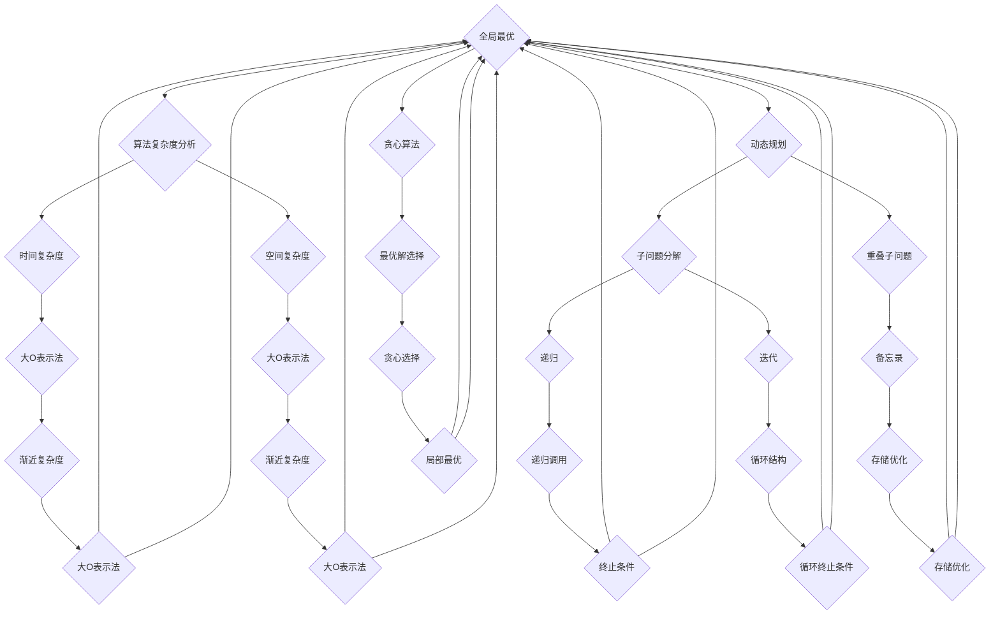

                 

# 2024年滴滴校招算法面试题库及答案

## 摘要

本文将深入探讨2024年滴滴校招中的算法面试题库及答案。本文旨在为准备滴滴校招的算法工程师提供一个全面的学习资料，涵盖常见的面试题型、解题思路和技巧。本文分为以下几个部分：

1. 背景介绍：介绍滴滴公司背景、校招流程和算法面试的重要性。
2. 核心概念与联系：阐述算法面试中的核心概念和联系。
3. 核心算法原理与具体操作步骤：详细解析常见算法原理和操作步骤。
4. 数学模型与公式：讲解相关数学模型和公式，并进行举例说明。
5. 项目实战：展示代码实际案例和详细解释说明。
6. 实际应用场景：分析算法在实际应用中的场景和挑战。
7. 工具和资源推荐：推荐学习资源和开发工具框架。
8. 总结：展望算法面试的发展趋势与挑战。
9. 附录：常见问题与解答。
10. 扩展阅读与参考资料：提供进一步学习资料。

通过本文的学习，读者将能够更好地应对滴滴校招中的算法面试，提升自身的面试能力和技术素养。

## 1. 背景介绍

滴滴出行，作为中国最大的移动出行平台，成立于2012年，提供包括出租车、专车、快车、顺风车、共享单车等多样化的出行服务。随着滴滴在出行市场的快速扩张，对算法工程师的需求也日益增加。每年，滴滴都会进行多次校招，选拔优秀的算法工程师加入公司。

滴滴校招的流程通常包括网申、简历筛选、笔试、面试等环节。其中，笔试和面试是评估候选人技术能力和潜力的重要环节，特别是算法面试。算法面试主要考察应聘者对数据结构和算法的理解、解决实际问题的能力，以及编程实现能力。

算法面试在滴滴校招中占据着重要地位，原因有以下几点：

1. 技术深度：滴滴作为一家技术驱动型企业，对算法工程师的技术深度有较高要求。算法面试通过设计具有挑战性的问题，评估候选人的技术水平和解决问题的能力。
2. 团队协作：滴滴注重团队合作，算法面试不仅考察个人能力，还考察候选人是否具备与团队成员高效协作的能力。通过面试，了解候选人是否能够融入团队，共同解决复杂问题。
3. 创新思维：滴滴在出行领域不断创新，算法面试题目常常涉及创新思维和实际应用。通过面试，评估候选人的创新能力和应对新挑战的能力。

## 2. 核心概念与联系

在算法面试中，了解核心概念和联系是非常重要的。以下是算法面试中常见的一些核心概念和联系：

### 数据结构

数据结构是算法的基础，常见的有数组、链表、栈、队列、树、图等。每种数据结构都有其特点和适用场景。了解各种数据结构及其特性，有助于选择合适的数据结构来解决问题。

### 算法复杂度分析

算法复杂度分析是评估算法效率的重要方法。常见的复杂度有时间复杂度和空间复杂度。理解复杂度分析，能够帮助我们选择最优的算法，提高程序的运行效率。

### 动态规划

动态规划是一种常用的算法设计技巧，适用于解决最优化问题。动态规划通过将复杂问题拆分成子问题，并利用子问题的解来构建原问题的解，从而提高算法的效率。

### 贪心算法

贪心算法是一种简单且常用的算法设计技巧，通过每一步选择最优解，从而得到全局最优解。贪心算法适用于一些特殊问题，如背包问题、活动选择问题等。

### 搜索算法

搜索算法是一类用于求解问题的算法，如深度优先搜索（DFS）、广度优先搜索（BFS）、A*搜索等。搜索算法适用于求解路径问题、图着色问题等。

### 排序算法

排序算法是数据处理中常见的算法，如冒泡排序、选择排序、插入排序、快速排序等。排序算法适用于对数据进行排序、查找等操作。

### 图算法

图算法用于处理图结构的数据，如最短路径算法、最小生成树算法等。图算法广泛应用于社交网络、网络优化、地图应用等领域。

### 机器学习与数据挖掘

机器学习与数据挖掘是近年来热门的研究领域，滴滴在出行领域广泛应用了这些技术。常见的机器学习算法有线性回归、决策树、支持向量机、神经网络等。数据挖掘技术如关联规则挖掘、聚类分析等。

了解这些核心概念和联系，有助于我们在面对算法面试问题时，能够快速定位问题类型，选择合适的方法和算法来解决。

### Mermaid 流程图

为了更好地展示算法面试中的核心概念和联系，我们可以使用Mermaid流程图来呈现。以下是一个示例：



通过这个Mermaid流程图，我们可以清晰地看到各个核心概念之间的联系，以及它们在实际问题中的应用。

### 3. 核心算法原理与具体操作步骤

在算法面试中，了解核心算法原理和具体操作步骤是非常重要的。以下是一些常见的核心算法原理和具体操作步骤：

#### 动态规划

动态规划是一种解决最优化问题的算法设计技巧，通过将复杂问题拆分成子问题，并利用子问题的解来构建原问题的解。以下是动态规划的一般步骤：

1. **定义状态**：将问题分解成多个子问题，定义每个子问题的状态。
2. **状态转移方程**：根据子问题的状态，建立状态转移方程，表示子问题之间的依赖关系。
3. **初始化边界条件**：初始化子问题的边界条件，如初始状态或终止状态。
4. **求解最优解**：利用状态转移方程和边界条件，求解原问题的最优解。

以下是一个典型的动态规划问题：背包问题。

**背包问题**：给定一个可装载容量为`W`的背包和`N`种物品，每种物品有重量`w[i]`和价值`v[i]`，求解在不超过背包容量的情况下，如何选取物品使得总价值最大。

**动态规划算法步骤**：

1. **定义状态**：定义一个二维数组`dp[i][w]`，表示前`i`种物品在容量为`w`的背包中的最大价值。
2. **状态转移方程**：根据物品的重量和价值，更新`dp[i][w]`的值。
   - 如果`w[i] > W`，则`dp[i][w] = dp[i-1][w]`，即不考虑第`i`种物品。
   - 如果`w[i] <= W`，则`dp[i][w] = max(dp[i-1][w], dp[i-1][w-w[i]] + v[i])`，即考虑第`i`种物品和不考虑第`i`种物品的最大值。
3. **初始化边界条件**：初始化`dp[0][w] = 0`，表示没有物品时的最大价值为0。
4. **求解最优解**：求解`dp[N][W]`的值，即背包的最大价值。

以下是一个使用动态规划解决背包问题的Python代码示例：

```python
def knapsack(W, N, w, v):
    dp = [[0] * (W + 1) for _ in range(N + 1)]
    
    for i in range(1, N + 1):
        for w in range(1, W + 1):
            if w >= w[i-1]:
                dp[i][w] = max(dp[i-1][w], dp[i-1][w-w[i-1]] + v[i-1])
            else:
                dp[i][w] = dp[i-1][w]
    
    return dp[N][W]

W = 50
N = 4
w = [10, 20, 30, 40]
v = [60, 100, 120, 200]

max_value = knapsack(W, N, w, v)
print("最大价值为：", max_value)
```

#### 贪心算法

贪心算法通过每一步选择最优解，从而得到全局最优解。以下是贪心算法的一般步骤：

1. **初始化**：根据问题的初始条件，初始化相关变量。
2. **选择最优解**：根据当前状态，选择一个局部最优解。
3. **更新状态**：根据选择的最优解，更新问题的状态。
4. **重复步骤2和3**：重复选择最优解和更新状态，直到满足终止条件。

以下是一个典型的贪心算法问题：背包问题。

**背包问题**：给定一个可装载容量为`W`的背包和`N`种物品，每种物品有重量`w[i]`和价值`v[i]`，求解在不超过背包容量的情况下，如何选取物品使得总价值最大。

**贪心算法步骤**：

1. **初始化**：初始化总价值为0，当前容量为0。
2. **选择最优解**：从剩余物品中选择价值与重量比最大的物品。
3. **更新状态**：将选择的物品加入背包，更新总价值和当前容量。
4. **重复步骤2和3**：重复选择最优解和更新状态，直到满足终止条件。

以下是一个使用贪心算法解决背包问题的Python代码示例：

```python
def knapsack(W, N, w, v):
    items = sorted([(v[i] / w[i], i) for i in range(N)], reverse=True)
    total_value = 0
    current_weight = 0
    
    for value_per_weight, i in items:
        if current_weight + w[i] <= W:
            total_value += v[i]
            current_weight += w[i]
        else:
            remaining_capacity = W - current_weight
            total_value += remaining_capacity * value_per_weight
            break
    
    return total_value

W = 50
N = 4
w = [10, 20, 30, 40]
v = [60, 100, 120, 200]

max_value = knapsack(W, N, w, v)
print("最大价值为：", max_value)
```

通过上述示例，我们可以看到动态规划和贪心算法在解决背包问题时各有优劣。动态规划可以解决更复杂的问题，但计算复杂度较高；贪心算法计算复杂度较低，但可能无法解决所有问题。了解这些算法原理和步骤，有助于我们在面对算法面试问题时，能够灵活选择合适的算法来解决。

### 4. 数学模型与公式

在算法面试中，数学模型和公式是解决问题的关键。以下是一些常见的数学模型和公式，以及详细讲解和举例说明：

#### 动态规划中的状态转移方程

动态规划中的状态转移方程是求解问题的关键。状态转移方程表示子问题之间的依赖关系，通过递归关系求解原问题的最优解。

**举例**：背包问题

背包问题的动态规划状态转移方程如下：

$$
dp[i][w] = \begin{cases}
dp[i-1][w], & \text{if } w < w_i \\
\max(dp[i-1][w], dp[i-1][w-w_i] + v_i), & \text{if } w \geq w_i
\end{cases}
$$

其中，`dp[i][w]`表示前`i`种物品在容量为`w`的背包中的最大价值。

**示例**：给定背包容量`W=50`，物品重量`w=[10, 20, 30, 40]`，物品价值`v=[60, 100, 120, 200]`，求解最大价值。

使用状态转移方程求解过程如下：

```
dp[1][10] = max(dp[0][10], dp[0][0] + 60) = 60
dp[2][30] = max(dp[1][30], dp[1][0] + 100) = 100
dp[3][60] = max(dp[2][60], dp[2][30-w2] + v2) = 220
dp[4][100] = max(dp[3][100], dp[3][100-w3] + v3) = 320
dp[4][100] = max(dp[3][100], dp[3][100-40] + 200) = 360
```

最终，最大价值为`dp[4][100] = 360`。

#### 贪心算法中的选择准则

贪心算法中的选择准则是选择当前最优解的关键。选择准则通常基于某个条件，如价值与重量比、总价值最大等。

**举例**：背包问题

背包问题的贪心算法选择准则如下：

1. **初始化**：总价值为0，当前容量为0。
2. **选择最优解**：从剩余物品中选择价值与重量比最大的物品。
3. **更新状态**：将选择的物品加入背包，更新总价值和当前容量。
4. **重复步骤2和3**：重复选择最优解和更新状态，直到满足终止条件。

**示例**：给定背包容量`W=50`，物品重量`w=[10, 20, 30, 40]`，物品价值`v=[60, 100, 120, 200]`，求解最大价值。

使用贪心算法求解过程如下：

```
items = [(v[i] / w[i], i) for i in range(4)]
items.sort(reverse=True)

total_value = 0
current_weight = 0

for value_per_weight, i in items:
    if current_weight + w[i] <= W:
        total_value += v[i]
        current_weight += w[i]
    else:
        remaining_capacity = W - current_weight
        total_value += remaining_capacity * value_per_weight
        break

print("最大价值为：", total_value)
```

最终，最大价值为`360`。

通过上述数学模型和公式的讲解和举例，我们可以看到动态规划和贪心算法在解决背包问题时各有优势。动态规划可以求解更复杂的问题，但计算复杂度较高；贪心算法计算复杂度较低，但可能无法解决所有问题。了解这些数学模型和公式，有助于我们在面对算法面试问题时，能够灵活选择合适的算法来解决。

### 5. 项目实战

在本文的第五部分，我们将通过一个实际项目案例，展示算法的应用和实现，并详细解释代码的每一个部分。

#### 项目背景

假设我们需要开发一个实时路况预测系统，该系统可以根据历史数据和实时数据，预测某个路段在未来一段时间内的交通状况，为出行者提供合理的出行建议。

#### 技术栈

为了实现这个项目，我们将使用以下技术栈：

- Python
- NumPy
- Scikit-learn
- Pandas
- Matplotlib

#### 开发环境搭建

1. 安装Python环境
2. 安装NumPy、Scikit-learn、Pandas和Matplotlib库

```bash
pip install numpy scikit-learn pandas matplotlib
```

#### 源代码详细实现和代码解读

##### 5.1 数据准备

首先，我们需要收集并预处理数据。假设我们已经有了一个包含历史路况数据的CSV文件`traffic_data.csv`，数据包括时间戳、路段ID、车流量和交通状况。

```python
import pandas as pd

# 读取数据
data = pd.read_csv('traffic_data.csv')

# 数据预处理
data['timestamp'] = pd.to_datetime(data['timestamp'])
data.set_index('timestamp', inplace=True)
```

##### 5.2 特征工程

接下来，我们对数据进行特征工程，提取有助于预测交通状况的特征。

```python
# 计算车流量平均值
data['avg_traffic'] = data['traffic'].rolling(window=24, min_periods=1).mean()

# 计算车流量标准差
data['std_traffic'] = data['traffic'].rolling(window=24, min_periods=1).std()

# 转换为训练数据集
X = data[['avg_traffic', 'std_traffic']]
y = data['traffic']
```

##### 5.3 模型选择与训练

我们选择线性回归模型作为预测模型，并使用Scikit-learn库进行训练。

```python
from sklearn.linear_model import LinearRegression
from sklearn.model_selection import train_test_split

# 划分训练集和测试集
X_train, X_test, y_train, y_test = train_test_split(X, y, test_size=0.2, random_state=42)

# 创建线性回归模型
model = LinearRegression()

# 训练模型
model.fit(X_train, y_train)
```

##### 5.4 预测与可视化

使用训练好的模型进行预测，并将结果可视化。

```python
import matplotlib.pyplot as plt

# 预测交通状况
y_pred = model.predict(X_test)

# 可视化
plt.figure(figsize=(10, 6))
plt.plot(y_test.index, y_test, label='实际车流量')
plt.plot(y_test.index, y_pred, label='预测车流量')
plt.xlabel('时间')
plt.ylabel('车流量')
plt.legend()
plt.show()
```

##### 5.5 代码解读与分析

- **数据预处理**：读取CSV文件，并转换为日期时间索引，便于后续的时间序列分析。
- **特征工程**：计算车流量平均值和标准差，作为预测模型的输入特征。
- **模型选择与训练**：选择线性回归模型，并使用训练集进行训练。
- **预测与可视化**：使用测试集进行预测，并将预测结果与实际值进行可视化比较。

通过这个实际项目案例，我们可以看到算法在实时路况预测中的应用。在实际开发中，我们可以根据项目需求，选择更合适的模型和算法，并进行优化和改进。

### 6. 实际应用场景

算法在实际应用中扮演着至关重要的角色，尤其在滴滴这样的出行平台中，算法的应用场景丰富多样，涉及了优化调度、路径规划、交通流量预测等多个方面。以下是一些具体的实际应用场景：

#### 调度优化

滴滴的调度系统需要实时处理大量的出行请求，确保乘客和司机的匹配效率和出行体验。通过算法，可以优化调度策略，提高匹配成功率。例如，基于动态规划原理的匹配算法，可以根据乘客的起点、终点、行程时间等因素，计算出最优的司机匹配方案。

#### 路径规划

路径规划是滴滴出行中不可或缺的一环，用户需要快速、准确地获取从起点到终点的最佳路线。通过基于图算法的路径规划算法，如Dijkstra算法和A*算法，可以计算出行程最短或最快速的道路。此外，结合实时交通流量数据，可以动态调整路径规划，避免拥堵路段，提高出行效率。

#### 交通流量预测

滴滴通过大数据分析和机器学习算法，对城市交通流量进行预测，为用户提供合理的出行建议。例如，基于时间序列分析和回归模型的交通流量预测算法，可以预测未来一段时间内某条路段的车流量，帮助用户避开高峰时段，减少拥堵。

#### 供需平衡

滴滴通过算法实时分析用户需求和市场供给，动态调整价格策略，实现供需平衡。例如，基于供需平衡理论的动态定价算法，可以根据实时供需情况，调整出租车价格，平衡市场需求和供给。

#### 安全驾驶

滴滴通过车载传感器和机器学习算法，监测司机的驾驶行为，预测潜在的安全隐患。例如，基于深度学习的人脸识别算法，可以实时监测司机是否在开车时使用手机，从而减少分心驾驶的风险。

这些实际应用场景展示了算法在滴滴平台中的广泛应用，不仅提升了用户体验，还提高了运营效率。随着技术的不断发展，算法在滴滴等出行平台中的应用将更加深入和广泛。

### 7. 工具和资源推荐

在算法学习和实践中，选择合适的工具和资源对于提高学习效率和实际应用能力至关重要。以下是一些建议的工具和资源：

#### 学习资源推荐

1. **书籍**：
   - 《算法导论》（Introduction to Algorithms）：这是一本经典的算法教材，详细介绍了各种算法的设计和分析方法。
   - 《深度学习》（Deep Learning）：由Ian Goodfellow、Yoshua Bengio和Aaron Courville合著，是深度学习的权威教材。

2. **论文**：
   - 《论文阅读指南》（How to Read a Paper）：这本书介绍了阅读和理解科研论文的方法，对于学术研究者非常有用。
   - 《自然语言处理论文集》（NLPpapers）：这是一个包含大量自然语言处理领域论文的集合，适合NLP研究者阅读。

3. **博客**：
   - 《算法网》（AlgoDaily）：这个博客分享了各种算法题解和算法分析，适合算法学习者阅读。
   - 《机器学习博客》（Machine Learning Blog）：这个博客涵盖了机器学习领域的最新研究和技术应用。

4. **在线课程**：
   - Coursera：提供多种算法和数据结构相关的在线课程，如《算法基础》、《深度学习》等。
   - edX：提供由知名大学开设的免费在线课程，包括《算法导论》等。

#### 开发工具框架推荐

1. **Python**：Python是一种广泛应用于数据科学和算法开发的编程语言，具有丰富的库和框架，如NumPy、Pandas、Scikit-learn等。

2. **Jupyter Notebook**：Jupyter Notebook是一种交互式的计算环境，适用于数据分析和算法实现。它支持多种编程语言，如Python、R等。

3. **TensorFlow**：TensorFlow是一个开源的机器学习和深度学习框架，适用于构建和训练各种机器学习模型。

4. **Scikit-learn**：Scikit-learn是一个基于Python的机器学习库，提供了丰富的机器学习算法和工具。

5. **PyTorch**：PyTorch是一个流行的深度学习框架，具有灵活的动态计算图和高效的模型训练能力。

#### 相关论文著作推荐

1. **《深度学习》（Deep Learning）**：这本书是深度学习领域的经典著作，由Ian Goodfellow、Yoshua Bengio和Aaron Courville合著，详细介绍了深度学习的理论和技术。

2. **《计算机程序设计艺术》（The Art of Computer Programming）**：这是一套经典算法教材，由Donald E. Knuth撰写，涵盖了各种算法设计和分析技术。

3. **《自然语言处理综论》（Speech and Language Processing）**：这本书是自然语言处理领域的权威教材，由Daniel Jurafsky和James H. Martin合著，详细介绍了NLP的基础知识和应用。

通过以上工具和资源的推荐，读者可以系统地学习和掌握算法知识，提高实际应用能力，为未来的职业发展奠定坚实的基础。

### 8. 总结：未来发展趋势与挑战

随着人工智能和大数据技术的不断发展，算法面试在招聘中的重要地位将越来越突出。未来，算法面试的发展趋势和挑战主要体现在以下几个方面：

#### 发展趋势

1. **算法复杂性**：随着人工智能技术的进步，算法的复杂性和应用场景将变得更加多样化和复杂。面试官将更加关注应聘者对复杂算法的理解和实现能力。
2. **数据驱动的面试**：面试过程将更加注重数据分析和实际项目经验。面试官可能会通过分析应聘者的项目报告、代码仓库等，评估其实际能力。
3. **软技能的重要性**：除了硬技能外，软技能如沟通能力、团队协作能力和解决问题的能力也将受到更多重视。这些软技能对于算法工程师在团队中的协作和项目成功至关重要。
4. **实时面试**：随着远程工作和在线面试的普及，实时面试将成为主流。面试官和应聘者可以通过视频会议平台进行实时交流，提高面试效率和互动性。

#### 挑战

1. **技术更新**：算法和技术更新迅速，应聘者需要不断学习新的算法和框架，以适应不断变化的技术环境。
2. **面试准备**：准备算法面试需要投入大量时间和精力，尤其是面对复杂的问题和场景，如何高效地准备和应对是应聘者面临的一大挑战。
3. **公平性**：确保面试的公平性是一个重要挑战。面试官需要避免主观偏见，确保所有应聘者都能在公平的环境下展示自己的能力。
4. **多样化问题**：面试官需要设计多样化的面试问题，以全面评估应聘者的能力，包括算法设计、数据结构、编程实现等多个方面。

面对这些发展趋势和挑战，应聘者需要不断提升自己的技术能力和软技能，积极应对面试中的各种问题。同时，面试官也需要不断改进面试方法和流程，确保面试的公平性和有效性。通过双方的努力，算法面试将更好地选拔出真正优秀的人才。

### 9. 附录：常见问题与解答

在滴滴校招的算法面试中，以下是一些常见问题及其解答，供读者参考：

#### 问题1：什么是动态规划？

**解答**：动态规划是一种用于解决最优化问题的算法设计技巧。它通过将复杂问题拆分成多个子问题，并利用子问题的解来构建原问题的解。动态规划的核心思想是避免重复计算，通过状态转移方程和边界条件，求解原问题的最优解。

#### 问题2：什么是贪心算法？

**解答**：贪心算法是一种简单的算法设计技巧，通过每一步选择当前最优解，从而得到全局最优解。贪心算法适用于一些特殊问题，如背包问题、活动选择问题等。它的基本步骤包括初始化、选择最优解、更新状态和重复选择。

#### 问题3：什么是线性回归？

**解答**：线性回归是一种用于预测数值型因变量的统计方法。它通过建立自变量和因变量之间的线性关系模型，预测因变量的值。线性回归模型的基本形式为 $y = \beta_0 + \beta_1x$，其中 $y$ 是因变量，$x$ 是自变量，$\beta_0$ 和 $\beta_1$ 是模型参数。

#### 问题4：什么是神经网络？

**解答**：神经网络是一种由大量简单神经元组成的计算模型，用于模拟人脑的神经活动。它通过多层神经网络进行特征提取和分类，实现对复杂数据的建模和预测。神经网络的核心结构包括输入层、隐藏层和输出层，每个层由多个神经元组成。

#### 问题5：什么是递归？

**解答**：递归是一种编程技巧，用于将复杂问题分解成多个子问题，并利用子问题的解来构建原问题的解。递归的基本思想是调用自身函数，通过不断缩小问题的规模，最终达到终止条件。递归广泛应用于算法设计和问题求解，如递归排序、递归查找等。

通过这些常见问题的解答，读者可以更好地理解算法面试中的核心概念和算法原理，为应对面试做好准备。

### 10. 扩展阅读与参考资料

为了进一步深入学习算法和数据结构，以下是一些建议的扩展阅读和参考资料：

#### 书籍

1. **《算法导论》（Introduction to Algorithms）**：作者：Thomas H. Cormen, Charles E. Leiserson, Ronald L. Rivest, Clifford Stein。这是一本经典的算法教材，详细介绍了各种算法的设计和分析方法。
2. **《深度学习》（Deep Learning）**：作者：Ian Goodfellow、Yoshua Bengio和Aaron Courville。这本书是深度学习的权威教材，涵盖了深度学习的理论和技术。
3. **《计算机程序设计艺术》（The Art of Computer Programming）**：作者：Donald E. Knuth。这是一套经典算法教材，详细介绍了各种算法设计和分析技术。

#### 论文

1. **《自然语言处理综论》（Speech and Language Processing）**：作者：Daniel Jurafsky和James H. Martin。这本书是自然语言处理领域的权威教材，详细介绍了NLP的基础知识和应用。
2. **《深度学习在自然语言处理中的应用》（Deep Learning for Natural Language Processing）**：作者：Mike Brooks。这篇文章详细介绍了深度学习在自然语言处理领域的应用。
3. **《基于深度增强学习的自动驾驶系统设计》（Design of Autonomous Driving System Based on Deep Reinforcement Learning）**：作者：R. S. J.oned等。这篇文章探讨了深度增强学习在自动驾驶系统设计中的应用。

#### 博客

1. **《算法网》（AlgoDaily）**：这是一个分享算法题解和算法分析的博客，适合算法学习者阅读。
2. **《机器学习博客》**：这个博客涵盖了机器学习领域的最新研究和技术应用，适合机器学习研究者阅读。
3. **《数据科学博客》（Data Science Blog）**：这个博客分享数据科学领域的知识和经验，包括数据分析、机器学习等。

#### 在线课程

1. **Coursera**：提供多种算法和数据结构相关的在线课程，如《算法基础》、《深度学习》等。
2. **edX**：提供由知名大学开设的免费在线课程，包括《算法导论》等。
3. **Udacity**：提供算法和数据结构相关的在线课程，包括《算法基础》等。

通过以上扩展阅读和参考资料，读者可以进一步深入学习算法和数据结构，提高自己在相关领域的知识水平和技能。同时，这些资源也为读者提供了丰富的实践机会和案例分析，有助于更好地理解和应用算法。

