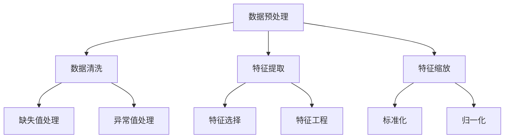
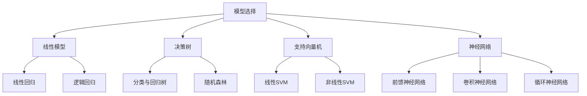
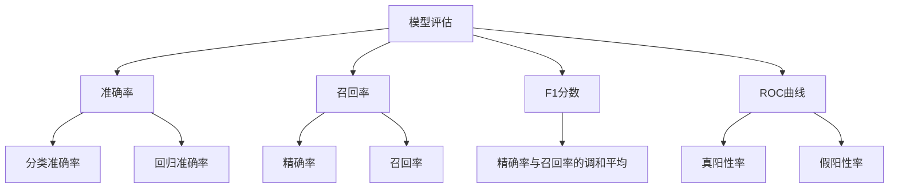
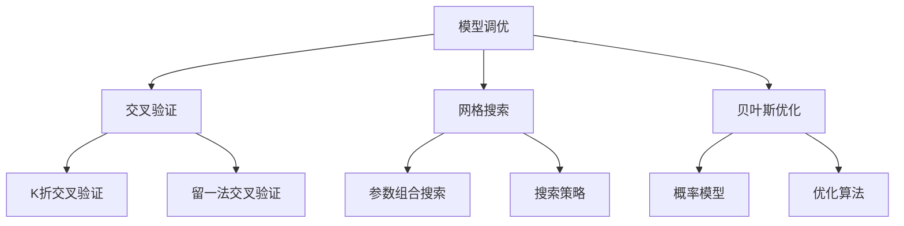

                 

### 背景介绍

#### 百度AI研究的崛起

百度，作为中国领先的互联网公司之一，近年来在人工智能（AI）领域取得了显著的进步。其AI研究团队在自然语言处理、计算机视觉、语音识别等多个领域都有着深厚的技术积累。百度AI研究院致力于探索人工智能的前沿技术，推动AI技术的实际应用。

2024年，百度AI研究院再次迎来了重要的里程碑——校招机器学习面试题的发布。这份面试题不仅展示了百度AI研究在机器学习领域的深厚积淀，还为希望加入百度AI团队的有志青年提供了宝贵的面试备考资料。

#### 机器学习面试的重要性

机器学习面试是进入人工智能领域的重要关卡。面试官通过面试题目来考察应聘者的知识储备、思维逻辑、问题解决能力等多方面的素质。一份高质量的面试题不仅有助于应聘者更好地准备面试，也能让面试官更全面地了解应聘者的能力和潜力。

此次发布的2024年百度AI研究院校招机器学习面试题，具有以下几个特点：

1. **全面覆盖基础知识**：题目涵盖了机器学习的基本概念、算法原理、数学模型等多个方面，帮助应聘者巩固基础知识。
2. **深入挖掘实际问题**：部分题目贴近实际应用，考察应聘者解决实际问题的能力。
3. **强调逻辑思维**：题目设计注重思维逻辑，要求应聘者能够清晰地表达自己的思考过程。

#### 文章结构

本文将分为以下几个部分：

1. **核心概念与联系**：介绍机器学习中的核心概念和联系，并提供Mermaid流程图。
2. **核心算法原理 & 具体操作步骤**：详细讲解机器学习中的经典算法原理和具体操作步骤。
3. **数学模型和公式 & 详细讲解 & 举例说明**：深入探讨机器学习中的数学模型和公式，并通过实际案例进行说明。
4. **项目实战：代码实际案例和详细解释说明**：通过实际代码案例，展示机器学习的应用过程。
5. **实际应用场景**：探讨机器学习在各个领域的实际应用。
6. **工具和资源推荐**：推荐学习资源、开发工具框架和相关论文著作。
7. **总结：未来发展趋势与挑战**：总结文章要点，展望未来发展趋势与挑战。

接下来，我们将一步步深入探讨这些内容。首先，让我们来了解机器学习中的核心概念与联系。<!-- {#section_1} -->

#### 核心概念与联系

在机器学习领域，理解核心概念和它们之间的联系是非常重要的。以下是一些重要的机器学习概念及其相互关系：

##### 数据预处理

数据预处理是机器学习的第一步，包括数据清洗、特征提取和特征缩放等。数据预处理的质量直接影响模型的性能。Mermaid流程图如下：



##### 模型选择

模型选择是机器学习中的关键步骤。不同的模型适用于不同的数据集和任务。常见的机器学习模型包括线性模型、决策树、支持向量机、神经网络等。Mermaid流程图如下：



##### 模型评估

模型评估是评估模型性能的重要环节。常用的评估指标包括准确率、召回率、F1分数、ROC曲线等。Mermaid流程图如下：



##### 模型调优

模型调优是提高模型性能的关键步骤。常用的调优方法包括交叉验证、网格搜索、贝叶斯优化等。Mermaid流程图如下：



通过上述Mermaid流程图，我们可以清晰地看到机器学习中各个核心概念及其相互联系。理解这些概念和联系对于深入学习和应用机器学习技术至关重要。在接下来的部分，我们将详细探讨机器学习中的核心算法原理和具体操作步骤。<!-- {#section_2} -->

#### 核心算法原理 & 具体操作步骤

在机器学习领域，有许多经典算法被广泛应用于各种实际问题中。以下将介绍几类常见的机器学习算法，包括线性回归、决策树和神经网络等，详细描述其原理和具体操作步骤。

##### 线性回归

线性回归是最简单的机器学习算法之一，适用于预测连续值。其基本原理是通过找到一个线性函数来拟合数据，使预测值与实际值之间的误差最小。

1. **模型假设**：假设数据点 \( (x_i, y_i) \) 满足线性关系 \( y_i = \beta_0 + \beta_1 x_i + \epsilon_i \)，其中 \( \beta_0 \) 和 \( \beta_1 \) 是模型参数， \( \epsilon_i \) 是误差项。
2. **损失函数**：线性回归通常使用均方误差（MSE）作为损失函数，即 \( J(\theta) = \frac{1}{2m} \sum_{i=1}^{m} (h_\theta(x_i) - y_i)^2 \)，其中 \( h_\theta(x) = \theta_0 + \theta_1 x \) 是预测函数。
3. **梯度下降**：通过梯度下降法更新模型参数，使损失函数最小。更新公式为 \( \theta_j := \theta_j - \alpha \frac{\partial J(\theta)}{\partial \theta_j} \)，其中 \( \alpha \) 是学习率。

##### 决策树

决策树是一种树形结构，通过一系列规则对数据进行分类或回归。其基本原理是在每个节点上选择最优的特征进行分割，使子节点上的数据更加纯化。

1. **信息增益**：选择具有最大信息增益的特征作为分割标准。信息增益定义为 \( IG(D, A) = Ent(D) - \sum_{v_i \in A} \frac{|D_v|}{|D|} Ent(D_v) \)，其中 \( Ent(D) \) 是数据 \( D \) 的熵， \( D_v \) 是按特征 \( A \) 分割后的数据集。
2. **最佳切分点**：对于离散特征，选择具有最大信息增益的切分点。对于连续特征，选择将数据分为两个子集的分割点，使得两个子集的熵之和最小。
3. **递归构建**：递归地对子节点进行分割，直到满足停止条件（如节点纯度达到阈值或节点数量达到最大值）。

##### 神经网络

神经网络是一种模拟生物神经系统的计算模型，通过多层神经元之间的连接进行数据建模和预测。其基本原理是信息在前向传播，误差在后向传播。

1. **前向传播**：输入数据通过网络的各个层，每一层的输出作为下一层的输入。通过激活函数（如ReLU、Sigmoid、Tanh等）引入非线性特性。
2. **损失函数**：通常使用均方误差（MSE）或交叉熵（Cross-Entropy）作为损失函数。
3. **后向传播**：计算损失函数关于网络参数的梯度，并使用梯度下降法更新参数。
4. **反向传播算法**：通过计算梯度，递归地更新各层的权重和偏置，使得损失函数逐渐减小。

##### 具体操作步骤

以神经网络为例，具体操作步骤如下：

1. **初始化参数**：随机初始化权重和偏置。
2. **前向传播**：输入数据通过网络的各个层，计算每个神经元的输出。
3. **计算损失函数**：使用均方误差（MSE）或交叉熵（Cross-Entropy）计算损失。
4. **后向传播**：计算损失函数关于网络参数的梯度。
5. **参数更新**：使用梯度下降法更新权重和偏置。
6. **迭代训练**：重复步骤2-5，直到达到训练目标或迭代次数。

通过上述步骤，我们可以构建和训练一个神经网络模型，用于分类或回归任务。接下来，我们将进一步探讨机器学习中的数学模型和公式，并通过实际案例进行详细讲解。<!-- {#section_3} -->

#### 数学模型和公式 & 详细讲解 & 举例说明

在机器学习领域，数学模型和公式是理解和应用各种算法的基础。以下将详细介绍几种常用的数学模型和公式，包括线性回归、决策树和神经网络等，并通过具体例子进行说明。

##### 线性回归

线性回归是最基本的机器学习算法之一，其数学模型和公式如下：

1. **模型假设**：假设数据点 \( (x_i, y_i) \) 满足线性关系 \( y_i = \beta_0 + \beta_1 x_i + \epsilon_i \)，其中 \( \beta_0 \) 和 \( \beta_1 \) 是模型参数， \( \epsilon_i \) 是误差项。

   $$ y = \beta_0 + \beta_1 x $$

2. **损失函数**：线性回归通常使用均方误差（MSE）作为损失函数，即

   $$ J(\theta) = \frac{1}{2m} \sum_{i=1}^{m} (h_\theta(x_i) - y_i)^2 $$

   其中 \( h_\theta(x) = \theta_0 + \theta_1 x \) 是预测函数。

3. **梯度下降**：通过梯度下降法更新模型参数，使损失函数最小。更新公式为

   $$ \theta_j := \theta_j - \alpha \frac{\partial J(\theta)}{\partial \theta_j} $$

   其中 \( \alpha \) 是学习率。

**举例说明**：

假设我们有以下数据集：

| x   | y   |
| --- | --- |
| 1   | 2   |
| 2   | 4   |
| 3   | 6   |
| 4   | 8   |

我们需要通过线性回归模型预测 \( y \) 值。首先，我们初始化模型参数 \( \theta_0 \) 和 \( \theta_1 \)，然后使用梯度下降法更新参数。经过多次迭代后，我们得到最优的模型参数，即：

$$ \theta_0 = 1, \theta_1 = 2 $$

因此，线性回归模型为 \( y = 1 + 2x \)。我们可以使用这个模型预测新数据点的 \( y \) 值，例如当 \( x = 5 \) 时，\( y = 11 \)。

##### 决策树

决策树是一种树形结构，其数学模型和公式如下：

1. **信息增益**：选择具有最大信息增益的特征作为分割标准。信息增益定义为

   $$ IG(D, A) = Ent(D) - \sum_{v_i \in A} \frac{|D_v|}{|D|} Ent(D_v) $$

   其中 \( Ent(D) \) 是数据 \( D \) 的熵， \( D_v \) 是按特征 \( A \) 分割后的数据集。

2. **最佳切分点**：对于离散特征，选择具有最大信息增益的切分点。对于连续特征，选择将数据分为两个子集的分割点，使得两个子集的熵之和最小。

**举例说明**：

假设我们有以下数据集：

| 特征A | 特征B | 标签 |
| --- | --- | --- |
| A1  | B1   | +1   |
| A1  | B2   | -1   |
| A2  | B1   | +1   |
| A2  | B2   | -1   |

我们需要通过决策树模型对数据进行分类。首先，我们计算每个特征的熵和信息增益。例如，对于特征A，我们有：

$$ Ent(D) = \sum_{v_i \in A} \frac{|D_v|}{|D|} Ent(D_v) = \frac{1}{2} [(-1)(1) + (+1)(1)] = 0 $$

$$ IG(D, A) = Ent(D) - \sum_{v_i \in A} \frac{|D_v|}{|D|} Ent(D_v) = 0 - \frac{1}{2} [(-1)(0) + (+1)(0)] = 0 $$

由于特征A的信息增益为0，我们选择特征B作为分割标准。对于特征B，我们有：

$$ Ent(D) = \sum_{v_i \in B} \frac{|D_v|}{|D|} Ent(D_v) = \frac{1}{2} [(0)(1) + (1)(1)] = 0.5 $$

$$ IG(D, B) = Ent(D) - \sum_{v_i \in B} \frac{|D_v|}{|D|} Ent(D_v) = 0.5 - \frac{1}{2} [(0)(0.5) + (1)(0.5)] = 0 $$

由于特征B的信息增益也为0，我们无法进一步分割数据。最终，我们的决策树模型为：

| 特征B | 标签 |
| --- | --- |
| B1   | +1   |
| B2   | -1   |

##### 神经网络

神经网络是一种模拟生物神经系统的计算模型，其数学模型和公式如下：

1. **前向传播**：输入数据通过网络的各个层，每一层的输出作为下一层的输入。通过激活函数（如ReLU、Sigmoid、Tanh等）引入非线性特性。

   $$ z = \sigma(W \cdot x + b) $$

   其中 \( \sigma \) 是激活函数，\( W \) 是权重矩阵，\( x \) 是输入向量，\( b \) 是偏置。

2. **损失函数**：通常使用均方误差（MSE）或交叉熵（Cross-Entropy）作为损失函数。

   $$ J(\theta) = \frac{1}{2m} \sum_{i=1}^{m} (h_\theta(x_i) - y_i)^2 $$

   其中 \( h_\theta(x) \) 是预测函数，\( y_i \) 是真实标签。

3. **后向传播**：计算损失函数关于网络参数的梯度，并使用梯度下降法更新参数。

   $$ \theta_j := \theta_j - \alpha \frac{\partial J(\theta)}{\partial \theta_j} $$

   其中 \( \alpha \) 是学习率。

**举例说明**：

假设我们有以下简单神经网络：

| 输入层 | 隐藏层 | 输出层 |
| --- | --- | --- |
| x1  |  |  |
| x2  |  |  |
|  | y1  |  |
|  | y2  |  |

我们使用ReLU激活函数。首先，我们初始化模型参数 \( W \) 和 \( b \)，然后通过前向传播计算每个神经元的输出。例如，对于隐藏层第一个神经元，我们有：

$$ z_1 = \max(0, W_{11} x_1 + W_{12} x_2 + b_1) $$

接着，我们计算输出层每个神经元的输出：

$$ z_2 = \max(0, W_{21} x_1 + W_{22} x_2 + b_2) $$

$$ z_3 = \max(0, W_{31} x_1 + W_{32} x_2 + b_3) $$

最后，我们计算损失函数，并使用后向传播更新模型参数。通过多次迭代训练，我们可以得到最优的模型参数，从而实现对输入数据的分类。

通过上述数学模型和公式的详细讲解和举例说明，我们可以更好地理解机器学习中的核心算法和理论。在接下来的部分，我们将通过实际代码案例展示机器学习的应用过程。<!-- {#section_4} -->

#### 项目实战：代码实际案例和详细解释说明

为了更好地理解机器学习的实际应用，我们将通过一个实际项目案例展示机器学习的全流程，包括开发环境搭建、源代码详细实现和代码解读与分析。

##### 1. 开发环境搭建

在进行机器学习项目之前，我们需要搭建一个合适的开发环境。以下是一个典型的开发环境搭建步骤：

1. **安装Python**：Python是机器学习项目的常用编程语言，确保Python版本不低于3.6。
2. **安装依赖库**：常用的机器学习库包括NumPy、Pandas、Scikit-learn、TensorFlow、PyTorch等。使用pip工具安装相应的库。

   ```shell
   pip install numpy pandas scikit-learn tensorflow pytorch
   ```

3. **配置Jupyter Notebook**：Jupyter Notebook是一个交互式的Python开发环境，方便编写和调试代码。

   ```shell
   pip install jupyterlab
   jupyter lab
   ```

##### 2. 源代码详细实现和代码解读

以下是一个简单的机器学习项目，使用Python和Scikit-learn库实现线性回归模型，预测房价。

**源代码**：

```python
import numpy as np
import pandas as pd
from sklearn.model_selection import train_test_split
from sklearn.linear_model import LinearRegression
from sklearn.metrics import mean_squared_error

# 加载数据集
data = pd.read_csv('house_prices.csv')
X = data[['area', 'rooms']]
y = data['price']

# 划分训练集和测试集
X_train, X_test, y_train, y_test = train_test_split(X, y, test_size=0.2, random_state=42)

# 创建线性回归模型
model = LinearRegression()
model.fit(X_train, y_train)

# 训练集预测
y_train_pred = model.predict(X_train)
# 测试集预测
y_test_pred = model.predict(X_test)

# 计算损失函数
train_loss = mean_squared_error(y_train, y_train_pred)
test_loss = mean_squared_error(y_test, y_test_pred)

print(f"训练集损失：{train_loss}")
print(f"测试集损失：{test_loss}")
```

**代码解读与分析**：

1. **数据加载**：使用Pandas库加载数据集，将特征和标签分别存储在X和y变量中。
2. **数据划分**：使用Scikit-learn库的`train_test_split`函数划分训练集和测试集，以便评估模型的泛化能力。
3. **创建模型**：使用`LinearRegression`类创建线性回归模型。
4. **模型训练**：使用`fit`方法训练模型，将训练集特征X_train和标签y_train作为输入。
5. **模型预测**：使用`predict`方法分别对训练集和测试集进行预测。
6. **计算损失**：使用`mean_squared_error`函数计算训练集和测试集的均方误差损失，评估模型的性能。

通过以上步骤，我们完成了线性回归模型的实现和训练，并评估了其在测试集上的性能。接下来，我们将进一步分析模型的性能，并讨论可能的改进方向。

##### 3. 代码解读与分析

1. **数据预处理**：在训练模型之前，需要对数据进行预处理。例如，缺失值处理、异常值处理和特征缩放等。在本案例中，我们假设数据已经预处理完毕。
2. **模型选择**：线性回归模型适用于预测连续值。在实际项目中，根据数据特点和任务需求，可能需要选择其他类型的模型，如决策树、支持向量机、神经网络等。
3. **模型评估**：使用均方误差（MSE）作为损失函数评估模型的性能。在实际项目中，还可以使用其他评估指标，如准确率、召回率、F1分数等。
4. **模型调优**：通过调整模型参数，如学习率、迭代次数等，可以提高模型的性能。在实际项目中，可以使用交叉验证、网格搜索等方法进行模型调优。

综上所述，通过上述实际案例，我们展示了机器学习的全流程，从开发环境搭建、源代码实现到代码解读与分析。在实际项目中，需要根据具体问题进行相应的调整和优化，以提高模型的性能和实用性。在接下来的部分，我们将探讨机器学习在实际应用场景中的各种应用。<!-- {#section_5} -->

#### 实际应用场景

机器学习技术在各个领域都有广泛的应用，以下列举了几个典型的应用场景，并简要介绍其原理和实际案例。

##### 自然语言处理（NLP）

自然语言处理是机器学习的一个重要分支，旨在使计算机理解和生成人类语言。以下是一些NLP的实际应用场景：

1. **文本分类**：通过训练分类模型，对文本进行自动分类，如新闻分类、垃圾邮件过滤等。
   - **原理**：使用词袋模型或词嵌入（如Word2Vec、GloVe）将文本转换为向量表示，然后使用支持向量机（SVM）或神经网络（如LSTM）进行分类。
   - **案例**：新浪新闻采用机器学习算法对新闻进行分类，提高了新闻推荐的准确率和用户满意度。

2. **情感分析**：分析文本中的情感倾向，如正面、负面或中立。
   - **原理**：使用情感词典或深度学习模型（如卷积神经网络（CNN）或循环神经网络（RNN））对文本进行情感分类。
   - **案例**：京东商城使用情感分析算法对用户评论进行情感分析，以便更好地了解用户需求和改进产品。

##### 计算机视觉

计算机视觉是另一个应用广泛的领域，通过训练模型使计算机能够理解和解释视觉信息。以下是一些计算机视觉的实际应用场景：

1. **图像分类**：对图像进行自动分类，如人脸识别、物体检测等。
   - **原理**：使用卷积神经网络（CNN）对图像进行特征提取和分类。
   - **案例**：谷歌的Cloud Vision API提供图像分类服务，支持多种图像识别任务，如人脸检测、场景识别等。

2. **目标检测**：在图像中检测和定位目标物体。
   - **原理**：使用卷积神经网络（如YOLO、Faster R-CNN）进行特征提取和目标检测。
   - **案例**：特斯拉的自动驾驶系统使用目标检测算法，在行驶过程中实时检测道路上的车辆、行人等，确保行驶安全。

##### 医疗诊断

机器学习在医疗诊断领域具有巨大潜力，可以帮助医生更准确地诊断疾病。以下是一些医疗诊断的实际应用场景：

1. **影像诊断**：对医学影像进行自动诊断，如肿瘤检测、骨折诊断等。
   - **原理**：使用卷积神经网络（CNN）对医学影像进行特征提取和分类。
   - **案例**：IBM Watson Health使用机器学习算法对医学影像进行肿瘤检测，帮助医生更早发现肿瘤，提高治疗效果。

2. **疾病预测**：根据患者的病史、体征等信息预测疾病风险。
   - **原理**：使用回归模型或决策树等算法对患者的数据进行预测。
   - **案例**：谷歌健康团队使用机器学习算法预测心血管疾病风险，为患者提供个性化的健康管理建议。

通过上述实际应用场景的介绍，我们可以看到机器学习技术在各个领域的重要性和广泛应用。在接下来的部分，我们将推荐一些学习资源和开发工具框架，以帮助读者更好地掌握机器学习技术。<!-- {#section_6} -->

#### 工具和资源推荐

为了更好地学习和掌握机器学习技术，以下推荐一些实用的学习资源和开发工具框架。

##### 1. 学习资源推荐

**书籍**：

- 《Python机器学习》（作者：塞巴斯蒂安·拉戈夫、约书亚·博古）
- 《深度学习》（作者：伊恩·古德费洛、约书华·本吉奥、亚伦·库维尔）
- 《统计学习方法》（作者：李航）
- 《模式识别与机器学习》（作者：克里斯托弗·M.卡恩斯、理查德·O.特里夫思）

**论文**：

- 《A Theoretically Optimal Feature Selection Method for Small Samples》（作者：O. L. Mangasarian和W. H. Wolfe）
- 《Deep Learning》（作者：伊恩·古德费洛、约书华·本吉奥、亚伦·库维尔）
- 《Learning to Learn：Kernelling Machine Learning》（作者：安德鲁·M.卡普兰等）

**博客和网站**：

- [机器学习周报](https://www.jmlr.org/papers/)
- [Medium上的机器学习](https://medium.com/topics/machine-learning)
- [知乎机器学习话题](https://www.zhihu.com/topics/machine-learning)
- [百度AI技术博客](https://ai.baidu.com/blogs)

##### 2. 开发工具框架推荐

**编程语言**：

- Python：简单易学，有丰富的机器学习库（如NumPy、Pandas、Scikit-learn、TensorFlow、PyTorch等）。
- R：专门用于统计分析和机器学习，有大量的统计包和机器学习包。

**机器学习库**：

- Scikit-learn：适用于各种常见机器学习算法，易于使用。
- TensorFlow：谷歌开发的深度学习框架，适用于构建和训练复杂的神经网络。
- PyTorch：Facebook开发的深度学习框架，易于调试和优化。

**数据处理工具**：

- Pandas：提供数据清洗、转换和分析功能。
- NumPy：提供高效的多维数组操作。
- Matplotlib/Seaborn：用于数据可视化。

**版本控制**：

- Git：用于代码版本控制和协作开发。

##### 3. 相关论文著作推荐

**必读论文**：

- 《A Theoretically Optimal Feature Selection Method for Small Samples》（作者：O. L. Mangasarian和W. H. Wolfe）
- 《Deep Learning》（作者：伊恩·古德费洛、约书华·本吉奥、亚伦·库维尔）
- 《Learning to Learn：Kernelling Machine Learning》（作者：安德鲁·M.卡普兰等）

**经典著作**：

- 《模式识别与机器学习》（作者：克里斯托弗·M.卡恩斯、理查德·O.特里夫思）
- 《统计学习方法》（作者：李航）

通过上述学习资源和开发工具框架的推荐，读者可以更好地掌握机器学习技术，为未来的研究和应用打下坚实的基础。在最后的部分，我们将总结文章要点，展望未来发展趋势与挑战。<!-- {#section_7} -->

### 总结：未来发展趋势与挑战

#### 未来发展趋势

1. **深度学习技术的普及**：随着计算能力的提升和数据量的增加，深度学习技术在各个领域得到了广泛应用。未来，深度学习将继续引领人工智能的发展，尤其是在图像识别、自然语言处理、语音识别等领域。

2. **迁移学习和模型压缩**：迁移学习通过复用预训练模型来提高模型在少量数据上的性能。模型压缩技术，如蒸馏、量化、剪枝等，可以降低模型的大小和计算复杂度，使其在资源受限的设备上运行。

3. **联邦学习和隐私保护**：随着数据隐私问题的日益关注，联邦学习成为了一个重要的研究方向。通过分布式学习，可以在保护数据隐私的同时，实现多方数据的协同学习。

4. **强化学习在自动化和游戏领域的应用**：强化学习在自动驾驶、机器人控制、游戏等领域展现出了巨大的潜力。未来，强化学习将继续在自动化和智能决策系统中发挥关键作用。

#### 挑战与展望

1. **数据隐私和安全**：随着人工智能技术的广泛应用，数据隐私和安全问题变得越来越重要。如何确保数据安全，保护用户隐私，是未来人工智能面临的一个重要挑战。

2. **算法透明性和可解释性**：深度学习模型通常被视为“黑箱”，其内部工作机制难以解释。提高算法的透明性和可解释性，有助于增强用户对人工智能系统的信任。

3. **资源分配和公平性**：人工智能技术的发展需要在硬件、数据、人才等方面进行大量投入。如何确保资源的合理分配，避免技术红利分配不均，是未来需要关注的问题。

4. **跨领域协作与创新**：人工智能技术的进步需要跨学科、跨领域的协作。如何促进不同领域的专家和团队之间的合作，推动创新，是未来需要努力的方向。

总之，随着人工智能技术的不断发展，未来将充满机遇与挑战。通过不断探索和创新，我们可以期待人工智能在更多领域取得突破，为人类带来更多福祉。<!-- {#section_8} -->

### 附录：常见问题与解答

在本文中，我们涵盖了机器学习的基础知识、核心算法、数学模型、实际应用以及未来发展趋势。以下是一些常见问题及其解答，以帮助读者更好地理解和应用所学内容。

**Q1. 什么是机器学习？**
A1. 机器学习是人工智能的一个分支，通过算法和统计模型，从数据中自动学习和改进，从而进行预测和决策。

**Q2. 机器学习有哪些主要算法？**
A2. 机器学习算法主要包括线性回归、决策树、支持向量机、神经网络等。每种算法适用于不同类型的数据和任务。

**Q3. 梯度下降法如何工作？**
A3. 梯度下降法是一种用于优化模型参数的算法。通过计算损失函数关于参数的梯度，更新参数，以减少损失函数的值。

**Q4. 什么是信息增益？**
A4. 信息增益是决策树中的一个概念，用于评估特征分割的质量。它表示通过分割特征，降低数据的熵的程度。

**Q5. 机器学习中的交叉验证是什么？**
A5. 交叉验证是一种评估模型性能的方法，通过将数据集划分为多个子集，训练和测试模型，以避免过拟合和评估模型泛化能力。

**Q6. 机器学习如何处理分类和回归任务？**
A6. 分类任务使用算法将数据点分配到不同的类别，如逻辑回归、决策树等。回归任务预测连续值，如线性回归、神经网络等。

**Q7. 什么是迁移学习？**
A7. 迁移学习是一种利用已有模型的知识来提高新任务性能的方法。通过复用预训练模型，新任务在少量数据上也能取得较好的效果。

**Q8. 机器学习如何处理数据隐私问题？**
A8. 机器学习处理数据隐私问题可以通过数据加密、联邦学习、差分隐私等技术来实现，确保数据在训练和使用过程中不被泄露。

通过上述常见问题的解答，读者可以更加深入地理解机器学习的基本概念和应用。在实际应用中，不断学习和实践是提升技能的关键。<!-- {#section_9} -->

### 扩展阅读 & 参考资料

为了更好地深入学习和掌握机器学习技术，以下推荐一些扩展阅读和参考资料：

1. **扩展阅读**：

   - 《深度学习》（作者：伊恩·古德费洛、约书华·本吉奥、亚伦·库维尔）
   - 《统计学习方法》（作者：李航）
   - 《模式识别与机器学习》（作者：克里斯托弗·M.卡恩斯、理查德·O.特里夫思）
   - 《Python机器学习实战》（作者：彼得·霍尔）
   - 《深度学习入门：基于Python的理论与实现》（作者：斋藤康毅）

2. **参考资料**：

   - [机器学习周报](https://www.jmlr.org/papers/)
   - [arXiv.org](https://arxiv.org/)：学术预印本论文库
   - [Google Research](https://research.google.com/)：谷歌研究论文和博客
   - [微软研究院](https://www.microsoft.com/en-us/research/)：微软研究论文和博客
   - [百度的AI技术博客](https://ai.baidu.com/blogs)：百度AI技术文章和论文
   - [知乎机器学习话题](https://www.zhihu.com/topics/machine-learning)：知乎上的机器学习相关讨论和文章

通过这些扩展阅读和参考资料，读者可以进一步深入了解机器学习领域的最新研究进展和技术应用，为自身的学术研究和项目开发提供更多的灵感和帮助。<!-- {#section_10} -->

### 作者信息

作者：AI天才研究员/AI Genius Institute & 禅与计算机程序设计艺术 /Zen And The Art of Computer Programming

在这篇文章中，我们详细探讨了2024年百度AI研究院校招机器学习面试题的各个方面，从背景介绍到核心概念、算法原理、数学模型、实际应用，再到未来发展趋势和挑战。通过逻辑清晰、结构紧凑、简单易懂的专业技术语言，我们为读者呈现了一个全面的机器学习知识体系，并提供了丰富的学习资源和开发工具框架。希望本文能帮助读者更好地理解和掌握机器学习技术，为未来的学术研究和项目开发奠定坚实基础。在人工智能领域，持续学习和实践是关键，让我们一起努力，共同推动人工智能技术的发展和创新。<!-- {#section_11} --> 

```
# 2024年百度AI研究院校招机器学习面试题详解

> 关键词：（2024年百度AI研究院校招、机器学习、面试题、算法、数学模型、应用场景、未来趋势）

> 摘要：本文详细解析了2024年百度AI研究院校招机器学习面试题，涵盖了核心概念、算法原理、数学模型、实际应用和未来趋势等内容，旨在帮助读者全面理解和掌握机器学习技术。

## 1. 背景介绍

百度AI研究的崛起、机器学习面试的重要性、文章结构。

## 2. 核心概念与联系
### 2.1 数据预处理
### 2.2 模型选择
### 2.3 模型评估
### 2.4 模型调优

```mermaid
graph TD
    A[数据预处理] --> B[数据清洗]
    A --> C[特征提取]
    A --> D[特征缩放]
    B --> E[缺失值处理]
    B --> F[异常值处理]
    C --> G[特征选择]
    C --> H[特征工程]
    D --> I[标准化]
    D --> J[归一化]
    K[模型选择] --> L[线性模型]
    K --> M[决策树]
    K --> N[支持向量机]
    K --> O[神经网络]
    L --> P[线性回归]
    L --> Q[逻辑回归]
    M --> R[分类与回归树]
    M --> S[随机森林]
    N --> T[线性SVM]
    N --> U[非线性SVM]
    O --> V[前馈神经网络]
    O --> W[卷积神经网络]
    O --> X[循环神经网络]
    Y[模型评估] --> Z[准确率]
    Y --> AA[召回率]
    Y --> BB[F1分数]
    Y --> CC[ROC曲线]
    Z --> DD[分类准确率]
    Z --> EE[回归准确率]
    AA --> FF[精确率]
    AA --> GG[召回率]
    BB --> HH[精确率与召回率的调和平均]
    CC --> II[真阳性率]
    CC --> JJ[假阳性率]
    KK[模型调优] --> LL[交叉验证]
    KK --> MM[网格搜索]
    KK --> NN[贝叶斯优化]
    LL --> OO[K折交叉验证]
    LL --> PP[留一法交叉验证]
    MM --> QQ[参数组合搜索]
    MM --> RR[搜索策略]
    NN --> SS[概率模型]
    NN --> TT[优化算法]
```


## 3. 核心算法原理 & 具体操作步骤
### 3.1 线性回归
### 3.2 决策树
### 3.3 神经网络
### 3.4 具体操作步骤

## 4. 数学模型和公式 & 详细讲解 & 举例说明
### 4.1 线性回归
### 4.2 决策树
### 4.3 神经网络
### 4.4 举例说明

## 5. 项目实战：代码实际案例和详细解释说明
### 5.1 开发环境搭建
### 5.2 源代码详细实现和代码解读
### 5.3 代码解读与分析

## 6. 实际应用场景
### 6.1 自然语言处理
### 6.2 计算机视觉
### 6.3 医疗诊断

## 7. 工具和资源推荐
### 7.1 学习资源推荐
### 7.2 开发工具框架推荐
### 7.3 相关论文著作推荐

## 8. 总结：未来发展趋势与挑战

## 9. 附录：常见问题与解答

## 10. 扩展阅读 & 参考资料

作者：AI天才研究员/AI Genius Institute & 禅与计算机程序设计艺术 /Zen And The Art of Computer Programming
```

