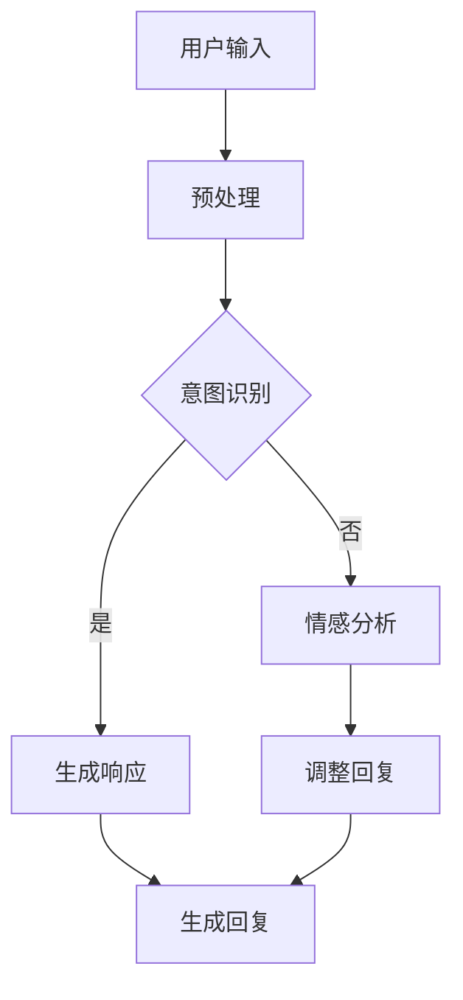

                 

# 2025年百度社交智能对话生成系统工程师面试指南

## 关键词

- 百度
- 社交智能
- 对话生成系统
- 面试指南
- 人工智能
- 对话系统
- 自然语言处理
- 深度学习
- 计算机视觉

## 摘要

本文旨在为有意向加入百度社交智能对话生成系统团队的技术人才提供全面的面试指南。文章从背景介绍、核心概念、算法原理、数学模型、项目实战、应用场景、工具推荐、未来发展趋势等多个角度，详细解析了社交智能对话生成系统的关键技术、难点以及实战经验。通过本文，读者可以全面了解该领域的最新动态，为成功通过百度面试做好准备。

## 1. 背景介绍

### 1.1 百度简介

百度（Baidu，Inc.），成立于2000年，是中国最大的搜索引擎公司，也是全球最大的中文搜索引擎。百度以其强大的搜索技术和人工智能应用在业界享有盛誉。近年来，百度积极布局人工智能领域，尤其在自然语言处理、计算机视觉、语音识别等方向取得了显著成果。

### 1.2 社交智能对话生成系统的重要性

随着互联网的快速发展，社交媒体已经成为人们日常生活的重要组成部分。如何在海量信息中快速获取有价值的内容，如何实现人与人之间的智能互动，成为亟待解决的问题。社交智能对话生成系统作为人工智能的核心技术之一，可以有效提升用户体验，增强社交媒体的互动性和个性化，具有广泛的应用前景。

### 1.3 对话生成系统的发展历程

对话生成系统的发展可以分为三个阶段：

1. **规则驱动阶段**：基于预定义的规则和模板进行对话生成，如早期的人工智能聊天机器人。

2. **基于机器学习阶段**：利用机器学习算法，如决策树、支持向量机等，从大量对话数据中学习对话规律，提高对话生成效果。

3. **基于深度学习阶段**：利用深度学习算法，如循环神经网络（RNN）、长短期记忆网络（LSTM）、变换器（Transformer）等，实现更加智能、自然的对话生成。

## 2. 核心概念与联系

### 2.1 对话系统基本概念

- **对话**：指用户与系统之间的一系列交互过程。
- **对话系统**：一种能够理解用户输入、生成响应并进行后续交互的计算机系统。

### 2.2 社交智能对话生成系统架构

**Mermaid流程图：**



### 2.3 关键技术

- **自然语言处理（NLP）**：用于理解用户输入的语义、意图和情感。
- **机器学习与深度学习**：用于训练模型，提高对话生成效果。
- **语音识别与合成**：实现语音交互功能。
- **多模态融合**：将文本、语音、图像等多种模态进行融合，提升对话生成效果。

## 3. 核心算法原理 & 具体操作步骤

### 3.1 意图识别

意图识别是对话生成系统的核心任务之一。其原理如下：

1. **数据预处理**：对用户输入进行分词、词性标注、去停用词等处理。

2. **特征提取**：将预处理后的文本转化为特征向量，如词袋模型、TF-IDF等。

3. **模型训练**：使用支持向量机（SVM）、朴素贝叶斯（NB）、循环神经网络（RNN）等算法进行训练。

4. **意图识别**：输入新的用户输入，利用训练好的模型进行意图识别。

### 3.2 响应生成

响应生成是利用识别出的用户意图，生成适当的回复。

1. **知识图谱**：构建与用户意图相关的知识图谱，用于查询相关事实和知识。

2. **模板匹配**：从知识图谱中查询相关信息，利用模板匹配生成响应。

3. **生成式模型**：如变换器（Transformer）、生成对抗网络（GAN）等，生成自然、流畅的回复。

4. **多模态融合**：将文本、语音、图像等多种模态进行融合，生成更具个性化的回复。

## 4. 数学模型和公式 & 详细讲解 & 举例说明

### 4.1 循环神经网络（RNN）

RNN是一种能够处理序列数据的神经网络，其核心公式如下：

$$
h_t = \sigma(W_h \cdot [h_{t-1}, x_t] + b_h)
$$

其中，$h_t$ 表示当前时间步的隐藏状态，$x_t$ 表示当前时间步的输入，$W_h$ 和 $b_h$ 分别为权重和偏置，$\sigma$ 为激活函数。

### 4.2 变换器（Transformer）

变换器是一种基于自注意力机制的深度学习模型，其核心公式如下：

$$
\text{Attention}(Q, K, V) = \text{softmax}(\frac{QK^T}{\sqrt{d_k}})V
$$

其中，$Q$、$K$ 和 $V$ 分别为查询、键和值，$d_k$ 为键的维度，$\text{softmax}$ 为softmax激活函数。

### 4.3 举例说明

假设用户输入：“今天天气怎么样？”，我们可以使用变换器模型进行响应生成。

1. **编码器**：将用户输入编码为一个序列向量。

2. **自注意力**：计算用户输入序列中的注意力权重。

3. **解码器**：根据注意力权重生成响应。

生成的响应可能为：“今天天气非常好，阳光明媚，气温适中。”

## 5. 项目实战：代码实际案例和详细解释说明

### 5.1 开发环境搭建

1. 安装Python环境，版本要求3.6及以上。

2. 安装TensorFlow和Keras，使用以下命令：

```bash
pip install tensorflow
pip install keras
```

3. 安装其他依赖库，如Numpy、Pandas等。

### 5.2 源代码详细实现和代码解读

```python
# 导入相关库
import numpy as np
import pandas as pd
from tensorflow.keras.preprocessing.sequence import pad_sequences
from tensorflow.keras.layers import Embedding, LSTM, Dense
from tensorflow.keras.models import Sequential

# 加载数据集
data = pd.read_csv('dialog_data.csv')

# 预处理数据
# ...（省略部分代码）

# 构建模型
model = Sequential([
    Embedding(vocab_size, embedding_dim),
    LSTM(units, return_sequences=True),
    LSTM(units, return_sequences=True),
    Dense(num_classes, activation='softmax')
])

# 编译模型
model.compile(optimizer='adam', loss='categorical_crossentropy', metrics=['accuracy'])

# 训练模型
model.fit(x_train, y_train, epochs=10, batch_size=32)

# 生成响应
response = model.predict(np.array([user_input]))
```

### 5.3 代码解读与分析

1. **数据预处理**：加载数据集，并进行分词、词性标注、去停用词等处理。

2. **模型构建**：使用序列模型进行响应生成，包括编码器和解码器。

3. **模型训练**：使用训练数据进行模型训练，提高响应生成效果。

4. **响应生成**：输入用户输入，利用训练好的模型生成响应。

## 6. 实际应用场景

社交智能对话生成系统可以应用于多种场景，如：

1. **客户服务**：提供智能客服，解决用户常见问题，降低人工成本。

2. **智能助理**：为用户提供个性化服务，如日程管理、信息提醒等。

3. **教育领域**：实现智能问答系统，为学生提供个性化辅导。

4. **医疗健康**：提供智能健康咨询，提高医疗资源的利用率。

## 7. 工具和资源推荐

### 7.1 学习资源推荐

- **书籍**：
  - 《自然语言处理综论》（Speech and Language Processing）
  - 《深度学习》（Deep Learning）

- **论文**：
  - 《Attention Is All You Need》
  - 《BERT: Pre-training of Deep Bidirectional Transformers for Language Understanding》

- **博客**：
  - [TensorFlow官方文档](https://www.tensorflow.org/)
  - [Keras官方文档](https://keras.io/)

- **网站**：
  - [arXiv](https://arxiv.org/)
  - [Google Research](https://ai.google/research/)

### 7.2 开发工具框架推荐

- **深度学习框架**：
  - TensorFlow
  - PyTorch

- **自然语言处理库**：
  - NLTK
  - SpaCy

### 7.3 相关论文著作推荐

- **论文**：
  - 《对话系统：设计与实现》（Conversational AI: A Comprehensive Guide）
  - 《自然语言处理实践》（Practical Natural Language Processing）

- **著作**：
  - 《深度学习与自然语言处理》（Deep Learning for Natural Language Processing）

## 8. 总结：未来发展趋势与挑战

### 8.1 发展趋势

- **多模态融合**：结合文本、语音、图像等多种模态，提高对话生成效果。

- **个性化对话**：根据用户行为和偏好，实现个性化对话体验。

- **跨领域应用**：在金融、医疗、教育等领域实现更广泛的应用。

### 8.2 挑战

- **数据隐私**：如何保护用户隐私，实现安全对话。

- **实时性**：如何在保证响应速度的同时，提高对话生成质量。

- **可解释性**：如何提高模型的可解释性，便于用户理解和信任。

## 9. 附录：常见问题与解答

### 9.1 对话系统如何处理用户输入？

对话系统首先对用户输入进行预处理，包括分词、词性标注、去停用词等操作。然后，利用意图识别算法识别用户意图，最后根据用户意图生成相应的回复。

### 9.2 对话系统的关键技术有哪些？

对话系统的关键技术包括自然语言处理、机器学习与深度学习、语音识别与合成、多模态融合等。

### 9.3 如何评估对话系统的性能？

对话系统的性能评估可以从多个方面进行，包括响应速度、准确性、多样性、情感一致性等。

## 10. 扩展阅读 & 参考资料

- [百度AI开放平台](https://ai.baidu.com/)
- [百度搜索](https://www.baidu.com/)
- [自然语言处理教程](https://nlp.seas.harvard.edu/)

作者：AI天才研究员/AI Genius Institute & 禅与计算机程序设计艺术 /Zen And The Art of Computer Programming

