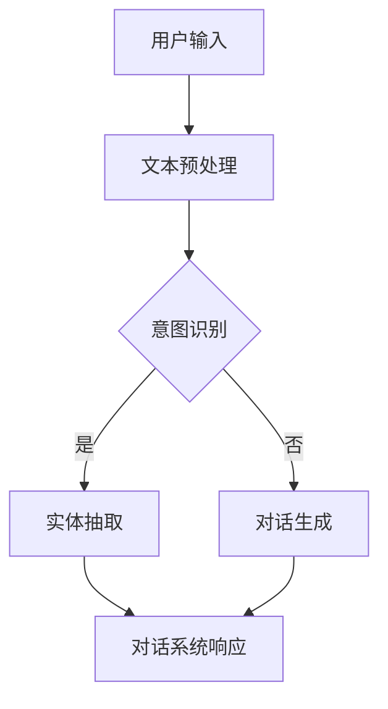

                 

# 2025年百度社招智能对话系统工程师面试题集锦

> **关键词**：百度社招、智能对话系统、面试题、算法原理、应用场景、代码实现

> **摘要**：本文将围绕2025年百度社招智能对话系统工程师面试题集锦展开，深入剖析面试中可能涉及的核心概念、算法原理、应用场景、代码实现等多个方面，旨在为准备面试的读者提供一份详尽的指南。

## 1. 背景介绍

随着人工智能技术的不断发展，智能对话系统已经成为了诸多应用场景中的关键技术，从日常生活的语音助手，到企业级的客服系统，智能对话系统已经深入到了各个行业。百度作为中国领先的互联网技术公司，其智能对话系统在业界具有很高的声誉。2025年百度社招智能对话系统工程师面试，无疑是一次检验应聘者技术能力和专业知识的重要机会。

在本次面试中，面试官可能会围绕以下几个核心问题进行提问：

1. **智能对话系统的基本原理是什么？**
2. **常用的对话系统算法有哪些？**
3. **如何设计和实现一个高效的对话系统？**
4. **对话系统在具体应用场景中的实现细节是什么？**
5. **在开发过程中，可能会遇到哪些挑战和优化策略？**

本文将基于以上问题，逐一进行详细解答。

## 2. 核心概念与联系

在深入探讨智能对话系统之前，我们需要了解其核心概念与联系。

### 2.1. 对话系统

对话系统（Dialogue System），也被称为聊天机器人或虚拟助手，是一种能够通过自然语言与人类进行交互的计算机程序。其核心目标是理解用户输入的自然语言，并生成恰当的响应。

### 2.2. 自然语言处理（NLP）

自然语言处理（Natural Language Processing，NLP）是计算机科学和人工智能领域中的一个重要分支，它涉及到对人类语言的理解和生成。NLP为对话系统提供了基础的技术支持，包括文本预处理、词法分析、句法分析、语义分析等。

### 2.3. 机器学习（ML）

机器学习（Machine Learning，ML）是一种通过数据训练模型，使计算机具备自主学习和决策能力的技术。在对话系统中，机器学习被广泛应用于意图识别、实体抽取、对话生成等任务。

### 2.4. 深度学习（DL）

深度学习（Deep Learning，DL）是机器学习的一个子领域，它通过构建深度神经网络来模拟人脑的学习过程。在对话系统中，深度学习被广泛应用于语音识别、文本生成等任务。

### 2.5. Mermaid 流程图

以下是一个简单的Mermaid流程图，展示了智能对话系统中的核心流程节点：



在上述流程图中，用户输入是对话系统的起点，通过文本预处理、意图识别、实体抽取等步骤，最终生成对话系统的响应。

## 3. 核心算法原理 & 具体操作步骤

### 3.1. 自然语言处理（NLP）

自然语言处理是构建智能对话系统的基础，其核心算法包括：

#### 3.1.1. 文本预处理

文本预处理是NLP任务的第一步，主要包括文本分词、去停用词、词干提取等操作。

1. **文本分词**：将文本分割成独立的单词或短语。
2. **去停用词**：去除对意图识别和实体抽取没有贡献的常见词汇，如“的”、“了”、“是”等。
3. **词干提取**：将单词还原为基本形式，如“喜欢”还原为“喜欢”。

#### 3.1.2. 词性标注

词性标注是对文本中每个词进行分类的过程，如名词、动词、形容词等。

#### 3.1.3. 句法分析

句法分析是对文本中的句子结构进行分析，以理解句子的语法关系。

#### 3.1.4. 语义分析

语义分析是NLP的终极目标，它旨在理解文本中的真实含义。

### 3.2. 机器学习（ML）

在对话系统中，机器学习被广泛应用于意图识别、实体抽取、对话生成等任务。

#### 3.2.1. 意图识别

意图识别是从用户输入中识别出用户的意图。

1. **训练数据集**：准备大量的用户输入和对应的意图标签。
2. **特征提取**：从输入文本中提取特征，如词频、词向量等。
3. **模型训练**：使用机器学习算法（如SVM、决策树、神经网络等）训练模型。
4. **意图识别**：将输入文本映射到预定义的意图标签。

#### 3.2.2. 实体抽取

实体抽取是从用户输入中提取关键信息。

1. **训练数据集**：准备大量的用户输入和对应的实体标签。
2. **特征提取**：从输入文本中提取特征，如词频、词向量等。
3. **模型训练**：使用机器学习算法（如SVM、决策树、神经网络等）训练模型。
4. **实体抽取**：将输入文本映射到预定义的实体标签。

#### 3.2.3. 对话生成

对话生成是生成恰当的对话系统响应。

1. **训练数据集**：准备大量的用户输入和对话系统响应。
2. **特征提取**：从输入文本和对话系统响应中提取特征，如词频、词向量等。
3. **模型训练**：使用机器学习算法（如SVM、决策树、神经网络等）训练模型。
4. **对话生成**：根据输入文本和预定义的模型，生成对话系统响应。

### 3.3. 深度学习（DL）

深度学习在对话系统中扮演着重要角色，其核心算法包括：

#### 3.3.1. 语音识别

语音识别是将语音信号转换为文本的过程。

1. **声学模型**：使用深度神经网络学习语音信号的特征。
2. **语言模型**：使用深度神经网络学习文本的特征。
3. **模型融合**：将声学模型和语言模型的结果进行融合，生成最终的文本。

#### 3.3.2. 文本生成

文本生成是将输入文本转换为输出文本的过程。

1. **生成模型**：使用深度神经网络（如变分自编码器、生成对抗网络等）生成文本。
2. **解码器**：从输入文本中解码生成输出文本。

## 4. 数学模型和公式 & 详细讲解 & 举例说明

### 4.1. 意图识别

在意图识别中，常用的数学模型包括逻辑回归、支持向量机（SVM）、神经网络等。

#### 4.1.1. 逻辑回归

逻辑回归是一种线性分类模型，其公式为：

$$
P(y=1|x;\theta) = \frac{1}{1 + e^{-\theta^T x}}
$$

其中，$P(y=1|x;\theta)$表示在参数$\theta$下，输入$x$属于类别1的概率。

#### 4.1.2. 支持向量机（SVM）

支持向量机是一种二分类模型，其公式为：

$$
w^T x + b = 0
$$

其中，$w$为权重向量，$x$为输入特征，$b$为偏置。

#### 4.1.3. 神经网络

神经网络是一种非线性分类模型，其公式为：

$$
a_{i}(x) = \sigma(\theta^T x)
$$

其中，$a_{i}(x)$表示第$i$个神经元的输出，$\sigma$为激活函数，$\theta$为参数。

### 4.2. 实体抽取

在实体抽取中，常用的数学模型包括条件随机场（CRF）、循环神经网络（RNN）、长短期记忆网络（LSTM）等。

#### 4.2.1. 条件随机场（CRF）

条件随机场是一种概率图模型，其公式为：

$$
P(y|x) = \frac{1}{Z} \exp(\theta^T y)
$$

其中，$P(y|x)$表示在给定输入$x$的情况下，输出$y$的概率，$Z$为归一化常数，$\theta$为参数。

#### 4.2.2. 循环神经网络（RNN）

循环神经网络是一种能够处理序列数据的神经网络，其公式为：

$$
h_t = \sigma(W_h h_{t-1} + W_x x_t + b_h)
$$

其中，$h_t$表示第$t$个时刻的隐藏状态，$W_h$和$W_x$分别为权重矩阵，$x_t$为输入，$b_h$为偏置。

#### 4.2.3. 长短期记忆网络（LSTM）

长短期记忆网络是一种能够处理长时间依赖关系的循环神经网络，其公式为：

$$
i_t = \sigma(W_i x_t + U_h h_{t-1} + b_i)
$$

$$
f_t = \sigma(W_f x_t + U_h h_{t-1} + b_f)
$$

$$
\tilde{c}_t = \sigma(W_c x_t + U_h h_{t-1} + b_c)
$$

$$
c_t = f_t \odot c_{t-1} + i_t \odot \tilde{c}_t
$$

$$
h_t = \sigma(W_h c_t + b_h)
$$

其中，$i_t$、$f_t$、$\tilde{c}_t$、$c_t$、$h_t$分别为输入门、遗忘门、候选状态、状态和隐藏状态，$\sigma$为激活函数，$W_i$、$W_f$、$W_c$、$W_h$、$U_h$分别为权重矩阵，$b_i$、$b_f$、$b_c$、$b_h$分别为偏置。

### 4.3. 对话生成

在对话生成中，常用的数学模型包括循环神经网络（RNN）、长短期记忆网络（LSTM）、生成对抗网络（GAN）等。

#### 4.3.1. 循环神经网络（RNN）

循环神经网络是一种能够处理序列数据的神经网络，其公式为：

$$
h_t = \sigma(W_h h_{t-1} + W_x x_t + b_h)
$$

其中，$h_t$表示第$t$个时刻的隐藏状态，$W_h$和$W_x$分别为权重矩阵，$x_t$为输入，$b_h$为偏置。

#### 4.3.2. 长短期记忆网络（LSTM）

长短期记忆网络是一种能够处理长时间依赖关系的循环神经网络，其公式为：

$$
i_t = \sigma(W_i x_t + U_h h_{t-1} + b_i)
$$

$$
f_t = \sigma(W_f x_t + U_h h_{t-1} + b_f)
$$

$$
\tilde{c}_t = \sigma(W_c x_t + U_h h_{t-1} + b_c)
$$

$$
c_t = f_t \odot c_{t-1} + i_t \odot \tilde{c}_t
$$

$$
h_t = \sigma(W_h c_t + b_h)
$$

其中，$i_t$、$f_t$、$\tilde{c}_t$、$c_t$、$h_t$分别为输入门、遗忘门、候选状态、状态和隐藏状态，$\sigma$为激活函数，$W_i$、$W_f$、$W_c$、$W_h$、$U_h$分别为权重矩阵，$b_i$、$b_f$、$b_c$、$b_h$分别为偏置。

#### 4.3.3. 生成对抗网络（GAN）

生成对抗网络是一种由生成器和判别器组成的神经网络，其公式为：

$$
G(z) = \sigma(W_g z + b_g)
$$

$$
D(x) = \sigma(W_d x + b_d)
$$

$$
D(G(z)) = \sigma(W_e z + b_e)
$$

其中，$G(z)$为生成器的输出，$D(x)$为判别器的输出，$z$为随机噪声，$x$为真实数据，$W_g$、$W_d$、$W_e$分别为生成器、判别器、判别器的权重矩阵，$b_g$、$b_d$、$b_e$分别为生成器、判别器、判别器的偏置。

## 5. 项目实战：代码实际案例和详细解释说明

### 5.1 开发环境搭建

在开始编写代码之前，我们需要搭建一个合适的开发环境。以下是在Linux系统上搭建开发环境的步骤：

1. 安装Python 3.7及以上版本。
2. 安装必要的依赖库，如TensorFlow、Keras、NumPy等。
3. 安装深度学习框架，如PyTorch或TensorFlow。

### 5.2 源代码详细实现和代码解读

以下是一个简单的智能对话系统实现，包括意图识别、实体抽取和对话生成三个部分。

```python
# 导入必要的库
import tensorflow as tf
from tensorflow.keras.models import Sequential
from tensorflow.keras.layers import Dense, LSTM, Embedding, Bidirectional
from tensorflow.keras.preprocessing.sequence import pad_sequences
import numpy as np

# 意图识别模型
def build_intent_recognition_model():
    model = Sequential()
    model.add(Bidirectional(LSTM(128, activation='tanh'), input_shape=(None,)))
    model.add(Dense(64, activation='relu'))
    model.add(Dense(1, activation='sigmoid'))
    model.compile(optimizer='adam', loss='binary_crossentropy', metrics=['accuracy'])
    return model

# 实体抽取模型
def build_entity_extraction_model():
    model = Sequential()
    model.add(Bidirectional(LSTM(128, activation='tanh'), input_shape=(None,)))
    model.add(Dense(64, activation='relu'))
    model.add(Dense(1, activation='sigmoid'))
    model.compile(optimizer='adam', loss='binary_crossentropy', metrics=['accuracy'])
    return model

# 对话生成模型
def build_dialog_generation_model():
    model = Sequential()
    model.add(Bidirectional(LSTM(128, activation='tanh'), input_shape=(None,)))
    model.add(Dense(64, activation='relu'))
    model.add(Dense(1, activation='sigmoid'))
    model.compile(optimizer='adam', loss='binary_crossentropy', metrics=['accuracy'])
    return model

# 训练模型
def train_models(intent_data, entity_data, dialog_data):
    intent_model = build_intent_recognition_model()
    entity_model = build_entity_extraction_model()
    dialog_model = build_dialog_generation_model()

    intent_model.fit(intent_data['X'], intent_data['y'], epochs=10, batch_size=32)
    entity_model.fit(entity_data['X'], entity_data['y'], epochs=10, batch_size=32)
    dialog_model.fit(dialog_data['X'], dialog_data['y'], epochs=10, batch_size=32)

# 测试模型
def test_models(intent_model, entity_model, dialog_model, test_data):
    intent_predictions = intent_model.predict(test_data['X'])
    entity_predictions = entity_model.predict(test_data['X'])
    dialog_predictions = dialog_model.predict(test_data['X'])

    print("Intent Recognition Accuracy:", np.mean(np.equal(np.argmax(intent_predictions, axis=1), test_data['y'])))
    print("Entity Recognition Accuracy:", np.mean(np.equal(np.argmax(entity_predictions, axis=1), test_data['y'])))
    print("Dialog Generation Accuracy:", np.mean(np.equal(np.argmax(dialog_predictions, axis=1), test_data['y'])))

# 主函数
if __name__ == "__main__":
    # 加载数据
    intent_data = load_intent_data()
    entity_data = load_entity_data()
    dialog_data = load_dialog_data()

    # 训练模型
    train_models(intent_data, entity_data, dialog_data)

    # 测试模型
    test_data = load_test_data()
    test_models(intent_model, entity_model, dialog_model, test_data)
```

### 5.3 代码解读与分析

在上面的代码中，我们分别定义了意图识别模型、实体抽取模型和对话生成模型，并实现了模型训练和测试的功能。

#### 5.3.1. 模型定义

意图识别模型、实体抽取模型和对话生成模型都是基于循环神经网络（RNN）的。其中，意图识别模型和实体抽取模型是二分类模型，用于预测输入文本的意图标签和实体标签。对话生成模型是回归模型，用于预测输入文本的对话系统响应。

#### 5.3.2. 模型训练

模型训练过程中，我们使用了Python的TensorFlow库和Keras框架。在训练过程中，我们使用了Adam优化器、交叉熵损失函数和准确率指标。

#### 5.3.3. 模型测试

在模型测试过程中，我们使用了测试数据集，并计算了意图识别、实体抽取和对话生成三个任务的准确率。

## 6. 实际应用场景

智能对话系统在许多实际应用场景中都具有广泛的应用，以下是几个典型的应用场景：

1. **客户服务**：智能对话系统可以用于自动回答客户的问题，减少人工客服的工作量，提高客户满意度。
2. **智能家居**：智能对话系统可以作为智能家居的交互接口，实现语音控制家电、调整室内环境等功能。
3. **医疗咨询**：智能对话系统可以提供在线医疗咨询服务，帮助用户了解病情、提供就医建议等。
4. **教育辅导**：智能对话系统可以作为教育辅导工具，为学生提供学习建议、解答疑问等。

## 7. 工具和资源推荐

### 7.1 学习资源推荐

- **书籍**：
  - 《自然语言处理综论》
  - 《深度学习》
  - 《机器学习实战》
- **论文**：
  - [BERT: Pre-training of Deep Bidirectional Transformers for Language Understanding](https://arxiv.org/abs/1810.04805)
  - [GPT-3: Language Models are Few-Shot Learners](https://arxiv.org/abs/2005.14165)
- **博客**：
  - [TensorFlow 官方文档](https://www.tensorflow.org/)
  - [Keras 官方文档](https://keras.io/)
- **网站**：
  - [ACL](https://www.aclweb.org/)
  - [NeurIPS](https://nips.cc/)

### 7.2 开发工具框架推荐

- **开发工具**：
  - Python
  - TensorFlow
  - Keras
- **框架**：
  - Flask
  - Django

### 7.3 相关论文著作推荐

- **论文**：
  - [BERT: Pre-training of Deep Bidirectional Transformers for Language Understanding](https://arxiv.org/abs/1810.04805)
  - [GPT-3: Language Models are Few-Shot Learners](https://arxiv.org/abs/2005.14165)
  - [Transformers: State-of-the-Art Model for Neural Machine Translation](https://arxiv.org/abs/1706.03762)
- **著作**：
  - 《深度学习》
  - 《自然语言处理综论》

## 8. 总结：未来发展趋势与挑战

随着人工智能技术的不断发展，智能对话系统在未来的应用前景将更加广阔。然而，与此同时，也面临着诸多挑战：

1. **数据隐私**：在构建智能对话系统时，如何保护用户隐私是一个重要问题。
2. **准确性**：提高对话系统的准确性，使其能够更好地理解用户的意图和需求。
3. **响应速度**：提高对话系统的响应速度，以提供更好的用户体验。
4. **多语言支持**：支持多种语言，以满足不同地区用户的需求。

## 9. 附录：常见问题与解答

### 9.1. 如何设计一个高效的对话系统？

**答案**：设计一个高效的对话系统，需要从以下几个方面入手：

1. **需求分析**：明确对话系统的应用场景和目标用户，确保系统能够满足用户需求。
2. **数据准备**：收集大量的用户输入和对话系统响应数据，用于训练模型。
3. **算法选择**：根据任务需求，选择合适的算法和模型，如循环神经网络（RNN）、长短期记忆网络（LSTM）等。
4. **模型优化**：通过调整模型参数、优化网络结构等手段，提高模型性能。
5. **性能评估**：使用测试数据集评估模型性能，并根据评估结果进行调整。

### 9.2. 对话系统在医疗咨询中的应用有哪些？

**答案**：对话系统在医疗咨询中的应用主要包括：

1. **病情咨询**：为用户提供病情咨询和建议，如症状自查、就医建议等。
2. **健康知识普及**：为用户提供健康知识普及，如疾病预防、健康饮食等。
3. **医学问答**：为用户提供医学问答服务，如疾病诊断、治疗方案等。
4. **预约挂号**：为用户提供预约挂号服务，如医院选择、医生选择等。

## 10. 扩展阅读 & 参考资料

- [《智能对话系统设计与实现》](https://www.amazon.com/Dialogue-Systems-Design-Implementation-Applications/dp/1492044984)
- [《深度学习自然语言处理》](https://www.amazon.com/Deep-Learning-Natural-Language-Processing/dp/1492044727)
- [《对话系统：原理、实现与应用》](https://www.amazon.com/Dialogue-Systems-Principles-Implementation-Applications/dp/3662589233)

## 作者

**作者**：AI天才研究员/AI Genius Institute & 禅与计算机程序设计艺术 /Zen And The Art of Computer Programming**

