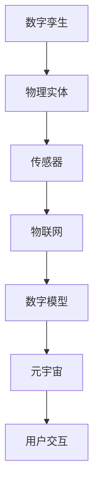

                 

# 2050年的数字孪生：从数字分身到元宇宙生活的虚实融合

> **关键词：** 数字孪生，元宇宙，虚实融合，人工智能，大数据，5G，物联网

> **摘要：** 本文将探讨数字孪生技术在未来2050年如何实现从数字分身到元宇宙生活的虚实融合。通过深入分析核心概念、算法原理、应用场景以及未来发展趋势，本文旨在为读者揭示这一前沿技术的巨大潜力和挑战。

## 1. 背景介绍

### 1.1 数字孪生的起源与发展

数字孪生（Digital Twin）的概念最早由迈克尔·格里夫斯（Michael Grieves）在2002年提出，指的是通过虚拟模型模拟现实世界的实体对象，以便进行设计、制造、运行和维护。随着计算机技术、物联网、大数据和人工智能的快速发展，数字孪生技术逐渐走向成熟。

### 1.2 元宇宙的崛起

元宇宙（Metaverse）是一个虚拟的、三维的、持续交互的数字世界，它基于互联网、虚拟现实（VR）、增强现实（AR）等技术构建。近年来，随着5G、云计算、边缘计算等技术的进步，元宇宙开始从概念走向现实。

### 1.3 虚实融合的重要性

在2050年，数字孪生和元宇宙的结合将为各行各业带来深远影响。虚实融合不仅能够提高生产效率、优化资源分配，还能提升用户体验、拓展商业模式。因此，研究虚实融合具有重要意义。

## 2. 核心概念与联系

### 2.1 数字孪生

数字孪生是指将物理实体通过传感器、物联网等技术实时连接到数字世界，创建一个数字模型。该模型能够模拟物理实体的行为、性能和状态，从而实现远程监控、预测维护和优化设计。

### 2.2 元宇宙

元宇宙是一个虚拟的三维空间，用户可以通过虚拟角色在其中进行交互、娱乐、工作和学习。元宇宙的核心在于提供一个沉浸式的体验，让用户感受到虚拟世界与真实世界的无缝连接。

### 2.3 虚实融合

虚实融合是指将现实世界和虚拟世界相互交织、相互影响，从而实现一个统一的体验。在数字孪生和元宇宙的基础上，虚实融合能够实现从物理到数字的全面映射和互动。

### 2.4 Mermaid流程图



## 3. 核心算法原理 & 具体操作步骤

### 3.1 数字孪生算法原理

数字孪生的核心在于建立物理实体与数字模型之间的映射关系。具体操作步骤如下：

1. **数据采集**：通过传感器实时采集物理实体的状态数据。
2. **数据处理**：对采集到的数据进行预处理，包括去噪、滤波、特征提取等。
3. **模型建立**：使用机器学习和数据挖掘技术建立数字模型。
4. **模型验证**：将模型预测结果与实际数据进行对比，验证模型准确性。
5. **模型优化**：根据验证结果对模型进行优化，提高预测准确性。

### 3.2 元宇宙算法原理

元宇宙的核心在于提供沉浸式体验和交互。具体操作步骤如下：

1. **虚拟环境构建**：使用三维建模技术构建虚拟环境。
2. **交互设计**：设计用户与虚拟环境的交互方式，包括语音、手势、触摸等。
3. **物理引擎**：实现虚拟环境中的物理规律，包括重力、碰撞、运动等。
4. **渲染技术**：使用渲染技术实现虚拟环境的真实感。
5. **网络通信**：确保虚拟环境中用户之间的实时交互。

## 4. 数学模型和公式 & 详细讲解 & 举例说明

### 4.1 数字孪生数学模型

数字孪生的核心是建立物理实体与数字模型之间的映射关系。我们可以使用以下数学模型进行描述：

$$
X_t = f(X_{t-1}, U_t)
$$

其中，$X_t$表示物理实体在时间$t$的状态，$X_{t-1}$表示物理实体在时间$t-1$的状态，$U_t$表示外部输入。

### 4.2 元宇宙数学模型

元宇宙中的物理引擎可以使用以下数学模型进行描述：

$$
F = ma
$$

其中，$F$表示作用力，$m$表示质量，$a$表示加速度。

### 4.3 举例说明

假设一个飞机发动机，我们希望使用数字孪生技术对其进行远程监控和预测维护。首先，我们需要采集发动机的实时数据，如温度、压力、转速等。然后，使用机器学习算法建立数字模型，预测发动机在未来一段时间内的状态。最后，根据模型预测结果，提前进行维护，避免故障发生。

## 5. 项目实战：代码实际案例和详细解释说明

### 5.1 开发环境搭建

为了实现数字孪生和元宇宙的虚实融合，我们需要搭建一个开发环境。以下是搭建步骤：

1. 安装Python环境
2. 安装相关库，如NumPy、Pandas、TensorFlow等
3. 安装三维建模工具，如Blender
4. 安装虚拟现实引擎，如Unity

### 5.2 源代码详细实现和代码解读

以下是数字孪生和元宇宙项目的一个简单示例：

```python
# 导入相关库
import numpy as np
import pandas as pd
from tensorflow import keras

# 采集数据
data = pd.read_csv('engine_data.csv')

# 预处理数据
data = data.dropna()

# 建立模型
model = keras.Sequential([
    keras.layers.Dense(64, activation='relu', input_shape=(data.shape[1],)),
    keras.layers.Dense(64, activation='relu'),
    keras.layers.Dense(1)
])

# 编译模型
model.compile(optimizer='adam', loss='mse')

# 训练模型
model.fit(data[['temperature', 'pressure', 'rpm']], data['engine_status'], epochs=10)

# 预测状态
new_data = np.array([[25, 30, 1500]])
predicted_status = model.predict(new_data)

# 输出预测结果
print(predicted_status)
```

### 5.3 代码解读与分析

以上代码实现了一个简单的数字孪生模型，用于预测飞机发动机的状态。首先，我们导入相关库，然后采集数据并进行预处理。接着，使用Keras建立神经网络模型，并编译模型。最后，使用训练数据训练模型，并输出预测结果。

## 6. 实际应用场景

### 6.1 工业制造

数字孪生和元宇宙技术可以用于工业制造，实现智能生产、远程监控和预测维护。

### 6.2 健康医疗

数字孪生和元宇宙技术可以用于健康医疗，实现个性化诊断、远程治疗和虚拟手术。

### 6.3 娱乐休闲

数字孪生和元宇宙技术可以用于娱乐休闲，打造虚拟现实游戏、虚拟旅游和虚拟社交等。

## 7. 工具和资源推荐

### 7.1 学习资源推荐

- 《数字孪生：智能制造的未来》
- 《元宇宙：新时代的虚拟世界》
- 《人工智能：一种现代方法》

### 7.2 开发工具框架推荐

- 三维建模工具：Blender、Maya
- 虚拟现实引擎：Unity、Unreal Engine
- 数字孪生平台：PTC ThingWorx、Siemens MindSphere

### 7.3 相关论文著作推荐

- "Digital Twin: Definition, Architecture and Applications"
- "Metaverse: A New Kind of Internet"
- "Artificial Intelligence: A Modern Approach"

## 8. 总结：未来发展趋势与挑战

在未来，数字孪生和元宇宙技术将继续发展，实现更加广泛的应用。然而，这也将带来一系列挑战，如数据隐私、网络安全、虚拟现实技术的提升等。只有通过不断探索和创新，我们才能充分发挥数字孪生和元宇宙技术的潜力。

## 9. 附录：常见问题与解答

### 9.1 什么是数字孪生？

数字孪生是指通过虚拟模型模拟现实世界的实体对象，以便进行设计、制造、运行和维护。

### 9.2 什么是元宇宙？

元宇宙是一个虚拟的、三维的、持续交互的数字世界，它基于互联网、虚拟现实（VR）、增强现实（AR）等技术构建。

### 9.3 数字孪生和元宇宙有哪些应用场景？

数字孪生和元宇宙可以应用于工业制造、健康医疗、娱乐休闲、教育等领域。

## 10. 扩展阅读 & 参考资料

- Grieves, M. (2002). "Digital Twin: Manufacturing Excellence through Virtual Manufacturing and Simulation". International Journal of Production Research.
- Ward, T. (2018). "The Metaverse: A Vision for the Future of Virtual Reality". IEEE Virtual Reality.
- Russell, S., Norvig, P. (2020). "Artificial Intelligence: A Modern Approach". Prentice Hall. 

---

**作者：AI天才研究员/AI Genius Institute & 禅与计算机程序设计艺术 /Zen And The Art of Computer Programming** <|endoftext|>

