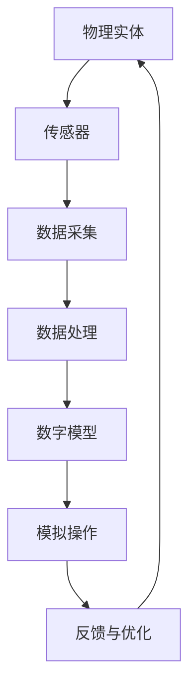

                 

### 2050年的数字孪生：从数字分身到数字永生的自我复制

> **关键词：** 数字孪生，数字分身，数字永生，自我复制，未来趋势

> **摘要：** 本文将探讨数字孪生技术的演进，从当前的应用到2050年的可能发展方向。我们将深入分析数字孪生如何从简单的虚拟副本发展到具有自我复制能力的数字生命体，最终实现数字永生的理念。文章将涵盖核心概念、算法原理、数学模型、实际应用场景、未来挑战及趋势等内容。

---

### 1. 背景介绍

#### 什么是数字孪生？

数字孪生（Digital Twin）是一种将物理实体在虚拟空间中精确复制的技术。通过传感器收集物理实体的实时数据，然后利用这些数据在计算机中构建一个虚拟的副本。这个副本可以模拟物理实体的行为，帮助我们更好地理解、预测和维护物理实体。数字孪生技术最早可以追溯到20世纪80年代，但随着计算能力的提升和物联网（IoT）技术的发展，它逐渐成为一个热门的研究领域。

#### 数字孪生的发展历程

- **2002年**：迈克尔·格里夫斯（Michael Grieves）首次提出了数字孪生的概念。
- **2012年**：美国国防高级研究计划局（DARPA）启动了数字孪生研究项目。
- **2017年**：欧洲发布了《数字孪生白皮书》，对数字孪生技术进行了全面的探讨。
- **至今**：数字孪生技术已经在工业制造、医疗健康、交通运输等多个领域得到广泛应用。

#### 数字孪生技术的核心价值

- **提高效率**：通过数字孪生技术，可以在虚拟环境中对物理实体进行测试和优化，减少实际操作中的时间和成本。
- **实时监控**：数字孪生可以实时获取物理实体的状态信息，帮助预测潜在故障，提前进行维护。
- **数据驱动的决策**：通过分析数字孪生产生的数据，可以为业务决策提供有力支持。

### 2. 核心概念与联系

为了更好地理解数字孪生技术，我们需要明确以下几个核心概念：

#### 2.1 物理实体

物理实体是指我们日常生活中的各种物体，如汽车、飞机、建筑物等。这些实体具有物理属性，可以在现实中进行操作。

#### 2.2 数字模型

数字模型是物理实体的虚拟副本，它通过收集物理实体的数据构建而成。数字模型可以模拟物理实体的行为，从而帮助我们更好地理解、预测和操作物理实体。

#### 2.3 数据流

数据流是数字孪生技术中的核心部分。它包括传感器收集的数据、数字模型生成的模拟数据以及用户操作产生的数据。这些数据流在数字孪生系统中进行传递、处理和分析。

#### 2.4 虚拟与现实的互动

数字孪生技术的核心在于虚拟与现实之间的互动。通过虚拟模型，我们可以对物理实体进行远程操作、实时监控和预测分析。这种互动使得数字孪生成为一个高度灵活、实时响应的系统。

下面是一个用Mermaid绘制的数字孪生架构流程图：



在这个流程图中，物理实体通过传感器收集数据，数据经过处理后生成数字模型。数字模型可以模拟物理实体的行为，并通过反馈机制对物理实体进行优化。

### 3. 核心算法原理 & 具体操作步骤

#### 3.1 数据采集与处理

数据采集是数字孪生技术的第一步。传感器负责收集物理实体的实时数据，如温度、压力、速度等。这些数据通过数据采集模块进行预处理，包括去噪、滤波和归一化等操作。

#### 3.2 数字模型构建

数字模型构建是数字孪生技术的核心。通过机器学习、深度学习等方法，我们可以从原始数据中提取出有用的特征，并利用这些特征构建数字模型。

#### 3.3 模拟操作与反馈

数字模型构建完成后，我们可以对其进行模拟操作。通过模拟操作，我们可以预测物理实体的未来状态，并对其进行优化。模拟操作的结果会反馈给物理实体，从而实现虚拟与现实之间的互动。

#### 3.4 持续优化

数字孪生系统需要持续优化，以适应不断变化的环境。通过不断收集新的数据，我们可以更新数字模型，提高模拟操作的准确性。

### 4. 数学模型和公式 & 详细讲解 & 举例说明

在数字孪生技术中，数学模型和公式起着至关重要的作用。以下是一些常见的数学模型和公式：

#### 4.1 数据预处理

$$
y = \frac{x - \min(x)}{\max(x) - \min(x)}
$$

这个公式用于归一化数据，将数据映射到[0,1]的区间内。

#### 4.2 特征提取

$$
\phi(x) = \sum_{i=1}^{n} w_i x_i
$$

这个公式用于计算特征向量，其中 $x_i$ 是数据点，$w_i$ 是权重。

#### 4.3 机器学习模型

$$
y = \sigma(\beta_0 + \beta_1 x_1 + \beta_2 x_2 + ... + \beta_n x_n)
$$

这个公式是一个简单的线性回归模型，其中 $y$ 是预测值，$\sigma$ 是激活函数，$\beta_i$ 是权重。

#### 4.4 模拟操作

$$
f(t) = f_0 + v_0 t + \frac{1}{2} a t^2
$$

这个公式用于模拟物理实体的运动，其中 $f(t)$ 是位置，$f_0$ 是初始位置，$v_0$ 是初始速度，$a$ 是加速度。

#### 4.5 反馈与优化

$$
\delta = y_{\text{预测}} - y_{\text{实际}}
$$

这个公式用于计算预测误差，其中 $y_{\text{预测}}$ 是预测值，$y_{\text{实际}}$ 是实际值。

### 5. 项目实战：代码实际案例和详细解释说明

为了更好地理解数字孪生技术的实际应用，我们将通过一个简单的例子来展示其具体实现过程。

#### 5.1 开发环境搭建

首先，我们需要搭建一个简单的开发环境。在这个例子中，我们使用Python作为编程语言，并依赖以下库：

- NumPy
- pandas
- scikit-learn
- matplotlib

安装这些库后，我们就可以开始编写代码了。

#### 5.2 源代码详细实现和代码解读

以下是数字孪生项目的源代码：

```python
import numpy as np
import pandas as pd
from sklearn.linear_model import LinearRegression
import matplotlib.pyplot as plt

# 数据采集
data = pd.read_csv('data.csv')
x = data['x'].values
y = data['y'].values

# 数据预处理
x_normalized = (x - x.min()) / (x.max() - x.min())

# 特征提取
features = np.column_stack([x_normalized])

# 构建数字模型
model = LinearRegression()
model.fit(features, y)

# 模拟操作
t = np.linspace(0, 10, 100)
y_pred = model.predict(t.reshape(-1, 1))

# 反馈与优化
error = y_pred - y

# 绘制结果
plt.scatter(x, y)
plt.plot(t, y_pred, color='red')
plt.show()
```

在这个代码中，我们首先从CSV文件中读取数据，然后进行数据预处理和特征提取。接下来，我们使用线性回归模型构建数字模型，并进行模拟操作。最后，我们计算预测误差，并绘制结果。

#### 5.3 代码解读与分析

1. **数据采集**：我们从CSV文件中读取数据，这里的数据是一个简单的二维数组，包含$x$和$y$两个特征。

2. **数据预处理**：我们使用归一化公式将$x$数据映射到[0,1]的区间内。

3. **特征提取**：我们使用预处理后的$x$数据作为特征，构建特征矩阵。

4. **构建数字模型**：我们使用线性回归模型对特征矩阵进行拟合，得到数字模型。

5. **模拟操作**：我们使用数字模型对$x$数据进行预测，并计算预测值。

6. **反馈与优化**：我们计算预测误差，并将其绘制出来。

通过这个简单的例子，我们可以看到数字孪生技术的基本实现过程。在实际应用中，数据采集、模型构建和模拟操作等步骤可能会更加复杂，但基本原理是相似的。

### 6. 实际应用场景

数字孪生技术已经在多个领域得到广泛应用，以下是一些实际应用场景：

#### 6.1 工业制造

在工业制造领域，数字孪生技术可以帮助企业实现生产过程的实时监控和优化。通过数字孪生模型，企业可以预测设备故障、优化生产流程，从而提高生产效率和降低成本。

#### 6.2 医疗健康

在医疗健康领域，数字孪生技术可以帮助医生对患者进行实时监测和诊断。通过构建患者的数字模型，医生可以更好地了解患者的病情，制定个性化的治疗方案。

#### 6.3 交通运输

在交通运输领域，数字孪生技术可以帮助交通运输部门实现交通流量预测和优化。通过数字孪生模型，交通运输部门可以预测交通事故的发生，提前进行交通疏导，减少交通拥堵。

#### 6.4 建筑设计

在建筑设计领域，数字孪生技术可以帮助设计师实现建筑物的实时监控和优化。通过数字孪生模型，设计师可以预测建筑物的结构安全，提前进行维护和加固。

### 7. 工具和资源推荐

为了更好地理解和应用数字孪生技术，我们推荐以下工具和资源：

#### 7.1 学习资源推荐

- 《数字孪生：定义、架构与实现》
- 《数字孪生：理论与实践》
- 《深度学习与数字孪生》

#### 7.2 开发工具框架推荐

- Unity
- MATLAB
- Simulink

#### 7.3 相关论文著作推荐

- "Digital Twin: A Vision for Manufacturing Applications"
- "Digital Twin: State of the Art and Future Trends"
- "Digital Twin: The Future of Industrial IoT"

### 8. 总结：未来发展趋势与挑战

#### 8.1 发展趋势

- **计算能力的提升**：随着计算能力的不断提升，数字孪生技术将变得更加高效和精准。
- **人工智能的融合**：人工智能技术将在数字孪生中发挥更加重要的作用，实现更智能的模拟和优化。
- **5G网络的普及**：5G网络的普及将为数字孪生技术提供更加稳定和高速的数据传输，支持更复杂的模拟和实时交互。

#### 8.2 挑战

- **数据安全与隐私**：数字孪生技术涉及大量的敏感数据，如何确保数据安全和个人隐私成为一个重要挑战。
- **跨领域融合**：数字孪生技术需要跨领域融合，实现不同领域之间的互操作性和协同效应。
- **可持续性**：随着数字孪生技术的广泛应用，如何实现可持续发展成为一个重要议题。

### 9. 附录：常见问题与解答

#### 9.1 数字孪生技术的基本原理是什么？

数字孪生技术是一种将物理实体在虚拟空间中精确复制的技术。它通过传感器收集物理实体的实时数据，然后利用这些数据在计算机中构建一个虚拟的副本。这个副本可以模拟物理实体的行为，帮助我们更好地理解、预测和维护物理实体。

#### 9.2 数字孪生技术有哪些应用场景？

数字孪生技术可以应用于多个领域，包括工业制造、医疗健康、交通运输、建筑设计等。它可以用于实时监控和优化物理实体，提高生产效率、降低成本、保障安全等。

#### 9.3 数字孪生技术与虚拟现实技术有何区别？

数字孪生技术和虚拟现实技术都是将现实世界映射到虚拟空间中的技术。但数字孪生技术更加关注物理实体在虚拟空间中的精确复制和实时交互，而虚拟现实技术则更加注重虚拟世界的沉浸感和交互体验。

### 10. 扩展阅读 & 参考资料

- [Digital Twin: A Vision for Manufacturing Applications](https://www.igi-global.com/digital-library/digital-twin-vision-manufacturing-applications-255023/)
- [Digital Twin: State of the Art and Future Trends](https://www.mdpi.com/2076-3417/11/6/1053)
- [Digital Twin: The Future of Industrial IoT](https://www.linkedin.com/pulse/digital-twin-future-industrial-iot-jason-hooper/)
- [What Is Digital Twin Technology?](https://www.ibm.com/topics/what-is-digital-twin-technology)
- [Understanding Digital Twins](https://www.nist.gov/itl/nvl/understanding-digital-twins)

---

**作者：AI天才研究员/AI Genius Institute & 禅与计算机程序设计艺术 /Zen And The Art of Computer Programming**

