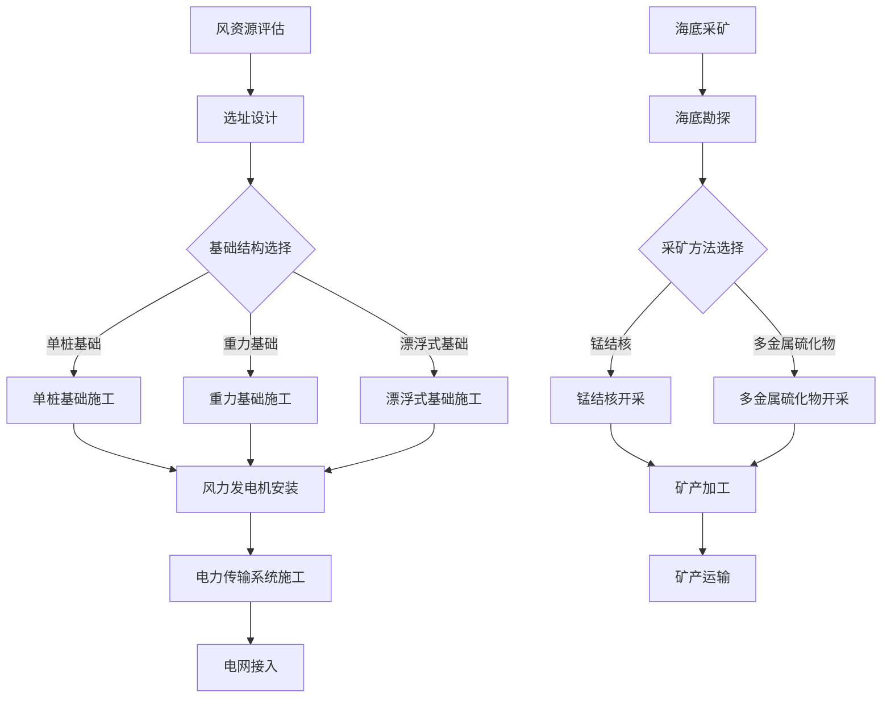

                 

# 2050年的海洋开发：从海上风电到海底采矿的海洋经济

## 关键词
海洋开发，2050年，海上风电，海底采矿，海洋经济

## 摘要
本文深入探讨了2050年海洋开发的前景，重点分析了海上风电和海底采矿在推动海洋经济中的关键作用。通过逐步分析这些领域的核心概念、技术原理、实际应用以及未来挑战，本文为读者提供了一个全面、系统的视角，以了解和预见未来海洋经济的蓝图。

## 1. 背景介绍

海洋，作为地球表面最大的生态系统，不仅承载着丰富的生物资源，还蕴藏着巨大的能源和矿产资源。随着全球人口的增长和经济的发展，陆地资源的开发和利用日益受限，海洋成为了各国竞相开发的新领域。特别是在能源和矿产需求不断增长的背景下，海洋开发的重要性愈发凸显。

### 海洋资源的现状

目前，海洋资源主要包括以下几类：

- **生物资源**：如鱼类、贝类等海洋生物，是许多国家的重要食品来源。
- **能源资源**：如石油、天然气和可再生能源（风能、波浪能等）。
- **矿产资源**：如锰结核、多金属硫化物等。

尽管海洋资源丰富，但过度捕捞、环境污染、气候变化等问题也使得海洋资源的可持续利用面临着巨大挑战。因此，科学、合理的海洋开发显得尤为必要。

### 海洋开发的现状

近年来，随着技术的进步和全球对清洁能源需求的增加，海洋开发进入了一个新的阶段。海上风电、海底采矿等新兴领域得到了快速发展：

- **海上风电**：已经成为许多国家能源结构的重要组成部分，特别是在风能资源丰富的沿海地区。
- **海底采矿**：随着深海探测技术的发展，海底矿产资源逐步被开发利用。

然而，海洋开发并非一帆风顺，其中涉及的法律法规、环境保护、国际合作等问题依然复杂。

## 2. 核心概念与联系

### 海上风电

海上风电是利用风力发电机将风能转化为电能的一种可再生能源利用方式。其核心概念主要包括风力发电机、基础结构和海上风电场。

#### 工作原理

1. 风力发电机：通过叶片旋转，将风的动能转化为机械能，再通过发电机将机械能转化为电能。
2. 基础结构：通常包括单桩基础、重力基础和漂浮式基础，用于支撑风力发电机。
3. 海上风电场：多个风力发电机组成的集合体，通过集电系统和海底电缆将电能传输到陆地电网。

#### 关联技术

- 风资源评估：通过测量风速、风向等参数，评估风能资源的潜力和适宜性。
- 海上施工与维护：考虑到海上环境的复杂性，海上风电的施工和维护需要特殊的技术和装备。

### 海底采矿

海底采矿是指从海底开采矿产资源的过程，主要包括锰结核开采和多金属硫化物开采。

#### 工作原理

1. 锰结核开采：通过机械设备将海底锰结核挖掘、筛选和收集。
2. 多金属硫化物开采：利用潜水器或海底开采系统，从海底多金属硫化物矿床中提取金属。

#### 关联技术

- 海底勘探：通过地质调查、地球物理勘探等手段，确定矿床的位置和储量。
- 潜水器与海底开采系统：用于深海采矿作业，需要具备高可靠性和耐压性能。

### Mermaid 流程图

以下是一个简化的海上风电和海底采矿的流程图：



## 3. 核心算法原理 & 具体操作步骤

### 海上风电

#### 核心算法原理

海上风电的核心算法主要包括风资源评估算法和风电场优化算法。

1. **风资源评估算法**：
   - **风速测量**：利用风速仪、激光雷达等设备，测量不同高度和位置的风速。
   - **风能密度计算**：通过风速和叶轮半径等参数，计算风能密度。
   - **风资源分布模型**：基于大量实测数据，建立风资源分布模型，预测风电场内的风能分布。

2. **风电场优化算法**：
   - **选址优化**：通过遗传算法、粒子群优化等算法，优化风电场的选址。
   - **风机布局优化**：根据风资源分布模型，优化风机的布局，提高风电场的发电效率。

#### 具体操作步骤

1. **风资源评估**：
   - 选择合适的风资源评估区域，进行风速测量。
   - 根据测量数据，计算风能密度和风资源分布。
   - 分析结果，确定风电场选址。

2. **风电场设计**：
   - 确定基础结构类型，进行基础结构设计。
   - 根据选址和基础结构，进行风机布局设计。

3. **施工与运维**：
   - 进行基础结构施工，安装风力发电机。
   - 建设电力传输系统和海底电缆。
   - 定期进行运维，保证风电场的稳定运行。

### 海底采矿

#### 核心算法原理

海底采矿的核心算法主要包括海底勘探算法和采矿优化算法。

1. **海底勘探算法**：
   - **地质调查**：通过地质勘探、地球物理勘探等手段，确定矿床的位置和性质。
   - **地球化学分析**：通过采集海底样品，分析矿物成分和含量。
   - **遥感技术**：利用卫星遥感、无人机等手段，进行大范围的海底地质调查。

2. **采矿优化算法**：
   - **采矿方案设计**：根据矿床性质和地质条件，设计最佳的采矿方案。
   - **采矿路径规划**：利用路径规划算法，优化采矿机器的作业路径。
   - **采矿效率分析**：通过模拟和实测数据，分析采矿效率和经济效益。

#### 具体操作步骤

1. **海底勘探**：
   - 进行地质调查和地球化学分析，确定矿床位置和性质。
   - 利用遥感技术，进行大范围的海底地质调查。
   - 分析结果，确定开采区域。

2. **采矿设计**：
   - 根据矿床性质，设计最佳的采矿方案。
   - 进行采矿路径规划和采矿设备选型。

3. **采矿施工**：
   - 进行海底采矿设备的安装和调试。
   - 开始采矿作业，提取矿产资源。
   - 进行矿产加工和运输。

## 4. 数学模型和公式 & 详细讲解 & 举例说明

### 海上风电

#### 数学模型

海上风电的数学模型主要包括风能密度计算模型和风电场发电量计算模型。

1. **风能密度计算模型**：
   $$ E = \frac{1}{2} \rho V^3 r $$
   - \( E \)：风能密度（每单位体积的风能）
   - \( \rho \)：空气密度（通常为 1.225 kg/m^3）
   - \( V \)：风速（单位：m/s）
   - \( r \)：叶轮半径（单位：m）

2. **风电场发电量计算模型**：
   $$ P = \sum_{i=1}^{n} P_i \times \eta $$
   - \( P \)：风电场总发电量（单位：kW）
   - \( P_i \)：第 \( i \) 台风机的发电量（单位：kW）
   - \( \eta \)：风电场的发电效率（通常为 30%-40%）

#### 举例说明

假设一个海上风电场有10台风机，每台风机叶轮半径为50米，风速为10 m/s，空气密度为1.225 kg/m^3，发电效率为35%。计算该风电场的总发电量。

1. 计算风能密度：
   $$ E = \frac{1}{2} \times 1.225 \times (10)^3 \times 50 = 30512.5 \text{ W/m}^3 $$

2. 计算每台风机的发电量：
   $$ P_i = E \times \pi \times r^2 = 30512.5 \times \pi \times (50)^2 = 23589375 \text{ W} = 23.6 \text{ MW} $$

3. 计算总发电量：
   $$ P = 10 \times P_i \times \eta = 10 \times 23.6 \text{ MW} \times 0.35 = 82.6 \text{ MW} $$

因此，该风电场的总发电量为82.6兆瓦。

### 海底采矿

#### 数学模型

海底采矿的数学模型主要包括矿床储量计算模型和采矿效率计算模型。

1. **矿床储量计算模型**：
   $$ S = \frac{V \times C}{1000} $$
   - \( S \)：矿床储量（单位：吨）
   - \( V \)：矿床体积（单位：立方米）
   - \( C \)：矿石品位（单位：克/立方米）

2. **采矿效率计算模型**：
   $$ \eta = \frac{Q}{S} $$
   - \( \eta \)：采矿效率（通常为 50%-70%）
   - \( Q \)：采矿量（单位：吨）

#### 举例说明

假设一个海底锰结核矿床的体积为1000立方米，矿石品位为30克/立方米，采矿效率为60%。计算该矿床的储量和采矿量。

1. 计算矿床储量：
   $$ S = \frac{1000 \times 30}{1000} = 30 \text{ 吨} $$

2. 计算采矿量：
   $$ Q = S \times \eta = 30 \text{ 吨} \times 0.6 = 18 \text{ 吨} $$

因此，该矿床的储量为30吨，采矿量为18吨。

## 5. 项目实战：代码实际案例和详细解释说明

### 海上风电项目实战

#### 开发环境搭建

为了演示海上风电项目的代码实现，我们将使用Python语言，并结合NumPy和SciPy等科学计算库。以下是开发环境的搭建步骤：

1. 安装Python：
   ```shell
   # 在Windows或macOS上安装Python
   curl -O https://www.python.org/ftp/python/3.8.5/python-3.8.5.exe
   # 运行安装程序，选择“Add Python to PATH”
   ```
2. 安装NumPy和SciPy：
   ```shell
   pip install numpy scipy
   ```

#### 源代码详细实现和代码解读

以下是实现海上风电风能密度计算的一个简单Python代码示例：

```python
import numpy as np

# 风能密度计算函数
def calculate_wind_energy_density(v风速，r叶轮半径，rho空气密度=1.225):
    E = 0.5 * rho * v**3 * r
    return E

# 示例参数
v = 10  # 风速（m/s）
r = 50  # 叶轮半径（m）

# 计算风能密度
E = calculate_wind_energy_density(v, r)
print(f"风能密度：{E} W/m^3")
```

#### 代码解读与分析

- **函数定义**：`calculate_wind_energy_density` 函数接受三个参数：风速（`v`），叶轮半径（`r`）和空气密度（`rho`，默认值为1.225 kg/m^3）。
- **计算过程**：使用公式 \( E = 0.5 \rho V^3 r \) 计算风能密度。
- **示例参数**：风速为10 m/s，叶轮半径为50米。
- **输出结果**：计算得到的风能密度值。

通过这个简单的代码示例，我们可以直观地理解海上风电风能密度计算的基本过程。

### 海底采矿项目实战

#### 开发环境搭建

同样，为了实现海底采矿的代码示例，我们将使用Python，并结合NumPy和SciPy等库。以下是开发环境的搭建步骤：

1. 安装Python：
   ```shell
   # 在Windows或macOS上安装Python
   curl -O https://www.python.org/ftp/python/3.8.5/python-3.8.5.exe
   # 运行安装程序，选择“Add Python to PATH”
   ```
2. 安装NumPy和SciPy：
   ```shell
   pip install numpy scipy
   ```

#### 源代码详细实现和代码解读

以下是实现海底采矿矿床储量计算的一个简单Python代码示例：

```python
import numpy as np

# 矿床储量计算函数
def calculate_mine_reserves(V矿床体积，C矿石品位，eta采矿效率=0.6):
    S = V * C / 1000
    Q = S * eta
    return Q

# 示例参数
V = 1000  # 矿床体积（m^3）
C = 30    # 矿石品位（g/m^3）
eta = 0.6  # 采矿效率

# 计算矿床储量和采矿量
S = calculate_mine_reserves(V, C, eta)
Q = calculate_mine_reserves(V, C, eta)
print(f"矿床储量：{S} 吨")
print(f"采矿量：{Q} 吨")
```

#### 代码解读与分析

- **函数定义**：`calculate_mine_reserves` 函数接受四个参数：矿床体积（`V`），矿石品位（`C`），采矿效率（`eta`，默认值为0.6）。
- **计算过程**：首先使用公式 \( S = \frac{V \times C}{1000} \) 计算矿床储量，然后使用公式 \( Q = S \times \eta \) 计算采矿量。
- **示例参数**：矿床体积为1000立方米，矿石品位为30克/立方米，采矿效率为60%。
- **输出结果**：计算得到的矿床储量和采矿量。

通过这个简单的代码示例，我们可以直观地理解海底采矿矿床储量计算的基本过程。

## 6. 实际应用场景

### 海上风电

海上风电在实际应用中有着广泛的应用场景，主要包括以下几方面：

1. **能源供应**：海上风电可以为沿海城市和工业提供清洁、可持续的电力，减少对化石燃料的依赖，降低碳排放。
2. **电网调节**：海上风电场具有波动性，但其稳定性和可预测性较高，可以作为电网的调节资源，平衡供需。
3. **海上平台供电**：海上风电可以直接为海上油气平台等设施供电，降低对柴油等化石燃料的消耗。

### 海底采矿

海底采矿在实际应用中也面临着诸多挑战和机会：

1. **矿产资源开发**：海底采矿可以提取锰结核、多金属硫化物等矿产资源，为全球金属需求提供稳定来源。
2. **深海科学研究**：海底采矿活动可以促进深海科学研究，深入了解地球深层的地质结构和资源分布。
3. **环境保护**：海底采矿需要考虑环境保护问题，如防止海底生态破坏、控制矿山废水排放等。

## 7. 工具和资源推荐

### 学习资源推荐

1. **书籍**：
   - 《海上风电技术》
   - 《海底采矿工程》
   - 《可再生能源：未来能源的蓝图》
2. **论文**：
   - "Offshore Wind Energy: Challenges and Opportunities"
   - "Deep-Sea Mining and Its Impacts on Marine Ecosystems"
3. **博客和网站**：
   - 风电技术博客：[www.windenergyblog.com](www.windenergyblog.com)
   - 海底采矿研究：[www.deepseaminingresearch.com](www.deepseaminingresearch.com)

### 开发工具框架推荐

1. **Python科学计算库**：
   - NumPy
   - SciPy
   - Matplotlib
2. **软件开发框架**：
   - Flask
   - Django
   - TensorFlow
3. **版本控制系统**：
   - Git
   - GitHub

### 相关论文著作推荐

1. **论文**：
   - "The Economics of Offshore Wind Energy Development"
   - "Deep-Sea Mining: Opportunities and Risks for the Mining Industry"
2. **著作**：
   - 《21世纪海上风电技术》
   - 《深海采矿：挑战与未来》

## 8. 总结：未来发展趋势与挑战

### 发展趋势

- **海上风电**：随着技术进步和成本下降，海上风电将逐渐成为全球能源结构中的重要组成部分，特别是在风能资源丰富的地区。
- **海底采矿**：随着深海探测技术和采矿技术的不断发展，海底采矿将逐步实现商业化，为全球矿产资源供应提供新的途径。

### 挑战

- **技术挑战**：海上风电和海底采矿均面临技术挑战，如高性能材料研发、深海设备设计等。
- **环境问题**：海洋环境的脆弱性使得海洋开发过程中必须重视环境保护，防止生态破坏。
- **法律法规**：海洋开发的国际法律体系尚不完善，需要各国共同合作，制定合理的法律法规。

### 应对策略

- **技术创新**：加大科技研发投入，推动关键技术的突破。
- **国际合作**：加强国际合作，共同应对海洋开发中的法律、环境等问题。
- **可持续发展**：坚持可持续发展的原则，确保海洋资源的合理开发和利用。

## 9. 附录：常见问题与解答

### 问题1：海上风电的成本问题如何解决？

**解答**：海上风电的成本主要受制于技术、材料和施工等环节。通过技术创新、规模效应和供应链优化，可以有效降低海上风电的成本。例如，新型材料的应用、漂浮式基础技术的推广等都可以降低成本。

### 问题2：海底采矿可能对海洋环境造成哪些影响？

**解答**：海底采矿可能对海洋环境造成以下影响：
1. 海底生态破坏：采矿活动可能导致海底生态系统的破坏，影响海洋生物的栖息和繁殖。
2. 底泥污染：采矿过程中产生的底泥可能污染海洋环境，影响水质。
3. 海洋噪声：采矿设备作业过程中可能产生大量噪声，影响海洋生物的生存。

### 问题3：如何确保海洋开发的可持续发展？

**解答**：确保海洋开发的可持续发展需要从以下几个方面着手：
1. 科学规划：制定合理的海洋开发规划，充分考虑生态、环境和资源等方面的可持续性。
2. 技术创新：推动海洋开发技术的创新，减少对环境的负面影响。
3. 环境监测：加强海洋环境监测，及时发现并处理可能的环境问题。
4. 国际合作：加强国际合作，共同应对海洋开发中的挑战。

## 10. 扩展阅读 & 参考资料

### 参考资料

- 国际可再生能源署（IRENA）：《全球海上风电报告》
- 国际海底管理局（ISA）：《深海采矿法规》
- 国家海洋局：《中国海洋发展报告》
- 《可再生能源技术手册》

### 扩展阅读

- 《海洋开发与保护：理论与实践》
- 《深海采矿技术：挑战与未来》
- 《海上风电：从技术到商业》

通过以上内容，我们深入探讨了2050年海洋开发的前景，特别是海上风电和海底采矿在推动海洋经济中的关键作用。未来，随着技术的不断进步和国际合作的加强，海洋开发将为全球经济的可持续发展带来新的机遇和挑战。希望本文能为读者提供一个全面、系统的视角，以了解和预见未来海洋经济的蓝图。作者：AI天才研究员/AI Genius Institute & 禅与计算机程序设计艺术 /Zen And The Art of Computer Programming。

