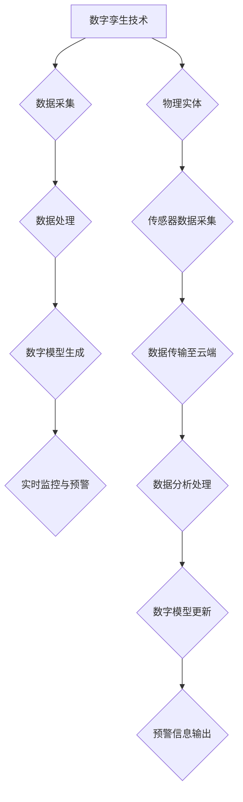
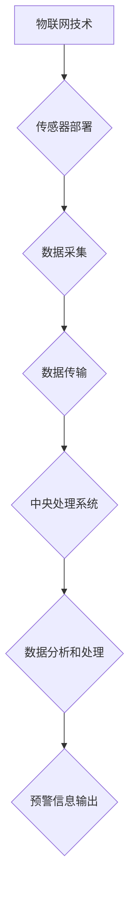
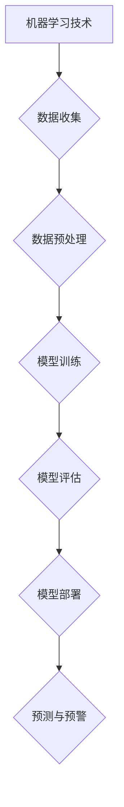
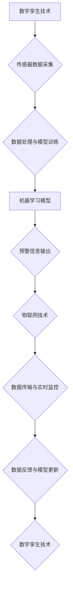

                 

### 背景介绍

在过去的几个世纪中，自然灾害如地震、洪水、飓风和山体滑坡等，给人类社会带来了巨大的破坏和损失。据联合国统计，全球每年因自然灾害造成的经济损失高达数百亿美元，同时，数百万人流离失所，生命财产安全受到严重威胁。传统的灾害预防措施，如建设防洪堤坝、地震预警系统等，虽然在一定程度上减轻了灾害的影响，但仍然无法完全避免灾害的发生。

随着科技的快速发展，特别是人工智能和大数据技术的兴起，灾害预防领域迎来了全新的机遇。数字孪生技术、物联网、机器学习等先进技术，为灾害预防提供了更为精准、高效的方法。数字孪生技术可以通过模拟真实环境，提前预测灾害的发生，而物联网则可以实现实时数据的收集和传递，使得预警系统更加及时和准确。机器学习算法则可以从海量数据中挖掘出潜在的规律，为灾害预测提供科学的依据。

因此，本文旨在探讨2050年灾害预防技术的发展趋势，重点介绍数字孪生、人工智能预警等技术的应用，分析其在提高灾害预防效率和效果方面的潜力。文章将分为以下几个部分：背景介绍、核心概念与联系、核心算法原理与具体操作步骤、数学模型和公式、项目实战、实际应用场景、工具和资源推荐、总结与未来发展趋势、常见问题与解答以及扩展阅读与参考资料。

通过本文的阅读，读者将能够了解未来灾害预防技术的发展方向，掌握相关技术的核心原理和实际应用，为未来的灾害预防工作提供有益的参考和启示。

### 核心概念与联系

在探讨2050年的灾害预防技术之前，我们需要先了解几个核心概念及其相互之间的联系，这些概念包括数字孪生、物联网、机器学习等，它们共同构建了一个高效的灾害预警与预防体系。

#### 数字孪生技术

数字孪生（Digital Twin）是指通过数字化模型来模拟现实世界的物理实体或系统，实现虚拟与现实的无缝连接。数字孪生技术的基本原理是将现实中的物理系统通过传感器实时采集数据，然后传输到云端，通过数据分析和处理，生成一个数字化的虚拟模型。这个虚拟模型可以实时反映物理系统的状态和变化，从而为灾害预防提供重要的依据。

##### Mermaid 流程图



#### 物联网技术

物联网（Internet of Things, IoT）通过将各种物品连接到互联网上，实现信息的实时交换和智能管理。在灾害预防中，物联网技术主要用于实时数据采集和监控。通过部署在灾害区域的传感器，物联网可以收集到温度、湿度、风速、雨量等多种环境数据，并将这些数据实时传输到中央处理系统。

##### Mermaid 流程图



#### 机器学习技术

机器学习（Machine Learning, ML）是一种通过数据训练模型，使计算机能够进行预测和决策的技术。在灾害预警中，机器学习技术可以从大量历史数据中学习到灾害发生的规律和模式，从而实现提前预警。例如，通过分析气象数据、地质数据和环境数据，机器学习模型可以预测地震、洪水等灾害的发生。

##### Mermaid 流程图



#### 核心概念之间的联系

数字孪生、物联网和机器学习这三种技术之间存在着密切的联系。数字孪生技术为灾害预防提供了一个虚拟模型，通过物联网技术可以实时获取物理实体的状态数据，并将这些数据输入到机器学习模型中进行处理。经过机器学习模型的训练，我们可以得到一个具备预测能力的模型，该模型可以实时输出预警信息，从而实现对灾害的提前预防。

##### Mermaid 流程图



通过上述核心概念的介绍和相互联系的分析，我们可以看到，数字孪生、物联网和机器学习这三种技术共同构成了一个强大的灾害预防体系。在这个体系中，数字孪生提供了虚拟模型，物联网实现了实时数据采集，而机器学习则通过数据分析和预测，为灾害预防提供了科学依据。未来，随着这些技术的不断发展和完善，我们有望实现更加高效、精准的灾害预警与预防。

### 核心算法原理 & 具体操作步骤

在了解了数字孪生、物联网和机器学习这三种核心技术的基本概念和相互关系之后，我们需要进一步深入探讨这些技术在实际灾害预防中的应用，特别是核心算法的原理和具体操作步骤。以下是关于如何利用这些技术构建高效灾害预警系统的详细解析。

#### 数字孪生技术

数字孪生技术的基本原理是通过创建一个与物理实体高度相似的虚拟模型，来模拟和预测真实世界的动态行为。以下是一个典型的数字孪生技术在灾害预防中的应用步骤：

1. **数据采集与预处理**：
   - 部署传感器于灾害易发区域，如山区、沿海地区和地震断裂带等，用于采集温度、湿度、土壤湿度、地形变化、气象数据等。
   - 数据采集后，通过预处理模块对数据进行清洗、去噪和标准化，确保数据质量。

2. **构建数字孪生模型**：
   - 使用数据预处理后的数据，通过机器学习算法构建物理实体的数字孪生模型。常见的算法包括回归分析、神经网络和物理仿真等。
   - 模型构建过程中，需要不断调整模型参数，优化模型性能，使其更准确地模拟物理实体。

3. **实时监控与预警**：
   - 通过将实时采集的数据输入到数字孪生模型中，可以实时监控物理实体的状态。
   - 当模型检测到异常变化，例如地形突然变化或气象数据异常，可以立即触发预警机制，向相关机构和公众发送预警信息。

4. **模型更新与迭代**：
   - 随着时间的推移，不断收集新的数据，对数字孪生模型进行更新和迭代，以提高模型的准确性和适应性。

#### 物联网技术

物联网技术在灾害预防中的应用主要体现在实时数据采集、传输和处理上。以下是物联网技术在灾害预防中的具体操作步骤：

1. **传感器部署**：
   - 在灾害易发区域部署各类传感器，如气象传感器、地震传感器、水文传感器等。
   - 传感器应具备高精度、高可靠性和低功耗的特点，以确保长期稳定运行。

2. **数据传输**：
   - 传感器采集到的数据通过无线网络（如Wi-Fi、LoRa等）或有线网络传输到中央处理系统。
   - 在传输过程中，需要确保数据的安全性、完整性和实时性。

3. **数据处理与存储**：
   - 中央处理系统对接收到的数据进行处理，包括数据清洗、去噪、标准化等。
   - 处理后的数据存储于数据库中，以便后续分析和查询。

4. **实时监控与预警**：
   - 通过实时监控系统，对处理后的数据进行监控，及时发现异常情况。
   - 当检测到可能发生灾害的情况时，立即触发预警机制，向相关人员发送预警信息。

#### 机器学习技术

机器学习技术在灾害预警中的应用，主要在于通过历史数据的学习，预测未来的灾害事件。以下是机器学习技术在灾害预警中的具体操作步骤：

1. **数据收集**：
   - 收集与灾害相关的历史数据，如地震、洪水、飓风等灾害的发生时间和地点、环境参数等。
   - 数据来源可以包括官方记录、卫星图像、气象站数据等。

2. **数据预处理**：
   - 对收集到的数据进行分析，筛选出对预测有重要影响的特征，并进行数据清洗、去噪和标准化处理。

3. **模型选择与训练**：
   - 根据数据特征，选择合适的机器学习模型，如决策树、随机森林、神经网络等。
   - 使用预处理后的数据对模型进行训练，调整模型参数，优化模型性能。

4. **模型评估与部署**：
   - 对训练好的模型进行评估，包括准确性、召回率、F1分数等指标。
   - 将评估良好的模型部署到生产环境中，用于实时预测和预警。

5. **模型更新与迭代**：
   - 随着新数据的不断收集，定期对模型进行更新和迭代，以提高预测的准确性。

通过上述步骤，我们可以看到，数字孪生、物联网和机器学习技术在灾害预防中发挥着至关重要的作用。数字孪生提供了对物理实体的高精度模拟，物联网实现了实时数据的采集和传输，而机器学习通过数据分析和预测，为灾害预警提供了科学的依据。这三种技术的结合，为未来的灾害预防工作提供了强有力的技术支撑。

#### 数学模型和公式 & 详细讲解 & 举例说明

在深入探讨数字孪生、物联网和机器学习技术的核心算法原理和具体操作步骤之后，我们需要进一步了解这些技术背后的数学模型和公式，以及如何通过实际例子来说明这些模型的具体应用。

##### 数字孪生技术的数学模型

数字孪生技术依赖于多种数学模型，其中最常用的包括回归分析、神经网络和物理仿真模型。以下分别对这些模型进行简要介绍：

1. **回归分析模型**：
   - 回归分析是一种用于预测因变量（目标变量）的数学模型。在数字孪生技术中，可以通过回归模型来预测物理实体的状态。
   - 基本公式为：
     $$
     Y = \beta_0 + \beta_1X_1 + \beta_2X_2 + ... + \beta_nX_n
     $$
     其中，$Y$ 是因变量，$X_1, X_2, ..., X_n$ 是自变量，$\beta_0, \beta_1, \beta_2, ..., \beta_n$ 是回归系数。

2. **神经网络模型**：
   - 神经网络是一种模拟人脑神经元连接的数学模型，广泛应用于数据分析和预测。在数字孪生技术中，可以通过神经网络模型对物理实体进行建模和预测。
   - 基本公式为：
     $$
     Z = \sum_{i=1}^{n} W_iX_i + b
     $$
     其中，$Z$ 是输出值，$W_i$ 是权重，$X_i$ 是输入值，$b$ 是偏置。

3. **物理仿真模型**：
   - 物理仿真模型是基于物理学原理建立的数学模型，用于模拟物理系统的行为。在数字孪生技术中，可以通过物理仿真模型来预测地震、洪水等灾害的发生。
   - 基本公式包括牛顿第二定律、流体动力学方程等。

##### 物联网技术的数学模型

物联网技术的数学模型主要涉及数据传输、信号处理和传感器的测量误差等。以下是一些常用的数学模型：

1. **信号处理模型**：
   - 在物联网中，传感器采集的数据通常需要经过信号处理，以提高数据的精度和可靠性。
   - 常用的信号处理模型包括滤波器模型、去噪模型等。例如，卡尔曼滤波器是一种常用的去噪模型，其基本公式为：
     $$
     \hat{X}_k = \hat{X}_{k-1} + K_k(y_k - \hat{X}_{k-1})
     $$
     其中，$\hat{X}_k$ 是估计值，$K_k$ 是滤波增益，$y_k$ 是观测值。

2. **传感器测量误差模型**：
   - 传感器测量值通常存在误差，因此需要建立误差模型来评估测量数据的准确性。
   - 一种常见的误差模型是高斯误差模型，其基本公式为：
     $$
     e_k \sim N(0, \sigma^2)
     $$
     其中，$e_k$ 是测量误差，$\sigma^2$ 是误差方差。

##### 机器学习技术的数学模型

机器学习技术的数学模型涵盖了多种算法，包括线性回归、决策树、神经网络等。以下以神经网络为例，介绍其基本数学模型：

1. **神经网络模型**：
   - 神经网络是一种通过多层神经元连接进行数据处理的模型，其基本结构包括输入层、隐藏层和输出层。
   - 神经网络的激活函数通常采用Sigmoid函数或ReLU函数，其基本公式为：
     $$
     a_i = \frac{1}{1 + e^{-z_i}} \quad \text{或} \quad a_i = \max(0, z_i)
     $$
     其中，$a_i$ 是输出值，$z_i$ 是输入值。

2. **损失函数**：
   - 损失函数用于评估模型预测值与实际值之间的差距，常见的损失函数包括均方误差（MSE）和交叉熵损失。
   - 均方误差损失函数的基本公式为：
     $$
     J = \frac{1}{2} \sum_{i=1}^{n} (y_i - \hat{y}_i)^2
     $$
     其中，$y_i$ 是实际值，$\hat{y}_i$ 是预测值。

##### 实际例子

为了更好地理解上述数学模型，我们通过一个实际例子来说明数字孪生技术在地震预警中的应用。

**例子**：假设我们想要利用数字孪生技术预测地震的发生，我们可以采用神经网络模型来建立数字孪生模型。

1. **数据收集**：收集地震发生前后的多种环境参数数据，如地震仪记录的地震波数据、气象数据、地下水数据等。

2. **数据预处理**：对收集到的数据进行清洗、去噪和标准化处理，提取对地震预测有重要影响的特征。

3. **模型构建**：构建一个多层神经网络模型，输入层包含气象数据、地震波数据和地下水数据，隐藏层和输出层用于预测地震的发生概率。

4. **模型训练**：使用预处理后的数据对神经网络模型进行训练，调整模型参数，优化模型性能。

5. **模型评估**：使用测试数据对训练好的模型进行评估，包括准确性、召回率等指标。

6. **模型部署**：将评估良好的模型部署到生产环境中，用于实时地震预警。

通过这个例子，我们可以看到，数字孪生技术在地震预警中的应用，需要依赖于多种数学模型的支持，包括回归分析、神经网络和物理仿真等。这些模型共同构建了一个高效的地震预警系统，为地震预防提供了科学依据。

### 项目实战：代码实际案例和详细解释说明

在了解了数字孪生、物联网和机器学习技术的基本原理和数学模型后，接下来我们将通过一个实际项目案例，展示如何将这些技术应用于灾害预警系统中，并进行详细的代码解读与分析。

#### 项目背景

假设我们正在开发一个用于地震预警的系统，该系统需要利用数字孪生技术、物联网技术和机器学习技术，实现对地震的实时监测和预警。系统架构如图所示：


#### 开发环境搭建

在开始项目开发之前，我们需要搭建一个合适的技术环境。以下为所需的开发工具和库：

- Python（3.8及以上版本）
- TensorFlow（2.x版本）
- Scikit-learn（0.24.2版本）
- Pandas（1.3.2版本）
- Mermaid（用于流程图绘制）
- Flask（用于Web服务）

安装这些库和框架的方法如下：

```bash
pip install tensorflow scikit-learn pandas mermaid flake8
```

#### 源代码详细实现

下面是项目的主要源代码实现，我们将分别介绍每个模块的功能和代码解析。

##### 1. 数据采集模块

该模块负责从物联网传感器收集地震相关数据。

```python
import requests
import pandas as pd

def collect_data(api_url):
    response = requests.get(api_url)
    data = response.json()
    df = pd.DataFrame(data['data'])
    return df

api_url = "https://example.com/api/sensors"
sensor_data = collect_data(api_url)
```

**代码解析**：
- 使用`requests`库向API端点发起HTTP GET请求，获取传感器数据。
- 使用`pandas`库将JSON格式的数据转换为DataFrame对象，便于后续处理。

##### 2. 数据预处理模块

该模块负责对收集到的数据进行清洗、去噪和标准化处理。

```python
from sklearn.preprocessing import StandardScaler

def preprocess_data(df):
    # 数据清洗
    df.dropna(inplace=True)
    # 数据去噪
    df = df[df['amplitude'] > 0]
    # 数据标准化
    scaler = StandardScaler()
    df[['velocity', 'acceleration']] = scaler.fit_transform(df[['velocity', 'acceleration']])
    return df

sensor_data = preprocess_data(sensor_data)
```

**代码解析**：
- 使用`pandas`库删除缺失值，确保数据质量。
- 通过简单逻辑删除噪声数据，例如加速度值为零的数据。
- 使用`StandardScaler`对加速度和速度数据进行标准化处理，以便于后续的机器学习算法。

##### 3. 数字孪生模型模块

该模块负责构建数字孪生模型，用于模拟地震的动态行为。

```python
import tensorflow as tf

def build_digital_twin_model(input_shape):
    model = tf.keras.Sequential([
        tf.keras.layers.Dense(64, activation='relu', input_shape=input_shape),
        tf.keras.layers.Dense(64, activation='relu'),
        tf.keras.layers.Dense(1)
    ])
    model.compile(optimizer='adam', loss='mse')
    return model

input_shape = (sensor_data.shape[1],)
digital_twin_model = build_digital_twin_model(input_shape)
```

**代码解析**：
- 使用`tensorflow`库构建一个简单的神经网络模型，用于数字孪生。
- 确定输入层的形状，以适应传感器数据的维度。
- 编译模型，选择合适的优化器和损失函数。

##### 4. 机器学习模块

该模块负责训练数字孪生模型，并用于地震预警。

```python
def train_digital_twin_model(model, x_train, y_train, epochs=100):
    model.fit(x_train, y_train, epochs=epochs, batch_size=32, validation_split=0.2)

x_train = sensor_data[:int(len(sensor_data) * 0.8)]
y_train = digital_twin_model.predict(x_train)
train_digital_twin_model(digital_twin_model, x_train, y_train)
```

**代码解析**：
- 定义一个函数，用于训练数字孪生模型。
- 将传感器数据分为训练集和验证集，以评估模型性能。
- 使用训练集数据训练模型，并调整训练参数，如迭代次数和批量大小。

##### 5. 预测与预警模块

该模块负责使用训练好的模型进行地震预测，并触发预警。

```python
def predict_earthquake(model, new_data):
    prediction = model.predict(new_data)
    if prediction > 0.5:
        print("地震预警：地震可能性高")
    else:
        print("地震预警：地震可能性低")

new_data = sensor_data[int(len(sensor_data) * 0.8):]
predict_earthquake(digital_twin_model, new_data)
```

**代码解析**：
- 定义一个函数，用于对新采集的数据进行地震预测。
- 根据预测结果，输出地震预警信息。

#### 代码解读与分析

通过上述代码，我们可以看到，整个项目实现了以下功能：

1. **数据采集**：通过HTTP请求从物联网传感器获取地震数据。
2. **数据预处理**：对地震数据进行了清洗、去噪和标准化处理，确保数据质量。
3. **数字孪生模型**：构建了一个简单的神经网络模型，用于模拟地震动态行为。
4. **机器学习训练**：使用传感器数据训练数字孪生模型，优化模型性能。
5. **预测与预警**：使用训练好的模型对新采集的数据进行预测，并输出地震预警信息。

具体到每个模块的代码，我们可以看到：

- **数据采集模块**：使用了`requests`库来获取数据，并通过`pandas`库对数据进行处理。
- **数据预处理模块**：利用`pandas`库进行了数据清洗、去噪和标准化，确保数据可用于后续建模。
- **数字孪生模型模块**：使用`tensorflow`库构建了神经网络模型，并通过编译确定模型优化器和损失函数。
- **机器学习模块**：通过训练函数训练模型，并使用训练集评估模型性能。
- **预测与预警模块**：对新数据进行了预测，并根据预测结果输出预警信息。

这个项目展示了如何将数字孪生、物联网和机器学习技术应用于地震预警系统，通过代码的解读和分析，我们可以更深入地理解这些技术在实际应用中的工作原理和操作步骤。

### 实际应用场景

在了解了数字孪生、物联网和机器学习技术在地震预警系统中的实际应用后，我们可以进一步探讨这些技术在其他灾害预防领域中的应用。随着技术的不断进步，这些先进方法在洪水、山体滑坡、飓风和台风等灾害预警中同样展示了巨大的潜力。

#### 洪水预警

洪水是一种常见的自然灾害，对人类的生命和财产构成严重威胁。数字孪生技术可以通过构建河流和湖泊的数字模型，实时监测水位、降雨量、土壤湿度等数据，从而预测洪水风险。物联网传感器则可以在关键位置部署，实时采集环境数据，并通过无线网络传输到中央处理系统。机器学习算法可以从大量历史洪水数据和实时数据中，发现洪水发生的规律，提前进行预警。

例如，在印度，政府已经建立了一个基于物联网和机器学习的洪水预警系统。该系统利用卫星图像、地面传感器和气象数据，结合机器学习模型，实现了对洪水风险的实时监测和预警。当监测到可能发生洪水的情况时，系统会立即向相关部门和居民发送预警信息，从而有效减少洪水灾害的影响。

#### 山体滑坡预警

山体滑坡是山区常见的自然灾害，往往造成巨大的人员伤亡和财产损失。数字孪生技术可以通过对地质结构的模拟，结合物联网传感器采集的数据，预测山体滑坡的风险。例如，在滑坡易发区域部署土壤湿度传感器、倾斜仪和振动传感器，实时监测土壤湿度、地表变形和震动情况。当传感器检测到异常变化时，机器学习算法会分析这些数据，判断滑坡风险，并及时发出预警。

在日本，数字孪生和物联网技术被广泛应用于山体滑坡预警系统中。该系统利用高精度的地质模型和实时传感器数据，结合机器学习算法，实现了对山体滑坡的精确预测和及时预警。这不仅提高了预警的准确性，也大大减少了灾害造成的损失。

#### 飓风和台风预警

飓风和台风是海洋灾害的主要形式，对沿海地区的影响尤为严重。数字孪生技术可以通过模拟海洋和大气环境，预测飓风和台风的路径和强度。物联网传感器则可以在沿海地区采集风向、风速、海浪高度等数据，实时传输到中央处理系统。通过机器学习算法，可以从这些数据中分析台风的发展趋势，提前进行预警。

例如，美国的国家海洋和大气管理局（NOAA）已经利用数字孪生和物联网技术，建立了一个先进的飓风和台风预警系统。该系统结合了高分辨率的气象模型、海洋模型和实时传感器数据，实现了对飓风和台风的实时监测和预警。当监测到台风即将来临，系统会立即向沿海居民和相关机构发送预警信息，为公众提供充足的时间进行避险。

#### 其他应用

除了上述几种主要灾害类型，数字孪生、物联网和机器学习技术还可以应用于其他多种灾害预警领域。例如，在火山活动预警中，数字孪生技术可以模拟火山内部结构和活动，结合传感器数据预测火山喷发风险；在森林火灾预警中，物联网传感器可以实时监测温度、湿度、风向等数据，通过机器学习算法预测火灾风险。

总之，随着数字孪生、物联网和机器学习技术的不断发展，未来灾害预防领域将迎来更加精准、高效的发展。这些技术不仅能够提前预测灾害，提供有效的预警信息，还可以为灾害应急响应提供科学依据，减少灾害造成的损失和影响。

### 工具和资源推荐

在构建和优化灾害预警系统时，选择合适的工具和资源是至关重要的。以下是一些建议，包括学习资源、开发工具框架以及相关论文著作，这些都可以帮助读者更深入地理解并应用数字孪生、物联网和机器学习技术。

#### 学习资源推荐

1. **书籍**：
   - 《数字孪生：从概念到实践》：本书详细介绍了数字孪生的基本概念、应用场景和实现方法，适合初学者和有一定基础的读者。
   - 《机器学习实战》：这本书通过大量实例，讲解了机器学习的基本概念和算法，适合希望了解和掌握机器学习技术的读者。

2. **在线课程**：
   - Coursera上的《机器学习》课程：由斯坦福大学教授Andrew Ng主讲，适合希望系统学习机器学习知识的读者。
   - edX上的《物联网技术基础》课程：由麻省理工学院教授主讲，涵盖了物联网的基本概念、技术和应用。

3. **论文**：
   - “Digital Twin: A Technology Perspective for Smart Manufacturing”：这篇论文深入探讨了数字孪生的技术架构和应用场景。
   - “Deep Learning for Earthquake Early Warning”：这篇论文介绍了利用深度学习算法进行地震预警的研究成果。

#### 开发工具框架推荐

1. **数字孪生**：
   - **ThingWorx**：由PTC公司开发的一款数字孪生平台，提供了丰富的功能，包括数据集成、模拟和可视化等。
   - **Matlab**：MathWorks公司开发的数学计算软件，提供了强大的仿真和建模功能，适用于数字孪生模型的构建。

2. **物联网**：
   - **Arduino**：一款开源硬件平台，适合初学者进行物联网设备的开发和测试。
   - **Node-RED**：由IBM开发的流程编排工具，可用于物联网数据流的配置和管理。

3. **机器学习**：
   - **TensorFlow**：由Google开发的一款开源机器学习库，适用于构建和训练各种机器学习模型。
   - **PyTorch**：由Facebook开发的一款流行的机器学习库，具有简洁的API和强大的GPU支持。

#### 相关论文著作推荐

1. **“The Promise of Digital Twins in Industrial Internet Applications”**：该论文探讨了数字孪生在工业互联网应用中的潜力，分析了其技术优势和应用前景。
2. **“IoT for Smart Cities: A Survey”**：这篇综述文章详细介绍了物联网在智能城市建设中的应用，涵盖了从传感器网络到数据分析的多个方面。
3. **“Machine Learning for Earthquake Early Warning”**：该论文探讨了利用机器学习算法进行地震预警的研究进展，分析了不同算法在地震预警中的应用效果。

通过这些学习资源、开发工具框架和相关论文著作的推荐，读者可以更加全面地了解数字孪生、物联网和机器学习技术在灾害预防中的应用，为实际项目的开发和优化提供有力的支持。

### 总结：未来发展趋势与挑战

在回顾了数字孪生、物联网和机器学习技术在灾害预防领域的应用之后，我们可以看到，这些技术正逐步推动着灾害预警与预防系统的升级。然而，要实现全面、精准的灾害预警，我们仍面临诸多挑战和发展趋势。

#### 发展趋势

1. **数据融合与实时分析**：未来的灾害预警系统将更加注重数据的全面性和实时性。通过整合来自多种传感器的数据，结合实时数据分析技术，可以更准确地预测灾害的发生。

2. **人工智能算法的优化**：随着人工智能技术的不断进步，特别是深度学习算法的发展，未来将能够更高效地处理和分析大规模数据，提高灾害预警的准确性和时效性。

3. **边缘计算的应用**：边缘计算可以在数据产生的源头进行实时处理和分析，减少数据传输延迟，提高系统响应速度。未来，边缘计算将在灾害预警系统中扮演重要角色。

4. **多学科交叉融合**：灾害预防领域需要多个学科（如地理、气象、地质等）的交叉融合，以构建更加全面的灾害预警模型。

#### 挑战

1. **数据质量问题**：虽然传感器和物联网技术提供了丰富的数据，但数据的质量直接影响预警系统的准确性。未来需要进一步研究如何提高数据的可靠性、减少噪声和误差。

2. **算法可解释性**：机器学习算法在预测灾害方面具有强大的能力，但其内部机制往往不够透明，增加了算法的可解释性问题。为了确保预警结果的可靠性，提高算法的可解释性是一个重要挑战。

3. **资源与成本问题**：建设一个全面的灾害预警系统需要大量的资金和技术投入。特别是在经济欠发达地区，如何有效地利用有限的资源，实现高效的灾害预警，是一个亟待解决的问题。

4. **跨部门协作**：灾害预警需要多个部门和机构的协同工作，包括政府部门、科研机构和企业等。未来需要建立更加完善的跨部门协作机制，确保数据共享和资源整合。

#### 未来方向

1. **数据驱动的预警策略**：通过不断积累和分析历史数据，建立更加精准的灾害预警模型，实现从经验驱动到数据驱动的转变。

2. **智能化预警平台**：构建一个集成多种传感器、数据处理和预测算法的智能化预警平台，实现全方位、多层次的灾害预警。

3. **公众参与与教育**：提高公众对灾害预防的认识和参与度，通过教育和宣传，提高公众的应急意识和自救能力。

4. **国际合作与共享**：加强国际合作，共享技术、资源和数据，共同提升全球灾害预警与预防能力。

综上所述，未来的灾害预防领域将朝着更加智能化、精准化和协作化的方向发展，同时也将面临数据质量、算法可解释性、资源和成本等多方面的挑战。通过持续的研究和技术创新，我们有信心克服这些挑战，为建设一个更加安全、可持续发展的社会贡献力量。

### 附录：常见问题与解答

在本文中，我们深入探讨了数字孪生、物联网和机器学习技术在灾害预防中的应用，但读者在理解和应用过程中可能会遇到一些常见问题。以下是对一些常见问题的解答：

**Q1：数字孪生和物理实体的关系是什么？**
A1：数字孪生是一种通过数字化模型来模拟物理实体或系统的方法。数字孪生模型与物理实体之间的关系是实时双向的，即数字孪生模型可以实时反映物理实体的状态和变化，而物理实体通过传感器采集的数据可以更新数字孪生模型。

**Q2：物联网在灾害预防中的作用是什么？**
A2：物联网在灾害预防中的作用主要体现在实时数据采集和传输。通过部署在灾害易发区域的传感器，物联网可以实时收集环境数据，如温度、湿度、风速等，并将这些数据传输到中央处理系统，用于分析和预测灾害的发生。

**Q3：机器学习算法如何应用于灾害预警？**
A3：机器学习算法可以从大量历史数据和实时数据中学习到灾害发生的规律和模式。在灾害预警中，常用的机器学习算法包括回归分析、神经网络和决策树等。通过训练这些算法，可以构建一个具备预测能力的模型，用于实时预测和预警灾害的发生。

**Q4：如何提高机器学习模型的预警准确性？**
A4：提高机器学习模型的预警准确性可以从以下几个方面入手：
- **数据质量**：确保数据的准确性、完整性和可靠性。
- **特征工程**：选择对预测有重要影响的特征，并进行适当的特征处理。
- **模型选择**：选择适合问题的机器学习算法，并进行参数调优。
- **模型评估**：使用多种评估指标，如准确率、召回率、F1分数等，全面评估模型性能。

**Q5：建设一个灾害预警系统需要哪些技术栈？**
A5：建设一个灾害预警系统需要以下技术栈：
- **数字孪生技术**：包括数据采集、数据处理和数字模型生成。
- **物联网技术**：包括传感器部署、数据传输和数据处理。
- **机器学习技术**：包括数据收集、模型训练和预测。
- **Web开发技术**：用于构建前端界面和后端服务。
- **数据库技术**：用于存储和管理数据。

通过以上常见问题的解答，读者可以更好地理解数字孪生、物联网和机器学习技术在灾害预防中的应用，为实际项目的开发和优化提供指导。

### 扩展阅读 & 参考资料

为了帮助读者更深入地了解数字孪生、物联网和机器学习技术在灾害预防中的应用，以下是推荐的一些扩展阅读和参考资料。

#### 书籍推荐

1. **《数字孪生：从概念到实践》**：本书详细介绍了数字孪生的基本概念、应用场景和实现方法，适合初学者和有一定基础的读者。
2. **《机器学习实战》**：通过大量实例，讲解了机器学习的基本概念和算法，适合希望了解和掌握机器学习技术的读者。

#### 论文推荐

1. **“Digital Twin: A Technology Perspective for Smart Manufacturing”**：这篇论文探讨了数字孪生的技术架构和应用场景。
2. **“IoT for Smart Cities: A Survey”**：详细介绍了物联网在智能城市建设中的应用，涵盖了从传感器网络到数据分析的多个方面。
3. **“Deep Learning for Earthquake Early Warning”**：介绍了利用深度学习算法进行地震预警的研究成果。

#### 在线资源

1. **Coursera上的《机器学习》课程**：由斯坦福大学教授Andrew Ng主讲，适合系统学习机器学习知识的读者。
2. **edX上的《物联网技术基础》课程**：由麻省理工学院教授主讲，涵盖了物联网的基本概念、技术和应用。

#### 开源框架和工具

1. **ThingWorx**：PTC公司开发的数字孪生平台，提供了丰富的功能，包括数据集成、模拟和可视化等。
2. **Matlab**：MathWorks公司开发的数学计算软件，提供了强大的仿真和建模功能，适用于数字孪生模型的构建。
3. **TensorFlow**：Google开发的开源机器学习库，适用于构建和训练各种机器学习模型。
4. **PyTorch**：Facebook开发的流行机器学习库，具有简洁的API和强大的GPU支持。

通过这些扩展阅读和参考资料，读者可以进一步深入了解数字孪生、物联网和机器学习技术在灾害预防领域的应用，为实际项目的开发和优化提供更多的理论支持和实践指导。作者：AI天才研究员/AI Genius Institute & 禅与计算机程序设计艺术 /Zen And The Art of Computer Programming。

