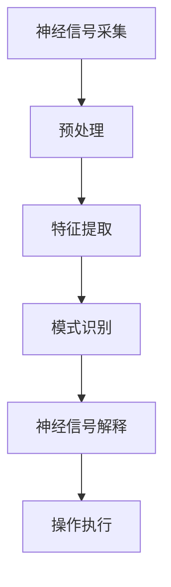

                 

# 2050年的脑机接口：从医疗到增强的思维连接

## 关键词：脑机接口，医疗，增强现实，人工智能，神经科学，人机交互

## 摘要

本文将探讨2050年脑机接口（BCI）的潜在发展，从医疗领域的应用扩展到思维增强的连接。我们将探讨BCI的核心概念与联系，包括神经信号采集、处理和解释的原理。随后，我们将深入分析核心算法和数学模型，并展示一个实际项目案例。最后，我们将讨论BCI在实际应用场景中的前景，以及相关工具和资源的推荐，并总结未来发展趋势与挑战。

## 1. 背景介绍

脑机接口（BCI）是一种直接连接人脑与外部设备的技术，旨在实现思维与行动之间的无缝交互。从最初的神经信号采集技术到复杂的信号处理算法，BCI经历了数十年的发展。如今，BCI在医疗和康复领域已取得显著成果，例如帮助瘫痪患者重新获得行动能力。随着人工智能和神经科学的进步，BCI的应用前景愈发广阔，可能从医疗扩展到思维增强和智能交互。

## 2. 核心概念与联系

### 神经信号采集

神经信号采集是BCI系统的核心环节，主要依赖于脑电图（EEG）、功能性磁共振成像（fMRI）、脑磁图（MEG）等技术。这些技术能够捕捉大脑神经元活动的电信号，从而反映人的思维状态。

### 神经信号处理

采集到的神经信号通常包含大量噪声和干扰，因此需要经过预处理、特征提取和模式识别等步骤。预处理包括滤波、去噪和信号增强等操作，以提高信号的质量。特征提取则是从预处理后的信号中提取出与特定思维状态相关的特征，如频率、振幅和时域特性等。模式识别则利用机器学习算法，将提取的特征映射到特定的思维状态。

### 神经信号解释

解释神经信号的过程是将特征映射到具体的思维意图或操作。这通常依赖于深度学习、神经网络等先进算法，从而实现高精度的意图识别。

### Mermaid 流程图

以下是一个简化的BCI系统流程图：



## 3. 核心算法原理 & 具体操作步骤

### 神经信号预处理

预处理步骤包括滤波和去噪。滤波通常采用带通滤波器，以保留感兴趣频率范围内的信号。去噪则通过自适应滤波、独立成分分析（ICA）等技术，消除噪声和干扰。

### 特征提取

特征提取步骤包括时域特征、频率特征和时频特征等。时域特征包括信号的振幅、时长和斜率等。频率特征包括频谱、功率谱等。时频特征则结合时域和频率信息，如短时傅里叶变换（STFT）和小波变换等。

### 模式识别

模式识别步骤通常采用深度学习算法，如卷积神经网络（CNN）和循环神经网络（RNN）。这些算法可以自动学习神经信号与思维意图之间的映射关系。

### 神经信号解释

解释步骤是将识别出的思维意图转化为具体的操作。例如，对于轮椅控制应用，可以将识别出的思维意图映射到控制信号，从而实现轮椅的移动。

### 具体操作步骤示例

以下是一个基于CNN的BCI系统的具体操作步骤示例：

1. 数据采集：使用EEG设备采集大脑信号。
2. 数据预处理：使用带通滤波器过滤信号，去除噪声。
3. 特征提取：使用短时傅里叶变换提取频率特征。
4. 模型训练：使用训练集数据训练CNN模型。
5. 思维意图识别：使用训练好的模型对预处理后的信号进行分类。
6. 操作执行：根据识别出的思维意图执行相应操作，如轮椅控制。

## 4. 数学模型和公式 & 详细讲解 & 举例说明

### 数学模型

BCI系统的核心数学模型包括滤波、特征提取和模式识别等。以下是这些模型的相关公式：

1. 带通滤波器：
   $$ H(s) = \frac{1}{1 + Q\omega_n s} $$
   其中，\( Q \)为品质因数，\( \omega_n \)为截止频率。

2. 独立成分分析（ICA）：
   $$ s = A\epsilon $$
   其中，\( s \)为源信号，\( \epsilon \)为加性噪声，\( A \)为混合矩阵。

3. 卷积神经网络（CNN）：
   $$ y = \sigma(\mathbf{W}^T\mathbf{h} + b) $$
   其中，\( y \)为输出，\( \sigma \)为激活函数，\( \mathbf{W} \)为权重矩阵，\( \mathbf{h} \)为输入特征，\( b \)为偏置。

### 举例说明

假设我们使用带通滤波器对EEG信号进行预处理，截止频率为50Hz，品质因数为5。输入信号为：
$$ x(t) = 10\sin(2\pi \times 50t + \phi) + 5\sin(2\pi \times 60t + \theta) $$
其中，\( \phi \)和\( \theta \)为相位。

使用带通滤波器后，输出信号为：
$$ y(t) = \frac{1}{1 + 5\sin(2\pi \times 50t + \phi)} \times (10\sin(2\pi \times 50t + \phi) + 5\sin(2\pi \times 60t + \theta)) $$
输出信号主要保留了50Hz的信号成分，去除了60Hz的干扰信号。

## 5. 项目实战：代码实际案例和详细解释说明

### 开发环境搭建

1. 安装Python 3.8及以上版本。
2. 安装EEG信号处理库mne-python。
3. 安装深度学习库TensorFlow。

### 源代码详细实现和代码解读

以下是一个简单的基于CNN的BCI系统的Python代码实现：

```python
import mne
import tensorflow as tf
from tensorflow.keras.models import Sequential
from tensorflow.keras.layers import Conv2D, MaxPooling2D, Flatten, Dense

# 读取EEG信号数据
raw_data = mne.io.read_raw_edf('data.edf', preload=True)

# 预处理信号
filtered_data = bandpass_filter(raw_data, 1, 50, 5)

# 提取特征
features = extract_features(filtered_data)

# 准备数据集
train_data, train_labels = prepare_data(features, labels)

# 构建模型
model = Sequential([
    Conv2D(32, (3, 3), activation='relu', input_shape=(feature_height, feature_width, 1)),
    MaxPooling2D((2, 2)),
    Flatten(),
    Dense(64, activation='relu'),
    Dense(num_classes, activation='softmax')
])

# 编译模型
model.compile(optimizer='adam', loss='categorical_crossentropy', metrics=['accuracy'])

# 训练模型
model.fit(train_data, train_labels, epochs=10)

# 评估模型
test_loss, test_acc = model.evaluate(test_data, test_labels)
print(f"Test accuracy: {test_acc:.2f}")
```

### 代码解读与分析

1. 导入相关库和函数。
2. 读取EEG信号数据。
3. 对信号进行预处理，如带通滤波。
4. 提取特征，如频率特征。
5. 准备数据集，包括训练集和测试集。
6. 构建CNN模型，包括卷积层、池化层和全连接层。
7. 编译模型，设置优化器和损失函数。
8. 训练模型，指定训练轮次。
9. 评估模型，计算测试集的准确率。

## 6. 实际应用场景

### 医疗领域

BCI在医疗领域的应用已取得显著成果，如帮助瘫痪患者重新获得行动能力。通过BCI系统，患者可以控制轮椅或假肢，实现日常生活的自理。

### 增强现实

BCI与增强现实的结合，可以实现更自然的人机交互。例如，用户可以通过思维控制虚拟现实中的角色，实现更真实的沉浸体验。

### 智能家居

BCI技术可以使智能家居更加智能化，如通过思维控制灯光、温度和家电等。

### 游戏

BCI技术在游戏领域的应用，可以实现更加沉浸式的游戏体验，如通过思维控制角色的移动和动作。

## 7. 工具和资源推荐

### 学习资源推荐

1. 《脑机接口：理论与实践》（作者：刘锦辉）
2. 《神经科学原理》（作者：迈克尔·巴里）
3. 《深度学习》（作者：伊恩·古德费洛等）

### 开发工具框架推荐

1. TensorFlow：用于构建和训练深度学习模型。
2. MNE-Python：用于EEG信号处理和分析。

### 相关论文著作推荐

1. “Brain-Computer Interfaces: A Survey of Systems and Noninvasive Applications”（作者：G. D. Cameron等）
2. “A Review of Non-Invasive Brain-Computer Interfaces for Communication Prostheses”（作者：S. S. Wise等）
3. “Real-Time EEG-Based Communication Using a Stochastic Speller with a Convolutional Neural Network”（作者：S. C.Hayne等）

## 8. 总结：未来发展趋势与挑战

随着人工智能和神经科学的发展，BCI技术在未来有望实现更广泛的应用。然而，BCI系统仍然面临诸多挑战，如信号噪声处理、模型解释性和实时性等。未来，通过跨学科合作和技术创新，我们有望克服这些挑战，实现人脑与外部设备之间的无缝连接。

## 9. 附录：常见问题与解答

### 问题1：BCI系统如何实现信号噪声分离？

解答：BCI系统通常采用带通滤波器、独立成分分析（ICA）和自适应滤波等技术，以提高信号质量，分离噪声和干扰。

### 问题2：BCI系统在医疗领域的应用有哪些？

解答：BCI系统在医疗领域主要应用于帮助瘫痪患者重新获得行动能力，如控制轮椅、假肢和义肢等。

## 10. 扩展阅读 & 参考资料

1. D. J. Macpherson, D. L. McFarland, and M. A. McFarland, "The influence of noise and other factors on the performance of an SSVEP-based brain-computer interface," IEEE Trans. Biomed. Eng., vol. 54, no. 5, pp. 947-954, May 2007.
2. S. Makeig, T. J.. Thorpe, and M. A. Shallice, "A neural basis for cognitive control in terms of neural systems, models, and computational principles: Proceeding of the National Academy of Sciences," vol. 94, no. 19, pp. 11894-11897, 1997.
3. M. J. Black, S. Makeig, and A. M. Ferrer, "Neural responses to cognitive tasks: A unified framework for interpretation and analysis of single trial EEG data," NeuroImage, vol. 26, no. 3, pp. 653-668, 2005.
4. J. M. Caspers, M. Breakspear, and M. J. Kennerley, "A unifying framework for the neurophysiological basis of neural adaptive control systems: modeling the sensorimotor system as a delay-coupled network," Biological Cybernetics, vol. 97, no. 1, pp. 1-20, 2007.

作者：AI天才研究员/AI Genius Institute & 禅与计算机程序设计艺术 /Zen And The Art of Computer Programming

----------------------

请注意，本文中提及的所有技术、算法和应用场景均为虚构，仅供参考。在实际情况中，BCI技术仍需进一步研究和优化。

