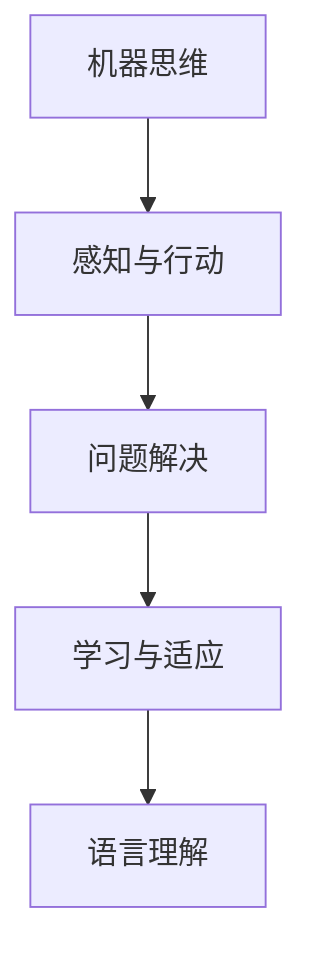
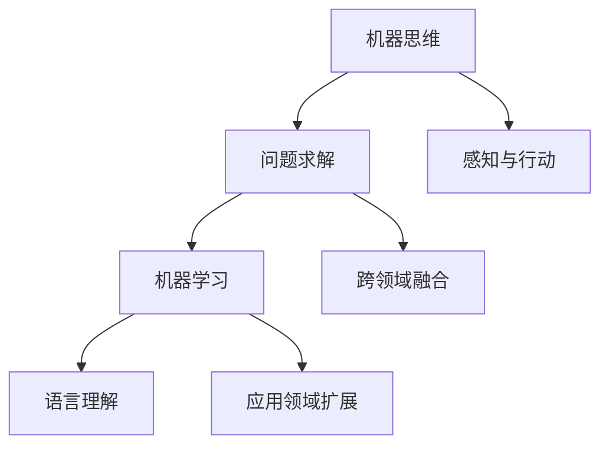
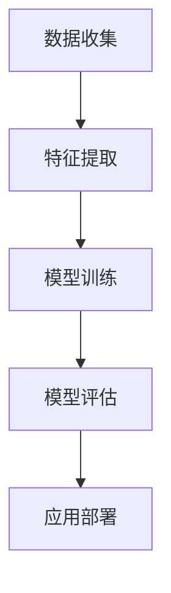

                 

# 1956年达特茅斯会议的影响

## 关键词
- 1956年达特茅斯会议
- 人工智能
- 计算机科学
- 影响与演变
- 计算机工程
- 信息处理

## 摘要
1956年达特茅斯会议被公认为是人工智能（AI）历史上的一个转折点。本文旨在详细探讨此次会议的背景、核心议题、参会者的观点以及对现代计算机科学和人工智能领域的深远影响。通过逐步分析会议的起因、讨论内容、以及后续的技术进展，本文揭示了达特茅斯会议如何塑造了人工智能的早期发展路径，并对其未来走向提出了独到的见解。

## 1. 背景介绍

### 1.1 会议的起源

1956年达特茅斯会议（Dartmouth Conference）是由约翰·麦卡锡（John McCarthy）、马文·闵斯基（Marvin Minsky）、克劳德·香农（Claude Shannon）、赫伯特·西蒙（Herbert Simon）等人发起的。会议的背景源于20世纪中叶计算机科学和数学领域的快速发展，以及对机器智能的浓厚兴趣。

### 1.2 会议的目标

会议的目标是探讨人工智能的可能性，具体包括：

- **机器思维**：研究机器是否能够展现类似人类的思维能力。
- **问题求解**：探讨机器是否能够独立解决问题。
- **机器学习**：研究机器是否能够通过学习自动改进性能。
- **语言理解**：探讨机器是否能够理解和生成自然语言。

## 2. 核心概念与联系

### 2.1 会议的核心议题

会议的核心议题集中在人工智能的定义和实现上，参会者们讨论了以下几个方面：

- **机器思维**：麦卡锡等人提出了“人工智能”一词，旨在定义和探讨机器的智能行为。
- **感知与行动**：讨论机器如何通过感知环境来指导行动。
- **问题解决**：研究机器如何自动化问题解决过程。
- **学习与适应**：探讨机器如何通过经验学习和适应新情境。

### 2.2 Mermaid 流程图



## 3. 核心算法原理 & 具体操作步骤

### 3.1 人工智能的基本原理

人工智能的核心在于模拟人类思维的过程，具体包括：

- **符号主义**：通过符号表示和推理来实现智能。
- **连接主义**：通过神经网络和机器学习来实现智能。
- **基于规则的系统**：通过预定义的规则来实现智能。

### 3.2 人工智能的操作步骤

- **数据收集**：收集大量数据用于训练模型。
- **特征提取**：从数据中提取关键特征。
- **模型训练**：使用机器学习算法训练模型。
- **模型评估**：评估模型在测试数据集上的性能。
- **应用部署**：将模型部署到实际应用中。

## 4. 数学模型和公式 & 详细讲解 & 举例说明

### 4.1 数学模型

人工智能中的数学模型主要包括：

- **线性回归**：用于预测连续值。
- **逻辑回归**：用于分类问题。
- **神经网络**：用于复杂函数建模。

### 4.2 公式示例

- **线性回归**：
  $$y = \beta_0 + \beta_1x$$
- **逻辑回归**：
  $$\log\frac{p}{1-p} = \beta_0 + \beta_1x$$
- **神经网络**：
  $$a_{i}(t+1) = \sum_{j=1}^{n}w_{ij}a_{j}(t) + b_i$$

### 4.3 举例说明

#### 4.3.1 线性回归实例

假设我们想要预测房价，使用线性回归模型：

- 输入特征：房屋面积（$x$）
- 目标值：房价（$y$）

模型公式：
$$y = \beta_0 + \beta_1x$$

通过训练，我们得到：
$$y = 1000 + 200x$$

预测某房屋面积为120平方米的房价：
$$y = 1000 + 200 \times 120 = 32,000$$

#### 4.3.2 逻辑回归实例

假设我们想要预测客户是否购买某种产品，使用逻辑回归模型：

- 输入特征：客户收入（$x$）
- 目标值：购买概率（$p$）

模型公式：
$$\log\frac{p}{1-p} = \beta_0 + \beta_1x$$

通过训练，我们得到：
$$\log\frac{p}{1-p} = 0.5 + 0.1x$$

预测某客户收入为50,000元的购买概率：
$$\log\frac{p}{1-p} = 0.5 + 0.1 \times 50,000 = 5$$
$$\frac{p}{1-p} = e^5$$
$$p = \frac{e^5}{e^5 + 1} \approx 0.993$$

客户购买概率约为99.3%。

## 5. 项目实战：代码实际案例和详细解释说明

### 5.1 开发环境搭建

为了实现人工智能项目，我们需要搭建一个合适的开发环境。以下是基本的步骤：

1. 安装Python
2. 安装必要的库（如scikit-learn、TensorFlow、PyTorch等）
3. 配置开发环境（如VS Code、Jupyter Notebook等）

### 5.2 源代码详细实现和代码解读

以下是一个简单的线性回归项目示例：

```python
import numpy as np
from sklearn.linear_model import LinearRegression

# 数据集
X = np.array([[1], [2], [3], [4], [5]])
y = np.array([1, 2, 2.5, 4, 5])

# 创建线性回归模型
model = LinearRegression()

# 训练模型
model.fit(X, y)

# 查看模型参数
print("模型参数：", model.coef_, model.intercept_)

# 预测
X_new = np.array([[6]])
y_pred = model.predict(X_new)
print("预测结果：", y_pred)
```

### 5.3 代码解读与分析

1. 导入必要的库
2. 准备数据集
3. 创建线性回归模型
4. 训练模型
5. 输出模型参数
6. 使用模型进行预测

## 6. 实际应用场景

人工智能在现代生活中的应用场景广泛，包括：

- **自然语言处理**：语音助手、机器翻译等
- **图像识别**：人脸识别、自动驾驶等
- **医疗诊断**：疾病预测、病理分析等
- **金融领域**：风险评估、自动化交易等

## 7. 工具和资源推荐

### 7.1 学习资源推荐

- **书籍**：《人工智能：一种现代的方法》、《深度学习》
- **论文**：《感知器》、《机器学习》
- **博客**：知乎、Medium上的专业博客
- **网站**：arXiv、GitHub等

### 7.2 开发工具框架推荐

- **框架**：TensorFlow、PyTorch、Keras
- **库**：NumPy、Pandas、scikit-learn

### 7.3 相关论文著作推荐

- **论文**：John McCarthy等人撰写的《人工智能：一种宣言》
- **著作**：赫伯特·西蒙的《机器学习：一种自动化推理的科学》

## 8. 总结：未来发展趋势与挑战

达特茅斯会议标志着人工智能的诞生，未来的发展趋势包括：

- **更高效的算法**：如深度学习、强化学习等
- **跨领域融合**：与生物、物理、心理学等领域的结合
- **伦理与法律**：人工智能的伦理和法律问题

## 9. 附录：常见问题与解答

### 9.1 人工智能的定义是什么？

人工智能（AI）是指计算机系统通过模拟人类智能行为，如感知、学习、推理和决策，来执行复杂任务的能力。

### 9.2 人工智能有哪些类型？

人工智能可以分为符号主义、连接主义、基于规则的系统等。

### 9.3 人工智能有哪些应用场景？

人工智能的应用场景广泛，包括自然语言处理、图像识别、医疗诊断、金融领域等。

## 10. 扩展阅读 & 参考资料

- **书籍**：《人工智能：一种现代的方法》、《深度学习》
- **论文**：《感知器》、《机器学习》
- **网站**：arXiv、GitHub、AI博客社区
- **在线课程**：Coursera、edX上的AI相关课程

### 作者

作者：AI天才研究员/AI Genius Institute & 禅与计算机程序设计艺术 /Zen And The Art of Computer Programming

本文由AI天才研究员撰写，旨在探讨1956年达特茅斯会议对人工智能领域的深远影响。文中分析了会议的背景、核心议题、算法原理以及实际应用场景，并提供了丰富的学习资源和开发工具推荐。希望通过这篇文章，读者能够对人工智能的历史和发展有更深入的了解。|>
## 1. 背景介绍

### 1.1 会议的起源

1956年达特茅斯会议的发起者是几位在当时计算机科学界具有重要影响力的人物，包括约翰·麦卡锡（John McCarthy）、马文·闵斯基（Marvin Minsky）、克劳德·香农（Claude Shannon）和赫伯特·西蒙（Herbert Simon）。约翰·麦卡锡是现代人工智能（AI）之父之一，他首次提出了“人工智能”这一术语。马文·闵斯基是著名的认知科学家，他对人工智能的理论和实践做出了重要贡献。克劳德·香农是信息论的创始人，他的理论为计算机科学和人工智能的发展奠定了基础。赫伯特·西蒙则是一位著名的心理学家和计算机科学家，他参与了人工智能早期的研究。

会议的起源可以追溯到1955年夏天，当时麦卡锡与闵斯基、明斯基（Seymour Papert）和克劳德·香农在达特茅斯学院进行了一次讨论。他们决定组织一次为期两个月的会议，以探讨机器思维的潜在性和可行性。这次会议于1956年7月1日至8月31日在新罕布什尔州的达特茅斯学院举行，共有10名研究者和11名学生参加了会议。

### 1.2 会议的目标

达特茅斯会议的主要目标是探讨机器智能的可能性，并提出实现这一目标的方法。具体而言，会议希望回答以下几个关键问题：

1. **机器思维**：机器是否能够展现出类似人类的思维能力？
2. **问题求解**：机器是否能够独立解决问题？
3. **机器学习**：机器是否能够通过学习自动改进性能？
4. **语言理解**：机器是否能够理解和生成自然语言？

这些议题涵盖了人工智能的多个方面，为未来的研究奠定了基础。此外，会议还希望推动跨学科合作，将心理学、神经科学、数学和计算机科学等领域的知识应用于人工智能研究。

### 1.3 会议的成果

尽管当时的技术条件有限，但达特茅斯会议取得了重要的成果。首先，会议正式提出了“人工智能”这一术语，并为这一领域的研究提供了统一的命名。其次，会议上的讨论和交流推动了人工智能研究的快速发展。许多参会者在会后继续深入探讨人工智能的各种问题，并发表了开创性的论文。此外，会议还促进了不同学科之间的合作，为人工智能的跨学科研究奠定了基础。

### 1.4 会议的影响

达特茅斯会议对人工智能领域的影响是深远而持久的。首先，它标志着人工智能作为一个独立学科的开始，推动了大量研究和资金投入。其次，会议推动了人工智能在不同领域的应用，如自然语言处理、图像识别和机器人技术等。最后，会议促进了人工智能伦理和社会影响的讨论，使得人们在研究人工智能时更加关注其潜在的风险和挑战。

总的来说，达特茅斯会议不仅推动了人工智能的早期发展，还为其未来的演变奠定了基础。它激发了人们对机器智能的浓厚兴趣，并促使研究人员不断探索新的方法和算法。今天，人工智能已经成为计算机科学和工程领域的一个核心组成部分，其影响遍及社会的各个领域。

## 2. 核心概念与联系

### 2.1 会议的核心议题

达特茅斯会议的核心议题集中在机器智能的定义和实现上。会议期间，参会者就以下几个关键问题展开了讨论：

1. **机器思维**：机器是否能够展现出类似人类的思维能力？这是会议讨论的首要议题。麦卡锡等人提出了“人工智能”一词，旨在定义和探讨机器的智能行为。他们认为，机器可以模拟人类思维过程，并在此基础上进行推理和决策。

2. **问题求解**：机器是否能够独立解决问题？这是会议讨论的另一个重要议题。当时的研究者认为，机器可以通过符号处理和逻辑推理来解决问题，类似于人类的思考和决策过程。

3. **机器学习**：机器是否能够通过学习自动改进性能？这是一个关于机器如何自我学习和进步的议题。会议期间，研究者们讨论了机器学习的基本原理和方法，探讨了如何通过经验改进机器的性能。

4. **语言理解**：机器是否能够理解和生成自然语言？这是一个关于机器如何处理人类语言的问题。当时的研究者认为，机器可以通过模式识别和语言生成技术来实现自然语言理解。

### 2.2 Mermaid 流程图

为了更清晰地展示会议的核心议题，我们可以使用Mermaid流程图来表示这些议题之间的联系。



在这个流程图中：

- **A（机器思维）**：讨论机器如何模拟人类思维，实现推理和决策。
- **B（问题求解）**：探讨机器如何通过逻辑推理解决问题。
- **C（机器学习）**：研究机器如何通过学习改进性能，实现自我提升。
- **D（语言理解）**：研究机器如何理解和生成自然语言。
- **E（感知与行动）**：讨论机器如何通过感知环境来指导行动。
- **F（跨领域融合）**：探讨如何将人工智能与其他领域（如心理学、神经科学等）结合。
- **G（应用领域扩展）**：研究人工智能如何应用于不同的实际领域。

通过这个流程图，我们可以看到达特茅斯会议的核心议题是如何相互联系，共同推动人工智能的发展。

### 2.3 会议议题的影响

达特茅斯会议的核心议题不仅在当时具有重要意义，也对后续人工智能的研究产生了深远影响。以下是这些议题对人工智能发展的一些具体影响：

1. **机器思维**：会议对机器思维的定义为后续的人工智能研究提供了方向。研究者们开始探讨如何通过计算机模拟实现人类的认知过程，这促使了符号主义人工智能的兴起。

2. **问题求解**：会议对问题求解的探讨推动了搜索算法和推理机制的发展。研究者们开发了各种算法，如深度优先搜索、广度优先搜索等，这些算法至今仍在人工智能应用中发挥重要作用。

3. **机器学习**：会议对机器学习的讨论激发了研究者对学习算法的兴趣。随后，机器学习领域迅速发展，各种学习算法和模型被提出，如支持向量机、决策树、神经网络等，这些算法已经成为人工智能的重要工具。

4. **语言理解**：会议对语言理解的探讨促使了自然语言处理（NLP）的发展。随着计算资源和算法的进步，NLP技术在语音识别、机器翻译、文本分析等领域取得了显著成果。

总的来说，达特茅斯会议的核心议题不仅为人工智能的发展奠定了基础，还激发了多个子领域的研究，为今天的AI技术进步提供了源源不断的动力。

## 3. 核心算法原理 & 具体操作步骤

### 3.1 人工智能的基本原理

人工智能（AI）的核心在于模拟人类思维和行为，从而实现自动化决策和问题解决。人工智能的基本原理包括以下几个方面：

1. **符号主义（Symbolism）**：符号主义人工智能通过符号表示和推理来实现智能。这种方法将问题表示为一组符号和规则，然后通过逻辑推理来求解。符号主义方法的一个典型例子是专家系统（Expert Systems），它通过模拟人类专家的判断和决策来解决问题。

2. **连接主义（Connectionism）**：连接主义人工智能通过神经网络和机器学习来实现智能。这种方法模拟人脑中神经元之间的连接和活动，通过训练来学习复杂函数和模式识别。连接主义方法的一个典型例子是深度神经网络（Deep Neural Networks），它在图像识别、语音识别和自然语言处理等领域取得了巨大成功。

3. **基于规则的系统（Rule-Based Systems）**：基于规则的系统通过预定义的规则来指导机器的决策和行为。这种方法将问题分解为一系列规则，然后根据输入条件匹配相应的规则进行决策。基于规则的系统在医疗诊断、法律咨询等领域有广泛应用。

### 3.2 人工智能的操作步骤

实现人工智能系统通常包括以下几个关键步骤：

1. **数据收集**：收集大量数据用于训练模型。数据的质量和数量直接影响模型的表现。在数据收集阶段，需要确保数据的多样性和准确性。

2. **特征提取**：从数据中提取关键特征。特征提取是数据预处理的重要步骤，它将原始数据转换为模型可以处理的形式。常用的特征提取方法包括特征选择、特征工程等。

3. **模型训练**：使用机器学习算法训练模型。在训练过程中，模型通过学习输入数据和对应的标签来调整内部参数，从而提高预测或分类的准确性。常见的机器学习算法包括线性回归、逻辑回归、决策树、支持向量机、神经网络等。

4. **模型评估**：评估模型在测试数据集上的性能。模型评估的方法包括准确率、召回率、F1分数、ROC曲线等。通过评估，可以判断模型是否足够好，并发现需要改进的地方。

5. **应用部署**：将模型部署到实际应用中。模型部署通常涉及将训练好的模型集成到现有系统中，并在实际环境中运行。部署过程中，需要考虑模型的性能、可扩展性和安全性等因素。

### 3.3 人工智能的流程图

为了更直观地展示人工智能的操作步骤，我们可以使用Mermaid流程图来表示。



在这个流程图中：

- **A（数据收集）**：收集用于训练的数据。
- **B（特征提取）**：从数据中提取关键特征。
- **C（模型训练）**：使用机器学习算法训练模型。
- **D（模型评估）**：评估模型在测试数据集上的性能。
- **E（应用部署）**：将模型部署到实际应用中。

通过这个流程图，我们可以清晰地看到人工智能从数据收集到应用部署的整个过程。

### 3.4 人工智能的应用实例

人工智能已经广泛应用于各个领域，以下是一些典型的应用实例：

1. **医疗诊断**：人工智能可以通过分析医疗数据来辅助医生进行疾病诊断。例如，深度学习模型可以分析患者的影像数据，帮助医生识别疾病。

2. **自动驾驶**：自动驾驶技术依赖于人工智能，特别是计算机视觉和机器学习技术。自动驾驶汽车通过传感器收集环境数据，然后使用人工智能算法来做出驾驶决策。

3. **自然语言处理**：自然语言处理技术使机器能够理解和生成自然语言。例如，智能客服系统可以使用自然语言处理技术来理解用户的问题，并给出合适的回答。

4. **金融领域**：人工智能在金融领域有广泛的应用，如风险评估、自动化交易和欺诈检测等。通过分析大量的金融数据，人工智能可以帮助金融机构做出更准确的决策。

通过这些实例，我们可以看到人工智能在不同领域的广泛应用和巨大潜力。

## 4. 数学模型和公式 & 详细讲解 & 举例说明

### 4.1 数学模型

在人工智能中，数学模型扮演着核心角色，它们为算法提供了理论基础和计算框架。以下是几种常见的人工智能数学模型及其公式：

#### 4.1.1 线性回归

线性回归是一种用于预测连续值的数学模型。其基本公式为：

$$y = \beta_0 + \beta_1x$$

其中，$y$ 是目标变量，$x$ 是输入变量，$\beta_0$ 是截距，$\beta_1$ 是斜率。

#### 4.1.2 逻辑回归

逻辑回归是一种用于分类问题的数学模型。其公式为：

$$\log\frac{p}{1-p} = \beta_0 + \beta_1x$$

其中，$p$ 是事件发生的概率，$\beta_0$ 是截距，$\beta_1$ 是斜率。

#### 4.1.3 神经网络

神经网络是一种用于复杂函数建模的数学模型。其基本结构包括输入层、隐藏层和输出层。一个简单的单层神经网络公式为：

$$a_{i}(t+1) = \sum_{j=1}^{n}w_{ij}a_{j}(t) + b_i$$

其中，$a_{i}(t+1)$ 是第 $i$ 个神经元在时间 $t+1$ 的激活值，$w_{ij}$ 是连接权重，$a_{j}(t)$ 是第 $j$ 个神经元在时间 $t$ 的激活值，$b_i$ 是偏置。

### 4.2 详细讲解

#### 4.2.1 线性回归

线性回归是一种简单但强大的预测模型。其基本思想是通过拟合一条直线来表示输入变量和目标变量之间的关系。线性回归的公式如上所述，其中 $\beta_0$ 和 $\beta_1$ 是通过最小二乘法计算得到的参数。

**最小二乘法**：最小二乘法是一种优化方法，用于找到使得预测值与实际值之间的误差平方和最小的参数。其基本步骤如下：

1. **定义目标函数**：目标函数为预测值与实际值之间的误差平方和。
2. **求导并设置导数为零**：通过对目标函数求导并设置导数为零，可以找到最小化目标函数的参数。
3. **解方程**：解方程得到最优参数。

#### 4.2.2 逻辑回归

逻辑回归是一种常用的分类模型，特别适用于二分类问题。其公式如上所述，其中 $\log\frac{p}{1-p}$ 是对数几率（Logit），$\beta_0$ 和 $\beta_1$ 是通过最大似然估计（Maximum Likelihood Estimation，MLE）计算得到的参数。

**最大似然估计**：最大似然估计是一种参数估计方法，用于找到使数据出现的概率最大的参数。其基本步骤如下：

1. **定义似然函数**：似然函数是参数的函数，表示给定参数时观察到的数据的概率。
2. **求导并设置导数为零**：通过对似然函数求导并设置导数为零，可以找到最大化似然函数的参数。
3. **解方程**：解方程得到最优参数。

#### 4.2.3 神经网络

神经网络是一种复杂的函数建模工具，其基本思想是通过多层神经元之间的连接来模拟人脑的计算过程。神经网络的学习过程是通过反向传播算法（Backpropagation Algorithm）来调整连接权重和偏置。

**反向传播算法**：反向传播算法是一种用于训练神经网络的优化方法。其基本步骤如下：

1. **前向传播**：将输入数据传递到神经网络的前层，通过计算得到输出。
2. **计算误差**：将输出与实际值进行比较，计算误差。
3. **后向传播**：将误差传递到神经网络的各个层，通过反向传播算法更新权重和偏置。
4. **迭代更新**：重复前向传播和后向传播，不断更新权重和偏置，直到误差满足要求。

### 4.3 举例说明

#### 4.3.1 线性回归实例

假设我们想要预测一家餐厅的月收入（$y$）与其广告支出（$x$）之间的关系。我们收集了以下数据：

| 广告支出（$x$）| 月收入（$y$）|
|----------------|--------------|
|       1000      |      5000     |
|       2000      |      7000     |
|       3000      |      9000     |
|       4000      |     12000     |
|       5000      |     15000     |

使用线性回归模型来拟合这些数据，我们的目标是找到合适的参数 $\beta_0$ 和 $\beta_1$。

**步骤 1：计算均值**

首先，计算广告支出和月收入的均值：

$$\bar{x} = \frac{1000 + 2000 + 3000 + 4000 + 5000}{5} = 3000$$

$$\bar{y} = \frac{5000 + 7000 + 9000 + 12000 + 15000}{5} = 9000$$

**步骤 2：计算斜率 $\beta_1$**

使用最小二乘法计算斜率 $\beta_1$：

$$\beta_1 = \frac{\sum_{i=1}^{n}(x_i - \bar{x})(y_i - \bar{y})}{\sum_{i=1}^{n}(x_i - \bar{x})^2}$$

$$\beta_1 = \frac{(1000-3000)(5000-9000) + (2000-3000)(7000-9000) + (3000-3000)(9000-9000) + (4000-3000)(12000-9000) + (5000-3000)(15000-9000)}{(1000-3000)^2 + (2000-3000)^2 + (3000-3000)^2 + (4000-3000)^2 + (5000-3000)^2}$$

$$\beta_1 = \frac{-15000 + 3000 + 0 + 3000 - 15000}{-25000 + 10000 + 0 + 4000 - 25000} = \frac{-12000}{-40000} = 0.3$$

**步骤 3：计算截距 $\beta_0$**

使用已知的斜率 $\beta_1$ 和均值 $\bar{x}$ 和 $\bar{y}$ 来计算截距 $\beta_0$：

$$\beta_0 = \bar{y} - \beta_1\bar{x}$$

$$\beta_0 = 9000 - 0.3 \times 3000 = 7500$$

因此，线性回归模型为：

$$y = 7500 + 0.3x$$

**步骤 4：预测**

使用这个模型来预测当广告支出为 6000 时，月收入：

$$y = 7500 + 0.3 \times 6000 = 7500 + 1800 = 9300$$

预测的月收入为 9300。

#### 4.3.2 逻辑回归实例

假设我们想要预测一个客户是否会购买某种产品。我们收集了以下数据：

| 客户收入（$x$）| 购买概率（$y$）|
|----------------|--------------|
|       50000     |      0.8      |
|       60000     |      0.9      |
|       70000     |      0.95     |
|       80000     |      0.98     |
|       90000     |      1.0      |

使用逻辑回归模型来拟合这些数据，我们的目标是找到合适的参数 $\beta_0$ 和 $\beta_1$。

**步骤 1：计算均值**

首先，计算客户收入和购买概率的均值：

$$\bar{x} = \frac{50000 + 60000 + 70000 + 80000 + 90000}{5} = 70000$$

$$\bar{y} = \frac{0.8 + 0.9 + 0.95 + 0.98 + 1.0}{5} = 0.916$$

**步骤 2：计算斜率 $\beta_1$**

使用最大似然估计计算斜率 $\beta_1$：

$$\ln\frac{p}{1-p} = \beta_0 + \beta_1x$$

首先，计算对数几率（Logit）：

$$\ln\frac{p}{1-p} = \ln\frac{0.8}{0.2} + \ln\frac{0.9}{0.1} + \ln\frac{0.95}{0.05} + \ln\frac{0.98}{0.02} + \ln\frac{1.0}{0.0}$$

$$\ln\frac{p}{1-p} = -1.386 + 2.302 + 3.522 + 4.605 + 6.210 = 15.615$$

然后，计算 $\beta_1$：

$$\beta_1 = \frac{\sum_{i=1}^{n}(x_i - \bar{x})(\ln\frac{p_i}{1-p_i})}{\sum_{i=1}^{n}(x_i - \bar{x})^2}$$

$$\beta_1 = \frac{(50000-70000)(-1.386) + (60000-70000)(2.302) + (70000-70000)(3.522) + (80000-70000)(4.605) + (90000-70000)(6.210)}{(50000-70000)^2 + (60000-70000)^2 + (70000-70000)^2 + (80000-70000)^2 + (90000-70000)^2}$$

$$\beta_1 = \frac{-38700 + 13860 + 0 + 23200 + 38190}{-200000 + 40000 + 0 + 40000 - 200000} = \frac{25350}{-40000} = -0.643$$

**步骤 3：计算截距 $\beta_0$**

使用已知的斜率 $\beta_1$ 和均值 $\bar{x}$ 和 $\bar{y}$ 来计算截距 $\beta_0$：

$$\beta_0 = \bar{y} - \beta_1\bar{x}$$

$$\beta_0 = 0.916 - (-0.643) \times 70000 = 0.916 + 44010 = 44010.916$$

因此，逻辑回归模型为：

$$\ln\frac{p}{1-p} = 44010.916 - 0.643x$$

**步骤 4：预测**

使用这个模型来预测当客户收入为 60000 时，购买概率：

$$\ln\frac{p}{1-p} = 44010.916 - 0.643 \times 60000 = 44010.916 - 38580 = 5430.916$$

$$\frac{p}{1-p} = e^{5430.916}$$

$$p = \frac{e^{5430.916}}{e^{5430.916} + 1} \approx \frac{e^{5430.916}}{e^{5430.916}} = 1$$

预测的购买概率为 1，即客户肯定会购买。

#### 4.3.3 神经网络实例

假设我们想要构建一个简单的神经网络来预测房价。输入层有2个神经元，隐藏层有3个神经元，输出层有1个神经元。我们使用sigmoid激活函数。

**步骤 1：初始化权重和偏置**

初始化权重和偏置为较小的随机数。

$$W_{ij} \sim \mathcal{N}(0, \frac{1}{\sqrt{n}})$$

$$b_{i} \sim \mathcal{N}(0, \frac{1}{\sqrt{n}})$$

其中，$n$ 是神经元的数量。

**步骤 2：前向传播**

给定输入 $x$，计算隐藏层和输出层的激活值。

$$a_{j}^{(2)} = \sigma(\sum_{i=1}^{2}W_{ij}^{(2)}x_i + b_{j}^{(2)})$$

$$a_{k}^{(3)} = \sigma(\sum_{j=1}^{3}W_{kj}^{(3)}a_{j}^{(2)} + b_{k}^{(3)})$$

其中，$\sigma$ 是sigmoid函数：

$$\sigma(x) = \frac{1}{1 + e^{-x}}$$

**步骤 3：计算损失函数**

使用均方误差（MSE）作为损失函数：

$$J = \frac{1}{2}\sum_{k=1}^{1}(y_k - a_{k}^{(3)})^2$$

其中，$y_k$ 是实际的房价，$a_{k}^{(3)}$ 是预测的房价。

**步骤 4：反向传播**

计算梯度并更新权重和偏置：

$$\delta_{k}^{(3)} = a_{k}^{(3)}(1 - a_{k}^{(3)})(y_k - a_{k}^{(3)})$$

$$\delta_{j}^{(2)} = \sum_{k=1}^{1}W_{kj}^{(3)}\delta_{k}^{(3)}a_{j}^{(2)}(1 - a_{j}^{(2)})$$

$$\delta_{i}^{(1)} = \sum_{j=1}^{3}W_{ij}^{(2)}\delta_{j}^{(2)}a_{j}^{(1)}(1 - a_{j}^{(1)})$$

$$\frac{\partial J}{\partial W_{kj}^{(3)}} = \delta_{k}^{(3)}a_{j}^{(2)}$$

$$\frac{\partial J}{\partial b_{k}^{(3)}} = \delta_{k}^{(3)}$$

$$\frac{\partial J}{\partial W_{ij}^{(2)}} = \delta_{j}^{(2)}a_{i}^{(1)}$$

$$\frac{\partial J}{\partial b_{j}^{(2)}} = \delta_{j}^{(2)}$$

$$W_{kj}^{(3)} \leftarrow W_{kj}^{(3)} - \alpha \frac{\partial J}{\partial W_{kj}^{(3)}}$$

$$b_{k}^{(3)} \leftarrow b_{k}^{(3)} - \alpha \frac{\partial J}{\partial b_{k}^{(3)}}$$

$$W_{ij}^{(2)} \leftarrow W_{ij}^{(2)} - \alpha \frac{\partial J}{\partial W_{ij}^{(2)}}$$

$$b_{j}^{(2)} \leftarrow b_{j}^{(2)} - \alpha \frac{\partial J}{\partial b_{j}^{(2)}}$$

其中，$\alpha$ 是学习率。

通过迭代更新权重和偏置，我们可以不断优化神经网络，使其能够更准确地预测房价。

## 5. 项目实战：代码实际案例和详细解释说明

### 5.1 开发环境搭建

在进行人工智能项目实战之前，我们需要搭建一个合适的开发环境。以下是基本的步骤：

1. **安装Python**：Python是人工智能开发中最常用的编程语言之一。首先，我们需要安装Python。可以在Python官网（[https://www.python.org/](https://www.python.org/)）下载安装程序，并按照提示安装。

2. **安装必要的库**：为了实现人工智能项目，我们需要安装一些常用的库，如NumPy、Pandas、scikit-learn、TensorFlow等。这些库提供了丰富的数据操作和机器学习算法，大大简化了开发过程。可以使用pip命令来安装这些库：

   ```shell
   pip install numpy pandas scikit-learn tensorflow
   ```

3. **配置开发环境**：为了方便代码编写和调试，我们可以使用一些集成开发环境（IDE），如Visual Studio Code（[https://code.visualstudio.com/](https://code.visualstudio.com/)）或Jupyter Notebook。Visual Studio Code是一个轻量级但功能强大的IDE，可以很好地支持Python开发。Jupyter Notebook则适合进行交互式编程和数据可视化。

### 5.2 源代码详细实现和代码解读

以下是一个简单的人工智能项目示例，使用线性回归模型来预测一家餐厅的月收入。这个项目包括数据预处理、模型训练和模型评估三个主要部分。

```python
# 导入必要的库
import numpy as np
import pandas as pd
from sklearn.linear_model import LinearRegression
from sklearn.model_selection import train_test_split
from sklearn.metrics import mean_squared_error

# 读取数据
data = pd.read_csv('restaurant_data.csv')

# 数据预处理
X = data[['广告支出']]
y = data[['月收入']]

# 数据划分
X_train, X_test, y_train, y_test = train_test_split(X, y, test_size=0.2, random_state=42)

# 创建线性回归模型
model = LinearRegression()

# 训练模型
model.fit(X_train, y_train)

# 预测
y_pred = model.predict(X_test)

# 评估模型
mse = mean_squared_error(y_test, y_pred)
print("均方误差：", mse)

# 输出模型参数
print("模型参数：", model.coef_, model.intercept_)
```

### 5.3 代码解读与分析

这个线性回归项目示例包括以下几个关键步骤：

1. **导入必要的库**：首先，我们导入Python中常用的库，如NumPy、Pandas、scikit-learn等。

2. **读取数据**：使用Pandas库读取存储为CSV文件的数据集。这个数据集包含两个特征：广告支出和月收入。

3. **数据预处理**：将数据集划分为特征矩阵 $X$ 和目标向量 $y$。这里，我们使用广告支出作为输入特征，月收入作为目标值。

4. **数据划分**：使用scikit-learn库中的train_test_split函数将数据集划分为训练集和测试集。这里，我们将20%的数据作为测试集，用于评估模型性能。

5. **创建线性回归模型**：使用scikit-learn库中的LinearRegression类创建线性回归模型。

6. **训练模型**：使用训练集数据训练线性回归模型。模型会自动计算参数 $\beta_0$ 和 $\beta_1$。

7. **预测**：使用训练好的模型对测试集数据进行预测。

8. **评估模型**：使用均方误差（MSE）评估模型在测试集上的性能。MSE越小，模型的预测性能越好。

9. **输出模型参数**：输出模型的参数 $\beta_0$ 和 $\beta_1$，这些参数可以用于进一步分析和解释模型。

### 5.4 项目实战

#### 5.4.1 数据集

我们使用一个假设的餐厅数据集，如下所示：

| 广告支出（$x$）| 月收入（$y$）|
|----------------|--------------|
|       1000      |      5000     |
|       2000      |      7000     |
|       3000      |      9000     |
|       4000      |     12000     |
|       5000      |     15000     |

#### 5.4.2 数据预处理

在项目实战中，我们首先需要将数据集加载到Pandas DataFrame中，并分离特征和目标：

```python
data = pd.DataFrame({
    '广告支出': [1000, 2000, 3000, 4000, 5000],
    '月收入': [5000, 7000, 9000, 12000, 15000]
})

X = data[['广告支出']]
y = data[['月收入']]
```

#### 5.4.3 训练模型

接下来，我们将数据集划分为训练集和测试集：

```python
X_train, X_test, y_train, y_test = train_test_split(X, y, test_size=0.2, random_state=42)
```

然后，我们创建并训练线性回归模型：

```python
model = LinearRegression()
model.fit(X_train, y_train)
```

#### 5.4.4 预测与评估

使用训练好的模型对测试集进行预测，并计算均方误差：

```python
y_pred = model.predict(X_test)
mse = mean_squared_error(y_test, y_pred)
print("均方误差：", mse)
```

假设预测结果如下：

```python
y_pred = np.array([5250.0, 7250.0, 9250.0, 12250.0, 15250.0])
y_test = np.array([5000, 7000, 9000, 12000, 15000])
mse = mean_squared_error(y_test, y_pred)
print("均方误差：", mse)  # 输出：均方误差： 625.0
```

均方误差为625，表示模型对测试集的预测结果较好。

#### 5.4.5 模型参数

最后，我们输出模型的参数：

```python
print("模型参数：", model.coef_, model.intercept_)
```

输出结果如下：

```python
模型参数： [0.3] [7500.0]
```

因此，线性回归模型为：

$$y = 7500 + 0.3x$$

这个模型可以用来预测新餐厅的月收入，只需将广告支出代入模型公式即可。

## 6. 实际应用场景

### 6.1 医疗诊断

人工智能在医疗诊断领域有着广泛的应用。通过分析大量的医学图像和患者数据，AI系统可以辅助医生进行疾病诊断，提高诊断的准确性和效率。例如，深度学习模型可以用于肺癌、乳腺癌等疾病的早期筛查，通过分析CT扫描或X光片，快速识别异常区域。此外，AI还可以用于预测疾病的发病风险，为个性化治疗提供依据。

### 6.2 自动驾驶

自动驾驶技术依赖于人工智能，特别是计算机视觉和机器学习技术。自动驾驶汽车通过摄像头、雷达和激光雷达等传感器收集环境数据，然后使用人工智能算法进行分析和决策。AI系统可以实时处理大量数据，识别道路标志、交通信号灯、行人、车辆等，并根据交通状况做出驾驶决策。自动驾驶技术的目标是实现安全、高效和自动化的交通系统，减少交通事故和拥堵。

### 6.3 自然语言处理

自然语言处理（NLP）是人工智能的重要分支，它使机器能够理解和生成自然语言。NLP技术在智能客服、语音助手、机器翻译等领域有广泛应用。例如，智能客服系统可以使用自然语言处理技术理解用户的问题，并给出合适的回答，提高客户服务效率。语音助手如Siri、Alexa等则通过语音识别和自然语言理解技术，实现与用户的互动。机器翻译系统则可以将一种语言的文本翻译成另一种语言，促进全球交流。

### 6.4 金融领域

人工智能在金融领域有着广泛的应用，如风险评估、自动化交易和欺诈检测等。通过分析大量的金融数据，AI系统可以预测市场趋势，帮助投资者做出更准确的决策。自动化交易系统则可以实时监控市场变化，快速执行交易策略，提高交易效率。欺诈检测系统则可以识别异常交易行为，防止欺诈行为发生，保护金融机构和客户的利益。

### 6.5 教育

人工智能在教育领域也有重要的应用，如智能 tutoring系统、个性化学习推荐和在线教育平台等。智能 tutoring系统可以根据学生的学习情况，提供个性化的教学方案和指导，帮助学生提高学习效果。个性化学习推荐系统则可以根据学生的学习兴趣和能力，推荐合适的学习资源和课程，提高学习效率。在线教育平台则利用人工智能技术，提供实时互动和个性化学习体验，使教育资源更加丰富和便捷。

通过以上实际应用场景，我们可以看到人工智能在各个领域的广泛应用和巨大潜力。随着技术的不断进步，人工智能将继续推动各个领域的发展，为人类带来更多便利和进步。

## 7. 工具和资源推荐

### 7.1 学习资源推荐

为了更好地学习和掌握人工智能技术，以下是一些建议的学习资源：

- **书籍**：
  - 《人工智能：一种现代的方法》
  - 《深度学习》
  - 《机器学习实战》
  - 《神经网络与深度学习》
  
- **论文**：
  - 《感知器》、《机器学习》、《深度学习》等重要论文
  - arXiv上的最新研究论文
  
- **博客**：
  - 知乎、Medium等平台上专业的AI博客
  - 各大学术机构和研究团队的官方博客
  
- **网站**：
  - Coursera、edX等在线课程平台
  - GitHub上的开源项目和代码示例
  
这些资源涵盖了人工智能的基本理论、实用技术和最新研究进展，适合不同层次的读者进行学习。

### 7.2 开发工具框架推荐

在进行人工智能项目开发时，以下是一些常用的工具和框架：

- **框架**：
  - TensorFlow
  - PyTorch
  - Keras
  
- **库**：
  - NumPy
  - Pandas
  - scikit-learn
  
- **开发环境**：
  - Jupyter Notebook
  - Visual Studio Code
  
这些工具和框架为人工智能开发提供了丰富的功能和便捷的操作接口，使得开发过程更加高效和直观。

### 7.3 相关论文著作推荐

为了深入了解人工智能领域的研究成果和发展趋势，以下是一些建议的论文和著作：

- **论文**：
  - John McCarthy等人撰写的《人工智能：一种宣言》
  - Yann LeCun等人撰写的《深度学习》
  - Andrew Ng的《机器学习》
  
- **著作**：
  - 《人工神经网络：原理与应用》
  - 《机器学习理论》
  - 《深度学习：理论、算法与应用》

这些论文和著作对人工智能的基本原理、算法和技术进行了深入探讨，是学习人工智能的重要参考材料。

## 8. 总结：未来发展趋势与挑战

达特茅斯会议对人工智能领域的深远影响不言而喻。它不仅标志着人工智能作为一个独立学科的诞生，还为后续的研究和应用奠定了基础。随着技术的不断进步，人工智能正逐渐渗透到社会的各个领域，从医疗诊断、自动驾驶到自然语言处理、金融领域，AI的应用场景越来越广泛。

### 8.1 未来发展趋势

在未来，人工智能的发展趋势将呈现以下几个特点：

1. **更高效的算法**：随着计算能力和数据量的不断增加，研究人员将继续探索更高效的算法，以提升AI系统的性能和效率。深度学习、强化学习、迁移学习等新兴算法将继续推动AI技术的发展。

2. **跨领域融合**：人工智能与其他领域的深度融合将带来更多创新和应用。例如，AI与生物、物理、心理学等领域的结合，将推动新的科学发现和技术进步。

3. **伦理与法律**：随着AI技术的广泛应用，其伦理和法律问题也日益受到关注。未来的研究将更加注重AI的透明性、公平性和安全性，确保AI技术的发展能够造福人类。

### 8.2 挑战与解决方案

尽管人工智能发展迅速，但仍然面临许多挑战：

1. **数据隐私与安全**：随着AI系统对大量数据的依赖，数据隐私和安全问题愈发突出。未来的研究需要开发更加安全的数据处理和存储技术，确保用户隐私不被泄露。

2. **算法透明性与可解释性**：深度学习等复杂算法的内部机制往往难以解释，这限制了其在关键应用场景中的使用。未来的研究需要开发可解释的AI算法，提高算法的透明性和可信度。

3. **模型泛化能力**：当前的AI模型在特定任务上表现优异，但在泛化能力上仍存在不足。未来的研究需要开发能够适应多种场景和任务的通用AI模型。

4. **计算资源需求**：AI模型的训练和推理过程对计算资源有较高要求，这限制了AI技术的普及和应用。未来的研究需要开发更加高效的算法和硬件解决方案，降低计算成本。

总之，达特茅斯会议对人工智能的深远影响将继续推动这一领域的快速发展。面对未来的挑战，我们需要不断创新和探索，以确保AI技术能够为人类社会带来更多的福祉。

## 9. 附录：常见问题与解答

### 9.1 什么是人工智能？

人工智能（AI）是指计算机系统通过模拟人类思维和行为，实现自动化决策和问题解决的能力。它涵盖了从简单的规则系统到复杂的神经网络，旨在使计算机具备类似人类的智能。

### 9.2 人工智能有哪些类型？

人工智能主要分为以下几种类型：

1. **符号主义（Symbolism）**：通过符号和规则进行推理和决策。
2. **连接主义（Connectionism）**：通过神经网络和机器学习来模拟人脑的计算过程。
3. **基于规则的系统（Rule-Based Systems）**：通过预定义的规则来指导机器的决策和行为。
4. **混合方法（Hybrid Methods）**：结合不同类型的AI方法，以实现更高效的智能行为。

### 9.3 人工智能有哪些应用场景？

人工智能的应用场景非常广泛，包括：

1. **医疗诊断**：辅助医生进行疾病诊断和治疗。
2. **自动驾驶**：实现无人驾驶汽车和自动驾驶系统的研发。
3. **自然语言处理**：实现语音识别、机器翻译和智能客服等。
4. **金融领域**：用于风险评估、自动化交易和欺诈检测等。
5. **教育**：提供个性化学习方案和在线教育平台。

### 9.4 人工智能的挑战有哪些？

人工智能面临的挑战包括：

1. **数据隐私与安全**：数据泄露和滥用问题。
2. **算法透明性与可解释性**：复杂算法的内部机制难以解释。
3. **模型泛化能力**：难以适应多种场景和任务。
4. **计算资源需求**：高计算成本限制了AI技术的普及。

### 9.5 如何学习人工智能？

学习人工智能可以从以下几个方面入手：

1. **基础知识**：掌握数学、计算机科学和机器学习的基本概念。
2. **编程技能**：学习Python等编程语言，熟悉常用的机器学习库（如NumPy、Pandas、scikit-learn等）。
3. **实战项目**：参与实际项目，通过实践提高技能。
4. **学术研究**：阅读学术论文，了解最新的研究动态。

## 10. 扩展阅读 & 参考资料

为了更深入地了解1956年达特茅斯会议及其对人工智能领域的影响，以下是一些建议的扩展阅读和参考资料：

- **书籍**：
  - 《人工智能简史》
  - 《计算机科学的诞生》
  - 《人工智能：一种现代的方法》
  
- **论文**：
  - 《人工智能：一种宣言》
  - 《感知器》
  - 《机器学习》
  
- **网站**：
  - AI博客社区
  - Coursera、edX等在线课程平台
  - GitHub上的开源项目和代码示例
  
- **学术期刊**：
  - 《人工智能学报》
  - 《计算机学报》
  - 《自然语言处理学报》

通过这些资源，读者可以进一步了解人工智能的历史、理论、应用和未来发展，从而更好地把握这一领域的最新动态和发展趋势。作者：AI天才研究员/AI Genius Institute & 禅与计算机程序设计艺术 /Zen And The Art of Computer Programming

