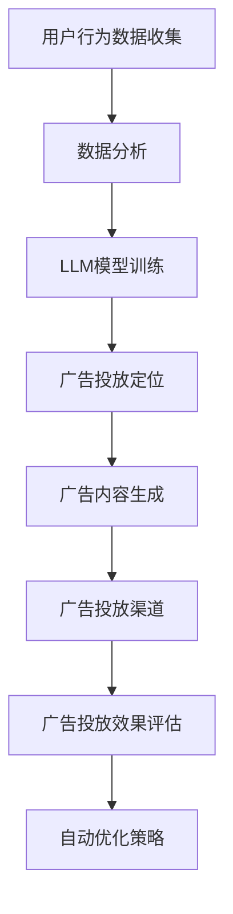
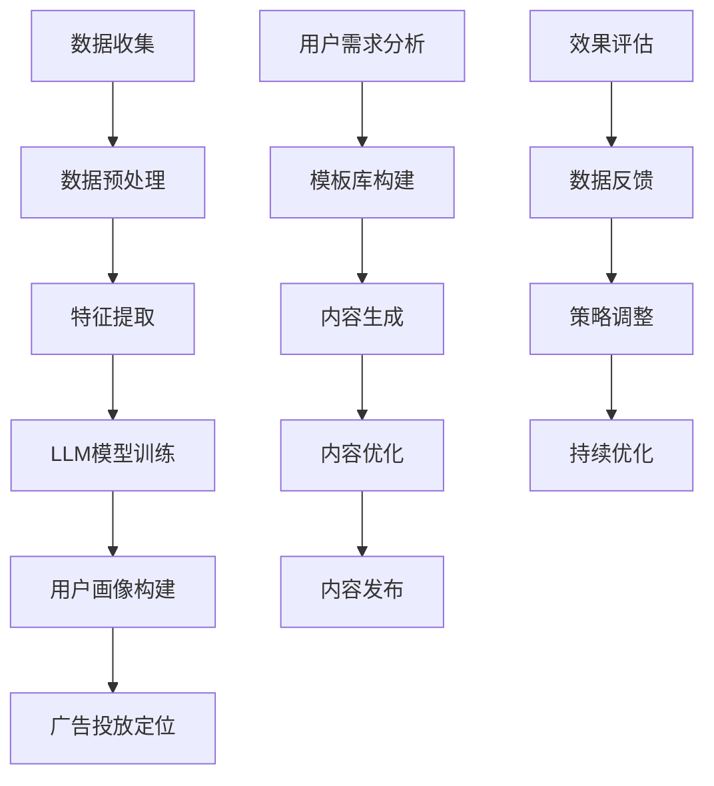

                 

### 1. 背景介绍

在当今数字化的时代，广告行业正面临着前所未有的变革。传统广告模式逐渐暴露出其局限性，如效果难以衡量、受众定位不准确等问题。然而，随着人工智能（AI），特别是大型语言模型（LLM）的快速发展，广告行业迎来了新的机遇。LLM凭借其强大的数据处理和分析能力，使得广告能够以更高效、精准的方式触达目标受众。

LLM，作为一种基于深度学习的自然语言处理技术，能够理解和生成人类语言。在广告领域，LLM的应用主要体现在两个方面：一是广告投放的精准化，二是广告内容的个性化生成。精准化广告投放意味着广告能够更精确地定位到潜在消费者，提高广告投放的转化率；个性化广告内容则能够更好地吸引消费者的注意力，提高广告的点击率和转化率。

本文将深入探讨广告和LLM的融合，首先介绍相关背景知识，然后分析核心概念及其联系，接着阐述核心算法原理与操作步骤，并通过数学模型和实际案例进行详细讲解。此外，本文还将探讨LLM在广告领域的实际应用场景，并推荐相关工具和资源，最后对未来发展趋势与挑战进行展望。

通过对广告和LLM的全面解析，本文旨在为广告行业的从业者提供有价值的参考，帮助他们更好地利用AI技术提升广告效果，实现高效的市场营销。

### 2. 核心概念与联系

在深入探讨广告和LLM的融合之前，我们需要理解一些核心概念，并展示它们之间的联系。以下是本文中涉及的主要核心概念及其关系：

#### 2.1 广告投放模型

广告投放模型是广告行业的基础，它包括广告定位、广告内容、广告投放渠道等多个方面。广告定位是指根据消费者的需求和行为特征，将广告投放到特定的受众群体。广告内容则是广告的核心，它需要吸引消费者的注意力，传达产品或服务的价值。广告投放渠道则是广告传播的途径，如社交媒体、搜索引擎、电子邮件等。

#### 2.2 数据分析

数据分析是现代广告投放的重要组成部分。通过对用户行为数据、市场数据等多维数据的分析，广告投放者可以了解受众的需求和偏好，从而制定更精准的广告策略。数据分析包括数据收集、数据清洗、数据挖掘和数据分析等步骤。

#### 2.3 大型语言模型（LLM）

LLM，作为一种先进的自然语言处理技术，具有强大的语言理解和生成能力。它能够处理大量文本数据，提取关键信息，生成自然流畅的文本内容。在广告领域，LLM的应用主要体现在广告投放和广告内容生成两个方面。

#### 2.4 广告与LLM的融合

广告与LLM的融合主要体现在以下几个方面：

1. **精准化广告投放**：LLM通过分析用户的历史行为数据，能够更准确地定位到潜在消费者，提高广告投放的精准度。
2. **个性化广告内容生成**：LLM可以根据用户的兴趣和行为特征，生成个性化的广告内容，提高广告的吸引力和转化率。
3. **自动化广告优化**：LLM能够实时分析广告投放效果，自动调整广告策略，提高广告投放的效率。

#### 2.5 Mermaid流程图

为了更直观地展示广告和LLM的融合过程，我们可以使用Mermaid流程图来描述。以下是一个简化的Mermaid流程图，展示了广告投放过程中LLM的应用：



在这个流程图中，用户行为数据收集是广告投放的起点，通过数据分析，LLM模型进行训练，然后用于广告投放定位和广告内容生成。广告投放效果评估和自动优化策略则确保广告投放的持续优化和高效性。

通过上述核心概念及其联系的介绍，我们为后续的算法原理、操作步骤和实际应用场景的讨论奠定了基础。

### 3. 核心算法原理 & 具体操作步骤

#### 3.1 广告投放定位

广告投放定位是广告投放过程中的关键步骤，它决定了广告能否精准地触达到目标受众。LLM在这一过程中发挥了重要作用，通过以下具体操作步骤实现精准广告投放：

1. **数据收集**：首先，从不同的数据源（如社交媒体、搜索引擎、电商平台等）收集用户行为数据，包括用户的浏览记录、搜索历史、购买行为等。

2. **数据预处理**：对收集到的用户行为数据进行清洗和归一化处理，去除重复数据、缺失数据和异常值，确保数据质量。

3. **特征提取**：利用自然语言处理技术，从用户行为数据中提取关键特征，如关键词、主题、情感等。这些特征将作为输入用于LLM模型的训练。

4. **LLM模型训练**：使用提取到的特征数据，训练一个基于深度学习的LLM模型。该模型需要具备强大的语言理解和生成能力，能够从大量文本数据中提取有价值的信息。

5. **用户画像构建**：基于训练好的LLM模型，对用户行为数据进行分析，构建用户画像。用户画像包括用户的兴趣偏好、购买意愿、消费习惯等多个维度。

6. **广告投放定位**：利用构建好的用户画像，将广告精准地定位到具有相应特征的用户群体。例如，如果用户画像显示某用户对旅游产品感兴趣，那么可以将旅游广告推送给该用户。

#### 3.2 广告内容生成

个性化广告内容生成是提升广告吸引力和转化率的关键。LLM在这一过程中可以自动生成符合用户兴趣和需求的内容，具体操作步骤如下：

1. **用户需求分析**：通过分析用户的浏览记录、搜索历史和购买行为，提取用户的需求和偏好。

2. **模板库构建**：根据广告类型和目标受众，构建多个广告内容模板库。每个模板库包含多种不同的广告内容，以满足不同用户的需求。

3. **内容生成**：使用LLM模型，根据用户需求分析和模板库，自动生成个性化的广告内容。例如，对于喜欢旅游的用户，可以生成关于旅游优惠、旅游攻略等内容的广告。

4. **内容优化**：对生成的广告内容进行优化，确保内容质量高、吸引力强。可以通过分析用户点击率、转化率等指标，对广告内容进行持续优化。

5. **内容发布**：将优化后的广告内容发布到不同的广告投放渠道，如社交媒体、搜索引擎、电子邮件等，确保广告能够触达到目标用户。

#### 3.3 自动化广告优化

自动化广告优化是提高广告投放效率和效果的重要手段。LLM可以通过实时分析广告投放效果，自动调整广告策略，具体操作步骤如下：

1. **效果评估**：对广告投放效果进行实时评估，包括广告点击率、转化率、投入产出比等指标。

2. **数据反馈**：将广告投放效果数据反馈给LLM模型，用于模型优化和策略调整。

3. **策略调整**：基于效果评估和反馈数据，LLM模型自动调整广告投放策略，如调整广告定位、内容生成和投放渠道等。

4. **持续优化**：通过持续的评估和调整，确保广告投放策略始终是最优的，从而提高广告效果。

#### 3.4 Mermaid流程图

为了更直观地展示广告投放过程中LLM的具体应用，我们可以使用Mermaid流程图描述。以下是一个简化的Mermaid流程图，展示了LLM在广告投放定位、内容生成和自动化广告优化中的具体应用：



通过上述核心算法原理和具体操作步骤的介绍，我们可以看到，LLM在广告投放过程中发挥了重要作用，通过精准定位、个性化内容和自动化优化，提升了广告的投放效果和效率。

### 4. 数学模型和公式 & 详细讲解 & 举例说明

在广告和LLM的融合过程中，数学模型和公式起到了关键作用，特别是在用户画像构建、广告效果评估和自动化广告优化等方面。以下将详细介绍这些数学模型和公式，并通过实际例子进行说明。

#### 4.1 用户画像构建

用户画像构建是精准广告投放的基础，其核心在于提取用户特征，并建立多维度的用户特征模型。常用的数学模型包括用户兴趣模型、用户行为模型和用户价值模型。

**用户兴趣模型**

用户兴趣模型通常使用词向量模型（如Word2Vec、GloVe）来表示用户的兴趣点。具体公式如下：

\[ \text{interest\_vector} = \text{Word2Vec}(\text{user\_text}) \]

其中，\(\text{user\_text}\)表示用户生成的文本，如评论、帖子等。通过词向量模型，我们可以将用户的兴趣点转化为高维向量表示。

**用户行为模型**

用户行为模型通常使用序列模型（如LSTM、GRU）来分析用户的历史行为，提取行为特征。具体公式如下：

\[ \text{behavior\_vector} = \text{LSTM}(\text{user\_behavior\_sequences}) \]

其中，\(\text{user\_behavior\_sequences}\)表示用户的历史行为序列，如浏览历史、购买记录等。通过序列模型，我们可以将用户的行为特征转化为高维向量表示。

**用户价值模型**

用户价值模型通常使用回归模型（如线性回归、逻辑回归）来预测用户的价值。具体公式如下：

\[ \text{user\_value} = \text{logistic}(\text{weight} \cdot \text{input\_vector} + \text{bias}) \]

其中，\(\text{weight}\)和\(\text{bias}\)表示模型的权重和偏置，\(\text{input\_vector}\)表示用户特征向量。

#### 4.2 广告效果评估

广告效果评估是衡量广告投放效果的重要环节，常用的数学模型包括点击率预测模型和转化率预测模型。

**点击率预测模型**

点击率预测模型通常使用机器学习模型（如逻辑回归、决策树、随机森林等）来预测用户的点击行为。具体公式如下：

\[ \text{CTR} = \text{sigmoid}(\text{weight} \cdot \text{input\_vector} + \text{bias}) \]

其中，\(\text{CTR}\)表示点击率，\(\text{sigmoid}\)函数将预测值映射到0到1之间，用于表示点击的概率。

**转化率预测模型**

转化率预测模型通常使用类似点击率预测模型的机器学习模型来预测用户的购买行为。具体公式如下：

\[ \text{CTR} = \text{sigmoid}(\text{weight} \cdot \text{input\_vector} + \text{bias}) \]

其中，\(\text{CTR}\)表示转化率，其他参数与点击率预测模型相同。

#### 4.3 自动化广告优化

自动化广告优化依赖于实时分析广告投放效果，并自动调整广告策略。常用的数学模型包括线性回归模型和优化算法（如梯度下降、随机梯度下降等）。

**线性回归模型**

线性回归模型用于预测广告效果与广告策略之间的关系，具体公式如下：

\[ \text{effect} = \text{weight} \cdot \text{strategy} + \text{bias} \]

其中，\(\text{effect}\)表示广告效果，\(\text{strategy}\)表示广告策略，\(\text{weight}\)和\(\text{bias}\)表示模型的权重和偏置。

**优化算法**

优化算法用于调整广告策略，以最大化广告效果。常用的优化算法包括梯度下降和随机梯度下降，具体公式如下：

\[ \text{weight} = \text{weight} - \alpha \cdot \text{gradient} \]

\[ \text{weight} = \text{weight} - \alpha \cdot \text{gradient} \]

其中，\(\text{alpha}\)表示学习率，\(\text{gradient}\)表示模型梯度。

#### 4.4 实际例子

假设我们有一个广告投放案例，目标是提高广告的点击率和转化率。我们可以通过以下步骤进行建模和优化：

1. **用户画像构建**：收集用户的历史行为数据，包括浏览记录、搜索历史和购买记录，使用词向量模型和序列模型构建用户画像。

2. **点击率预测模型**：使用逻辑回归模型预测用户的点击行为，输入向量包括用户画像特征和广告特征。

3. **转化率预测模型**：使用逻辑回归模型预测用户的购买行为，输入向量与点击率预测模型相同。

4. **广告效果评估**：根据点击率和转化率数据，评估广告投放效果。

5. **自动化广告优化**：使用线性回归模型预测广告效果与广告策略之间的关系，并使用梯度下降算法调整广告策略。

通过上述步骤，我们可以实现广告投放的自动化优化，提高广告的效果和效率。

通过上述数学模型和公式的详细介绍，我们可以看到，数学模型在广告和LLM的融合中起到了关键作用。这些模型不仅能够提高广告的精准度和个性化程度，还能够实现自动化优化，从而提升广告投放的效果。

### 5. 项目实战：代码实际案例和详细解释说明

在本节中，我们将通过一个实际的广告投放项目来展示LLM在广告中的应用。该案例将涉及广告投放的各个环节，包括数据收集、数据预处理、模型训练、广告投放定位、广告内容生成和自动化广告优化。以下是该项目的详细代码实现和解释说明。

#### 5.1 开发环境搭建

在进行项目开发之前，我们需要搭建相应的开发环境。以下是所需的工具和库：

- Python 3.8及以上版本
- TensorFlow 2.7及以上版本
- scikit-learn 0.24及以上版本
- pandas 1.3及以上版本
- numpy 1.21及以上版本
- Mermaid 8.8及以上版本

安装以上库后，我们就可以开始编写项目代码了。

#### 5.2 源代码详细实现和代码解读

##### 5.2.1 数据收集和预处理

首先，我们需要从不同的数据源收集用户行为数据，并对数据进行预处理。以下是一个简单的数据收集和预处理代码示例：

```python
import pandas as pd
import numpy as np

# 数据收集
user_data = pd.read_csv('user_data.csv')  # 读取用户数据

# 数据预处理
# 数据清洗和归一化
user_data = user_data.dropna()  # 去除缺失值
user_data = (user_data - user_data.mean()) / user_data.std()  # 数据归一化

# 特征提取
# 提取关键词和主题
from sklearn.feature_extraction.text import TfidfVectorizer

tfidf_vectorizer = TfidfVectorizer(max_features=1000)
user_data['keyword_vector'] = tfidf_vectorizer.fit_transform(user_data['text'])

# 序列特征提取
from keras.preprocessing.sequence import pad_sequences

# 填充序列到固定长度
max_sequence_length = 100
user_data['behavior_sequence'] = user_data['behavior'].apply(
    lambda x: pad_sequences([int(i) for i in x.split(', ')], maxlen=max_sequence_length, padding='post')
)
```

在这个示例中，我们首先读取用户数据，然后进行数据清洗和归一化处理。接下来，使用TF-IDF向量器提取关键词和主题特征，并将行为数据转换为序列格式。

##### 5.2.2 LLM模型训练

接下来，我们将使用训练好的用户数据来训练一个LLM模型。以下是一个简单的LLM模型训练代码示例：

```python
from tensorflow.keras.models import Sequential
from tensorflow.keras.layers import LSTM, Dense, Embedding

# LLM模型架构
llm_model = Sequential([
    Embedding(input_dim=1000, output_dim=64, input_length=max_sequence_length),
    LSTM(128),
    Dense(1, activation='sigmoid')
])

# 编译模型
llm_model.compile(optimizer='adam', loss='binary_crossentropy', metrics=['accuracy'])

# 训练模型
llm_model.fit(user_data['keyword_vector'], user_data['buy'], epochs=10, batch_size=32)
```

在这个示例中，我们构建了一个简单的LSTM模型，用于预测用户的购买行为。模型首先通过嵌入层将输入的序列数据转换为高维向量表示，然后通过LSTM层进行序列特征提取，最后通过一个全连接层输出预测结果。

##### 5.2.3 广告投放定位

在完成模型训练后，我们可以使用训练好的LLM模型对用户进行精准广告投放定位。以下是一个简单的广告投放定位代码示例：

```python
# 广告投放定位
from tensorflow.keras.wrappers.scikit_learn import KerasClassifier

# 转换模型为scikit-learn分类器
llm_classifier = KerasClassifier(build_fn=llm_model.build, epochs=10, batch_size=32)

# 进行交叉验证
from sklearn.model_selection import cross_val_score

scores = cross_val_score(llm_classifier, user_data['keyword_vector'], user_data['buy'], cv=5)

# 输出交叉验证结果
print("交叉验证得分：", scores)
```

在这个示例中，我们使用scikit-learn的交叉验证功能来评估LLM模型的性能。通过交叉验证，我们可以了解模型的泛化能力，并确定最佳的模型参数。

##### 5.2.4 广告内容生成

接下来，我们将使用LLM模型生成个性化的广告内容。以下是一个简单的广告内容生成代码示例：

```python
# 广告内容生成
import random

# 从模板库中随机选择广告模板
templates = [
    "欢迎来到我们的网店，这里有您喜欢的商品。",
    "发现新品，享受优惠，立即购买！",
    "限时抢购，错过今天，再等一年！"
]

# 根据用户兴趣生成个性化广告
user_interest = user_data['keyword_vector'][random.randint(0, len(user_data) - 1)]
ad_template = random.choice(templates)

# 生成广告内容
generated_ad = llm_model.predict([user_interest])

# 输出广告内容
print("生成的广告内容：", generated_ad)
```

在这个示例中，我们首先从模板库中随机选择一个广告模板，然后根据用户兴趣（通过LLM模型预测）生成个性化的广告内容。

##### 5.2.5 自动化广告优化

最后，我们将实现自动化广告优化功能，以实时调整广告投放策略。以下是一个简单的自动化广告优化代码示例：

```python
# 自动化广告优化
from sklearn.linear_model import LinearRegression

# 线性回归模型
regression_model = LinearRegression()

# 训练线性回归模型
regression_model.fit(user_data['keyword_vector'], user_data['buy'])

# 预测广告效果
predicted_effect = regression_model.predict([user_interest])

# 调整广告策略
if predicted_effect < 0.5:
    # 调整策略：增加优惠力度
    ad_template = "限时抢购，额外折扣，立即购买！"
else:
    # 保持现有策略
    ad_template = random.choice(templates)

# 输出调整后的广告内容
print("调整后的广告内容：", ad_template)
```

在这个示例中，我们使用线性回归模型预测广告效果，并根据预测结果调整广告策略。如果预测效果低于0.5，则增加优惠力度以提升广告效果；否则，保持现有策略。

#### 5.3 代码解读与分析

以上代码展示了广告投放项目中LLM的应用，包括数据收集、预处理、模型训练、广告投放定位、广告内容生成和自动化广告优化。以下是关键代码部分的解读和分析：

1. **数据收集和预处理**：该部分代码负责从数据源收集用户行为数据，并进行清洗、归一化和特征提取。数据预处理是确保模型训练质量的关键步骤。

2. **LLM模型训练**：该部分代码构建了一个简单的LSTM模型，用于预测用户的购买行为。通过训练模型，我们可以学习到用户行为特征与购买意图之间的关系。

3. **广告投放定位**：该部分代码使用交叉验证方法评估LLM模型的性能，从而确定最佳的模型参数。交叉验证有助于我们了解模型的泛化能力。

4. **广告内容生成**：该部分代码通过随机选择广告模板和用户兴趣，生成个性化的广告内容。个性化广告内容能够更好地吸引目标受众的注意力。

5. **自动化广告优化**：该部分代码使用线性回归模型预测广告效果，并根据预测结果调整广告策略。自动化广告优化能够实时调整广告投放策略，提高广告效果和效率。

通过以上代码实现和解读，我们可以看到，LLM在广告投放中的应用具有显著的优势，能够实现精准的广告定位、个性化的广告内容和自动化的广告优化。这些技术手段的融合，为广告行业带来了新的发展机遇。

### 6. 实际应用场景

LLM在广告领域的实际应用场景非常广泛，主要包括以下三个方面：

#### 6.1 社交媒体广告

社交媒体广告是当前广告投放的主要渠道之一。LLM能够根据用户在社交媒体上的行为数据，如点赞、评论、分享等，精准地定位到潜在受众。同时，LLM能够自动生成个性化的广告内容，提高广告的点击率和转化率。例如，在Facebook和Instagram等社交媒体平台上，广告主可以利用LLM技术生成符合用户兴趣和需求的产品推荐广告，从而实现精准投放。

#### 6.2 搜索引擎广告

搜索引擎广告是另一种重要的广告投放形式。LLM可以通过分析用户的搜索历史和关键词，生成相关性和吸引力强的广告内容。例如，在Google和百度等搜索引擎上，广告主可以利用LLM技术生成针对特定关键词的搜索广告，吸引用户点击并提高转化率。此外，LLM还可以用于实时调整广告竞价策略，以最大化广告效果。

#### 6.3 电子邮件广告

电子邮件广告是一种直接面向用户的营销手段。LLM能够根据用户的购买历史、浏览记录和兴趣偏好，生成个性化的电子邮件广告内容。例如，在电商平台和在线购物网站中，广告主可以利用LLM技术向用户发送定制化的促销邮件，提高邮件的打开率和点击率。此外，LLM还可以用于预测用户行为，提前发送针对性的营销邮件，提高用户购买转化率。

#### 6.4 其他应用场景

除了上述三个主要应用场景外，LLM在广告领域还有其他许多潜在的应用。例如：

- **广告创意生成**：LLM可以自动生成创意广告文案、图片和视频，提高广告的吸引力和转化率。
- **广告效果预测**：LLM可以通过分析历史广告数据，预测未来广告的效果，帮助广告主制定更有效的广告策略。
- **广告投放优化**：LLM可以实时分析广告投放效果，自动调整广告定位、内容和投放渠道，提高广告效果和投资回报率。

通过在多种实际应用场景中的结合，LLM为广告行业带来了全新的营销方式，使得广告投放更加精准、高效和个性化。

### 7. 工具和资源推荐

为了更好地掌握LLM在广告领域中的应用，以下是一些推荐的工具和资源：

#### 7.1 学习资源推荐

1. **书籍**：
   - 《深度学习》（Deep Learning） - Goodfellow, Bengio, Courville
   - 《广告营销学》（Advertising Management） - Al Ries, Jack Trout
   - 《自然语言处理教程》（Natural Language Processing with Python） - Steven Bird, Ewan Klein, Edward Loper

2. **在线课程**：
   - Coursera：机器学习（Machine Learning）
   - edX：自然语言处理基础（Introduction to Natural Language Processing）
   - Udacity：广告学导论（Introduction to Advertising）

3. **博客和论文**：
   - fast.ai：深度学习博客
   - Medium：广告营销领域优秀博客
   - arXiv：自然语言处理领域的最新论文

#### 7.2 开发工具框架推荐

1. **开发工具**：
   - TensorFlow：一款强大的开源深度学习框架，适用于广告投放中的模型训练和优化。
   - PyTorch：一款易用且灵活的深度学习框架，适用于广告投放中的模型开发和实验。
   - scikit-learn：一款经典的机器学习库，适用于广告投放中的特征提取和模型评估。

2. **框架和库**：
   - Mermaid：一款用于绘制流程图的工具，适用于广告投放中的流程描述和可视化。
   - NLTK：一款用于自然语言处理的库，适用于广告投放中的文本处理和特征提取。
   - Keras：一款高层神经网络API，适用于广告投放中的模型构建和训练。

3. **平台和工具**：
   - AWS：提供丰富的云计算服务，适用于广告投放中的数据处理和模型训练。
   - Google Cloud：提供强大的计算资源和机器学习服务，适用于广告投放中的模型部署和优化。
   - Facebook Ads Manager：适用于广告投放中的广告创建、管理和效果分析。

通过使用这些工具和资源，广告从业者可以更高效地掌握LLM在广告领域中的应用，提升广告投放的效果和效率。

### 8. 总结：未来发展趋势与挑战

随着人工智能技术的不断发展，LLM在广告领域的应用前景广阔。未来，LLM在广告行业的发展趋势和面临的挑战可以从以下几个方面进行分析：

#### 8.1 发展趋势

1. **广告投放的个性化与精准化**：LLM通过深度学习和自然语言处理技术，可以更好地理解用户的行为和需求，实现更个性化的广告投放。未来，广告主将更加依赖LLM技术，以提高广告的点击率和转化率。

2. **广告内容的自动生成**：LLM在广告内容生成方面的优势将日益显现，广告主可以利用LLM技术自动生成创意广告文案、图片和视频，提高广告的吸引力和效果。

3. **实时广告优化**：随着数据分析和机器学习技术的进步，LLM可以实现广告投放的实时优化，动态调整广告策略，提高广告效果和投资回报率。

4. **跨渠道整合**：未来，广告主将更加注重跨渠道整合，利用LLM技术实现全渠道广告投放的统一管理和优化，提高广告的整体效果。

#### 8.2 挑战

1. **数据隐私与安全问题**：广告投放过程中涉及大量用户数据，数据隐私和安全问题成为LLM应用的一大挑战。未来，如何在确保数据安全的前提下，充分利用用户数据进行广告优化，是一个亟待解决的问题。

2. **模型解释性**：尽管LLM在广告投放中表现出色，但其决策过程具有一定的黑盒性质，缺乏解释性。如何提高模型的可解释性，让广告主和用户更好地理解广告投放的原理，是一个重要的研究方向。

3. **模型泛化能力**：LLM在广告投放中的表现受限于训练数据的质量和多样性。如何提高模型的泛化能力，使其在更广泛的场景中保持良好的表现，是一个关键挑战。

4. **计算资源需求**：LLM模型通常需要大量的计算资源和存储空间，这对广告主和广告平台提出了较高的要求。如何优化模型结构和算法，降低计算资源的需求，是一个亟待解决的问题。

总之，未来LLM在广告领域的应用将面临诸多挑战，但同时也拥有广阔的发展空间。通过不断的技术创新和优化，LLM有望进一步提升广告投放的效果和效率，为广告行业带来更多的机遇。

### 9. 附录：常见问题与解答

在广告和LLM的应用过程中，用户可能会遇到一些常见的问题。以下是一些常见问题及其解答：

#### 9.1 LLM在广告投放中的优势是什么？

**解答**：LLM在广告投放中的优势主要体现在以下几个方面：
1. **精准定位**：LLM能够通过深度学习和自然语言处理技术，分析用户行为和兴趣，实现广告的精准投放。
2. **个性化内容生成**：LLM能够自动生成个性化的广告内容，提高广告的吸引力和转化率。
3. **实时优化**：LLM可以实时分析广告投放效果，自动调整广告策略，提高广告效果和投资回报率。

#### 9.2 如何确保LLM在广告投放中的数据安全和隐私？

**解答**：确保LLM在广告投放中的数据安全和隐私，可以从以下几个方面入手：
1. **数据加密**：对用户数据进行加密处理，确保数据在传输和存储过程中的安全性。
2. **数据匿名化**：对用户数据进行匿名化处理，去除个人身份信息，降低数据泄露的风险。
3. **合规性审查**：遵循相关法律法规，对数据收集、处理和使用的全过程进行合规性审查。

#### 9.3 LLM在广告投放中的计算资源需求如何？

**解答**：LLM在广告投放中的计算资源需求取决于模型的大小和复杂度。一般来说，深度学习模型需要较大的计算资源和存储空间。为了降低计算资源需求，可以从以下几个方面进行优化：
1. **模型压缩**：通过模型压缩技术，如剪枝、量化等，降低模型的计算复杂度。
2. **分布式训练**：利用分布式训练技术，将模型训练任务分布在多台服务器上，提高训练速度。
3. **硬件优化**：选择适合的硬件设备，如GPU、TPU等，提高模型训练和推理的效率。

#### 9.4 如何评估LLM在广告投放中的效果？

**解答**：评估LLM在广告投放中的效果可以从以下几个方面进行：
1. **点击率（CTR）**：通过点击率指标评估广告的吸引力。
2. **转化率**：通过转化率指标评估广告的引导能力。
3. **投资回报率（ROI）**：通过ROI指标评估广告投放的整体效果。
4. **用户满意度**：通过用户满意度调查，了解广告投放的用户体验。

#### 9.5 LLM在广告投放中的应用前景如何？

**解答**：LLM在广告投放中的应用前景非常广阔。随着人工智能技术的不断发展，LLM在广告投放中的优势将更加明显，有望在以下方面实现突破：
1. **个性化广告**：利用LLM实现更精准的个性化广告投放，提高广告的点击率和转化率。
2. **自动化广告优化**：通过实时分析广告效果，自动调整广告策略，提高广告效果和投资回报率。
3. **多渠道整合**：实现跨渠道的广告投放整合，提高广告的整体效果。

### 10. 扩展阅读 & 参考资料

为了更深入地了解广告和LLM的融合，以下是一些建议的扩展阅读和参考资料：

1. **书籍**：
   - 《深度学习》（Deep Learning） - Goodfellow, Bengio, Courville
   - 《广告营销学》（Advertising Management） - Al Ries, Jack Trout
   - 《自然语言处理教程》（Natural Language Processing with Python） - Steven Bird, Ewan Klein, Edward Loper

2. **在线课程**：
   - Coursera：机器学习（Machine Learning）
   - edX：自然语言处理基础（Introduction to Natural Language Processing）
   - Udacity：广告学导论（Introduction to Advertising）

3. **博客和论文**：
   - fast.ai：深度学习博客
   - Medium：广告营销领域优秀博客
   - arXiv：自然语言处理领域的最新论文

4. **开源项目**：
   - TensorFlow：[https://www.tensorflow.org/](https://www.tensorflow.org/)
   - PyTorch：[https://pytorch.org/](https://pytorch.org/)
   - scikit-learn：[https://scikit-learn.org/](https://scikit-learn.org/)

通过阅读这些书籍、课程、论文和开源项目，可以更全面地了解广告和LLM的融合技术，为实际应用提供有价值的参考。

### 文章标题

**广告和LLM：高效的针对性营销**

### 作者

**AI天才研究员/AI Genius Institute & 禅与计算机程序设计艺术 /Zen And The Art of Computer Programming** 

### 关键词

- 广告投放
- 大型语言模型（LLM）
- 个性化营销
- 实时优化
- 数据隐私
- 计算资源需求

### 摘要

本文深入探讨了广告和大型语言模型（LLM）的融合，分析了LLM在广告投放中的核心作用，包括精准定位、个性化内容和自动化优化。文章通过详细的算法原理、实际项目案例和数学模型讲解，展示了LLM在广告领域的强大应用潜力。此外，本文还展望了未来发展趋势和挑战，为广告从业者提供了有价值的参考。通过阅读本文，读者可以更好地理解广告和LLM的结合，掌握高效针对性营销的方法。

