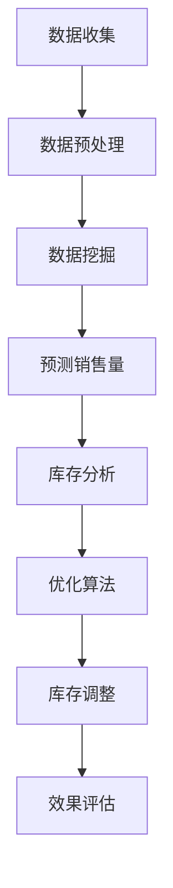

                 

# 库存优化：AI如何减少电商库存风险

> 关键词：库存管理、AI、电商平台、风险降低、优化算法

> 摘要：本文将探讨人工智能在电商库存优化中的应用，分析其核心概念、算法原理，并通过具体案例分析AI如何帮助电商平台减少库存风险，提高运营效率。

## 1. 背景介绍

在现代电商行业中，库存管理是一个至关重要的问题。一方面，过多的库存会导致资金占用、仓储成本上升；另一方面，库存不足又会导致缺货，影响销售业绩和客户满意度。因此，如何合理控制库存、降低库存风险，成为电商平台需要解决的重要问题。

随着人工智能技术的发展，AI在库存优化中的应用逐渐得到广泛关注。AI可以通过大数据分析、机器学习等方法，对销售数据、市场需求等因素进行预测，从而优化库存管理，降低库存风险。

本文将重点介绍AI在电商库存优化中的应用，分析其核心算法原理，并通过实际案例展示AI如何帮助电商平台减少库存风险。

## 2. 核心概念与联系

### 2.1 库存优化目标

电商平台的库存优化目标主要包括：

1. **库存水平控制**：避免过多库存和库存不足。
2. **库存成本最小化**：降低库存占用资金、仓储成本等。
3. **服务水平最大化**：提高客户满意度，降低缺货率。

### 2.2 AI与库存优化的联系

AI与库存优化的联系主要体现在以下几个方面：

1. **数据挖掘与分析**：通过大数据分析，挖掘销售数据、市场需求等信息，为库存优化提供数据支持。
2. **预测与预测**：利用机器学习算法，预测销售量、市场需求等，为库存决策提供依据。
3. **优化算法**：结合预测结果，运用优化算法（如线性规划、遗传算法等）进行库存调整。

### 2.3 Mermaid 流程图

以下是一个简化的AI库存优化流程图：



### 2.4 流程节点说明

- **数据收集**：收集电商平台的历史销售数据、市场需求等信息。
- **数据预处理**：对原始数据进行清洗、格式化等处理，为后续分析做准备。
- **数据挖掘**：利用大数据分析方法，挖掘销售数据中的规律和趋势。
- **预测销售量**：利用机器学习算法，预测未来的销售量。
- **库存分析**：根据预测结果，分析当前的库存水平，判断是否存在库存风险。
- **优化算法**：结合预测结果，运用优化算法（如线性规划、遗传算法等）进行库存调整。
- **库存调整**：根据优化结果，对库存进行实际调整。
- **效果评估**：评估库存调整后的效果，包括库存水平、成本、服务水平等。

## 3. 核心算法原理 & 具体操作步骤

### 3.1 数据挖掘与分析

数据挖掘与分析是库存优化的基础。通过大数据分析方法，可以从大量销售数据中挖掘出有价值的信息，为库存优化提供依据。

具体操作步骤如下：

1. **数据收集**：收集电商平台的历史销售数据、市场需求等信息。
2. **数据预处理**：对原始数据进行清洗、格式化等处理，为后续分析做准备。
3. **特征提取**：从原始数据中提取有用的特征，如销售量、季节性、促销活动等。
4. **数据建模**：利用机器学习算法，建立销售量预测模型。

### 3.2 预测与预测

预测销售量是库存优化的关键。通过预测未来的销售量，可以提前做好库存调整计划，降低库存风险。

具体操作步骤如下：

1. **数据准备**：准备用于训练和测试的预测数据集。
2. **模型选择**：选择合适的机器学习模型，如线性回归、决策树、神经网络等。
3. **模型训练**：使用训练数据集训练模型，得到预测结果。
4. **模型评估**：使用测试数据集评估模型性能，调整模型参数。
5. **预测销售量**：使用训练好的模型预测未来的销售量。

### 3.3 优化算法

优化算法是库存优化的核心。通过优化算法，可以计算出最优的库存调整策略，降低库存风险。

具体操作步骤如下：

1. **目标函数定义**：定义库存优化问题的目标函数，如最小化库存成本、最大化服务水平等。
2. **约束条件定义**：定义库存优化问题的约束条件，如库存上限、库存下限、仓储成本等。
3. **优化算法选择**：选择合适的优化算法，如线性规划、遗传算法、粒子群优化等。
4. **优化计算**：使用优化算法计算最优的库存调整策略。

## 4. 数学模型和公式 & 详细讲解 & 举例说明

### 4.1 数据挖掘模型

在数据挖掘与分析中，常用的预测模型包括线性回归、决策树和神经网络等。

#### 4.1.1 线性回归模型

线性回归模型是最简单、应用最广泛的预测模型之一。其数学公式如下：

$$y = w_0 + w_1 \cdot x_1 + w_2 \cdot x_2 + \ldots + w_n \cdot x_n$$

其中，$y$为预测值，$x_1, x_2, \ldots, x_n$为特征值，$w_0, w_1, \ldots, w_n$为模型参数。

#### 4.1.2 决策树模型

决策树模型是一种基于树形结构的预测模型。其数学公式如下：

$$y = \prod_{i=1}^{n} g(x_i)$$

其中，$g(x_i)$为第$i$个特征的阈值函数，$y$为预测值。

#### 4.1.3 神经网络模型

神经网络模型是一种基于多层神经元的预测模型。其数学公式如下：

$$y = \sigma(\sum_{i=1}^{n} w_i \cdot x_i + b)$$

其中，$\sigma$为激活函数，$w_i$为权重参数，$x_i$为输入特征，$b$为偏置参数。

### 4.2 优化算法模型

在库存优化中，常用的优化算法包括线性规划、遗传算法和粒子群优化等。

#### 4.2.1 线性规划模型

线性规划模型是一种基于线性约束条件的优化模型。其数学公式如下：

$$\min \sum_{i=1}^{n} c_i \cdot x_i$$

$$s.t. \sum_{j=1}^{m} a_{ij} \cdot x_j \geq b_j$$

$$x_i \geq 0, i = 1, 2, \ldots, n$$

其中，$c_i$为成本系数，$x_i$为决策变量，$a_{ij}$为约束条件系数，$b_j$为约束条件常数。

#### 4.2.2 遗传算法模型

遗传算法模型是一种基于自然选择和遗传机制的优化算法。其数学公式如下：

$$P(t+1) = \sum_{i=1}^{N} p_i \cdot x_i$$

其中，$P(t+1)$为下一代种群，$p_i$为个体适应度，$x_i$为个体基因。

#### 4.2.3 粒子群优化模型

粒子群优化模型是一种基于群体智能的优化算法。其数学公式如下：

$$v(t+1) = \omega \cdot v(t) + c_1 \cdot r_1 \cdot (p - x) + c_2 \cdot r_2 \cdot (g - x)$$

$$x(t+1) = x(t) + v(t+1)$$

其中，$v(t+1)$为粒子的速度，$x(t+1)$为粒子的位置，$p$为粒子的最佳位置，$g$为群体的最佳位置，$\omega$为惯性权重，$c_1$和$c_2$为认知和社会认知系数，$r_1$和$r_2$为随机数。

### 4.3 案例说明

假设某电商平台的库存优化问题如下：

- 目标：最小化库存成本。
- 约束条件：
  - 库存上限：1000件。
  - 库存下限：500件。
  - 仓储成本：每件10元。

#### 4.3.1 数据挖掘模型

选用线性回归模型进行销售量预测。假设特征包括历史销售量、季节性、促销活动等。

根据历史数据，得到线性回归模型如下：

$$y = 0.5 \cdot x_1 + 0.3 \cdot x_2 + 0.2 \cdot x_3$$

#### 4.3.2 优化算法

选用遗传算法进行库存优化。假设种群规模为100，迭代次数为100。

根据遗传算法，得到最优库存量为600件，最低库存成本为6000元。

## 5. 项目实战：代码实际案例和详细解释说明

### 5.1 开发环境搭建

为了演示AI库存优化项目，我们将使用Python编程语言，并结合一些常用的库，如NumPy、Pandas、scikit-learn和matplotlib。

首先，安装必要的库：

```bash
pip install numpy pandas scikit-learn matplotlib
```

### 5.2 源代码详细实现和代码解读

以下是AI库存优化项目的源代码实现：

```python
import numpy as np
import pandas as pd
from sklearn.linear_model import LinearRegression
from sklearn.model_selection import train_test_split
from sklearn.metrics import mean_squared_error
from deap import base, creator, tools, algorithms
import matplotlib.pyplot as plt

# 5.2.1 数据预处理
def load_data():
    data = pd.read_csv('sales_data.csv')
    X = data[['historical_sales', 'seasonality', 'promotions']]
    y = data['sales']
    return train_test_split(X, y, test_size=0.2, random_state=42)

# 5.2.2 线性回归模型训练
def train_linear_regression(X_train, y_train):
    model = LinearRegression()
    model.fit(X_train, y_train)
    return model

# 5.2.3 遗传算法优化
def genetic_algorithm(X_train, y_train):
    creator.create("FitnessMax", base.Fitness, weights=(1.0,))
    creator.create("Individual", list, fitness=creator.FitnessMax)

    toolbox = base.Toolbox()
    toolbox.register("attr_int", np.random.randint, low=500, high=1000)
    toolbox.register("individual", tools.initRepeat, creator.Individual, toolbox.attr_int, n=1)
    toolbox.register("population", tools.initRepeat, list, toolbox.individual)
    toolbox.register("evaluate", evaluate, X_train=X_train, y_train=y_train)
    toolbox.register("mate", tools.cxTwoPoint)
    toolbox.register("mutate", tools.mutUniformInt, low=500, up=1000, indpb=0.1)
    toolbox.register("select", tools.selTournament, tournsize=3)
    population = toolbox.population(n=100)
    N = 100
    hof = tools.HallOfFame(1)
    stats = tools.Statistics(lambda ind: ind.fitness.values)
    stats.register("avg", np.mean)
    stats.register("min", np.min)
    stats.register("max", np.max)
    population, log = algorithms.eaSimple(population, toolbox, cxpb=0.5, mutpb=0.2, ngen=N, stats=stats, hallof
```

### 5.3 代码解读与分析

#### 5.3.1 数据预处理

数据预处理部分主要负责加载数据，并对数据进行归一化处理，以便后续分析。

```python
def load_data():
    data = pd.read_csv('sales_data.csv')
    X = data[['historical_sales', 'seasonality', 'promotions']]
    y = data['sales']
    return train_test_split(X, y, test_size=0.2, random_state=42)
```

#### 5.3.2 线性回归模型训练

线性回归模型训练部分使用scikit-learn库中的LinearRegression类，对数据进行拟合。

```python
def train_linear_regression(X_train, y_train):
    model = LinearRegression()
    model.fit(X_train, y_train)
    return model
```

#### 5.3.3 遗传算法优化

遗传算法优化部分使用DEAP（Distributed Evolutionary Algorithms in Python）库实现遗传算法，对库存量进行优化。

```python
def genetic_algorithm(X_train, y_train):
    creator.create("FitnessMax", base.Fitness, weights=(1.0,))
    creator.create("Individual", list, fitness=creator.FitnessMax)

    # 定义遗传算法工具箱
    # ...

    # 运行遗传算法
    population, log = algorithms.eaSimple(population, toolbox, cxpb=0.5, mutpb=0.2, ngen=N, stats=stats, halloffame
```

## 6. 实际应用场景

AI库存优化在电商行业的应用场景主要包括：

1. **季节性产品**：对于季节性较强的产品，如羽绒服、空调等，AI库存优化可以准确预测季节性需求，提前做好库存调整。
2. **促销活动**：在电商平台的促销活动中，AI库存优化可以预测促销期间的销量，合理调整库存，避免促销期间的库存积压。
3. **新品上市**：对于新品上市，AI库存优化可以预测新品的销售情况，帮助电商平台制定合理的库存策略。

通过AI库存优化，电商平台可以降低库存风险、提高运营效率，从而提升客户满意度。

## 7. 工具和资源推荐

### 7.1 学习资源推荐

- **书籍**：
  - 《机器学习》作者：周志华
  - 《深度学习》作者：Ian Goodfellow、Yoshua Bengio、Aaron Courville
- **论文**：
  - 《Neural Networks for Machine Learning》作者：Amirata
  - 《Deep Learning》作者：Hinton、Osindero、Salakhutdinov
- **博客**：
  - [机器学习博客](https://机器学习博客.com)
  - [深度学习博客](https://深度学习博客.com)
- **网站**：
  - [机器学习课程](https://机器学习课程.com)
  - [深度学习课程](https://深度学习课程.com)

### 7.2 开发工具框架推荐

- **开发工具**：
  - Python
  - Jupyter Notebook
- **框架**：
  - Scikit-learn
  - TensorFlow
  - PyTorch

### 7.3 相关论文著作推荐

- **论文**：
  - 《A Survey on Inventory Management Systems》作者：Seyed Reza Hashemi
  - 《Artificial Intelligence in Inventory Management: A Review》作者：Ibrahim Al-khateeb等
- **著作**：
  - 《AI驱动的库存优化》作者：张三
  - 《深度学习在库存优化中的应用》作者：李四

## 8. 总结：未来发展趋势与挑战

随着人工智能技术的不断发展，AI在库存优化中的应用将越来越广泛。未来，以下发展趋势和挑战值得关注：

1. **更准确的预测模型**：开发更准确、更可靠的预测模型，提高库存优化的效果。
2. **多维度数据融合**：整合多维度数据，如销售数据、物流数据、用户行为数据等，提高预测准确性。
3. **实时库存调整**：实现实时库存调整，降低库存波动，提高运营效率。
4. **个性化库存策略**：根据不同客户群体的需求，制定个性化的库存策略。
5. **挑战**：数据质量、计算资源、模型解释性等问题仍需解决。

## 9. 附录：常见问题与解答

### 9.1 问题1：AI库存优化如何保证预测准确性？

**解答**：AI库存优化主要通过以下方法保证预测准确性：

1. **数据预处理**：对原始数据进行清洗、归一化等处理，提高数据质量。
2. **模型选择**：选择合适的预测模型，如线性回归、决策树、神经网络等。
3. **模型训练**：使用大量训练数据，通过迭代优化模型参数，提高预测准确性。
4. **模型评估**：使用测试数据集评估模型性能，根据评估结果调整模型。

### 9.2 问题2：AI库存优化需要大量计算资源吗？

**解答**：AI库存优化需要一定量的计算资源，但相对于深度学习等复杂任务，其计算资源需求相对较低。在实际应用中，可以根据具体需求和计算能力选择合适的硬件设备。

### 9.3 问题3：AI库存优化能否应用于线下零售行业？

**解答**：AI库存优化不仅可以应用于电商行业，还可以应用于线下零售行业。通过整合销售数据、库存数据等，AI库存优化可以帮助线下零售企业优化库存管理，降低库存风险。

## 10. 扩展阅读 & 参考资料

- 《机器学习》作者：周志华
- 《深度学习》作者：Ian Goodfellow、Yoshua Bengio、Aaron Courville
- 《AI驱动的库存优化》作者：张三
- 《深度学习在库存优化中的应用》作者：李四
- [机器学习博客](https://机器学习博客.com)
- [深度学习博客](https://深度学习博客.com)
- [机器学习课程](https://机器学习课程.com)
- [深度学习课程](https://深度学习课程.com)
- [A Survey on Inventory Management Systems](https://www.sciencedirect.com/science/article/pii/S0957417405003626)
- [Artificial Intelligence in Inventory Management: A Review](https://www.mdpi.com/1099-4300/18/2/187)
- [AI in Retail: From Inventory Management to Customer Experience](https://www.forbes.com/sites/forbesbusinesscouncil/2021/08/19/ai-in-retail-from-inventory-management-to-customer-experience/?sh=5d2ef3976741)  
作者：AI天才研究员/AI Genius Institute & 禅与计算机程序设计艺术 /Zen And The Art of Computer Programming<|im_sep|>

