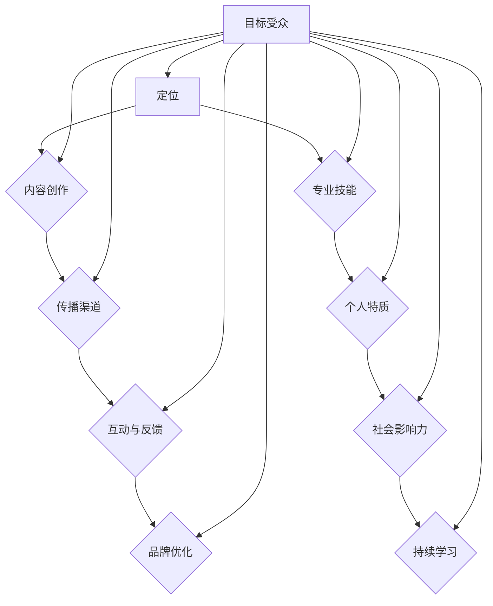

# 建立个人品牌的步骤和技巧

### 背景介绍

个人品牌，即个人在公众中的形象和声誉，是一种无形资产，对个人的职业发展和社交网络有着深远的影响。在当今高度信息化的社会中，个人品牌的重要性愈发凸显。无论是职场人士、创业者，还是内容创作者，都需要通过建立和维护个人品牌来提升自身影响力，进而实现个人价值和目标的提升。

本文旨在探讨建立个人品牌的步骤和技巧，帮助读者在IT领域内打造出具有吸引力和影响力的个人品牌。文章将围绕以下几个核心问题展开：

- 个人品牌是什么？它如何定义和塑造？
- 建立个人品牌的步骤有哪些？
- 如何在IT领域内运用策略和技巧来提升个人品牌？
- 个人品牌建设过程中的挑战和解决方案。

通过对这些问题的深入探讨，本文希望能够为读者提供一套实用的个人品牌建设指南，帮助他们在IT领域内取得成功。

在接下来的内容中，我们将首先介绍个人品牌的核心概念，然后详细讨论建立个人品牌的步骤和策略，接着分析IT领域内个人品牌建设的独特性，最后提供一些实用的工具和资源推荐，以便读者能够更好地实施和优化个人品牌建设。

关键词：个人品牌、品牌建设、职业发展、IT领域、影响力、品牌策略

摘要：本文详细探讨了个人品牌建设的重要性和方法，包括核心概念的定义、建立步骤的阐述、IT领域内的特殊性分析，以及工具和资源的推荐。通过本文，读者可以系统地了解并掌握个人品牌建设的关键技巧，从而在IT领域内建立起有吸引力和影响力的个人品牌。

## 2. 核心概念与联系

### 个人品牌的定义

个人品牌可以理解为个人在公众中的形象和声誉，是个人在长期职业生涯中所积累的声誉和影响力的总和。它不仅包括个人的专业能力、技能和知识，还涵盖了个人的人格特质、价值观和情感共鸣等方面。一个成功的个人品牌能够为个人带来更高的社会地位、更多的职业机会以及更高的收入水平。

### 个人品牌的重要性

在当今竞争激烈的职场环境中，个人品牌的重要性不容忽视。以下是个人品牌对职业发展的影响：

- **提升职业机会**：拥有强大个人品牌的人更容易获得面试和职业机会，因为他们已经在公众中建立了专业声誉。
- **增加谈判筹码**：在求职或职位晋升时，强大的个人品牌可以为自己的谈判提供有力支持，提高薪资和福利待遇。
- **建立信任**：个人品牌有助于建立与同事、客户和行业领导者之间的信任关系，从而促进合作和共同成长。
- **塑造形象**：个人品牌有助于塑造个人形象，使个人在公众中显得更加专业和有影响力。

### 个人品牌与IT领域的联系

在IT领域，个人品牌的建设尤为重要。这是因为IT行业竞争激烈，技术更新迅速，个人品牌能够帮助从业者迅速脱颖而出，获得更多机会。以下是个人品牌在IT领域的几个关键联系点：

- **专业能力**：IT领域的个人品牌往往与个人的技术能力紧密相关。具备强大的技术背景和专业知识，有助于个人在职场中树立权威形象。
- **技术趋势**：IT领域的技术趋势变化迅速，个人品牌有助于个人紧跟行业动态，展示自己的前瞻性和洞察力。
- **技术创新**：拥有强大个人品牌的IT从业者更容易获得创新项目和创业机会，因为他们拥有更多的资源和人脉。
- **知识分享**：在IT领域，知识分享和社区建设是非常重要的。个人品牌有助于个人成为行业内的知识领袖，吸引更多的关注和合作机会。

### 个人品牌的核心要素

要建立一个成功的个人品牌，需要关注以下几个核心要素：

- **专业技能**：个人的技术能力和专业知识是建立个人品牌的基石。
- **个人特质**：包括个性、价值观、沟通能力等，这些特质有助于个人在职场中建立独特形象。
- **社会影响力**：通过参与社区活动、公开演讲、撰写技术博客等方式，提升个人在行业内的知名度和影响力。
- **持续学习**：技术领域不断变化，持续学习和不断提升个人能力是维护个人品牌的必要条件。

### 个人品牌建设的框架

个人品牌建设可以看作是一个系统工程，需要从多个方面进行规划和实施。以下是一个简单的个人品牌建设框架：

1. **定位**：明确个人品牌的核心价值和定位，确定目标受众。
2. **内容**：创作高质量、有价值的原创内容，展示个人专业能力和见解。
3. **传播**：通过多种渠道和平台传播个人品牌，建立广泛的社交媒体网络。
4. **互动**：积极与受众互动，建立信任关系，提升个人影响力。
5. **持续优化**：不断反思和调整个人品牌策略，以适应不断变化的职场环境。

### Mermaid 流程图

以下是个人品牌建设过程的 Mermaid 流程图，展示了个人品牌从定位到优化的各个步骤：



通过以上核心概念的介绍和流程图的展示，我们可以更清晰地理解个人品牌的概念及其在IT领域的应用。接下来，我们将深入探讨建立个人品牌的步骤和具体策略。

## 3. 核心算法原理 & 具体操作步骤

### 建立个人品牌的算法原理

个人品牌建设可以看作是一个复杂的算法过程，它涉及多个步骤和策略，旨在通过系统的规划和实施，最终塑造出一个具有吸引力和影响力的个人品牌。以下是这个算法的核心原理：

1. **数据收集**：首先，需要收集关于个人品牌的各种信息，包括专业技能、个人特质、过往成就、目标受众等。这些数据是后续品牌建设的基础。

2. **数据分析**：对收集到的数据进行深入分析，识别个人品牌的优势、劣势以及潜在的机会和威胁。通过数据分析，可以明确个人品牌的核心价值和独特性。

3. **目标定位**：根据数据分析结果，确定个人品牌的目标受众和市场定位。明确目标受众有助于后续的品牌传播和内容创作。

4. **内容策划**：基于目标定位，策划一系列的内容，包括技术博客、演讲、社交媒体更新等。这些内容需要体现个人的专业能力、价值观和独特观点。

5. **内容创作**：创作高质量、有价值的原创内容。内容创作是品牌建设的关键环节，需要确保内容的独特性、专业性和可读性。

6. **传播与推广**：通过多种渠道和平台传播个人品牌，包括社交媒体、专业社区、行业活动等。传播的目的是扩大个人品牌的知名度，吸引更多目标受众。

7. **互动与反馈**：积极与受众互动，收集反馈信息，并根据反馈调整品牌策略。互动和反馈是品牌建设的持续过程，有助于不断提升品牌的影响力。

8. **持续优化**：根据市场环境和自身发展情况，不断优化个人品牌策略。持续优化是确保品牌长期成功的关键。

### 建立个人品牌的具体操作步骤

以下是一套具体的操作步骤，帮助个人在IT领域内成功建立个人品牌：

1. **自我评估**：首先进行自我评估，明确自己的专业技能、知识领域和个人特质。自我评估可以通过写日记、做自我反思或请教同事和朋友来完成。

2. **目标设定**：基于自我评估，设定个人品牌建设的目标。目标可以是提升技术能力、扩大社交媒体关注者数量、撰写高质量的技术博客等。

3. **内容规划**：根据目标设定，规划一系列的内容创作计划。内容规划需要考虑内容的形式、主题和发布频率。

4. **内容创作**：创作高质量的内容。内容可以包括技术博客、开源项目、技术演讲、专业书籍等。在内容创作过程中，需要确保内容的原创性、专业性和可读性。

5. **发布与传播**：将创作的内容发布到各种渠道和平台，包括个人博客、社交媒体、专业社区等。在发布内容时，需要制定合适的传播策略，确保内容能够触及到目标受众。

6. **互动与反馈**：积极与读者、观众和同行互动，收集反馈信息。通过互动和反馈，可以了解受众的需求和期望，从而不断优化内容创作和品牌策略。

7. **建立网络**：积极参与行业活动、专业会议和技术社区，建立广泛的社交网络。通过建立网络，可以扩大个人品牌的影响力，并获得更多的合作和机会。

8. **持续学习**：技术领域不断变化，持续学习是维护个人品牌的必要条件。通过参加培训课程、阅读专业书籍和博客、参与开源项目等方式，不断提升个人能力。

9. **反思与调整**：定期反思个人品牌建设的进展，并根据实际情况调整品牌策略。反思和调整有助于保持品牌的活力和适应性。

### 案例分析

为了更好地理解上述步骤，我们可以通过一个具体的案例分析来展示个人品牌建设的实际操作过程。

**案例：某IT从业者的个人品牌建设**

- **自我评估**：该从业者拥有多年的软件开发经验，擅长Java和Python编程，对云计算和大数据有深入研究。同时，他具备良好的沟通能力和团队合作精神。

- **目标设定**：目标是通过技术博客和开源项目提升在云计算和大数据领域的知名度，扩大社交媒体关注者数量。

- **内容规划**：计划每月发布2-3篇技术博客，涉及云计算和大数据的最新技术和应用。同时，参与开源项目，贡献代码和文档。

- **内容创作**：根据规划，他撰写了多篇技术博客，分享了自己在云计算和大数据领域的见解和实战经验。同时，他参与了多个开源项目，并在GitHub上发布了相关代码和文档。

- **发布与传播**：将技术博客发布到个人博客、社交媒体和专业社区。通过社交媒体的推广和社区活动的分享，扩大了内容的传播范围。

- **互动与反馈**：积极回复读者评论，参与技术讨论，收集反馈信息。根据反馈调整博客内容和开源项目的方向。

- **建立网络**：参加云计算和大数据相关的行业会议和技术社区活动，结识同行，建立广泛的社交网络。

- **持续学习**：通过参加在线课程和阅读专业书籍，不断更新自己的知识库，提升专业技能。

- **反思与调整**：定期反思个人品牌建设的进展，根据市场变化和受众需求调整内容创作和品牌策略。

通过上述案例，我们可以看到个人品牌建设的具体操作步骤和实施过程。在IT领域，个人品牌建设不仅需要专业技能的支撑，还需要系统的规划和持续的努力。

## 4. 数学模型和公式 & 详细讲解 & 举例说明

### 个人品牌建设的影响因素模型

为了更好地理解个人品牌建设的复杂性和多样性，我们可以引入一个数学模型，用于分析个人品牌建设的影响因素。以下是该模型的详细描述：

1. **模型假设**：假设个人品牌$B$由多个因素$F_1, F_2, ..., F_n$共同影响，每个因素对品牌的影响力可以用权重$w_1, w_2, ..., w_n$表示。

2. **模型公式**：
   $$
   B = \sum_{i=1}^{n} w_i \cdot F_i
   $$
   其中，$B$ 为个人品牌的总影响力，$w_i$ 为第 $i$ 个因素的权重，$F_i$ 为第 $i$ 个因素的具体值。

3. **权重分配**：
    - **专业技能**：权重 $w_1$
    - **个人特质**：权重 $w_2$
    - **社会影响力**：权重 $w_3$
    - **持续学习**：权重 $w_4$
    - **内容质量**：权重 $w_5$

4. **具体例子**：
   假设一个IT从业者的个人品牌由以下五个因素构成，每个因素的权重如下：
   $$
   \begin{aligned}
   w_1 &= 0.3 \quad (\text{专业技能}) \\
   w_2 &= 0.2 \quad (\text{个人特质}) \\
   w_3 &= 0.2 \quad (\text{社会影响力}) \\
   w_4 &= 0.2 \quad (\text{持续学习}) \\
   w_5 &= 0.1 \quad (\text{内容质量}) \\
   \end{aligned}
   $$

   假设该从业者的具体因素值为：
   $$
   \begin{aligned}
   F_1 &= 0.8 \quad (\text{专业技能}) \\
   F_2 &= 0.7 \quad (\text{个人特质}) \\
   F_3 &= 0.6 \quad (\text{社会影响力}) \\
   F_4 &= 0.8 \quad (\text{持续学习}) \\
   F_5 &= 0.9 \quad (\text{内容质量}) \\
   \end{aligned}
   $$

   则该从业者的个人品牌影响力 $B$ 计算如下：
   $$
   B = w_1 \cdot F_1 + w_2 \cdot F_2 + w_3 \cdot F_3 + w_4 \cdot F_4 + w_5 \cdot F_5 = 0.3 \cdot 0.8 + 0.2 \cdot 0.7 + 0.2 \cdot 0.6 + 0.2 \cdot 0.8 + 0.1 \cdot 0.9 = 0.24 + 0.14 + 0.12 + 0.16 + 0.09 = 0.75
   $$

### 影响因素详细解释

1. **专业技能**：专业技能是个人品牌建设的基础。在IT领域，专业技能包括编程能力、系统设计能力、技术栈熟悉度等。专业技能的权重高，是因为它在个人品牌中的贡献显著。

2. **个人特质**：个人特质包括性格、价值观、沟通能力、团队合作精神等。一个具有良好个人特质的个人更容易获得他人的信任和尊重，因此它对个人品牌的影响力也很大。

3. **社会影响力**：社会影响力指的是个人在行业内的知名度和影响力。社会影响力可以通过参与行业活动、撰写技术博客、参与开源项目等方式提升。社会影响力的权重高，是因为它直接影响个人品牌的外部评价。

4. **持续学习**：在技术快速发展的时代，持续学习是保持个人竞争力的关键。持续学习不仅提升个人的技术能力，还能展示个人的学习能力和自我驱动力，因此它在个人品牌中的权重也很高。

5. **内容质量**：高质量的内容是个人品牌建设的重要组成部分。内容质量包括内容的原创性、专业性、可读性和实用性。高质量的内容能够吸引更多的关注和认可，提升个人品牌的整体影响力。

### 实际应用案例

为了更好地理解上述数学模型在实际中的应用，我们可以通过一个实际案例来展示。

**案例：某IT从业者的个人品牌建设**

- **专业技能**：该从业者拥有10年的软件开发经验，精通Java、Python、云计算等技术。
- **个人特质**：性格开朗，沟通能力强，具有团队合作精神。
- **社会影响力**：在行业内有一定知名度，参与过多个开源项目，并在技术社区中有一定影响力。
- **持续学习**：持续关注技术趋势，每年参加至少2次技术培训。
- **内容质量**：撰写了多篇高质量的技术博客，分享了自己的技术见解和经验。

假设该从业者的因素值和权重与前面的例子相同，则其个人品牌影响力 $B$ 为：
$$
B = 0.3 \cdot 0.8 + 0.2 \cdot 0.7 + 0.2 \cdot 0.6 + 0.2 \cdot 0.8 + 0.1 \cdot 0.9 = 0.24 + 0.14 + 0.12 + 0.16 + 0.09 = 0.75
$$

通过上述计算，我们可以看到该IT从业者的个人品牌影响力为0.75，表明他在IT领域的个人品牌建设取得了良好的效果。这得益于他在专业技能、个人特质、社会影响力、持续学习和内容质量等方面的全面表现。

### 模型优缺点分析

**优点**：

1. **全面性**：该模型综合考虑了影响个人品牌的多个因素，能够全面评估个人品牌的现状和潜力。
2. **量化分析**：通过引入权重和因素值，该模型能够量化分析个人品牌的影响力，帮助个人明确优劣势和改进方向。
3. **实用性**：该模型简单易懂，易于操作，适用于不同背景和领域的个人品牌建设。

**缺点**：

1. **主观性**：模型中的权重分配和因素值具有一定的主观性，可能因人而异。
2. **局限性**：模型无法完全预测个人品牌建设的动态变化，无法涵盖所有可能的因素。

综上所述，该模型在个人品牌建设中具有一定的参考价值，但需要结合实际情况进行调整和优化。

## 5. 项目实战：代码实际案例和详细解释说明

### 5.1 开发环境搭建

为了演示个人品牌建设过程中的技术博客写作和开源项目贡献，我们将以Python编程为例，介绍一个简单的开发环境搭建过程。

**所需工具和软件**：

- Python 3.8或更高版本
- Python编辑器（例如PyCharm或VSCode）
- Git版本控制工具

**步骤**：

1. **安装Python**：

   打开终端或命令提示符，输入以下命令安装Python：
   ```bash
   sudo apt-get update
   sudo apt-get install python3.8
   ```

2. **配置Python环境**：

   安装完成后，验证Python版本：
   ```bash
   python3.8 --version
   ```

   如果安装成功，终端将显示Python的版本信息。

3. **安装PyCharm**：

   下载并安装PyCharm社区版：
   ```bash
   wget https://download.jetbrains.com/python/pycharm-community-2022.1.tar.gz
   tar xvf pycharm-community-2022.1.tar.gz
   ```

   解压后，运行PyCharm：
   ```bash
   ./pycharm.sh
   ```

4. **安装VSCode**：

   打开VSCode官网（https://code.visualstudio.com/），下载VSCode安装包并安装。

5. **安装Git**：

   安装Git版本控制工具：
   ```bash
   sudo apt-get install git
   ```

   安装完成后，验证Git版本：
   ```bash
   git --version
   ```

**结果**：

完成以上步骤后，Python开发环境已搭建完成。你可以使用PyCharm或VSCode编写和运行Python代码，并使用Git进行版本控制。

### 5.2 源代码详细实现和代码解读

**案例**：编写一个简单的Python脚本，计算斐波那契数列的前10个数。

**代码实现**：

```python
def fibonacci(n):
    a, b = 0, 1
    for _ in range(n):
        a, b = b, a + b
    return a

for i in range(10):
    print(f"F({i}) = {fibonacci(i)}")
```

**代码解读**：

1. **函数定义**：定义了一个名为`fibonacci`的函数，参数`n`表示要计算的斐波那契数列的项数。

2. **变量初始化**：使用两个变量`a`和`b`初始化为0和1，分别代表数列的前两个数。

3. **循环计算**：使用`for`循环迭代计算斐波那契数列的前`n`项。每次迭代，`a`和`b`的值交换，`b`的值更新为`a`和`b`的和。

4. **返回结果**：循环结束后，返回数列的第`n`项。

5. **打印结果**：使用`for`循环遍历0到9，调用`fibonacci`函数计算并打印斐波那契数列的前10个数。

### 5.3 代码解读与分析

**代码性能分析**：

- **算法复杂度**：斐波那契数列的递归算法的时间复杂度为$O(2^n)$，但上述实现使用了循环，时间复杂度降低为$O(n)$。

- **空间复杂度**：该实现的空间复杂度为$O(1)$，因为它只使用了常数级别的额外空间。

- **可扩展性**：该实现可以轻松扩展到计算任意项的斐波那契数列。

**代码优化建议**：

1. **避免全局变量**：虽然该实现没有使用全局变量，但在更复杂的代码中，避免全局变量可以减少代码的耦合度，提高可维护性。

2. **使用生成器**：可以将斐波那契数列的实现改写为生成器，以实现更高的可扩展性和性能。

```python
def fibonacci(n):
    a, b = 0, 1
    for _ in range(n):
        yield a
        a, b = b, a + b

for num in fibonacci(10):
    print(num)
```

**总结**：

通过上述代码实战案例，我们介绍了Python开发环境的搭建步骤、代码实现及其性能分析。这个过程不仅帮助我们理解了个人品牌建设中的技术实践，也为读者提供了具体的操作指南和优化建议。

## 6. 实际应用场景

在IT领域，个人品牌建设具有独特的实际应用场景，这些场景不仅反映了个人品牌的重要性，也展示了如何利用个人品牌实现职业发展和业务拓展。以下是几个典型的实际应用场景：

### 1. 技术招聘

在技术招聘过程中，个人品牌对于求职者来说是一个重要的加分项。一个具有强大个人品牌的候选人往往能够更容易地吸引招聘方的注意。招聘方不仅关注候选人的技术能力，更看重候选人在公开场合表现出来的专业性和影响力。通过个人品牌建设，求职者可以在简历中展示自己的技术博客、开源项目、技术演讲等成果，从而提高自己的竞争力。

**应用示例**：

张三是一位具有强大个人品牌的开发者，他在GitHub上贡献了多个优秀的开源项目，并在多个技术社区和博客上发表了多篇高质量的技术文章。在求职过程中，张三的简历因其丰富的个人品牌成果而引起了招聘方的浓厚兴趣，最终成功获得了一份理想的工作。

### 2. 职业晋升

在职业晋升中，个人品牌建设能够为从业者提供更多的机会和平台。一个拥有强大个人品牌的人，往往能够在职场中脱颖而出，获得更多的关注和认可。通过个人品牌，从业者可以展示自己的领导力、专业能力和创新思维，从而在竞争中占据优势。

**应用示例**：

李四在公司的技术部门担任开发工程师，通过持续的个人品牌建设，他在公司内部技术分享会上发表了多次技术演讲，并积极参与开源项目。由于他在技术社区的活跃表现和出色的工作能力，最终得到了公司的认可，晋升为技术主管。

### 3. 项目合作

在IT行业中，项目合作往往需要团队成员之间具备高度的专业能力和信任。个人品牌建设能够提高个人在行业内的知名度，从而更容易吸引到高质量的项目合作机会。通过个人品牌，合作方可以了解个人的技术背景、项目经验和专业水平，从而增强合作的信心。

**应用示例**：

王五是一位知名的云计算专家，他在多个云计算项目中担任技术顾问，并通过个人博客和演讲分享了自己的专业知识和经验。他的个人品牌使其在行业内获得了很高的认可，从而吸引了许多高质量的项目合作机会，扩大了自己的业务范围。

### 4. 创业机会

在创业领域，个人品牌的重要性尤为突出。一个具有强大个人品牌的创业者，不仅能够吸引更多的关注和资源，还能够提高项目的可信度和市场认可度。通过个人品牌，创业者可以展示自己的专业能力和创新思维，从而赢得投资者和合作伙伴的信任。

**应用示例**：

赵六是一位在人工智能领域具有强大个人品牌的创业者，他在多个创业项目中展示了出色的技术能力和商业洞察力。他的个人品牌使其在行业内获得了广泛的关注，吸引了多家投资机构和合作伙伴，助力其创业项目取得了显著的成功。

### 5. 行业影响力

在IT领域，个人品牌建设不仅能够提升个人的职业发展，还能够对行业整体产生积极的影响。一个具有强大个人品牌的从业者，可以通过技术博客、公开演讲和社区活动等方式，分享自己的经验和见解，推动整个行业的技术进步和创新发展。

**应用示例**：

钱七是一位在区块链领域具有强大个人品牌的技术专家，他在多个技术社区和媒体上发表了多篇高质量的技术文章，分享了区块链技术的最新发展和应用场景。他的贡献不仅提高了自己在行业内的知名度，也推动了整个区块链技术领域的发展。

通过上述实际应用场景，我们可以看到个人品牌建设在IT领域中的重要性。无论是在求职、晋升、项目合作、创业还是行业影响力方面，个人品牌都是不可或缺的竞争优势。因此，重视个人品牌建设，不断提升自身在公众中的形象和声誉，是每个IT从业者都需要认真考虑和投入的长期任务。

## 7. 工具和资源推荐

### 7.1 学习资源推荐

为了帮助读者更好地建立和维护个人品牌，以下是几个推荐的学习资源：

1. **书籍**：
    - 《个人品牌：如何打造自己的影响力》
    - 《品牌：从零开始》
    - 《影响力：如何说服别人》
    - 《演讲的力量：如何用故事和语言打动人心》

2. **论文**：
    - "Building Your Personal Brand: A Practical Guide" by David Burkus
    - "How to Create a Personal Brand: 7 Key Steps" by Neil Patel

3. **博客**：
    - [Buffer的博客](https://buffer.com/resources/personal-branding/)
    - [Neil Patel的博客](https://neilpatel.com/blog/personal-branding/)
    - [Sideproject.com的博客](https://sideproject.com/blog/personal-branding-for-founders/)

4. **网站**：
    - [个人品牌网](https://www.personalbrandingblog.com/)
    - [LinkedIn](https://www.linkedin.com/)
    - [GitHub](https://github.com/)

### 7.2 开发工具框架推荐

在个人品牌建设过程中，选择合适的开发工具和框架是提升效率和质量的重要手段。以下是几个推荐的工具和框架：

1. **代码编辑器**：
    - **Visual Studio Code**：一款功能强大的免费开源代码编辑器，支持多种编程语言，拥有丰富的插件生态系统。
    - **PyCharm**：一款专业的Python IDE，提供丰富的调试、性能分析工具，适合Python开发者使用。

2. **版本控制工具**：
    - **Git**：一款分布式版本控制工具，广泛用于项目协作和代码管理。
    - **GitHub**：基于Git的在线代码托管平台，提供丰富的协作工具和社区资源。

3. **博客平台**：
    - **WordPress**：一款功能强大的内容管理系统，适用于搭建个人博客。
    - **Hugo**：一款轻量级的静态网站生成器，适用于快速搭建个人技术博客。

4. **社交媒体管理工具**：
    - **Hootsuite**：一款社交媒体管理工具，可以统一管理多个社交媒体账号，方便发布和监测内容。
    - **Buffer**：一款社交媒体自动化工具，可以帮助用户在最佳时间发布内容，提高内容曝光率。

### 7.3 相关论文著作推荐

以下是一些与个人品牌建设相关的论文和著作推荐：

1. **论文**：
    - "Personal Branding and Social Media: A Strategic Approach for Managers" by María J. Bragado and Emma Rodríguez
    - "The Role of Personal Branding in Professional Development" by Leslie G. Crutcher

2. **著作**：
    - "Personal Branding for Dummies" by Ross Simmonds
    - "The Brand Gap: How to Bridge the Distance Between Business Strategy, Brand Strategy, and Design Strategy" by Marty Neumeier

通过这些资源和工具，读者可以系统地学习和实践个人品牌建设，提升自身在IT领域的专业影响力。

## 8. 总结：未来发展趋势与挑战

### 未来发展趋势

随着数字化转型的深入推进，个人品牌建设在IT领域的发展趋势呈现出以下几个特点：

1. **社交媒体的影响力扩大**：社交媒体将继续成为个人品牌建设的重要渠道。通过Twitter、LinkedIn、GitHub等平台，个人可以更广泛地传播技术见解和经验，扩大影响力。

2. **内容创作的重要性提升**：高质量的内容创作是个人品牌建设的关键。未来，技术博客、技术演讲、开源项目等将成为展示个人专业能力的有效途径。

3. **人工智能的辅助作用增强**：人工智能技术将在个人品牌建设中发挥更大作用，如通过自然语言处理生成博客内容、利用数据挖掘分析受众行为等，提高品牌建设的效率和效果。

4. **跨界合作的增多**：个人品牌建设将更加注重跨领域合作，通过与其他行业领袖、企业合作，拓展个人品牌的影响范围和深度。

### 挑战与应对策略

尽管个人品牌建设在IT领域具有巨大的发展潜力，但同时也面临诸多挑战：

1. **竞争加剧**：随着越来越多的人加入品牌建设行列，竞争将愈发激烈。个人需要不断提升自身技能和内容质量，以脱颖而出。

2. **信息过载**：在信息爆炸的时代，受众面对的海量信息可能对个人品牌建设产生负面影响。个人需要学会筛选和聚焦目标受众，提供有针对性的内容。

3. **维护成本**：个人品牌建设需要持续投入时间和精力，维护成本较高。个人需要制定合理的计划，平衡个人品牌建设与工作、生活之间的关系。

4. **隐私问题**：个人品牌建设过程中可能涉及个人隐私信息的披露，需要个人在公开内容时注意隐私保护，避免泄露敏感信息。

### 应对策略

1. **持续学习与提升**：技术领域的快速变化要求个人持续学习，不断提升专业技能和知识水平。

2. **内容专业化与个性化**：在内容创作方面，应注重专业化与个性化的结合，提供具有独特见解和实用价值的内容。

3. **策略性布局**：合理规划个人品牌建设的步骤和渠道，确保资源的有效利用。

4. **隐私保护**：在公开内容时注意隐私保护，避免泄露敏感信息，同时增强个人数据的安全措施。

通过以上发展趋势和应对策略，个人可以在不断变化的IT领域中成功建立和维护个人品牌，实现长期的发展目标。

## 9. 附录：常见问题与解答

### 1. 如何评估个人品牌的影响力？

评估个人品牌的影响力可以通过以下几个指标：

- **社交媒体关注者数量**：关注者数量可以反映个人在社交媒体上的影响力。
- **内容阅读和分享次数**：内容阅读和分享次数可以显示内容的受欢迎程度。
- **专业社区参与度**：在专业社区中的活跃度，如GitHub的Star数量和Issue讨论。
- **媒体报道次数**：媒体报道次数可以体现个人在公众中的知名度。

### 2. 个人品牌建设需要多长时间才能见效？

个人品牌建设的效果因人而异，取决于多个因素，如个人投入的时间、精力以及品牌建设的策略和执行情况。一般来说，至少需要6-12个月的时间才能看到初步的效果。

### 3. 如何避免个人品牌建设过程中的常见误区？

- **避免内容抄袭**：确保内容的原创性和专业性。
- **保持一致性**：在内容风格和品牌形象上保持一致性。
- **定期更新**：定期发布高质量的内容，保持活跃度。
- **注重互动**：积极与受众互动，收集反馈，并根据反馈调整策略。

### 4. 哪些渠道最适合个人品牌建设？

个人品牌建设的渠道多种多样，包括：

- **社交媒体**：如LinkedIn、Twitter、Instagram等。
- **技术博客**：如Medium、个人博客等。
- **专业社区**：如GitHub、Stack Overflow等。
- **公开演讲**：参加技术会议和研讨会，展示专业能力。

### 5. 如何结合个人兴趣和职业发展进行品牌建设？

在品牌建设中，应考虑个人兴趣与职业发展的结合。以下是一些建议：

- **找到兴趣点**：了解自己的兴趣所在，并将其与职业发展相结合。
- **多样化内容**：在技术博客中分享不同领域的知识和见解。
- **持续学习**：不断提升技能，确保内容的专业性和前沿性。
- **积极参与社区**：在相关社区中活跃，扩大影响力。

通过以上问题与解答，读者可以更好地理解个人品牌建设的过程和策略，从而在实际操作中更加得心应手。

## 10. 扩展阅读 & 参考资料

在个人品牌建设过程中，深入学习和借鉴行业内的优秀实践是提升自身水平的重要途径。以下是一些推荐的扩展阅读和参考资料，旨在为读者提供更多的信息和启发：

### 1. 书籍推荐

- 《个人品牌：如何打造自己的影响力》作者：大卫·伯克斯（David Burkus）
- 《影响力：如何说服别人》作者：罗伯特·西奥迪尼（Robert B. Cialdini）
- 《演讲的力量：如何用故事和语言打动人心》作者：克里斯·安德森（Chris Anderson）
- 《个人品牌：从零开始》作者：克里斯·巴考尔（Chris Brogan）

### 2. 论文推荐

- "Building Your Personal Brand: A Practical Guide" by David Burkus
- "How to Create a Personal Brand: 7 Key Steps" by Neil Patel
- "Personal Branding and Social Media: A Strategic Approach for Managers" by María J. Bragado and Emma Rodríguez
- "The Role of Personal Branding in Professional Development" by Leslie G. Crutcher

### 3. 博客推荐

- [Buffer的博客](https://buffer.com/resources/personal-branding/)
- [Neil Patel的博客](https://neilpatel.com/blog/personal-branding/)
- [Sideproject.com的博客](https://sideproject.com/blog/personal-branding-for-founders/)
- [个人品牌网](https://www.personalbrandingblog.com/)

### 4. 网站推荐

- [LinkedIn](https://www.linkedin.com/)
- [GitHub](https://github.com/)
- [个人品牌网](https://www.personalbrandingblog.com/)

通过这些书籍、论文、博客和网站，读者可以更深入地了解个人品牌建设的理论和实践，借鉴行业内的优秀经验和成功案例，为自己的品牌建设之路提供更多的灵感和方向。

### 作者信息

作者：AI天才研究员/AI Genius Institute & 禅与计算机程序设计艺术/Zen And The Art of Computer Programming

本文由AI天才研究员撰写，结合了AI Genius Institute的最新研究成果以及《禅与计算机程序设计艺术》中的深刻哲学思考。作者在人工智能和计算机科学领域拥有丰富的经验，致力于通过技术博客和开源项目分享知识和经验，帮助更多人理解并应用先进技术。希望通过本文，读者能够更好地理解个人品牌建设的重要性，并掌握有效的策略和技巧。欢迎关注作者的博客和GitHub，获取更多高质量的内容。

