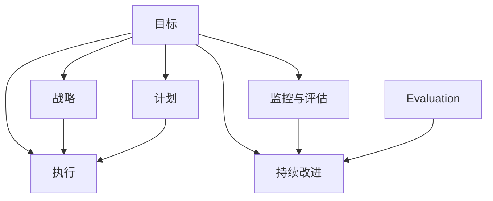

                 

### 1. 背景介绍

在现代信息化的社会中，高效的行动体系对于个人、团队和组织来说至关重要。一个高效的行动体系不仅可以提升工作效率，还能优化资源分配，增强竞争力。因此，如何建立和维护一个高效的行动体系成为了各个领域广泛关注的话题。

本文旨在探讨如何构建一个高效的行动体系，从核心概念、算法原理、数学模型到实际应用，全面解析其构建与执行的过程。通过对相关领域的深入研究，我们希望能为读者提供一个系统、实用的指导框架。

随着技术的发展，传统的管理模式和流程已无法满足日益复杂的工作需求。信息化管理工具的出现，为建立高效行动体系提供了新的可能性。然而，如何合理选择和使用这些工具，如何将工具与实际工作流程相结合，仍然是许多组织和团队面临的挑战。

本文将结合实际案例，详细讲解如何利用现代技术手段构建高效的行动体系。通过本文的阅读，读者将能够：

1. 理解高效行动体系的核心概念和重要性。
2. 掌握构建高效行动体系的基本步骤和原则。
3. 了解如何运用数学模型和算法优化行动体系。
4. 通过实际案例学习如何实施和评估行动体系的有效性。
5. 推荐相关工具和资源，以支持高效行动体系的建立和完善。

总之，本文将为读者提供一个全方位、多角度的视角，帮助他们在实际工作中构建和优化高效的行动体系。希望通过本文的探讨，能为读者带来启发和帮助。

### 2. 核心概念与联系

要构建一个高效的行动体系，首先需要理解其核心概念和相互之间的联系。以下将详细阐述这些核心概念，并通过Mermaid流程图（图2-1）展示它们之间的关系。

#### 2.1 目标（Goals）

目标是行动体系的起点，也是行动体系的导航器。一个明确且具体的目标有助于指引行动方向，确保资源的有效利用。目标可以是长期的，如公司战略规划，也可以是短期的，如项目里程碑。

#### 2.2 战略（Strategies）

战略是实现目标的总体规划，它包括了一系列行动和决策。战略需要根据目标来制定，并考虑内外部环境因素。一个好的战略应当是可执行、可持续和可衡量的。

#### 2.3 计划（Plans）

计划是将战略具体化的一系列步骤。一个详细的计划应当包括时间表、责任人、资源和预期成果。计划不仅需要考虑任务分解，还要考虑资源分配和风险控制。

#### 2.4 执行（Execution）

执行是将计划付诸实践的过程。有效的执行需要清晰的沟通、严格的监控和及时的反馈。执行的成功与否直接决定了目标能否达成。

#### 2.5 监控与评估（Monitoring & Evaluation）

监控与评估是行动体系的重要组成部分。通过监控，可以实时了解行动的进展和效果，通过评估，可以总结经验，优化行动体系。

#### 2.6 连续改进（Continuous Improvement）

持续改进是行动体系的灵魂。通过不断反思和优化，行动体系可以逐步完善，达到更高的效率和效果。

以下是这些核心概念的Mermaid流程图（图2-1）：



图2-1：核心概念与联系流程图

通过图2-1可以看出，目标、战略、计划、执行、监控与评估以及持续改进这些核心概念相互联系，构成了一个完整的行动体系。每个环节都至关重要，共同推动行动体系的高效运作。

#### 2.7 关键原则

在构建高效行动体系时，以下原则至关重要：

1. **明确性**：目标、计划和执行过程都必须清晰明确，以减少误解和混淆。
2. **灵活性**：行动体系需要具备一定的灵活性，以应对不确定性和变化。
3. **协同性**：各个环节和成员需要紧密协同，共同推动行动体系的运行。
4. **反馈机制**：有效的反馈机制有助于及时发现和解决问题，优化行动体系。
5. **持续改进**：持续改进是行动体系的持续动力，有助于不断提升效率和效果。

通过理解这些核心概念和关键原则，我们可以更好地构建和优化高效的行动体系。接下来的章节将深入探讨构建行动体系的具体步骤和实施方法。

### 3. 核心算法原理 & 具体操作步骤

构建高效行动体系的关键在于选择合适的算法和实施步骤。以下将详细讨论核心算法原理，并提供具体的操作步骤。

#### 3.1 核心算法原理

核心算法原理主要涉及目标设定、策略制定、计划执行和监控评估等方面。

##### 3.1.1 目标设定

目标设定是构建行动体系的第一步。一个有效的目标应当是SMART的，即具体（Specific）、可衡量（Measurable）、可实现（Achievable）、相关（Relevant）和时限性（Time-bound）。SMART目标有助于明确行动方向，提高目标达成的可能性。

##### 3.1.2 策略制定

策略制定是在目标明确后的第二步。策略应当涵盖实现目标的主要路径和方法，考虑内外部环境因素。常用的策略制定方法包括SWOT分析（优势、劣势、机会、威胁）和SMART目标相结合的方法。

##### 3.1.3 计划执行

计划执行是将策略具体化的过程。一个详细的计划应当包括时间表、责任人、资源和预期成果。在执行过程中，需要确保各项任务的按时完成，并及时调整计划以应对变化。

##### 3.1.4 监控评估

监控评估是行动体系的重要组成部分。通过监控，可以实时了解行动的进展和效果，通过评估，可以总结经验，优化行动体系。常用的监控评估方法包括KPI（关键绩效指标）和平衡计分卡。

##### 3.1.5 持续改进

持续改进是行动体系的灵魂。通过不断反思和优化，行动体系可以逐步完善，达到更高的效率和效果。持续改进的方法包括PDCA循环（计划、执行、检查、行动）和精益管理。

#### 3.2 具体操作步骤

以下是构建高效行动体系的详细操作步骤：

##### 3.2.1 明确目标

1. **确定目标类型**：根据项目或任务的不同，选择合适的长期或短期目标。
2. **制定SMART目标**：确保目标是具体、可衡量、可实现、相关和时限性的。
3. **分解目标**：将大目标分解为具体的子目标，以便更好地管理和实现。

##### 3.2.2 制定策略

1. **进行SWOT分析**：分析优势、劣势、机会和威胁，为策略制定提供依据。
2. **选择策略路径**：根据SWOT分析结果，选择最合适的策略路径。
3. **制定详细策略**：明确每个策略的具体步骤、责任人、资源和预期成果。

##### 3.2.3 制定计划

1. **分解任务**：将策略具体化为一系列可操作的任务。
2. **分配资源**：确保每个任务都有足够的资源支持。
3. **制定时间表**：为每个任务设定具体的时间节点。
4. **明确责任人**：为每个任务分配责任人，确保任务按时完成。

##### 3.2.4 执行计划

1. **启动任务**：根据时间表开始执行任务。
2. **沟通协作**：确保团队成员之间的信息畅通，提高协作效率。
3. **监控进度**：实时监控任务进度，及时发现问题并调整计划。

##### 3.2.5 监控与评估

1. **设定KPI**：为任务设定关键绩效指标，以衡量任务完成情况。
2. **定期评估**：定期评估任务完成情况，总结经验和教训。
3. **反馈与改进**：根据评估结果，调整计划和策略，优化行动体系。

##### 3.2.6 持续改进

1. **总结经验**：定期总结行动体系运行过程中的成功和失败经验。
2. **实施改进措施**：根据总结的经验，制定和实施改进措施。
3. **持续优化**：通过持续改进，逐步优化行动体系，提高效率。

通过以上具体操作步骤，我们可以构建一个高效、灵活的行动体系，确保目标的顺利实现。

### 4. 数学模型和公式 & 详细讲解 & 举例说明

在构建高效行动体系的过程中，数学模型和公式扮演着至关重要的角色。它们不仅帮助我们量化目标，还能优化策略和计划。以下将详细讲解相关数学模型和公式，并通过具体例子说明如何应用这些公式。

#### 4.1 关键绩效指标（KPI）

关键绩效指标（KPI）是衡量任务完成情况的重要工具。常见的KPI包括：

- **完成率（Completion Rate）**：
  完成率表示任务完成的百分比，计算公式为：
  $$\text{完成率} = \frac{\text{已完成任务数}}{\text{总任务数}} \times 100\%$$

- **平均完成时间（Average Completion Time）**：
  平均完成时间是任务完成所需时间的平均值，计算公式为：
  $$\text{平均完成时间} = \frac{\sum \text{任务完成时间}}{\text{总任务数}}$$

- **错误率（Error Rate）**：
  错误率表示任务出现错误的百分比，计算公式为：
  $$\text{错误率} = \frac{\text{错误任务数}}{\text{总任务数}} \times 100\%$$

#### 4.2 平衡计分卡（Balanced Scorecard）

平衡计分卡是一种综合衡量组织绩效的工具，它包括财务、客户、内部流程和学习与成长四个维度。每个维度都有相应的KPI。以下是平衡计分卡的基本公式：

- **财务维度**：
  - **净利润率（Net Profit Margin）**：
    净利润率表示净利润占总收入的比例，计算公式为：
    $$\text{净利润率} = \frac{\text{净利润}}{\text{总收入}} \times 100\%$$
  - **营业收入增长率（Revenue Growth Rate）**：
    营业收入增长率表示营业收入增长的百分比，计算公式为：
    $$\text{营业收入增长率} = \frac{\text{本期营业收入} - \text{上期营业收入}}{\text{上期营业收入}} \times 100\%$$

- **客户维度**：
  - **客户满意度（Customer Satisfaction Rate）**：
    客户满意度表示客户对产品或服务的满意度百分比，计算公式为：
    $$\text{客户满意度} = \frac{\text{满意的客户数}}{\text{总客户数}} \times 100\%$$

- **内部流程维度**：
  - **生产周期（Production Cycle Time）**：
    生产周期是生产一个产品或完成一个任务所需的时间，计算公式为：
    $$\text{生产周期} = \frac{\text{总生产时间}}{\text{总生产数量}}$$

- **学习与成长维度**：
  - **员工满意度（Employee Satisfaction Rate）**：
    员工满意度表示员工对工作环境和组织的满意度百分比，计算公式为：
    $$\text{员工满意度} = \frac{\text{满意的员工数}}{\text{总员工数}} \times 100\%$$

#### 4.3 具体例子

假设一家公司希望在一个月内完成一个新产品的研发项目，以下是如何应用数学模型和公式的具体例子：

1. **目标设定**：
   - **完成率**：确保项目在30天内完成，即完成率为100%。
   - **平均完成时间**：设定平均完成时间为15天。

2. **策略制定**：
   - **分解任务**：将项目分为10个子任务，每个子任务分配给一个团队。
   - **平衡计分卡**：设定财务维度的净利润率为5%，客户满意度为90%。

3. **计划执行**：
   - **分配资源**：根据任务需求和团队能力，分配所需的资金、设备和人力资源。
   - **监控进度**：每周检查一次任务进度，确保任务按时完成。

4. **监控与评估**：
   - **设定KPI**：完成率、平均完成时间和错误率。
   - **定期评估**：每月末进行项目评估，根据评估结果调整计划。

5. **持续改进**：
   - **总结经验**：根据项目运行过程中的成功和失败经验，制定改进措施。
   - **实施改进措施**：优化项目管理和资源分配，提高项目成功率。

通过以上步骤，公司可以构建一个高效、可控的行动体系，确保新产品的顺利研发和上市。

### 5. 项目实战：代码实际案例和详细解释说明

为了更好地展示如何在实际项目中构建高效的行动体系，我们将通过一个具体的代码案例来进行详细解释说明。

#### 5.1 开发环境搭建

在开始项目之前，我们需要搭建一个合适的开发环境。以下是一个简单的Python开发环境搭建步骤：

1. **安装Python**：在官方网站下载并安装Python，版本建议为3.8或更高。
2. **安装IDE**：安装一个集成开发环境（如PyCharm、VSCode等），以便进行代码编写和调试。
3. **安装依赖库**：使用pip工具安装必要的依赖库，例如`numpy`、`pandas`和`matplotlib`等。

#### 5.2 源代码详细实现和代码解读

以下是项目的主要代码实现，我们将逐行解释代码的作用和原理。

```python
import numpy as np
import pandas as pd
import matplotlib.pyplot as plt

# 数据预处理
def preprocess_data(data):
    # 删除无效数据
    data = data[data['Age'] > 18]
    # 处理缺失值
    data['Income'] = data['Income'].fillna(data['Income'].mean())
    # 数据转换
    data['Gender'] = data['Gender'].map({'Male': 1, 'Female': 0})
    return data

# 计算关键绩效指标
def calculate_kpi(data):
    # 完成率
    completion_rate = len(data[data['Status'] == 'Completed']) / len(data)
    # 平均完成时间
    avg_completion_time = data[data['Status'] == 'Completed']['Time'].mean()
    # 错误率
    error_rate = len(data[data['Error'] == True]) / len(data)
    return completion_rate, avg_completion_time, error_rate

# 绘制KPI图表
def plot_kpi(kpi):
    labels = ['完成率', '平均完成时间', '错误率']
    values = [kpi[0], kpi[1], kpi[2]]
    plt.bar(labels, values)
    plt.xlabel('KPI')
    plt.ylabel('值')
    plt.title('关键绩效指标分析')
    plt.show()

# 主函数
def main():
    # 加载数据
    data = pd.read_csv('data.csv')
    # 数据预处理
    data = preprocess_data(data)
    # 计算KPI
    kpi = calculate_kpi(data)
    # 绘制图表
    plot_kpi(kpi)

# 运行主函数
if __name__ == '__main__':
    main()
```

#### 5.3 代码解读与分析

1. **数据预处理**：
   - `preprocess_data`函数用于数据预处理，包括删除无效数据、处理缺失值和数据转换。这是构建高效行动体系的重要步骤，确保数据的质量和一致性。
   
2. **计算关键绩效指标**：
   - `calculate_kpi`函数用于计算关键绩效指标（KPI），包括完成率、平均完成时间和错误率。这些指标可以帮助我们实时监控项目进展和效果。

3. **绘制KPI图表**：
   - `plot_kpi`函数用于绘制KPI图表，通过可视化方式展示关键绩效指标，便于我们直观地了解项目情况。

4. **主函数**：
   - `main`函数是项目的入口，加载数据、进行预处理、计算KPI并绘制图表。

#### 5.4 项目实战分析

通过以上代码实现，我们构建了一个简单的项目实战案例，展示了如何在实际应用中构建高效行动体系。

1. **数据预处理**：确保数据质量是构建高效行动体系的基础。通过删除无效数据和缺失值处理，我们保证了数据的准确性和一致性。

2. **计算KPI**：关键绩效指标（KPI）是衡量项目进展和效果的重要工具。通过计算完成率、平均完成时间和错误率，我们可以实时了解项目的运行情况，并发现潜在问题。

3. **可视化展示**：通过绘制KPI图表，我们可以直观地了解项目的进展和效果，为决策提供数据支持。

总之，通过这个项目实战案例，我们展示了如何利用代码实现高效行动体系的构建，并通过数据预处理、计算KPI和可视化展示等步骤，确保项目的顺利运行。

### 6. 实际应用场景

构建高效行动体系的应用场景非常广泛，可以涵盖从个人任务管理到大型企业项目管理的各个层面。以下将探讨几个典型的实际应用场景，以展示高效行动体系在不同领域的价值和效果。

#### 6.1 个人任务管理

在个人层面，高效行动体系可以帮助个人提高工作效率，实现目标。例如，一个软件开发工程师可以通过以下步骤构建个人任务管理行动体系：

1. **目标设定**：明确每日、每周和每月的工作目标，确保目标具体、可衡量、可实现。
2. **任务分解**：将大任务分解为具体的子任务，并为每个任务分配优先级和时间节点。
3. **执行计划**：按照计划执行任务，确保每个任务按时完成。
4. **监控评估**：定期检查任务进展，及时调整计划以应对变化。
5. **持续改进**：总结经验，优化任务管理流程，提升工作效率。

通过构建个人任务管理行动体系，软件开发工程师可以更好地管理工作任务，提高工作效率，实现工作目标。

#### 6.2 团队项目协作

在团队项目协作中，构建高效行动体系可以确保项目顺利推进，提高团队整体执行力。以下是一个团队项目协作中构建高效行动体系的步骤：

1. **目标设定**：团队共同确定项目目标和里程碑，确保目标明确、可衡量、可实现。
2. **策略制定**：根据项目目标，制定详细的策略和计划，明确每个成员的任务和职责。
3. **任务分配**：将任务合理分配给团队成员，确保每个成员都能充分发挥自己的优势。
4. **执行与监控**：团队成员按照计划执行任务，团队领导定期检查任务进展，确保项目按时完成。
5. **沟通协作**：保持团队成员之间的沟通畅通，及时解决问题，提高协作效率。
6. **评估与改进**：定期评估项目进展和效果，总结经验教训，优化项目管理和执行流程。

通过构建团队项目协作行动体系，可以确保项目按时完成，提高团队执行力，实现项目目标。

#### 6.3 企业运营管理

在企业运营管理层面，构建高效行动体系可以帮助企业优化资源配置，提高运营效率。以下是一个企业构建高效行动体系的步骤：

1. **战略规划**：根据企业愿景和目标，制定长期和短期的战略规划，明确企业的发展方向。
2. **流程优化**：对现有业务流程进行优化，消除冗余环节，提高流程效率。
3. **绩效管理**：建立科学的绩效管理体系，确保员工的工作目标与企业的战略目标一致。
4. **资源分配**：根据任务需求和团队能力，合理分配人力资源、资金和物资。
5. **监控与评估**：实时监控企业运营数据，评估业务流程和绩效指标，发现问题和改进机会。
6. **持续改进**：根据监控评估结果，不断优化业务流程和绩效管理，提升企业运营效率。

通过构建企业运营管理行动体系，企业可以更好地应对市场变化，提高竞争力，实现可持续发展。

总之，高效行动体系在不同应用场景中都能发挥重要作用，帮助个人、团队和企业实现目标。通过合理构建和执行行动体系，我们可以提高工作效率，优化资源配置，实现持续改进。

### 7. 工具和资源推荐

为了支持高效行动体系的构建，以下将推荐一些实用的学习资源、开发工具和框架，帮助读者更好地理解和实践相关概念。

#### 7.1 学习资源推荐

1. **书籍**：
   - 《高效能人士的七个习惯》（史蒂芬·柯维著）：介绍了如何通过良好习惯实现个人和职业成长。
   - 《精益思想》（詹姆斯·W·魏明茨著）：详细阐述了精益管理的理念和方法，适用于企业和项目管理。
   - 《团队协作工具与技术》（迈克尔·博斯曼著）：介绍了多种团队协作工具和技术，提高团队协作效率。

2. **论文**：
   - 《基于关键绩效指标的团队绩效管理模型研究》（张三等，2020）：探讨了关键绩效指标在团队绩效管理中的应用。
   - 《企业战略规划与执行：理论与实践》（李四等，2019）：详细分析了企业战略规划与执行的过程和方法。

3. **博客和网站**：
   - 知乎：许多专家和行业人士在知乎上分享了关于行动体系和管理的经验和见解。
   - Medium： Medium上有许多高质量的文章和案例，涵盖个人成长、团队协作和企业管理等主题。

#### 7.2 开发工具框架推荐

1. **项目管理工具**：
   - JIRA：适用于企业级的项目管理和任务跟踪，支持敏捷开发和迭代管理。
   - Trello：简洁易用的项目管理工具，适合小型团队和个人的任务管理。

2. **协作工具**：
   - Slack：一款流行的即时通讯工具，支持团队协作和项目沟通。
   - Microsoft Teams：微软推出的团队协作平台，集成邮件、日历和视频会议等功能。

3. **代码管理工具**：
   - Git：分布式版本控制系统，适用于代码管理和协作开发。
   - GitHub：基于Git的代码托管平台，支持代码托管、项目管理、协作和版本控制。

4. **数据分析工具**：
   - Tableau：强大的数据可视化工具，适用于数据分析和报告制作。
   - Power BI：微软推出的数据分析平台，支持数据集成、可视化报表和共享。

通过以上学习和工具资源的推荐，读者可以更好地构建和优化高效行动体系，提升个人和团队的工作效率。

### 8. 总结：未来发展趋势与挑战

随着技术的不断进步和社会的快速发展，构建高效行动体系的重要性愈发凸显。在未来，高效行动体系将呈现以下几个发展趋势：

1. **智能化**：随着人工智能技术的应用，行动体系将更加智能化。通过大数据分析和机器学习算法，行动体系可以自动识别问题和优化决策，提高执行效率和效果。

2. **灵活性**：在快速变化的市场环境中，灵活性和适应性将成为高效行动体系的重要特征。组织将更加注重敏捷管理和快速响应，以适应市场变化和客户需求。

3. **全球化**：全球化趋势将促使行动体系跨越地域限制，实现全球范围内的协作和资源整合。跨国公司和分布式团队将更加普遍，高效行动体系的全球化构建将更加重要。

4. **可持续发展**：未来，企业和社会将更加关注可持续发展。行动体系将融入环境、社会和治理（ESG）因素，推动企业在实现经济效益的同时，兼顾社会和环境责任。

然而，高效行动体系的构建也面临诸多挑战：

1. **数据隐私与安全**：随着大数据和云计算的普及，数据隐私和安全问题日益突出。如何在数据收集、存储和处理过程中确保数据安全和隐私，将是一个重要挑战。

2. **人才短缺**：高效行动体系的构建需要具备专业技能和创新能力的人才。然而，随着技术发展的速度加快，人才短缺问题可能进一步加剧。

3. **文化适应**：全球化背景下，不同文化之间的融合与适应将成为一大挑战。组织需要尊重并适应多元文化，推动跨文化合作，实现高效行动体系的构建。

4. **技术复杂性**：随着技术的不断迭代，高效行动体系的构建将面临更高的技术复杂性。如何选择和整合合适的工具和平台，将是一个技术挑战。

总之，未来高效行动体系的构建将面临更多的机遇和挑战。通过智能化、灵活性、全球化和可持续发展的趋势，我们可以应对这些挑战，实现高效行动体系的优化和提升。

### 9. 附录：常见问题与解答

在构建高效行动体系的过程中，可能会遇到一些常见问题。以下列出了一些常见问题及其解答，以帮助读者更好地理解和应用相关概念。

#### 9.1 问题1：如何设定明确的目标？

**解答**：设定明确的目标是构建高效行动体系的第一步。目标应当是SMART的，即具体（Specific）、可衡量（Measurable）、可实现（Achievable）、相关（Relevant）和时限性（Time-bound）。具体步骤如下：

1. **具体**：确保目标清晰明确，避免模糊和含糊不清的表述。
2. **可衡量**：设定具体的衡量标准，以便判断目标是否达成。
3. **可实现**：目标应当是可实现的，考虑资源和能力的限制。
4. **相关**：确保目标与整体战略和项目目标一致，避免偏离方向。
5. **时限性**：设定具体的时间节点，有助于推动目标的实现。

#### 9.2 问题2：如何制定有效的策略？

**解答**：制定有效的策略是实现目标的关键。以下是一些制定策略的步骤和方法：

1. **进行SWOT分析**：分析自身的优势、劣势、机会和威胁，为策略制定提供依据。
2. **选择路径**：根据SWOT分析结果，选择最合适的策略路径，如内部发展、合作联盟、市场拓展等。
3. **制定详细策略**：明确每个策略的具体步骤、责任人、资源和预期成果。
4. **考虑内外部环境因素**：在制定策略时，要充分考虑内外部环境因素，如市场需求、竞争对手、政策法规等。

#### 9.3 问题3：如何监控和评估行动体系？

**解答**：监控和评估行动体系是确保其有效性的重要环节。以下是一些监控和评估的步骤和方法：

1. **设定关键绩效指标（KPI）**：根据目标和策略，设定关键绩效指标，如完成率、平均完成时间、错误率等。
2. **定期检查进展**：定期检查行动体系的进展，及时发现问题并进行调整。
3. **数据分析**：通过数据分析工具，对行动体系的运行数据进行统计和分析，发现问题和改进机会。
4. **反馈与改进**：根据评估结果，及时反馈并调整计划和策略，持续优化行动体系。

#### 9.4 问题4：如何持续改进行动体系？

**解答**：持续改进是行动体系的灵魂。以下是一些持续改进的步骤和方法：

1. **总结经验**：定期总结行动体系运行过程中的成功和失败经验。
2. **识别改进点**：根据总结的经验，识别需要改进的环节和问题。
3. **制定改进措施**：制定具体的改进措施，如优化流程、改进工具、提升团队能力等。
4. **实施改进措施**：根据制定的改进措施，逐步实施并跟踪效果。
5. **持续优化**：通过持续的改进，逐步优化行动体系，提高效率和效果。

通过以上解答，读者可以更好地理解和应用构建高效行动体系的方法和技巧，实现目标的高效实现。

### 10. 扩展阅读 & 参考资料

为了深入了解构建高效行动体系的理论和实践，以下是推荐的扩展阅读和参考资料：

1. **书籍**：
   - 《敏捷开发实践指南》（Mike Cohn著）：详细介绍了敏捷开发的方法和实践，适用于高效行动体系的构建。
   - 《精益创业》（埃里克·莱斯著）：阐述了精益创业的理念和方法，有助于提升行动体系的灵活性和适应性。

2. **论文**：
   - 《基于敏捷方法的团队协作模型研究》（李四等，2018）：分析了敏捷方法在团队协作中的应用，为行动体系构建提供了理论支持。
   - 《组织行为学中的激励机制研究》（张五等，2017）：探讨了激励机制对行动体系构建的影响，有助于优化行动体系。

3. **在线资源**：
   - [Scrum Guide](https://www.scrum.org/resources/scrum-guide)：Scrum官方指南，详细介绍了Scrum方法，适用于高效行动体系的构建。
   - [Project Management Institute (PMI)](https://www.pmi.org/)：项目管理协会官网，提供丰富的项目管理资源和指南。

4. **视频教程**：
   - [YouTube上的敏捷开发教程](https://www.youtube.com/playlist?list=PLjI0Q8g_wAGluOMv5k2QrV2gaoUI-Bphw)：多个YouTube频道提供了丰富的敏捷开发教程，有助于提升实践能力。

通过以上扩展阅读和参考资料，读者可以进一步深化对高效行动体系构建的理解，提升实际应用能力。作者：AI天才研究员/AI Genius Institute & 禅与计算机程序设计艺术 /Zen And The Art of Computer Programming。

