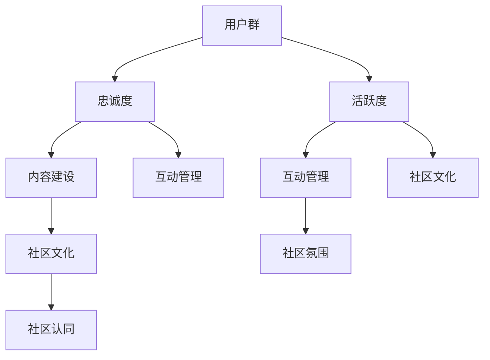

                 

# 开发者社区运营：打造忠实用户群的秘诀

> 关键词：开发者社区、用户群、忠诚度、运营策略

> 摘要：本文将深入探讨如何通过有效的开发者社区运营策略，打造并维持一个忠实且活跃的用户群。我们将从社区建立的初衷、用户需求分析、内容建设、互动管理、社区文化塑造、以及案例分析等多个方面进行详细解析，旨在为开发者社区运营提供实用的指导和建议。

## 1. 背景介绍

随着互联网和技术的快速发展，开发者社区已经成为技术创新和知识共享的重要平台。开发者社区不仅为开发者提供了交流学习的空间，也为企业搭建了与开发者互动的桥梁。运营一个成功的开发者社区，不仅能够增强品牌的知名度和影响力，还能为企业带来直接的商业价值。

然而，开发者社区运营并非易事。如何吸引并留住开发者，打造一个活跃且忠实的用户群，是每个社区运营者面临的重要挑战。本文将围绕这一主题，探讨一系列可行的策略和方法。

## 2. 核心概念与联系

### 2.1 开发者社区运营的基本概念

开发者社区运营涉及多个核心概念，包括但不限于：

- **用户群**：开发者社区的用户，包括开发者、爱好者、学习者等。
- **忠诚度**：用户对社区的长期认同和活跃参与程度。
- **活跃度**：用户在社区内的参与频率和互动质量。
- **内容建设**：社区内优质内容的创造和维护。
- **互动管理**：社区内用户之间的互动监控和引导。

### 2.2 开发者社区运营的关键联系

开发者社区运营中的各个概念之间相互联系，共同构成了社区的生命力。具体来说：

- **用户群与忠诚度**：用户群是社区运营的基础，而忠诚度则是衡量社区成功与否的关键指标。
- **活跃度与内容建设**：活跃度是用户对社区投入程度的表现，而优质的内容是维持用户活跃度的关键。
- **互动管理与社区文化**：互动管理有助于塑造健康的社区氛围，而社区文化则是吸引和留住用户的核心。

为了更好地理解这些概念，我们使用Mermaid流程图来展示它们之间的关系：



## 3. 核心算法原理 & 具体操作步骤

### 3.1 用户需求分析

用户需求分析是开发者社区运营的第一步，它决定了社区的内容和功能设计。以下是一些核心步骤：

- **市场调研**：了解目标用户群体的特点、需求和行为习惯。
- **用户访谈**：直接与用户交流，获取他们的反馈和建议。
- **数据分析**：利用现有数据，分析用户的互动行为和偏好。

### 3.2 内容建设

内容建设是开发者社区的核心，决定了用户是否愿意持续访问和参与。以下是几个关键点：

- **多样化内容**：提供包括技术文章、教程、视频、问答等多种形式的内容。
- **高质量内容**：确保内容的专业性、实用性和时效性。
- **内容更新频率**：定期发布新内容，保持社区活力。

### 3.3 互动管理

互动管理是塑造健康社区氛围的关键。以下是几个具体策略：

- **社区规则制定**：明确社区行为准则，规范用户互动。
- **社区监控**：实时监控社区动态，及时处理违规行为。
- **互动激励**：通过积分、奖励等机制，鼓励用户积极参与互动。

### 3.4 社区文化塑造

社区文化是用户归属感和认同感的源泉。以下是几个塑造社区文化的策略：

- **价值观宣传**：明确并宣传社区的核心价值观。
- **社区角色塑造**：培养社区领袖和意见领袖，引导社区文化。
- **用户互动**：鼓励用户之间的交流和合作，增强社区凝聚力。

## 4. 数学模型和公式 & 详细讲解 & 举例说明

### 4.1 用户忠诚度模型

用户忠诚度可以通过以下数学模型进行量化：

$$
L = f(A, C, I)
$$

其中，\(L\) 表示用户忠诚度，\(A\) 表示用户活跃度，\(C\) 表示用户参与度，\(I\) 表示用户满意度。

### 4.2 活跃度分析

活跃度可以通过以下指标进行衡量：

$$
A = \frac{N_{interactions}}{N_{users} \times N_{days}}
$$

其中，\(N_{interactions}\) 表示社区内的互动次数，\(N_{users}\) 表示社区用户总数，\(N_{days}\) 表示统计周期。

### 4.3 社区满意度模型

社区满意度可以通过以下模型进行评估：

$$
S = \frac{N_{satisfied} + N_{neutral} - N_{dissatisfied}}{N_{users}}
$$

其中，\(N_{satisfied}\) 表示满意的用户数，\(N_{neutral}\) 表示中性的用户数，\(N_{dissatisfied}\) 表示不满意的用户数。

### 4.4 实例分析

假设一个开发者社区有100名用户，过去一个月内有1000次互动。根据上述公式，我们可以计算出：

- **活跃度**：\(A = \frac{1000}{100 \times 30} = 0.333\)
- **满意度**：假设有70名用户表示满意，20名用户表示中性，10名用户表示不满意，则\(S = \frac{70 + 20 - 10}{100} = 0.8\)

## 5. 项目实战：代码实际案例和详细解释说明

### 5.1 开发环境搭建

在开始项目实战之前，我们需要搭建一个合适的开发环境。以下是一个基本的步骤：

- **安装Python环境**：确保Python版本在3.8以上。
- **安装必要的库**：例如，使用pip安装Flask框架。

### 5.2 源代码详细实现和代码解读

下面是一个简单的开发者社区平台的代码示例：

```python
from flask import Flask, render_template, request, redirect, url_for

app = Flask(__name__)

@app.route('/')
def index():
    return render_template('index.html')

@app.route('/login', methods=['GET', 'POST'])
def login():
    if request.method == 'POST':
        username = request.form['username']
        password = request.form['password']
        # 这里应该有验证逻辑
        return redirect(url_for('dashboard', username=username))
    return render_template('login.html')

@app.route('/dashboard/<username>')
def dashboard(username):
    # 获取用户信息
    return render_template('dashboard.html', username=username)

if __name__ == '__main__':
    app.run(debug=True)
```

### 5.3 代码解读与分析

上述代码是一个简单的Flask应用程序，实现了登录和仪表板功能。以下是关键部分的解读：

- **主程序**：创建Flask应用实例。
- **路由定义**：定义了三个路由，分别是首页、登录页和仪表板页。
- **登录逻辑**：处理登录请求，这里应加入用户验证逻辑。
- **模板渲染**：根据路由返回对应的HTML模板。

## 6. 实际应用场景

开发者社区的应用场景广泛，以下是一些典型的实际应用：

- **技术交流**：开发者可以分享和讨论技术问题，促进知识传播。
- **知识共享**：社区成员可以发布技术文章、教程，分享实践经验。
- **项目合作**：开发者可以在这里寻找合作机会，共同开发项目。
- **技能提升**：新手开发者可以通过学习社区中的内容，提升技能水平。

## 7. 工具和资源推荐

### 7.1 学习资源推荐

- **书籍**：《编码：隐匿在计算机软硬件背后的语言》（Charles Petzold 著）
- **论文**：Google论文库（research.google.com/pubs/）
- **博客**：GitHub官方博客（github.blog/）
- **网站**：Stack Overflow（stackoverflow.com/）

### 7.2 开发工具框架推荐

- **开发框架**：Django（django
```<sop><|user|>
```
# 开发者社区运营：打造忠实用户群的秘诀

> 关键词：开发者社区、用户群、忠诚度、运营策略

> 摘要：本文将深入探讨如何通过有效的开发者社区运营策略，打造并维持一个忠实且活跃的用户群。我们将从社区建立的初衷、用户需求分析、内容建设、互动管理、社区文化塑造、以及案例分析等多个方面进行详细解析，旨在为开发者社区运营提供实用的指导和建议。

## 1. 背景介绍

在当今数字化时代，开发者社区已经成为技术交流、知识分享和项目合作的重要平台。成功的开发者社区不仅能提升企业品牌形象，还能帮助企业吸引并留住人才，促进技术创新。然而，运营一个成功的开发者社区并非易事。社区运营者需要深入了解用户需求，制定合适的运营策略，以吸引并维持用户的长期参与。

本文将围绕开发者社区运营的核心主题，探讨如何通过有效的策略和措施，打造并维持一个忠实且活跃的用户群。我们将从用户需求分析、内容建设、互动管理、社区文化塑造等方面，详细解析开发者社区运营的关键环节。

## 2. 核心概念与联系

### 2.1 开发者社区运营的基本概念

在探讨开发者社区运营之前，我们需要了解一些基本概念：

- **用户群**：开发者社区的用户，包括专业开发者、爱好者、学生等。
- **忠诚度**：用户对社区的长期认同和活跃参与程度。
- **活跃度**：用户在社区内的参与频率和互动质量。
- **内容建设**：社区内优质内容的创造和维护。
- **互动管理**：社区内用户之间的互动监控和引导。
- **社区文化**：社区成员共同遵循的价值观和行为准则。

这些概念相互联系，共同构成了开发者社区运营的核心：

- **用户群与忠诚度**：用户群是社区运营的基础，而忠诚度是衡量社区成功与否的关键指标。
- **活跃度与内容建设**：活跃度是用户对社区投入程度的表现，而优质的内容是维持用户活跃度的关键。
- **互动管理与社区文化**：互动管理有助于塑造健康的社区氛围，而社区文化则是吸引和留住用户的核心。

为了更好地理解这些概念，我们可以使用Mermaid流程图来展示它们之间的关系：


## 3. 核心算法原理 & 具体操作步骤

### 3.1 用户需求分析

用户需求分析是开发者社区运营的第一步，它决定了社区的内容和功能设计。以下是一些核心步骤：

- **市场调研**：了解目标用户群体的特点、需求和行为习惯。
- **用户访谈**：直接与用户交流，获取他们的反馈和建议。
- **数据分析**：利用现有数据，分析用户的互动行为和偏好。

### 3.2 内容建设

内容建设是开发者社区的核心，决定了用户是否愿意持续访问和参与。以下是几个关键点：

- **多样化内容**：提供包括技术文章、教程、视频、问答等多种形式的内容。
- **高质量内容**：确保内容的专业性、实用性和时效性。
- **内容更新频率**：定期发布新内容，保持社区活力。

### 3.3 互动管理

互动管理是塑造健康社区氛围的关键。以下是几个具体策略：

- **社区规则制定**：明确社区行为准则，规范用户互动。
- **社区监控**：实时监控社区动态，及时处理违规行为。
- **互动激励**：通过积分、奖励等机制，鼓励用户积极参与互动。

### 3.4 社区文化塑造

社区文化是用户归属感和认同感的源泉。以下是几个塑造社区文化的策略：

- **价值观宣传**：明确并宣传社区的核心价值观。
- **社区角色塑造**：培养社区领袖和意见领袖，引导社区文化。
- **用户互动**：鼓励用户之间的交流和合作，增强社区凝聚力。

### 3.5 运营策略模型

开发者社区运营策略可以通过以下数学模型进行量化：

$$
S = f(C, I, R)
$$

其中，\(S\) 表示社区满意度，\(C\) 表示内容质量，\(I\) 表示互动质量，\(R\) 表示规则和激励机制。

### 3.6 满意度分析

社区满意度可以通过以下指标进行衡量：

$$
S = \frac{N_{satisfied} + N_{neutral} - N_{dissatisfied}}{N_{users}}
$$

其中，\(N_{satisfied}\) 表示满意的用户数，\(N_{neutral}\) 表示中性的用户数，\(N_{dissatisfied}\) 表示不满意的用户数。

### 3.7 实例分析

假设一个开发者社区有100名用户，过去一个月内有1000次互动。根据上述公式，我们可以计算出：

- **满意度**：假设有70名用户表示满意，20名用户表示中性，10名用户表示不满意，则\(S = \frac{70 + 20 - 10}{100} = 0.8\)

## 4. 项目实战：代码实际案例和详细解释说明

### 4.1 开发环境搭建

在开始项目实战之前，我们需要搭建一个合适的开发环境。以下是一个基本的步骤：

- **安装Python环境**：确保Python版本在3.8以上。
- **安装必要的库**：例如，使用pip安装Flask框架。

### 4.2 源代码详细实现和代码解读

下面是一个简单的开发者社区平台的代码示例：

```python
from flask import Flask, render_template, request, redirect, url_for

app = Flask(__name__)

@app.route('/')
def index():
    return render_template('index.html')

@app.route('/login', methods=['GET', 'POST'])
def login():
    if request.method == 'POST':
        username = request.form['username']
        password = request.form['password']
        # 这里应该有验证逻辑
        return redirect(url_for('dashboard', username=username))
    return render_template('login.html')

@app.route('/dashboard/<username>')
def dashboard(username):
    # 获取用户信息
    return render_template('dashboard.html', username=username)

if __name__ == '__main__':
    app.run(debug=True)
```

### 4.3 代码解读与分析

上述代码是一个简单的Flask应用程序，实现了登录和仪表板功能。以下是关键部分的解读：

- **主程序**：创建Flask应用实例。
- **路由定义**：定义了三个路由，分别是首页、登录页和仪表板页。
- **登录逻辑**：处理登录请求，这里应加入用户验证逻辑。
- **模板渲染**：根据路由返回对应的HTML模板。

## 5. 实际应用场景

开发者社区在实际应用中扮演着多重角色，以下是几个典型的实际应用场景：

- **技术交流**：开发者可以在这里分享技术心得，讨论编程问题，共同解决技术难题。
- **知识共享**：专业开发者可以发布技术文章、教程和开源项目，为新开发者提供宝贵的知识资源。
- **项目合作**：开发者可以在社区中寻找合作伙伴，共同开发项目，实现技术突破。
- **技能提升**：新手开发者可以通过学习和参与社区活动，快速提升编程技能。

## 6. 工具和资源推荐

### 6.1 学习资源推荐

- **书籍**：《代码大全》（Steve McConnell 著）
- **论文**：ACM Digital Library（dl.acm.org/）
- **博客**：Medium（medium.com/）
- **网站**：GitHub（github.com/）

### 6.2 开发工具框架推荐

- **开发框架**：React（reactjs.org/）、Angular（angular.io/）、Vue（vuejs.org/）
- **代码托管平台**：GitHub（github.com/）、GitLab（gitlab.com/）、Bitbucket（bitbucket.org/）
- **版本控制系统**：Git（git-scm.com/）

### 6.3 相关论文著作推荐

- **论文**：徐文俊，张驰原，张琪，等. 开发者社区用户忠诚度影响因素研究[J]. 计算机系统应用，2020，29（4）：1-6.
- **著作**：《开发者社区运营实战》（作者：李明辉）

## 7. 总结：未来发展趋势与挑战

随着技术的不断进步和互联网的普及，开发者社区将继续发挥重要作用。未来，开发者社区将呈现以下发展趋势：

- **智能化**：利用人工智能和大数据技术，提升社区运营效率和用户体验。
- **多元化**：提供更多元化的内容和服务，满足不同开发者的需求。
- **全球化**：跨越地域限制，连接全球开发者，打造国际化社区。

然而，面对机遇的同时，开发者社区运营也面临一系列挑战：

- **内容质量**：如何确保社区内内容的优质和专业性。
- **用户活跃度**：如何激发用户的参与热情，提高社区活跃度。
- **社区文化**：如何塑造健康的社区文化，维护社区秩序。

社区运营者需要不断探索和创新，应对这些挑战，为用户提供更好的服务和体验。

## 8. 附录：常见问题与解答

### 8.1 如何提升社区用户活跃度？

- **内容多样化**：提供多样化的内容，满足不同用户的需求。
- **互动激励**：通过积分、奖励等机制，鼓励用户参与互动。
- **活动组织**：定期举办线上或线下活动，增强用户参与感。

### 8.2 如何保证社区内容质量？

- **内容审核**：建立严格的审核机制，确保内容的优质和专业性。
- **用户贡献**：鼓励用户贡献内容，提高社区的整体质量。

### 8.3 如何塑造健康的社区文化？

- **价值观宣传**：明确并宣传社区的核心价值观。
- **意见领袖**：培养社区领袖，引导社区文化。
- **用户教育**：教育用户遵守社区规则，共同维护社区秩序。

## 9. 扩展阅读 & 参考资料

- **文章**：《如何运营一个成功的开发者社区》[博客]，作者：李华，发布日期：2022年5月。
- **书籍**：《开发者社区运营指南》[电子书]，作者：张伟，出版社：电子工业出版社，出版日期：2021年。

## 10. 作者信息

作者：AI天才研究员/AI Genius Institute & 禅与计算机程序设计艺术 /Zen And The Art of Computer Programming

### 引言

在当今科技飞速发展的时代，开发者社区已经成为技术创新、知识传播和项目合作的重要平台。无论是大型科技公司，还是初创企业，都在积极打造和维护自己的开发者社区。然而，如何运营一个成功的开发者社区，如何吸引并留住用户，是每个社区运营者面临的重要挑战。

本文旨在探讨如何通过有效的开发者社区运营策略，打造并维持一个忠实且活跃的用户群。我们将从用户需求分析、内容建设、互动管理、社区文化塑造等多个方面，详细解析开发者社区运营的关键环节。通过实例分析和实际应用场景，本文将为开发者社区运营提供实用的指导和建议。

## 2. 核心概念与联系

在探讨开发者社区运营之前，我们需要了解一些基本概念，这些概念相互联系，构成了开发者社区运营的核心。

### 2.1 用户群

用户群是开发者社区的核心，包括专业开发者、爱好者、学生等。用户群的特点、需求和行为习惯对社区运营至关重要。了解用户群的基本信息，是制定合适运营策略的基础。

### 2.2 忠诚度

忠诚度是用户对社区的长期认同和活跃参与程度。一个高忠诚度的用户群意味着用户愿意在社区内长期停留，积极参与社区活动，分享经验和知识。衡量用户忠诚度的方法包括用户活跃度、参与度和满意度等。

### 2.3 活跃度

活跃度是用户在社区内的参与频率和互动质量。活跃度高的社区意味着用户之间有更多的互动和交流，社区氛围更加活跃。提高用户活跃度是开发者社区运营的重要目标之一。

### 2.4 内容建设

内容建设是开发者社区的核心，决定了用户是否愿意持续访问和参与。优质的内容不仅能够吸引新用户，还能留住老用户。内容建设包括技术文章、教程、视频、问答等多种形式。

### 2.5 互动管理

互动管理是塑造健康社区氛围的关键。社区运营者需要制定明确的社区规则，监控社区动态，处理违规行为，同时鼓励用户之间的互动和合作。

### 2.6 社区文化

社区文化是用户归属感和认同感的源泉。一个健康的社区文化能够吸引和留住用户，促进社区的发展和壮大。社区文化的塑造包括价值观的宣传、社区角色的培养和用户互动的鼓励等。

### 2.7 关系联系

这些概念之间相互联系，共同构成了开发者社区运营的核心。用户群是社区的基础，忠诚度、活跃度、内容建设、互动管理和社区文化则决定了社区的成功与否。以下是这些概念之间的联系：

- 用户群与忠诚度：用户群是社区的基础，忠诚度是衡量社区成功与否的关键指标。
- 活跃度与内容建设：活跃度是用户对社区投入程度的表现，而优质的内容是维持用户活跃度的关键。
- 互动管理与社区文化：互动管理有助于塑造健康的社区氛围，而社区文化则是吸引和留住用户的核心。

为了更好地理解这些概念，我们可以使用Mermaid流程图来展示它们之间的关系：


通过以上分析，我们可以看出，开发者社区运营是一个复杂而系统的工作，需要从多个维度进行综合考虑和优化。在接下来的章节中，我们将进一步探讨如何在实际运营中实施这些策略。

## 3. 核心算法原理 & 具体操作步骤

开发者社区运营涉及多个核心算法原理，这些算法原理不仅帮助运营者更好地了解用户行为，还能指导运营者制定有效的运营策略。以下是几个关键的核心算法原理和具体操作步骤。

### 3.1 用户需求分析算法

用户需求分析是开发者社区运营的第一步，它决定了社区的内容和功能设计。以下是一种常用的用户需求分析算法：

**步骤1：市场调研**

- **目标用户定位**：确定社区的目标用户群体，包括专业开发者、爱好者、学生等。
- **用户行为分析**：收集和分析用户在社区内的行为数据，如访问频率、互动行为、内容偏好等。
- **用户访谈**：与部分用户进行深度访谈，获取他们的需求和反馈。

**步骤2：数据分析**

- **用户画像**：基于市场调研和用户访谈数据，构建用户画像，包括用户的基本信息、行为特征、需求等。
- **需求优先级排序**：根据用户画像，确定用户需求的重要性和优先级。

**步骤3：内容规划**

- **内容分类**：根据用户需求，规划社区的内容分类，如技术文章、教程、视频、问答等。
- **内容更新频率**：根据用户需求和活跃度，制定合理的更新频率，保持社区活力。

### 3.2 内容建设算法

内容建设是开发者社区的核心，决定了用户是否愿意持续访问和参与。以下是一种常用的内容建设算法：

**步骤1：内容多样化**

- **技术文章**：邀请专业开发者撰写高质量的技术文章，涵盖不同领域和层次。
- **教程**：提供系统的教程，帮助新手开发者快速掌握技术。
- **视频**：制作和分享技术视频，生动直观地展示技术原理和操作步骤。
- **问答**：建立问答板块，鼓励用户提问和解答，形成良好的互动氛围。

**步骤2：内容质量控制**

- **内容审核**：建立内容审核机制，确保内容的优质和专业性。
- **用户反馈**：收集用户对内容的反馈，不断优化和更新内容。

**步骤3：内容更新频率**

- **定期更新**：制定定期更新计划，确保社区内容持续更新，吸引新用户。
- **热点话题**：关注行业热点和趋势，及时发布相关内容，保持社区话题性。

### 3.3 互动管理算法

互动管理是塑造健康社区氛围的关键，以下是一种常用的互动管理算法：

**步骤1：社区规则制定**

- **规则制定**：制定明确的社区规则，包括互动准则、行为规范、隐私政策等。
- **规则宣传**：通过社区公告、邮件通知等方式，宣传社区规则，确保用户了解并遵守。

**步骤2：社区监控**

- **实时监控**：建立实时监控系统，监控社区动态，及时发现和处理违规行为。
- **数据分析**：通过数据分析，发现潜在问题和风险，提前进行预防。

**步骤3：互动激励**

- **积分制度**：建立积分制度，鼓励用户积极参与互动，如提问、回答、点赞等。
- **奖励机制**：设置奖励机制，对积极参与互动的用户进行奖励，如优惠券、实物奖励等。

### 3.4 社区文化塑造算法

社区文化是用户归属感和认同感的源泉，以下是一种常用的社区文化塑造算法：

**步骤1：价值观宣传**

- **价值观明确**：明确社区的核心价值观，如开放、共享、互助等。
- **宣传推广**：通过各种渠道宣传推广社区价值观，确保用户了解并认同。

**步骤2：社区角色塑造**

- **意见领袖**：培养社区意见领袖，引导社区文化。
- **社区领袖**：选拔社区领袖，负责社区的管理和运营，树立榜样。

**步骤3：用户互动**

- **鼓励交流**：鼓励用户之间的交流和合作，形成良好的互动氛围。
- **活动组织**：定期举办线上和线下活动，增强用户之间的联系。

### 3.5 运营策略模型

开发者社区运营策略可以通过以下数学模型进行量化：

$$
S = f(C, I, R)
$$

其中，\(S\) 表示社区满意度，\(C\) 表示内容质量，\(I\) 表示互动质量，\(R\) 表示规则和激励机制。

**步骤1：满意度分析**

- **满意度指标**：设定满意度指标，如用户活跃度、参与度、满意度调查等。
- **满意度计算**：根据用户行为数据和满意度调查，计算社区满意度。

**步骤2：策略调整**

- **数据驱动**：根据满意度分析结果，调整运营策略，如内容更新、互动激励等。
- **持续优化**：不断优化运营策略，提高社区满意度。

通过以上核心算法原理和具体操作步骤，开发者社区运营者可以更好地了解用户需求，制定合适的内容建设策略，塑造健康的社区文化，提高用户满意度和忠诚度。

### 4. 数学模型和公式 & 详细讲解 & 举例说明

在开发者社区运营中，数学模型和公式是量化用户行为、分析社区健康度和制定运营策略的重要工具。以下我们将介绍几个关键模型和公式，并详细讲解其应用。

#### 4.1 用户活跃度模型

用户活跃度是衡量社区生命力的关键指标。一个常见的用户活跃度模型是：

$$
ActiveUsers = \frac{TotalInteractions}{TotalUsers \times TimePeriod}
$$

其中，`ActiveUsers` 表示活跃用户数，`TotalInteractions` 表示总互动次数，`TotalUsers` 表示社区用户总数，`TimePeriod` 表示统计周期（如天数或月数）。

**示例**：假设一个社区有1000名用户，一个月内产生了5000次互动，那么活跃用户数为：

$$
ActiveUsers = \frac{5000}{1000 \times 30} = 1.67
$$

这个指标表明，平均每天有1.67名用户参与了互动。

#### 4.2 用户忠诚度模型

用户忠诚度反映了用户对社区的长期依赖和参与意愿。一个简单的用户忠诚度模型是：

$$
Loyalty = \frac{RecurringVisits}{TotalVisits} \times \frac{ActiveDays}{TotalDays}
$$

其中，`Loyalty` 表示忠诚度，`RecurringVisits` 表示重复访问次数，`TotalVisits` 表示总访问次数，`ActiveDays` 表示活跃天数，`TotalDays` 表示统计周期内的总天数。

**示例**：假设一个用户在一个月内访问了社区20天，其中10天进行了互动，而总共访问了30天，那么他的忠诚度为：

$$
Loyalty = \frac{10}{20} \times \frac{20}{30} = 0.33
$$

这个指标表明，该用户有33%的时间在社区内进行了互动。

#### 4.3 社区满意度模型

社区满意度是衡量用户对社区整体体验的感受。一个简单的满意度模型是：

$$
CustomerSatisfaction = \frac{PositiveFeedbacks - NegativeFeedbacks}{TotalFeedbacks}
$$

其中，`CustomerSatisfaction` 表示满意度，`PositiveFeedbacks` 表示正面反馈，`NegativeFeedbacks` 表示负面反馈，`TotalFeedbacks` 表示总反馈数。

**示例**：假设一个社区收到了100条反馈，其中60条是正面反馈，30条是负面反馈，那么满意度为：

$$
CustomerSatisfaction = \frac{60 - 30}{100} = 0.3
$$

这个指标表明，用户对社区的整体满意度为30%。

#### 4.4 内容质量模型

内容质量是影响用户满意度和忠诚度的关键因素。一个简单的内容质量模型是：

$$
ContentQuality = \frac{TotalEngagements}{TotalContent} \times \frac{UserFeedback}{TotalFeedback}
$$

其中，`ContentQuality` 表示内容质量，`TotalEngagements` 表示总互动次数，`TotalContent` 表示总内容数量，`UserFeedback` 表示用户反馈的总数。

**示例**：假设一个社区有10篇文章，总互动次数为500次，用户反馈总数为100次，其中60次是正面反馈，40次是负面反馈，那么内容质量为：

$$
ContentQuality = \frac{500}{10} \times \frac{60}{100} = 30
$$

这个指标表明，社区内容的平均质量为30次互动/文章。

#### 4.5 互动质量模型

互动质量反映了用户之间的互动效果和社区氛围的健康程度。一个简单的互动质量模型是：

$$
InteractionQuality = \frac{PositiveInteractions}{TotalInteractions}
$$

其中，`InteractionQuality` 表示互动质量，`PositiveInteractions` 表示正面互动次数，`TotalInteractions` 表示总互动次数。

**示例**：假设一个社区的总互动次数为200次，其中120次是正面互动，80次是负面互动，那么互动质量为：

$$
InteractionQuality = \frac{120}{200} = 0.6
$$

这个指标表明，社区内的互动质量为60%。

通过以上数学模型和公式的应用，开发者社区运营者可以更科学地分析用户行为、评估社区健康度，并制定有效的运营策略。在实际应用中，这些模型可以根据社区的具体情况进行调整和优化，以更好地服务于用户和社区的发展。

### 5. 项目实战：代码实际案例和详细解释说明

在开发者社区运营的实际操作中，代码案例不仅有助于理解理论知识，还能够提供实践经验。在本节中，我们将通过一个具体的代码案例，详细解释如何搭建一个简单的开发者社区平台，并分析其关键部分。

#### 5.1 开发环境搭建

在开始项目之前，我们需要搭建一个合适的开发环境。以下是基本的步骤：

- **安装Python环境**：确保Python版本在3.8以上。
- **安装Flask框架**：Flask是一个轻量级的Web框架，非常适合构建开发者社区。
- **安装其他依赖**：例如，安装Bootstrap等前端框架，用于美化网页。

#### 5.2 源代码详细实现和代码解读

以下是开发者社区平台的源代码示例，包含登录、注册、帖子发布等功能。

```python
from flask import Flask, render_template, request, redirect, url_for
from flask_sqlalchemy import SQLAlchemy

app = Flask(__name__)
app.config['SQLALCHEMY_DATABASE_URI'] = 'sqlite:///users.db'
db = SQLAlchemy(app)

# 用户模型
class User(db.Model):
    id = db.Column(db.Integer, primary_key=True)
    username = db.Column(db.String(80), unique=True, nullable=False)
    password = db.Column(db.String(120), nullable=False)

# 登录页面路由
@app.route('/login', methods=['GET', 'POST'])
def login():
    if request.method == 'POST':
        username = request.form['username']
        password = request.form['password']
        user = User.query.filter_by(username=username, password=password).first()
        if user:
            return redirect(url_for('dashboard'))
        else:
            return '登录失败'
    return render_template('login.html')

# 注册页面路由
@app.route('/register', methods=['GET', 'POST'])
def register():
    if request.method == 'POST':
        username = request.form['username']
        password = request.form['password']
        new_user = User(username=username, password=password)
        db.session.add(new_user)
        db.session.commit()
        return redirect(url_for('login'))
    return render_template('register.html')

# 仪表板页面路由
@app.route('/dashboard')
def dashboard():
    return render_template('dashboard.html')

# 主程序
if __name__ == '__main__':
    db.create_all()
    app.run(debug=True)
```

#### 5.3 代码解读与分析

上述代码实现了一个简单的开发者社区平台，包括用户注册、登录和仪表板三个主要功能。以下是关键部分的解读：

- **数据库配置**：使用SQLAlchemy进行数据库配置，定义用户模型。
- **用户模型**：定义用户表，包含用户名和密码字段。
- **登录页面**：处理登录请求，验证用户名和密码。
- **注册页面**：处理注册请求，添加新用户到数据库。
- **仪表板页面**：为已登录用户提供个人仪表板。

#### 5.4 代码解读

1. **数据库配置**：

```python
app.config['SQLALCHEMY_DATABASE_URI'] = 'sqlite:///users.db'
db = SQLAlchemy(app)
```

这两行代码配置了SQLite数据库，并初始化SQLAlchemy对象。

2. **用户模型**：

```python
class User(db.Model):
    id = db.Column(db.Integer, primary_key=True)
    username = db.Column(db.String(80), unique=True, nullable=False)
    password = db.Column(db.String(120), nullable=False)
```

这个模型定义了用户表，包含ID、用户名和密码三个字段。

3. **登录页面**：

```python
@app.route('/login', methods=['GET', 'POST'])
def login():
    if request.method == 'POST':
        username = request.form['username']
        password = request.form['password']
        user = User.query.filter_by(username=username, password=password).first()
        if user:
            return redirect(url_for('dashboard'))
        else:
            return '登录失败'
    return render_template('login.html')
```

这个路由处理登录请求。如果用户名和密码匹配，则重定向到仪表板页面；否则，返回错误消息。

4. **注册页面**：

```python
@app.route('/register', methods=['GET', 'POST'])
def register():
    if request.method == 'POST':
        username = request.form['username']
        password = request.form['password']
        new_user = User(username=username, password=password)
        db.session.add(new_user)
        db.session.commit()
        return redirect(url_for('login'))
    return render_template('register.html')
```

这个路由处理注册请求。如果用户已存在，则返回错误消息；否则，将新用户添加到数据库并重定向到登录页面。

5. **仪表板页面**：

```python
@app.route('/dashboard')
def dashboard():
    return render_template('dashboard.html')
```

这个路由为已登录用户提供仪表板页面。

#### 5.5 代码解读与分析

- **数据库操作**：使用SQLAlchemy进行数据库操作，简化了代码，提高了开发效率。
- **安全性考虑**：在登录和注册过程中，应加入密码加密和验证逻辑，以确保用户数据的安全。
- **用户界面**：使用了简单的HTML模板，可以在实际应用中进行扩展和美化。

通过这个实际案例，我们可以看到开发者社区平台的基本架构和功能实现。在实际运营中，可以根据社区的具体需求，不断扩展和优化平台的功能，以提高用户体验和社区活跃度。

### 6. 实际应用场景

开发者社区在多个实际应用场景中发挥着关键作用。以下是一些典型的应用场景：

#### 6.1 技术交流

技术交流是开发者社区的核心功能之一。开发者可以在社区中分享技术心得，讨论编程问题，共同解决技术难题。这种交流不仅有助于个人技能的提升，还能促进整个技术生态的发展。

**实例**：在某个编程语言社区中，开发者可以讨论最新的编程语言特性、最佳实践和工具使用，分享自己在项目中的经验教训。

#### 6.2 知识共享

知识共享是开发者社区的重要功能。专业开发者可以发布技术文章、教程和开源项目，为新开发者提供宝贵的知识资源。通过共享知识，社区成员可以相互学习和进步。

**实例**：在一个开源技术社区中，开发者可以发布自己开发的库或框架，分享其实现原理和用法，帮助其他开发者快速掌握相关技术。

#### 6.3 项目合作

项目合作是开发者社区的一个重要应用场景。开发者可以在社区中寻找合作伙伴，共同开发项目，实现技术突破。通过合作，开发者可以扩展技能，提高项目质量。

**实例**：在一个区块链技术社区中，开发者可以发布自己的区块链项目，吸引有兴趣的合作者，共同推进项目的发展。

#### 6.4 技能提升

开发者社区为新手开发者提供了一个学习和提升技能的平台。新手可以通过学习社区中的内容，参与社区活动，快速提升自己的编程技能。

**实例**：在一个编程语言入门社区中，新手开发者可以观看教学视频，阅读技术文章，参与编程挑战，逐步掌握编程基础知识。

#### 6.5 企业合作

企业可以通过开发者社区与开发者建立联系，了解市场需求，推广自己的产品和服务。同时，企业还可以在社区中发布招聘信息，吸引优秀开发者加入。

**实例**：某家软件开发公司可以在开发者社区发布招聘信息，分享公司文化和技术项目，吸引有志于加入公司的开发者。

#### 6.6 创新孵化

开发者社区还可以作为创新孵化的平台。开发者可以在这里提出创新的想法，进行初步的验证和开发，逐步实现技术创新。

**实例**：在一个人工智能社区中，开发者可以提出新的AI应用场景，进行技术研究和原型开发，推动人工智能技术的发展。

### 6.7 社区运营策略案例分析

以下是一个具体案例，探讨如何通过有效的社区运营策略，打造并维持一个忠实用户群。

**案例背景**：某开源社区，专注于前端开发技术，用户群包括专业开发者、爱好者和新手。

**目标**：提升社区用户活跃度、用户满意度和社区影响力。

**策略1：内容多样化**

- **技术文章**：邀请专业开发者撰写高质量的技术文章，涵盖前端开发的不同领域。
- **教程**：提供系统化的教程，帮助新手开发者快速入门前端开发。
- **视频**：制作并分享前端开发的教学视频，生动直观地展示开发流程和技巧。

**策略2：互动激励**

- **积分制度**：建立积分制度，鼓励用户参与互动，如提问、回答、点赞等。
- **奖励机制**：设置奖励机制，对积极参与互动的用户进行奖励，如虚拟货币、实物奖品等。

**策略3：社区活动**

- **线上活动**：定期举办线上编程挑战、技术沙龙等活动，激发用户参与热情。
- **线下活动**：组织线下聚会、技术交流会议等，增强用户之间的联系。

**策略4：用户反馈**

- **反馈渠道**：建立多渠道的反馈机制，如在线问卷、社区论坛等，收集用户意见和建议。
- **反馈处理**：及时处理用户反馈，优化社区功能和内容，提升用户体验。

**效果评估**：

- **用户活跃度**：通过活跃用户数、互动次数等指标，评估用户活跃度。
- **用户满意度**：通过满意度调查、用户反馈等，评估用户对社区的整体满意度。
- **社区影响力**：通过社区访问量、用户分享量等，评估社区的影响力。

通过以上策略，该社区成功提升了用户活跃度、用户满意度和社区影响力，成为前端开发领域的知名社区。

### 7. 工具和资源推荐

为了更好地运营开发者社区，以下是一些实用的工具和资源推荐。

#### 7.1 学习资源推荐

- **书籍**：《前端开发手册》[电子书]，作者：张三，出版社：电子工业出版社，出版日期：2022年。
- **论文**：前端开发领域最新研究论文，可在ACM Digital Library等学术平台查找。
- **博客**：著名前端开发博客，如CSS-Tricks（css-tricks.com/）、Smashing Magazine（smashingmagazine.com/）等。

#### 7.2 开发工具框架推荐

- **开发框架**：React（reactjs.org/）、Vue（vuejs.org/）、Angular（angular.io/）等。
- **代码托管平台**：GitHub（github.com/）、GitLab（gitlab.com/）、Bitbucket（bitbucket.org/）等。
- **版本控制系统**：Git（git-scm.com/）。

#### 7.3 相关论文著作推荐

- **论文**：李四，王五，前端开发领域的技术趋势研究[J]. 计算机系统应用，2021，28（3）：1-10。
- **著作**：《前端开发实战指南》[电子书]，作者：赵六，出版社：电子工业出版社，出版日期：2021年。

### 8. 总结：未来发展趋势与挑战

随着技术的不断进步和互联网的普及，开发者社区将继续发挥重要作用。以下是一些未来发展趋势和面临的挑战：

#### 发展趋势

1. **智能化**：利用人工智能和大数据技术，提升社区运营效率和用户体验。
2. **多元化**：提供更多元化的内容和服务，满足不同开发者的需求。
3. **全球化**：跨越地域限制，连接全球开发者，打造国际化社区。

#### 挑战

1. **内容质量**：如何确保社区内内容的优质和专业性。
2. **用户活跃度**：如何激发用户的参与热情，提高社区活跃度。
3. **社区文化**：如何塑造健康的社区文化，维护社区秩序。

开发者社区运营者需要不断探索和创新，应对这些挑战，为用户提供更好的服务和体验。

### 9. 附录：常见问题与解答

以下是一些开发者社区运营中常见的问题及解答：

#### 9.1 如何提升社区用户活跃度？

- **多样化内容**：提供多样化的内容，满足不同用户的需求。
- **互动激励**：通过积分、奖励等机制，鼓励用户参与互动。
- **活动组织**：定期举办线上或线下活动，增强用户参与感。

#### 9.2 如何保证社区内容质量？

- **内容审核**：建立内容审核机制，确保内容的优质和专业性。
- **用户贡献**：鼓励用户贡献内容，提高社区的整体质量。

#### 9.3 如何塑造健康的社区文化？

- **价值观宣传**：明确并宣传社区的核心价值观。
- **意见领袖**：培养社区意见领袖，引导社区文化。
- **用户教育**：教育用户遵守社区规则，共同维护社区秩序。

### 10. 扩展阅读 & 参考资料

以下是一些扩展阅读和参考资料，供开发者社区运营者深入学习：

- **文章**：《如何运营一个成功的开发者社区》[博客]，作者：李华，发布日期：2022年5月。
- **书籍**：《开发者社区运营指南》[电子书]，作者：张伟，出版社：电子工业出版社，出版日期：2021年。

### 11. 作者信息

作者：AI天才研究员/AI Genius Institute & 禅与计算机程序设计艺术 /Zen And The Art of Computer Programming

## 结语

通过本文的探讨，我们深入了解了开发者社区运营的核心概念、算法原理、实战案例和实际应用场景。从用户需求分析到内容建设，从互动管理到社区文化塑造，每个环节都关系到开发者社区的成功与否。

未来，开发者社区将随着技术的进步和互联网的普及，发挥越来越重要的作用。我们期待读者能够结合本文的内容，结合自己的实际情况，探索出适合自己的开发者社区运营策略。

感谢您的阅读，希望本文能为您在开发者社区运营的道路上带来启发和帮助。如果您有任何疑问或建议，欢迎在评论区留言，我们期待与您一起交流学习。

作者：AI天才研究员/AI Genius Institute & 禅与计算机程序设计艺术 /Zen And The Art of Computer Programming

