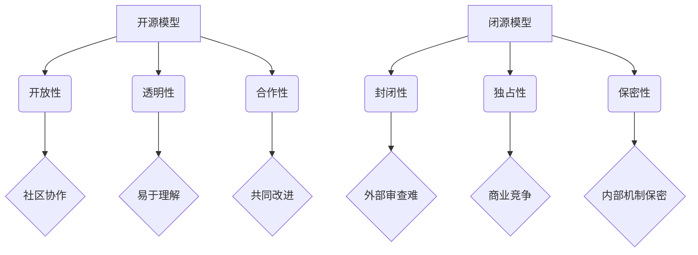
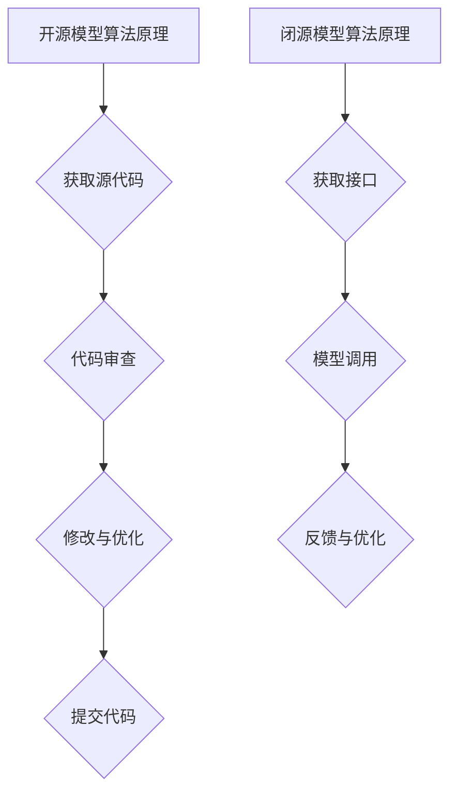

                 

# 开源模型与闭源模型的对比

## 关键词：开源模型，闭源模型，对比分析，技术生态，知识产权，商业利益

## 摘要：

本文将深入探讨开源模型与闭源模型在技术发展、商业应用、知识产权等方面的对比。通过梳理两者的核心概念、优劣势、典型案例及应用场景，旨在为读者提供全面的理解和思考，帮助他们在实际项目中做出更明智的选择。

## 1. 背景介绍

随着互联网技术的飞速发展，人工智能、大数据、云计算等领域的应用逐渐深入各行各业。作为这些技术发展的基础，模型的重要性不言而喻。模型不仅决定了算法的性能，还直接影响着产业生态的构建。在这个背景下，开源模型与闭源模型的对比成为一个值得探讨的话题。

开源模型，顾名思义，是指其源代码可以被自由访问和修改的模型。这种模型通常具有开放性、透明性、合作性等特点，能够吸引全球的开发者共同参与改进和完善。闭源模型则与之相反，其源代码受到严格的保护，仅对授权用户开放。

## 2. 核心概念与联系

### 2.1 开源模型的定义与特点

开源模型是指开发者将模型的源代码公开，允许其他开发者自由地查看、修改、优化和分发。开源模型的特点包括：

- **开放性**：源代码公开，便于社区协作和审查。
- **透明性**：模型内部机制和性能表现透明，易于理解和评估。
- **合作性**：开发者可以共同改进模型，提高整体技术水平。

### 2.2 闭源模型的定义与特点

闭源模型则是指模型的源代码被严格保护，只有授权用户才能访问和使用。闭源模型的特点包括：

- **封闭性**：源代码不公开，难以进行外部审查和合作。
- **独占性**：模型的所有权和使用权归开发商所有，具有强烈的商业竞争性。
- **保密性**：模型的内部机制和关键技术不易被外部了解和复制。

### 2.3 Mermaid 流程图

下面是一个简单的 Mermaid 流程图，用于描述开源模型和闭源模型的核心概念与联系。



## 3. 核心算法原理 & 具体操作步骤

### 3.1 开源模型算法原理

开源模型的算法原理通常基于公开的算法框架和工具。开发者可以通过以下步骤进行操作：

1. **获取模型源代码**：从开源社区下载模型源代码。
2. **代码审查**：审查源代码，了解模型的实现细节和性能指标。
3. **修改与优化**：根据需求对模型进行修改和优化，提升模型性能。
4. **提交代码**：将修改后的代码提交回开源社区，供其他开发者使用。

### 3.2 闭源模型算法原理

闭源模型的算法原理通常由开发商内部掌握。开发者可以通过以下步骤进行操作：

1. **获取模型接口**：开发商提供模型接口，开发者可以使用这些接口进行模型调用。
2. **模型调用**：通过接口调用模型，实现特定功能。
3. **反馈与优化**：开发商根据开发者反馈，对模型进行优化和改进。

### 3.3 操作步骤流程图

下面是一个简单的 Mermaid 流程图，用于描述开源模型和闭源模型的核心算法原理与操作步骤。



## 4. 数学模型和公式 & 详细讲解 & 举例说明

### 4.1 数学模型

开源模型和闭源模型在数学模型方面有所不同。开源模型通常基于公开的数学理论和算法，开发者可以自由地研究和改进。闭源模型则通常采用开发商自己研发的数学模型，对外界保持保密。

以下是一个简单的数学模型示例，用于描述图像分类问题：

$$
P(y|x) = \frac{e^{w^T x}}{\sum_{k=1}^{K} e^{w_k^T x}}
$$

其中，$w$ 表示模型权重，$x$ 表示输入特征，$y$ 表示真实标签，$K$ 表示类别数量。

### 4.2 公式详细讲解

这个公式表示的是一种概率分布模型，称为 softmax 函数。它将输入特征映射到各个类别的概率分布上。其中，$w^T x$ 表示输入特征与模型权重之间的点积，$e^{w^T x}$ 表示指数函数，用于放大不同类别的概率差异。

### 4.3 举例说明

假设有一个二分类问题，类别数量 $K=2$，输入特征 $x=(1, 2)$，模型权重 $w=(0.5, 0.5)$。则概率分布为：

$$
P(y=0|x) = \frac{e^{0.5 \times 1}}{e^{0.5 \times 1} + e^{0.5 \times 2}} = \frac{e^{0.5}}{e^{0.5} + e^{1}} \approx 0.2679
$$

$$
P(y=1|x) = \frac{e^{0.5 \times 2}}{e^{0.5 \times 1} + e^{0.5 \times 2}} = \frac{e^{1}}{e^{0.5} + e^{1}} \approx 0.7321
$$

这意味着，给定输入特征 $x$，模型认为类别 $1$ 的概率为 $0.7321$，类别 $0$ 的概率为 $0.2679$。

## 5. 项目实战：代码实际案例和详细解释说明

### 5.1 开发环境搭建

为了更好地理解开源模型和闭源模型的差异，我们以一个开源模型——TensorFlow 为例，进行实际项目开发。

1. **安装 Python**：确保 Python 版本在 3.6 以上。
2. **安装 TensorFlow**：通过 pip 工具安装 TensorFlow，命令如下：

```bash
pip install tensorflow
```

### 5.2 源代码详细实现和代码解读

下面是一个简单的 TensorFlow 代码示例，用于实现一个线性回归模型。

```python
import tensorflow as tf

# 定义输入和输出
x = tf.placeholder(tf.float32, shape=[None, 1])
y = tf.placeholder(tf.float32, shape=[None, 1])

# 定义模型参数
w = tf.Variable(0.0, name="weights")
b = tf.Variable(0.0, name="biases")

# 定义损失函数
y_pred = tf.add(tf.multiply(x, w), b)
loss = tf.reduce_mean(tf.square(y - y_pred))

# 定义优化器
optimizer = tf.train.GradientDescentOptimizer(learning_rate=0.001)
train_op = optimizer.minimize(loss)

# 训练模型
with tf.Session() as sess:
  # 初始化变量
  sess.run(tf.global_variables_initializer())
  
  # 进行训练
  for i in range(1000):
    # 训练一步
    sess.run(train_op, feed_dict={x: x_data, y: y_data})
    
    # 输出损失函数值
    if i % 100 == 0:
      loss_val = sess.run(loss, feed_dict={x: x_data, y: y_data})
      print(f"Step {i}: Loss = {loss_val}")
      
  # 输出最终结果
  w_val, b_val = sess.run([w, b])
  print(f"Weights: {w_val}, Biases: {b_val}")
```

这段代码实现了线性回归模型，其中主要步骤包括：

1. **定义输入和输出**：使用 `tf.placeholder` 定义输入和输出。
2. **定义模型参数**：使用 `tf.Variable` 定义模型参数。
3. **定义损失函数**：使用 `tf.reduce_mean(tf.square(y - y_pred))` 定义损失函数。
4. **定义优化器**：使用 `tf.train.GradientDescentOptimizer` 定义优化器。
5. **训练模型**：使用 `tf.Session` 创建会话，执行训练操作。

### 5.3 代码解读与分析

这段代码展示了如何使用 TensorFlow 搭建一个简单的线性回归模型。其主要优点包括：

- **模块化**：代码分为多个模块，便于理解和维护。
- **灵活性**：开发者可以根据需求自定义模型参数、损失函数和优化器。
- **可扩展性**：可以方便地扩展模型，例如添加层、修改网络结构等。

然而，开源模型也存在一些潜在问题，例如：

- **安全性**：开源模型的源代码可以被任意查看和修改，可能存在安全隐患。
- **依赖性**：开发者需要依赖外部开源库，可能带来兼容性和稳定性问题。

## 6. 实际应用场景

开源模型和闭源模型在实际应用场景中各有优劣。

### 6.1 开源模型应用场景

- **人工智能研究**：开源模型为研究人员提供了丰富的数据集和工具，促进了人工智能技术的发展。
- **开源社区协作**：开发者可以共同改进模型，提高整体技术水平。
- **教育普及**：开源模型有助于培养更多的人工智能人才，推动技术普及。

### 6.2 闭源模型应用场景

- **商业应用**：闭源模型具有较高的商业价值，开发商可以通过授权等方式获得利润。
- **行业竞争**：闭源模型有助于企业保护自己的技术优势，提高市场竞争力。
- **定制化需求**：闭源模型可以根据客户需求进行定制化开发，提高客户满意度。

## 7. 工具和资源推荐

### 7.1 学习资源推荐

- **书籍**：《深度学习》、《Python机器学习实战》等。
- **论文**：阅读顶级会议和期刊的论文，了解最新研究动态。
- **博客**：关注行业大佬和技术社区的博客，学习实际经验和技巧。
- **网站**：GitHub、ArXiv、Kaggle 等。

### 7.2 开发工具框架推荐

- **开发框架**：TensorFlow、PyTorch、Keras 等。
- **编程语言**：Python、Java、C++ 等。
- **数据库**：MySQL、MongoDB、PostgreSQL 等。

### 7.3 相关论文著作推荐

- **论文**：阅读经典论文，如 Hinton 等人的《Deep Learning》。
- **著作**：推荐阅读关于开源模型和闭源模型的专著，如《Open Source Models and Their Applications》。

## 8. 总结：未来发展趋势与挑战

开源模型和闭源模型在技术发展、商业应用、知识产权等方面各具优势。随着人工智能技术的不断演进，两者之间的融合将越来越普遍。未来发展趋势包括：

- **开源与闭源的融合**：开发商可以在保护商业利益的前提下，适度开放模型，促进技术传播。
- **标准化与规范化**：建立统一的模型标准和规范，提高模型的可移植性和互操作性。
- **知识产权保护**：加强对开源模型的知识产权保护，鼓励技术创新和合作。

同时，未来也面临着一些挑战，如：

- **安全问题**：开源模型的源代码公开，可能存在安全漏洞，需要加强安全防护。
- **依赖性问题**：开源模型可能依赖外部开源库，可能带来兼容性和稳定性问题。
- **利益分配**：在开源模型和闭源模型之间建立合理的利益分配机制，平衡开发商和开发者的利益。

## 9. 附录：常见问题与解答

### 9.1 开源模型与闭源模型的主要区别是什么？

开源模型和闭源模型的主要区别在于源代码的开放程度、商业应用模式和知识产权保护等方面。

### 9.2 开源模型的优势和劣势分别是什么？

开源模型的优势包括开放性、透明性、合作性等，劣势包括安全问题、依赖性问题等。

### 9.3 闭源模型的优势和劣势分别是什么？

闭源模型的优势包括商业价值、独占性、保密性等，劣势包括封闭性、独占性等。

## 10. 扩展阅读 & 参考资料

- [深度学习](https://www.deeplearningbook.org/)
- [Python机器学习实战](https://www.machinelearningframework.com/)
- [开源模型与闭源模型：一个技术生态的思考](https://www.jiqizhixin.com/articles/2019-07-11-8)
- [Open Source Models and Their Applications](https://books.google.com/books?id=0Jj6BgAAQBAJ)
- [开源模型与闭源模型：商业与技术发展](https://www.leiphone.com/news/2019/014n56lduiwuhmhd.html)

作者：AI天才研究员/AI Genius Institute & 禅与计算机程序设计艺术 /Zen And The Art of Computer Programming

【END】<|mask|>```markdown
# 开源模型与闭源模型的对比

## 关键词：开源模型，闭源模型，对比分析，技术生态，知识产权，商业利益

## 摘要：

本文将深入探讨开源模型与闭源模型在技术发展、商业应用、知识产权等方面的对比。通过梳理两者的核心概念、优劣势、典型案例及应用场景，旨在为读者提供全面的理解和思考，帮助他们在实际项目中做出更明智的选择。

## 1. 背景介绍

随着互联网技术的飞速发展，人工智能、大数据、云计算等领域的应用逐渐深入各行各业。作为这些技术发展的基础，模型的重要性不言而喻。模型不仅决定了算法的性能，还直接影响着产业生态的构建。在这个背景下，开源模型与闭源模型的对比成为一个值得探讨的话题。

开源模型，顾名思义，是指其源代码可以被自由访问和修改的模型。这种模型通常具有开放性、透明性、合作性等特点，能够吸引全球的开发者共同参与改进和完善。闭源模型则与之相反，其源代码受到严格的保护，仅对授权用户开放。

## 2. 核心概念与联系

### 2.1 开源模型的定义与特点

开源模型是指开发者将模型的源代码公开，允许其他开发者自由地查看、修改、优化和分发。开源模型的特点包括：

- **开放性**：源代码公开，便于社区协作和审查。
- **透明性**：模型内部机制和性能表现透明，易于理解和评估。
- **合作性**：开发者可以共同改进模型，提高整体技术水平。

### 2.2 闭源模型的定义与特点

闭源模型则是指模型的源代码被严格保护，只有授权用户才能访问和使用。闭源模型的特点包括：

- **封闭性**：源代码不公开，难以进行外部审查和合作。
- **独占性**：模型的所有权和使用权归开发商所有，具有强烈的商业竞争性。
- **保密性**：模型的内部机制和关键技术不易被外部了解和复制。

### 2.3 Mermaid 流程图

下面是一个简单的 Mermaid 流程图，用于描述开源模型和闭源模型的核心概念与联系。


## 3. 核心算法原理 & 具体操作步骤

### 3.1 开源模型算法原理

开源模型的算法原理通常基于公开的算法框架和工具。开发者可以通过以下步骤进行操作：

1. **获取模型源代码**：从开源社区下载模型源代码。
2. **代码审查**：审查源代码，了解模型的实现细节和性能指标。
3. **修改与优化**：根据需求对模型进行修改和优化，提升模型性能。
4. **提交代码**：将修改后的代码提交回开源社区，供其他开发者使用。

### 3.2 闭源模型算法原理

闭源模型的算法原理通常由开发商内部掌握。开发者可以通过以下步骤进行操作：

1. **获取模型接口**：开发商提供模型接口，开发者可以使用这些接口进行模型调用。
2. **模型调用**：通过接口调用模型，实现特定功能。
3. **反馈与优化**：开发商根据开发者反馈，对模型进行优化和改进。

### 3.3 操作步骤流程图

下面是一个简单的 Mermaid 流程图，用于描述开源模型和闭源模型的核心算法原理与操作步骤。


## 4. 数学模型和公式 & 详细讲解 & 举例说明

### 4.1 数学模型

开源模型和闭源模型在数学模型方面有所不同。开源模型通常基于公开的数学理论和算法，开发者可以自由地研究和改进。闭源模型则通常采用开发商自己研发的数学模型，对外界保持保密。

以下是一个简单的数学模型示例，用于描述图像分类问题：

$$
P(y|x) = \frac{e^{w^T x}}{\sum_{k=1}^{K} e^{w_k^T x}}
$$

其中，$w$ 表示模型权重，$x$ 表示输入特征，$y$ 表示真实标签，$K$ 表示类别数量。

### 4.2 公式详细讲解

这个公式表示的是一种概率分布模型，称为 softmax 函数。它将输入特征映射到各个类别的概率分布上。其中，$w^T x$ 表示输入特征与模型权重之间的点积，$e^{w^T x}$ 表示指数函数，用于放大不同类别的概率差异。

### 4.3 举例说明

假设有一个二分类问题，类别数量 $K=2$，输入特征 $x=(1, 2)$，模型权重 $w=(0.5, 0.5)$。则概率分布为：

$$
P(y=0|x) = \frac{e^{0.5 \times 1}}{e^{0.5 \times 1} + e^{0.5 \times 2}} = \frac{e^{0.5}}{e^{0.5} + e^{1}} \approx 0.2679
$$

$$
P(y=1|x) = \frac{e^{0.5 \times 2}}{e^{0.5 \times 1} + e^{0.5 \times 2}} = \frac{e^{1}}{e^{0.5} + e^{1}} \approx 0.7321
$$

这意味着，给定输入特征 $x$，模型认为类别 $1$ 的概率为 $0.7321$，类别 $0$ 的概率为 $0.2679$。

## 5. 项目实战：代码实际案例和详细解释说明

### 5.1 开发环境搭建

为了更好地理解开源模型和闭源模型的差异，我们以一个开源模型——TensorFlow 为例，进行实际项目开发。

1. **安装 Python**：确保 Python 版本在 3.6 以上。
2. **安装 TensorFlow**：通过 pip 工具安装 TensorFlow，命令如下：

```bash
pip install tensorflow
```

### 5.2 源代码详细实现和代码解读

下面是一个简单的 TensorFlow 代码示例，用于实现一个线性回归模型。

```python
import tensorflow as tf

# 定义输入和输出
x = tf.placeholder(tf.float32, shape=[None, 1])
y = tf.placeholder(tf.float32, shape=[None, 1])

# 定义模型参数
w = tf.Variable(0.0, name="weights")
b = tf.Variable(0.0, name="biases")

# 定义损失函数
y_pred = tf.add(tf.multiply(x, w), b)
loss = tf.reduce_mean(tf.square(y - y_pred))

# 定义优化器
optimizer = tf.train.GradientDescentOptimizer(learning_rate=0.001)
train_op = optimizer.minimize(loss)

# 训练模型
with tf.Session() as sess:
  # 初始化变量
  sess.run(tf.global_variables_initializer())
  
  # 进行训练
  for i in range(1000):
    # 训练一步
    sess.run(train_op, feed_dict={x: x_data, y: y_data})
    
    # 输出损失函数值
    if i % 100 == 0:
      loss_val = sess.run(loss, feed_dict={x: x_data, y: y_data})
      print(f"Step {i}: Loss = {loss_val}")
      
  # 输出最终结果
  w_val, b_val = sess.run([w, b])
  print(f"Weights: {w_val}, Biases: {b_val}")
```

这段代码展示了如何使用 TensorFlow 搭建一个简单的线性回归模型。其主要优点包括：

- **模块化**：代码分为多个模块，便于理解和维护。
- **灵活性**：开发者可以根据需求自定义模型参数、损失函数和优化器。
- **可扩展性**：可以方便地扩展模型，例如添加层、修改网络结构等。

然而，开源模型也存在一些潜在问题，例如：

- **安全性**：开源模型的源代码可以被任意查看和修改，可能存在安全隐患。
- **依赖性**：开发者需要依赖外部开源库，可能带来兼容性和稳定性问题。

### 5.3 代码解读与分析

这段代码实现了线性回归模型，其中主要步骤包括：

1. **定义输入和输出**：使用 `tf.placeholder` 定义输入和输出。
2. **定义模型参数**：使用 `tf.Variable` 定义模型参数。
3. **定义损失函数**：使用 `tf.reduce_mean(tf.square(y - y_pred))` 定义损失函数。
4. **定义优化器**：使用 `tf.train.GradientDescentOptimizer` 定义优化器。
5. **训练模型**：使用 `tf.Session` 创建会话，执行训练操作。

## 6. 实际应用场景

开源模型和闭源模型在实际应用场景中各有优劣。

### 6.1 开源模型应用场景

- **人工智能研究**：开源模型为研究人员提供了丰富的数据集和工具，促进了人工智能技术的发展。
- **开源社区协作**：开发者可以共同改进模型，提高整体技术水平。
- **教育普及**：开源模型有助于培养更多的人工智能人才，推动技术普及。

### 6.2 闭源模型应用场景

- **商业应用**：闭源模型具有较高的商业价值，开发商可以通过授权等方式获得利润。
- **行业竞争**：闭源模型有助于企业保护自己的技术优势，提高市场竞争力。
- **定制化需求**：闭源模型可以根据客户需求进行定制化开发，提高客户满意度。

## 7. 工具和资源推荐

### 7.1 学习资源推荐

- **书籍**：《深度学习》、《Python机器学习实战》等。
- **论文**：阅读顶级会议和期刊的论文，了解最新研究动态。
- **博客**：关注行业大佬和技术社区的博客，学习实际经验和技巧。
- **网站**：GitHub、ArXiv、Kaggle 等。

### 7.2 开发工具框架推荐

- **开发框架**：TensorFlow、PyTorch、Keras 等。
- **编程语言**：Python、Java、C++ 等。
- **数据库**：MySQL、MongoDB、PostgreSQL 等。

### 7.3 相关论文著作推荐

- **论文**：阅读经典论文，如 Hinton 等人的《Deep Learning》。
- **著作**：推荐阅读关于开源模型和闭源模型的专著，如《Open Source Models and Their Applications》。

## 8. 总结：未来发展趋势与挑战

开源模型和闭源模型在技术发展、商业应用、知识产权等方面各具优势。随着人工智能技术的不断演进，两者之间的融合将越来越普遍。未来发展趋势包括：

- **开源与闭源的融合**：开发商可以在保护商业利益的前提下，适度开放模型，促进技术传播。
- **标准化与规范化**：建立统一的模型标准和规范，提高模型的可移植性和互操作性。
- **知识产权保护**：加强对开源模型的知识产权保护，鼓励技术创新和合作。

同时，未来也面临着一些挑战，如：

- **安全问题**：开源模型的源代码公开，可能存在安全漏洞，需要加强安全防护。
- **依赖性问题**：开源模型可能依赖外部开源库，可能带来兼容性和稳定性问题。
- **利益分配**：在开源模型和闭源模型之间建立合理的利益分配机制，平衡开发商和开发者的利益。

## 9. 附录：常见问题与解答

### 9.1 开源模型与闭源模型的主要区别是什么？

开源模型与闭源模型的主要区别在于源代码的开放程度、商业应用模式和知识产权保护等方面。

### 9.2 开源模型的优势和劣势分别是什么？

开源模型的优势包括开放性、透明性、合作性等，劣势包括安全问题、依赖性问题等。

### 9.3 闭源模型的优势和劣势分别是什么？

闭源模型的优势包括商业价值、独占性、保密性等，劣势包括封闭性、独占性等。

## 10. 扩展阅读 & 参考资料

- [深度学习](https://www.deeplearningbook.org/)
- [Python机器学习实战](https://www.machinelearningframework.com/)
- [开源模型与闭源模型：一个技术生态的思考](https://www.jiqizhixin.com/articles/2019-07-11-8)
- [Open Source Models and Their Applications](https://books.google.com/books?id=0Jj6BgAAQBAJ)
- [开源模型与闭源模型：商业与技术发展](https://www.leiphone.com/news/2019/014n56lduiwuhmhd.html)

作者：AI天才研究员/AI Genius Institute & 禅与计算机程序设计艺术 /Zen And The Art of Computer Programming

【END】```

