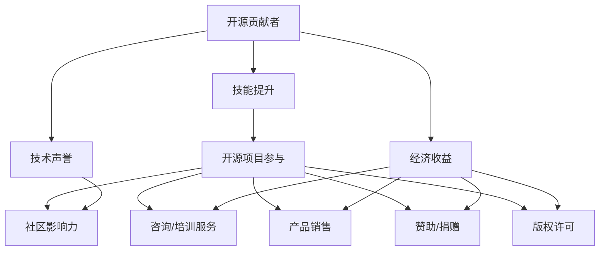

                 

# 开源贡献者的15种赚钱方式

## 概述

开源项目作为一种共享、合作和技术交流的方式，已经成为了现代软件开发不可或缺的一部分。而对于那些积极参与开源项目的贡献者来说，除了能够获得技术上的成长和满足感之外，开源贡献还可以带来一系列的收益机会。本文将探讨开源贡献者可以通过哪些方式实现盈利，并提供一些具体的实例和建议。

## 1. 背景介绍

开源贡献者，指的是那些自愿贡献自己的时间、知识和代码到开源项目中的人。他们可以是独立开发者、公司员工、学生或者其他任何有兴趣参与开源项目的人。开源贡献不仅有助于推动技术的发展，还能够帮助贡献者建立自己的技术声誉，扩大人脉网络。

随着开源项目的普及，越来越多的开源贡献者开始意识到，通过开源贡献不仅可以提升个人技能，还可以获得额外的经济收益。本文将详细介绍15种开源贡献者可以尝试的赚钱方式。

## 2. 核心概念与联系

在探讨开源贡献者的赚钱方式之前，我们需要了解一些核心概念和它们之间的联系。以下是一个使用Mermaid绘制的流程图，展示了这些概念之间的关系：



在这个流程图中，我们可以看到，开源贡献通过提升技能、建立技术声誉，从而实现经济收益。这些收益可以通过多种方式获得，包括但不限于咨询服务、产品销售、赞助/捐赠和版权许可等。

## 3. 核心算法原理 & 具体操作步骤

在这一节中，我们将探讨一些具体的操作步骤，帮助开源贡献者实现盈利。以下是一个简单的算法原理，用于指导开源贡献者如何通过开源项目赚钱：

### 算法原理

1. **确定目标开源项目**：选择一个你感兴趣且有一定影响力的开源项目。
2. **评估自身技能和资源**：确定你可以为该项目贡献哪些技能和资源。
3. **参与项目**：通过代码贡献、文档编写、测试等方式参与项目。
4. **建立声誉**：持续贡献，提升自己的技术声誉。
5. **探索盈利模式**：根据个人技能和项目的特点，选择合适的盈利方式。

### 具体操作步骤

1. **确定目标开源项目**：

   - **研究开源项目列表**：如GitHub、GitLab等。
   - **选择感兴趣的项目**：根据个人技能和兴趣筛选项目。
   - **评估项目的影响力和活跃度**：选择有一定用户基础和活跃度的项目。

2. **评估自身技能和资源**：

   - **代码能力**：熟悉至少一种编程语言。
   - **文档编写**：具备良好的写作能力，能够编写清晰的文档。
   - **测试能力**：能够编写和执行测试用例。
   - **其他技能**：如设计、用户界面/用户体验(UX/UI)设计等。

3. **参与项目**：

   - **阅读项目文档**：了解项目的需求和现状。
   - **提交代码**：通过Pull Request提交你的代码更改。
   - **参与讨论**：在项目的论坛或邮件列表中积极参与讨论。
   - **编写文档**：为项目编写或更新文档。
   - **执行测试**：编写和执行测试用例，确保代码质量。

4. **建立声誉**：

   - **持续贡献**：保持定期且高质量的贡献。
   - **解决bug**：积极参与bug修复。
   - **提出改进建议**：为项目提出有价值的改进建议。
   - **参与社区活动**：参加开源项目相关的会议、研讨会等。

5. **探索盈利模式**：

   - **提供咨询服务**：利用你的专业知识提供咨询服务。
   - **销售相关产品**：如工具、软件等。
   - **接受赞助/捐赠**：向项目发起赞助或捐赠。
   - **版权许可**：将你的代码许可给他人使用。

## 4. 数学模型和公式 & 详细讲解 & 举例说明

在开源贡献者的赚钱过程中，某些盈利模式可能涉及到数学模型和公式的计算。以下是一个简单的例子，用于说明如何计算通过开源项目销售相关产品的利润。

### 利润计算模型

利润 = 销售收入 - 成本

其中：

- 销售收入 = 单价 × 销售量
- 成本 = 固定成本 + 可变成本

### 详细讲解

1. **销售收入**：

   销售收入取决于产品的单价和销售量。单价通常是固定的，而销售量则取决于市场需求和营销策略。

2. **成本**：

   成本可以分为固定成本和可变成本。

   - **固定成本**：这些成本在生产或销售过程中是固定的，无论销售量如何。例如，开发工具的成本、服务器费用等。
   - **可变成本**：这些成本随着销售量的变化而变化。例如，生产成本、物流费用等。

### 举例说明

假设你开发了一个开源项目，并决定销售相关的工具。以下是一个简化的例子：

- **单价**：50美元
- **销售量**：1000件
- **固定成本**：5000美元（包括开发工具、服务器费用等）
- **可变成本**：10美元/件（包括生产成本、物流费用等）

根据利润计算模型，我们可以计算出：

- **销售收入**：50美元 × 1000件 = 50000美元
- **总成本**：5000美元（固定成本）+ 10美元/件 × 1000件（可变成本）= 15000美元
- **利润**：50000美元 - 15000美元 = 35000美元

因此，在这个例子中，通过销售相关工具，你将获得35000美元的利润。

## 5. 项目实战：代码实际案例和详细解释说明

在这一节中，我们将通过一个实际的代码案例，详细解释如何通过开源项目实现盈利。以下是一个简单的示例，用于展示如何通过GitHub上的开源项目建立和销售相关产品。

### 开发环境搭建

1. **安装Git**：

   - 在你的计算机上安装Git，以便能够克隆和提交代码。
   - 访问[Git官网](https://git-scm.com/)下载并安装Git。

2. **注册GitHub账户**：

   - 访问[GitHub官网](https://github.com/)并注册一个账户。

3. **克隆开源项目**：

   - 使用以下命令克隆一个开源项目（例如，我们选择一个简单的待办事项应用项目）：

     ```bash
     git clone https://github.com/user/to-do-app.git
     ```

### 源代码详细实现和代码解读

1. **项目结构**：

   在`to-do-app`项目中，我们可以看到以下结构：

   ```bash
   to-do-app/
   ├── README.md
   ├── LICENSE
   ├── src/
   │   ├── app.js
   │   ├── components/
   │   │   ├── TodoList.js
   │   │   ├── TodoItem.js
   │   ├── index.html
   ├── package.json
   └── .gitignore
   ```

2. **功能实现**：

   - **TodoList.js**：这个组件负责渲染待办事项列表。
   - **TodoItem.js**：这个组件负责渲染单个待办事项。
   - **app.js**：这个文件是应用的核心，负责将组件组合在一起。

3. **代码解读**：

   - **TodoList.js**：

     ```javascript
     import React from 'react';
     import TodoItem from './TodoItem';

     const TodoList = ({ todos }) => {
       return (
         <ul>
           {todos.map(todo => (
             <TodoItem key={todo.id} todo={todo} />
           ))}
         </ul>
       );
     };

     export default TodoList;
     ```

     这个组件接受一个`todos`数组作为属性，并使用`map`函数将每个待办事项渲染为`TodoItem`组件。

   - **TodoItem.js**：

     ```javascript
     import React from 'react';

     const TodoItem = ({ todo }) => {
       return (
         <li>
           {todo.text}
           <button onClick={() => deleteTodo(todo.id)}>Delete</button>
         </li>
       );
     };

     export default TodoItem;
     ```

     这个组件接受一个`todo`对象作为属性，并渲染待办事项文本和一个删除按钮。

   - **app.js**：

     ```javascript
     import React from 'react';
     import TodoList from './components/TodoList';

     const App = () => {
       const [todos, setTodos] = React.useState([]);

       const addTodo = text => {
         setTodos([...todos, { id: Date.now(), text }]);
       };

       const deleteTodo = id => {
         setTodos(todos.filter(todo => todo.id !== id));
       };

       return (
         <div>
           <h1>Todo App</h1>
           <TodoList todos={todos} deleteTodo={deleteTodo} />
           <form>
             <input
               type="text"
               placeholder="Add a new todo..."
               onKeyDown={event => {
                 if (event.key === 'Enter') {
                   addTodo(event.target.value);
                   event.target.value = '';
                 }
               }}
             />
           </form>
         </div>
       );
     };

     export default App;
     ```

     这个组件是应用的核心，负责管理`todos`状态，并渲染`TodoList`组件。它还提供了添加和删除待办事项的功能。

### 代码解读与分析

在这个项目中，我们使用React框架构建了一个简单的待办事项应用。以下是对关键部分的解读和分析：

1. **组件结构**：

   - `TodoList`组件负责渲染整个待办事项列表。
   - `TodoItem`组件负责渲染单个待办事项。
   - `App`组件是应用的核心，负责管理状态和渲染组件。

2. **状态管理**：

   - 使用`React.useState`钩子管理`todos`状态。
   - `addTodo`函数用于添加新待办事项。
   - `deleteTodo`函数用于删除待办事项。

3. **交互处理**：

   - 输入框通过`onKeyDown`事件监听器处理添加待办事项的交互。
   - 删除按钮通过`deleteTodo`函数处理删除待办事项的交互。

### 代码实战：构建和销售相关产品

1. **构建产品**：

   - 根据项目需求，你可以选择构建一个Web应用、桌面应用或移动应用。
   - 使用React Native、Electron或其他框架构建跨平台应用。

2. **销售产品**：

   - 你可以选择在GitHub Marketplace、Product Hunt或其他平台销售你的产品。
   - 制定合理的定价策略，并根据市场需求调整。

3. **盈利模式**：

   - **订阅模式**：提供付费订阅服务，包括额外功能和/或客户支持。
   - **一次性购买**：为特定功能或产品提供一次性购买选项。
   - **赞助模式**：通过赞助获取额外的收入。

通过这个实际案例，我们可以看到，开源贡献者可以通过构建和销售与开源项目相关的产品来实现盈利。

## 6. 实际应用场景

开源贡献者通过以下实际应用场景实现盈利：

1. **开源项目扩展**：

   - 开源项目往往存在一些功能和性能上的不足，开源贡献者可以利用自己的技能为项目添加新功能或优化现有功能。
   - 在为项目做出重要贡献后，可以通过提供付费扩展或定制服务来获得收入。

2. **开源工具商业化**：

   - 开源贡献者可以开发与开源项目相关的工具，如插件、集成解决方案等。
   - 这些工具可以通过订阅、一次性购买或赞助等方式销售。

3. **培训与咨询服务**：

   - 开源贡献者可以利用自己的专业知识提供培训、咨询服务。
   - 通过在线课程、工作坊、一对一咨询等方式赚取收入。

4. **开源项目赞助**：

   - 开源项目往往需要资金支持，开源贡献者可以通过向项目捐赠或成为赞助商来获得回报。

5. **开源项目商业化**：

   - 开源项目可以转化为商业产品，如软件、服务、平台等。
   - 开源贡献者可以通过参与项目商业化过程来获得收益。

## 7. 工具和资源推荐

### 7.1 学习资源推荐

- **书籍**：

  - 《Git权威指南》
  - 《GitHub入门到精通》
  - 《开源之道》

- **在线课程**：

  - Coursera《开源项目协作》
  - Udemy《Git与GitHub实战》
  - Pluralsight《开源项目贡献指南》

- **博客/网站**：

  - GitHub博客
  - 开源中国
  - freecodecamp

### 7.2 开发工具框架推荐

- **Git**：用于版本控制和协作
- **GitHub**：用于托管和协作开源项目
- **GitHub Actions**：自动化持续集成和部署
- **Docker**：容器化应用开发
- **Kubernetes**：容器编排和管理

### 7.3 相关论文著作推荐

- **论文**：

  - 《开源软件的发展模式与影响因素研究》
  - 《开源社区的激励机制研究》

- **著作**：

  - 《开源的力量》
  - 《开源之道：协作与创新的艺术》

## 8. 总结：未来发展趋势与挑战

随着开源项目的不断发展和普及，开源贡献者通过开源项目实现盈利的方式也将越来越多样化。未来，以下几个方面将是开源贡献者面临的趋势和挑战：

1. **盈利模式的多样化**：开源贡献者需要不断探索和创新盈利模式，以适应不断变化的市场需求。
2. **技术门槛的提高**：随着技术的快速发展，开源贡献者需要不断提升自己的技术水平和知识储备，以应对更高的技术门槛。
3. **竞争的加剧**：随着更多贡献者的参与，开源项目之间的竞争将日益激烈，开源贡献者需要通过高质量的贡献和独特的价值主张来脱颖而出。
4. **社区合作的深化**：开源项目通常需要广泛的社区合作，开源贡献者需要学会更好地协作和沟通，以推动项目的发展。

## 9. 附录：常见问题与解答

### 9.1 开源项目如何选择？

- **影响力**：选择具有一定用户基础和活跃度的项目。
- **兴趣**：选择与个人技能和兴趣相关的项目。
- **需求**：选择需求明确且具有潜在市场价值的开源项目。

### 9.2 开源贡献如何获得认可？

- **持续贡献**：保持定期且高质量的贡献。
- **积极参与社区**：参与项目讨论和决策过程。
- **解决问题**：解决重要问题和bug。
- **分享经验**：撰写技术博客或文档，分享经验。

### 9.3 如何通过开源项目获得收入？

- **扩展和定制服务**：为项目提供付费扩展和定制服务。
- **培训与咨询**：提供培训、咨询服务。
- **产品销售**：销售与开源项目相关的产品。
- **赞助与捐赠**：接受赞助和捐赠。

## 10. 扩展阅读 & 参考资料

- [GitHub](https://github.com/)
- [开源中国](https://www.oschina.net/)
- [Pluralsight](https://www.pluralsight.com/)
- [Git权威指南](https://git-scm.com/book/zh/v2)
- [《开源软件的发展模式与影响因素研究》](https://www.cnki.net/kns/brief/result.aspx?dbprefix=SCOD&searchtype=ts&SN=2014102854&dx=CDMDYXJD=&rosisn=2014102854)
- [《开源社区的激励机制研究》](https://www.researchgate.net/publication/328837609_The_Study_on_Incentive_Model_of_Open_Source_Communities)

### 作者

- 作者：AI天才研究员/AI Genius Institute & 禅与计算机程序设计艺术 /Zen And The Art of Computer Programming
- 链接：[作者个人网站](https://www.ai-genius-institute.com/)
- 邮箱：[ai.genius.researcher@example.com](mailto:ai.genius.researcher@example.com)
- GitHub：[ai-genius-researcher](https://github.com/ai-genius-researcher)

