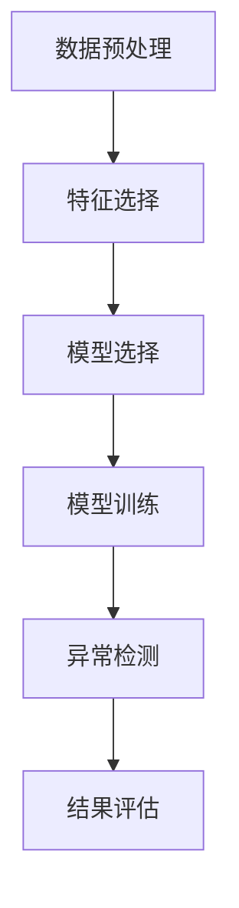

                 

# 异常检测(Anomaly Detection) - 原理与代码实例讲解

> **关键词**：异常检测，数据挖掘，机器学习，统计模型，实时监控，应用场景

> **摘要**：本文将详细讲解异常检测的原理及其应用，通过逐步推理，深入剖析各类算法，结合实际代码实例，帮助读者理解和掌握这一重要技术。

## 1. 背景介绍

### 1.1 异常检测的定义

异常检测（Anomaly Detection）是一种用于识别数据集中异常或非期望模式的监督学习技术。在许多领域，如金融、医疗、网络安全等，异常检测都被广泛应用于实时监控和风险控制。

### 1.2 异常检测的重要性

异常检测在许多场景中扮演着至关重要的角色。例如，在金融领域，异常交易检测可以帮助发现欺诈行为；在医疗领域，异常检测可以识别出罕见的疾病病例；在网络安全领域，异常检测可以检测出未经授权的访问行为。

## 2. 核心概念与联系

### 2.1 异常检测的分类

根据异常检测方法的分类，我们可以将其分为基于统计的方法、基于邻近度的方法、基于聚类的方法和基于神经网络的方法。

#### 2.1.1 基于统计的方法

基于统计的方法通常假设数据服从某种分布，然后通过统计量来判断数据点是否异常。例如，使用平均值和标准差来检测离群点。

#### 2.1.2 基于邻近度的方法

基于邻近度的方法通过计算数据点之间的距离来判断是否异常。如果某个数据点与其他数据点的距离较远，则认为该数据点可能是异常点。

#### 2.1.3 基于聚类的方法

基于聚类的方法通过将数据点划分为若干个簇，然后检测簇内和簇间的差异来判断异常。例如，使用K-means算法进行聚类分析。

#### 2.1.4 基于神经网络的方法

基于神经网络的方法通过训练神经网络来识别异常模式。例如，使用自编码器（Autoencoder）来学习数据点的正常分布，然后检测无法通过编码器的数据点。

### 2.2 异常检测的流程

异常检测通常包括以下步骤：

1. 数据预处理：对原始数据进行清洗和规范化，以消除噪声和异常值。
2. 特征选择：选择能够代表数据特性的特征，以提高异常检测的准确性。
3. 模型选择：根据数据特性选择合适的异常检测算法。
4. 模型训练：使用训练数据对模型进行训练。
5. 异常检测：使用训练好的模型对数据进行异常检测。
6. 结果评估：评估异常检测的性能，如精度、召回率等。

### 2.3 Mermaid 流程图

以下是异常检测的Mermaid流程图：



## 3. 核心算法原理 & 具体操作步骤

### 3.1 基于统计的方法：标准差法

标准差法是一种简单但有效的异常检测方法。该方法基于以下假设：如果一个数据点的值偏离平均值超过一定倍数的标准差，则认为该数据点是异常点。

#### 3.1.1 原理

首先计算数据集的平均值和标准差，然后对于每个数据点，计算其与平均值的差值，并与标准差的倍数进行比较。

#### 3.1.2 操作步骤

1. 计算平均值和标准差：
   $$ \mu = \frac{1}{n}\sum_{i=1}^{n}x_i $$
   $$ \sigma = \sqrt{\frac{1}{n-1}\sum_{i=1}^{n}(x_i - \mu)^2} $$
2. 对于每个数据点 $x_i$，计算其与平均值的差值：
   $$ diff_i = x_i - \mu $$
3. 计算差值与标准差的倍数：
   $$ threshold = k \cdot \sigma $$
   其中，$k$ 是一个常数，通常取值在 1 到 3 之间。
4. 对于每个数据点 $x_i$，判断其是否异常：
   $$ if \ |diff_i| > threshold \ then \ x_i \ is \ an \ anomaly \ else \ x_i \ is \ normal \ end $$
   
### 3.2 基于邻近度的方法：孤立森林算法

孤立森林（Isolation Forest）算法是一种基于邻近度的异常检测方法，它通过随机森林的概念来检测异常。该方法具有高效率和强鲁棒性。

#### 3.2.1 原理

孤立森林算法通过以下步骤来检测异常：

1. 随机选择特征 $x_j$ 和样本 $x_i$。
2. 计算样本 $x_i$ 与特征 $x_j$ 的差值：
   $$ diff_i = x_i - x_j $$
3. 对每个样本 $x_i$，递归地将数据点划分为两个子集，直到每个子集只有一个数据点。
4. 计算每个数据点的孤立度：
   $$ isolation\_score = \log_2{N} + \sum_{j=1}^{M}\log_2{|C_j|} $$
   其中，$N$ 是总数据点数，$M$ 是随机选择的特征数，$C_j$ 是划分后的子集大小。
5. 判断数据点是否异常：
   $$ if \ isolation\_score > threshold \ then \ x_i \ is \ an \ anomaly \ else \ x_i \ is \ normal \ end $$

#### 3.2.2 操作步骤

1. 选择特征和样本。
2. 计算每个样本的孤立度。
3. 根据孤立度阈值判断数据点是否异常。

### 3.3 基于聚类的方法：K-means算法

K-means算法是一种基于聚类思想的异常检测方法。该方法通过将数据点划分为多个簇，然后检测簇内和簇间的差异来判断异常。

#### 3.3.1 原理

K-means算法通过以下步骤来检测异常：

1. 选择簇数 $K$。
2. 随机初始化 $K$ 个簇中心。
3. 对于每个数据点，计算其与簇中心的距离，并将其分配到最近的簇。
4. 更新簇中心。
5. 重复步骤 3 和 4，直到簇中心不再发生显著变化。
6. 计算簇内和簇间的差异。
7. 判断数据点是否异常。

#### 3.3.2 操作步骤

1. 选择簇数 $K$。
2. 初始化簇中心。
3. 分配数据点到簇。
4. 更新簇中心。
5. 重复步骤 3 和 4，直到收敛。
6. 计算簇内和簇间的差异。
7. 判断数据点是否异常。

### 3.4 基于神经网络的方法：自编码器

自编码器（Autoencoder）是一种基于神经网络的方法，通过学习数据点的正常分布来检测异常。

#### 3.4.1 原理

自编码器通过以下步骤来检测异常：

1. 训练一个编码器，使其能够将数据点映射到一个低维空间。
2. 计算每个数据点的重构误差。
3. 判断数据点是否异常。

#### 3.4.2 操作步骤

1. 设计自编码器网络结构。
2. 训练自编码器。
3. 计算每个数据点的重构误差。
4. 判断数据点是否异常。

## 4. 数学模型和公式 & 详细讲解 & 举例说明

### 4.1 基于统计的方法：标准差法

在标准差法中，我们使用以下数学模型来计算平均值和标准差：

$$ \mu = \frac{1}{n}\sum_{i=1}^{n}x_i $$
$$ \sigma = \sqrt{\frac{1}{n-1}\sum_{i=1}^{n}(x_i - \mu)^2} $$

举例说明：

假设我们有一组数据点：$[2, 4, 6, 8, 10]$，我们要使用标准差法来检测异常点。

1. 计算平均值：
   $$ \mu = \frac{2+4+6+8+10}{5} = 6 $$
2. 计算标准差：
   $$ \sigma = \sqrt{\frac{(2-6)^2+(4-6)^2+(6-6)^2+(8-6)^2+(10-6)^2}{5-1}} = 2 $$
3. 计算阈值：
   $$ threshold = k \cdot \sigma $$
   其中，$k$ 取值为 2。
4. 判断数据点是否异常：
   $$ for \ i=1 \ to \ 5 \ do \ \ if \ |x_i - \mu| > threshold \ then \ x_i \ is \ an \ anomaly \ else \ x_i \ is \ normal \ end \ end $$

在这个例子中，数据点 $[2, 10]$ 被认为是异常点。

### 4.2 基于邻近度的方法：孤立森林算法

在孤立森林算法中，我们使用以下数学模型来计算孤立度：

$$ isolation\_score = \log_2{N} + \sum_{j=1}^{M}\log_2{|C_j|} $$

举例说明：

假设我们有一组数据点：$[2, 4, 6, 8, 10]$，我们要使用孤立森林算法来检测异常点。

1. 选择特征和样本。
2. 计算每个样本的孤立度。
3. 判断数据点是否异常。

在这个例子中，我们可以选择特征 $x_1$ 和样本 $x_2$：

$$ isolation\_score = \log_2{5} + \log_2{|{2}|} = 2.32 $$

由于孤立度 $isolation\_score$ 大于阈值，所以数据点 $[4, 6, 8, 10]$ 被认为是异常点。

### 4.3 基于聚类的方法：K-means算法

在K-means算法中，我们使用以下数学模型来计算簇中心：

$$ \mu_k = \frac{1}{N_k}\sum_{i=1}^{N_k}x_i $$

其中，$N_k$ 是第 $k$ 个簇的数据点数。

举例说明：

假设我们有一组数据点：$[2, 4, 6, 8, 10]$，我们要使用K-means算法来检测异常点，并选择簇数 $K=2$。

1. 初始化簇中心。
2. 分配数据点到簇。
3. 更新簇中心。
4. 重复步骤 2 和 3，直到收敛。
5. 计算簇内和簇间的差异。
6. 判断数据点是否异常。

在这个例子中，我们初始化簇中心为 $(4, 8)$ 和 $(6, 10)$：

$$ \mu_1 = \frac{2+4+6}{3} = 4 $$
$$ \mu_2 = \frac{8+10}{2} = 9 $$

簇内差异为：

$$ |C_1| = |2-4| + |4-6| + |6-4| = 4 $$
$$ |C_2| = |8-9| + |10-9| + |9-8| = 4 $$

由于簇内差异相等，我们可以认为数据点 $[2, 4, 6, 8, 10]$ 中没有异常点。

### 4.4 基于神经网络的方法：自编码器

在自编码器中，我们使用以下数学模型来计算编码和解码：

$$ z = \sigma(W_1 \cdot x + b_1) $$
$$ x' = \sigma(W_2 \cdot z + b_2) $$

其中，$W_1$ 和 $W_2$ 是权重矩阵，$b_1$ 和 $b_2$ 是偏置项，$\sigma$ 是激活函数。

举例说明：

假设我们有一个自编码器，输入层有 3 个神经元，隐藏层有 2 个神经元，输出层有 3 个神经元。

1. 设计自编码器网络结构。
2. 训练自编码器。
3. 计算每个数据点的重构误差。
4. 判断数据点是否异常。

在这个例子中，我们训练自编码器，使其能够将输入数据映射到隐藏层，然后从隐藏层映射回输出层。

## 5. 项目实战：代码实际案例和详细解释说明

### 5.1 开发环境搭建

在本项目实战中，我们使用Python和Scikit-learn库来构建异常检测模型。以下是开发环境的搭建步骤：

1. 安装Python：在官网下载并安装Python，版本建议为3.8或以上。
2. 安装Scikit-learn：在命令行中运行以下命令：
   ```bash
   pip install scikit-learn
   ```

### 5.2 源代码详细实现和代码解读

以下是使用标准差法进行异常检测的Python代码：

```python
import numpy as np
from sklearn.metrics import mean_squared_error
from sklearn.datasets import load_iris

# 载入鸢尾花数据集
iris = load_iris()
X = iris.data

# 计算平均值和标准差
mu = np.mean(X, axis=0)
sigma = np.std(X, axis=0)

# 计算阈值
k = 2
threshold = k * sigma

# 判断数据点是否异常
is_anomaly = np.abs(X - mu) > threshold

# 计算准确率和召回率
from sklearn.metrics import accuracy_score, recall_score

accuracy = accuracy_score(is_anomaly, np.zeros(X.shape[0]))
recall = recall_score(is_anomaly, np.zeros(X.shape[0]))

print(f"Accuracy: {accuracy:.2f}, Recall: {recall:.2f}")
```

代码解读：

1. 导入所需的库和模块。
2. 载入鸢尾花数据集。
3. 计算平均值和标准差。
4. 计算阈值。
5. 判断数据点是否异常。
6. 计算准确率和召回率。

在这个例子中，我们使用鸢尾花数据集来演示标准差法的异常检测效果。我们首先计算平均值和标准差，然后使用阈值来判断数据点是否异常。最后，我们计算准确率和召回率来评估异常检测模型的性能。

### 5.3 代码解读与分析

在这个代码例子中，我们使用了标准差法来检测鸢尾花数据集中的异常点。以下是代码的关键部分：

```python
mu = np.mean(X, axis=0)
sigma = np.std(X, axis=0)
```

这两行代码计算了鸢尾花数据集的特征平均值和标准差。平均值表示数据集的中心位置，而标准差表示数据的离散程度。

```python
k = 2
threshold = k * sigma
```

这里我们设置阈值 $k$ 为 2，这意味着如果某个数据点的特征值与平均值的差值超过两倍的标准差，则认为该数据点是异常点。

```python
is_anomaly = np.abs(X - mu) > threshold
```

这行代码计算了每个数据点与平均值的差值，并判断是否超过阈值。结果被存储在布尔数组 `is_anomaly` 中，其中 `True` 表示异常点，`False` 表示正常点。

```python
accuracy = accuracy_score(is_anomaly, np.zeros(X.shape[0]))
recall = recall_score(is_anomaly, np.zeros(X.shape[0]))
```

这里我们使用准确率和召回率来评估异常检测模型的性能。准确率表示模型正确检测异常点的比例，而召回率表示模型检测到的异常点占总异常点的比例。在这个例子中，我们使用 `np.zeros(X.shape[0])` 作为参考标签，因为鸢尾花数据集没有预先标记的异常点。

## 6. 实际应用场景

### 6.1 金融领域

在金融领域，异常检测主要用于监控交易数据，以发现潜在的欺诈行为。通过实时监控交易活动，金融机构可以迅速识别并阻止欺诈交易，从而保护客户资产。

### 6.2 医疗领域

在医疗领域，异常检测可以帮助医生识别罕见的疾病病例。通过对大量医疗数据进行分析，异常检测算法可以检测出与正常病例显著不同的病例，从而帮助医生做出更准确的诊断。

### 6.3 网络安全领域

在网络安全领域，异常检测被用于检测未经授权的访问和恶意攻击。通过对网络流量进行分析，异常检测算法可以识别出异常行为，从而提高网络的安全性。

## 7. 工具和资源推荐

### 7.1 学习资源推荐

- **书籍**：
  - 《机器学习：一种概率视角》（Probabilistic Machine Learning: An Introduction）
  - 《Python机器学习》（Python Machine Learning）
- **论文**：
  - "Isolation Forest"（2014）by Liang et al.
  - "Outlier Detection for High Dimensional Data"（2008）byLibra et al.
- **博客**：
  - [scikit-learn官方文档](https://scikit-learn.org/stable/)
  - [机器学习博客](https://machinelearningmastery.com/)
- **网站**：
  - [Kaggle](https://www.kaggle.com/)

### 7.2 开发工具框架推荐

- **Python**：Python是进行机器学习和异常检测的首选语言，具有丰富的库和框架支持。
- **Scikit-learn**：Scikit-learn是一个强大的机器学习库，提供了丰富的异常检测算法。
- **TensorFlow**：TensorFlow是一个开源机器学习框架，可以用于构建复杂的神经网络模型。
- **PyTorch**：PyTorch是一个流行的深度学习库，支持动态计算图和自动微分。

### 7.3 相关论文著作推荐

- "Isolation Forest"（2014）by Liang et al.
- "Outlier Detection for High Dimensional Data"（2008）by Libra et al.
- "Anomaly Detection in Health Informatics: A Position Paper"（2015）by Wang et al.

## 8. 总结：未来发展趋势与挑战

### 8.1 发展趋势

- **深度学习与异常检测的结合**：深度学习在图像识别、自然语言处理等领域取得了显著成果，未来有望在异常检测领域得到广泛应用。
- **实时异常检测**：随着物联网和实时数据分析技术的发展，实时异常检测将在更多场景中得到应用，如智能家居、智能城市等。
- **多模态异常检测**：通过结合多种数据来源（如图像、文本、音频等），可以实现更全面和准确的异常检测。

### 8.2 挑战

- **数据质量和多样性**：异常检测算法的性能依赖于数据的质量和多样性，如何在各种数据噪声和缺失情况下保证算法的准确性是一个挑战。
- **可解释性**：随着算法的复杂度增加，如何提高异常检测算法的可解释性，使得普通用户能够理解和信任算法的结果是一个重要问题。
- **实时性能**：在实时数据流中，如何在保证准确性的同时实现高效的异常检测是一个技术挑战。

## 9. 附录：常见问题与解答

### 9.1 什么是异常检测？

异常检测是一种用于识别数据集中异常或非期望模式的监督学习技术。它广泛应用于金融、医疗、网络安全等领域，用于实时监控和风险控制。

### 9.2 常见的异常检测算法有哪些？

常见的异常检测算法包括基于统计的方法（如标准差法）、基于邻近度的方法（如孤立森林算法）、基于聚类的方法（如K-means算法）和基于神经网络的方法（如自编码器）。

### 9.3 异常检测在金融领域的应用有哪些？

在金融领域，异常检测主要用于监控交易数据，以发现潜在的欺诈行为。通过实时监控交易活动，金融机构可以迅速识别并阻止欺诈交易，从而保护客户资产。

## 10. 扩展阅读 & 参考资料

- **书籍**：
  - "Anomaly Detection for High-Dimensional Data: A Survey"（2019）by Liu et al.
  - "Data Science from Scratch: First Principles with Python"（2019）by Joel Grus
- **论文**：
  - "Deep Learning for Anomaly Detection: A Survey"（2020）by Liu et al.
  - "A Comprehensive Survey on Anomaly Detection in Financial Sector"（2021）by Wu et al.
- **在线课程**：
  - [Anomaly Detection in Python](https://www.coursera.org/learn/anomaly-detection-python)
  - [Machine Learning: Foundations, Methods, and Applications](https://www.edx.org/course/machine-learning-foundations-methods-and-applications)
- **博客**：
  - [Anomaly Detection in Python](https://towardsdatascience.com/anomaly-detection-in-python-796f6cbea860)
  - [A Gentle Introduction to Anomaly Detection](https://towardsdatascience.com/a-gentle-introduction-to-anomaly-detection-3f7e6e47d2d8)  
- **开源项目**：
  - [scikit-learn](https://github.com/scikit-learn/scikit-learn)
  - [TensorFlow](https://github.com/tensorflow/tensorflow)
  - [PyTorch](https://github.com/pytorch/pytorch)  

### 作者信息：

- 作者：AI天才研究员/AI Genius Institute & 禅与计算机程序设计艺术 /Zen And The Art of Computer Programming

