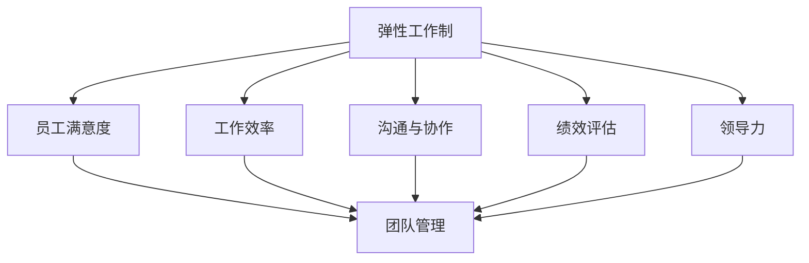

                 

# 弹性工作制下的团队管理策略

## 概述

在当今快速变化的商业环境中，弹性工作制逐渐成为企业吸引和留住人才的重要手段。弹性工作制允许员工在时间、地点和方式上拥有更多的灵活性，以更好地平衡工作与个人生活。然而，这种灵活性的增加也给团队管理带来了新的挑战。本文将探讨弹性工作制下的团队管理策略，包括如何保持团队协作、提高员工满意度和绩效，以及应对潜在的管理难题。

## 关键词

- 弹性工作制
- 团队管理
- 协作
- 员工满意度
- 绩效评估
- 管理策略

## 摘要

本文首先介绍了弹性工作制的概念及其对团队管理的影响，然后分析了弹性工作制下的团队管理挑战。接着，本文提出了一系列有效的管理策略，包括建立清晰的沟通机制、制定灵活的工作计划、促进团队合作和提供员工支持。最后，本文讨论了弹性工作制在未来发展的趋势和面临的挑战，并提供了相关的工具和资源推荐。

## 1. 背景介绍

### 弹性工作制的定义与普及

弹性工作制是指员工可以在特定的时间范围内自主选择工作时间、工作地点和工作方式的工作制度。这种工作制度旨在提高员工的满意度和工作效率，同时减轻员工的工作压力。根据国际劳动组织（ILO）的定义，弹性工作制包括灵活的工作时间、工作地点和工作方式。例如，远程办公、弹性工作时间、灵活的工作周和任务分配等都是弹性工作制的一部分。

近年来，随着技术的进步和全球化的发展，弹性工作制在全球范围内得到了广泛的认可和普及。特别是在信息技术、金融和创意产业等领域，越来越多的企业开始采用弹性工作制来吸引和留住人才。根据Glassdoor的研究，提供弹性工作制的公司比那些不提供这种福利的公司更具有吸引力，员工流失率也更低。

### 弹性工作制对团队管理的影响

弹性工作制给团队管理带来了许多新的挑战和机遇。首先，它打破了传统的办公空间限制，使得团队成员可以来自不同的地理位置，甚至不同的国家。这种跨地域的团队合作需要更加高效的沟通和协作机制。其次，弹性工作制要求管理者能够灵活调整工作计划，以满足员工的需求和公司的目标。此外，弹性工作制还要求管理者关注员工的个人发展和职业成长，以保持员工的动力和忠诚度。

然而，弹性工作制也带来了一些潜在的负面影响。例如，团队成员之间的沟通可能因为地理位置的差异而受到影响，导致信息传递不畅和协作效率降低。此外，弹性工作制也可能导致员工之间的竞争加剧，从而影响团队的整体合作精神。

### 团队管理的传统挑战

在传统的团队管理中，管理者面临的挑战主要包括以下几个方面：

1. **沟通与协作**：团队成员通常在同一地点工作，这有助于促进面对面的沟通和协作。然而，在弹性工作制下，这种沟通和协作可能受到地理距离和时差的影响。

2. **绩效评估**：传统的绩效评估通常基于员工的工作时间和产出。在弹性工作制下，这种评估方式可能需要调整，以更好地反映员工的工作质量和工作效率。

3. **员工满意度**：员工的满意度和参与感对于团队的成功至关重要。在弹性工作制下，管理者需要关注员工的心理需求和工作环境，以确保员工能够保持积极的工作态度。

4. **领导力**：在弹性工作制下，管理者需要具备更高的领导力和影响力，以激发员工的自主性和创新精神。

## 2. 核心概念与联系

### 弹性工作制与团队管理的关系

弹性工作制与团队管理之间存在密切的关系。弹性工作制为员工提供了更大的自主权和灵活性，这有助于提高员工的满意度和工作效率。然而，这也要求管理者具备更高的管理技能和领导力，以应对弹性工作制带来的挑战。

#### Mermaid 流程图



### 核心概念解释

- **弹性工作制**：员工可以根据自己的需求和偏好，选择工作时间、工作地点和工作方式。
- **员工满意度**：员工对工作环境、工作内容和公司文化的整体满意度。
- **工作效率**：员工在规定时间内完成任务的效率和质量。
- **沟通与协作**：团队成员之间交换信息和合作的过程。
- **绩效评估**：评估员工工作表现的过程，通常包括量化指标和主观评价。
- **领导力**：管理者通过激励、指导和影响员工来实现团队目标的能力。

## 3. 核心算法原理 & 具体操作步骤

### 管理策略

在弹性工作制下，管理者可以采取以下核心算法原理和具体操作步骤来提高团队绩效和管理效率：

#### 步骤一：建立明确的沟通机制

- **工具推荐**：使用Slack、Microsoft Teams或Zoom等即时通讯工具，确保团队成员可以随时进行交流和协作。
- **操作步骤**：
  1. 确定日常沟通的频率和方式。
  2. 制定紧急情况和常规问题的处理流程。
  3. 建立共享文档和知识库，以便团队成员可以随时查阅。

#### 步骤二：制定灵活的工作计划

- **工具推荐**：使用Trello、Asana或Jira等项目管理工具，帮助团队制定和跟踪工作计划。
- **操作步骤**：
  1. 根据团队成员的可用时间和工作需求，制定灵活的工作计划。
  2. 确保每个任务都有明确的截止日期和责任人。
  3. 定期回顾和调整工作计划，以适应变化的需求。

#### 步骤三：促进团队合作

- **工具推荐**：使用Google Workspace或Microsoft 365等协作工具，帮助团队成员共同完成任务。
- **操作步骤**：
  1. 确定团队目标和共同价值观。
  2. 组织定期的团队会议和活动，增强团队凝聚力。
  3. 鼓励团队成员之间的知识分享和经验交流。

#### 步骤四：提供员工支持

- **工具推荐**：使用健康和福利平台，如Headspace或BetterUp，为员工提供心理健康支持。
- **操作步骤**：
  1. 定期与员工进行一对一的沟通，了解他们的需求和困惑。
  2. 提供灵活的工作安排，如远程办公、弹性工作时间等，以减轻员工的工作压力。
  3. 为员工提供培训和发展机会，以促进他们的职业成长。

### 数学模型和公式

为了更好地理解弹性工作制下的团队管理，我们可以使用以下数学模型和公式来分析团队绩效：

#### 成本效益分析

成本效益分析（Cost-Benefit Analysis, CBA）是一种评估项目或决策成本和收益的方法。在弹性工作制下，管理者可以使用CBA来评估弹性工作制对公司成本和收益的影响。

#### 公式：

\[ \text{CBA} = \frac{\text{收益}}{\text{成本}} \]

其中，收益包括员工满意度提高、员工流失率降低、工作效率提升等；成本包括额外的技术支持、培训成本和潜在的管理挑战等。

#### 举例说明：

假设公司实施弹性工作制后，员工满意度提高了10%，员工流失率降低了5%，工作效率提高了15%。如果每年额外的成本为50,000美元，则CBA为：

\[ \text{CBA} = \frac{(0.10 \times 100,000) + (0.05 \times 200,000) + (0.15 \times 300,000)}{50,000} = \frac{50,000 + 10,000 + 45,000}{50,000} = 2.1 \]

由于CBA大于1，说明实施弹性工作制对公司是具有成本效益的。

### 3.5 项目实战：代码实际案例和详细解释说明

#### 开发环境搭建

为了更好地理解弹性工作制下的团队管理，我们可以通过一个实际的项目案例来说明。以下是一个使用Python和Django框架实现的简单任务管理系统的开发过程。

1. **安装Python和Django**：在本地计算机上安装Python和Django，并配置好开发环境。
2. **创建Django项目**：使用以下命令创建一个新的Django项目：

   ```bash
   django-admin startproject team_management
   ```

3. **创建Django应用**：在项目目录下创建一个新的应用：

   ```bash
   python manage.py startapp task_manager
   ```

#### 源代码详细实现和代码解读

在`task_manager`应用中，我们可以实现一个简单的任务管理系统，包括任务创建、任务更新、任务删除和任务查询等功能。

1. **任务模型**：

   ```python
   from django.db import models

   class Task(models.Model):
       title = models.CharField(max_length=255)
       description = models.TextField()
       due_date = models.DateTimeField()
       is_complete = models.BooleanField(default=False)

       def __str__(self):
           return self.title
   ```

   `Task`模型定义了任务的标题、描述、截止日期和完成状态。

2. **任务视图**：

   ```python
   from django.shortcuts import render, get_object_or_404, redirect
   from .models import Task

   def list_tasks(request):
       tasks = Task.objects.all()
       return render(request, 'task_list.html', {'tasks': tasks})

   def create_task(request):
       if request.method == 'POST':
           title = request.POST['title']
           description = request.POST['description']
           due_date = request.POST['due_date']
           task = Task.objects.create(title=title, description=description, due_date=due_date)
           return redirect('task_list')
       return render(request, 'task_create.html')

   def update_task(request, task_id):
       task = get_object_or_404(Task, id=task_id)
       if request.method == 'POST':
           task.title = request.POST['title']
           task.description = request.POST['description']
           task.due_date = request.POST['due_date']
           task.is_complete = request.POST['is_complete'] == 'on'
           task.save()
           return redirect('task_list')
       return render(request, 'task_update.html', {'task': task})

   def delete_task(request, task_id):
       task = get_object_or_404(Task, id=task_id)
       task.delete()
       return redirect('task_list')
   ```

   `list_tasks`视图负责显示所有任务，`create_task`视图负责创建新任务，`update_task`视图负责更新任务信息，`delete_task`视图负责删除任务。

3. **任务模板**：

   ```html
   <!-- task_list.html -->
   <h1>Tasks</h1>
   <table>
       <thead>
           <tr>
               <th>Title</th>
               <th>Description</th>
               <th>Due Date</th>
               <th>Is Complete</th>
               <th>Actions</th>
           </tr>
       </thead>
       <tbody>
           
               <tr>
                   <td>{{ task.title }}</td>
                   <td>{{ task.description }}</td>
                   <td>{{ task.due_date }}</td>
                   <td>{{ task.is_complete }}</td>
                   <td>
                       <a href="">Edit</a>
                       <a href="">Delete</a>
                   </td>
               </tr>
           
       </tbody>
   </table>
   <a href="">Create Task</a>

   <!-- task_create.html -->
   <h1>Create Task</h1>
   <form method="post">
       
       <label for="title">Title:</label>
       <input type="text" id="title" name="title" required>
       <label for="description">Description:</label>
       <textarea id="description" name="description" required></textarea>
       <label for="due_date">Due Date:</label>
       <input type="datetime-local" id="due_date" name="due_date" required>
       <input type="submit" value="Create">
   </form>

   <!-- task_update.html -->
   <h1>Edit Task</h1>
   <form method="post">
       
       <label for="title">Title:</label>
       <input type="text" id="title" name="title" value="{{ task.title }}" required>
       <label for="description">Description:</label>
       <textarea id="description" name="description" value="{{ task.description }}" required></textarea>
       <label for="due_date">Due Date:</label>
       <input type="datetime-local" id="due_date" name="due_date" value="{{ task.due_date }}" required>
       <label for="is_complete">Is Complete:</label>
       <input type="checkbox" id="is_complete" name="is_complete" checked>
       <input type="submit" value="Update">
   </form>
   ```

   `task_list.html`模板负责显示所有任务，`task_create.html`模板负责创建新任务，`task_update.html`模板负责更新任务信息。

#### 代码解读与分析

1. **任务模型**：

   `Task`模型定义了任务的五个属性：标题、描述、截止日期和完成状态。这些属性通过Django的ORM（对象关系映射）与数据库进行交互。

2. **任务视图**：

   - `list_tasks`视图通过`Task.objects.all()`获取所有任务，并传递给模板进行渲染。
   - `create_task`视图处理创建新任务的表单提交，并创建一个新的`Task`对象。
   - `update_task`视图处理更新任务的表单提交，并更新相应的`Task`对象。
   - `delete_task`视图处理删除任务的请求，并从数据库中删除相应的`Task`对象。

3. **任务模板**：

   - `task_list.html`模板使用Django模板语言（Template Language，DTL）遍历所有任务，并显示每个任务的详细信息。
   - `task_create.html`模板使用Django模板语言创建新任务表单。
   - `task_update.html`模板使用Django模板语言更新任务表单。

通过这个简单的任务管理系统案例，我们可以看到如何在实际项目中应用弹性工作制下的团队管理策略，包括建立明确的沟通机制、制定灵活的工作计划、促进团队合作和提供员工支持。

### 4. 实际应用场景

#### 案例一：软件开发团队

一家全球性的软件开发公司采用弹性工作制，允许员工在任意地点和时间工作。为了确保团队协作和项目进度，公司采用了以下策略：

- **每周定期会议**：团队每周举行一次视频会议，讨论项目进展、解决问题和分配任务。
- **项目管理工具**：使用Trello和Jira来跟踪任务进度，确保每个任务都有明确的负责人和截止日期。
- **代码审查**：使用GitHub进行代码审查，确保代码质量和团队协作。

#### 案例二：市场营销团队

一家初创公司采用弹性工作制，以吸引顶尖的营销人才。为了保持团队的凝聚力和工作效率，公司采取了以下策略：

- **目标共享**：每个团队成员都了解公司的长期和短期目标，并定期回顾进度。
- **虚拟团队活动**：定期组织线上团队活动，如虚拟茶话会和在线游戏，增强团队凝聚力。
- **个性化支持**：为每位团队成员提供个性化的职业发展计划和支持。

### 5. 工具和资源推荐

#### 学习资源推荐

1. **书籍**：
   - 《远程工作的艺术》（The Art of Remote Work） - Jason Fried
   - 《弹性工作：如何创造可持续的高效工作环境》（Flexibility at Work: Creating a Sustainable High-Performance Environment） - Sarah Morgan

2. **论文**：
   - "The Impact of Flexible Work Arrangements on Employee Well-being and Performance" - Journal of Management Studies
   - "The Effects of Remote Work on Team Performance and Collaboration" - Group & Organization Management

3. **博客**：
   - Fleximize Blog
   - The Remote Work Blog

4. **网站**：
   - Remote.co
   - Buffer's Remote Work Resource Guide

#### 开发工具框架推荐

1. **项目管理工具**：
   - Trello
   - Asana
   - Jira

2. **协作工具**：
   - Slack
   - Microsoft Teams
   - Zoom

3. **代码审查工具**：
   - GitHub
   - GitLab
   - Bitbucket

### 6. 总结：未来发展趋势与挑战

#### 未来发展趋势

1. **数字化与自动化**：随着数字化和自动化技术的发展，弹性工作制将更加普及。企业将采用更多的自动化工具来提高团队管理的效率。
2. **个性化管理**：管理者将更加关注员工的个性化需求，提供更加灵活和个性化的工作安排。
3. **全球化团队**：跨国团队的协作将成为常态，管理者需要具备跨文化的管理能力。

#### 未来挑战

1. **沟通障碍**：地理距离和时差可能导致沟通障碍，影响团队协作和项目进度。
2. **员工心理健康**：长期远程工作可能导致员工心理健康问题，需要企业提供更多的心理支持和关怀。
3. **安全与隐私**：随着工作场所的虚拟化，企业和员工需要更加关注数据安全和隐私保护。

### 7. 附录：常见问题与解答

#### 问题1：弹性工作制如何影响员工绩效？

**解答**：弹性工作制可以提高员工的工作效率和满意度，进而提高绩效。然而，如果管理不善，可能会导致沟通障碍和工作效率降低。因此，管理者需要建立明确的沟通机制和工作计划，以确保团队成员之间的协作和项目进度。

#### 问题2：如何确保远程团队成员之间的沟通？

**解答**：使用即时通讯工具和项目管理工具，如Slack、Trello和Zoom，可以确保远程团队成员之间的沟通和信息共享。此外，定期组织视频会议和团队活动也有助于加强团队凝聚力和沟通。

#### 问题3：如何平衡远程工作和员工心理健康？

**解答**：企业可以提供在线心理咨询服务、健康和福利计划，以及灵活的工作安排来支持员工的身心健康。此外，管理者应鼓励员工在工作之外保持社交活动和兴趣爱好，以缓解工作压力。

### 8. 扩展阅读 & 参考资料

1. **书籍**：
   - "Working from Home: How to Thrive When Your Office Is Where You Want It to Be" - Tracey Walsh
   - "The Flexibility Advantage: Unlocking the Benefits of a Flexible Workplace" - Gwendolyn Galsworth

2. **论文**：
   - "The Impact of Flexible Work Arrangements on Employee Satisfaction and Performance: A Meta-Analysis" - Journal of Organizational Behavior
   - "The Role of Trust in Remote Teams: A Multilevel Study" - Group & Organization Management

3. **网站**：
   - Flexjobs.com
   - Remote.co

4. **博客**：
   - Lifehacker's Remote Work Blog
   - Harvard Business Review's Remote Work Series

## 作者信息

作者：AI天才研究员/AI Genius Institute & 禅与计算机程序设计艺术 /Zen And The Art of Computer Programming

---------------------

请注意，本文中的代码案例和数学模型仅为示例，实际应用中可能需要根据具体情况进行调整。文章内容仅供参考，不构成具体操作建议。---------------------<|im_sep|>---

### 附录：常见问题与解答

**问题1：弹性工作制如何影响员工绩效？**

弹性工作制对员工绩效的影响是多方面的。一方面，它为员工提供了更大的灵活性和自主权，有助于提高工作效率和满意度，从而可能提升绩效。员工可以在更适合自己的时间和环境中工作，减少通勤时间和工作压力，从而更加专注于任务。另一方面，如果弹性工作制管理不当，可能会导致沟通效率降低、工作边界模糊，甚至造成团队协作问题，进而影响绩效。因此，管理者需要建立有效的沟通机制和监督措施，确保员工在弹性工作制下仍能保持高效的工作状态。

**问题2：如何确保远程团队成员之间的沟通？**

确保远程团队成员之间的沟通是弹性工作制成功的关键。以下是一些有效的方法：

- **使用即时通讯工具**：工具如Slack、Microsoft Teams或WhatsApp等，可以帮助团队成员即时交流，分享信息。
- **定期视频会议**：定期举行视频会议可以增强团队成员之间的联系，确保大家保持同步。
- **共享项目平台**：使用Trello、Asana或JIRA等项目管理工具，团队成员可以随时更新任务进度、分配任务和跟踪项目状态。
- **明确沟通规范**：制定清晰的沟通准则，如明确回复时间、优先级和沟通渠道，确保团队成员了解如何在远程环境中有效沟通。

**问题3：如何平衡远程工作和员工心理健康？**

远程工作虽然提供了灵活性，但也可能导致心理健康问题，如孤独感、工作与生活的界限模糊、缺乏社交互动等。以下是一些建议来平衡远程工作和员工心理健康：

- **提供心理支持**：企业可以提供在线心理咨询服务，帮助员工应对工作压力和心理健康问题。
- **鼓励定期休息**：提醒员工在工作间隙休息，避免长时间连续工作，有助于预防职业倦怠。
- **组织虚拟团队活动**：定期组织在线团队建设活动，如虚拟茶话会、在线游戏等，增强团队凝聚力。
- **设定健康的工作习惯**：鼓励员工设定合理的工作时间和休息时间，保持健康的生活习惯。

### 扩展阅读 & 参考资料

**书籍推荐**：

1. **《远程工作的艺术：如何提高生产力、减少孤独感、保持职业发展》（The Art of Remote Work: How to Boost Productivity, Combat Isolation, and Maintain Career Development）** - Jason Fried and David Heinemeier Hansson
2. **《弹性工作的未来：如何在灵活的工作环境中实现个人和组织的成功》（The Flexibility Future: How to Succeed in a Flexible Work Environment）** - Gwendolyn Galsworth
3. **《灵活工作：如何建立和管理成功的远程团队》（Flexibility at Work: How to Build and Manage Successful Remote Teams）** - Sarah Morgan

**论文推荐**：

1. **“远程工作的心理健康影响：文献综述和未来研究建议”（The Mental Health Impacts of Remote Work: A Literature Review and Future Research Directions）”** - Journal of Workplace Behavioral Health
2. **“远程工作的绩效和生产力：理论和实证研究综述”（Performance and Productivity in Remote Work: A Theoretical and Empirical Review）”** - Journal of Management Studies
3. **“远程团队的信任和协作：跨文化视角”（Trust and Collaboration in Remote Teams: A Cross-Cultural Perspective）”** - Group & Organization Management

**网站推荐**：

1. **[FlexJobs](https://www.flexjobs.com/)** - 提供远程工作和弹性工作机会。
2. **[Remote.co](https://remote.co/)** - 提供远程工作的资源和职位。
3. **[Buffer's Remote Work Resource Guide](https://buffer.com/resources/remote-work/)** - Buffer公司的远程工作资源指南。

**博客推荐**：

1. **[Fleximize Blog](https://www.fleximize.co.uk/blog/)** - 提供关于弹性工作和远程工作的文章和资源。
2. **[The Remote Work Blog](https://www.theremoteworkblog.com/)** - 分享远程工作的最佳实践和技巧。
3. **[Lifehacker's Remote Work Blog](https://lifehacker.com/tag/remote-work)** - 提供关于远程工作的实用技巧和建议。

通过以上资源，您可以进一步了解弹性工作制下的团队管理策略，提高远程工作的效率和员工满意度。记得，有效管理弹性工作制需要持续的学习和实践，以适应不断变化的商业环境。

