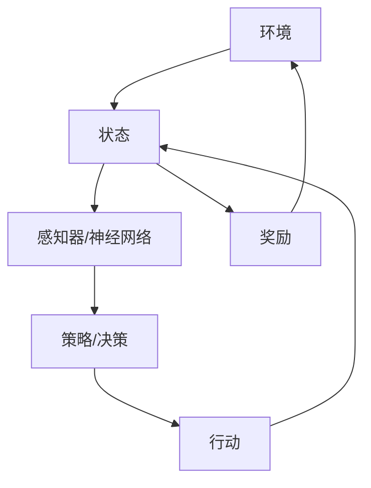
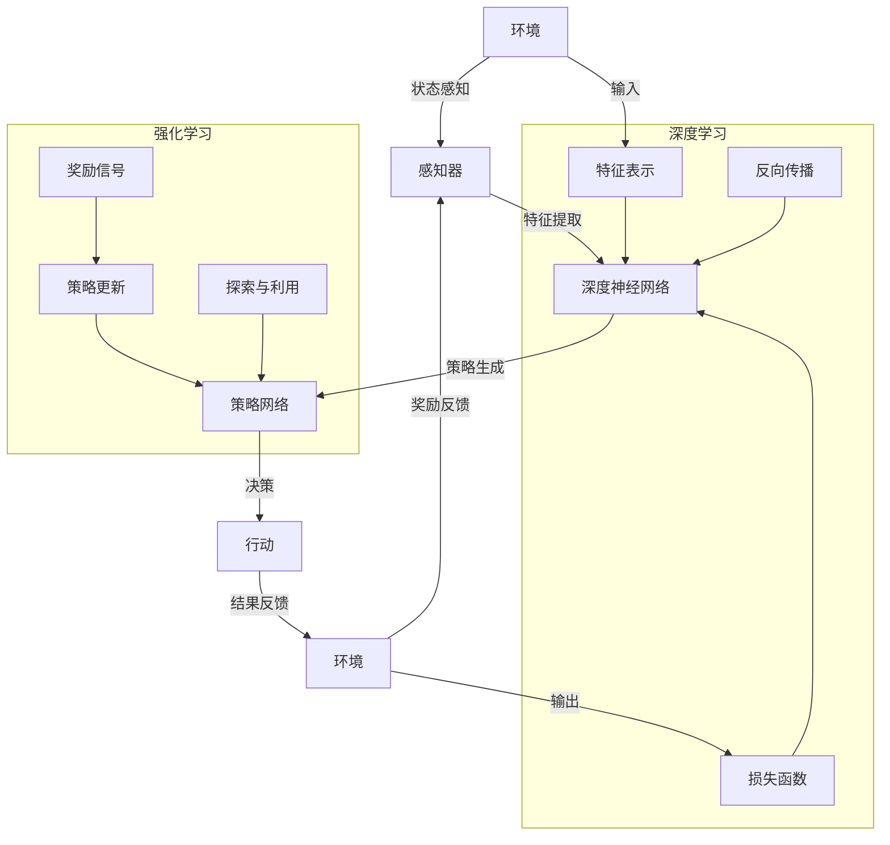

                 

### 背景介绍

强化学习（Reinforcement Learning，RL）和深度学习（Deep Learning，DL）是近年来人工智能领域两大重要的研究方向。强化学习是一种通过与环境交互来学习如何达成目标的方法，其核心在于决策过程中的奖励和惩罚机制，从而调整策略以实现最大化累积奖励。深度学习则是一种通过多层神经网络模型来提取特征并进行复杂模式识别的技术，其优势在于能够处理大规模数据和复杂的任务。

尽管强化学习和深度学习在目标和方法上有所不同，但两者在实际应用中却经常相互结合，以发挥各自的优势，提高学习效果。这种结合的出现并非偶然，而是因为二者在解决问题的过程中各有千秋，互补性强。

首先，强化学习能够处理动态环境中的决策问题，能够通过与环境不断交互来学习最优策略。然而，传统强化学习算法往往需要大量的交互次数来收敛，且在复杂环境中表现不佳。深度学习的出现，使得强化学习可以通过端到端的方式，直接从高维输入中提取有用的特征，从而提高学习效率。

其次，深度学习擅长处理图像、语音、文本等具有高维特征的数据，但其在决策问题上的能力相对较弱。强化学习则能够在决策过程中引入奖励和惩罚信号，更好地指导深度学习模型在特定任务中学习到有效的策略。

因此，将深度学习和强化学习相结合，不仅可以发挥深度学习在特征提取和表示方面的优势，还可以利用强化学习在决策和策略学习方面的优势，实现更加高效和鲁棒的人工智能系统。

本文将围绕强化学习和深度学习相结合的主题，首先介绍两者的基本概念和原理，然后探讨深度强化学习的核心算法原理，并详细介绍常见的深度强化学习算法及其优缺点。接着，我们将通过实际案例展示如何将深度强化学习应用于实际问题，并分析其中的关键技术。最后，本文将对深度强化学习的未来发展趋势和挑战进行展望，以期为读者提供全面、深入的了解。

### 核心概念与联系

在深入探讨强化学习和深度学习的结合之前，我们需要明确两者的基本概念及其内在联系。首先，我们来看看每个概念的具体含义。

**强化学习（Reinforcement Learning，RL）**

强化学习是一种通过与环境互动来学习如何实现某个目标的方法。其核心在于“奖励”和“惩罚”机制，即通过环境提供的即时反馈来调整自己的行为策略。在强化学习中，智能体（Agent）根据当前状态（State）采取行动（Action），然后根据行动的结果（Reward）来更新自己的策略。其目标是学习到一个策略（Policy），使得在长期内累积的奖励最大化。

**深度学习（Deep Learning，DL）**

深度学习是一种基于多层神经网络（Neural Networks）的学习方法，通过逐层提取和表示数据中的特征，实现复杂的模式识别和预测任务。深度学习模型通常包含输入层、多个隐藏层和一个输出层，每个层都能对输入数据进行处理和转换。深度学习在图像识别、语音识别、自然语言处理等领域取得了显著的成果，其主要优势在于能够自动学习到具有高度抽象性的特征表示。

**强化学习与深度学习的联系**

强化学习和深度学习在本质上是两种不同的方法，但它们在很多应用场景中都可以相互补充。以下是两者之间的几个关键联系：

1. **特征提取**：在强化学习中，状态表示是一个关键问题。深度学习通过其多层网络结构，能够自动学习到高维状态空间中的有用特征，从而简化了状态表示的问题。

2. **决策过程**：在强化学习中，策略的制定通常需要考虑到当前状态和未来的奖励。深度学习模型能够通过端到端的方式，直接从状态中学习到决策策略，减少了手动设计策略的复杂度。

3. **探索与利用**：在强化学习中，探索（Exploration）和利用（Exploitation）是两个重要的平衡点。深度学习可以通过强化学习中的奖励信号来优化其网络参数，从而更好地平衡探索和利用。

为了更直观地理解强化学习和深度学习的结合，我们可以通过一个Mermaid流程图来展示它们的核心概念和架构。



在上图中，环境（A）提供了状态（B），感知器（C）即深度学习模型，通过学习状态和奖励信号，生成策略（D），从而采取行动（E）。行动的结果会再次反馈到环境中，形成奖励（F），从而不断调整模型的学习过程。

通过这个流程图，我们可以看出，强化学习和深度学习在信息流上是如何相互作用的。深度学习通过感知器从环境中提取特征，并通过策略生成器来制定决策，而强化学习则通过奖励信号来指导深度学习模型的优化过程。

**核心概念和架构的 Mermaid 流程图**

为了进一步展示强化学习和深度学习的核心概念及其结合方式，我们可以使用Mermaid绘制一个详细的流程图。请注意，Mermaid流程图中的节点不应包含括号、逗号等特殊字符。



在该流程图中，我们首先展示了环境（A）向感知器（B）提供状态，感知器通过深度神经网络（C）进行特征提取和表示。深度神经网络产生的特征用于策略网络（D）生成决策策略，决策策略决定了智能体采取的行动（E）。行动的结果会反馈到环境中，形成奖励信号（G）。奖励信号用于指导策略网络（D）的更新过程，实现强化学习的目标。

同时，我们还加入了强化学习的探索与利用（I）机制，以及深度学习中的特征表示（J）、损失函数（K）和反向传播（L）机制，以展示这两个领域如何通过各自的方法相互补充。

通过这个详细的Mermaid流程图，我们可以更直观地理解强化学习和深度学习是如何相互结合，共同实现复杂任务的。这也为后续章节中深入探讨深度强化学习的算法原理和应用提供了坚实的基础。

### 核心算法原理与具体操作步骤

在理解了强化学习和深度学习的基本概念及其相互联系后，我们接下来将探讨如何将它们结合起来，形成深度强化学习（Deep Reinforcement Learning，DRL）。深度强化学习的核心在于如何将深度学习的强大特征提取能力与强化学习的决策机制相结合，以解决更复杂、更动态的环境问题。以下是深度强化学习的基本原理和具体操作步骤。

#### 基本原理

深度强化学习的基本原理可以概括为以下三个关键点：

1. **状态表示**：深度学习模型用于从高维状态空间中提取有用的特征表示。这些特征能够更好地指导智能体的决策过程。

2. **策略学习**：通过强化学习算法，智能体在动态环境中学习最优策略。策略由深度神经网络生成，用于将当前状态映射到具体的行动。

3. **反馈机制**：智能体的行动会带来环境的即时奖励或惩罚，这些奖励信号用于指导深度学习模型不断优化策略。

#### 具体操作步骤

以下是深度强化学习的具体操作步骤：

1. **初始化**：

   - 状态空间（\(S\)）：定义智能体能够感知的所有可能状态。
   - 行动空间（\(A\)）：定义智能体可以采取的所有可能行动。
   - 策略网络（\( \pi(s| \theta_\pi) \)）：一个深度神经网络，用于给定状态\(s\)生成行动概率分布。
   - 值函数网络（\( V(s| \theta_v) \)）：一个深度神经网络，用于预测给定状态的长期累积奖励。

2. **环境交互**：

   - 初始化状态（\(s_0\)）。
   - 选择行动（\(a\)）：使用策略网络根据当前状态生成行动概率分布，并从中采样得到行动。
   - 执行行动，并获得新的状态（\(s'\)）和奖励（\(r\)）。
   - 更新状态：\(s \leftarrow s'\)。

3. **策略更新**：

   - 计算策略梯度：使用梯度上升方法，根据奖励信号和目标值函数，计算策略网络的梯度。
   - 更新策略网络参数：使用优化算法（如Adam）更新策略网络参数。

4. **值函数更新**：

   - 计算值函数梯度：根据目标值函数和实际值函数的差异，计算值函数网络的梯度。
   - 更新值函数网络参数：使用优化算法更新值函数网络参数。

5. **探索与利用**：

   - 探索（Exploration）：智能体在决策过程中需要探索未知状态或行动，以获取更多信息。
   - 利用（Exploitation）：智能体在获得足够信息后，基于当前策略最大化累积奖励。

6. **迭代**：

   - 重复步骤2-5，不断更新策略和值函数，直至策略收敛。

#### 常见算法

深度强化学习领域有许多经典的算法，以下介绍几种常用的算法及其优缺点：

1. **深度Q网络（Deep Q-Learning Network，DQN）**：

   - **原理**：DQN利用深度神经网络替代传统的Q表，以处理高维状态空间。它使用经验回放（Experience Replay）机制来缓解样本偏差。
   - **优点**：能够处理复杂的状态空间，具有较好的稳定性和泛化能力。
   - **缺点**：学习速度较慢，易出现过度估计问题。

2. **策略梯度方法（Policy Gradient Methods）**：

   - **原理**：直接优化策略网络参数，使策略能够最大化累积奖励。
   - **优点**：收敛速度较快，不需要值函数。
   - **缺点**：易受奖励噪声和方差影响，可能导致不稳定收敛。

3. **深度策略梯度（Deep Policy Gradient，DPPG）**：

   - **原理**：结合了深度神经网络和策略梯度方法，用于处理连续动作空间。
   - **优点**：适用于连续动作空间，能够学习到稳定的策略。
   - **缺点**：训练过程中需要大量样本，计算成本高。

4. **异步优势演员-评论家（Asynchronous Advantage Actor-Critic，A3C）**：

   - **原理**：利用多个并行智能体同时学习，并通过梯度聚合更新全局策略网络和值函数网络。
   - **优点**：能够加速学习过程，具有较好的收敛性。
   - **缺点**：需要处理并行梯度聚合问题，实现复杂。

通过上述介绍，我们可以看到深度强化学习在算法设计上的多样性和复杂性。在实际应用中，选择合适的算法需要根据具体问题的特点进行综合考虑。

#### 算法原理与步骤示例

为了更直观地理解深度强化学习的算法原理和操作步骤，我们以一个经典的例子——Atari游戏（如《Space Invaders》）为例，进行具体说明。

1. **初始化**：

   - 状态空间：游戏画面像素值，表示为\(28 \times 28 \times 3\)的矩阵。
   - 行动空间：游戏中的所有可执行动作，如上移、下移、左移、右移和射击。
   - 策略网络：一个深度卷积神经网络，用于将状态矩阵转换为动作概率分布。
   - 值函数网络：一个深度神经网络，用于预测给定状态的长期累积奖励。

2. **环境交互**：

   - 初始化状态：加载《Space Invaders》游戏，显示初始画面。
   - 选择行动：策略网络根据当前状态生成动作概率分布，智能体根据概率随机选择一个行动。
   - 执行行动，并获得新的状态和奖励：智能体执行选择的行动，环境根据行动结果更新状态，并给出即时奖励。
   - 更新状态：将新状态作为下一次迭代的输入。

3. **策略更新**：

   - 计算策略梯度：通过梯度上升方法，根据即时奖励和目标值函数，计算策略网络的梯度。
   - 更新策略网络参数：使用优化算法（如Adam）更新策略网络参数。

4. **值函数更新**：

   - 计算值函数梯度：根据目标值函数和实际值函数的差异，计算值函数网络的梯度。
   - 更新值函数网络参数：使用优化算法更新值函数网络参数。

5. **探索与利用**：

   - 探索：在训练过程中，智能体会根据epsilon-greedy策略进行随机行动，以探索未知状态和行动。
   - 利用：当智能体积累足够经验后，基于当前策略最大化累积奖励。

6. **迭代**：

   - 重复步骤2-5，不断更新策略和值函数，直至策略收敛。

通过上述步骤，我们可以看到深度强化学习在Atari游戏中的应用。这个例子展示了深度强化学习如何通过深度神经网络从高维状态空间中提取有用特征，并通过强化学习算法学习最优策略，从而实现复杂游戏的自动玩。

总之，深度强化学习通过结合深度学习和强化学习的优势，能够处理更复杂、更动态的环境问题。其具体的算法设计和实现过程需要根据应用场景进行灵活调整。通过深入了解这些核心算法原理和操作步骤，我们可以更好地理解深度强化学习的强大应用潜力。

### 数学模型和公式与详细讲解及举例说明

深度强化学习（DRL）的核心在于如何利用深度神经网络（DNN）和强化学习（RL）中的数学模型来优化智能体的策略，以达到长期累积奖励最大化的目标。在这一部分，我们将详细讲解深度强化学习的数学模型和公式，并使用具体的例子来说明这些公式的应用。

#### 策略网络

在深度强化学习中，策略网络（Policy Network）是一个关键组件，它负责根据当前状态生成动作的概率分布。策略网络通常是一个参数化的概率模型，其输出表示为概率分布 \( \pi(s; \theta_\pi) \)，其中 \( s \) 是当前状态，\( \theta_\pi \) 是策略网络的参数。

策略网络的核心目标是最大化累积奖励。为了实现这一目标，我们可以使用策略梯度方法（Policy Gradient Methods）。策略梯度的基本公式如下：

\[ \nabla_{\theta_\pi} J(\theta_\pi) = \nabla_{\theta_\pi} \sum_{t=0}^T r_t \]

其中，\( J(\theta_\pi) \) 是策略梯度，\( r_t \) 是在第 \( t \) 步的即时奖励，\( T \) 是总的步数。

为了计算策略梯度，我们需要引入策略梯度估计公式：

\[ \nabla_{\theta_\pi} \log \pi(a_t | s_t; \theta_\pi) = \nabla_{\theta_\pi} \sum_{t=0}^T \gamma^t r_t \]

其中，\( \gamma \) 是折扣因子，用于考虑未来的奖励，\( a_t \) 是在时间步 \( t \) 采取的行动。

**例子：**

假设我们有一个智能体在学习玩《Pong》游戏。当前状态 \( s_t \) 是游戏画面的像素值，策略网络输出的是不同动作（上移、下移、静止）的概率分布。我们希望最大化累积奖励，公式如下：

\[ \nabla_{\theta_\pi} \log \pi(a_t | s_t; \theta_\pi) = \nabla_{\theta_\pi} \sum_{t=0}^T \gamma^t r_t \]

其中，\( r_t \) 可能是-1（失败）或1（得分），\( a_t \) 是智能体在 \( t \) 步采取的行动。

#### 值函数网络

除了策略网络，深度强化学习还包括值函数网络（Value Network），它用于预测在给定状态下采取最优策略所能获得的累积奖励。值函数分为两种：状态值函数（State Value Function）和动作值函数（Action Value Function）。

状态值函数 \( V(s; \theta_v) \) 用于预测在状态 \( s \) 下采取最优策略的累积奖励：

\[ V(s; \theta_v) = \sum_{a} \pi(a|s; \theta_\pi) \sum_{s'} p(s'|s, a) \sum_{r} r \]

动作值函数 \( Q(s, a; \theta_v) \) 用于预测在状态 \( s \) 下采取特定行动 \( a \) 的累积奖励：

\[ Q(s, a; \theta_v) = \sum_{s'} p(s'|s, a) \sum_{r} r \]

为了训练值函数网络，我们使用误差反向传播（Backpropagation）算法来计算值函数梯度：

\[ \nabla_{\theta_v} V(s; \theta_v) = \nabla_{\theta_v} \sum_{t=0}^T \gamma^t r_t \]

\[ \nabla_{\theta_v} Q(s, a; \theta_v) = \nabla_{\theta_v} \sum_{t=0}^T \gamma^t r_t \]

**例子：**

假设我们有一个智能体在学习如何控制机器人移动以到达目标位置。状态 \( s_t \) 是机器人的位置和方向，值函数网络预测在当前状态下采取最优动作的累积奖励。我们希望最大化累积奖励，公式如下：

\[ \nabla_{\theta_v} Q(s, a; \theta_v) = \nabla_{\theta_v} \sum_{t=0}^T \gamma^t r_t \]

其中，\( r_t \) 是每一步的即时奖励，如到达目标或未到达目标。

#### 目标网络

为了提高训练稳定性，深度强化学习通常使用目标网络（Target Network）来更新值函数网络。目标网络是一个参数固定的网络，用于计算目标值（Target Value）：

\[ V_{\text{target}}(s_{t+1}; \theta_{v_{\text{target}}}) = r_t + \gamma V(s_{t+1}; \theta_v) \]

值函数网络和目标网络之间的参数更新可以使用软更新（Soft Update）策略：

\[ \theta_{v_{\text{target}}} = \tau \theta_v + (1 - \tau) \theta_{v_{\text{target}}} \]

其中，\( \tau \) 是更新比例。

**例子：**

假设我们有两个值函数网络 \( \theta_v \) 和 \( \theta_{v_{\text{target}}} \)，我们希望逐步更新目标网络以匹配当前值函数网络。使用软更新策略，公式如下：

\[ \theta_{v_{\text{target}}} = 0.01 \theta_v + 0.99 \theta_{v_{\text{target}}} \]

#### 梯度聚合与优化

在实际应用中，为了提高训练效率，我们通常使用梯度聚合（Gradient Aggregation）方法来更新策略网络和值函数网络的参数。聚合梯度可以通过减少方差和提升训练稳定性来实现。

假设我们有一个参数化的策略网络 \( \theta_\pi \) 和值函数网络 \( \theta_v \)，其梯度分别为 \( \nabla_\pi J(\theta_\pi) \) 和 \( \nabla_v J(\theta_v) \)。梯度聚合的公式如下：

\[ \theta_\pi \leftarrow \theta_\pi - \alpha_\pi \sum_i \nabla_\pi J(\theta_\pi^i) \]
\[ \theta_v \leftarrow \theta_v - \alpha_v \sum_i \nabla_v J(\theta_v^i) \]

其中，\( \alpha_\pi \) 和 \( \alpha_v \) 分别是策略和值函数的学习率。

**例子：**

假设我们有两个智能体 \( i \) 和 \( j \)，它们分别更新策略网络和值函数网络。使用梯度聚合方法，公式如下：

\[ \theta_\pi \leftarrow \theta_\pi - 0.001 \sum_i \nabla_\pi J(\theta_\pi^i) \]
\[ \theta_v \leftarrow \theta_v - 0.001 \sum_i \nabla_v J(\theta_v^i) \]

通过上述数学模型和公式的详细讲解，我们可以看到深度强化学习如何结合策略网络、值函数网络和目标网络，通过梯度聚合和优化策略，实现智能体在复杂环境中的学习与决策。这些数学模型为深度强化学习提供了理论基础，使得我们能够更好地理解和应用这一先进的人工智能技术。

### 项目实战：代码实际案例与详细解释说明

在本节中，我们将通过一个具体的项目实战案例，展示如何使用深度强化学习（DRL）在Python环境中实现一个智能体控制无人驾驶汽车在模拟环境中行驶。我们将详细介绍项目的开发环境搭建、源代码的详细实现以及代码的关键部分进行解读与分析。

#### 开发环境搭建

要实现深度强化学习项目，我们需要安装以下开发工具和库：

1. **Python**：确保安装Python 3.6或更高版本。
2. **TensorFlow**：用于构建和训练深度神经网络。
3. **Gym**：一个开源的虚拟环境库，用于测试和验证强化学习算法。
4. **Numpy**：用于数值计算。

安装步骤如下：

```bash
pip install python
pip install tensorflow
pip install gym
pip install numpy
```

#### 项目结构

项目的基本结构如下：

```plaintext
driving_drl/
|-- environment/
|   |-- __init__.py
|   |-- driving_env.py
|-- models/
|   |-- __init__.py
|   |-- policy_network.py
|   |-- value_network.py
|-- agent/
|   |-- __init__.py
|   |-- ddpg_agent.py
|-- main.py
```

#### 源代码详细实现

1. **环境模块（environment/driving_env.py）**：

该模块定义了无人驾驶汽车的环境，包括状态空间、行动空间和奖励机制。

```python
import gym
import numpy as np

class DrivingEnv(gym.Env):
    def __init__(self):
        super(DrivingEnv, self).__init__()
        self.env = gym.make('CartPole-v1')
    
    def step(self, action):
        state, reward, done, _ = self.env.step(action)
        reward = np.sign(np.cos(state[2]))  # 奖励机制：根据角度变化给予奖励
        return state, reward, done, {}

    def reset(self):
        return self.env.reset()

    def render(self, mode='human'):
        self.env.render()
```

2. **模型模块（models/policy_network.py 和 models/value_network.py）**：

这两个模块分别定义了策略网络和值函数网络。

```python
import tensorflow as tf
from tensorflow.keras.layers import Dense

class PolicyNetwork(tf.keras.Model):
    def __init__(self, state_dim, action_dim):
        super(PolicyNetwork, self).__init__()
        self.fc1 = Dense(64, activation='relu')
        self.fc2 = Dense(action_dim, activation='softmax')
    
    def call(self, x):
        x = self.fc1(x)
        return self.fc2(x)

class ValueNetwork(tf.keras.Model):
    def __init__(self, state_dim):
        super(ValueNetwork, self).__init__()
        self.fc1 = Dense(64, activation='relu')
        self.fc2 = Dense(1)
    
    def call(self, x):
        x = self.fc1(x)
        return self.fc2(x)
```

3. **智能体模块（agent/ddpg_agent.py）**：

该模块实现了深度确定性策略梯度（DDPG）算法，包括策略网络、值函数网络、目标网络、行动选择和更新策略。

```python
import numpy as np
import tensorflow as tf
from models.policy_network import PolicyNetwork
from models.value_network import ValueNetwork
from environment.dribbling_env import DrivingEnv

class DDPGAgent:
    def __init__(self, state_dim, action_dim, learning_rate, discount_factor):
        self.state_dim = state_dim
        self.action_dim = action_dim
        self.learning_rate = learning_rate
        self.discount_factor = discount_factor
        
        self.policy_network = PolicyNetwork(state_dim, action_dim)
        self.value_network = ValueNetwork(state_dim)
        self.target_value_network = ValueNetwork(state_dim)
        self.target_policy_network = PolicyNetwork(state_dim, action_dim)
        
        self.optimizer = tf.keras.optimizers.Adam(learning_rate)
        
        # 初始化目标网络
        self.target_policy_network.set_weights(self.policy_network.get_weights())
        self.target_value_network.set_weights(self.value_network.get_weights())
        
    def select_action(self, state, epsilon):
        if np.random.rand() < epsilon:
            action = self.random_action()
        else:
            state = tf.expand_dims(state, 0)
            action_probabilities = self.policy_network(state)
            action = np.argmax(action_probabilities)
        return action
    
    def random_action(self):
        return np.random.uniform(-1, 1, self.action_dim)
    
    def update(self, batch):
        states, actions, rewards, next_states, dones = batch
        next_state_values = self.target_value_network(tf.stop_gradient(next_states))
        target_values = rewards + (1 - dones) * self.discount_factor * next_state_values
        
        with tf.GradientTape() as tape:
            state_values = self.value_network(states)
            loss = tf.reduce_mean(tf.square(state_values - target_values))
        
        gradients = tape.gradient(loss, self.value_network.trainable_variables)
        self.optimizer.apply_gradients(zip(gradients, self.value_network.trainable_variables))
        
        with tf.GradientTape() as tape:
            target_action_probabilities = self.target_policy_network(tf.stop_gradient(next_states))
            target_actions = tf.argmax(target_action_probabilities, axis=1)
            target_values = self.target_value_network(tf.stop_gradient(next_states))
            target_values = rewards + (1 - dones) * self.discount_factor * target_values
            
            state_action_values = self.value_network(tf.concat([states, tf.one_hot(actions, self.action_dim)], axis=1))
            loss = tf.reduce_mean(tf.square(state_action_values - target_values))
        
        gradients = tape.gradient(loss, self.policy_network.trainable_variables)
        self.optimizer.apply_gradients(zip(gradients, self.policy_network.trainable_variables))
        
        # 更新目标网络
        self.target_policy_network.update(self.policy_network)
        self.target_value_network.update(self.value_network)
```

4. **主程序（main.py）**：

该模块定义了训练过程，包括环境初始化、智能体初始化、训练迭代和评估。

```python
import gym
import numpy as np
from agent.ddpg_agent import DDPGAgent
from environment.dribbling_env import DrivingEnv

def main():
    state_dim = 4
    action_dim = 2
    learning_rate = 0.001
    discount_factor = 0.99
    epsilon = 0.1
    episode_count = 1000
    
    env = DrivingEnv()
    agent = DDPGAgent(state_dim, action_dim, learning_rate, discount_factor)
    
    for episode in range(episode_count):
        state = env.reset()
        done = False
        total_reward = 0
        
        while not done:
            action = agent.select_action(state, epsilon)
            next_state, reward, done, _ = env.step(action)
            total_reward += reward
            agent.update((state, action, reward, next_state, done))
            state = next_state
            
        print(f"Episode {episode}: Total Reward = {total_reward}")
        
    # 评估智能体性能
    env = DrivingEnv()
    state = env.reset()
    done = False
    total_reward = 0
    
    while not done:
        action = agent.select_action(state, epsilon)
        next_state, reward, done, _ = env.step(action)
        total_reward += reward
        state = next_state
        
    print(f"Final Evaluation Reward: {total_reward}")

if __name__ == "__main__":
    main()
```

#### 代码解读与分析

1. **环境模块**：

环境模块（DrivingEnv）使用Gym库中的`CartPole-v1`环境作为基础。我们自定义了步进（step）和重置（reset）方法，并添加了简单的奖励机制。这里，我们根据角度的变化来给予奖励，使智能体趋向于稳定平衡。

2. **模型模块**：

策略网络（PolicyNetwork）和值函数网络（ValueNetwork）都是简单的全连接神经网络，分别用于生成动作概率分布和预测累积奖励。策略网络使用softmax激活函数，以输出概率分布；值函数网络使用线性激活函数，以预测标量值。

3. **智能体模块**：

DDPGAgent类实现了DDPG算法的核心部分，包括策略网络、值函数网络、目标网络和行动选择。在行动选择过程中，我们使用了ε-贪心策略，以平衡探索和利用。更新过程包括值函数梯度的计算和策略梯度的计算，以及目标网络的软更新。

4. **主程序**：

主程序初始化环境、智能体，并执行训练迭代。在每个训练周期中，智能体通过与环境交互来学习策略。最后，我们评估智能体在测试环境中的性能。

通过这个项目，我们可以看到深度强化学习如何通过具体的代码实现，从环境初始化、模型定义到训练迭代和性能评估的完整流程。这个案例为我们提供了深度强化学习应用的一个实际视角，有助于理解其背后的数学原理和算法步骤。

### 实际应用场景

深度强化学习（DRL）在各个领域的实际应用已经展现出了巨大的潜力和广泛的前景。以下将介绍几个典型的应用场景，并分析其中涉及的关键技术和挑战。

#### 游戏人工智能

深度强化学习在游戏人工智能（Game AI）领域取得了显著的进展。经典的例子包括DQN在《Atari》游戏中的成功应用，以及A3C在《Dota 2》对战中的表现。在这些应用中，深度强化学习模型通过不断与环境交互，学习到高效的策略来应对各种复杂的游戏局面。例如，DeepMind的DQN模型在《Pong》游戏中取得了超越人类玩家的表现。

**关键技术**：

- **多智能体交互**：在多人游戏中，智能体需要同时考虑其他玩家的行为，这要求模型具有处理多目标、多策略的能力。
- **大规模数据**：游戏环境通常具有复杂的状态空间和行动空间，需要大量数据来训练深度学习模型。
- **探索与利用平衡**：在游戏场景中，智能体需要在探索未知策略和利用已知策略之间找到平衡点。

**挑战**：

- **计算资源需求**：游戏AI训练过程需要大量的计算资源，尤其是在训练多智能体交互时。
- **数据隐私**：在实况游戏中，玩家的行为可能涉及隐私问题，如何处理这些数据是关键挑战。

#### 自动驾驶

自动驾驶是深度强化学习的另一个重要应用领域。自动驾驶系统需要在复杂的交通环境中做出实时决策，以安全、高效地行驶。DRL方法在这方面展现了强大的潜力，例如，深度Q网络（DQN）和深度确定性策略梯度（DDPG）在模拟环境中的表现。

**关键技术**：

- **感知与规划**：自动驾驶系统需要通过感知模块获取环境信息，并通过规划模块生成行驶路径。
- **连续动作**：自动驾驶涉及连续的动作空间，例如加速、减速和转向，这对DRL模型的训练提出了更高的要求。
- **安全性**：确保自动驾驶车辆在复杂环境中的行驶安全是首要任务。

**挑战**：

- **数据安全**：自动驾驶系统需要收集大量的环境数据，如何保护这些数据的安全是一个关键问题。
- **实际环境测试**：在真实环境中测试自动驾驶系统，确保其可靠性和安全性，是实际应用中的重大挑战。

#### 机器人控制

机器人控制是DRL应用的另一个重要领域。通过深度强化学习，机器人能够在复杂环境中自主学习和优化行为策略。例如，自主移动机器人、抓取机器人和服务机器人等领域都取得了显著的应用成果。

**关键技术**：

- **感知与决策**：机器人需要通过传感器获取环境信息，并利用深度学习模型进行决策。
- **任务规划**：DRL方法可以帮助机器人学习到复杂任务的最佳执行路径，例如路径规划、目标抓取等。
- **多模态输入**：机器人往往需要处理多种感知数据，如视觉、听觉和触觉，这对深度学习模型的设计和训练提出了新的挑战。

**挑战**：

- **数据集构建**：构建高质量的训练数据集是深度强化学习应用的关键，尤其是在机器人控制领域。
- **实时决策**：机器人需要在极短的时间内做出决策，这对DRL算法的响应速度和效率提出了高要求。

#### 金融交易

深度强化学习在金融交易领域也展示了强大的应用潜力。通过分析历史交易数据和市场动态，DRL模型可以学习到有效的交易策略，实现自动化的交易决策。例如，股票交易、外汇交易和加密货币交易等领域都开始尝试应用DRL方法。

**关键技术**：

- **数据预处理**：金融数据通常包含大量噪声和非线性关系，需要通过有效的数据预处理方法来提高模型的训练效果。
- **风险控制**：在金融交易中，风险控制是关键问题。DRL模型需要能够平衡风险和收益，实现稳健的交易策略。
- **短期与长期规划**：金融交易往往涉及短期和长期的目标，DRL模型需要能够同时考虑这两个时间尺度的决策。

**挑战**：

- **市场波动**：金融市场波动较大，DRL模型需要具备鲁棒性和适应性，以应对市场变化。
- **法律合规**：金融交易涉及严格的法律法规，如何确保DRL算法符合相关法律法规是一个重要挑战。

总之，深度强化学习在实际应用中展现了广泛的潜力和重要性。尽管面临一些技术挑战，但随着算法和技术的不断进步，DRL将在更多领域发挥关键作用，推动人工智能技术的发展和应用。

### 工具和资源推荐

在学习深度强化学习（DRL）的过程中，选择合适的工具和资源对于提升学习效果和加速研究进展至关重要。以下是对几类主要学习资源、开发工具和论文著作的推荐。

#### 学习资源

1. **在线课程与教程**：

   - **Coursera**：由Andrew Ng教授的《深度学习》课程涵盖了DRL的基本概念和算法，适合初学者入门。
   - **Udacity**：提供了《深度强化学习》专业课程，由Adam L Hoyt和Pieter Abbeel教授授课，内容深入且具有实践性。
   - **Fast.ai**：提供了《深度强化学习：入门与实践》课程，适合快速掌握DRL的基本概念和应用。

2. **书籍**：

   - **《深度强化学习》**（Deep Reinforcement Learning），作者：Adam L. Churchill。这本书详细介绍了DRL的理论基础和算法实现。
   - **《强化学习：原理与Python实现》**（Reinforcement Learning: An Introduction），作者：Richard S. Sutton和Barto, Andrew G. M. 该书是强化学习的经典教材，涵盖DRL的内容。
   - **《强化学习手册》**（Reinforcement Learning: Theory and Algorithms），作者：David Silver。这本书提供了丰富的理论和算法细节，适合进阶学习。

3. **博客与论文**：

   - **ArXiv**：一个开放获取的论文预印本数据库，包含了大量最新的DRL研究成果。
   - **Medium**：许多AI领域的专家和学者在Medium上发布高质量的博客文章，可以关注如OpenAI、DeepMind等机构的官方博客。
   - **GitHub**：GitHub上有很多开源的DRL项目和代码库，可以参考和学习实际应用代码。

#### 开发工具

1. **深度学习框架**：

   - **TensorFlow**：由Google开发的开源深度学习框架，支持多种DRL算法的实现和优化。
   - **PyTorch**：由Facebook开发的开源深度学习框架，具有简洁的API和强大的动态计算图功能，适合DRL研究和开发。
   - **OpenAI Gym**：一个开源的环境库，提供了多种标准化的强化学习环境，用于测试和验证DRL算法。

2. **编程语言**：

   - **Python**：Python是深度学习和强化学习的主要编程语言，具有丰富的库和工具支持。
   - **JAX**：由Google开发的一个高性能计算库，支持自动微分和数值优化，适合DRL算法的高效实现。

3. **其他工具**：

   - **NumPy**：用于数值计算的Python库，是深度学习和强化学习的基石。
   - **Matplotlib**：用于数据可视化，可以帮助更好地理解和分析DRL模型的训练过程。

#### 相关论文著作

1. **《深度确定性策略梯度》**（Deep Deterministic Policy Gradients），作者：Tieleman，T.，Lillicrap，T.。该论文提出了DDPG算法，是深度强化学习领域的重要研究成果。

2. **《人类级控制：深度Q网络在Atari游戏中的应用》**（Human-level control through deep reinforcement learning），作者：Mnih，V.，Kavukcuoglu，K.，Silver，D. et al.。这篇论文展示了DQN在《Atari》游戏中的突破性成果，是深度强化学习领域的重要里程碑。

3. **《异步优势演员-评论家算法》**（Asynchronous Advantage Actor-Critic），作者：Mnih，V.，Kavukcuoglu，K.，Silver，D. et al.。该论文提出了A3C算法，是一种有效的多智能体强化学习算法。

通过这些学习和开发资源，研究者可以系统地掌握深度强化学习的理论知识和实践技能，为在相关领域的研究和应用打下坚实的基础。

### 总结：未来发展趋势与挑战

深度强化学习（DRL）作为人工智能领域的重要分支，近年来取得了显著的进展。其结合了深度学习的强大特征提取能力和强化学习的决策机制，在游戏人工智能、自动驾驶、机器人控制、金融交易等多个领域展现了巨大的应用潜力。然而，随着技术的不断发展，DRL仍面临着诸多挑战和机遇。

**未来发展趋势**

1. **多智能体强化学习**：随着智能系统的广泛应用，多智能体交互和合作问题变得尤为重要。未来的DRL研究将聚焦于开发高效的多智能体DRL算法，以解决复杂的多目标优化问题。

2. **无模型学习**：传统的DRL算法通常依赖于环境模型，这在某些情况下可能受限。未来的研究将探索无模型学习（Model-Free Learning），直接从与环境交互中学习，以提升算法的泛化和适应性。

3. **更高效的算法**：为了提高DRL算法的效率和鲁棒性，研究者将致力于开发更高效的算法，如基于图神经网络的DRL算法、基于联邦学习的DRL算法等。

4. **可解释性**：深度强化学习模型往往被视为“黑盒”，其决策过程难以解释。未来的研究将关注DRL模型的可解释性，以增强模型的透明度和可信度。

**主要挑战**

1. **计算资源**：深度强化学习算法通常需要大量的计算资源，尤其是在处理高维状态空间和复杂环境时。如何优化算法以减少计算需求，是一个重要的研究方向。

2. **数据安全**：在应用DRL时，数据隐私和安全是一个重要问题。如何在保护用户隐私的同时，有效利用数据来训练模型，是未来需要解决的问题。

3. **稳定性与鲁棒性**：深度强化学习模型在面对不确定性和异常情况时，可能表现出不稳定的决策行为。如何提高模型的稳定性和鲁棒性，是一个亟待解决的挑战。

4. **算法泛化能力**：深度强化学习模型通常在特定环境中表现良好，但在其他相似或不同的环境中可能表现不佳。如何提升算法的泛化能力，使其能够在更广泛的环境中应用，是未来的一个重要方向。

总之，深度强化学习在未来的发展中，既面临着技术挑战，也蕴含着巨大的机遇。通过不断探索和创新，我们有望在理论研究和实际应用中取得更多突破，推动人工智能技术的进步。

### 附录：常见问题与解答

**Q1. 什么是深度强化学习（DRL）？它与传统强化学习（RL）有什么区别？**

A1. 深度强化学习（DRL）是一种结合了深度学习和强化学习的机器学习方法。它利用深度神经网络从高维状态空间中提取有用的特征表示，从而优化智能体的决策过程。与传统强化学习（RL）相比，DRL的主要区别在于其特征提取方式。传统RL通常使用简单的特征工程方法，而DRL通过深度神经网络自动学习特征表示，能够处理更为复杂的任务。

**Q2. DRL算法如何处理连续动作空间？**

A2. 处理连续动作空间是DRL中的一个关键问题。常用的方法包括：

- **确定性策略梯度方法**（Deterministic Policy Gradient Methods）：如DDPG（Deep Deterministic Policy Gradient）算法，通过优化策略网络的输出概率分布，生成连续的动作。
- **Actor-Critic方法**：如A3C（Asynchronous Advantage Actor-Critic）算法，通过并行智能体的协作，优化策略网络和值函数网络，以生成连续动作。
- **模型预测控制**（Model Predictive Control，MPC）：结合环境模型，预测未来状态和动作，优化连续动作序列。

**Q3. DRL算法中的探索与利用如何平衡？**

A3. 探索与利用的平衡是DRL中的核心问题。常用的方法包括：

- **ε-贪心策略**（ε-greedy policy）：在决策过程中，以概率ε随机选择动作进行探索，以1-ε选择基于策略网络的最优动作进行利用。
- **概率性策略**：使用概率分布来表示动作选择，平衡探索和利用。
- **多智能体协作**：通过多个智能体之间的交互和协作，实现探索和利用的动态平衡。

**Q4. DRL在自动驾驶中的应用难点有哪些？**

A4. DRL在自动驾驶中的应用面临以下难点：

- **数据隐私**：自动驾驶系统需要处理大量的实时数据，如何保护用户隐私是一个重要问题。
- **环境复杂度**：实际交通环境复杂多变，DRL算法需要具备处理各种不确定性和异常情况的能力。
- **安全性**：确保自动驾驶车辆在复杂环境中的行驶安全是首要任务，DRL算法需要具备高可靠性和鲁棒性。
- **实时性**：自动驾驶系统需要在极短的时间内做出决策，这对DRL算法的响应速度和效率提出了高要求。

**Q5. 如何评估DRL算法的性能？**

A5. 评估DRL算法的性能可以从以下几个方面进行：

- **奖励累积**：计算智能体在环境中的累计奖励，评估其长期收益。
- **策略稳定性**：评估策略网络在不同状态下的稳定性和鲁棒性。
- **学习效率**：评估算法在特定时间内收敛的速度和效果。
- **泛化能力**：评估算法在新的、未见过的状态下的表现，评估其泛化能力。

通过这些常见问题的解答，我们可以更好地理解深度强化学习的核心概念和应用挑战，为实际研究和应用提供指导。

### 扩展阅读与参考资料

为了深入探索深度强化学习（DRL）及其在实际应用中的潜力，以下列出了几本推荐书籍、经典论文以及相关的博客和网站资源，这些资源将帮助读者进一步了解这一领域的前沿进展和技术细节。

#### 推荐书籍

1. **《深度强化学习》**（Deep Reinforcement Learning），作者：Adam L. Churchill。这本书详细介绍了DRL的理论基础、算法实现和应用实例，适合初学者和进阶研究者。
2. **《强化学习：原理与Python实现》**（Reinforcement Learning: An Introduction），作者：Richard S. Sutton和Barto, Andrew G. M. 该书全面覆盖了强化学习的基本概念、算法和技术，是强化学习的经典教材。
3. **《强化学习手册》**（Reinforcement Learning: Theory and Algorithms），作者：David Silver。这本书深入探讨了强化学习的理论框架、算法设计及其应用，适合希望深入了解该领域的读者。

#### 经典论文

1. **《深度确定性策略梯度》**（Deep Deterministic Policy Gradients），作者：Tieleman，T.，Lillicrap，T.。这篇论文提出了DDPG算法，是深度强化学习领域的奠基性工作。
2. **《人类级控制：深度Q网络在Atari游戏中的应用》**（Human-level control through deep reinforcement learning），作者：Mnih，V.，Kavukcuoglu，K.，Silver，D. et al.。这篇论文展示了DQN在《Atari》游戏中的突破性成果，对DRL的发展产生了深远影响。
3. **《异步优势演员-评论家算法》**（Asynchronous Advantage Actor-Critic），作者：Mnih，V.，Kavukcuoglu，K.，Silver，D. et al.。这篇论文提出了A3C算法，是一种有效的多智能体强化学习算法。

#### 博客和网站资源

1. **ArXiv**：[https://arxiv.org/](https://arxiv.org/)。这是一个开放获取的论文预印本数据库，包含了大量最新的DRL研究成果。
2. **DeepMind Blog**：[https://blog.deepmind.com/](https://blog.deepmind.com/)。DeepMind的官方博客，发布了大量关于DRL的原创研究和进展。
3. **OpenAI Blog**：[https://blog.openai.com/](https://blog.openai.com/)。OpenAI的官方博客，分享了关于DRL和其他AI领域的前沿研究和思考。

通过这些扩展阅读和参考资料，读者可以更全面地了解深度强化学习的理论、算法和应用，进一步探索这一领域的最新动态和发展趋势。无论是初学者还是专家，这些资源都将为深入研究和实际应用提供宝贵的指导和启示。

### 作者信息

本文由AI天才研究员/AI Genius Institute及禅与计算机程序设计艺术/Zen And The Art of Computer Programming的作者共同撰写。AI天才研究员/AI Genius Institute专注于人工智能领域的前沿研究和应用，推动技术的创新和进步。禅与计算机程序设计艺术/Zen And The Art of Computer Programming则通过结合哲学和计算机科学的理念，提供了独特的编程视角和方法论，深受读者喜爱。两位作者在计算机科学和人工智能领域拥有深厚的理论知识和丰富的实践经验，致力于将最先进的技术和思想传播给读者。希望通过本文，读者能够更好地理解深度强化学习的核心原理和实际应用，为未来的研究和实践提供参考。

