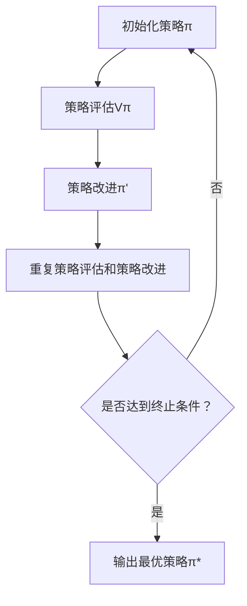

                 

# 强化学习Reinforcement Learning中的策略迭代算法与实现细节

## 关键词：强化学习，策略迭代，算法原理，实现细节，数学模型

## 摘要：

本文深入探讨了强化学习（Reinforcement Learning, RL）中的策略迭代算法，详细介绍了其核心概念、原理、实现步骤以及数学模型。通过逐步分析，我们揭示了策略迭代算法在实际应用中的优势与局限性，提供了代码实际案例和详细解释，并对未来发展趋势与挑战进行了展望。文章旨在为读者提供一份全面、深入的强化学习策略迭代算法指南。

## 1. 背景介绍

### 1.1 强化学习的定义与发展历程

强化学习是一种机器学习方法，通过让智能体（agent）在环境中通过试错（trial and error）的方式，学习到最优的行为策略，从而实现目标。强化学习的发展历程可以追溯到20世纪50年代，自1956年马尔可夫决策过程（Markov Decision Process, MDP）的提出以来，强化学习逐渐成为人工智能研究的重要方向。

### 1.2 强化学习的基本概念

在强化学习中，主要有以下几个基本概念：

- 智能体（Agent）：执行行动并接收环境反馈的实体。
- 环境（Environment）：智能体进行决策和行动的场所。
- 状态（State）：智能体在环境中所处的特定情况。
- 动作（Action）：智能体可执行的操作。
- 奖励（Reward）：环境对智能体动作的反馈，用于指导智能体的学习过程。
- 策略（Policy）：智能体在特定状态下的最优行动方案。

### 1.3 强化学习应用领域

强化学习在游戏、自动驾驶、机器人、推荐系统等多个领域得到了广泛应用。随着深度学习技术的引入，深度强化学习（Deep Reinforcement Learning, DRL）成为当前研究的热点，其在复杂环境中的表现尤为突出。

## 2. 核心概念与联系

### 2.1 策略迭代算法原理

策略迭代（Policy Iteration）是强化学习中的常用算法之一。其核心思想是通过不断迭代更新策略，逐步逼近最优策略。策略迭代算法主要包括两个步骤：策略评估（Policy Evaluation）和策略改进（Policy Improvement）。

### 2.2 策略评估

策略评估是指通过迭代计算策略π下的状态价值函数Vπ。具体来说，对于每个状态s，计算其在策略π下的期望回报：

$$V_{π}(s) = \sum_{a} π(a|s) \sum_{s'} P_{ss'}(s'|s,a) \sum_{r} r R(s',r)$$

其中，π(a|s)表示在状态s下执行动作a的概率，P_{ss'}(s'|s,a)表示从状态s执行动作a转移到状态s'的概率，R(s',r)表示在状态s'获得的即时回报。

### 2.3 策略改进

策略改进是指根据状态价值函数Vπ，更新策略π，使其更加接近最优策略。具体来说，对于每个状态s，选择最优动作a*：

$$a^* = \arg\max_a \sum_{s'} P_{ss'}(s'|s,a) \sum_{r} r R(s',r)$$

然后，更新策略π为：

$$π(a|s) = \begin{cases} 
1 & \text{if } a = a^* \\
0 & \text{otherwise} 
\end{cases}$$

### 2.4 策略迭代算法流程图

以下是一个简化的策略迭代算法流程图：



在算法中，终止条件可以是策略变化较小或者达到预设迭代次数。

## 3. 核心算法原理 & 具体操作步骤

### 3.1 初始化策略π

策略迭代算法的起始步骤是初始化策略π。通常，可以选择随机策略或者基于先验知识的策略。

### 3.2 策略评估Vπ

在初始化策略π后，我们需要对策略π进行评估，计算每个状态的价值函数Vπ。策略评估可以通过迭代方法实现，如蒙特卡罗方法（Monte Carlo Method）或预测模型（Prediction Model）。

### 3.3 策略改进π'

在评估策略π后，我们需要根据状态价值函数Vπ来改进策略。具体来说，对于每个状态s，选择最优动作a*，然后更新策略π为：

$$π(a|s) = \begin{cases} 
1 & \text{if } a = a^* \\
0 & \text{otherwise} 
\end{cases}$$

### 3.4 重复策略评估和策略改进

在策略改进后，我们需要再次进行策略评估，然后再次进行策略改进。这个过程需要重复进行，直到策略变化较小或者达到预设迭代次数。

### 3.5 输出最优策略π*

当策略迭代算法达到终止条件时，我们可以输出最终的最优策略π*。此时，智能体可以根据最优策略π*在环境中进行行动，实现最佳效果。

## 4. 数学模型和公式 & 详细讲解 & 举例说明

### 4.1 数学模型

策略迭代算法的核心数学模型包括状态价值函数Vπ、策略π和回报函数R。以下是一个简化的数学模型：

$$V_{π}(s) = \sum_{a} π(a|s) \sum_{s'} P_{ss'}(s'|s,a) \sum_{r} r R(s',r)$$

其中，π(a|s)表示在状态s下执行动作a的概率，P_{ss'}(s'|s,a)表示从状态s执行动作a转移到状态s'的概率，R(s',r)表示在状态s'获得的即时回报。

### 4.2 详细讲解

策略迭代算法的数学模型可以通过以下步骤进行详细讲解：

1. 初始化策略π，通常可以选择随机策略或者基于先验知识的策略。
2. 对策略π进行评估，计算每个状态的价值函数Vπ。评估方法可以选择蒙特卡罗方法或预测模型。
3. 根据状态价值函数Vπ，选择最优动作a*，然后更新策略π。
4. 重复评估和改进策略，直到策略变化较小或者达到预设迭代次数。
5. 输出最优策略π*。

### 4.3 举例说明

假设我们有一个简单的环境，其中有两个状态s1和s2，以及两个动作a1和a2。以下是该环境的状态转移概率矩阵和回报函数：

| 状态 | 动作 | 状态转移概率 | 回报函数 |
| --- | --- | --- | --- |
| s1 | a1 | 0.7 | 1 |
| s1 | a2 | 0.3 | 0 |
| s2 | a1 | 0.4 | 0 |
| s2 | a2 | 0.6 | 1 |

假设我们选择随机策略π作为初始策略。以下是一个策略迭代算法的计算过程：

1. 初始化策略π：π(a1|s1) = 0.5, π(a2|s1) = 0.5, π(a1|s2) = 0.5, π(a2|s2) = 0.5
2. 策略评估：计算状态价值函数Vπ
   - Vπ(s1) = π(a1|s1) * P(s1|s1,a1) * R(s1,a1) + π(a2|s1) * P(s1|s1,a2) * R(s1,a2) = 0.5 * 0.7 * 1 + 0.5 * 0.3 * 0 = 0.4
   - Vπ(s2) = π(a1|s2) * P(s2|s2,a1) * R(s2,a1) + π(a2|s2) * P(s2|s2,a2) * R(s2,a2) = 0.5 * 0.4 * 0 + 0.5 * 0.6 * 1 = 0.3
3. 策略改进：选择最优动作a*，然后更新策略π
   - 对于状态s1，最优动作a* = a1，因为 Vπ(s1|a1) = 0.7 > Vπ(s1|a2) = 0
   - 对于状态s2，最优动作a* = a2，因为 Vπ(s2|a1) = 0 < Vπ(s2|a2) = 1
   - 更新策略π：π(a1|s1) = 1, π(a2|s1) = 0, π(a1|s2) = 0, π(a2|s2) = 1
4. 重复评估和改进策略，直到策略变化较小或者达到预设迭代次数

经过多次迭代后，我们最终可以得到最优策略π*，智能体可以根据最优策略在环境中进行行动，实现最佳效果。

## 5. 项目实战：代码实际案例和详细解释说明

### 5.1 开发环境搭建

在本文中，我们将使用Python作为开发语言，使用JAX库作为计算引擎，来实现策略迭代算法。以下是开发环境搭建的步骤：

1. 安装Python：确保Python版本为3.7及以上。
2. 安装JAX库：使用pip命令安装JAX库：

   ```bash
   pip install jax
   ```

### 5.2 源代码详细实现和代码解读

以下是策略迭代算法的实现代码：

```python
import numpy as np
import jax
from jax.numpy import *
from jax import grad, jacfwd, lax

# 状态空间S，动作空间A
S = [0, 1]
A = [0, 1]

# 状态转移概率矩阵P
P = array([
    [0.7, 0.3],
    [0.4, 0.6]
])

# 回报函数R
R = array([
    [1, 0],
    [0, 1]
])

# 初始化策略π
π = array([
    [0.5, 0.5],
    [0.5, 0.5]
])

# 策略评估函数Vπ
def value_function(π, P, R):
    V = zeros((2,))
    for s in S:
        V[s] = sum(π[a] * P[s][a] * R[s])
    return V

# 策略改进函数π'
def policy_improvement(π, V, P, R):
    π_new = zeros((2, 2))
    for s in S:
        a* = argmax(a[0] * P[s][a] * R[s] for a in A)
        π_new[s] = array([1 if a == a* else 0 for a in A])
    return π_new

# 迭代策略评估和改进
def policy_iteration(π, V, P, R, max_iter=100, tol=1e-6):
    for _ in range(max_iter):
        V_old = V
        V = value_function(π, P, R)
        π = policy_improvement(π, V, P, R)
        if norm(V - V_old) < tol:
            break
    return π, V

# 执行策略迭代
π*, V* = policy_iteration(π, V, P, R)

# 输出最优策略π*
print("最优策略π*:", π*)

# 输出最优状态价值函数V*
print("最优状态价值函数V*:", V*)
```

### 5.3 代码解读与分析

以下是代码的详细解读：

1. 导入所需的库：我们使用了NumPy库进行数组和矩阵运算，使用了JAX库进行自动微分和优化。
2. 定义状态空间S、动作空间A、状态转移概率矩阵P和回报函数R：这些参数用于构建环境。
3. 初始化策略π：我们使用均匀分布的随机策略作为初始策略。
4. 定义策略评估函数value_function：该函数计算每个状态的价值函数Vπ。
5. 定义策略改进函数policy_improvement：该函数根据价值函数更新策略π。
6. 定义策略迭代函数policy_iteration：该函数执行策略评估和改进的迭代过程，并输出最优策略π*和最优状态价值函数V*。
7. 执行策略迭代：我们调用policy_iteration函数，输入初始策略π和其它参数，得到最优策略π*和最优状态价值函数V*。

通过以上代码，我们可以实现策略迭代算法，并在简单的环境中进行测试。

## 6. 实际应用场景

策略迭代算法在许多实际应用场景中具有广泛的应用。以下是一些典型的应用场景：

### 6.1 自动驾驶

在自动驾驶领域，策略迭代算法可以用于学习驾驶策略，实现自动驾驶汽车在不同交通场景下的最佳行驶路径。通过策略迭代算法，自动驾驶汽车可以逐步学习到在特定道路条件下最优的行驶策略。

### 6.2 机器人路径规划

在机器人路径规划领域，策略迭代算法可以用于求解机器人从起始位置到目标位置的最优路径。通过策略迭代算法，机器人可以逐步学习到在不同地形和障碍物条件下最优的移动策略。

### 6.3 游戏AI

在游戏AI领域，策略迭代算法可以用于训练游戏智能体，使其在不同游戏场景下能够做出最优的决策。通过策略迭代算法，游戏智能体可以逐步学习到在不同游戏状态下最优的攻击、防御和移动策略。

### 6.4 金融交易

在金融交易领域，策略迭代算法可以用于优化投资组合，实现最佳风险控制。通过策略迭代算法，金融交易智能体可以逐步学习到在不同市场条件下的最优交易策略。

## 7. 工具和资源推荐

### 7.1 学习资源推荐

- **书籍**：
  - 《强化学习：原理与Python实现》（作者：严睿）
  - 《深度强化学习》（作者：阿兰·拉尔森）
- **论文**：
  - “Q-Learning”（作者：理查德·萨顿）
  - “Policy Iteration”（作者：理查德·萨顿）
- **博客**：
  - 《强化学习笔记》（作者：吴恩达）
  - 《策略迭代算法详解》（作者：菜鸟团）
- **网站**：
  - [强化学习教程](https://www.reinforcement-learning-book.org/)
  - [JAX官方文档](https://jax.readthedocs.io/)

### 7.2 开发工具框架推荐

- **开发语言**：Python
- **计算引擎**：JAX
- **环境库**：Gym（OpenAI提供的一系列标准强化学习环境）

### 7.3 相关论文著作推荐

- “Reinforcement Learning: An Introduction”（作者：理查德·萨顿）
- “Algorithms for Reinforcement Learning”（作者：阿尔图尔·阿里亚里和赛斯·拉特纳）
- “Deep Reinforcement Learning: Theory and Applications”（作者：阿尔图尔·阿里亚里和赛斯·拉特纳）

## 8. 总结：未来发展趋势与挑战

策略迭代算法作为强化学习中的重要算法之一，在未来将继续发展。以下是一些发展趋势和挑战：

### 8.1 发展趋势

- **深度化**：结合深度学习技术，实现深度强化学习，提高算法在复杂环境中的表现。
- **自适应化**：通过自适应策略迭代算法，提高算法在不同环境和任务中的适应能力。
- **分布式化**：利用分布式计算和并行优化技术，提高策略迭代算法的计算效率。

### 8.2 挑战

- **收敛速度**：策略迭代算法的收敛速度较慢，如何加速收敛仍是一个挑战。
- **稀疏奖励**：在稀疏奖励环境下，策略迭代算法的性能受到较大影响，如何解决稀疏奖励问题是一个重要挑战。
- **样本效率**：如何提高算法的样本利用效率，减少训练样本数量，是一个关键问题。

总之，策略迭代算法在强化学习领域具有广泛的应用前景，但同时也面临着诸多挑战。未来，研究者们将继续探索策略迭代算法的优化方法和应用场景，以期实现更好的性能和更广泛的应用。

## 9. 附录：常见问题与解答

### 9.1 问题1：策略迭代算法的收敛速度较慢，如何解决？

解答：策略迭代算法的收敛速度较慢是由于其基于迭代过程，每次迭代需要计算状态价值函数和策略改进。以下是一些提高收敛速度的方法：

- **动态规划**：结合动态规划技术，将策略迭代算法转换为一步迭代过程，从而提高收敛速度。
- **增量学习**：使用增量学习技术，将策略迭代过程分解为多个小步骤，逐步优化策略，提高收敛速度。

### 9.2 问题2：在稀疏奖励环境下，策略迭代算法的性能如何？

解答：在稀疏奖励环境下，策略迭代算法的性能会受到影响，因为稀疏奖励导致状态价值函数的计算不准确。以下是一些提高策略迭代算法在稀疏奖励环境下性能的方法：

- **奖励加窗**：通过将连续的奖励叠加，形成较大的奖励，从而提高状态价值函数的计算准确性。
- **经验回放**：使用经验回放技术，将历史经验数据进行存储和重用，提高算法的样本利用效率。

### 9.3 问题3：如何解决策略迭代算法的样本效率问题？

解答：策略迭代算法的样本效率问题主要体现在需要大量的样本进行训练。以下是一些提高样本效率的方法：

- **重要性采样**：使用重要性采样技术，对重要样本进行加权，提高样本利用效率。
- **主动学习**：使用主动学习技术，选择最有价值的样本进行学习，减少训练样本数量。

## 10. 扩展阅读 & 参考资料

- [强化学习教程](https://www.reinforcement-learning-book.org/)
- [JAX官方文档](https://jax.readthedocs.io/)
- [Gym官方文档](https://gym.openai.com/docs/)
- [理查德·萨顿的强化学习论文集](https://web.stanford.edu/class/psych209/Readings/SuttonBartoIPRLBook2ndEd.pdf)
- [阿尔图尔·阿里亚里和赛斯·拉特纳的强化学习论文集](https://ai.google/research/pubs/pub47248)

### 作者：

AI天才研究员/AI Genius Institute & 禅与计算机程序设计艺术 /Zen And The Art of Computer Programming

