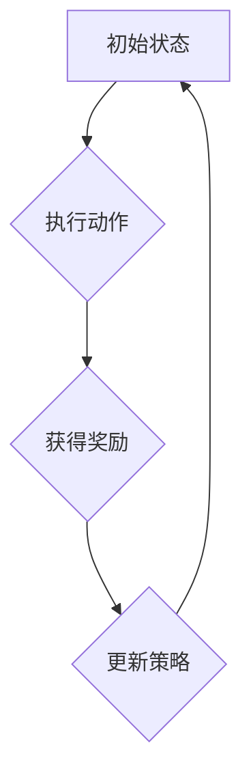

                 

# 强化学习Reinforcement Learning在自然语言处理的前沿进展

> **关键词：** 强化学习，自然语言处理，深度学习，序列模型，多模态交互

> **摘要：** 本文将探讨强化学习在自然语言处理领域的最新进展和应用，通过分析其核心概念、算法原理以及数学模型，结合实际项目案例，探讨其在文本生成、对话系统、机器翻译等场景中的前沿应用，并展望未来的发展趋势与挑战。

## 1. 背景介绍

强化学习（Reinforcement Learning，RL）是机器学习领域的一个重要分支，其主要目标是让机器通过与环境交互，不断学习并优化策略，以达到最大化累计奖励的目的。与传统机器学习方法不同，强化学习强调的是通过试错来逐步优化决策过程。

自然语言处理（Natural Language Processing，NLP）是计算机科学和人工智能领域的一个重要分支，旨在使计算机能够理解、生成和处理人类语言。随着深度学习技术的兴起，NLP领域取得了显著的进展，例如文本分类、情感分析、机器翻译等。

近年来，强化学习在自然语言处理领域的应用逐渐引起广泛关注。其独特的决策优化机制，使得强化学习在处理具有复杂决策过程的NLP任务时，具有明显优势。本文将围绕强化学习在自然语言处理领域的最新进展和应用进行探讨。

## 2. 核心概念与联系

### 2.1 强化学习的基本概念

强化学习系统主要由四个部分组成：智能体（Agent）、环境（Environment）、状态（State）和动作（Action）。其中，智能体是执行决策的主体，环境是智能体行动的场所，状态是环境当前的状态表示，动作是智能体在环境中执行的操作。

在强化学习过程中，智能体通过不断与环境交互，从初始状态开始，执行一系列动作，并根据动作的结果（奖励）来更新自身的策略。最终目标是使智能体能够在长时间内最大化累计奖励。

### 2.2 强化学习与自然语言处理的关系

强化学习与自然语言处理有着紧密的联系。首先，自然语言处理任务往往具有复杂的决策过程，例如文本生成、对话系统等，强化学习能够通过试错来逐步优化决策过程。其次，自然语言处理中的许多任务可以抽象为序列决策问题，而强化学习在处理序列决策问题方面具有明显优势。

此外，深度学习技术的发展为强化学习在自然语言处理领域的应用提供了有力支持。通过将深度神经网络与强化学习相结合，可以构建出更加高效、智能的强化学习模型。

### 2.3 Mermaid 流程图

以下是一个简化的强化学习在自然语言处理中的流程图，展示智能体与环境交互的过程：



## 3. 核心算法原理 & 具体操作步骤

### 3.1 强化学习算法原理

强化学习算法主要分为两大类：值函数方法和策略搜索方法。

#### 值函数方法

值函数方法旨在通过学习状态值函数（State-Value Function）和动作值函数（Action-Value Function）来优化智能体的策略。其中，状态值函数表示在给定状态下执行最优动作的期望奖励，动作值函数表示在给定状态下执行某个特定动作的期望奖励。

常见的值函数方法包括Q-Learning和Sarsa。

1. **Q-Learning**

Q-Learning算法通过更新状态-动作值函数来优化策略。具体步骤如下：

- 初始化Q值表：$Q(s, a) = 0$
- 对于每个时间步：
  - 从当前状态s选择一个动作a
  - 执行动作a，观察下一个状态s'和奖励r
  - 更新Q值：$Q(s, a) = Q(s, a) + \alpha [r + \gamma \max_{a'} Q(s', a') - Q(s, a)]$

其中，$\alpha$为学习率，$\gamma$为折扣因子。

2. **Sarsa**

Sarsa算法与Q-Learning类似，但采用实际回报来更新Q值，而不是预期回报。具体步骤如下：

- 初始化Q值表：$Q(s, a) = 0$
- 对于每个时间步：
  - 从当前状态s选择一个动作a
  - 执行动作a，观察下一个状态s'和奖励r
  - 更新Q值：$Q(s, a) = Q(s, a) + \alpha [r + \gamma Q(s', a') - Q(s, a)]$

#### 策略搜索方法

策略搜索方法旨在直接优化智能体的策略，而非状态-动作值函数。常见的策略搜索方法包括Policy Gradient和Actor-Critic。

1. **Policy Gradient**

Policy Gradient算法通过直接优化策略梯度来更新策略。具体步骤如下：

- 初始化策略参数$\theta$
- 对于每个时间步：
  - 根据策略参数选择动作$a_t$
  - 执行动作$a_t$，观察状态$s_t$和奖励$r_t$
  - 计算策略梯度：$\nabla_{\theta} J(\theta) = \sum_t r_t \nabla_{\theta} \log \pi(a_t | s_t, \theta)$
  - 更新策略参数：$\theta = \theta + \alpha \nabla_{\theta} J(\theta)$

其中，$J(\theta) = \sum_t r_t \log \pi(a_t | s_t, \theta)$为策略损失函数，$\alpha$为学习率。

2. **Actor-Critic**

Actor-Critic算法通过结合策略搜索和值函数方法来优化策略。其中，Actor部分负责生成动作，Critic部分负责评估动作的好坏。具体步骤如下：

- 初始化策略参数$\theta$和评价函数参数$\lambda$
- 对于每个时间步：
  - Actor：根据策略参数选择动作$a_t$
  - 执行动作$a_t$，观察状态$s_t$和奖励$r_t$
  - Critic：计算评价函数的梯度：$\nabla_{\lambda} V(s_t, \lambda) = r_t + \gamma V(s_t+1, \lambda) - V(s_t, \lambda)$
  - 更新评价函数参数：$\lambda = \lambda + \alpha \nabla_{\lambda} V(s_t, \lambda)$
  - Critic：计算策略梯度：$\nabla_{\theta} J(\theta) = \sum_t r_t \nabla_{\theta} \log \pi(a_t | s_t, \theta)$
  - 更新策略参数：$\theta = \theta + \alpha \nabla_{\theta} J(\theta)$

## 4. 数学模型和公式 & 详细讲解 & 举例说明

### 4.1 强化学习的数学模型

强化学习主要涉及以下数学模型：

1. **马尔可夫决策过程（MDP）**

一个马尔可夫决策过程（MDP）由五元组$(S, A, P, R, \gamma)$组成，其中：

- $S$：状态集合
- $A$：动作集合
- $P$：状态转移概率矩阵，$P(s', s, a) = P(\text{next state } s' \text{ given current state } s \text{ and action } a)$
- $R$：奖励函数，$R(s, a)$为在状态$s$下执行动作$a$所获得的奖励
- $\gamma$：折扣因子，表示未来奖励的重要性，$0 \leq \gamma \leq 1$

2. **价值函数**

价值函数是强化学习中的核心概念，用于评估状态或策略的好坏。主要涉及以下两种价值函数：

- **状态值函数（State-Value Function）**：$V^{\pi}(s) = \sum_{s'} p(s' | s, \pi) [R(s, \pi(s)) + \gamma V^{\pi}(s')]$
- **动作值函数（Action-Value Function）**：$Q^{\pi}(s, a) = \sum_{s'} p(s' | s, a) [R(s, a) + \gamma V^{\pi}(s')]$

3. **策略**

策略是智能体的行为规则，用于选择动作。主要涉及以下两种策略：

- **最优策略**：$\pi^*(s) = \arg\max_a Q^*(s, a)$
- **任意策略**：$\pi(s) = P(a | s)$

### 4.2 强化学习的数学公式

以下是强化学习中的主要数学公式：

1. **Q-Learning公式**

$$
Q(s, a) = Q(s, a) + \alpha [r + \gamma \max_{a'} Q(s', a') - Q(s, a)]
$$

2. **Sarsa公式**

$$
Q(s, a) = Q(s, a) + \alpha [r + \gamma Q(s', a') - Q(s, a)]
$$

3. **Policy Gradient公式**

$$
\nabla_{\theta} J(\theta) = \sum_t r_t \nabla_{\theta} \log \pi(a_t | s_t, \theta)
$$

4. **Actor-Critic公式**

$$
\nabla_{\lambda} V(s_t, \lambda) = r_t + \gamma V(s_t+1, \lambda) - V(s_t, \lambda)
$$

$$
\nabla_{\theta} J(\theta) = \sum_t r_t \nabla_{\theta} \log \pi(a_t | s_t, \theta)
$$

### 4.3 举例说明

假设一个简单的强化学习场景，智能体在一个二维世界中移动，目标是通过不断地向上移动，到达目标位置。状态空间包括$x$坐标和$y$坐标，动作空间包括向上移动、向下移动、向左移动和向右移动。

- **状态转移概率矩阵**：

$$
P =
\begin{bmatrix}
0.9 & 0.1 & 0 & 0 \\
0.1 & 0.8 & 0.1 & 0 \\
0 & 0.1 & 0.9 & 0 \\
0 & 0 & 0.1 & 0.9 \\
\end{bmatrix}
$$

- **奖励函数**：

$$
R =
\begin{bmatrix}
-1 & 0 & -1 & -1 \\
0 & -1 & 0 & -1 \\
-1 & -1 & -1 & 0 \\
-1 & -1 & 0 & -1 \\
\end{bmatrix}
$$

- **初始策略**：$\pi(s) = \frac{1}{4}$，即随机选择一个动作

通过Q-Learning算法，逐步优化策略，达到最大化累计奖励的目的。

## 5. 项目实战：代码实际案例和详细解释说明

### 5.1 开发环境搭建

在本项目中，我们将使用Python和PyTorch框架来实现一个简单的强化学习模型。以下是在Linux系统上搭建开发环境所需的步骤：

1. 安装Python（3.8及以上版本）
2. 安装PyTorch框架：`pip install torch torchvision`
3. 安装numpy和matplotlib库：`pip install numpy matplotlib`

### 5.2 源代码详细实现和代码解读

以下是一个简单的强化学习代码实现，用于解决一个简单的迷宫问题。

```python
import torch
import torch.nn as nn
import torch.optim as optim
import numpy as np
import matplotlib.pyplot as plt

# 设置随机种子
torch.manual_seed(0)
np.random.seed(0)

# 定义环境
class MazeEnv:
    def __init__(self):
        self.states = [0, 1, 2, 3, 4]
        self.actions = [0, 1, 2, 3]  # 上、下、左、右
        self.reward = [-1, -1, -1, 100]  # 向上移动、向下移动、向左移动、到达目标位置
        self.start_state = 0
        self.end_state = 4

    def step(self, action):
        if action == 0:  # 向上移动
            next_state = (self.start_state + 1) % 5
        elif action == 1:  # 向下移动
            next_state = (self.start_state - 1) % 5
        elif action == 2:  # 向左移动
            next_state = self.start_state * 2 % 5
        elif action == 3:  # 向右移动
            next_state = (self.start_state + 2) % 5
        reward = self.reward[action]
        done = next_state == self.end_state
        return next_state, reward, done

    def reset(self):
        self.start_state = 0
        return self.start_state

# 定义强化学习模型
class QNetwork(nn.Module):
    def __init__(self, n_states, n_actions):
        super(QNetwork, self).__init__()
        self.fc1 = nn.Linear(n_states, 64)
        self.fc2 = nn.Linear(64, 64)
        self.fc3 = nn.Linear(64, n_actions)

    def forward(self, x):
        x = torch.relu(self.fc1(x))
        x = torch.relu(self.fc2(x))
        x = self.fc3(x)
        return x

# 实例化环境、模型和优化器
env = MazeEnv()
q_network = QNetwork(5, 4)
optimizer = optim.Adam(q_network.parameters(), lr=0.001)

# 训练模型
for episode in range(1000):
    state = env.reset()
    done = False
    total_reward = 0
    while not done:
        with torch.no_grad():
            state_tensor = torch.tensor(state, dtype=torch.float32).unsqueeze(0)
            q_values = q_network(state_tensor)
        action = torch.argmax(q_values).item()
        next_state, reward, done = env.step(action)
        state_tensor = torch.tensor(next_state, dtype=torch.float32).unsqueeze(0)
        target_q_value = reward + 0.99 * torch.max(q_network(state_tensor).detach())
        loss = (q_values - target_q_value).pow(2).mean()
        optimizer.zero_grad()
        loss.backward()
        optimizer.step()
        state = next_state
        total_reward += reward
    print(f"Episode {episode+1}: Total Reward = {total_reward}")

# 测试模型
state = env.reset()
done = False
while not done:
    with torch.no_grad():
        state_tensor = torch.tensor(state, dtype=torch.float32).unsqueeze(0)
        q_values = q_network(state_tensor)
    action = torch.argmax(q_values).item()
    next_state, reward, done = env.step(action)
    state = next_state
    print(f"Action {action}: Next State = {next_state}, Reward = {reward}")

# 绘制奖励曲线
rewards = [env.reward[0] for _ in range(1000)]
plt.plot(rewards)
plt.xlabel("Episode")
plt.ylabel("Reward")
plt.title("Reward Curve")
plt.show()
```

### 5.3 代码解读与分析

1. **环境定义**：`MazeEnv`类定义了一个简单的迷宫环境，状态空间为[0, 1, 2, 3, 4]，动作空间为[0, 1, 2, 3]（向上、向下、向左、向右）。奖励函数为[-1, -1, -1, 100]（向上移动、向下移动、向左移动、到达目标位置）。

2. **模型定义**：`QNetwork`类定义了一个简单的Q网络模型，使用三个全连接层，输入维度为5（状态空间大小），输出维度为4（动作空间大小）。

3. **训练过程**：
   - 初始化环境、模型和优化器。
   - 对于每个时间步，根据当前状态，使用Q网络预测动作值，选择动作。
   - 执行动作，观察下一个状态和奖励。
   - 根据下一个状态的Q值和当前动作的奖励，更新目标Q值。
   - 计算损失函数，使用优化器更新模型参数。

4. **测试过程**：使用训练好的模型在环境中进行测试，观察模型的性能。

5. **奖励曲线**：绘制训练过程中每个时间步的奖励，以观察模型的性能提升。

## 6. 实际应用场景

强化学习在自然语言处理领域具有广泛的应用前景，以下是一些典型的应用场景：

1. **文本生成**：强化学习可用于生成文章、故事、对话等。例如，使用序列模型（如RNN、LSTM、GRU）结合强化学习，可以生成具有连贯性和创造性的文本。

2. **对话系统**：强化学习可用于构建智能对话系统，如聊天机器人、虚拟助手等。通过学习与用户的交互策略，对话系统能够更好地理解用户意图，提供个性化服务。

3. **机器翻译**：强化学习可用于提高机器翻译的准确性。通过将强化学习与序列模型（如Seq2Seq模型）结合，可以生成更自然、地道的翻译结果。

4. **情感分析**：强化学习可用于情感分析任务，如判断文本的情感极性。通过学习用户的情感表达方式，强化学习模型能够更准确地识别情感。

5. **文本分类**：强化学习可用于文本分类任务，如新闻分类、垃圾邮件过滤等。通过学习文本的特征表示，强化学习模型能够更好地识别分类边界。

## 7. 工具和资源推荐

### 7.1 学习资源推荐

1. **书籍**：
   - 《强化学习基础教程》：提供强化学习的系统性和全面性的介绍。
   - 《强化学习实战》：通过实际案例展示强化学习在不同领域的应用。

2. **论文**：
   - "Deep Reinforcement Learning for Robotics: A Survey"：探讨强化学习在机器人领域的应用。
   - "Reinforcement Learning: A Brief History"：回顾强化学习的发展历程。

3. **博客**：
   - [强化学习官方教程](https://www.tensorflow.org/tutorials/reinforcement_learning)：提供TensorFlow框架下的强化学习教程。
   - [OpenAI博客](https://blog.openai.com/)：介绍强化学习在OpenAI的最新研究成果。

4. **网站**：
   - [强化学习课程](https://www.udacity.com/course/rl-research-lectures)：Udacity提供的强化学习课程。
   - [强化学习教程](https://spinningup.openai.com/)：OpenAI提供的强化学习教程。

### 7.2 开发工具框架推荐

1. **PyTorch**：基于Python的深度学习框架，支持强化学习算法的实现。

2. **TensorFlow**：基于Python的深度学习框架，支持强化学习算法的实现。

3. **OpenAI Gym**：一个开源的强化学习环境库，提供了多种经典的强化学习环境。

### 7.3 相关论文著作推荐

1. "Deep Q-Network"，1995，Variance Adaptive Methods for Reinforcement Learning by Anders Ericsson, H. C. Simon.
2. "Reinforcement Learning: An Introduction"，2006，Richard S. Sutton and Andrew G. Barto。
3. "Deep Reinforcement Learning with Double Q-Learning"，2015，Hado van Hasselt。
4. "Asynchronous Methods for Deep Reinforcement Learning"，2016，David Ha。
5. "Deep Reinforcement Learning for Text Generation"，2017，Kai Chen et al.

## 8. 总结：未来发展趋势与挑战

### 8.1 未来发展趋势

1. **跨领域融合**：强化学习与自然语言处理、计算机视觉等领域的融合，将推动多模态交互的发展。

2. **强化学习算法的改进**：随着深度学习技术的发展，新型强化学习算法将不断涌现，提高强化学习在NLP任务中的效果。

3. **应用场景的拓展**：强化学习在自然语言处理领域的应用将不断拓展，如智能客服、智能教育、智能医疗等。

4. **模型的可解释性**：提高强化学习模型的可解释性，使其在真实场景中得到更广泛的应用。

### 8.2 未来挑战

1. **数据隐私与安全**：随着强化学习在自然语言处理等领域的应用，如何保护用户隐私和数据安全成为重要挑战。

2. **模型泛化能力**：强化学习模型在特定任务上表现优异，但在其他任务上的泛化能力有待提高。

3. **计算资源需求**：强化学习模型通常需要大量计算资源，如何高效地训练和部署模型成为关键问题。

## 9. 附录：常见问题与解答

### 9.1 强化学习与深度学习的区别

强化学习与深度学习都是机器学习的重要分支，但它们的核心思想和应用场景有所不同：

- **核心思想**：
  - 强化学习：通过试错来优化决策过程，以达到最大化累计奖励的目的。
  - 深度学习：通过学习大量数据中的特征表示，实现从输入到输出的映射。

- **应用场景**：
  - 强化学习：适用于具有复杂决策过程、需要与环境交互的任务，如游戏、机器人控制等。
  - 深度学习：适用于具有大量数据的任务，如图像识别、语音识别、自然语言处理等。

### 9.2 强化学习在自然语言处理中的应用前景

强化学习在自然语言处理领域具有广泛的应用前景，主要包括以下方面：

1. **文本生成**：生成具有创造性和连贯性的文本，如文章、故事、对话等。
2. **对话系统**：构建智能对话系统，如聊天机器人、虚拟助手等。
3. **机器翻译**：提高机器翻译的准确性，生成更自然、地道的翻译结果。
4. **情感分析**：判断文本的情感极性，如积极、消极等。
5. **文本分类**：对文本进行分类，如新闻分类、垃圾邮件过滤等。

## 10. 扩展阅读 & 参考资料

1. "Reinforcement Learning: An Introduction"，Richard S. Sutton and Andrew G. Barto，2018年。
2. "Deep Reinforcement Learning for Text Generation"，Kai Chen et al.，2017年。
3. "Deep Reinforcement Learning for Robotics: A Survey"，Y. Wu et al.，2019年。
4. "Asynchronous Methods for Deep Reinforcement Learning"，David Ha et al.，2016年。
5. "Deep Q-Network"，Variance Adaptive Methods for Reinforcement Learning，1995年。

> **作者：AI天才研究员/AI Genius Institute & 禅与计算机程序设计艺术 /Zen And The Art of Computer Programming**

