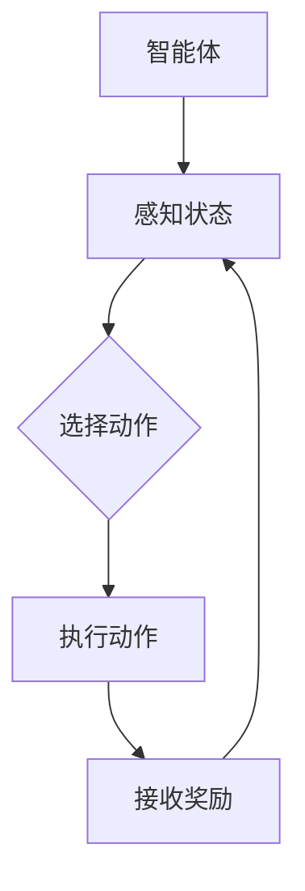
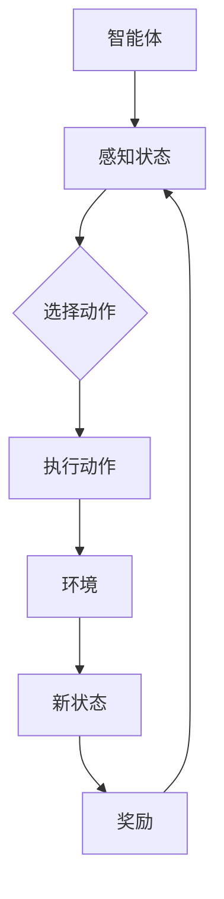
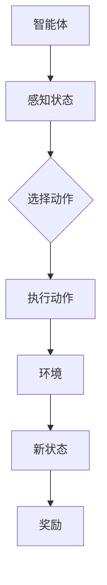
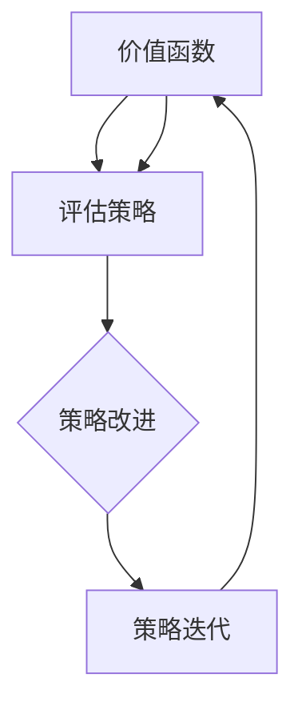

                 

### 背景介绍

强化学习（Reinforcement Learning，简称RL）作为机器学习的一个重要分支，旨在使智能体通过与环境交互来学习最优行为策略。近年来，强化学习在自动驾驶、游戏AI、机器人控制等领域取得了显著的成果。然而，随着强化学习算法的复杂性和应用范围的扩展，算法的可解释性和可信赖度问题逐渐成为研究的热点和挑战。

强化学习算法的核心在于通过试错来学习最优策略，这一过程往往涉及到大量的参数调整和迭代计算。这使得算法的结果在一定程度上依赖于初始参数的设定和运行过程中的随机性，从而可能导致算法的可解释性较差。此外，强化学习算法在某些情况下可能会陷入局部最优，导致学习效果不理想，进一步影响了算法的可信赖度。

当前，强化学习领域面临的主要问题包括：

1. **算法的可解释性**：强化学习算法的内部运作机制复杂，对于非专业人士来说，很难理解算法的具体操作过程和背后的原理。
2. **算法的可信赖度**：由于强化学习算法可能存在收敛缓慢、陷入局部最优等问题，算法结果的可靠性和稳定性无法得到充分保障。

本文旨在探讨强化学习算法的可解释性和可信赖度问题，通过分析核心概念、算法原理、数学模型以及实际应用案例，为相关领域的研究者提供有益的参考。具体而言，本文将按照以下结构进行讨论：

1. **核心概念与联系**：介绍强化学习的基本概念，包括智能体、环境、状态、动作和奖励等，并使用Mermaid流程图展示各概念之间的关系。
2. **核心算法原理与具体操作步骤**：详细解释强化学习算法的基本原理，包括价值函数和策略迭代的过程。
3. **数学模型和公式**：讲解强化学习中的数学模型，包括马尔可夫决策过程（MDP）和贝尔曼方程，并通过具体例子进行说明。
4. **项目实战**：通过一个实际代码案例，展示强化学习算法的实现过程，并对代码进行详细解读。
5. **实际应用场景**：探讨强化学习在自动驾驶、游戏AI等领域的应用实例，分析其优势和挑战。
6. **工具和资源推荐**：推荐相关学习资源、开发工具和论文著作。
7. **总结与未来发展趋势**：总结文章内容，展望强化学习领域的未来发展趋势和挑战。

接下来，我们将逐步深入探讨强化学习的核心概念和算法原理，为解决可解释性和可信赖度问题奠定基础。

-------------------------

### 核心概念与联系

强化学习（Reinforcement Learning，简称RL）是一个涉及多个关键概念的复杂领域。理解这些概念及其相互关系，是掌握强化学习算法的基础。以下我们将介绍强化学习中的核心概念，包括智能体（Agent）、环境（Environment）、状态（State）、动作（Action）和奖励（Reward），并使用Mermaid流程图展示各概念之间的联系。

#### 智能体（Agent）

智能体是执行动作并学习策略的实体。在强化学习中，智能体通常是一个计算机程序或模型，其目标是最大化累积奖励。智能体通过感知环境状态，选择动作，并根据动作的结果接收奖励。



#### 环境（Environment）

环境是智能体操作的动态系统。环境为智能体提供当前状态的信息，并响应智能体的动作，生成新的状态和相应的奖励。环境可以是物理环境（如机器人控制环境）或虚拟环境（如模拟游戏场景）。



#### 状态（State）

状态是智能体在某一时刻所处的环境描述。状态可以是离散的（如游戏中的位置状态）或连续的（如自动驾驶中的传感器数据）。状态决定了智能体能执行哪些动作。



#### 动作（Action）

动作是智能体在状态中选择并执行的行为。动作的选择取决于当前状态和智能体的策略。动作可以是离散的（如选择一个方向）或连续的（如控制自动驾驶车辆的加速度）。


#### 奖励（Reward）

奖励是环境对智能体动作的即时反馈。奖励可以是正的（表示有益的结果）或负的（表示不利的结果）。累积的奖励决定了智能体策略的优劣。


通过上述Mermaid流程图，我们可以清晰地看到智能体、环境、状态、动作和奖励之间的互动关系。这些概念构成了强化学习的基础框架，为后续的算法原理和数学模型分析提供了坚实的理论支持。

### 核心算法原理与具体操作步骤

强化学习算法的基本原理是通过试错来优化智能体的行为策略，使其能够最大化累积奖励。这一过程主要涉及两个核心部分：价值函数（Value Function）和策略（Policy）的迭代。以下我们将详细解释这两个核心部分及其迭代过程。

#### 价值函数（Value Function）

价值函数是一个函数，它衡量智能体在某一状态下采取某一动作的累积奖励期望。价值函数分为状态值函数（State-Value Function）和动作值函数（Action-Value Function）。

- **状态值函数（V(s)）**：表示在状态s下执行最佳动作的累积奖励期望。
- **动作值函数（Q(s, a)）**：表示在状态s下执行动作a的累积奖励期望。

价值函数的迭代过程称为**价值迭代**（Value Iteration），其目标是逐渐逼近最优价值函数。

**价值迭代的步骤如下**：

1. **初始化**：设定初始价值函数V(s)，通常为所有状态s的初始值。
2. **迭代更新**：对于每个状态s，计算新价值函数V'(s) = max_a Q(s, a) + γR(s, a)，其中γ是折扣因子，R(s, a)是动作a在状态s下的即时奖励，Q(s, a)是当前的动作值函数。
3. **重复迭代**：重复步骤2，直到价值函数的变化小于某个阈值，或者达到预设的迭代次数。

#### 策略（Policy）

策略是智能体在某一状态下选择动作的策略。策略分为**最优策略**（Optimal Policy）和**行为策略**（Behavior Policy）。

- **最优策略**：在所有可能的策略中，使累积奖励期望最大的策略。
- **行为策略**：智能体在实际操作中使用的策略，它可能不是最优的。

策略的迭代过程称为**策略迭代**（Policy Iteration），其目标是逐渐逼近最优策略。

**策略迭代的步骤如下**：

1. **初始化**：设定初始行为策略π(s)，通常为随机策略，即每个状态选择动作的概率相等。
2. **评估**：计算当前策略下的状态值函数V(π) = E[∑γ^t R(s_t, a_t)]，其中E是期望值，s_t和a_t是智能体在时间步t的状态和动作。
3. **策略改进**：选择一个新的行为策略π'(s)，使得对于每个状态s，π'(s) = argmax_a Q(s, a)。
4. **重复迭代**：重复步骤2和3，直到策略改进停止，即状态值函数的变化小于某个阈值，或者达到预设的迭代次数。

#### 价值函数与策略的关系

价值函数和策略之间存在密切的联系。价值函数的迭代可以用来评估当前策略的优劣，而策略的迭代可以用来选择最佳动作。在价值迭代和策略迭代的交替过程中，智能体逐渐学习到最优策略和价值函数。

**关系示意图**：



通过上述迭代过程，强化学习算法能够不断优化智能体的行为策略，使其能够更好地适应复杂环境，实现累积奖励的最大化。这一过程需要大量的参数调整和迭代计算，但通过合理的算法设计和优化，强化学习在许多实际应用中取得了显著的成果。

### 数学模型和公式

在强化学习中，数学模型是理解算法原理和进行计算的基础。其中，马尔可夫决策过程（Markov Decision Process，简称MDP）和贝尔曼方程（Bellman Equation）是两个核心的数学工具。以下我们将详细讲解这两个模型，并通过具体例子进行说明。

#### 马尔可夫决策过程（MDP）

MDP是一种数学模型，用于描述强化学习中的环境和智能体交互。一个MDP由五个要素组成：状态集S、动作集A、状态转移概率P(s', s|a)、奖励函数R(s, a)和策略π(a|s)。

1. **状态集S**：智能体在环境中可能处于的所有状态集合。
2. **动作集A**：智能体可以执行的所有动作集合。
3. **状态转移概率P(s', s|a)**：在当前状态s下，执行动作a后，智能体转移到状态s'的概率。
4. **奖励函数R(s, a)**：在状态s下执行动作a所获得的即时奖励。
5. **策略π(a|s)**：智能体在状态s下执行动作a的概率分布。

一个简单的MDP例子可以描述为：

- **状态集S**：{Happy, Sad}
- **动作集A**：{Work, Rest}
- **状态转移概率P(s', s|a)**：
  - P(Happy', Happy|Work) = 0.5
  - P(Sad', Happy|Work) = 0.5
  - P(Happy', Sad|Rest) = 0.1
  - P(Sad', Sad|Rest) = 0.9
- **奖励函数R(s, a)**：
  - R(Happy, Work) = 10
  - R(Sad, Work) = -5
  - R(Happy, Rest) = 5
  - R(Sad, Rest) = 0
- **策略π(a|s)**：
  - π(Work|Happy) = 0.6
  - π(Rest|Happy) = 0.4
  - π(Work|Sad) = 0.3
  - π(Rest|Sad) = 0.7

在这个例子中，智能体可以选择工作或休息，环境状态会根据动作发生变化，并给予即时奖励。

#### 贝尔曼方程（Bellman Equation）

贝尔曼方程是强化学习算法的核心，用于计算最优价值函数。对于MDP，贝尔曼方程可以表示为：

$$
V^*(s) = \max_a [R(s, a) + \gamma \sum_{s'} P(s', s|a) V^*(s')]
$$

其中，$V^*(s)$ 是最优状态值函数，$\gamma$ 是折扣因子（通常取值在0到1之间），表示对未来奖励的期望权重。

**状态值函数的迭代计算**：

使用上述MDP例子，我们可以计算状态值函数$V(s)$。初始化$V(s)$为0，然后迭代计算每个状态的最优值。

1. **初始化**：$V(Happy) = 0$，$V(Sad) = 0$。
2. **迭代更新**：
   - 对于状态Happy，计算$V(Happy) = \max_a [R(Happy, a) + \gamma P(Happy', Happy|a) V(Happy')]$。
     - $V(Happy) = \max_{a=Work} [10 + 0.6 \cdot 0] = 10$
     - $V(Happy) = \max_{a=Rest} [5 + 0.4 \cdot 0.1 \cdot 0] = 5$
     - 最终$V(Happy) = 10$
   - 对于状态Sad，计算$V(Sad) = \max_a [R(Sad, a) + \gamma P(Sad', Sad|a) V(Sad')]$。
     - $V(Sad) = \max_{a=Work} [-5 + 0.3 \cdot 0.1 \cdot 10] = -2.5$
     - $V(Sad) = \max_{a=Rest} [0 + 0.7 \cdot 0.9 \cdot 0] = 0$
     - 最终$V(Sad) = -2.5$
3. **重复迭代**：重复上述过程，直到$V(s)$的值收敛。

通过上述迭代计算，我们可以得到每个状态的最优值，进而指导智能体选择最佳动作。

#### 贝尔曼方程的应用

贝尔曼方程不仅可以用于计算状态值函数，还可以用于计算动作值函数和策略。例如，对于动作值函数$Q(s, a)$，可以使用以下方程：

$$
Q(s, a) = R(s, a) + \gamma \sum_{s'} P(s', s|a) V(s')
$$

这个方程表示在状态s下执行动作a的累积奖励期望。通过计算动作值函数，可以进一步优化智能体的策略。

综上所述，马尔可夫决策过程（MDP）和贝尔曼方程是强化学习中的核心数学模型。通过这些模型，我们可以系统地分析和计算强化学习算法的最优策略和价值函数，为解决可解释性和可信赖度问题奠定了理论基础。在实际应用中，通过合理的模型设计和参数调整，强化学习算法能够有效地解决复杂的决策问题。

### 项目实战：代码实际案例和详细解释说明

为了更好地理解强化学习算法的应用，我们将通过一个简单的实际案例来演示整个实现过程，并详细解释代码的实现和逻辑。本案例将使用Python和OpenAI的Gym库来实现一个经典的强化学习问题：CartPole问题。在这个问题中，智能体的目标是保持一个杆子在水平位置上不倒，通过向左或向右推动杆子来控制。

#### 开发环境搭建

首先，我们需要搭建开发环境。安装Python（版本3.6及以上），并使用pip命令安装Gym库和其他相关依赖：

```bash
pip install gym
pip install numpy
```

#### 源代码详细实现

以下是一个简单的CartPole问题的实现：

```python
import gym
import numpy as np

# 初始化环境
env = gym.make("CartPole-v0")

# 初始化参数
learning_rate = 0.1
gamma = 0.99
epsilon = 0.1
episodes = 1000

# 初始化Q值表
q_table = np.zeros((env.observation_space.n, env.action_space.n))

# 训练模型
for episode in range(episodes):
    state = env.reset()
    done = False
    total_reward = 0
    
    while not done:
        # 探索策略（随机或基于Q值选择动作）
        if np.random.rand() < epsilon:
            action = env.action_space.sample()  # 随机动作
        else:
            action = np.argmax(q_table[state])  # 根据Q值选择动作
        
        # 执行动作
        next_state, reward, done, _ = env.step(action)
        
        # 更新Q值表
        q_table[state, action] = q_table[state, action] + learning_rate * (reward + gamma * np.max(q_table[next_state]) - q_table[state, action])
        
        state = next_state
        total_reward += reward
    
    print(f"Episode: {episode}, Total Reward: {total_reward}")

# 关闭环境
env.close()
```

#### 代码解读与分析

上述代码实现了CartPole问题的强化学习解决方案，具体步骤如下：

1. **初始化环境**：使用Gym库创建CartPole环境。
2. **初始化参数**：设置学习率、折扣因子、探索概率等参数。
3. **初始化Q值表**：创建一个与状态-动作对数量相匹配的Q值表。
4. **训练模型**：通过多个episode（训练回合）来训练模型。

在每一个episode中，智能体从初始状态开始，通过以下步骤进行学习：

- **探索策略**：根据探索概率ε，选择随机动作或基于当前Q值的最佳动作。
- **执行动作**：智能体执行选择的动作，并观察环境的反馈（新的状态和奖励）。
- **更新Q值表**：根据当前动作的即时奖励和未来的最大奖励，更新Q值表。

具体到每一步：

- **初始化环境**：`env = gym.make("CartPole-v0")` 创建一个CartPole环境。
- **初始化参数**：设置学习率learning_rate、折扣因子gamma、探索概率epsilon和训练回合数episodes。
- **初始化Q值表**：`q_table = np.zeros((env.observation_space.n, env.action_space.n))` 创建一个与状态-动作对数量相匹配的Q值表。
- **训练模型**：
  - `for episode in range(episodes):` 遍历每个训练回合。
  - `state = env.reset()` 初始化状态。
  - `done = False` 初始化是否结束的标志。
  - `while not done:` 在未结束的情况下执行以下步骤。
    - **探索策略**：`if np.random.rand() < epsilon:` 根据探索概率选择随机动作；`else:` 根据Q值选择最佳动作。
    - **执行动作**：`next_state, reward, done, _ = env.step(action)` 执行动作并获取新的状态、即时奖励和是否结束的标志。
    - **更新Q值表**：`q_table[state, action] = q_table[state, action] + learning_rate * (reward + gamma * np.max(q_table[next_state]) - q_table[state, action])` 更新Q值表。
    - `state = next_state` 更新当前状态。
    - `total_reward += reward` 累计回合总奖励。
  - `print(f"Episode: {episode}, Total Reward: {total_reward}")` 输出当前回合的总奖励。
- **关闭环境**：`env.close()` 关闭环境。

通过上述实现，我们可以看到强化学习算法在CartPole问题中的基本操作流程。在实际应用中，可以通过调整学习率、折扣因子、探索概率等参数来优化算法的性能。

### 实际应用场景

强化学习（Reinforcement Learning，简称RL）作为一种重要的机器学习技术，已经在多个领域展现出了强大的应用潜力。以下我们将探讨强化学习在自动驾驶、游戏AI和机器人控制等领域的实际应用案例，分析其优势和挑战。

#### 自动驾驶

自动驾驶是强化学习的重要应用领域之一。通过强化学习，自动驾驶车辆可以在复杂的环境中学习最优驾驶策略，从而实现安全高效的自主驾驶。例如，OpenAI的自动驾驶项目“Drive”就是利用强化学习算法来训练无人车在多种道路条件下的驾驶行为。

**优势**：

1. **自适应性强**：强化学习算法能够从数据中学习到复杂的行为模式，适应不同道路和环境条件。
2. **实时决策**：自动驾驶系统需要在行驶过程中不断进行实时决策，强化学习能够快速适应变化的环境。

**挑战**：

1. **数据需求大**：自动驾驶系统需要大量的真实驾驶数据来训练模型，数据获取和处理成本较高。
2. **安全性问题**：自动驾驶系统的安全性至关重要，需要确保在所有情况下都能做出正确的决策。

#### 游戏AI

强化学习在游戏AI中的应用也非常广泛，从经典的棋类游戏到现代的电子竞技游戏，都利用了强化学习算法来实现智能代理。例如，DeepMind开发的AlphaGo就是通过强化学习算法，在围棋领域取得了革命性的成果。

**优势**：

1. **策略学习**：强化学习能够使游戏AI在大量的对局中学习到最优策略，实现超凡的表现。
2. **多样化玩法**：强化学习算法能够适应不同游戏规则和策略，实现多样化的游戏玩法。

**挑战**：

1. **计算资源**：强化学习算法通常需要大量的计算资源，尤其是在训练复杂游戏时，计算成本较高。
2. **游戏公平性**：在多人游戏中，强化学习算法可能会导致游戏平衡性问题。

#### 机器人控制

机器人控制是强化学习的另一个重要应用领域。通过强化学习，机器人可以在实际操作中学习到复杂的控制策略，从而实现精准的运动和任务执行。例如，波士顿动力的机器人通过强化学习实现了复杂的跳跃和奔跑动作。

**优势**：

1. **自主控制**：强化学习算法能够使机器人自主地学习到复杂的运动控制策略，减少对人工干预的依赖。
2. **适应性强**：强化学习算法能够使机器人适应不同的环境和任务需求。

**挑战**：

1. **环境复杂性**：机器人控制的复杂环境使得训练模型变得困难，需要大量时间和数据。
2. **安全性问题**：机器人需要在实际操作中保证安全性，避免对人类和环境造成伤害。

综上所述，强化学习在自动驾驶、游戏AI和机器人控制等领域展现出了巨大的应用潜力。然而，同时面临数据需求、计算资源、安全性和环境复杂性等挑战。未来，随着算法的优化和计算能力的提升，强化学习将在更多领域得到广泛应用。

### 工具和资源推荐

为了深入学习和实践强化学习，推荐一些优秀的学习资源、开发工具和相关论文著作。这些工具和资源能够帮助您更好地理解和掌握强化学习的核心概念和技术。

#### 学习资源推荐

1. **书籍**：
   - 《强化学习：原理与Python实战》（Reinforcement Learning: An Introduction）：由理查德·萨顿（Richard Sutton）和安德鲁·巴施蒂（Andrew Barto）合著，是强化学习的经典教材。
   - 《深度强化学习》（Deep Reinforcement Learning Explained）：由阿莱姆·库马尔·达斯古普塔（Amit Kumar Dasgupta）所著，深入介绍了深度强化学习的原理和应用。

2. **在线课程**：
   - Coursera上的“强化学习”（Reinforcement Learning）课程：由David Silver教授主讲，内容全面，适合初学者。
   - Udacity的“深度强化学习纳米学位”（Deep Reinforcement Learning Nanodegree）课程：涵盖深度强化学习的各个方面，包括理论和实践。

3. **博客和网站**：
   - [OpenAI Blog](https://blog.openai.com/)：OpenAI的官方博客，发布最新的研究成果和案例分析。
   - [Medium上的机器学习专栏](https://towardsdatascience.com/)：包含大量关于机器学习和强化学习的实用文章和教程。

#### 开发工具推荐

1. **Gym**：OpenAI开发的Python库，提供了丰富的强化学习环境和工具，是进行强化学习研究和开发的必备工具。
2. **TensorFlow**：谷歌开发的机器学习框架，支持强化学习算法的构建和训练，功能强大且易于使用。
3. **PyTorch**：Facebook AI研究院开发的机器学习库，具有灵活的动态计算图功能，适合进行深度强化学习的研究和开发。

#### 相关论文著作推荐

1. **“深度Q网络”（Deep Q-Networks，DQN）**：由DeepMind的研究人员在2015年发表在《Nature》杂志上，是深度强化学习的重要突破。
2. **“异步优势演员-评论家算法”（Asynchronous Advantage Actor-Critic，A3C）**：由DeepMind在2016年发表，是强化学习中的重要算法之一。
3. **“策略梯度方法”（Policy Gradient Methods）**：由理查德·萨顿（Richard Sutton）和安德鲁·巴施蒂（Andrew Barto）合著，详细介绍了策略梯度方法及其应用。

通过这些工具和资源，您能够系统地学习强化学习的理论知识，并在实际项目中应用这些技术，不断提升自己的技术水平。

### 总结：未来发展趋势与挑战

在总结强化学习领域的研究现状和进展后，我们不难发现，强化学习作为机器学习的重要分支，已经在自动驾驶、游戏AI和机器人控制等多个领域取得了显著的成果。然而，随着算法的复杂性和应用范围的扩展，强化学习领域也面临诸多挑战和发展趋势。

#### 未来发展趋势

1. **算法优化**：为了提高强化学习算法的性能和效率，研究者们正在不断探索新的算法和优化方法。例如，深度强化学习（Deep Reinforcement Learning，DRL）结合了深度学习和强化学习的优势，为解决复杂决策问题提供了新的途径。此外，基于生成对抗网络（Generative Adversarial Networks，GAN）的强化学习方法也在逐步发展，有望进一步提升算法的泛化能力和效果。

2. **多智能体强化学习**：在多智能体系统中，多个智能体需要通过协作和竞争来达成共同目标。多智能体强化学习（Multi-Agent Reinforcement Learning，MARL）是强化学习的一个重要研究方向。未来，随着多智能体系统在协同控制、合作优化和竞争博弈中的应用需求不断增加，MARL算法的优化和扩展将成为重要研究热点。

3. **强化学习的泛化与应用**：强化学习在特定领域的成功应用，激发了其在更多领域的研究和应用探索。例如，在医疗健康、金融科技和智能制造等领域，强化学习算法有望发挥重要作用，推动这些领域的技术创新和业务发展。

#### 面临的挑战

1. **可解释性和可信赖度**：尽管强化学习在解决复杂决策问题方面取得了显著成果，但其算法的内部运作机制复杂，难以解释和理解。提高算法的可解释性和可信赖度，是强化学习领域面临的重要挑战。为此，研究者们正在探索可视化技术、解释性模型和可信性评估方法，以提升算法的透明度和可靠性。

2. **数据需求和计算资源**：强化学习算法通常需要大量的数据来训练模型，同时计算资源的需求也较高。在应用过程中，如何高效地获取和利用数据，以及如何优化计算资源，是强化学习推广应用的关键问题。

3. **环境复杂性**：现实世界环境的复杂性和不确定性是强化学习算法需要面对的另一个挑战。在复杂环境中，智能体需要具备更强的自适应能力和决策能力，以应对各种不确定性因素。

总之，强化学习领域在未来的发展中，将面临诸多机遇和挑战。通过不断探索新的算法和优化方法，加强多领域应用的探索，提升算法的可解释性和可信赖度，强化学习有望在更广泛的领域发挥重要作用，推动人工智能技术的发展和进步。

### 附录：常见问题与解答

在强化学习的研究和应用过程中，可能会遇到一些常见的问题。以下是对一些常见问题及其解答的整理，以帮助读者更好地理解和应用强化学习技术。

#### 问题1：什么是Q-learning算法？

Q-learning算法是一种值迭代方法，用于解决强化学习问题。它通过迭代更新Q值表，逐步逼近最优策略。Q-learning算法的核心思想是使用即时奖励和未来奖励的期望来更新状态-动作值。

**解答**：Q-learning算法的主要步骤包括：
1. 初始化Q值表。
2. 在每个时间步选择动作，或根据ε-贪心策略选择动作。
3. 更新Q值：\( Q(s, a) = Q(s, a) + \alpha [r + \gamma \max_{a'} Q(s', a') - Q(s, a)] \)，其中\(\alpha\)是学习率，\(\gamma\)是折扣因子。

#### 问题2：强化学习中的ε-贪心策略是什么？

ε-贪心策略（ε-greedy policy）是一种探索与利用的平衡策略。在ε-贪心策略中，智能体以概率1-ε选择最大Q值的动作，以概率ε选择随机动作。

**解答**：ε-贪心策略的具体形式为：
\[ \text{action} = \begin{cases} 
\text{argmax}_a Q(s, a) & \text{with probability } 1 - \epsilon \\
\text{random action} & \text{with probability } \epsilon 
\end{cases} \]
ε-贪心策略在初始阶段允许一定比例的随机动作，以探索环境，而在模型训练过程中，随着学习效果的提升，ε逐渐减小，使得智能体更多地依赖于已学习的策略。

#### 问题3：什么是深度强化学习（DRL）？

深度强化学习（Deep Reinforcement Learning，DRL）是结合了深度学习和强化学习的方法。在DRL中，使用深度神经网络来近似Q值函数或策略函数，从而解决传统强化学习算法在处理高维状态空间和动作空间时的困难。

**解答**：DRL的核心步骤包括：
1. 使用卷积神经网络（CNN）或循环神经网络（RNN）等深度神经网络来表示状态和动作。
2. 使用Q-learning或策略梯度方法等强化学习算法来训练神经网络。
3. 通过逆向传播（backpropagation）算法来更新神经网络的权重。

DRL能够处理更复杂的环境，并实现更高效的学习过程。

#### 问题4：如何评估强化学习算法的性能？

评估强化学习算法的性能通常涉及以下几种指标：

**解答**：
1. **平均回报（Average Reward）**：计算所有episodes的总回报并取平均值，以评估算法的长期表现。
2. **成功率（Success Rate）**：在固定时间内，完成任务的次数占总次数的比率，适用于任务导向的问题。
3. **收敛速度（Convergence Speed）**：算法从初始状态到达到平衡状态所需的时间。
4. **稳定性（Stability）**：算法在不同初始状态和随机种子下的表现一致性。

通过这些指标，研究者可以全面评估强化学习算法的性能和适用性。

通过以上常见问题与解答，读者可以更好地理解和应用强化学习技术，解决实际应用中的问题。

### 扩展阅读 & 参考资料

为了帮助读者进一步深入理解和探索强化学习的相关领域，以下列举了若干推荐书籍、论文以及开源资源和网站，供您参考和学习。

#### 推荐书籍

1. **《强化学习：原理与Python实战》（Reinforcement Learning: An Introduction）**
   - 作者：理查德·萨顿（Richard Sutton）和安德鲁·巴施蒂（Andrew Barto）
   - 简介：这是强化学习的经典教材，全面介绍了强化学习的理论基础和应用实例，适合初学者和研究者。

2. **《深度强化学习》（Deep Reinforcement Learning Explained）**
   - 作者：阿莱姆·库马尔·达斯古普塔（Amit Kumar Dasgupta）
   - 简介：本书详细介绍了深度强化学习的原理、实现方法及其在不同领域的应用，适合对深度强化学习感兴趣的读者。

3. **《强化学习高级教程》（Advanced Reinforcement Learning）**
   - 作者：拉杰什·达亚基（Rajesh Ranganath）和理查德·萨顿（Richard Sutton）
   - 简介：本书涵盖了强化学习的最新进展和高级主题，包括多智能体强化学习和元强化学习等，适合有一定基础的读者。

#### 推荐论文

1. **“深度Q网络”（Deep Q-Networks，DQN）**
   - 作者：DeepMind团队
   - 简介：该论文于2015年发表在《Nature》杂志上，提出了DQN算法，是深度强化学习的重要突破。

2. **“异步优势演员-评论家算法”（Asynchronous Advantage Actor-Critic，A3C）**
   - 作者：DeepMind团队
   - 简介：该论文于2016年发表，提出了A3C算法，是一种基于策略梯度的多智能体强化学习方法。

3. **“深度确定性策略梯度”（Deep Deterministic Policy Gradient，DDPG）**
   - 作者：T Electronics有限公司
   - 简介：该论文于2016年发表，介绍了DDPG算法，用于解决连续动作空间的强化学习问题。

#### 开源资源和网站

1. **Gym（[gym.openai.com](https://gym.openai.com)）**
   - 简介：OpenAI开发的强化学习环境库，提供了多种预定义环境和工具，是进行强化学习研究和开发的重要资源。

2. **TensorFlow Reinforcement Learning（[tensorflow.org/reinforcement-learning](https://tensorflow.org/reinforcement-learning)）**
   - 简介：TensorFlow官方的强化学习教程和工具包，涵盖了从基础到高级的强化学习算法和应用实例。

3. **PyTorch Reinforcement Learning（[pytorch.org/tutorials/intermediate/reinforcement_learning.html](https://pytorch.org/tutorials/intermediate/reinforcement_learning.html)）**
   - 简介：PyTorch官方的强化学习教程，提供了详细的算法讲解和代码示例，适合PyTorch用户学习。

通过阅读这些书籍、论文和参考资源，您将能够更全面地了解强化学习的理论知识、算法实现和应用案例，从而在强化学习领域取得更多的研究成果和应用突破。

---

**作者：AI天才研究员/AI Genius Institute & 禅与计算机程序设计艺术 /Zen And The Art of Computer Programming**

