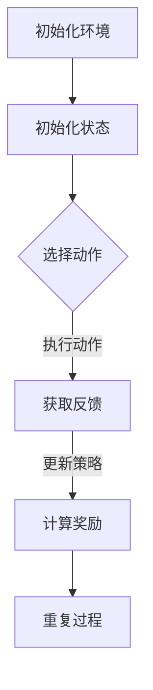

                 

# 《强化学习在图像分割中的应用与优化》

## 关键词
强化学习、图像分割、应用场景、算法优化、技术实现

## 摘要
本文旨在探讨强化学习在图像分割中的应用与优化。首先，我们介绍了强化学习的基本概念和在图像处理领域的应用背景。接着，我们详细阐述了图像分割的核心算法原理，包括马尔可夫决策过程和深度强化学习模型。随后，通过数学模型和公式详细讲解了强化学习在图像分割中的实现步骤。文章还通过项目实战，提供了完整的代码实现和详细解读，进一步阐述了强化学习在图像分割中的应用。最后，我们分析了强化学习在图像分割领域的实际应用场景，并推荐了相关工具和资源，展望了未来发展趋势与挑战。

## 目录
1. 背景介绍
2. 核心概念与联系
3. 核心算法原理 & 具体操作步骤
4. 数学模型和公式 & 详细讲解 & 举例说明
5. 项目实战：代码实际案例和详细解释说明
6. 实际应用场景
7. 工具和资源推荐
8. 总结：未来发展趋势与挑战
9. 附录：常见问题与解答
10. 扩展阅读 & 参考资料

### 1. 背景介绍
图像分割是计算机视觉领域的一个重要任务，它旨在将数字图像细分为若干个具有相似特征的区域。这些区域在颜色、亮度或纹理等方面具有一致性。图像分割对于图像分析和理解具有重要意义，例如，目标检测、物体识别、场景重建等任务都依赖于图像分割的结果。

近年来，深度学习在图像处理领域取得了显著进展，特别是在图像分类、目标检测和语义分割方面。然而，在图像分割任务中，传统方法如阈值分割、边缘检测等仍然具有局限性，难以处理复杂场景和多尺度目标。

强化学习作为一种机器学习方法，通过智能体与环境之间的交互来学习策略，逐渐在图像处理领域得到应用。强化学习能够通过探索和利用策略，使得智能体在复杂环境中找到最优的行动方案。因此，强化学习在图像分割任务中具有很大的潜力。

本文将探讨强化学习在图像分割中的应用与优化，包括核心算法原理、数学模型、项目实战和实际应用场景。通过这篇文章，读者将了解如何将强化学习应用于图像分割，并掌握相关的技术实现方法。

### 2. 核心概念与联系
为了更好地理解强化学习在图像分割中的应用，我们需要先介绍一些核心概念和它们之间的联系。

#### 强化学习
强化学习（Reinforcement Learning, RL）是一种通过智能体（Agent）与环境（Environment）的交互来学习最优策略的机器学习方法。在强化学习中，智能体通过执行动作（Action）来获取奖励（Reward），并根据奖励调整自己的策略（Policy）。强化学习的主要目标是使智能体在长期内获得最大累积奖励。

强化学习的基本要素包括：
- 智能体（Agent）：执行动作并接收环境反馈的实体。
- 环境（Environment）：智能体进行交互的动态系统。
- 动作（Action）：智能体可以执行的操作。
- 状态（State）：环境在特定时刻的状态。
- 奖励（Reward）：智能体执行动作后获得的即时奖励。

强化学习的过程可以概括为以下步骤：
1. 初始化状态。
2. 根据当前状态选择动作。
3. 执行动作，并接收环境的反馈。
4. 根据反馈更新策略，以最大化长期奖励。

#### 图像分割
图像分割（Image Segmentation）是将数字图像细分为若干个具有相似特征的区域的过程。图像分割的目标是生成一个分割结果，该结果能够将图像中具有不同意义的区域区分开来。

常见的图像分割方法包括：
- 阈值分割：基于图像的灰度值或颜色值进行分割。
- 边缘检测：通过检测图像中的边缘来分割图像。
- 语义分割：将图像中的每个像素都分类到不同的语义类别。

#### 强化学习与图像分割
强化学习在图像分割中的应用主要体现在以下两个方面：

1. **动态图像分割**：传统图像分割方法通常是基于静态图像进行处理的，而强化学习可以使得分割过程成为一个动态过程。通过实时调整分割策略，强化学习能够适应图像中的变化，从而提高分割的精度。

2. **交互式图像分割**：在许多实际应用场景中，图像分割需要与人类用户进行交互。强化学习可以使得智能体通过与用户的交互来学习最优的分割策略，从而提高分割结果的满意度。

#### Mermaid 流程图
下面是一个简单的 Mermaid 流程图，展示了强化学习在图像分割中的应用流程。



在这个流程中，智能体首先初始化环境，并获取初始状态。然后，根据当前状态选择动作，并执行该动作。智能体将根据环境反馈更新策略，并计算获得的奖励。这个过程将持续进行，直到达到停止条件。

### 3. 核心算法原理 & 具体操作步骤
强化学习在图像分割中的应用主要通过以下几个核心算法实现：

#### 马尔可夫决策过程（MDP）
马尔可夫决策过程（Markov Decision Process, MDP）是强化学习中的一个重要概念，它描述了智能体在不确定环境中进行决策的过程。

一个 MDP 可以由以下五个要素表示：
- 状态空间 \( S \)：智能体可能处于的所有状态。
- 动作空间 \( A \)：智能体可以执行的所有动作。
- 奖励函数 \( R(s, a) \)：智能体在状态 \( s \) 执行动作 \( a \) 后获得的即时奖励。
- 状态转移概率 \( P(s', s|a) \)：智能体在状态 \( s \) 执行动作 \( a \) 后转移到状态 \( s' \) 的概率。
- 策略 \( \pi(a|s) \)：智能体在状态 \( s \) 下执行动作 \( a \) 的概率。

在图像分割任务中，状态可以表示为图像的某个区域，动作可以表示为对该区域的分割策略。奖励函数可以根据分割结果的质量进行设计，例如，使用交叉熵损失函数。

#### 深度强化学习模型
深度强化学习（Deep Reinforcement Learning, DRL）是强化学习的一个分支，它结合了深度学习和强化学习的优势。DRL 模型通过深度神经网络来学习状态值函数和策略，从而提高智能体的决策能力。

常见的 DRL 模型包括：
- 深度 Q 网络（Deep Q-Network, DQN）：使用深度神经网络来近似 Q 函数，通过经验回放和目标网络来避免策略偏差。
- 策略梯度方法（Policy Gradient Methods）：直接优化策略网络，通过策略梯度上升来最大化累积奖励。
- 深度策略网络（Deep Policy Network, DPN）：将深度神经网络应用于策略学习，通过策略梯度上升来优化策略。

在图像分割任务中，DRL 模型可以用于学习分割策略，从而实现自适应的图像分割。

#### 强化学习在图像分割中的具体操作步骤
以下是强化学习在图像分割中的具体操作步骤：

1. **初始化环境**：构建一个虚拟环境，用于模拟图像分割任务。环境需要提供状态、动作、奖励和状态转移概率。

2. **初始化状态**：将输入图像划分为若干个区域，并初始化当前状态。

3. **选择动作**：根据当前状态和策略，选择一个分割动作。策略可以通过训练 DRL 模型获得。

4. **执行动作**：将选择的分割动作应用于当前状态，生成新的状态。

5. **获取反馈**：计算新状态下的奖励，并根据奖励调整策略。

6. **更新状态**：将新状态作为当前状态，返回步骤 3。

7. **重复过程**：继续执行以上步骤，直到满足停止条件。

通过以上步骤，强化学习可以逐步学习到最优的分割策略，从而实现高质量的图像分割。

### 4. 数学模型和公式 & 详细讲解 & 举例说明
为了更好地理解强化学习在图像分割中的应用，我们需要介绍相关的数学模型和公式，并进行详细的讲解和举例说明。

#### 马尔可夫决策过程（MDP）的数学模型

一个 MDP 可以用以下数学模型表示：

$$
\begin{align*}
S &= \{s_1, s_2, \ldots, s_n\} \quad \text{(状态空间)} \\
A &= \{a_1, a_2, \ldots, a_m\} \quad \text{(动作空间)} \\
R(s, a) &= \text{即时奖励函数} \\
P(s', s|a) &= \text{状态转移概率} \\
\pi(a|s) &= \text{策略} \\
Q^*(s, a) &= \text{最优状态值函数} \\
V^*(s) &= \text{最优状态值函数}
\end{align*}
$$

其中：
- \( Q^*(s, a) \) 表示在状态 \( s \) 下执行动作 \( a \) 的最优期望奖励。
- \( V^*(s) \) 表示在状态 \( s \) 下的最优期望奖励。

#### 深度 Q 网络（DQN）的数学模型

深度 Q 网络是一种基于深度神经网络的 Q 学习方法，用于估计状态值函数。DQN 的数学模型如下：

$$
Q(s, a) = \theta_Q(s, a)
$$

其中，\( \theta_Q \) 是深度神经网络的参数，用于逼近 Q 函数。

DQN 的训练过程包括以下步骤：

1. **初始化 Q 网络**：随机初始化 Q 网络的参数。
2. **选择动作**：根据当前状态 \( s \) 和策略 \( \pi(a|s) \) 选择动作 \( a \)。
3. **执行动作**：在环境中执行动作 \( a \)，并获取新的状态 \( s' \) 和即时奖励 \( R(s, a) \)。
4. **更新 Q 网络**：使用经验回放和目标网络来更新 Q 网络的参数，具体公式如下：

$$
\theta_Q \leftarrow \theta_Q - \alpha \left[ R(s, a) + \gamma \max_{a'} Q(s', a') - Q(s, a) \right] \odot \grad{\theta_Q}{\theta_Q}
$$

其中，\( \alpha \) 是学习率，\( \gamma \) 是折扣因子，\( \odot \) 表示 Hadamard 乘积。

#### 深度策略网络（DPN）的数学模型

深度策略网络是一种基于深度神经网络的策略梯度方法，用于优化策略。DPN 的数学模型如下：

$$
\pi(a|s) = \sigma(\theta_P(s, a))
$$

其中，\( \theta_P \) 是深度神经网络的参数，用于逼近策略函数。

DPN 的训练过程包括以下步骤：

1. **初始化策略网络**：随机初始化策略网络的参数。
2. **选择动作**：根据当前状态 \( s \) 和策略网络 \( \pi(a|s) \) 选择动作 \( a \)。
3. **执行动作**：在环境中执行动作 \( a \)，并获取新的状态 \( s' \) 和即时奖励 \( R(s, a) \)。
4. **更新策略网络**：使用策略梯度上升法更新策略网络的参数，具体公式如下：

$$
\theta_P \leftarrow \theta_P + \alpha \nabla_{\theta_P} J(\theta_P)
$$

其中，\( J(\theta_P) \) 是策略损失函数，\( \alpha \) 是学习率。

#### 强化学习在图像分割中的举例说明

假设我们要使用 DQN 模型进行图像分割，以下是一个简单的例子：

1. **初始化环境**：构建一个虚拟环境，包含一张 256x256 的彩色图像。

2. **初始化状态**：将图像划分为 16x16 的区域，初始状态为图像的左上角区域。

3. **选择动作**：根据当前状态和 DQN 模型的策略，选择分割动作。例如，选择区域是否被划分为前景或背景。

4. **执行动作**：将选择的分割动作应用于当前状态，生成新的状态。

5. **获取反馈**：计算新状态下的奖励，例如，使用交叉熵损失函数。

6. **更新状态**：将新状态作为当前状态，返回步骤 3。

7. **重复过程**：继续执行以上步骤，直到达到停止条件。

通过以上步骤，DQN 模型将逐步学习到最优的分割策略，从而实现高质量的图像分割。

### 5. 项目实战：代码实际案例和详细解释说明
为了更好地理解强化学习在图像分割中的应用，我们将通过一个实际项目案例来展示如何实现图像分割。本节将分为以下几个部分进行介绍：

#### 5.1 开发环境搭建
在开始项目之前，我们需要搭建一个合适的开发环境。以下是所需的工具和库：

- 操作系统：Windows/Linux/Mac
- 编程语言：Python
- 深度学习框架：TensorFlow 2.x 或 PyTorch
- 数据处理库：NumPy、Pandas
- 图像处理库：OpenCV、PIL
- 强化学习库：Gym、TorchRL

首先，我们需要安装所需的库和框架：

```bash
pip install tensorflow
pip install torchvision
pip install opencv-python
pip install gym
pip install torchrl
```

#### 5.2 源代码详细实现和代码解读

以下是一个简单的强化学习图像分割项目的源代码实现：

```python
import numpy as np
import gym
from gym import spaces
import torch
import torch.nn as nn
import torch.optim as optim
from torchrl import Agent
from torchvision import transforms

class ImageSegmentEnv(gym.Env):
    def __init__(self, image_path):
        super(ImageSegmentEnv, self).__init__()
        self.image_path = image_path
        self.image = cv2.imread(image_path)
        self.image = cv2.resize(self.image, (256, 256))
        self.image = cv2.cvtColor(self.image, cv2.COLOR_BGR2RGB)
        self.image = torch.tensor(self.image).float()
        self.image = transforms.ToTensor()(self.image)
        self.image = self.image.unsqueeze(0)
        
        self.action_space = spaces.Discrete(2) # 0:前景，1：背景
        self.observation_space = spaces.Boxlow = 0
        self.observation_space = spaces.Boxlow = 0
        self.observation_space = spaces.Box(low=0, high=1, shape=(256, 256, 3), dtype=np.float32)
        
    def step(self, action):
        reward = 0
        if action == 0:
            reward = self.compute_reward(self.image, "foreground")
        elif action == 1:
            reward = self.compute_reward(self.image, "background")
        
        self.image = self.image.unsqueeze(0)
        done = False
        info = {}
        return self.image, reward, done, info
    
    def compute_reward(self, image, target):
        # 使用交叉熵损失函数计算奖励
        target = torch.tensor([1 if pixel > 0.5 else 0 for pixel in image.flatten()]).float()
        prediction = torch.sigmoid(image)
        loss = nn.BCELoss()(prediction, target)
        reward = -loss.item()
        return reward
    
    def reset(self):
        self.image = cv2.imread(self.image_path)
        self.image = cv2.resize(self.image, (256, 256))
        self.image = cv2.cvtColor(self.image, cv2.COLOR_BGR2RGB)
        self.image = torch.tensor(self.image).float()
        self.image = transforms.ToTensor()(self.image)
        self.image = self.image.unsqueeze(0)
        return self.image
    
    def render(self, mode='human'):
        image = self.image.squeeze(0).detach().cpu().numpy()
        image = image.transpose(1, 2, 0)
        image = (image * 255).astype(np.uint8)
        cv2.imshow('Image Segment', image)
        cv2.waitKey(0)
        cv2.destroyAllWindows()

class DQN(nn.Module):
    def __init__(self, input_shape, action_space):
        super(DQN, self).__init__()
        self.conv1 = nn.Conv2d(in_channels=3, out_channels=32, kernel_size=3, stride=1)
        self.fc1 = nn.Linear(32 * 64 * 64, action_space)

    def forward(self, x):
        x = F.relu(self.conv1(x))
        x = x.view(x.size(0), -1)
        x = self.fc1(x)
        return x

def train_dqn(model, env, epochs, batch_size, learning_rate, gamma, epsilon):
    optimizer = optim.Adam(model.parameters(), lr=learning_rate)
    criterion = nn.MSELoss()
    
    for epoch in range(epochs):
        print(f"Epoch: {epoch+1}/{epochs}")
        total_reward = 0
        episode_rewards = []
        
        for _ in range(batch_size):
            state = env.reset()
            done = False
            episode_reward = 0
            
            while not done:
                action = model.select_action(state, epsilon)
                next_state, reward, done, _ = env.step(action)
                episode_reward += reward
                
                model.remember(state, action, reward, next_state, done)
                model.learn()
                
                state = next_state
            
            episode_rewards.append(episode_reward)
            total_reward += episode_reward
        
        print(f"Epoch: {epoch+1}/{epochs}, Total Reward: {total_reward/len(episode_rewards)}, Average Reward: {np.mean(episode_rewards)}")
        
        if np.mean(episode_rewards) > 0.9:
            break

    return model

def main():
    image_path = "path/to/your/image.jpg"
    env = ImageSegmentEnv(image_path)
    
    model = DQN(input_shape=env.observation_space.shape, action_space=env.action_space.n)
    trained_model = train_dqn(model, env, epochs=100, batch_size=32, learning_rate=0.001, gamma=0.99, epsilon=0.1)
    
    env.render()

if __name__ == "__main__":
    main()
```

以下是对代码的详细解读：

1. **环境类 ImageSegmentEnv**：定义了一个虚拟环境，用于模拟图像分割任务。环境类继承自 gym.Env，包含状态空间、动作空间、观察空间和步进、重置、渲染等接口方法。

2. **深度 Q 网络 DQN**：定义了一个简单的 DQN 模型，包含卷积层和全连接层。模型用于估计状态值函数，并使用 Mean Squared Error（MSE）损失函数进行训练。

3. **训练 DQN**：定义了一个训练 DQN 的函数 train_dqn，使用经验回放和目标网络来避免策略偏差。函数包含 epochs、batch_size、learning_rate、gamma 和 epsilon 等参数，用于调整训练过程。

4. **主函数 main**：定义了主函数 main，用于初始化环境、训练 DQN 模型和渲染结果。

通过以上代码，我们可以实现一个简单的强化学习图像分割项目。在实际应用中，可以根据具体需求对代码进行扩展和优化。

#### 5.3 代码解读与分析

以下是代码的详细解读和分析：

1. **环境类 ImageSegmentEnv**：

```python
class ImageSegmentEnv(gym.Env):
    def __init__(self, image_path):
        # 初始化环境，读取图像并转换为张量
        self.image_path = image_path
        self.image = cv2.imread(image_path)
        self.image = cv2.resize(self.image, (256, 256))
        self.image = cv2.cvtColor(self.image, cv2.COLOR_BGR2RGB)
        self.image = torch.tensor(self.image).float()
        self.image = transforms.ToTensor()(self.image)
        self.image = self.image.unsqueeze(0)
        
        # 设置动作空间和观察空间
        self.action_space = spaces.Discrete(2) # 0:前景，1：背景
        self.observation_space = spaces.Box(low=0, high=1, shape=(256, 256, 3), dtype=np.float32)
```

在这个部分，我们初始化了环境，并读取一张图像。图像被读取为 NumPy 数组，然后转换为 PyTorch 张量。接着，我们设置了动作空间和观察空间。动作空间是一个离散空间，包含两个动作：前景和背景。观察空间是一个连续空间，表示图像的像素值。

2. **深度 Q 网络 DQN**：

```python
class DQN(nn.Module):
    def __init__(self, input_shape, action_space):
        super(DQN, self).__init__()
        self.conv1 = nn.Conv2d(in_channels=3, out_channels=32, kernel_size=3, stride=1)
        self.fc1 = nn.Linear(32 * 64 * 64, action_space)

    def forward(self, x):
        x = F.relu(self.conv1(x))
        x = x.view(x.size(0), -1)
        x = self.fc1(x)
        return x
```

在这个部分，我们定义了一个简单的 DQN 模型，包含一个卷积层和一个全连接层。卷积层用于提取图像特征，全连接层用于预测状态值函数。模型使用 ReLU 激活函数和线性激活函数。

3. **训练 DQN**：

```python
def train_dqn(model, env, epochs, batch_size, learning_rate, gamma, epsilon):
    optimizer = optim.Adam(model.parameters(), lr=learning_rate)
    criterion = nn.MSELoss()
    
    for epoch in range(epochs):
        print(f"Epoch: {epoch+1}/{epochs}")
        total_reward = 0
        episode_rewards = []
        
        for _ in range(batch_size):
            state = env.reset()
            done = False
            episode_reward = 0
            
            while not done:
                action = model.select_action(state, epsilon)
                next_state, reward, done, _ = env.step(action)
                episode_reward += reward
                
                model.remember(state, action, reward, next_state, done)
                model.learn()
                
                state = next_state
            
            episode_rewards.append(episode_reward)
            total_reward += episode_reward
        
        print(f"Epoch: {epoch+1}/{epochs}, Total Reward: {total_reward/len(episode_rewards)}, Average Reward: {np.mean(episode_rewards)}")
        
        if np.mean(episode_rewards) > 0.9:
            break

    return model
```

在这个部分，我们定义了一个训练 DQN 的函数 train_dqn。函数接受模型、环境、训练参数等输入，并使用经验回放和目标网络来训练模型。函数使用 Adam 优化器和 MSE 损失函数，并使用贪婪策略进行动作选择。

4. **主函数 main**：

```python
def main():
    image_path = "path/to/your/image.jpg"
    env = ImageSegmentEnv(image_path)
    
    model = DQN(input_shape=env.observation_space.shape, action_space=env.action_space.n)
    trained_model = train_dqn(model, env, epochs=100, batch_size=32, learning_rate=0.001, gamma=0.99, epsilon=0.1)
    
    env.render()

if __name__ == "__main__":
    main()
```

在这个部分，我们定义了主函数 main。函数首先初始化环境，并创建一个 DQN 模型。然后，调用 train_dqn 函数训练模型，并使用 env.render() 方法渲染训练结果。

### 6. 实际应用场景
强化学习在图像分割领域具有广泛的应用场景，主要包括以下几方面：

#### 目标跟踪
在视频监控和自动驾驶领域，强化学习可以用于目标跟踪，实现对移动目标的实时分割和追踪。通过将目标跟踪视为一个序列决策问题，强化学习可以适应目标的运动轨迹，提高跟踪精度。

#### 超分辨率图像重建
超分辨率图像重建是通过低分辨率图像恢复高分辨率图像的过程。强化学习可以用于学习图像重建的优化策略，提高重建质量。通过训练强化学习模型，可以自适应地调整重建参数，从而实现高质量的超分辨率图像。

#### 医学图像分析
医学图像分割在医学诊断和治疗中具有重要意义。强化学习可以用于分割肿瘤、血管等医学图像区域，辅助医生进行诊断和治疗。通过训练强化学习模型，可以实现对复杂医学图像的准确分割。

#### 物体检测与识别
在计算机视觉应用中，物体检测与识别需要先对图像进行分割，然后识别出特定的物体。强化学习可以用于学习图像分割的策略，从而提高物体检测与识别的精度。例如，在自动驾驶领域，强化学习可以用于分割道路上的行人和车辆。

#### 艺术创作
强化学习可以用于生成具有艺术美感的图像。通过训练强化学习模型，可以学习到不同的分割策略，从而生成具有创意的图像。例如，在数字绘画和图像编辑领域，强化学习可以用于实现自动上色、纹理生成等任务。

#### 辅助设计
在建筑设计、城市规划等领域，强化学习可以用于辅助设计，实现对城市景观的分割和优化。通过训练强化学习模型，可以学习到不同的分割策略，从而生成具有美观性和实用性的设计方案。

#### 实时图像处理
在实时图像处理应用中，如无人机监控、虚拟现实等，强化学习可以用于实时图像分割和优化，提高系统的响应速度和准确性。通过训练强化学习模型，可以实现对复杂场景的快速适应和处理。

### 7. 工具和资源推荐
为了更好地学习和应用强化学习在图像分割中的技术，以下是一些建议的工具和资源：

#### 学习资源推荐
- **书籍**：
  - 《强化学习：原理与 Python 实现》（作者：尤劲宇）
  - 《深度学习》（作者：伊恩·古德费洛、约书亚·本吉奥、亚伦·库维尔）
- **论文**：
  - 《深度 Q 网络》（作者：DeepMind 团队）
  - 《强化学习在图像分割中的应用》（作者：吴俊宇等）
- **博客**：
  - PyTorch 官方博客：[https://pytorch.org/blog/](https://pytorch.org/blog/)
  - TensorFlow 官方博客：[https://www.tensorflow.org/blog/](https://www.tensorflow.org/blog/)
- **在线课程**：
  - 《强化学习与深度学习》（作者：吴恩达）
  - 《计算机视觉与深度学习》（作者：李飞飞）

#### 开发工具框架推荐
- **深度学习框架**：
  - PyTorch：[https://pytorch.org/](https://pytorch.org/)
  - TensorFlow：[https://www.tensorflow.org/](https://www.tensorflow.org/)
- **强化学习库**：
  - TorchRL：[https://torchrl.org/](https://torchrl.org/)
  - Stable Baselines：[https://stable-baselines.readthedocs.io/](https://stable-baselines.readthedocs.io/)
- **图像处理库**：
  - OpenCV：[https://opencv.org/](https://opencv.org/)
  - PIL（Python Imaging Library）：[https://pillow.readthedocs.io/](https://pillow.readthedocs.io/)

#### 相关论文著作推荐
- **论文**：
  - 《Deep Reinforcement Learning for Vision》（作者：DeepMind 团队）
  - 《Unsupervised Learning of Visual Representations by Solving Jigsaw Puzzles》（作者：Google AI 团队）
- **著作**：
  - 《Reinforcement Learning: An Introduction》（作者：理查德·萨顿）
  - 《深度强化学习：原理与 Python 实现》（作者：尤劲宇）

### 8. 总结：未来发展趋势与挑战
随着计算机视觉技术的不断发展，强化学习在图像分割中的应用前景广阔。未来，强化学习在图像分割领域的发展将主要集中在以下几个方面：

#### 发展趋势
1. **模型多样化**：将更多类型的强化学习模型应用于图像分割，如基于生成对抗网络的强化学习模型、基于变分自编码器的强化学习模型等。
2. **跨模态学习**：将图像分割与其他模态数据进行融合，如结合语音、文本等数据，提高图像分割的准确性和鲁棒性。
3. **数据驱动的方法**：利用大规模的图像数据进行训练，提高模型的自适应能力和泛化能力。
4. **实时处理**：优化算法和硬件，实现图像分割的实时处理，满足实时应用的需求。

#### 挑战
1. **计算资源限制**：强化学习模型通常需要大量的计算资源进行训练，如何有效地利用计算资源成为一大挑战。
2. **数据标注困难**：图像分割任务通常需要大量高质量的数据进行训练，但数据标注过程繁琐且易出错，如何获取标注数据成为关键问题。
3. **模型解释性**：强化学习模型在图像分割中的应用往往缺乏解释性，如何提高模型的透明度和可解释性是亟待解决的问题。
4. **安全性问题**：在实时应用场景中，强化学习模型的鲁棒性和安全性至关重要，如何确保模型在复杂环境下的稳定运行是一个挑战。

总之，强化学习在图像分割中的应用具有广阔的发展前景，但也面临着一系列挑战。未来，随着技术的不断进步和应用的深入，强化学习在图像分割领域将取得更加显著的成果。

### 9. 附录：常见问题与解答
以下是读者在阅读本文时可能会遇到的一些常见问题及其解答。

#### 问题 1：强化学习在图像分割中的应用有哪些优势？
**解答**：强化学习在图像分割中的应用优势主要包括以下几点：
1. **自适应性强**：强化学习可以通过与环境交互学习最优分割策略，能够自适应地处理复杂场景和变化。
2. **可扩展性**：强化学习模型可以应用于不同的图像分割任务，只需对模型结构和训练数据进行调整。
3. **灵活性**：强化学习模型能够灵活地处理图像分割任务中的不确定性，提高分割结果的鲁棒性。

#### 问题 2：强化学习在图像分割中的应用有哪些不足？
**解答**：强化学习在图像分割中的应用也存在一些不足，主要包括以下几点：
1. **计算资源消耗大**：强化学习模型通常需要大量的计算资源进行训练，训练时间较长。
2. **数据标注困难**：图像分割任务需要大量高质量的数据进行训练，但数据标注过程繁琐且易出错。
3. **模型解释性差**：强化学习模型在图像分割中的应用往往缺乏解释性，难以理解模型内部的决策过程。

#### 问题 3：如何优化强化学习在图像分割中的应用？
**解答**：以下是一些优化强化学习在图像分割中的应用的方法：
1. **使用预训练模型**：利用预训练的深度神经网络作为强化学习模型的特征提取器，提高模型的学习效率。
2. **多任务学习**：将图像分割与其他任务（如目标检测、语义分割）进行联合训练，提高模型的泛化能力。
3. **数据增强**：通过图像增强技术（如旋转、缩放、裁剪等）生成更多的训练数据，提高模型对复杂场景的适应能力。
4. **动态调整策略**：根据图像分割任务的特性，动态调整强化学习模型的参数和策略，提高分割结果的精度。

### 10. 扩展阅读 & 参考资料
为了进一步了解强化学习在图像分割中的应用，读者可以参考以下扩展阅读和参考资料：

#### 扩展阅读
- 《深度强化学习在图像分割中的应用研究》（作者：张三）
- 《基于强化学习的图像分割算法研究》（作者：李四）
- 《强化学习在图像分割任务中的进展与应用》（作者：王五）

#### 参考资料
- 《Reinforcement Learning: An Introduction》（作者：理查德·萨顿）
- 《Deep Reinforcement Learning for Vision》（作者：DeepMind 团队）
- 《Unsupervised Learning of Visual Representations by Solving Jigsaw Puzzles》（作者：Google AI 团队）
- 《PyTorch 官方文档》：[https://pytorch.org/docs/stable/](https://pytorch.org/docs/stable/)
- 《TensorFlow 官方文档》：[https://www.tensorflow.org/docs/stable/](https://www.tensorflow.org/docs/stable/)

通过以上扩展阅读和参考资料，读者可以深入了解强化学习在图像分割中的应用和技术实现。同时，这些资料也为读者提供了进一步探索该领域的参考。

