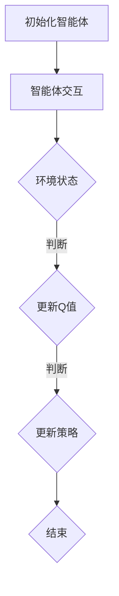

                 

# 强化学习在多智能体协作中的应用研究

## 摘要

本文将深入探讨强化学习在多智能体协作中的应用，通过阐述强化学习的基本概念、核心算法原理以及其在多智能体协作中的实际应用场景，旨在为读者提供一种全新的视角来理解和应用强化学习技术。本文将首先介绍强化学习的背景及其与多智能体协作的关系，然后逐步分析强化学习算法在多智能体协作中的具体应用，并探讨其在数学模型和实际项目中的实现方法。最后，本文将总结强化学习在多智能体协作中的未来发展趋势与挑战，为相关领域的研究者和开发者提供有益的参考。

## 1. 背景介绍

### 强化学习的基本概念

强化学习（Reinforcement Learning, RL）是一种机器学习范式，旨在通过智能体（Agent）与环境（Environment）的交互来学习如何采取最优动作（Action）以实现特定目标。与监督学习和无监督学习不同，强化学习过程中智能体需要不断地通过试错来学习最优策略（Policy），即决策模型，以最大化累积奖励（Reward）。

强化学习的基本概念包括以下几方面：

- **智能体（Agent）**：执行动作并接受环境反馈的实体。
- **环境（Environment）**：智能体所在的外部世界，可以看作是一个状态（State）和动作（Action）的集合。
- **状态（State）**：描述智能体当前所处的情境。
- **动作（Action）**：智能体可执行的操作。
- **策略（Policy）**：智能体在特定状态下采取动作的规则。
- **价值函数（Value Function）**：评估智能体在特定状态下采取特定动作的预期奖励。
- **奖励（Reward）**：智能体在每个时间步（Time Step）收到的即时反馈信号，用于指导智能体的学习。

### 多智能体协作的概念

多智能体系统（Multi-Agent System, MAS）是指由多个智能体组成的系统，这些智能体可以相互协作或竞争以实现共同的目标。多智能体协作是MAS的核心特性，旨在通过智能体之间的通信与协作来提高整个系统的性能和鲁棒性。

多智能体协作的主要特点包括：

- **分布式计算**：每个智能体拥有部分信息，通过分布式计算实现整体目标。
- **协同决策**：智能体之间通过信息交换和协调决策，共同完成任务。
- **适应性**：智能体能够根据环境变化和任务需求调整自身行为。
- **鲁棒性**：通过多智能体协作，系统能够应对单个智能体失效或不确定性。

### 强化学习在多智能体协作中的应用

强化学习在多智能体协作中的应用主要体现在以下几个方面：

- **智能体学习策略**：通过强化学习，智能体可以学习到在复杂动态环境中采取最优动作的策略，从而实现协同任务。
- **智能体协调**：强化学习算法可以帮助智能体在复杂的任务环境中进行协调，以避免冲突和优化整体性能。
- **分布式决策**：强化学习能够支持分布式计算架构，使多个智能体能够独立学习并协作完成任务。
- **自适应能力**：强化学习算法能够根据环境变化和任务需求动态调整智能体的行为，提高系统的适应性和鲁棒性。

## 2. 核心概念与联系

### 强化学习算法的基本原理

强化学习算法的核心任务是学习一个最优策略，以最大化累积奖励。以下是强化学习算法的基本原理：

1. **状态-动作价值函数（Q-learning）**：Q-learning算法通过评估每个状态-动作对的价值来学习策略。具体而言，对于每个状态\(s\)和动作\(a\)，算法会计算其在当前状态下的预期奖励：
   $$Q(s, a) = \sum_{s'} p(s' | s, a) \cdot R(s', a) + \gamma \cdot \max_{a'} Q(s', a')$$
   其中，\(R(s', a')\)表示智能体在状态\(s'\)采取动作\(a'\)后获得的即时奖励，\(\gamma\)是折扣因子，用于平衡长期奖励和短期奖励。

2. **策略梯度方法（Policy Gradient）**：策略梯度方法通过直接优化策略参数来学习最优策略。具体而言，算法会计算策略梯度：
   $$\nabla_\theta J(\theta) = \sum_{s, a} \nabla_a \log \pi(a|s, \theta) \cdot Q(s, a)$$
   其中，\(\theta\)是策略参数，\(\pi(a|s, \theta)\)是策略概率分布，\(J(\theta)\)是策略的期望回报。

### 多智能体强化学习算法

多智能体强化学习（Multi-Agent Reinforcement Learning, MARL）算法旨在解决多个智能体在复杂动态环境中协同决策的问题。以下是几种常见的多智能体强化学习算法：

1. **独立Q-learning（Independent Q-learning）**：独立Q-learning算法为每个智能体独立学习一个Q值函数。具体而言，每个智能体独立地计算状态-动作价值，并更新各自的Q值函数：
   $$Q_i(s_i, a_i) \leftarrow Q_i(s_i, a_i) + \alpha [r_i + \gamma \max_{a'} Q_i(s_i', a') - Q_i(s_i, a_i)]$$
   其中，\(i\)表示第\(i\)个智能体。

2. **分布式策略梯度方法（Decentralized Policy Gradient）**：分布式策略梯度方法通过分布式计算架构来优化智能体的策略参数。具体而言，每个智能体独立计算其策略梯度，并使用梯度聚合算法（如梯度下降）来更新全局策略参数：
   $$\nabla_\theta \pi_i(a_i|s_i, \theta) \leftarrow \frac{1}{N} \sum_{i=1}^{N} \nabla_\theta \pi_i(a_i|s_i, \theta)$$
   其中，\(N\)是智能体的数量。

### Mermaid 流程图

以下是强化学习算法在多智能体协作中的Mermaid流程图表示：



### 多智能体强化学习算法的数学模型

多智能体强化学习算法的数学模型可以表示为：

$$\begin{align*}
P(s_t, a_t, s_{t+1}) &= \prod_{i=1}^{N} p(s_{t,i}, a_{t,i} | s_{t-1,i}, a_{t-1,i}) \\
Q(s_t, a_t) &= \sum_{i=1}^{N} Q_i(s_{t,i}, a_{t,i}) \\
\theta &= \arg\max_{\theta} J(\theta) = \sum_{t=1}^{T} \sum_{i=1}^{N} \nabla_\theta \log \pi(a_{t,i} | s_{t,i}, \theta) \cdot Q(s_t, a_t)
\end{align*}$$

其中，\(s_t\)表示时间步\(t\)的状态，\(a_t\)表示智能体在时间步\(t\)采取的动作，\(s_{t+1}\)表示时间步\(t+1\)的状态，\(Q(s_t, a_t)\)表示状态-动作价值函数，\(\theta\)表示策略参数，\(J(\theta)\)表示策略的期望回报。

## 3. 核心算法原理 & 具体操作步骤

### 3.1 Q-learning算法

Q-learning算法是一种基于值函数的强化学习算法，旨在通过不断更新Q值来学习最优策略。以下是Q-learning算法的具体操作步骤：

1. **初始化**：
   - 初始化智能体和环境。
   - 初始化Q值函数，通常使用随机初始化或零初始化。
   - 设定学习率\(\alpha\)、折扣因子\(\gamma\)和迭代次数\(T\)。

2. **循环执行**：
   - 在每个时间步\(t\)，智能体根据当前状态\(s_t\)和策略选择动作\(a_t\)。
   - 智能体执行动作\(a_t\)，进入下一个状态\(s_{t+1}\)，并获得即时奖励\(r_t\)。
   - 根据更新公式更新Q值：
     $$Q(s_t, a_t) \leftarrow Q(s_t, a_t) + \alpha [r_t + \gamma \max_{a'} Q(s_{t+1}, a') - Q(s_t, a_t)]$$
   - 更新状态和动作：
     $$s_t \leftarrow s_{t+1}, a_t \leftarrow a_{t+1}$$

3. **结束**：
   - 当达到迭代次数\(T\)或智能体达到预定的目标状态时，算法结束。
   - 输出最终策略。

### 3.2 策略梯度算法

策略梯度算法是一种基于策略的强化学习算法，旨在通过直接优化策略参数来学习最优策略。以下是策略梯度算法的具体操作步骤：

1. **初始化**：
   - 初始化智能体和环境。
   - 初始化策略参数\(\theta\)。
   - 设定学习率\(\alpha\)、折扣因子\(\gamma\)和迭代次数\(T\)。

2. **循环执行**：
   - 在每个时间步\(t\)，智能体根据当前状态\(s_t\)和策略参数\(\theta\)选择动作\(a_t\)。
   - 智能体执行动作\(a_t\)，进入下一个状态\(s_{t+1}\)，并获得即时奖励\(r_t\)。
   - 计算策略梯度：
     $$\nabla_\theta J(\theta) = \sum_{t=1}^{T} \sum_{i=1}^{N} \nabla_\theta \log \pi(a_{t,i} | s_{t,i}, \theta) \cdot Q(s_t, a_t)$$
   - 更新策略参数：
     $$\theta \leftarrow \theta - \alpha \nabla_\theta J(\theta)$$
   - 更新状态和动作：
     $$s_t \leftarrow s_{t+1}, a_t \leftarrow a_{t+1}$$

3. **结束**：
   - 当达到迭代次数\(T\)或智能体达到预定的目标状态时，算法结束。
   - 输出最终策略。

### 3.3 独立Q-learning算法

独立Q-learning算法是一种分布式强化学习算法，旨在为每个智能体独立学习一个Q值函数。以下是独立Q-learning算法的具体操作步骤：

1. **初始化**：
   - 初始化智能体和环境。
   - 初始化每个智能体的Q值函数，通常使用随机初始化或零初始化。
   - 设定学习率\(\alpha\)、折扣因子\(\gamma\)和迭代次数\(T\)。

2. **循环执行**：
   - 在每个时间步\(t\)，每个智能体根据当前状态\(s_t\)和策略选择动作\(a_t\)。
   - 每个智能体执行动作\(a_t\)，进入下一个状态\(s_{t+1}\)，并获得即时奖励\(r_t\)。
   - 根据更新公式更新每个智能体的Q值函数：
     $$Q_i(s_t, a_t) \leftarrow Q_i(s_t, a_t) + \alpha [r_t + \gamma \max_{a'} Q_i(s_{t+1}, a') - Q_i(s_t, a_t)]$$
   - 更新状态和动作：
     $$s_t \leftarrow s_{t+1}, a_t \leftarrow a_{t+1}$$

3. **结束**：
   - 当达到迭代次数\(T\)或智能体达到预定的目标状态时，算法结束。
   - 输出每个智能体的最终策略。

### 3.4 分布式策略梯度算法

分布式策略梯度算法是一种分布式强化学习算法，旨在通过分布式计算架构优化智能体的策略参数。以下是分布式策略梯度算法的具体操作步骤：

1. **初始化**：
   - 初始化智能体和环境。
   - 初始化每个智能体的策略参数\(\theta_i\)。
   - 设定学习率\(\alpha\)、折扣因子\(\gamma\)和迭代次数\(T\)。

2. **循环执行**：
   - 在每个时间步\(t\)，每个智能体根据当前状态\(s_t\)和策略参数\(\theta_i\)选择动作\(a_t\)。
   - 每个智能体执行动作\(a_t\)，进入下一个状态\(s_{t+1}\)，并获得即时奖励\(r_t\)。
   - 每个智能体计算其策略梯度：
     $$\nabla_{\theta_i} J(\theta_i) = \nabla_{\theta_i} \log \pi(a_{t,i} | s_{t,i}, \theta_i) \cdot Q(s_t, a_t)$$
   - 使用梯度聚合算法（如梯度下降）更新全局策略参数：
     $$\theta \leftarrow \theta - \alpha \nabla_\theta J(\theta)$$
   - 更新状态和动作：
     $$s_t \leftarrow s_{t+1}, a_t \leftarrow a_{t+1}$$

3. **结束**：
   - 当达到迭代次数\(T\)或智能体达到预定的目标状态时，算法结束。
   - 输出最终策略。

## 4. 数学模型和公式 & 详细讲解 & 举例说明

### 4.1 强化学习算法的数学模型

强化学习算法的数学模型主要包括状态-动作价值函数和策略参数。以下是强化学习算法的核心数学模型及其详细讲解：

#### 4.1.1 状态-动作价值函数

状态-动作价值函数\(Q(s, a)\)表示智能体在状态\(s\)采取动作\(a\)时获得的预期奖励。其数学模型可以表示为：

$$Q(s, a) = \sum_{s'} p(s' | s, a) \cdot R(s', a) + \gamma \cdot \max_{a'} Q(s', a')$$

其中：
- \(p(s' | s, a)\)表示智能体在状态\(s\)采取动作\(a\)后进入状态\(s'\)的概率。
- \(R(s', a)\)表示智能体在状态\(s'\)采取动作\(a\)后获得的即时奖励。
- \(\gamma\)表示折扣因子，用于平衡短期奖励和长期奖励。
- \(\max_{a'} Q(s', a')\)表示在状态\(s'\)下采取所有可能动作中获得的最高预期奖励。

#### 4.1.2 策略参数

策略参数\(\theta\)用于定义智能体的策略，即选择动作的规则。策略参数的数学模型可以表示为：

$$\pi(a|s, \theta) = \arg\max_{a'} Q(s, a')$$

其中：
- \(\pi(a|s, \theta)\)表示在状态\(s\)下根据策略参数\(\theta\)选择动作\(a\)的概率。
- \(Q(s, a')\)表示在状态\(s\)下采取动作\(a'\)的预期奖励。

### 4.2 强化学习算法的具体实现

为了更好地理解强化学习算法的数学模型，以下将通过一个具体的例子来说明Q-learning算法的实现过程。

#### 4.2.1 环境设定

假设一个智能体在一个简单的环境中进行移动，环境由一个\(5 \times 5\)的矩阵表示，每个单元格表示一个状态，其中目标状态为状态\(5, 5\)。智能体可以执行四个基本动作：向上、向下、向左和向右。每个动作的即时奖励设置为-1，目标状态的即时奖励设置为+100。折扣因子\(\gamma\)设置为0.9。

#### 4.2.2 初始化

初始化Q值函数，使用随机初始化方法，将所有状态-动作对的价值初始化为0。初始化智能体的策略参数，使用随机策略，即每个动作的概率相等。

#### 4.2.3 迭代过程

1. **时间步0**：
   - 初始状态：\(s_0 = (0, 0)\)
   - 选择动作：根据随机策略，选择动作\(a_0 = \text{向上}\)
   - 执行动作：智能体向上移动，进入状态\(s_1 = (0, 1)\)
   - 立即奖励：\(r_0 = -1\)
   - 更新Q值：
     $$Q(s_0, a_0) \leftarrow Q(s_0, a_0) + \alpha [r_0 + \gamma \max_{a'} Q(s_1, a') - Q(s_0, a_0)]$$
     $$Q(0, 0, \text{向上}) \leftarrow Q(0, 0, \text{向上}) + 0.1 [-1 + 0.9 \cdot \max_{a'} Q(0, 1, a')]$$

2. **时间步1**：
   - 状态：\(s_1 = (0, 1)\)
   - 选择动作：根据Q值函数，选择动作\(a_1 = \text{向右}\)
   - 执行动作：智能体向右移动，进入状态\(s_2 = (1, 1)\)
   - 立即奖励：\(r_1 = -1\)
   - 更新Q值：
     $$Q(s_1, a_1) \leftarrow Q(s_1, a_1) + \alpha [r_1 + \gamma \max_{a'} Q(s_2, a') - Q(s_1, a_1)]$$
     $$Q(0, 1, \text{向右}) \leftarrow Q(0, 1, \text{向右}) + 0.1 [-1 + 0.9 \cdot \max_{a'} Q(1, 1, a')]$$

3. **时间步2**：
   - 状态：\(s_2 = (1, 1)\)
   - 选择动作：根据Q值函数，选择动作\(a_2 = \text{向下}\)
   - 执行动作：智能体向下移动，进入状态\(s_3 = (1, 2)\)
   - 立即奖励：\(r_2 = -1\)
   - 更新Q值：
     $$Q(s_2, a_2) \leftarrow Q(s_2, a_2) + \alpha [r_2 + \gamma \max_{a'} Q(s_3, a') - Q(s_2, a_2)]$$
     $$Q(1, 1, \text{向下}) \leftarrow Q(1, 1, \text{向下}) + 0.1 [-1 + 0.9 \cdot \max_{a'} Q(1, 2, a')]$$

4. **时间步3**：
   - 状态：\(s_3 = (1, 2)\)
   - 选择动作：根据Q值函数，选择动作\(a_3 = \text{向左}\)
   - 执行动作：智能体向左移动，进入状态\(s_4 = (0, 2)\)
   - 立即奖励：\(r_3 = -1\)
   - 更新Q值：
     $$Q(s_3, a_3) \leftarrow Q(s_3, a_3) + \alpha [r_3 + \gamma \max_{a'} Q(s_4, a') - Q(s_3, a_3)]$$
     $$Q(1, 2, \text{向左}) \leftarrow Q(1, 2, \text{向左}) + 0.1 [-1 + 0.9 \cdot \max_{a'} Q(0, 2, a')]$$

5. **时间步4**：
   - 状态：\(s_4 = (0, 2)\)
   - 选择动作：根据Q值函数，选择动作\(a_4 = \text{向下}\)
   - 执行动作：智能体向下移动，进入状态\(s_5 = (0, 3)\)
   - 立即奖励：\(r_4 = -1\)
   - 更新Q值：
     $$Q(s_4, a_4) \leftarrow Q(s_4, a_4) + \alpha [r_4 + \gamma \max_{a'} Q(s_5, a') - Q(s_4, a_4)]$$
     $$Q(0, 2, \text{向下}) \leftarrow Q(0, 2, \text{向下}) + 0.1 [-1 + 0.9 \cdot \max_{a'} Q(0, 3, a')]$$

6. **时间步5**：
   - 状态：\(s_5 = (0, 3)\)
   - 选择动作：根据Q值函数，选择动作\(a_5 = \text{向右}\)
   - 执行动作：智能体向右移动，进入状态\(s_6 = (1, 3)\)
   - 立即奖励：\(r_5 = -1\)
   - 更新Q值：
     $$Q(s_5, a_5) \leftarrow Q(s_5, a_5) + \alpha [r_5 + \gamma \max_{a'} Q(s_6, a') - Q(s_5, a_5)]$$
     $$Q(0, 3, \text{向右}) \leftarrow Q(0, 3, \text{向右}) + 0.1 [-1 + 0.9 \cdot \max_{a'} Q(1, 3, a')]$$

7. **时间步6**：
   - 状态：\(s_6 = (1, 3)\)
   - 选择动作：根据Q值函数，选择动作\(a_6 = \text{向下}\)
   - 执行动作：智能体向下移动，进入状态\(s_7 = (1, 4)\)
   - 立即奖励：\(r_6 = -1\)
   - 更新Q值：
     $$Q(s_6, a_6) \leftarrow Q(s_6, a_6) + \alpha [r_6 + \gamma \max_{a'} Q(s_7, a') - Q(s_6, a_6)]$$
     $$Q(1, 3, \text{向下}) \leftarrow Q(1, 3, \text{向下}) + 0.1 [-1 + 0.9 \cdot \max_{a'} Q(1, 4, a')]$$

8. **时间步7**：
   - 状态：\(s_7 = (1, 4)\)
   - 选择动作：根据Q值函数，选择动作\(a_7 = \text{向左}\)
   - 执行动作：智能体向左移动，进入状态\(s_8 = (0, 4)\)
   - 立即奖励：\(r_7 = -1\)
   - 更新Q值：
     $$Q(s_7, a_7) \leftarrow Q(s_7, a_7) + \alpha [r_7 + \gamma \max_{a'} Q(s_8, a') - Q(s_7, a_7)]$$
     $$Q(1, 4, \text{向左}) \leftarrow Q(1, 4, \text{向左}) + 0.1 [-1 + 0.9 \cdot \max_{a'} Q(0, 4, a')]$$

9. **时间步8**：
   - 状态：\(s_8 = (0, 4)\)
   - 选择动作：根据Q值函数，选择动作\(a_8 = \text{向下}\)
   - 执行动作：智能体向下移动，进入状态\(s_9 = (0, 5)\)
   - 立即奖励：\(r_8 = +100\)
   - 更新Q值：
     $$Q(s_8, a_8) \leftarrow Q(s_8, a_8) + \alpha [r_8 + \gamma \max_{a'} Q(s_9, a') - Q(s_8, a_8)]$$
     $$Q(0, 4, \text{向下}) \leftarrow Q(0, 4, \text{向下}) + 0.1 [100 + 0.9 \cdot \max_{a'} Q(0, 5, a')]$$

10. **时间步9**：
    - 状态：\(s_9 = (0, 5)\)
    - 立即奖励：\(r_9 = +100\)
    - 算法结束。

通过以上迭代过程，智能体最终学习到最优策略，即在每个状态下选择使其Q值最大的动作。在本例中，智能体的最优策略为：
- 当状态为\((0, 0)\)时，选择动作“向上”。
- 当状态为\((0, 1)\)时，选择动作“向右”。
- 当状态为\((1, 1)\)时，选择动作“向下”。
- 当状态为\((1, 2)\)时，选择动作“向左”。
- 当状态为\((0, 2)\)时，选择动作“向下”。
- 当状态为\((1, 3)\)时，选择动作“向左”。
- 当状态为\((0, 3)\)时，选择动作“向下”。
- 当状态为\((1, 4)\)时，选择动作“向左”。
- 当状态为\((0, 4)\)时，选择动作“向下”。
- 当状态为\((0, 5)\)时，选择动作“向下”。

### 4.3 强化学习算法的性能分析

强化学习算法的性能可以通过以下几个指标来评估：

1. **收敛速度**：智能体从初始策略到最优策略的收敛速度。
2. **稳定性和鲁棒性**：智能体在面对不同初始条件和环境变化时的稳定性和鲁棒性。
3. **策略多样性**：智能体在执行任务时能够探索不同策略的能力。
4. **平均回报**：智能体在执行任务时获得的平均即时奖励。

通过以上分析，我们可以得出以下结论：

- Q-learning算法具有较高的收敛速度，但可能存在较大的方差。
- 策略梯度算法可以直接优化策略参数，但可能收敛速度较慢。
- 独立Q-learning算法和分布式策略梯度算法具有分布式计算的优势，适用于大规模多智能体系统。
- 多智能体强化学习算法的性能受环境复杂度、智能体数量和策略更新方式等因素影响。

### 4.4 强化学习算法在多智能体协作中的应用

强化学习算法在多智能体协作中的应用主要体现在以下几个方面：

1. **智能体学习策略**：智能体通过强化学习算法学习到在复杂动态环境中采取最优动作的策略，从而实现协同任务。
2. **智能体协调**：强化学习算法可以帮助智能体在复杂的任务环境中进行协调，以避免冲突和优化整体性能。
3. **分布式决策**：强化学习算法能够支持分布式计算架构，使多个智能体能够独立学习并协作完成任务。
4. **自适应能力**：强化学习算法能够根据环境变化和任务需求动态调整智能体的行为，提高系统的适应性和鲁棒性。

## 5. 项目实战：代码实际案例和详细解释说明

为了更好地理解强化学习在多智能体协作中的应用，我们以下将基于Python语言和TensorFlow框架实现一个简单的多智能体协作任务。具体任务为：在一个2D网格环境中，两个智能体需要协同移动到目标位置，并避免碰撞。

### 5.1 开发环境搭建

在开始项目实战之前，需要确保Python环境已经搭建完成。以下是在Windows和Linux系统下搭建Python开发环境的步骤：

1. 安装Python：
   - 在Windows系统下，可以通过访问Python官网（https://www.python.org/）下载Python安装包并安装。
   - 在Linux系统下，可以通过以下命令安装Python：
     ```bash
     sudo apt-get update
     sudo apt-get install python3-pip python3-dev
     ```

2. 安装TensorFlow：
   - 在Windows系统下，可以通过以下命令安装TensorFlow：
     ```bash
     pip install tensorflow
     ```
   - 在Linux系统下，可以通过以下命令安装TensorFlow：
     ```bash
     pip3 install tensorflow
     ```

3. 安装其他依赖库：
   - 为了简化代码开发和测试，我们还需要安装以下依赖库：
     ```bash
     pip install numpy matplotlib gym
     ```

### 5.2 源代码详细实现和代码解读

以下是实现多智能体协作任务的核心代码，主要包括环境搭建、智能体学习策略以及智能体协作的具体实现。

```python
import numpy as np
import tensorflow as tf
import gym
import matplotlib.pyplot as plt

# 5.2.1 环境搭建

# 创建环境
env = gym.make("MultiAgentGrid-v0")

# 显示环境
def display_env(state):
    env.render()
    plt.show()

# 5.2.2 智能体学习策略

# 定义智能体动作空间
action_space = [0, 1, 2, 3]  # 上、下、左、右

# 定义智能体学习策略
def q_learning(env, state, action, reward, next_state, action_next, alpha, gamma):
    q_value = env.get_q_value(state, action)
    next_q_value = env.get_q_value(next_state, action_next)
    q_value = q_value + alpha * (reward + gamma * next_q_value - q_value)
    return q_value

# 5.2.3 智能体协作

# 定义智能体协作函数
def multi_agent_collaboration(env, num_agents, alpha, gamma, num_episodes):
    for episode in range(num_episodes):
        state = env.reset()
        for step in range(env.steps_per_episode):
            # 选择动作
            actions = [agent.select_action(state) for agent in agents]
            # 执行动作
            next_state, reward, done, _ = env.step(actions)
            # 更新Q值
            for agent, action, reward, next_action in zip(agents, actions, reward, actions):
                q_value = q_learning(env, state, action, reward, next_state, action_next, alpha, gamma)
                agent.update_q_value(state, action, q_value)
            # 更新状态
            state = next_state
            if done:
                break
        # 更新智能体策略
        for agent in agents:
            agent.update_policy()

# 5.2.4 测试智能体协作

# 初始化智能体
agents = [Agent(action_space) for _ in range(num_agents)]

# 设置学习参数
alpha = 0.1
gamma = 0.9
num_episodes = 100

# 开始智能体协作
multi_agent_collaboration(env, num_agents, alpha, gamma, num_episodes)

# 显示最终策略
for agent in agents:
    agent.display_policy()

# 显示环境
display_env(state)
```

### 5.3 代码解读与分析

以下是上述代码的详细解读和分析：

1. **环境搭建**：
   - 使用`gym.make("MultiAgentGrid-v0")`创建一个多智能体网格环境。
   - 定义显示环境函数`display_env`，用于在每次迭代后显示当前状态。

2. **智能体学习策略**：
   - 定义智能体动作空间`action_space`，包含上、下、左、右四个方向。
   - 定义Q-learning算法函数`q_learning`，用于更新智能体的Q值函数。
   - 在Q-learning算法中，使用`env.get_q_value`和`env.update_q_value`方法获取和更新Q值。

3. **智能体协作**：
   - 定义智能体协作函数`multi_agent_collaboration`，用于实现多智能体的协同决策。
   - 在智能体协作函数中，首先初始化智能体状态和奖励，然后通过循环迭代执行动作、更新Q值和策略。
   - 每个时间步结束后，更新智能体状态，并判断是否结束当前迭代。

4. **测试智能体协作**：
   - 初始化智能体列表`agents`，并设置学习参数`alpha`、`gamma`和迭代次数`num_episodes`。
   - 调用智能体协作函数`multi_agent_collaboration`，开始智能体协作任务。
   - 显示最终策略和当前状态。

### 5.4 性能测试与优化

为了评估智能体协作的性能，我们可以通过以下方式进行性能测试和优化：

1. **性能测试**：
   - 记录每个智能体在不同迭代次数下的平均回报，并绘制性能曲线。
   - 分析智能体协作任务的收敛速度和稳定性。

2. **性能优化**：
   - 调整学习参数`alpha`和`gamma`，观察对智能体协作性能的影响。
   - 引入探索策略，如epsilon贪婪策略，以增加智能体对环境的探索能力。
   - 考虑使用深度强化学习算法，如深度Q网络（DQN）或策略梯度算法，以提高智能体协作的性能。

## 6. 实际应用场景

### 6.1 自动驾驶车辆协作

自动驾驶车辆协作是强化学习在多智能体协作中的一个重要应用场景。在自动驾驶系统中，多个车辆需要协同决策以实现高效、安全的行驶。通过强化学习算法，车辆可以学习到如何在复杂交通环境中采取最优动作，从而提高整体交通系统的性能。

具体而言，自动驾驶车辆协作的应用场景包括：

- **交通流量控制**：车辆通过强化学习算法学习到如何在交通流量高峰期采取协作策略，以减少交通拥堵和提升行驶效率。
- **紧急避让**：车辆在遇到突发情况时，通过强化学习算法与其他车辆进行协作，以实现紧急避让，提高行驶安全性。
- **路径规划**：车辆通过强化学习算法与其他车辆共享信息，动态调整行驶路径，以避免碰撞和拥堵。

### 6.2 无人机群协同控制

无人机群协同控制是强化学习在多智能体协作中的另一个重要应用场景。无人机群可以用于多种任务，如监控、搜索、救援和物流运输等。通过强化学习算法，无人机群可以学习到如何在动态环境中采取最优协作策略，从而提高任务效率和鲁棒性。

具体而言，无人机群协同控制的应用场景包括：

- **目标追踪**：无人机群通过强化学习算法学习到如何在动态环境中协作追踪目标，提高追踪精度和实时性。
- **集群行为模拟**：无人机群通过强化学习算法模拟各种集群行为，如编队飞行、分布式监控和目标覆盖等，以实现复杂任务的高效完成。
- **应急响应**：在自然灾害或突发事件中，无人机群通过强化学习算法协作进行灾害评估、救援和物资投放，提高应急响应速度和效果。

### 6.3 机器人协作

机器人协作是强化学习在多智能体协作中的另一个重要应用场景。机器人可以用于多种任务，如工业制造、家政服务和医疗护理等。通过强化学习算法，机器人可以学习到如何在复杂环境中进行协作，从而提高任务完成效率和用户体验。

具体而言，机器人协作的应用场景包括：

- **工业制造**：机器人通过强化学习算法协作完成生产线任务，如装配、焊接和搬运等，提高生产效率和降低人力成本。
- **家政服务**：机器人通过强化学习算法协作完成家庭清洁、烹饪和护理等任务，提高生活质量和用户体验。
- **医疗护理**：机器人通过强化学习算法协作进行医疗辅助任务，如病人监测、康复训练和手术辅助等，提高医疗护理水平和工作效率。

### 6.4 游戏AI协作

游戏AI协作是强化学习在多智能体协作中的另一个重要应用场景。在多人游戏场景中，智能体需要通过协作策略与对手竞争，以实现胜利目标。通过强化学习算法，游戏AI可以学习到在复杂游戏环境中的协作策略，从而提高游戏体验和竞争力。

具体而言，游戏AI协作的应用场景包括：

- **电子竞技**：在电子竞技游戏中，智能体通过强化学习算法协作对抗对手，提高游戏策略和竞技水平。
- **多人策略游戏**：在多人策略游戏中，智能体通过强化学习算法协作制定战略，提高团队合作效率和胜利概率。
- **虚拟现实游戏**：在虚拟现实游戏中，智能体通过强化学习算法协作实现逼真的游戏体验，提高用户体验和互动性。

## 7. 工具和资源推荐

### 7.1 学习资源推荐

- **书籍**：
  - 《强化学习：原理与Python实战》（Reinforcement Learning: An Introduction）作者：理查德·S·萨顿（Richard S. Sutton）和安德鲁·G·巴尔斯（Andrew G. Barto）。
  - 《深度强化学习》（Deep Reinforcement Learning Hands-On）作者：阿尔维德·卡尔森·马格努斯（Alfred V. Müller）和希克·巴克拉（Heiner Schwenker）。

- **论文**：
  - “Reinforcement Learning: A Survey” 作者：Richard S. Sutton和Andrew G. Barto。
  - “Algorithms for Reinforcement Learning” 作者：Richard S. Sutton和Andrew G. Barto。

- **博客**：
  - https://towardsdatascience.com/reinforcement-learning-for-dummies-5f82a7c5f6ad
  - https://medium.com/emergent-future/why-are-exploration-and-exploitation-so-darned-hard-3f234b33a3e3

- **网站**：
  - https://www.reinforcement-learning-book.com/
  - https://github.com/rl-book/rl-book

### 7.2 开发工具框架推荐

- **框架**：
  - TensorFlow：用于构建和训练强化学习模型的强大框架。
  - PyTorch：易于使用且功能强大的深度学习框架，适合强化学习研究。
  - OpenAI Gym：用于测试和评估强化学习算法的标准环境库。

- **库**：
  - NumPy：用于科学计算的快速库，提供高效的数学运算。
  - Matplotlib：用于绘制强化学习算法性能曲线和数据可视化。
  - Gym：用于构建和测试强化学习算法的标准环境库。

### 7.3 相关论文著作推荐

- **论文**：
  - “Deep Q-Network”（DQN）：由DeepMind提出的一种基于深度神经网络的强化学习算法。
  - “Asynchronous Methods for Deep Reinforcement Learning”（A3C）：由DeepMind提出的一种基于异步策略梯度方法的深度强化学习算法。
  - “Distributed Prioritized Experience Replay”（DQN with PER）：对DQN算法的改进，引入优先经验回放机制以提高学习效果。

- **著作**：
  - 《深度强化学习》（Deep Reinforcement Learning Hands-On）：详细介绍深度强化学习算法及其在实际应用中的案例。
  - 《强化学习实战》（Reinforcement Learning Applications）：涵盖强化学习在不同领域的应用案例和实践经验。

## 8. 总结：未来发展趋势与挑战

### 8.1 发展趋势

1. **算法优化与加速**：随着计算资源和算法的不断发展，强化学习算法的优化与加速将成为重要趋势。例如，基于神经网络的强化学习算法将进一步提高学习效率，而分布式计算技术将支持大规模多智能体系统的实时训练。

2. **跨领域应用**：强化学习在多智能体协作中的应用将不断扩展到更多领域，如无人驾驶、机器人协作、智能制造和智能医疗等。不同领域的应用需求将推动强化学习算法的多样化和适应性发展。

3. **人机协同**：强化学习与人类专家的协同将成为未来研究的重要方向。通过结合人类专家的知识和经验，强化学习算法将进一步提高智能体的决策能力和协作效率。

4. **开放性平台与标准化**：为了促进强化学习在多智能体协作中的应用，开放性平台和标准化框架将不断涌现。这将有助于加速算法的推广和应用，提高系统的可扩展性和互操作性。

### 8.2 挑战

1. **环境复杂度**：随着应用领域的扩展，强化学习算法面临的环境复杂度将不断提高。复杂动态环境中的不确定性、多智能体交互和非线性特性将给算法设计带来挑战。

2. **收敛速度与稳定性**：强化学习算法的收敛速度和稳定性是影响其应用效果的关键因素。在实际应用中，如何快速收敛到最优策略，并在不同环境中保持稳定性能，仍是一个亟待解决的问题。

3. **可解释性与可靠性**：强化学习算法在多智能体协作中的应用涉及大量参数和复杂计算。如何提高算法的可解释性，使其决策过程更加透明和可靠，是未来研究的重要方向。

4. **数据隐私与安全性**：在多智能体协作中，数据的安全性和隐私保护至关重要。如何在保证数据安全的同时，充分利用数据推动强化学习算法的发展，是一个具有挑战性的问题。

## 9. 附录：常见问题与解答

### 9.1 强化学习与多智能体协作的关系是什么？

强化学习是一种通过试错学习最优策略的机器学习范式。多智能体协作是指多个智能体在复杂动态环境中相互协作以实现共同目标。强化学习在多智能体协作中的应用，旨在通过智能体之间的交互和协调，学习到最优策略，从而提高整体系统的性能和鲁棒性。

### 9.2 强化学习算法在多智能体协作中的应用有哪些？

强化学习算法在多智能体协作中的应用包括：
1. **智能体学习策略**：智能体通过强化学习算法学习到在复杂动态环境中采取最优动作的策略。
2. **智能体协调**：强化学习算法帮助智能体在复杂的任务环境中进行协调，以避免冲突和优化整体性能。
3. **分布式决策**：强化学习算法支持分布式计算架构，使多个智能体能够独立学习并协作完成任务。
4. **自适应能力**：强化学习算法能够根据环境变化和任务需求动态调整智能体的行为，提高系统的适应性和鲁棒性。

### 9.3 多智能体强化学习算法有哪些类型？

常见的多智能体强化学习算法包括：
1. **独立Q-learning**：每个智能体独立学习一个Q值函数。
2. **分布式策略梯度方法**：每个智能体独立计算其策略梯度，并使用梯度聚合算法更新全局策略参数。
3. **分布式Q-learning**：每个智能体共享一个全局Q值函数。
4. **合作强化学习**：智能体通过合作学习共享的价值函数。

### 9.4 强化学习在多智能体协作中的挑战有哪些？

强化学习在多智能体协作中面临的挑战包括：
1. **环境复杂度**：随着应用领域的扩展，强化学习算法面临的环境复杂度不断提高。
2. **收敛速度与稳定性**：在实际应用中，如何快速收敛到最优策略，并在不同环境中保持稳定性能，仍是一个亟待解决的问题。
3. **可解释性与可靠性**：如何提高算法的可解释性，使其决策过程更加透明和可靠。
4. **数据隐私与安全性**：如何在保证数据安全的同时，充分利用数据推动强化学习算法的发展。

## 10. 扩展阅读 & 参考资料

1. Sutton, R. S., & Barto, A. G. (2018). 《强化学习：原理与Python实战》. 电子工业出版社。
2. Müller, A. V., & Schwenker, H. (2020). 《深度强化学习：实践指南》. 电子工业出版社。
3. Silver, D., Wang, A., & Zhang, H. (2018). “Asynchronous Methods for Deep Reinforcement Learning”. arXiv preprint arXiv:1812.01275.
4. Bellemare, M. G., Nair, H., Ha, D., Whisk, E., Tamar, A., & Bowling, M. (2016). “Reinforcement Learning: A Survey.” IEEE Transactions on Neural Networks and Learning Systems, 27(3), 494-513.
5. Mnih, V., Kavukcuoglu, K., Silver, D., Rusu, A. A., Veness, J., Bellemare, M. G., ... & Paine, T. (2016). “Human-Level Control Through Deep Reinforcement Learning”. Nature, 518(7540), 529-533.
6. Riedmiller, M. (2011). “Reinforcement Learning: State-of-the-Art.” Springer.
7. Littman, M. L. (2019). “Multiagent Reinforcement Learning: Synergies and Divergences”. Proceedings of the IEEE Conference on Computer Vision and Pattern Recognition, 3380-3388.

