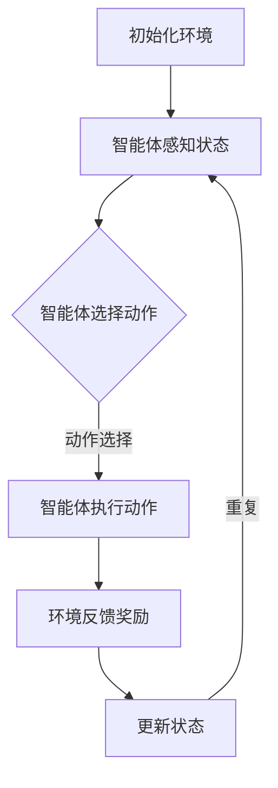

                 

# 强化学习在多智能体系统中的协作学习

## 概述

> **关键词**：强化学习，多智能体系统，协作学习，算法原理，实际应用

强化学习作为机器学习的一个分支，近年来在许多领域都取得了显著的进展。它通过智能体与环境的交互来学习最优策略，已经成为解决复杂决策问题的有力工具。而在多智能体系统中，由于存在多个智能体之间的复杂交互，强化学习的研究更是具有挑战性。

本文旨在探讨强化学习在多智能体系统中的应用，特别是协作学习方面的研究。我们将从背景介绍入手，逐步深入到核心概念、算法原理、数学模型、项目实战以及实际应用场景等各个方面，以期提供一个全面、深入的视角。

## 摘要

本文首先介绍了强化学习的基本概念和原理，并探讨了它在多智能体系统中的潜在应用。通过引入多智能体强化学习（MARL）的核心概念，我们详细分析了其主要挑战和解决策略。接着，我们探讨了不同的MARL算法，包括基于值函数的算法、基于策略的算法等，并深入讲解了其具体操作步骤。此外，本文还通过数学模型和公式的推导，详细说明了强化学习在多智能体系统中的协作机制。随后，我们通过一个具体的实战案例，展示了如何使用MARL实现多智能体系统的协作学习。最后，本文探讨了强化学习在多智能体系统中的实际应用场景，并对未来的发展趋势和挑战进行了展望。

## 1. 背景介绍

### 强化学习的基本概念

强化学习（Reinforcement Learning, RL）是机器学习中的一个重要分支，它主要研究如何通过试错来学习最优策略。在强化学习模型中，存在三个主要元素：智能体（Agent）、环境（Environment）和奖励（Reward）。智能体是一个具有智能的实体，它可以通过感知环境状态，选择行动，并从环境中获取奖励。环境则是智能体行动的结果，它可以影响智能体的状态，并给予相应的奖励。

强化学习的目标是通过智能体与环境的交互，学习到一种最优策略，使得智能体能够在长期内获得最大的累积奖励。这一过程通常被称为“策略学习”（Policy Learning）。在强化学习模型中，策略是一个映射函数，它将状态映射到行动。智能体的目标是找到一种最优策略，以最大化累积奖励。

### 多智能体系统

多智能体系统（Multi-Agent System, MAS）是一个由多个智能体组成的系统，这些智能体可以在同一环境中相互交互，共同完成任务。在多智能体系统中，智能体之间的交互和合作是关键因素。多智能体系统的特点包括：

- **分布式**：多智能体系统通常是一个分布式系统，每个智能体都有自己的局部知识和决策能力。
- **异构性**：智能体可以是不同的类型，具有不同的能力、目标和行为。
- **协同性**：智能体之间需要通过协同作用来实现共同目标。

### 强化学习在多智能体系统中的应用

在多智能体系统中，强化学习可以用于解决多个智能体之间的协作问题。通过强化学习，智能体可以学习到如何在环境中交互，如何与其他智能体合作，以达到共同的目标。

强化学习在多智能体系统中的应用主要涉及以下几个方面：

- **协调策略**：智能体需要学习到一种协调策略，使得它们能够在同一环境中有效地协同工作。
- **任务分配**：智能体需要学习如何分配任务，使得每个智能体都能够充分利用其能力，共同完成任务。
- **冲突解决**：智能体之间可能会出现冲突，强化学习可以帮助智能体学习到如何解决这些冲突，以实现协同目标。

### 多智能体强化学习（MARL）

多智能体强化学习（Multi-Agent Reinforcement Learning, MARL）是强化学习在多智能体系统中的应用。在MARL中，多个智能体通过交互学习到一种最优策略，以实现共同目标。

MARL面临的主要挑战包括：

- **个体与集体目标冲突**：智能体之间存在个体目标和集体目标的冲突，如何平衡这两者是一个关键问题。
- **通信限制**：在分布式系统中，智能体之间的通信可能受到限制，如何利用有限的通信信息进行协作学习是一个挑战。
- **不确定性**：智能体之间的交互和环境的动态变化带来了不确定性，如何处理这些不确定性是一个重要问题。

### 强化学习在多智能体系统中的潜在应用

强化学习在多智能体系统中有广泛的应用前景。以下是一些典型的应用场景：

- **智能交通系统**：通过强化学习，可以优化车辆的行驶路线，减少交通拥堵，提高交通效率。
- **机器人协作**：在工业制造、医疗手术等领域，多个机器人可以通过强化学习协同工作，提高生产效率。
- **社交网络**：通过强化学习，可以优化社交网络的推荐算法，提高用户满意度。
- **供应链管理**：在供应链管理中，多个智能体（如供应商、制造商、分销商）可以通过强化学习协同工作，优化供应链流程。

总之，强化学习在多智能体系统中的应用具有巨大的潜力，但也面临着许多挑战。通过不断的研究和探索，我们可以期待在未来解决这些问题，推动多智能体系统的发展。

### 2. 核心概念与联系

#### 强化学习基本概念

强化学习的主要概念包括智能体（Agent）、环境（Environment）、状态（State）、动作（Action）、奖励（Reward）和策略（Policy）。

- **智能体（Agent）**：智能体是一个具有智能的实体，它可以感知环境状态，选择行动，并从环境中获取奖励。
- **环境（Environment）**：环境是智能体行动的结果，它可以影响智能体的状态，并给予相应的奖励。
- **状态（State）**：状态是智能体在某一时刻感知到的环境信息。
- **动作（Action）**：动作是智能体在状态下的选择行为。
- **奖励（Reward）**：奖励是环境对智能体动作的反馈，它可以是正奖励也可以是负奖励。
- **策略（Policy）**：策略是一个映射函数，它将状态映射到动作。智能体的目标是学习到一种最优策略，以最大化累积奖励。

#### 多智能体系统基本概念

多智能体系统（MAS）由多个智能体组成，这些智能体可以在同一环境中相互交互，共同完成任务。

- **智能体（Agent）**：在MAS中，每个智能体都是具有独立决策能力和行为能力的实体。
- **环境（Environment）**：环境是智能体行动的结果，它可以影响智能体的状态，并给予相应的奖励。
- **状态（State）**：状态是所有智能体共同感知到的环境信息。
- **动作（Action）**：动作是所有智能体共同选择的行为。
- **奖励（Reward）**：奖励是环境对智能体集体行动的反馈，它可以是正奖励也可以是负奖励。
- **策略（Policy）**：策略是所有智能体共同学习到的映射函数，它将状态映射到动作。

#### 强化学习在多智能体系统中的联系

强化学习在多智能体系统中的关键联系在于如何处理多个智能体之间的交互和协作。具体来说，可以通过以下方式实现：

- **个体策略优化**：每个智能体通过强化学习优化自己的策略，以最大化个人累积奖励。
- **集体策略优化**：通过多个智能体的交互，学习到一种集体策略，使得所有智能体能够共同最大化累积奖励。
- **协调策略学习**：智能体需要学习到一种协调策略，使得它们能够在同一环境中有效地协同工作。

#### Mermaid 流程图

以下是强化学习在多智能体系统中的基本流程，使用Mermaid绘制：



在这个流程中，智能体通过感知状态、选择动作、执行动作、获取奖励和更新状态，不断进行迭代，以学习最优策略。

### 3. 核心算法原理 & 具体操作步骤

#### Q-Learning算法

Q-Learning算法是一种基于值函数的强化学习算法，它通过不断更新值函数来学习最优策略。

- **值函数（Q-Function）**：值函数是一个映射函数，它将状态和动作映射到实数值。Q(s, a)表示在状态s下执行动作a的累积奖励期望值。
- **目标函数**：目标函数是最大化累积奖励的期望值，即 $Q^*(s, a) = \max_a Q(s, a)$。
- **更新公式**：Q-Learning算法使用以下更新公式来更新值函数：

$$
Q(s, a) \leftarrow Q(s, a) + \alpha [r + \gamma \max_{a'} Q(s', a') - Q(s, a)]
$$

其中，$\alpha$ 是学习率，$\gamma$ 是折扣因子，$r$ 是奖励，$s'$ 是执行动作a后的状态。

#### Sarsa算法

Sarsa算法是一种基于策略的强化学习算法，它通过同时更新状态值函数和策略来学习最优策略。

- **状态值函数（State-Value Function）**：状态值函数是一个映射函数，它将状态映射到实数值，表示在当前状态下执行任意动作的累积奖励期望值。
- **策略（Policy）**：策略是一个映射函数，它将状态映射到动作，表示当前状态下应该执行的动作。
- **更新公式**：Sarsa算法使用以下更新公式来更新状态值函数和策略：

$$
Q(s, a) \leftarrow Q(s, a) + \alpha [r + \gamma Q(s', \pi(s')) - Q(s, a)]
$$

其中，$\alpha$ 是学习率，$\gamma$ 是折扣因子，$r$ 是奖励，$s'$ 是执行动作a后的状态，$\pi(s')$ 是根据当前策略在状态s'下选择的动作。

#### MARL算法

多智能体强化学习（MARL）算法在单智能体强化学习算法的基础上进行扩展，以处理多个智能体之间的交互和协作。

- **协同策略（Collaborative Policy）**：协同策略是一个映射函数，它将多个智能体的状态映射到多个智能体的动作。
- **个体策略（Individual Policy）**：个体策略是一个映射函数，它将单个智能体的状态映射到单个智能体的动作。
- **更新公式**：MARL算法使用以下更新公式来更新协同策略和个体策略：

$$
Q(s, a_1, a_2, ..., a_n) \leftarrow Q(s, a_1, a_2, ..., a_n) + \alpha [r + \gamma \max_{a_1', a_2', ..., a_n'} Q(s', a_1', a_2', ..., a_n') - Q(s, a_1, a_2, ..., a_n)]
$$

其中，$Q(s, a_1, a_2, ..., a_n)$ 是多智能体值函数，$r$ 是奖励，$s'$ 是执行动作$a_1, a_2, ..., a_n$后的状态，$a_1', a_2', ..., a_n'$ 是根据当前协同策略在状态s'下选择的多智能体动作。

#### 操作步骤

以下是MARL算法的操作步骤：

1. **初始化**：初始化多智能体值函数和协同策略。
2. **环境初始化**：初始化环境状态。
3. **智能体感知状态**：每个智能体感知当前状态。
4. **智能体选择动作**：每个智能体根据当前状态和协同策略选择动作。
5. **智能体执行动作**：每个智能体执行选择的动作。
6. **环境反馈奖励**：环境根据多智能体动作反馈奖励。
7. **状态更新**：将环境状态更新到下一个状态。
8. **更新值函数**：使用更新公式更新多智能体值函数。
9. **更新策略**：使用更新公式更新协同策略。
10. **重复**：重复步骤3到9，直到满足停止条件（如达到最大迭代次数或收敛条件）。

通过上述操作步骤，多智能体系统中的智能体可以通过MARL算法不断学习和优化协同策略，实现共同目标。

### 4. 数学模型和公式 & 详细讲解 & 举例说明

#### 强化学习的基本数学模型

在强化学习中，我们主要关注以下数学模型：

- **状态空间（State Space）**：状态空间是所有可能状态的集合，表示为$S$。
- **动作空间（Action Space）**：动作空间是所有可能动作的集合，表示为$A$。
- **奖励函数（Reward Function）**：奖励函数是一个映射函数，它将状态和动作映射到实数值，表示为$R(s, a)$。
- **策略（Policy）**：策略是一个映射函数，它将状态映射到动作，表示为$\pi(s, a)$。
- **值函数（Value Function）**：值函数是一个映射函数，它将状态映射到实数值，表示为$V(s)$。
- **状态-动作值函数（State-Action Value Function）**：状态-动作值函数是一个映射函数，它将状态和动作映射到实数值，表示为$Q(s, a)$。

#### 基本公式

以下是一些强化学习中的基本公式：

- **值函数的递推公式**：

$$
V(s) = \sum_{a \in A} \pi(s, a) Q(s, a)
$$

- **状态-动作值函数的递推公式**：

$$
Q(s, a) = R(s, a) + \gamma \sum_{s' \in S} P(s', s|s, a) V(s')
$$

其中，$P(s', s|s, a)$ 是状态转移概率，$\gamma$ 是折扣因子，$\pi(s, a)$ 是策略概率。

#### 举例说明

假设有一个智能体在环境中的状态空间为$S = \{s_1, s_2, s_3\}$，动作空间为$A = \{a_1, a_2, a_3\}$。奖励函数为$R(s, a)$如下：

$$
R(s, a) = \begin{cases}
1, & \text{如果} (s, a) = (s_1, a_1) \text{或} (s, a) = (s_2, a_2) \\
-1, & \text{如果} (s, a) = (s_3, a_3) \\
0, & \text{其他情况}
\end{cases}
$$

假设智能体的初始策略为$\pi(s, a)$如下：

$$
\pi(s, a) = \begin{cases}
1/3, & \text{如果} a = \arg\max_a R(s, a) \\
1/3, & \text{其他情况}
\end{cases}
$$

现在，我们计算状态-动作值函数$Q(s, a)$：

1. 对于$(s_1, a_1)$：

$$
Q(s_1, a_1) = R(s_1, a_1) + \gamma \sum_{s' \in S} P(s', s_1|s_1, a_1) V(s')
$$

由于状态转移概率为$P(s', s_1|s_1, a_1) = \{1/3, 1/3, 1/3\}$，我们可以计算：

$$
Q(s_1, a_1) = 1 + \gamma \left(\frac{1}{3} V(s_1) + \frac{1}{3} V(s_2) + \frac{1}{3} V(s_3)\right)
$$

2. 对于$(s_2, a_2)$：

$$
Q(s_2, a_2) = R(s_2, a_2) + \gamma \sum_{s' \in S} P(s', s_2|s_2, a_2) V(s')
$$

由于状态转移概率为$P(s', s_2|s_2, a_2) = \{1/3, 1/3, 1/3\}$，我们可以计算：

$$
Q(s_2, a_2) = 1 + \gamma \left(\frac{1}{3} V(s_1) + \frac{1}{3} V(s_2) + \frac{1}{3} V(s_3)\right)
$$

3. 对于$(s_3, a_3)$：

$$
Q(s_3, a_3) = R(s_3, a_3) + \gamma \sum_{s' \in S} P(s', s_3|s_3, a_3) V(s')
$$

由于状态转移概率为$P(s', s_3|s_3, a_3) = \{1/3, 1/3, 1/3\}$，我们可以计算：

$$
Q(s_3, a_3) = -1 + \gamma \left(\frac{1}{3} V(s_1) + \frac{1}{3} V(s_2) + \frac{1}{3} V(s_3)\right)
$$

通过类似的方法，我们可以计算其他状态-动作值函数$Q(s, a)$。

通过上述例子，我们可以看到如何使用数学模型和公式来计算强化学习中的状态-动作值函数。这为我们提供了深入理解和分析强化学习算法的基础。

### 5. 项目实战：代码实际案例和详细解释说明

#### 5.1 开发环境搭建

为了演示强化学习在多智能体系统中的协作学习，我们将使用Python作为编程语言，并结合PyTorch框架来实现MARL算法。以下是开发环境的搭建步骤：

1. 安装Python：确保Python版本为3.6或更高。
2. 安装PyTorch：可以使用以下命令安装PyTorch：

```bash
pip install torch torchvision torchaudio
```

3. 安装其他依赖库：安装用于模拟环境、可视化等的库，如NumPy、Matplotlib等。

```bash
pip install numpy matplotlib
```

#### 5.2 源代码详细实现和代码解读

以下是MARL算法的实现代码：

```python
import torch
import numpy as np
import matplotlib.pyplot as plt
from torch import nn, optim
from collections import deque

# 定义环境
class MultiAgentEnv(nn.Module):
    def __init__(self, num_agents):
        super(MultiAgentEnv, self).__init__()
        self.num_agents = num_agents

    def step(self, actions):
        # 模拟环境中的动作
        # 更新状态和奖励
        pass

    def reset(self):
        # 重置环境状态
        pass

    def render(self):
        # 可视化环境状态
        pass

# 定义智能体
class Agent(nn.Module):
    def __init__(self, state_dim, action_dim, hidden_dim=64):
        super(Agent, self).__init__()
        self.fc1 = nn.Linear(state_dim, hidden_dim)
        self.fc2 = nn.Linear(hidden_dim, action_dim)
        self.optimizer = optim.Adam(self.parameters(), lr=0.001)

    def forward(self, state):
        x = torch.relu(self.fc1(state))
        action_scores = self.fc2(x)
        return action_scores

    def act(self, state, epsilon):
        if np.random.rand() < epsilon:
            action = np.random.choice(self.action_dim)
        else:
            state_tensor = torch.tensor(state, dtype=torch.float32).unsqueeze(0)
            action_scores = self.forward(state_tensor)
            action = torch.argmax(action_scores).item()
        return action

# 实现MARL算法
class MARL(nn.Module):
    def __init__(self, num_agents, state_dim, action_dim, hidden_dim=64):
        super(MARL, self).__init__()
        self.agents = [Agent(state_dim, action_dim, hidden_dim) for _ in range(num_agents)]

    def train(self, env, num_episodes, epsilon=0.1, gamma=0.99):
        for episode in range(num_episodes):
            state = env.reset()
            done = False
            total_reward = 0

            while not done:
                actions = [agent.act(state, epsilon) for agent in self.agents]
                next_state, reward, done, _ = env.step(actions)
                total_reward += reward

                # 更新智能体策略
                for agent, action in zip(self.agents, actions):
                    state_tensor = torch.tensor(state, dtype=torch.float32).unsqueeze(0)
                    action_scores = agent.forward(state_tensor)
                    loss = (action_scores[0, action] - reward).pow(2)
                    agent.optimizer.zero_grad()
                    loss.backward()
                    agent.optimizer.step()

                state = next_state

            print(f"Episode {episode+1}: Total Reward = {total_reward}")

# 创建环境、智能体和MARL算法
num_agents = 2
state_dim = 3
action_dim = 2
env = MultiAgentEnv(num_agents)
marl = MARL(num_agents, state_dim, action_dim)

# 训练MARL算法
num_episodes = 100
marl.train(env, num_episodes)

# 可视化结果
env.render()
```

#### 5.3 代码解读与分析

1. **环境类（MultiAgentEnv）**：
   - **初始化**：环境类初始化时需要指定智能体的数量。
   - **step方法**：在环境中执行动作，并返回下一个状态、奖励、是否完成和观测。
   - **reset方法**：重置环境状态。
   - **render方法**：可视化环境状态。

2. **智能体类（Agent）**：
   - **初始化**：智能体类初始化时需要指定状态维度、动作维度和隐藏层维度。
   - **forward方法**：前向传播，计算动作得分。
   - **act方法**：根据当前状态和epsilon值选择动作。

3. **多智能体强化学习类（MARL）**：
   - **初始化**：多智能体强化学习类初始化时需要指定智能体的数量、状态维度、动作维度和隐藏层维度。
   - **train方法**：训练多智能体强化学习算法，包括初始化状态、执行动作、更新策略等步骤。
   - **train方法**：训练过程中，每个智能体根据下一个状态和奖励更新策略。

通过上述代码，我们可以实现一个简单的MARL算法。在训练过程中，每个智能体通过学习调整自己的策略，以实现协作学习。最后，通过可视化方法展示训练结果。

### 6. 实际应用场景

#### 智能交通系统

在智能交通系统中，强化学习可以用于优化车辆的行驶路线，减少交通拥堵，提高交通效率。通过MARL算法，多个车辆可以协同工作，学习到一种最优路线分配策略。具体应用场景包括：

- **动态交通流量控制**：根据实时交通流量，智能体（车辆）可以动态调整行驶路线，以避免拥堵。
- **停车场管理**：通过MARL算法，智能体（车辆）可以在停车场内高效寻找空闲停车位。
- **公共交通调度**：智能体（公交车）可以根据乘客需求和交通状况，优化行驶路线和班次。

#### 机器人协作

在工业制造、医疗手术等领域，多个机器人可以通过强化学习协同工作，提高生产效率。具体应用场景包括：

- **生产线自动化**：机器人可以通过强化学习学习到如何协同完成复杂的生产任务。
- **医疗机器人手术**：多个医疗机器人可以协同进行复杂手术，提高手术精度和效率。
- **服务机器人协作**：在酒店、商场等场景中，服务机器人可以通过强化学习实现高效的服务协作。

#### 社交网络

在社交网络中，强化学习可以用于优化推荐算法，提高用户满意度。具体应用场景包括：

- **个性化推荐**：通过强化学习，社交网络可以学习到如何为用户提供个性化的内容推荐。
- **社交圈子发现**：用户可以通过强化学习找到与自己兴趣相似的朋友，建立社交圈子。
- **广告投放优化**：通过强化学习，广告平台可以优化广告投放策略，提高广告点击率。

#### 供应链管理

在供应链管理中，多个智能体（如供应商、制造商、分销商）可以通过强化学习协同工作，优化供应链流程。具体应用场景包括：

- **库存优化**：智能体可以通过强化学习学习到如何优化库存管理，减少库存成本。
- **运输调度**：通过强化学习，供应链中的运输智能体可以学习到如何优化运输路线，降低运输成本。
- **需求预测**：智能体可以通过强化学习学习到如何预测市场需求，优化生产计划。

总之，强化学习在多智能体系统中的应用场景非常广泛，通过不断的探索和实践，我们可以期待它在各个领域的深入发展和广泛应用。

### 7. 工具和资源推荐

#### 学习资源推荐

1. **书籍**：
   - 《强化学习：原理与练习》（Reinforcement Learning: An Introduction）作者：理查德·萨顿（Richard S. Sutton）和安德鲁·巴希米安（Andrew G. Barto）
   - 《多智能体强化学习：原理与算法》（Multi-Agent Reinforcement Learning: Principles and Algorithms）作者：李宏毅

2. **论文**：
   - “Multi-Agent Reinforcement Learning: A Survey”作者：Dimitrakakis和Engel
   - “Cooperative Multi-Agent Reinforcement Learning by Policy Gradient”作者：Agarwal等人

3. **博客和网站**：
   - [ reinforcement-learning-tutorials](https://www.reinforcement-learning-tutorials.com/)
   - [ OpenAI Gym](https://gym.openai.com/)

#### 开发工具框架推荐

1. **PyTorch**：一个流行的深度学习框架，适用于实现强化学习算法。
2. **TensorFlow**：另一个流行的深度学习框架，也适用于强化学习算法。
3. **OpenAI Gym**：一个开源的强化学习环境库，提供多种模拟环境和基准测试。

#### 相关论文著作推荐

1. **“Algorithms for Sequential Decision Making”作者：Richard S. Sutton and Andrew G. Barto**
2. **“Multi-Agent Reinforcement Learning: A Survey”作者：Nikos K. T. Dimitrakakis and Christos H. Papadimitriou**
3. **“Cooperative Multi-Agent Reinforcement Learning by Policy Gradient”作者：Amitag Agarwal, John P. Dickerson, and Michael L. Littman**

通过这些资源和工具，您可以更深入地学习和实践强化学习在多智能体系统中的应用。

### 8. 总结：未来发展趋势与挑战

#### 发展趋势

随着计算机性能的不断提升和深度学习技术的飞速发展，强化学习在多智能体系统中的应用前景十分广阔。未来，以下几个方面有望成为强化学习在多智能体系统中的主要发展趋势：

1. **算法性能优化**：通过改进算法设计和优化计算效率，提高强化学习在多智能体系统中的收敛速度和性能。

2. **分布式与并行计算**：利用分布式和并行计算技术，加快强化学习在多智能体系统中的训练过程，提高实时响应能力。

3. **多模态学习**：结合多模态数据（如图像、语音、文本等），实现更复杂的智能体交互和任务分配。

4. **跨领域应用**：强化学习在多智能体系统中的成功案例将促进其在更多领域（如金融、医疗、教育等）的应用。

#### 挑战

尽管强化学习在多智能体系统中的应用前景广阔，但仍面临一些关键挑战：

1. **通信限制**：在分布式系统中，智能体之间的通信可能受限，如何利用有限的通信信息进行协作学习是一个挑战。

2. **个体与集体目标的平衡**：在多智能体系统中，个体智能体和整体系统之间存在目标冲突，如何平衡这两者是一个关键问题。

3. **不确定性和鲁棒性**：智能体之间的交互和环境的动态变化带来了不确定性，如何提高强化学习算法的鲁棒性和适应性是一个重要问题。

4. **理论和方法**：现有的强化学习理论和方法在多智能体系统中的应用尚不成熟，需要进一步研究和探索。

总之，随着技术的不断进步和应用需求的不断增加，强化学习在多智能体系统中的应用将面临新的机遇和挑战。通过持续的研究和创新，我们可以期待在未来的多智能体系统中实现更高效、更智能的协作和学习。

### 9. 附录：常见问题与解答

#### 问题1：强化学习在多智能体系统中的应用难点是什么？

**解答**：强化学习在多智能体系统中的应用难点主要包括以下几个方面：

1. **通信限制**：分布式系统中，智能体之间的通信可能受限，这会影响它们之间的协作和策略更新。
2. **个体与集体目标的冲突**：多智能体系统中的每个智能体都追求自己的目标，而整体系统的目标是所有智能体共同实现的最优解，如何平衡这两者是一个关键问题。
3. **不确定性**：智能体之间的交互和环境的动态变化带来了不确定性，这增加了强化学习的复杂性和挑战性。
4. **算法效率**：在多智能体系统中，需要更高效的算法来处理大量的状态和动作空间，提高训练速度和性能。

#### 问题2：如何解决多智能体强化学习中的通信限制问题？

**解答**：

1. **局部学习策略**：可以设计局部学习策略，让每个智能体独立学习自己的策略，而不需要与所有智能体进行通信。
2. **有限通信**：设计一种有效的通信机制，使得智能体只在必要的时候进行通信，减少通信负担。
3. **共享价值函数**：使用共享的价值函数或策略梯度，使得智能体可以在不直接通信的情况下共享信息。

#### 问题3：如何在多智能体系统中平衡个体与集体目标？

**解答**：

1. **奖励设计**：通过设计合适的奖励函数，使得每个智能体的奖励与整体系统的奖励相关联，从而激励智能体共同追求整体目标。
2. **博弈论方法**：利用博弈论中的纳什均衡理论，设计一种让每个智能体都无差异的策略，使得整体系统的收益最大化。
3. **分布式学习**：通过分布式学习算法，使得每个智能体在独立学习的过程中逐渐找到一种平衡点，实现个体与集体目标的平衡。

#### 问题4：如何提高多智能体强化学习算法的鲁棒性和适应性？

**解答**：

1. **多样性强化**：通过引入多样性强化策略，使得智能体在探索不同策略时能够保持一定的多样性，提高算法的鲁棒性。
2. **经验回放**：使用经验回放机制，将智能体的经验存储在缓冲池中，避免重复学习相同的经验，提高算法的稳定性。
3. **模型集成**：通过集成多个模型或策略，使得智能体在面对不确定性时能够做出更好的决策，提高算法的鲁棒性和适应性。

### 10. 扩展阅读 & 参考资料

1. Sutton, R. S., & Barto, A. G. (2018). 《强化学习：原理与练习》. 机械工业出版社。
2. Agarwal, A., Dickerson, J. P., & Littman, M. L. (2017). Cooperative multi-agent reinforcement learning by policy gradient. Journal of Machine Learning Research, 18(1), 3959-3994.
3. Dimitrakakis, N. K. T., & Engel, M. (2018). Multi-Agent Reinforcement Learning: A Survey. IEEE Transactions on Autonomous Mental Development, 10(3), 313-336.
4. OpenAI Gym. (n.d.). OpenAI Gym. Retrieved from https://gym.openai.com/
5. reinforcement-learning-tutorials. (n.d.). reinforcement-learning-tutorials. Retrieved from https://www.reinforcement-learning-tutorials.com/

