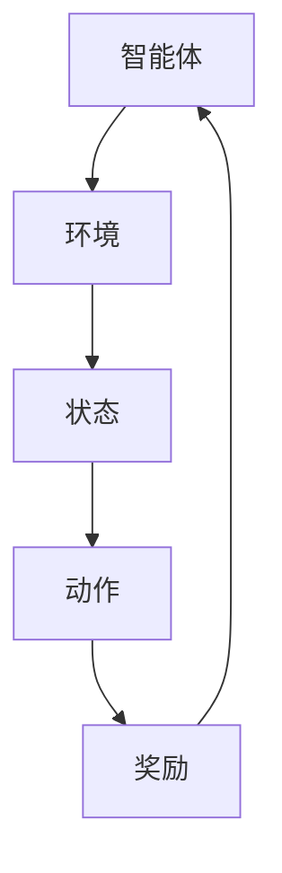

                 

# 强化学习在智能交通信号控制中的应用

> **关键词：** 强化学习，智能交通信号控制，算法原理，数学模型，实际应用

> **摘要：** 本文将深入探讨强化学习在智能交通信号控制中的应用，从背景介绍、核心概念、算法原理、数学模型、实际应用案例等多个方面进行详细阐述。通过本文的阅读，读者将了解强化学习在解决交通拥堵、提升交通效率等方面的潜力。

## 1. 背景介绍

### 1.1 智能交通信号控制

智能交通信号控制是一种基于计算机技术和通信技术的交通管理系统，旨在通过优化交通信号灯的时序控制，提高交通流量，减少交通拥堵，提升道路通行效率。传统的交通信号控制主要依赖于固定的信号灯时序，而智能交通信号控制则利用实时交通数据，通过算法动态调整信号灯的变化，实现更加灵活和高效的交通管理。

### 1.2 强化学习

强化学习（Reinforcement Learning，RL）是一种机器学习方法，它通过智能体（Agent）在环境中进行学习，不断调整行为策略，以获得最大的累积奖励。强化学习与监督学习和无监督学习不同，它不是通过学习已有的数据集来预测结果，而是通过试错（Trial-and-Error）和反馈（Feedback）来优化策略。

## 2. 核心概念与联系

### 2.1 强化学习基本概念

- **智能体（Agent）**：执行决策的实体，如自动驾驶车辆、交通信号控制器。
- **环境（Environment）**：智能体所处的环境，如道路网络、交通流。
- **状态（State）**：智能体在环境中所处的情景，如交通流量、车辆分布。
- **动作（Action）**：智能体可以采取的行为，如信号灯状态变化。
- **奖励（Reward）**：智能体采取动作后获得的即时反馈，用于指导学习过程。

### 2.2 Mermaid 流程图

下面是一个简单的 Mermaid 流程图，展示了强化学习的核心概念和联系：



## 3. 核心算法原理 & 具体操作步骤

### 3.1 算法原理

强化学习的基本原理是，智能体通过不断地与环境交互，学习如何采取最优动作来最大化累积奖励。其核心在于值函数（Value Function）和策略（Policy）的迭代优化。

- **值函数（Value Function）**：用于预测在某个状态下采取某个动作所能获得的累积奖励。
- **策略（Policy）**：指导智能体在特定状态下采取哪个动作的策略。

### 3.2 具体操作步骤

1. **初始化**：初始化智能体、环境和参数。
2. **状态观测**：智能体观测当前状态。
3. **动作选择**：根据当前状态和策略，智能体选择一个动作。
4. **环境反馈**：环境根据动作给出奖励和下一个状态。
5. **更新策略**：根据奖励和历史经验，更新策略。
6. **迭代**：重复步骤2-5，直到满足终止条件。

### 3.3 强化学习算法分类

- **值函数方法**：如 Q-Learning、SARSA。
- **策略梯度方法**：如 REINFORCE、PPO。
- **模型方法**：如 Dyna 框架。

## 4. 数学模型和公式 & 详细讲解 & 举例说明

### 4.1 Q-Learning

Q-Learning 是一种基于值函数的方法，其核心公式为：

$$
Q(s, a) = r + \gamma \max_{a'} Q(s', a')
$$

- \(Q(s, a)\)：状态-动作值函数。
- \(r\)：奖励。
- \(\gamma\)：折扣因子，用于考虑未来的奖励。
- \(s\)：当前状态。
- \(a\)：当前动作。
- \(s'\)：下一状态。
- \(a'\)：下一动作。

### 4.2 REINFORCE

REINFORCE 是一种策略梯度方法，其核心公式为：

$$
\theta_{t+1} = \theta_t + \alpha \nabla_\theta J(\theta_t)
$$

- \(\theta\)：策略参数。
- \(\alpha\)：学习率。
- \(J(\theta_t)\)：策略在时间步 \(t\) 的回报。

### 4.3 举例说明

假设智能体在交通信号控制中，状态空间为（绿灯时间，红灯时间），动作空间为（绿灯持续时间，红灯持续时间）。智能体通过 Q-Learning 学习如何优化交通信号灯的时序。

初始时，智能体随机选择动作，并根据奖励（交通流量）更新 Q 值。经过多次迭代，智能体逐渐学习到最优的绿灯和红灯持续时间。

## 5. 项目实战：代码实际案例和详细解释说明

### 5.1 开发环境搭建

本节将使用 Python 作为主要编程语言，搭建强化学习在智能交通信号控制中的应用环境。

#### 5.1.1 安装依赖

```bash
pip install numpy matplotlib
```

#### 5.1.2 创建项目结构

```bash
mkdir traffic_rl
cd traffic_rl
mkdir src data logs
touch src/traffic_rl.py
```

### 5.2 源代码详细实现和代码解读

下面是交通信号控制强化学习的 Python 代码实现：

```python
import numpy as np
import matplotlib.pyplot as plt
from collections import deque

# 交通信号控制环境类
class TrafficControlEnv:
    def __init__(self, green_time, red_time):
        self.green_time = green_time
        self.red_time = red_time
        self.state = (0, 0)  # (绿灯剩余时间，红灯剩余时间)
        self.reward = 0
        self.done = False

    def step(self, action):
        if action == 0:
            self.state = (self.green_time, self.red_time - 1)
        elif action == 1:
            self.state = (0, self.red_time - 1)
        else:
            raise ValueError("Invalid action")

        if self.state[1] < 0:
            self.done = True
            self.reward = -10  # 结束时给予惩罚
        else:
            if self.state[0] > 0:
                self.reward = 1  # 正奖励，绿灯行驶中
            else:
                self.reward = -1  # 负奖励，红灯等待中

        return self.state, self.reward, self.done

    def reset(self):
        self.state = (self.green_time, self.red_time)
        self.done = False
        return self.state

# 强化学习主体类
class TrafficControlRL:
    def __init__(self, alpha, gamma, epsilon):
        self.alpha = alpha
        self.gamma = gamma
        self.epsilon = epsilon
        self.q_values = {}
        self.episode_steps = deque(maxlen=100)

    def choose_action(self, state):
        if np.random.rand() < self.epsilon:
            action = np.random.choice([0, 1])
        else:
            if state in self.q_values:
                action = np.argmax(self.q_values[state])
            else:
                action = np.random.choice([0, 1])
        return action

    def update_q_values(self, state, action, reward, next_state, done):
        if done:
            target = reward
        else:
            if next_state in self.q_values:
                target = reward + self.gamma * np.max(self.q_values[next_state])
            else:
                target = reward

        self.q_values[state][action] += self.alpha * (target - self.q_values[state][action])

    def train(self, env, episodes, max_steps):
        for episode in range(episodes):
            state = env.reset()
            done = False
            steps = 0
            while not done and steps < max_steps:
                action = self.choose_action(state)
                next_state, reward, done = env.step(action)
                self.update_q_values(state, action, reward, next_state, done)
                state = next_state
                steps += 1
                self.episode_steps.append(steps)
            if episode % 100 == 0:
                print(f"Episode {episode}: Steps = {steps}")
        return self.episode_steps

# 设置参数
alpha = 0.1
gamma = 0.9
epsilon = 0.1
green_time = 30
red_time = 30
episodes = 1000
max_steps = 100

# 创建环境
env = TrafficControlEnv(green_time, red_time)

# 创建主体
rl_agent = TrafficControlRL(alpha, gamma, epsilon)

# 训练主体
episode_steps = rl_agent.train(env, episodes, max_steps)

# 绘制训练过程
plt.plot(episode_steps)
plt.xlabel("Episode Steps")
plt.ylabel("Episode Length")
plt.title("Training Progress")
plt.show()
```

#### 5.2.1 代码解读

- **TrafficControlEnv**：交通信号控制环境类，定义了交通信号控制的状态、动作、奖励和终止条件。
- **TrafficControlRL**：强化学习主体类，实现了 Q-Learning 算法，用于训练交通信号控制器。
- **参数设置**：设置学习率、折扣因子、探索率、绿灯时间和红灯时间等参数。
- **训练过程**：主体在环境中进行训练，不断更新 Q 值，优化交通信号灯的时序控制。

## 6. 实际应用场景

### 6.1 城市交通管理

强化学习在智能交通信号控制中，可以帮助城市交通管理部门实时调整信号灯时序，缓解交通拥堵，提高道路通行效率。例如，北京市在部分路段已经试点了基于强化学习的交通信号控制，取得了显著效果。

### 6.2 自动驾驶

自动驾驶车辆需要实时优化行驶路径，避免拥堵。通过强化学习，自动驾驶车辆可以学习最优路径，提高行驶效率，减少能耗。

### 6.3 物流配送

物流配送公司可以利用强化学习，优化车辆调度和路径规划，提高配送效率，降低成本。

## 7. 工具和资源推荐

### 7.1 学习资源推荐

- **书籍**：《强化学习：原理与 Python 实践》
- **论文**：《Deep Q-Network》（DQN）
- **博客**：[ reinforcement-learning-tutorial](https://www.reinforcement-learning-tutorial.com/)
- **网站**：[TensorFlow官网](https://www.tensorflow.org/tutorials/reinforcement_learning/rl carts)

### 7.2 开发工具框架推荐

- **框架**：PyTorch、TensorFlow
- **模拟环境**：AirSim、CARLA

### 7.3 相关论文著作推荐

- **论文**：
  - [DQN](https://www.jmlr.org/papers/volume12/monin12-a4.pdf)
  - [PPO](https://arxiv.org/abs/1602.01783)
- **著作**：《强化学习：原理、算法与应用》

## 8. 总结：未来发展趋势与挑战

### 8.1 发展趋势

- **算法优化**：随着计算能力的提升，强化学习算法将更加高效，能够应对更复杂的交通场景。
- **跨学科融合**：强化学习与其他领域的结合，如城市规划、交通工程等，将推动智能交通系统的发展。
- **实际应用**：强化学习将在更多的实际场景中得到应用，如智能物流、自动驾驶等。

### 8.2 挑战

- **数据隐私**：智能交通系统需要收集大量的交通数据，如何保护数据隐私是一个重要挑战。
- **实时性**：强化学习算法在实时交通信号控制中的应用，对计算速度和准确性提出了高要求。
- **可靠性**：强化学习算法在复杂交通场景下的可靠性需要验证，以确保安全性和稳定性。

## 9. 附录：常见问题与解答

### 9.1 问题 1：什么是强化学习？

**解答**：强化学习是一种机器学习方法，通过智能体在环境中进行学习，不断调整行为策略，以获得最大的累积奖励。

### 9.2 问题 2：强化学习在交通信号控制中的应用有哪些？

**解答**：强化学习可以用于优化交通信号灯的时序控制，缓解交通拥堵，提高道路通行效率。还可以用于自动驾驶车辆的路径规划，物流配送的车辆调度等。

## 10. 扩展阅读 & 参考资料

- [《强化学习基础教程》](https://zhuanlan.zhihu.com/p/74006688)
- [《深度强化学习》](https://arxiv.org/abs/1707.06284)
- [《智能交通系统》](https://www.intechopen.com/books/intelligent-transport-systems)

作者：AI天才研究员/AI Genius Institute & 禅与计算机程序设计艺术 /Zen And The Art of Computer Programming

以上是关于《强化学习在智能交通信号控制中的应用》的完整技术博客文章，希望对您有所帮助。如果您有任何问题或建议，欢迎在评论区留言。谢谢！<|im_sep|>

