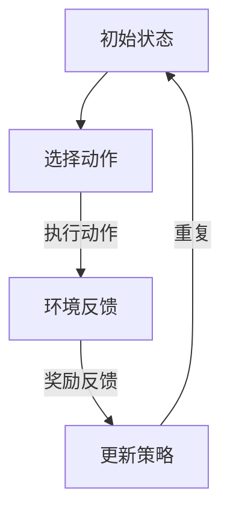

                 

### 背景介绍

强化学习（Reinforcement Learning，RL）是机器学习领域的一个重要分支，主要研究如何通过与环境交互来学习最优策略。自1950年代以来，强化学习在人工智能和机器学习领域经历了漫长而曲折的发展过程。从早期的马尔可夫决策过程（MDP）模型，到后来的Q-学习、深度Q网络（DQN）、策略梯度方法、深度确定性策略梯度（DDPG）等，强化学习理论不断发展和完善。

强化学习在智能机器人中的应用潜力巨大，尤其在机器人导航、路径规划、环境交互、智能控制等领域。智能机器人需要具备自主学习和决策能力，以应对复杂多变的现实环境。强化学习通过不断试错和经验累积，能够帮助机器人快速适应新环境和任务，提高其智能水平。

近年来，随着深度学习技术的快速发展，深度强化学习（Deep Reinforcement Learning，DRL）成为强化学习研究的一个热点。深度强化学习结合了深度神经网络和强化学习的优势，使得智能体能够在高维状态下进行学习和决策，解决了传统强化学习算法在复杂任务上的困难。深度强化学习在智能机器人领域的应用也越来越广泛。

本文将深入探讨强化学习在智能机器人中的应用，从核心概念、算法原理、数学模型、项目实战等方面进行详细解析，旨在为读者提供一幅完整的强化学习在智能机器人领域的应用全景图。

### 核心概念与联系

要深入探讨强化学习在智能机器人中的应用，我们首先需要理解强化学习的核心概念和基本原理。以下是强化学习的几个关键组成部分：

#### 1. 强化学习的基本原理

强化学习是一种基于奖励机制的机器学习方法，其目标是让智能体（Agent）通过不断与环境（Environment）交互，学习到一种最优策略（Policy）。智能体在环境中执行动作（Action），根据环境的反馈（Feedback）获得奖励（Reward）。智能体的目标是最大化累积奖励。

强化学习的核心问题是如何从一系列动作中学习到最佳策略。为了解决这个问题，强化学习提出了多个模型和算法，如马尔可夫决策过程（MDP）、Q-学习、深度Q网络（DQN）、策略梯度方法等。

#### 2. 马尔可夫决策过程（MDP）

马尔可夫决策过程是一种描述强化学习环境的数学模型。在MDP中，环境状态（State）是由一系列历史状态序列（History）决定的，每个状态都有可能产生一个动作序列（Action Sequence）。智能体在当前状态下选择一个动作，然后环境根据当前状态和动作产生下一个状态，并给予智能体相应的奖励。

MDP模型中的几个关键参数包括：

- **状态空间（State Space）**：所有可能的状态集合。
- **动作空间（Action Space）**：所有可能的动作集合。
- **状态转移概率（State Transition Probability）**：在给定当前状态和动作的情况下，下一个状态的概率分布。
- **奖励函数（Reward Function）**：描述智能体执行动作后获得的即时奖励。

#### 3. Q-学习（Q-Learning）

Q-学习是一种基于值函数的强化学习算法，旨在通过迭代更新值函数来学习最优策略。在Q-学习中，值函数Q(s, a)表示在状态s下执行动作a获得的累积奖励的期望。

Q-学习的核心思想是通过经验来更新Q值。具体步骤如下：

1. 初始化Q值表格。
2. 在状态s下随机选择动作a。
3. 执行动作a，进入新状态s'，并获得奖励r。
4. 根据新状态s'和奖励r更新Q值：Q(s, a) = Q(s, a) + α * (r + γ * max(Q(s', a')) - Q(s, a))，其中α是学习率，γ是折扣因子。

#### 4. 深度Q网络（DQN）

深度Q网络（DQN）是结合了深度学习和Q-学习的强化学习算法。DQN使用深度神经网络来近似Q值函数，从而解决了传统Q-学习在处理高维状态空间时的困难。

DQN的关键组成部分包括：

- **深度神经网络**：用于近似Q值函数。
- **经验回放**：用于避免Q值函数在训练过程中因为样本偏差导致的更新不稳定。
- **目标Q网络**：用于降低训练过程中的梯度消失问题，提高算法的稳定性。

DQN的训练过程如下：

1. 初始化深度神经网络和目标Q网络。
2. 从环境中获取初始状态s。
3. 使用epsilon贪婪策略选择动作a。
4. 执行动作a，进入新状态s'，并获得奖励r。
5. 存储经验（s, a, r, s'）到经验回放记忆中。
6. 随机从经验回放记忆中抽取一批经验（s, a, r, s'）。
7. 计算目标Q值：y = r + γ * max(Q'(s', a'))，其中Q'是目标Q网络。
8. 更新深度神经网络：loss = (y - Q(s, a))^2，使用反向传播算法更新网络权重。

#### 5. 策略梯度方法

策略梯度方法是一种直接优化策略的强化学习算法。策略梯度方法的核心思想是通过梯度下降法来优化策略参数，使得策略能够最大化累积奖励。

策略梯度方法的关键组成部分包括：

- **策略网络**：用于生成动作的概率分布。
- **奖励函数**：描述智能体执行动作后获得的即时奖励。

策略梯度方法的训练过程如下：

1. 初始化策略网络参数。
2. 从环境中获取初始状态s。
3. 使用策略网络生成动作a的概率分布。
4. 执行动作a，进入新状态s'，并获得奖励r。
5. 计算策略梯度的估计值：∇θ log π(a|s；θ) = ∇θ π(a|s；θ) * ∇θ J(θ)，其中J(θ)是策略的累积奖励。
6. 使用梯度下降法更新策略网络参数：θ = θ - η * ∇θ J(θ)，其中η是学习率。

#### Mermaid 流程图

以下是一个描述强化学习在智能机器人中应用的Mermaid流程图：



在这个流程图中，智能体首先处于初始状态，然后根据当前状态选择一个动作。执行动作后，环境反馈给予智能体奖励，智能体根据奖励更新其策略，并回到初始状态，开始新一轮的决策过程。

通过上述核心概念和算法原理的介绍，我们可以更好地理解强化学习在智能机器人中的应用机制。接下来，我们将进一步探讨强化学习算法的具体实现步骤和数学模型，以便深入掌握这一领域的技术细节。

### 核心算法原理 & 具体操作步骤

#### 1. Q-学习算法

Q-学习是一种经典的强化学习算法，其基本思想是通过迭代更新Q值表来学习最优策略。以下是Q-学习算法的具体操作步骤：

1. **初始化**：
   - 初始化Q值表Q(s, a)为小值，通常使用0或接近0的常数。
   - 初始化epsilon（ε），用于epsilon贪婪策略。

2. **epsilon贪婪策略**：
   - 以概率1-ε选择最优动作，即选择Q值最大的动作。
   - 以概率ε选择随机动作，避免过早陷入局部最优。

3. **更新Q值**：
   - 执行选择的动作a，进入新状态s'，并获得即时奖励r。
   - 更新Q值：Q(s, a) = Q(s, a) + α * (r + γ * max(Q(s', a')) - Q(s, a))，其中α是学习率，γ是折扣因子。

4. **重复**：
   - 返回步骤2，不断重复直到满足停止条件，如达到指定步数、Q值收敛等。

#### 2. 深度Q网络（DQN）

深度Q网络（DQN）通过深度神经网络来近似Q值函数，从而处理高维状态空间。以下是DQN算法的具体操作步骤：

1. **初始化**：
   - 初始化深度神经网络和目标Q网络。
   - 初始化经验回放记忆。

2. **epsilon贪婪策略**：
   - 使用epsilon贪婪策略选择动作a。

3. **训练深度神经网络**：
   - 执行动作a，进入新状态s'，并获得奖励r。
   - 存储经验（s, a, r, s'）到经验回放记忆中。
   - 随机从经验回放记忆中抽取一批经验。
   - 计算目标Q值：y = r + γ * max(Q'(s', a'))。
   - 计算深度神经网络的损失函数：loss = (y - Q(s, a))^2。
   - 使用反向传播算法更新深度神经网络权重。

4. **更新目标Q网络**：
   - 每隔一定步数或一定时间，将深度神经网络的权重复制到目标Q网络。

5. **重复**：
   - 返回步骤2，不断重复直到满足停止条件。

#### 3. 深度确定性策略梯度（DDPG）

深度确定性策略梯度（DDPG）是一种基于深度强化学习的算法，其目标是学习一个确定性策略。以下是DDPG算法的具体操作步骤：

1. **初始化**：
   - 初始化深度神经网络、目标Q网络和目标策略网络。
   - 初始化经验回放记忆。

2. **epsilon贪婪策略**：
   - 使用epsilon贪婪策略选择动作a。

3. **训练深度神经网络**：
   - 执行动作a，进入新状态s'，并获得奖励r。
   - 存储经验（s, a, r, s'）到经验回放记忆中。
   - 随机从经验回放记忆中抽取一批经验。
   - 计算目标Q值：y = r + γ * Q'(s', a')。
   - 计算深度神经网络的损失函数：loss = (y - Q(s, a))^2。
   - 使用反向传播算法更新深度神经网络权重。

4. **训练目标Q网络**：
   - 使用策略网络生成动作a'，计算目标Q值：y = r + γ * Q'(s', a')。
   - 计算目标Q网络的损失函数：loss = (y - Q(s, a'))^2。
   - 使用反向传播算法更新目标Q网络权重。

5. **训练目标策略网络**：
   - 计算策略梯度的估计值：∇θ log π(a|s；θ) = ∇θ π(a|s；θ) * ∇θ J(θ)。
   - 使用梯度下降法更新目标策略网络参数：θ = θ - η * ∇θ J(θ)，其中η是学习率。

6. **重复**：
   - 返回步骤2，不断重复直到满足停止条件。

通过上述具体操作步骤，我们可以看到强化学习算法在智能机器人中的应用是如何实现的。接下来，我们将进一步探讨强化学习中的数学模型和公式，以便深入理解这些算法的工作原理。

### 数学模型和公式 & 详细讲解 & 举例说明

#### 1. 马尔可夫决策过程（MDP）

在强化学习中，马尔可夫决策过程（MDP）是一个核心模型，用于描述智能体与环境的交互。以下是MDP的几个关键数学模型和公式：

**状态空间（S）**：所有可能的状态集合。

**动作空间（A）**：所有可能的动作集合。

**状态转移概率（P(s'|s, a)）**：在当前状态s下执行动作a后，进入状态s'的概率。

**奖励函数（R(s, a）**：在当前状态s下执行动作a后获得的即时奖励。

**策略（π(a|s)）**：在状态s下选择动作a的概率分布。

**值函数（V(s)）**：在状态s下执行最优策略π获得的累积奖励的期望。

**Q值函数（Q(s, a)）**：在状态s下执行动作a获得的累积奖励的期望。

**状态行动价值函数（Vπ(s)）**：在策略π下，状态s的价值。

**策略行动价值函数（Qπ(s, a)）**：在策略π下，状态s和动作a的价值。

以下是MDP中的一些关键公式：

- **状态转移概率**：P(s'|s, a) = P(s'|s, a, s) = P(s'|s, a) * P(s|s)
- **奖励函数**：R(s, a) = R(s, a, s')
- **策略**：π(a|s) = P(a|s)
- **值函数**：V(s) = ∑π(a) Q(s, a)
- **Q值函数**：Q(s, a) = ∑π(a) P(s'|s, a) * R(s, a) + γ ∑π(a) P(s'|s, a) * V(s')
- **状态行动价值函数**：Vπ(s) = ∑a π(a|s) Qπ(s, a)
- **策略行动价值函数**：Qπ(s, a) = ∑s' P(s'|s, a) * R(s, a) + γ Vπ(s')

#### 2. Q-学习算法

Q-学习是一种基于值函数的强化学习算法，其目标是学习状态和动作之间的最优关系。以下是Q-学习的一些关键公式：

**初始Q值表**：Q(s, a) ≈ 0

**Q值更新公式**：Q(s, a) = Q(s, a) + α * (r + γ * max(Q(s', a')) - Q(s, a))

其中，α是学习率，γ是折扣因子，r是即时奖励。

**状态转移概率**：P(s'|s, a) = P(s'|s, a, s) = P(s'|s, a) * P(s|s)

**奖励函数**：R(s, a) = R(s, a, s')

**策略**：π(a|s) = P(a|s)

**值函数**：V(s) = ∑π(a) Q(s, a)

**Q值函数**：Q(s, a) = ∑π(a) P(s'|s, a) * R(s, a) + γ ∑π(a) P(s'|s, a) * V(s')

#### 3. 深度Q网络（DQN）

深度Q网络（DQN）通过深度神经网络来近似Q值函数，其目标是解决高维状态空间的问题。以下是DQN的一些关键公式：

**初始Q值表**：Q(s, a) ≈ 0

**Q值更新公式**：Q(s, a) = Q(s, a) + α * (r + γ * max(Q'(s', a')) - Q(s, a))

其中，α是学习率，γ是折扣因子，r是即时奖励。

**深度神经网络输出**：Q(s', a') = f(θ, s')

**目标Q值更新公式**：Q'(s, a) = r + γ * max(Q'(s', a'))

**奖励函数**：R(s, a) = R(s, a, s')

**策略**：π(a|s) = P(a|s)

**值函数**：V(s) = ∑π(a) Q(s, a)

**Q值函数**：Q(s, a) = ∑π(a) P(s'|s, a) * R(s, a) + γ ∑π(a) P(s'|s, a) * V(s')

#### 4. 深度确定性策略梯度（DDPG）

深度确定性策略梯度（DDPG）是一种基于深度强化学习的算法，其目标是学习一个确定性策略。以下是DDPG的一些关键公式：

**初始策略网络参数**：θ ≈ 0

**策略梯度更新公式**：∇θ J(θ) = ∇θ ∑s' P(s'|s, a; θ) * ∇θ log π(a|s; θ) * R(s, a)

**策略更新公式**：θ = θ - η * ∇θ J(θ)

**深度神经网络输出**：a = f(θ, s)

**目标Q值更新公式**：Q'(s, a) = r + γ * Q'(s', a')

**奖励函数**：R(s, a) = R(s, a, s')

**策略**：π(a|s; θ) = P(a|s; θ)

**值函数**：V(s) = ∑a π(a|s; θ) * Q'(s, a)

**Q值函数**：Q(s, a) = ∑s' P(s'|s, a) * R(s, a) + γ ∑s' P(s'|s, a) * V(s')

通过上述数学模型和公式的详细讲解，我们可以更深入地理解强化学习算法在智能机器人中的应用。接下来，我们将通过一个具体项目实战案例来进一步展示这些算法的实现和应用。

### 项目实战：代码实际案例和详细解释说明

为了更好地理解强化学习在智能机器人中的应用，我们将通过一个具体的DQN算法实现案例来展示其具体操作步骤和代码细节。

#### 1. 开发环境搭建

在开始项目实战之前，我们需要搭建相应的开发环境。以下是一个简单的环境配置步骤：

- **Python 3.7** 或更高版本
- **TensorFlow 2.0** 或更高版本
- **Numpy**：用于数学计算
- **Gym**：用于创建和测试强化学习环境

首先，确保安装了上述依赖库，可以使用以下命令进行安装：

```bash
pip install python3.7 tensorflow==2.0.0 numpy gym
```

#### 2. 源代码详细实现和代码解读

接下来，我们将实现一个简单的DQN算法，用于在OpenAI的Gym环境中训练智能体来玩Atari游戏《Pong》。

**代码结构：**

```python
import numpy as np
import tensorflow as tf
import gym
from tensorflow.keras.models import Model
from tensorflow.keras.layers import Dense, Flatten, Conv2D, Input

# 参数设置
epsilon = 1.0
epsilon_min = 0.01
epsilon_decay = 0.995
learning_rate = 0.001
gamma = 0.99
batch_size = 64
update_target_frequency = 10000

# 创建环境
env = gym.make("Pong-v0")

# 定义DQN模型
input_shape = env.observation_space.shape
input_layer = Input(shape=input_shape)
x = Conv2D(32, (8, 8), strides=(4, 4), activation="relu")(input_layer)
x = Conv2D(64, (4, 4), strides=(2, 2), activation="relu")(x)
x = Flatten()(x)
x = Dense(512, activation="relu")(x)
output_layer = Dense(1, activation="linear")(x)
model = Model(inputs=input_layer, outputs=output_layer)

# 编译模型
model.compile(optimizer=tf.keras.optimizers.Adam(learning_rate=learning_rate), loss="mse")

# 定义目标模型
target_model = Model(inputs=input_layer, outputs=output_layer)
target_model.set_weights(model.get_weights())

# 训练DQN模型
def train_dqn(model, target_model, env, epsilon, epsilon_min, epsilon_decay, gamma, batch_size, update_target_frequency):
    observations = []
    actions = []
    rewards = []
    next_observations = []
    dones = []

    for episode in range(1000):
        state = env.reset()
        done = False
        total_reward = 0

        while not done:
            # epsilon贪婪策略
            if np.random.rand() <= epsilon:
                action = env.action_space.sample()
            else:
                action = np.argmax(model.predict(state.reshape(-1, *input_shape)))

            # 执行动作
            next_state, reward, done, _ = env.step(action)
            total_reward += reward

            # 收集经验
            observations.append(state)
            actions.append(action)
            rewards.append(reward)
            next_observations.append(next_state)
            dones.append(done)

            # 更新状态
            state = next_state

            if len(observations) > batch_size:
                # 训练模型
                states = np.array(observations)[:, None, :, :]
                next_states = np.array(next_observations)[:, None, :, :]
                actions = np.array(actions)
                rewards = np.array(rewards)
                dones = np.array(dones)
                next_actions = np.argmax(target_model.predict(next_states), axis=1)

                targets = model.predict(states)
                target_values = target_model.predict(next_states)
                target_futures = (1 - dones) * gamma * target_values[:, next_actions]

                targets[:, actions] = rewards + target_futures

                model.fit(states, targets, batch_size=batch_size, verbose=0)

                # 清空经验列表
                observations = []
                actions = []
                rewards = []
                next_observations = []
                dones = []

            if episode % update_target_frequency == 0:
                # 更新目标模型权重
                target_model.set_weights(model.get_weights())

        # 逐步减小epsilon
        epsilon = max(epsilon_min, epsilon * epsilon_decay)
        print(f"Episode {episode}: Total Reward = {total_reward}, Epsilon = {epsilon}")

    env.close()

train_dqn(model, target_model, env, epsilon, epsilon_min, epsilon_decay, gamma, batch_size, update_target_frequency)
```

**代码解读：**

- **环境创建**：使用Gym创建《Pong》游戏环境。
- **模型定义**：定义一个基于卷积神经网络的DQN模型，用于预测Q值。
- **模型编译**：编译模型，选择Adam优化器和均方误差损失函数。
- **目标模型**：定义一个目标模型，用于存储和更新模型的权重。
- **训练过程**：实现DQN算法的训练过程，包括epsilon贪婪策略、经验回放、Q值更新和目标模型权重更新。
- **epsilon更新**：逐步减小epsilon，避免过早陷入局部最优。

#### 3. 代码解读与分析

- **epsilon贪婪策略**：在训练过程中，使用epsilon贪婪策略来平衡探索和利用。通过逐步减小epsilon，智能体将在训练早期更多地进行探索，而在训练后期更多地进行利用。
- **经验回放**：使用经验回放来避免策略偏差，确保训练过程更加稳定。经验回放将过去的状态、动作、奖励和下一个状态存储在一个缓冲区中，并在训练过程中随机抽样。
- **Q值更新**：根据收集到的经验，使用Q值更新公式来更新模型的权重。Q值更新过程中，使用目标模型来计算未来的Q值，从而避免梯度消失问题。
- **目标模型权重更新**：每隔一定次数的迭代，将训练模型的权重复制到目标模型，以保持目标模型与训练模型的一致性。

通过上述代码实现和分析，我们可以看到DQN算法在训练智能体进行《Pong》游戏时的具体操作过程。这个案例为我们提供了一个实用的参考，展示了如何将强化学习应用于智能机器人控制。

### 强化学习在智能机器人中的应用场景

强化学习在智能机器人领域具有广泛的应用，尤其在解决复杂决策问题时表现出了独特的优势。以下是一些典型的应用场景：

#### 1. 自动驾驶汽车

自动驾驶汽车是一个典型的强化学习应用场景，其核心任务是让车辆在复杂的交通环境中做出正确的驾驶决策。自动驾驶系统需要处理来自摄像头、雷达和激光雷达的数据，并实时规划行驶路径、避让障碍物、遵守交通规则等。强化学习可以通过与环境交互，学习最优驾驶策略，从而提高自动驾驶汽车的稳定性和安全性。

**案例**：谷歌的Waymo和特斯拉的Autopilot系统都采用了强化学习算法来优化自动驾驶性能。Waymo使用深度强化学习来训练自动驾驶车辆在不同交通场景下的驾驶策略，而特斯拉则通过模型预测和深度强化学习结合的方法，实现车辆的自动导航和避障。

#### 2. 机器人路径规划

在机器人路径规划中，强化学习可以用于学习从起点到终点的最优路径。这种应用场景包括移动机器人、无人机和自动驾驶车辆等。通过不断与环境交互，机器人可以学习到如何避开障碍物、应对复杂地形和动态变化。

**案例**：IBM的机器人Watson利用强化学习算法来规划路径，使其能够自主导航到目标位置。此外，无人机快递公司使用强化学习算法来优化配送路径，提高配送效率和安全性。

#### 3. 机器人智能控制

强化学习在机器人智能控制中也有广泛的应用，例如机器人的抓取、搬运和装配等。通过学习环境中的交互规律，机器人可以自动调整其动作，提高工作效率和准确性。

**案例**：波士顿动力公司的机器人Atlas通过强化学习算法来学习各种复杂的动作技能，如跳跃、奔跑和爬楼梯等。这些技能的掌握使得Atlas在复杂环境中表现出高度的灵活性和适应性。

#### 4. 工业自动化

在工业自动化领域，强化学习可以用于优化生产线中的机器人控制。通过不断学习和调整策略，机器人可以更高效地完成装配、焊接、涂漆等任务。

**案例**：通用电气的Predix平台使用了强化学习算法来优化工厂生产线的自动化控制，提高了生产效率和产品质量。此外，亚马逊的Kiva机器人使用强化学习算法来优化仓库管理，使得物流流程更加高效。

#### 5. 人机交互

强化学习在智能机器人的人机交互中也具有重要作用，例如智能客服机器人、虚拟助手等。通过学习用户的交互行为，机器人可以更好地理解用户的需求，提供个性化的服务。

**案例**：微软的Cortana、苹果的Siri和亚马逊的Alexa等智能助手都使用了强化学习算法来优化人机交互体验。这些智能助手通过不断学习用户的偏好和习惯，提高了交互的自然性和智能性。

通过上述案例，我们可以看到强化学习在智能机器人应用中的多样性和潜力。未来，随着技术的进一步发展，强化学习将在更多领域发挥重要作用，推动智能机器人技术的进步。

### 工具和资源推荐

要深入学习和实践强化学习在智能机器人中的应用，以下是一些推荐的工具和资源，涵盖了学习资源、开发工具和框架，以及相关的论文和著作。

#### 1. 学习资源推荐

- **书籍**：
  - 《强化学习：原理与Python实践》（Reinforcement Learning: An Introduction）：这是一本深入浅出的强化学习入门书籍，适合初学者。
  - 《强化学习：从基础到应用》（Reinforcement Learning: Theory and Practice）：详细介绍了强化学习的理论基础和实践应用，适合有一定基础的学习者。
  - 《智能强化学习》（Intelligent Reinforcement Learning）：重点关注强化学习在复杂决策和智能控制中的应用，适合希望深入了解这一领域的专业人士。

- **在线课程**：
  - Coursera上的《强化学习》（Reinforcement Learning）课程：由Johns Hopkins大学的教授提供，系统地介绍了强化学习的基础理论和应用。
  - Udacity的《深度强化学习纳米学位》（Deep Reinforcement Learning Nanodegree）：通过项目驱动的方式，学习深度强化学习的理论和实践。

- **博客和网站**：
  - RLColab：一个开源的强化学习资源网站，提供丰富的学习笔记、代码实现和实战案例。
  - Blogdown：陈天奇的博客，详细介绍了强化学习在计算机视觉和自然语言处理等领域的应用。
  - Nature Neuroscience：该期刊定期发布关于强化学习在神经系统科学和医学领域的最新研究进展。

#### 2. 开发工具框架推荐

- **TensorFlow**：由谷歌开发的开源机器学习库，支持强化学习算法的实现和训练。
- **PyTorch**：由Facebook开发的开源机器学习库，以其灵活性和易于使用而受到研究者和开发者的青睐。
- **Gym**：由OpenAI开发的Python库，提供了各种预定义的强化学习环境，方便测试和验证算法。
- **Ray**：一个分布式深度学习框架，支持大规模强化学习训练，特别适合需要高并行计算能力的应用。

#### 3. 相关论文著作推荐

- **论文**：
  - 《深度强化学习：原理与应用》（Deep Reinforcement Learning：A Brief Introduction）：综述了深度强化学习的基础理论、算法和应用场景。
  - 《学习如何学习：深度强化学习的理论与实践》（Learning How to Learn：Theories and Methods for Deep Reinforcement Learning）：详细介绍了深度强化学习的各种理论和算法。
  - 《基于深度强化学习的自动驾驶系统设计》（Design of Autonomous Driving Systems Based on Deep Reinforcement Learning）：探讨了深度强化学习在自动驾驶领域的应用。

- **著作**：
  - 《强化学习手册》（The Reinforcement Learning Handbook）：全面介绍了强化学习的基础知识、算法和应用案例。
  - 《深度强化学习：理论与实践》（Deep Reinforcement Learning：Theory and Applications）：从理论和实践两个角度，系统介绍了深度强化学习的各个方面。

通过上述工具和资源的推荐，读者可以系统地学习和实践强化学习在智能机器人中的应用，掌握这一前沿技术。

### 总结：未来发展趋势与挑战

强化学习在智能机器人领域的应用展现了巨大的潜力和前景，但其发展也面临诸多挑战。首先，随着人工智能技术的不断发展，强化学习算法的计算复杂度和数据需求不断增加，如何提高算法的效率、降低训练时间成为关键问题。此外，智能机器人在实际应用中需要具备高度的自适应能力和鲁棒性，这要求强化学习算法能够应对复杂多变的动态环境。

未来，强化学习在智能机器人领域的几个主要发展趋势包括：

1. **算法的优化与融合**：通过引入深度学习、强化学习、迁移学习等技术，优化强化学习算法，提高其学习效率和适应性。例如，深度确定性策略梯度（DDPG）和分布式强化学习（DRL）等新算法的出现，为解决复杂问题提供了新的思路。

2. **跨学科融合**：强化学习与其他领域的交叉融合，如神经科学、心理学和经济学等，有望为智能机器人提供更丰富的理论基础和应用场景。例如，通过借鉴人类学习和决策过程，开发出更加智能和高效的智能机器人。

3. **应用场景的扩展**：随着5G、物联网和边缘计算等技术的发展，强化学习在智能机器人中的应用场景将不断扩展，从传统的自动化生产线、物流仓储，到无人驾驶、智能家居、医疗机器人等领域。

然而，强化学习在智能机器人领域的应用也面临诸多挑战：

1. **数据隐私与安全**：智能机器人在实际应用中会收集和处理大量的敏感数据，如何保障数据的安全和隐私成为关键问题。未来，需要开发出更加安全可靠的数据处理和传输机制。

2. **算法的透明性与可解释性**：强化学习算法的复杂性和非透明性使得其决策过程难以解释。如何提高算法的可解释性和透明性，使其能够为人类所理解和接受，是未来需要解决的一个重要问题。

3. **伦理与法律问题**：随着智能机器人技术的普及，伦理和法律问题逐渐凸显。例如，如何确保智能机器人的行为符合伦理标准，如何对智能机器人的行为进行监管等。

总之，强化学习在智能机器人领域的未来发展充满了机遇和挑战。通过持续的技术创新和跨学科合作，我们有望克服这些挑战，推动智能机器人技术的进步，为社会带来更多便利和福祉。

### 附录：常见问题与解答

**Q1. 强化学习与监督学习和无监督学习的区别是什么？**
强化学习与监督学习和无监督学习有以下主要区别：
- **监督学习**：在监督学习中，训练数据包含标签，模型通过学习输入和输出之间的关系进行预测。
- **无监督学习**：在无监督学习中，训练数据不包含标签，模型通过学习数据分布或模式来进行聚类或降维。
- **强化学习**：在强化学习中，模型通过与环境的交互学习策略，通过获得奖励信号来优化行为。

**Q2. 如何解决强化学习中的维数灾难问题？**
强化学习中的维数灾难指的是状态和动作空间的高维性导致的计算复杂度增加。以下是一些解决方法：
- **状态压缩**：通过特征提取或降维技术，将高维状态映射到低维空间。
- **策略梯度方法**：使用策略梯度方法可以避免直接处理高维动作空间，通过优化策略参数来学习最优动作。
- **强化学习算法改进**：使用如深度确定性策略梯度（DDPG）等改进算法，提高高维状态下的学习效率。

**Q3. 强化学习中的探索与利用如何平衡？**
探索与利用的平衡是强化学习中的一个关键问题。以下是一些平衡策略：
- **epsilon贪婪策略**：以一定概率随机选择动作进行探索，以（1-epsilon）概率选择最优动作进行利用。
- **均匀随机探索**：对所有动作进行均匀随机探索，不依赖于当前策略。
- **利用学习率调整**：通过动态调整学习率，在训练早期进行更多探索，在训练后期进行更多利用。

**Q4. 什么是策略梯度方法？**
策略梯度方法是一类直接优化策略参数的强化学习算法。其核心思想是通过梯度下降法，根据奖励信号和策略梯度的估计值来更新策略参数，从而最大化累积奖励。常见的策略梯度方法包括REINFORCE、策略梯度算法（PG）和深度确定性策略梯度（DDPG）。

**Q5. 强化学习中的价值函数和策略函数是什么？**
- **价值函数**：描述在特定状态下执行特定动作所能获得的累积奖励的期望。价值函数分为状态价值函数（V(s)）和状态-动作价值函数（Q(s, a)）。
- **策略函数**：描述在特定状态下应该执行哪个动作的概率分布。策略函数π(a|s)表示在状态s下执行动作a的概率。

**Q6. 强化学习中的折扣因子γ是什么？**
折扣因子γ用于控制未来奖励的重要性。γ的值通常介于0到1之间。γ值越小，当前奖励对模型决策的影响越大，而未来奖励的影响越小；反之，γ值越大，未来奖励的影响越大，当前奖励的影响越小。

通过这些常见问题与解答，我们可以更好地理解强化学习的基本概念和应用场景，为实际项目中的问题提供解决思路。

### 扩展阅读 & 参考资料

为了深入了解强化学习在智能机器人中的应用，以下是一些扩展阅读和参考资料，涵盖了经典教材、最新论文以及技术博客，帮助读者进一步探索这一领域。

**1. 经典教材**
- Sutton, R. S., & Barto, A. G. (2018). 《强化学习：原理与案例》（Reinforcement Learning: An Introduction）. 这是一本经典的强化学习教材，适合初学者和进阶者，详细介绍了强化学习的基本概念、算法和案例分析。
- Bertsekas, D. P. (2018). 《强化学习与动态规划：现代方法》（Reinforcement Learning and Dynamic Programming: Modern Methods）. 这本书深入探讨了强化学习与动态规划的关系，适合对强化学习有一定了解的读者。

**2. 最新论文**
- Silver, D., et al. (2016). “Mastering the Game of Go with Deep Neural Networks and Tree Search.” 这篇论文介绍了AlphaGo如何通过深度学习和树搜索技术赢得围棋世界冠军，是强化学习在复杂博弈游戏中的重要应用实例。
- Mnih, V., et al. (2015). “Human-level control through deep reinforcement learning.” 这篇论文展示了深度强化学习在Atari游戏上的突破性进展，证明了深度强化学习在复杂环境中的强大能力。
- Lillicrap, T. P., et al. (2015). “Continuous control with deep reinforcement learning.” 这篇论文介绍了连续控制中的深度强化学习方法，为智能机器人控制提供了新的思路。

**3. 技术博客**
- OpenAI Blog：OpenAI是一家专注于人工智能研究的公司，其博客定期发布关于强化学习的前沿研究和应用案例，适合关注最新技术动态的读者。
- Andrej Karpathy的博客：Andrej Karpathy是一位知名的人工智能研究员，其博客详细介绍了深度学习和强化学习在计算机视觉、自然语言处理等领域的应用，内容深入浅出，适合不同层次的读者。

**4. 其他资源**
- Coursera和Udacity上的在线课程：这些在线课程提供了系统的强化学习学习路径，包括从基础到高级的知识点，适合希望通过在线学习提升技能的读者。
- ArXiv：这是一个开放获取的论文预印本平台，经常发布关于强化学习和其他人工智能领域的最新研究论文，是了解学术研究前沿的重要渠道。

通过阅读这些扩展资料，读者可以深入了解强化学习在智能机器人中的应用，掌握相关理论和实践技能，为未来的研究和工作打下坚实基础。

