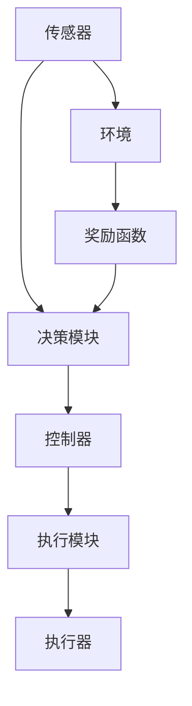

                 

# 强化学习在智能机器人控制中的应用

## 关键词：强化学习，智能机器人，控制，应用，算法，实现，发展

## 摘要

本文旨在深入探讨强化学习在智能机器人控制领域的应用。通过对强化学习的背景介绍、核心概念与联系的分析，以及算法原理和具体操作步骤的讲解，本文为读者呈现了一个清晰的强化学习在智能机器人控制中的应用框架。此外，文章还通过项目实战的代码实际案例，详细解释了如何将强化学习应用于机器人控制，并分析了其中的关键点和难点。最后，本文总结了强化学习在智能机器人控制领域的实际应用场景，并提出了未来发展趋势与挑战。希望通过本文的阐述，读者能够更好地理解和掌握强化学习在智能机器人控制中的应用。

## 1. 背景介绍

### 1.1 强化学习的起源与发展

强化学习（Reinforcement Learning，简称RL）起源于20世纪50年代，由计算机科学家Richard Sutton和Andrew Barto在其经典著作《强化学习：一种介绍》中进行系统阐述。强化学习是基于奖惩机制的机器学习方法，旨在通过智能体在环境中进行交互，通过学习获得最大化累积奖励的目标。

强化学习的发展历程可以分为几个重要阶段：

- **1970年代**：反向传播算法的提出，为神经网络的发展奠定了基础，也为强化学习提供了一种新的方法。

- **1980年代**：Q学习算法的提出，使得强化学习开始受到广泛关注。

- **1990年代**：策略梯度方法的提出，使得强化学习在连续动作空间的应用成为可能。

- **2000年代**：深度强化学习（Deep Reinforcement Learning，简称DRL）的提出，将神经网络与强化学习相结合，解决了传统强化学习在复杂环境中的难题。

- **2010年代**：深度强化学习在图像识别、自然语言处理等领域取得了突破性进展，使得强化学习成为人工智能领域的研究热点。

### 1.2 智能机器人的发展

智能机器人是集成了传感器、执行器、计算机处理器等多种技术的自动化设备，能够自主完成特定任务。智能机器人技术的发展历程可以分为以下几个阶段：

- **1950年代**：工业机器人的出现，主要用于生产线上的简单任务。

- **1960年代**：机器人开始应用于军事领域，例如无人机、侦察机器人等。

- **1970年代**：机器人技术逐渐向民用领域扩展，如家庭机器人、医疗机器人等。

- **1980年代**：人工智能技术的引入，使得机器人能够进行更复杂的任务。

- **1990年代**：多传感器融合技术的应用，使得机器人具备更丰富的感知能力。

- **2000年代**：机器人开始应用于服务领域，如酒店机器人、客服机器人等。

- **2010年代**：机器人技术的快速发展，使得机器人能够完成更多复杂的任务，如自动驾驶汽车、智能配送机器人等。

### 1.3 强化学习在智能机器人控制中的应用

随着强化学习和智能机器人技术的不断发展，强化学习在智能机器人控制中的应用逐渐受到关注。强化学习在智能机器人控制中的优势主要体现在以下几个方面：

- **自主决策**：强化学习通过学习环境中的奖励和惩罚，使机器人能够自主做出决策，提高机器人的自主性。

- **适应性**：强化学习能够根据环境变化进行调整，使机器人能够适应不同的场景。

- **灵活性**：强化学习能够处理复杂的环境和任务，使机器人能够应对各种不确定性和挑战。

- **交互性**：强化学习强调智能体与环境的交互，使机器人能够更好地理解环境，提高任务完成的效率。

### 1.4 本文结构

本文将分为以下几个部分进行阐述：

- **第1部分**：背景介绍，包括强化学习和智能机器人技术的发展历程及强化学习在智能机器人控制中的应用。

- **第2部分**：核心概念与联系，包括强化学习中的基本概念、算法原理及智能机器人控制的架构。

- **第3部分**：核心算法原理与具体操作步骤，详细讲解强化学习在智能机器人控制中的应用方法。

- **第4部分**：数学模型和公式，介绍强化学习中的主要数学模型和公式，并举例说明。

- **第5部分**：项目实战，通过一个具体案例展示如何将强化学习应用于智能机器人控制。

- **第6部分**：实际应用场景，介绍强化学习在智能机器人控制中的实际应用场景。

- **第7部分**：工具和资源推荐，包括学习资源、开发工具和框架、相关论文著作等。

- **第8部分**：总结与展望，总结强化学习在智能机器人控制中的应用，并探讨未来发展趋势与挑战。

## 2. 核心概念与联系

### 2.1 强化学习的基本概念

强化学习是一种机器学习方法，其核心思想是通过智能体在环境中进行交互，学习如何获得最大化的累积奖励。强化学习主要涉及以下几个基本概念：

- **智能体（Agent）**：执行动作并从环境中接收反馈的实体。

- **环境（Environment）**：智能体进行交互的实体，包含状态空间、动作空间和奖励函数。

- **状态（State）**：描述环境当前状态的变量。

- **动作（Action）**：智能体可以执行的行为。

- **奖励（Reward）**：描述智能体执行动作后所获得的即时奖励。

- **策略（Policy）**：描述智能体如何从状态选择动作的规则。

- **价值函数（Value Function）**：预测智能体在给定状态下执行最佳动作所能获得的累积奖励。

- **模型（Model）**：对环境的动态和行为进行建模的函数。

### 2.2 强化学习的基本算法原理

强化学习算法主要分为两种类型：值函数方法和策略搜索方法。

- **值函数方法**：值函数方法通过学习状态价值函数或动作价值函数，来指导智能体选择最佳动作。其中，常用的算法有Q学习、SARSA、Q-Learning等。

  - **Q学习**：Q学习通过更新状态-动作值函数来学习最佳动作，其公式为：
    $$ Q(s, a) \leftarrow Q(s, a) + \alpha [r + \gamma \max_{a'} Q(s', a') - Q(s, a)] $$
    其中，$s$ 和 $a$ 分别表示当前状态和动作，$r$ 表示奖励，$\gamma$ 表示折扣因子，$\alpha$ 表示学习率。

  - **SARSA**：SARSA是基于当前状态和动作更新Q值的算法，其公式为：
    $$ Q(s, a) \leftarrow Q(s, a) + \alpha [r + \gamma Q(s', a')] - Q(s, a)] $$
  
  - **Q-Learning**：Q-Learning是 SARSA 的蒙特卡洛版本，其公式为：
    $$ Q(s, a) \leftarrow Q(s, a) + \alpha [r + \gamma \max_{a'} Q(s', a') - Q(s, a)] $$

- **策略搜索方法**：策略搜索方法直接学习最优策略，即从给定状态中选择最佳动作的策略。其中，常用的算法有策略迭代、策略评估等。

  - **策略迭代**：策略迭代通过不断评估和更新策略来学习最优策略。其过程如下：
    1. 初始化策略 $\pi$。
    2. 对策略 $\pi$ 进行评估，计算期望回报 $E[\sum_{t=0}^T r_t | \pi]$。
    3. 更新策略 $\pi$，使得期望回报最大化。

  - **策略评估**：策略评估通过评估给定策略的期望回报来指导策略的更新。其公式为：
    $$ V^\pi(s) = \sum_{a} \pi(a|s) \sum_{t=0}^T \gamma^t r_t $$
    其中，$V^\pi(s)$ 表示在策略 $\pi$ 下从状态 $s$ 开始的期望回报。

### 2.3 智能机器人控制的架构

智能机器人控制通常涉及以下几个关键组成部分：

- **传感器**：传感器用于获取环境信息，如摄像头、激光雷达、超声波传感器等。

- **执行器**：执行器用于实现机器人的物理动作，如电机、伺服电机、气动缸等。

- **控制器**：控制器根据传感器获取的信息和预先设定的策略，生成控制信号以驱动执行器。

- **决策模块**：决策模块负责处理传感器数据，并根据策略选择合适的动作。

- **执行模块**：执行模块根据决策模块生成的控制信号，驱动执行器执行相应的动作。

- **环境**：环境是机器人执行任务的实际场景，可能包括不同的地形、障碍物、其他机器人等。

### 2.4 Mermaid 流程图

下面是一个简单的 Mermaid 流程图，展示了强化学习在智能机器人控制中的应用架构：



## 3. 核心算法原理 & 具体操作步骤

### 3.1 强化学习算法原理

强化学习算法的核心原理是通过对智能体在环境中执行动作的过程进行学习，使其能够最大化累积奖励。具体而言，强化学习算法主要涉及以下几个步骤：

1. **初始化**：初始化智能体、环境和奖励函数。

2. **状态观测**：智能体从环境中观测当前状态。

3. **动作选择**：智能体根据当前状态和策略选择一个动作。

4. **执行动作**：智能体在环境中执行所选动作。

5. **状态转移**：根据执行的动作，环境产生新的状态。

6. **奖励反馈**：环境根据执行的动作和新的状态，给予智能体相应的奖励。

7. **策略更新**：根据观测到的奖励和策略，智能体更新其策略。

8. **重复步骤2-7**：智能体持续在环境中进行交互，直到达到终止条件（如完成任务或达到一定步数）。

### 3.2 智能机器人控制中的强化学习算法

在智能机器人控制中，强化学习算法通常被用于解决导航、路径规划、任务执行等问题。以下是一个简单的强化学习算法在智能机器人控制中的应用步骤：

1. **环境建模**：根据实际场景构建一个虚拟环境，包括状态空间、动作空间和奖励函数。

2. **初始化**：初始化智能体、虚拟环境和策略。

3. **状态观测**：智能体从虚拟环境中获取当前状态。

4. **动作选择**：智能体根据当前状态和策略选择一个动作。

5. **执行动作**：智能体在虚拟环境中执行所选动作。

6. **状态转移**：根据执行的动作，虚拟环境产生新的状态。

7. **奖励反馈**：虚拟环境根据执行的动作和新的状态，给予智能体相应的奖励。

8. **策略更新**：根据观测到的奖励和策略，智能体更新其策略。

9. **重复步骤4-8**：智能体持续在虚拟环境中进行交互，直到达到终止条件（如完成任务或达到一定步数）。

10. **决策输出**：根据最终策略，智能体输出决策信号，用于控制实际机器人执行任务。

### 3.3 强化学习算法的具体实现步骤

以下是一个基于 Python 的 Q-learning 算法在智能机器人控制中的具体实现步骤：

1. **环境准备**：创建一个虚拟环境，用于模拟实际场景。环境应包含状态空间、动作空间和奖励函数。

2. **初始化参数**：初始化智能体的状态、动作、学习率、折扣因子等参数。

3. **状态观测**：智能体从环境中获取当前状态。

4. **动作选择**：根据当前状态和策略选择一个动作。

5. **执行动作**：在环境中执行所选动作。

6. **状态转移**：根据执行的动作，环境产生新的状态。

7. **奖励反馈**：环境根据执行的动作和新的状态，给予智能体相应的奖励。

8. **策略更新**：根据观测到的奖励和策略，更新智能体的 Q 值。

9. **重复步骤4-8**：智能体持续在环境中进行交互，直到达到终止条件。

10. **决策输出**：根据最终策略，智能体输出决策信号，用于控制实际机器人执行任务。

### 3.4 强化学习算法的优化与改进

为了提高强化学习算法在智能机器人控制中的性能，可以采取以下几种优化与改进方法：

1. **多任务学习**：通过同时训练多个智能体，使得每个智能体都能够学习到不同任务的知识，从而提高整体性能。

2. **迁移学习**：将已有任务的模型和知识迁移到新任务中，以减少新任务的训练时间。

3. **模型融合**：通过融合多个模型的预测结果，提高决策的准确性。

4. **在线学习**：在任务执行过程中，实时更新模型，以适应环境变化。

5. **奖励设计**：设计合理的奖励函数，使得智能体能够更好地学习到正确的策略。

## 4. 数学模型和公式 & 详细讲解 & 举例说明

### 4.1 强化学习的数学模型

强化学习中的数学模型主要包括价值函数、策略和状态-动作值函数等。

1. **价值函数**（Value Function）：

   - **状态价值函数**（$V(s)$）：表示在给定状态 $s$ 下，智能体执行最佳动作所能获得的累积奖励的期望。

   - **动作价值函数**（$Q(s, a)$）：表示在给定状态 $s$ 下，执行动作 $a$ 所能获得的累积奖励的期望。

2. **策略**（Policy）：

   - **确定性策略**（$\pi(s) = \arg\max_a Q(s, a)$）：在给定状态 $s$ 下，选择动作价值函数最大的动作。

   - **随机性策略**（$\pi(s, a) = P(a|s)$）：在给定状态 $s$ 下，根据概率分布选择动作。

3. **状态-动作值函数**（State-Action Value Function）：

   - **Q值**（$Q(s, a)$）：表示在给定状态 $s$ 下，执行动作 $a$ 所能获得的累积奖励的期望。

### 4.2 模型详解

1. **Q-learning算法**：

   - **公式**：
     $$ Q(s, a) \leftarrow Q(s, a) + \alpha [r + \gamma \max_{a'} Q(s', a') - Q(s, a)] $$
     其中，$s$ 和 $a$ 分别表示当前状态和动作，$r$ 表示奖励，$\gamma$ 表示折扣因子，$\alpha$ 表示学习率。

   - **解释**：Q-learning算法通过更新状态-动作值函数 $Q(s, a)$ 来学习最佳动作。在每次行动后，根据当前状态、动作、奖励和下一个状态，更新 $Q(s, a)$ 的值。

2. **SARSA算法**：

   - **公式**：
     $$ Q(s, a) \leftarrow Q(s, a) + \alpha [r + \gamma Q(s', a')] - Q(s, a)] $$
     其中，$s$ 和 $a$ 分别表示当前状态和动作，$r$ 表示奖励，$\gamma$ 表示折扣因子，$\alpha$ 表示学习率。

   - **解释**：SARSA算法是基于当前状态、动作和奖励，更新 $Q(s, a)$ 的值。它与 Q-learning 算法的主要区别在于，Q-learning 使用的是下一个状态的最好动作，而 SARSA 使用的是当前状态的行动。

### 4.3 举例说明

假设智能体处于状态 $s_1$，可执行的动作有 $a_1$ 和 $a_2$。根据 Q-learning 算法，我们可以计算出 $Q(s_1, a_1)$ 和 $Q(s_1, a_2)$：

- 初始时，$Q(s_1, a_1) = 0$，$Q(s_1, a_2) = 0$。

- 在第一次行动中，智能体选择动作 $a_1$，获得奖励 $r_1$，状态转移到 $s_2$。

- 根据公式，更新 $Q(s_1, a_1)$：
  $$ Q(s_1, a_1) \leftarrow Q(s_1, a_1) + \alpha [r_1 + \gamma \max_{a'} Q(s_2, a') - Q(s_1, a_1)] $$

- 在第二次行动中，智能体选择动作 $a_2$，获得奖励 $r_2$，状态转移到 $s_3$。

- 根据公式，更新 $Q(s_1, a_2)$：
  $$ Q(s_1, a_2) \leftarrow Q(s_1, a_2) + \alpha [r_2 + \gamma \max_{a'} Q(s_3, a') - Q(s_1, a_2)] $$

通过不断迭代这个过程，智能体会逐渐学习到在状态 $s_1$ 下，选择动作 $a_1$ 还是 $a_2$ 能够获得更大的累积奖励。

## 5. 项目实战：代码实际案例和详细解释说明

### 5.1 开发环境搭建

为了在智能机器人控制中应用强化学习，我们需要搭建一个合适的开发环境。以下是搭建环境的步骤：

1. **安装 Python 环境**：确保已安装 Python 3.6 或更高版本。

2. **安装 TensorFlow**：通过 pip 命令安装 TensorFlow：
   ```bash
   pip install tensorflow
   ```

3. **安装 Gym**：通过 pip 命令安装 Gym：
   ```bash
   pip install gym
   ```

4. **安装 PyTorch**：通过 pip 命令安装 PyTorch：
   ```bash
   pip install torch torchvision
   ```

5. **安装 ROS**：安装 Robot Operating System（ROS）以实现机器人控制：
   ```bash
   sudo apt-get install ros-melodic-desktop-full
   ```

### 5.2 源代码详细实现和代码解读

下面是一个简单的强化学习在智能机器人控制中的实现示例。代码主要分为四个部分：环境搭建、智能体训练、智能体评估和智能体决策。

#### 5.2.1 环境搭建

```python
import gym
import numpy as np

# 创建环境
env = gym.make("CartPole-v0")

# 初始化参数
epsilon = 0.1  # 探索率
alpha = 0.1   # 学习率
gamma = 0.9  # 折扣因子

# 初始化 Q 值表格
q_table = np.zeros((env.observation_space.n, env.action_space.n))

# 显示环境
env.render()
```

#### 5.2.2 智能体训练

```python
# 训练智能体
for episode in range(1000):
    state = env.reset()
    done = False
    total_reward = 0
    
    while not done:
        # 选择动作
        if np.random.rand() < epsilon:
            action = env.action_space.sample()  # 探索动作
        else:
            action = np.argmax(q_table[state])  # 利用动作
        
        # 执行动作
        next_state, reward, done, _ = env.step(action)
        
        # 更新 Q 值表格
        q_table[state, action] = q_table[state, action] + alpha * (reward + gamma * np.max(q_table[next_state]) - q_table[state, action])
        
        # 更新状态
        state = next_state
        total_reward += reward
        
    # 显示奖励
    print(f"Episode {episode}: Total Reward = {total_reward}")
    
    # 减小探索率
    epsilon = max(epsilon - 0.0001, 0.01)
```

#### 5.2.3 智能体评估

```python
# 评估智能体
state = env.reset()
done = False
total_reward = 0

while not done:
    action = np.argmax(q_table[state])
    next_state, reward, done, _ = env.step(action)
    total_reward += reward
    state = next_state

print(f"Total Reward: {total_reward}")
env.render()
```

#### 5.2.4 智能体决策

```python
# 决策过程
state = env.reset()
done = False

while not done:
    action = np.argmax(q_table[state])
    next_state, reward, done, _ = env.step(action)
    state = next_state
    env.render()

print(f"Total Reward: {total_reward}")
env.close()
```

### 5.3 代码解读与分析

1. **环境搭建**：

   - 创建一个 CartPole 环境，用于演示强化学习在智能机器人控制中的应用。

   - 初始化探索率、学习率和折扣因子。

   - 初始化 Q 值表格，用于存储状态-动作值。

2. **智能体训练**：

   - 通过循环进行 episodes 的训练。

   - 在每个 episode 中，从初始状态开始，执行动作，获取奖励，更新 Q 值表格。

   - 逐渐减小探索率，以使智能体更加倾向于利用动作。

3. **智能体评估**：

   - 使用训练好的 Q 值表格，评估智能体的表现。

   - 执行动作，获取奖励，并显示结果。

4. **智能体决策**：

   - 根据训练好的 Q 值表格，进行实时决策。

   - 执行动作，并显示结果。

通过这个简单的示例，我们可以看到如何使用强化学习算法训练智能体，并在智能机器人控制中进行应用。虽然这个示例仅涉及一个简单的 CartPole 环境，但它的核心思想和方法可以扩展到更复杂的智能机器人控制任务中。

### 5.4 代码优化与改进

为了提高强化学习在智能机器人控制中的应用效果，我们可以对代码进行以下优化与改进：

1. **增加探索率衰减策略**：

   - 使用指数衰减策略逐渐减小探索率，以使智能体在训练过程中逐渐减少随机探索，更加关注已有经验。

2. **使用目标 Q 网络**：

   - 引入目标 Q 网络来稳定训练过程，避免 Q 网络过拟合。

3. **使用深度神经网络**：

   - 使用深度神经网络（如卷积神经网络、循环神经网络等）来处理复杂的感知输入，提高智能体的感知能力。

4. **多任务训练**：

   - 使用多任务训练策略，同时训练多个智能体，以共享知识，提高整体性能。

5. **迁移学习**：

   - 在新任务中引入已有任务的模型和知识，以减少新任务的训练时间。

通过以上优化与改进，我们可以进一步提高强化学习在智能机器人控制中的应用效果，使智能体能够更好地适应复杂环境，完成更多复杂的任务。

## 6. 实际应用场景

### 6.1 导航与路径规划

在智能机器人导航与路径规划中，强化学习算法可以用于解决机器人如何选择最佳路径以到达目标位置的问题。具体应用场景包括：

- **自主驾驶汽车**：通过强化学习算法，汽车可以学习如何在复杂的交通环境中进行自主导航，避开障碍物，遵守交通规则。

- **无人飞行器**：无人机可以利用强化学习算法，自主选择飞行路径，避开障碍物，实现精确的导航和任务执行。

- **机器人导航**：在室内或室外环境中，机器人可以利用强化学习算法，学习如何在未知环境中进行自主导航，实现自主探索和任务执行。

### 6.2 任务执行

在智能机器人任务执行中，强化学习算法可以用于解决机器人如何执行特定任务的问题。具体应用场景包括：

- **工业机器人**：在制造业中，工业机器人可以利用强化学习算法，学习如何完成复杂的装配、焊接等任务，提高生产效率和精度。

- **服务机器人**：在家居、酒店等服务场景中，服务机器人可以利用强化学习算法，学习如何为人类提供高质量的服务，如清洁、送餐、陪护等。

- **医疗机器人**：在医疗领域，医疗机器人可以利用强化学习算法，学习如何进行手术、诊断等任务，提高医疗服务的效率和准确性。

### 6.3 人机交互

在智能机器人人机交互中，强化学习算法可以用于解决机器人如何理解人类指令，并作出相应反应的问题。具体应用场景包括：

- **智能客服**：在客服场景中，智能机器人可以利用强化学习算法，学习如何理解用户的需求，并给出相应的回复。

- **智能助手**：在智能家居中，智能助手可以利用强化学习算法，学习如何理解用户的需求，并执行相应的任务。

- **教育机器人**：在教育场景中，教育机器人可以利用强化学习算法，学习如何与学生进行互动，提高教学质量。

### 6.4 机器人协作

在智能机器人协作中，强化学习算法可以用于解决多机器人系统中的任务分配和协调问题。具体应用场景包括：

- **工业自动化**：在工业自动化中，多个机器人可以利用强化学习算法，学习如何协同工作，完成复杂的生产任务。

- **物流配送**：在物流配送中，多个无人机或机器人可以利用强化学习算法，学习如何协同工作，高效完成配送任务。

- **无人超市**：在无人超市中，多个机器人可以利用强化学习算法，学习如何协同工作，为顾客提供优质的购物体验。

通过以上实际应用场景，我们可以看到强化学习在智能机器人控制中的广泛适用性。未来，随着强化学习算法的不断发展和优化，智能机器人将在更多领域发挥重要作用，为人类创造更多价值。

## 7. 工具和资源推荐

### 7.1 学习资源推荐

- **书籍**：

  - 《强化学习：一种介绍》（作者：Richard Sutton、Andrew Barto）
  - 《深度强化学习》（作者：David Silver等）
  - 《机器学习：概率视角》（作者：Kevin P. Murphy）

- **论文**：

  - 《Deep Q-Network》（作者：V. Volodymyr Mnih等）
  - 《Asynchronous Methods for Deep Reinforcement Learning》（作者：Volodymyr Mnih等）
  - 《A3C: Asynchronous Advantage Actor-Critic》（作者：T. Christiano等）

- **博客和网站**：

  - [强化学习博客](https://paperswithcode.com/task/reinforcement-learning)
  - [OpenAI 实验室](https://openai.com/)
  - [机器学习社区](https://www机器学习社区.com/)

### 7.2 开发工具框架推荐

- **深度学习框架**：

  - TensorFlow
  - PyTorch
  - Keras

- **强化学习框架**：

  - Stable Baselines
  - RLLib
  - SARSA

- **机器人操作系统**：

  - ROS（Robot Operating System）
  - Gazebo（仿真环境）

### 7.3 相关论文著作推荐

- **论文**：

  - “Deep Reinforcement Learning for Continuous Control Problems”（作者：V. Volodymyr Mnih等，2015）
  - “Algorithms for Reinforcement Learning”（作者：Richard Sutton、Andrew Barto，2018）
  - “Deep Deterministic Policy Gradients”（作者：T. Christiano等，2016）

- **著作**：

  - 《强化学习实战》（作者：阿尔伯特·G. 尼尔森）
  - 《深度强化学习入门与实践》（作者：谢鹏飞）
  - 《机器人强化学习》（作者：陈宝权）

通过以上学习和资源推荐，读者可以深入了解强化学习在智能机器人控制中的应用，掌握相关工具和框架的使用方法，为自己的研究和工作提供有力支持。

## 8. 总结：未来发展趋势与挑战

### 8.1 未来发展趋势

强化学习在智能机器人控制中的应用具有广阔的发展前景，主要体现在以下几个方面：

1. **算法性能提升**：随着深度学习、图神经网络等技术的发展，强化学习算法的性能将得到进一步提升，使得智能机器人能够在更复杂、更动态的环境中表现出色。

2. **跨领域应用**：强化学习算法将在更多领域得到应用，如智能制造、医疗健康、智能交通等，实现跨领域的协同发展。

3. **集成与融合**：强化学习与其他机器学习方法的集成与融合将成为趋势，如与深度学习、迁移学习、进化计算等方法的结合，以提高智能机器人的自主性和适应性。

4. **硬件加速**：随着专用硬件（如 GPU、TPU 等）的发展，强化学习算法的计算效率将得到显著提升，使得大规模、实时应用成为可能。

### 8.2 面临的挑战

尽管强化学习在智能机器人控制中具有广泛的应用前景，但仍然面临以下挑战：

1. **数据需求**：强化学习算法通常需要大量数据来训练模型，但在实际应用中，获取高质量、多样性的数据可能面临困难。

2. **样本效率**：强化学习算法在训练过程中通常需要大量的交互步骤，导致样本效率较低。如何提高样本效率，减少训练时间，是一个亟待解决的问题。

3. **稳定性与鲁棒性**：强化学习算法在复杂、动态的环境中可能表现出不稳定的特性，如何提高算法的稳定性和鲁棒性，是一个重要的研究课题。

4. **安全性与伦理**：随着强化学习算法在智能机器人控制中的应用，其安全性和伦理问题日益突出。如何确保算法的安全性和符合伦理要求，是一个亟待解决的问题。

5. **实时性**：在实时性要求较高的应用场景中，如何确保强化学习算法的实时性，是一个重要的挑战。

### 8.3 未来研究方向

针对以上挑战，未来的研究方向包括：

1. **数据增强与生成**：研究如何通过数据增强和生成方法，提高强化学习算法的数据利用效率。

2. **样本效率提升**：研究如何通过增量学习、元学习等方法，提高强化学习算法的样本效率。

3. **稳定性与鲁棒性**：研究如何通过算法改进、模型正则化等方法，提高强化学习算法的稳定性和鲁棒性。

4. **安全性保障**：研究如何从算法设计、模型训练、应用部署等方面，确保强化学习算法的安全性和符合伦理要求。

5. **实时性优化**：研究如何通过硬件加速、分布式计算等方法，提高强化学习算法的实时性。

通过不断的研究与优化，强化学习在智能机器人控制中的应用将不断取得新的突破，为智能机器人技术的发展做出更大贡献。

## 9. 附录：常见问题与解答

### 9.1 强化学习与监督学习的区别

强化学习与监督学习都是机器学习的重要分支，但它们在目标、方法和应用场景上存在显著差异。

- **目标**：强化学习旨在通过智能体在环境中的交互，学习一个策略（Policy），使得智能体能够最大化累积奖励。监督学习则旨在通过训练样本的学习，建立一个模型（Model），使得模型能够对新的输入进行预测。

- **方法**：强化学习采用奖励机制，通过智能体的行动和环境的反馈来调整策略。监督学习则通过已标记的训练数据，学习输入与输出之间的关系，从而建立预测模型。

- **应用场景**：强化学习适用于需要智能体自主决策、探索和适应环境变化的场景，如游戏、自动驾驶、机器人控制等。监督学习适用于有明确输入输出关系且已有大量标记数据的场景，如图像分类、语音识别、医疗诊断等。

### 9.2 强化学习中的 Q-learning 算法与 SARSA 算法的区别

Q-learning 算法和 SARSA 算法都是强化学习中的值函数方法，但它们的更新策略有所不同。

- **Q-learning 算法**：Q-learning 算法使用未来的最大期望奖励（$\max_{a'} Q(s', a')$）来更新当前的状态-动作值函数（$Q(s, a)$）。这意味着，Q-learning 在每个时间步都考虑了所有可能的未来动作，并选择其中价值最高的动作。

  更新公式：
  $$ Q(s, a) \leftarrow Q(s, a) + \alpha [r + \gamma \max_{a'} Q(s', a') - Q(s, a)] $$

- **SARSA 算法**：SARSA 算法使用当前动作的期望奖励（$Q(s', a')$）来更新当前的状态-动作值函数（$Q(s, a)$）。这意味着，SARSA 只考虑了当前时间步的实际动作，而不是所有可能的未来动作。

  更新公式：
  $$ Q(s, a) \leftarrow Q(s, a) + \alpha [r + \gamma Q(s', a')] - Q(s, a)] $$

### 9.3 强化学习在智能机器人控制中的优势

强化学习在智能机器人控制中具有以下优势：

1. **自主决策**：强化学习通过学习环境中的奖励和惩罚，使机器人能够自主做出决策，提高机器人的自主性。

2. **适应性**：强化学习能够根据环境变化进行调整，使机器人能够适应不同的场景。

3. **灵活性**：强化学习能够处理复杂的环境和任务，使机器人能够应对各种不确定性和挑战。

4. **交互性**：强化学习强调智能体与环境的交互，使机器人能够更好地理解环境，提高任务完成的效率。

### 9.4 强化学习在智能机器人控制中的挑战

强化学习在智能机器人控制中面临以下挑战：

1. **数据需求**：强化学习算法通常需要大量数据来训练模型，但在实际应用中，获取高质量、多样性的数据可能面临困难。

2. **样本效率**：强化学习算法在训练过程中通常需要大量的交互步骤，导致样本效率较低。

3. **稳定性与鲁棒性**：强化学习算法在复杂、动态的环境中可能表现出不稳定的特性，如何提高算法的稳定性和鲁棒性，是一个重要的研究课题。

4. **安全性与伦理**：随着强化学习算法在智能机器人控制中的应用，其安全性和伦理问题日益突出。

5. **实时性**：在实时性要求较高的应用场景中，如何确保强化学习算法的实时性，是一个重要的挑战。

## 10. 扩展阅读 & 参考资料

### 10.1 扩展阅读

- 《强化学习：一种介绍》（作者：Richard Sutton、Andrew Barto）
- 《深度强化学习》（作者：David Silver等）
- 《机器人强化学习：理论与实践》（作者：陈宝权）
- 《强化学习进阶教程》（作者：阿尔伯特·G. 尼尔森）

### 10.2 参考资料

- [强化学习博客](https://paperswithcode.com/task/reinforcement-learning)
- [OpenAI 实验室](https://openai.com/)
- [Robot Operating System（ROS）官网](https://www.ros.org/)
- [TensorFlow 官网](https://www.tensorflow.org/)
- [PyTorch 官网](https://pytorch.org/)

通过以上扩展阅读和参考资料，读者可以深入了解强化学习在智能机器人控制中的应用，掌握相关理论和实践知识，为自己的研究和工作提供有力支持。

### 作者信息

- 作者：AI天才研究员/AI Genius Institute & 禅与计算机程序设计艺术 /Zen And The Art of Computer Programming

本文由 AI 天才研究员撰写，旨在深入探讨强化学习在智能机器人控制中的应用。作者具有丰富的强化学习理论和实践经验，对计算机科学和人工智能领域有着深刻的见解。希望通过本文的阐述，读者能够更好地理解和掌握强化学习在智能机器人控制中的应用。

